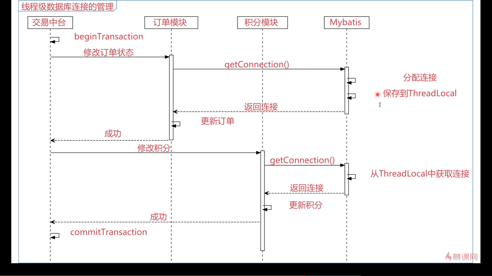

### 一致性问题解决办法

* **排队** ：(例如 ：锁、互斥量、管程、屏障)
* **投票**  ：(例如:  Paxos  、 Raft) 

### ThreadLocal 是什么

* 定义：提供线程局部变量；一个线程局部变量在多个线程中，分别有独立的值**(副本)**
* 特点 ： 简单(**开箱即用**)、快速 (**无额外开销**)、安全(**线程安全**)
* 场景 : 多线程场景(**资源持有、线程一致性、线程安全等场景**)
* 实现原理 ：Java中用哈希表实现
* 应用范围 : 几乎所有提供多线程特征的语言

### ThreadLocal模型


### ThreadLocal实现原理


### ThreadLocal API

* **构造函数ThreadLocal<T>()**
* **初始化initialValue()**
* **访问器get/set**
* **回收remove**

### ThreadLocal四种场景

1. 场景一

   

2. 场景二

   

3. 场景三

   

4. 场景四

   

### 总结

1. 持有资源  : 持有资源供线程的各个部分使用，全局获取，减少编程难度
2. 线程一致性 ： 帮助需要保持线程一致性的资源(如数据库事务)维护一致性，降低编程难度
3. 线程安全：帮助只考虑单线程的程序库，无缝向多线程场景迁移
4. 分布式计算：帮助分布式计算场景的各个线程累计局部计算结果

### 减少同步

```java
public class Val<T> {

    private T v;

    public void set(T _v){
        v = _v;
    }

    public T get(){
        return v;
    }
}

//完全避免同步难
//缩小同步范围(简单)+ThreadLocal解决问题
---------------------------------------------------------------------------------------

@RestController
public class StatController {


    static HashSet<Val<Integer>> set = new HashSet<>();

    synchronized static void addSet(Val<Integer> val) {
        set.add(val);
    }

    static ThreadLocal<Val<Integer>> c = new ThreadLocal<Val<Integer>>() {
        @Override
        protected Val<Integer> initialValue() {
            Val<Integer> val = new Val<>();
            val.set(0);
            addSet(val);
            return val;
        }
    };

    void _add() throws InterruptedException {
        Thread.sleep(100);
        Val<Integer> v = c.get();
        v.set(v.get() + 1);
    }

    @RequestMapping("/stat")
    public Integer stat() {
        return set.stream().map(x -> x.get()).reduce((a, x) -> a + x).get();
    }


    @RequestMapping("/add")
    public Integer add() throws InterruptedException {
        _add();
        return 1;
    }

}

```

### 源码选学01 Quartz : SimpleSemaphore

```java
/* 
 * All content copyright Terracotta, Inc., unless otherwise indicated. All rights reserved.
 * 
 * Licensed under the Apache License, Version 2.0 (the "License"); you may not 
 * use this file except in compliance with the License. You may obtain a copy 
 * of the License at 
 * 
 *   http://www.apache.org/licenses/LICENSE-2.0 
 *   
 * Unless required by applicable law or agreed to in writing, software 
 * distributed under the License is distributed on an "AS IS" BASIS, WITHOUT 
 * WARRANTIES OR CONDITIONS OF ANY KIND, either express or implied. See the 
 * License for the specific language governing permissions and limitations 
 * under the License.
 * 
 */

package org.quartz.impl.jdbcjobstore;

import java.sql.Connection;
import java.util.HashSet;

import org.slf4j.Logger;
import org.slf4j.LoggerFactory;

/**
 * Internal in-memory lock handler for providing thread/resource locking in 
 * order to protect resources from being altered by multiple threads at the 
 * same time.
 * 
 * @author jhouse
 */
public class SimpleSemaphore implements Semaphore {

    /*
     * ~~~~~~~~~~~~~~~~~~~~~~~~~~~~~~~~~~~~~~~~~~~~~~~~~~~~~~~~~~~~~~~~~~~~~~~~~
     * 
     * Data members.
     * 
     * ~~~~~~~~~~~~~~~~~~~~~~~~~~~~~~~~~~~~~~~~~~~~~~~~~~~~~~~~~~~~~~~~~~~~~~~~~
     */

    ThreadLocal<HashSet<String>> lockOwners = new ThreadLocal<HashSet<String>>();

    HashSet<String> locks = new HashSet<String>();

    private final Logger log = LoggerFactory.getLogger(getClass());

    /*
     * ~~~~~~~~~~~~~~~~~~~~~~~~~~~~~~~~~~~~~~~~~~~~~~~~~~~~~~~~~~~~~~~~~~~~~~~~~
     * 
     * Interface.
     * 
     * ~~~~~~~~~~~~~~~~~~~~~~~~~~~~~~~~~~~~~~~~~~~~~~~~~~~~~~~~~~~~~~~~~~~~~~~~~
     */

    protected Logger getLog() {
        return log;
    }

    private HashSet<String> getThreadLocks() {
        HashSet<String> threadLocks = lockOwners.get();
        if (threadLocks == null) {
            threadLocks = new HashSet<String>();
            lockOwners.set(threadLocks);
        }
        return threadLocks;
    }

    /**
     * Grants a lock on the identified resource to the calling thread (blocking
     * until it is available).
     * 
     * @return true if the lock was obtained.
     */
    public synchronized boolean obtainLock(Connection conn, String lockName) {

        lockName = lockName.intern();

        if(log.isDebugEnabled()) {
            log.debug(
                "Lock '" + lockName + "' is desired by: "
                        + Thread.currentThread().getName());
        }

        if (!isLockOwner(lockName)) {
            if(log.isDebugEnabled()) {
                log.debug(
                    "Lock '" + lockName + "' is being obtained: "
                            + Thread.currentThread().getName());
            }
            while (locks.contains(lockName)) {
                try {
                    this.wait();
                } catch (InterruptedException ie) {
                    if(log.isDebugEnabled()) {
                        log.debug(
                            "Lock '" + lockName + "' was not obtained by: "
                                    + Thread.currentThread().getName());
                    }
                }
            }

            if(log.isDebugEnabled()) {
                log.debug(
                    "Lock '" + lockName + "' given to: "
                            + Thread.currentThread().getName());
            }
            getThreadLocks().add(lockName);
            locks.add(lockName);
        } else if(log.isDebugEnabled()) {
            log.debug(
                "Lock '" + lockName + "' already owned by: "
                        + Thread.currentThread().getName()
                        + " -- but not owner!",
                new Exception("stack-trace of wrongful returner"));
        }

        return true;
    }

    /**
     * Release the lock on the identified resource if it is held by the calling
     * thread.
     */
    public synchronized void releaseLock(String lockName) {

        lockName = lockName.intern();

        if (isLockOwner(lockName)) {
            if(getLog().isDebugEnabled()) {
                getLog().debug(
                    "Lock '" + lockName + "' retuned by: "
                            + Thread.currentThread().getName());
            }
            getThreadLocks().remove(lockName);
            locks.remove(lockName);
            this.notifyAll();
        } else if (getLog().isDebugEnabled()) {
            getLog().debug(
                "Lock '" + lockName + "' attempt to retun by: "
                        + Thread.currentThread().getName()
                        + " -- but not owner!",
                new Exception("stack-trace of wrongful returner"));
        }
    }

    /**
     * Determine whether the calling thread owns a lock on the identified
     * resource.
     */
    public synchronized boolean isLockOwner(String lockName) {

        lockName = lockName.intern();

        return getThreadLocks().contains(lockName);
    }

    /**
     * This Semaphore implementation does not use the database.
     */
    public boolean requiresConnection() {
        return false;
    }
}


//Quartz 的SimpleSemaphore提供资源隔离
//SimpleSemaphore中的lockOwners(ThreadLocal)为重度锁操作前置过滤
```

### 源码选学2 Mybatis : SqlSessionManager

```java
public class SqlSessionManager implements SqlSessionFactory, SqlSession {

  private final SqlSessionFactory sqlSessionFactory;
  private final SqlSession sqlSessionProxy;

  private final ThreadLocal<SqlSession> localSqlSession = new ThreadLocal<>();

  private SqlSessionManager(SqlSessionFactory sqlSessionFactory) {
    this.sqlSessionFactory = sqlSessionFactory;
    this.sqlSessionProxy = (SqlSession) Proxy.newProxyInstance(
        SqlSessionFactory.class.getClassLoader(),
        new Class[]{SqlSession.class},
        new SqlSessionInterceptor());
  }

  public static SqlSessionManager newInstance(Reader reader) {
    return new SqlSessionManager(new SqlSessionFactoryBuilder().build(reader, null, null));
  }

  public static SqlSessionManager newInstance(Reader reader, String environment) {
    return new SqlSessionManager(new SqlSessionFactoryBuilder().build(reader, environment, null));
  }

  public static SqlSessionManager newInstance(Reader reader, Properties properties) {
    return new SqlSessionManager(new SqlSessionFactoryBuilder().build(reader, null, properties));
  }

  public static SqlSessionManager newInstance(InputStream inputStream) {
    return new SqlSessionManager(new SqlSessionFactoryBuilder().build(inputStream, null, null));
  }

  public static SqlSessionManager newInstance(InputStream inputStream, String environment) {
    return new SqlSessionManager(new SqlSessionFactoryBuilder().build(inputStream, environment, null));
  }

  public static SqlSessionManager newInstance(InputStream inputStream, Properties properties) {
    return new SqlSessionManager(new SqlSessionFactoryBuilder().build(inputStream, null, properties));
  }

  public static SqlSessionManager newInstance(SqlSessionFactory sqlSessionFactory) {
    return new SqlSessionManager(sqlSessionFactory);
  }

  public void startManagedSession() {
    this.localSqlSession.set(openSession());
  }

  public void startManagedSession(boolean autoCommit) {
    this.localSqlSession.set(openSession(autoCommit));
  }

  public void startManagedSession(Connection connection) {
    this.localSqlSession.set(openSession(connection));
  }

  public void startManagedSession(TransactionIsolationLevel level) {
    this.localSqlSession.set(openSession(level));
  }

  public void startManagedSession(ExecutorType execType) {
    this.localSqlSession.set(openSession(execType));
  }

  public void startManagedSession(ExecutorType execType, boolean autoCommit) {
    this.localSqlSession.set(openSession(execType, autoCommit));
  }

  public void startManagedSession(ExecutorType execType, TransactionIsolationLevel level) {
    this.localSqlSession.set(openSession(execType, level));
  }

  public void startManagedSession(ExecutorType execType, Connection connection) {
    this.localSqlSession.set(openSession(execType, connection));
  }

  public boolean isManagedSessionStarted() {
    return this.localSqlSession.get() != null;
  }

  @Override
  public SqlSession openSession() {
    return sqlSessionFactory.openSession();
  }

  @Override
  public SqlSession openSession(boolean autoCommit) {
    return sqlSessionFactory.openSession(autoCommit);
  }

  @Override
  public SqlSession openSession(Connection connection) {
    return sqlSessionFactory.openSession(connection);
  }

  @Override
  public SqlSession openSession(TransactionIsolationLevel level) {
    return sqlSessionFactory.openSession(level);
  }

  @Override
  public SqlSession openSession(ExecutorType execType) {
    return sqlSessionFactory.openSession(execType);
  }

  @Override
  public SqlSession openSession(ExecutorType execType, boolean autoCommit) {
    return sqlSessionFactory.openSession(execType, autoCommit);
  }

  @Override
  public SqlSession openSession(ExecutorType execType, TransactionIsolationLevel level) {
    return sqlSessionFactory.openSession(execType, level);
  }

  @Override
  public SqlSession openSession(ExecutorType execType, Connection connection) {
    return sqlSessionFactory.openSession(execType, connection);
  }

  @Override
  public Configuration getConfiguration() {
    return sqlSessionFactory.getConfiguration();
  }

  @Override
  public <T> T selectOne(String statement) {
    return sqlSessionProxy.selectOne(statement);
  }

  @Override
  public <T> T selectOne(String statement, Object parameter) {
    return sqlSessionProxy.selectOne(statement, parameter);
  }

  @Override
  public <K, V> Map<K, V> selectMap(String statement, String mapKey) {
    return sqlSessionProxy.selectMap(statement, mapKey);
  }

  @Override
  public <K, V> Map<K, V> selectMap(String statement, Object parameter, String mapKey) {
    return sqlSessionProxy.selectMap(statement, parameter, mapKey);
  }

  @Override
  public <K, V> Map<K, V> selectMap(String statement, Object parameter, String mapKey, RowBounds rowBounds) {
    return sqlSessionProxy.selectMap(statement, parameter, mapKey, rowBounds);
  }

  @Override
  public <T> Cursor<T> selectCursor(String statement) {
    return sqlSessionProxy.selectCursor(statement);
  }

  @Override
  public <T> Cursor<T> selectCursor(String statement, Object parameter) {
    return sqlSessionProxy.selectCursor(statement, parameter);
  }

  @Override
  public <T> Cursor<T> selectCursor(String statement, Object parameter, RowBounds rowBounds) {
    return sqlSessionProxy.selectCursor(statement, parameter, rowBounds);
  }

  @Override
  public <E> List<E> selectList(String statement) {
    return sqlSessionProxy.selectList(statement);
  }

  @Override
  public <E> List<E> selectList(String statement, Object parameter) {
    return sqlSessionProxy.selectList(statement, parameter);
  }

  @Override
  public <E> List<E> selectList(String statement, Object parameter, RowBounds rowBounds) {
    return sqlSessionProxy.selectList(statement, parameter, rowBounds);
  }

  @Override
  public void select(String statement, ResultHandler handler) {
    sqlSessionProxy.select(statement, handler);
  }

  @Override
  public void select(String statement, Object parameter, ResultHandler handler) {
    sqlSessionProxy.select(statement, parameter, handler);
  }

  @Override
  public void select(String statement, Object parameter, RowBounds rowBounds, ResultHandler handler) {
    sqlSessionProxy.select(statement, parameter, rowBounds, handler);
  }

  @Override
  public int insert(String statement) {
    return sqlSessionProxy.insert(statement);
  }

  @Override
  public int insert(String statement, Object parameter) {
    return sqlSessionProxy.insert(statement, parameter);
  }

  @Override
  public int update(String statement) {
    return sqlSessionProxy.update(statement);
  }

  @Override
  public int update(String statement, Object parameter) {
    return sqlSessionProxy.update(statement, parameter);
  }

  @Override
  public int delete(String statement) {
    return sqlSessionProxy.delete(statement);
  }

  @Override
  public int delete(String statement, Object parameter) {
    return sqlSessionProxy.delete(statement, parameter);
  }

  @Override
  public <T> T getMapper(Class<T> type) {
    return getConfiguration().getMapper(type, this);
  }

  @Override
  public Connection getConnection() {
    final SqlSession sqlSession = localSqlSession.get();
    if (sqlSession == null) {
      throw new SqlSessionException("Error:  Cannot get connection.  No managed session is started.");
    }
    return sqlSession.getConnection();
  }

  @Override
  public void clearCache() {
    final SqlSession sqlSession = localSqlSession.get();
    if (sqlSession == null) {
      throw new SqlSessionException("Error:  Cannot clear the cache.  No managed session is started.");
    }
    sqlSession.clearCache();
  }

  @Override
  public void commit() {
    final SqlSession sqlSession = localSqlSession.get();
    if (sqlSession == null) {
      throw new SqlSessionException("Error:  Cannot commit.  No managed session is started.");
    }
    sqlSession.commit();
  }

  @Override
  public void commit(boolean force) {
    final SqlSession sqlSession = localSqlSession.get();
    if (sqlSession == null) {
      throw new SqlSessionException("Error:  Cannot commit.  No managed session is started.");
    }
    sqlSession.commit(force);
  }

  @Override
  public void rollback() {
    final SqlSession sqlSession = localSqlSession.get();
    if (sqlSession == null) {
      throw new SqlSessionException("Error:  Cannot rollback.  No managed session is started.");
    }
    sqlSession.rollback();
  }

  @Override
  public void rollback(boolean force) {
    final SqlSession sqlSession = localSqlSession.get();
    if (sqlSession == null) {
      throw new SqlSessionException("Error:  Cannot rollback.  No managed session is started.");
    }
    sqlSession.rollback(force);
  }

  @Override
  public List<BatchResult> flushStatements() {
    final SqlSession sqlSession = localSqlSession.get();
    if (sqlSession == null) {
      throw new SqlSessionException("Error:  Cannot rollback.  No managed session is started.");
    }
    return sqlSession.flushStatements();
  }

  @Override
  public void close() {
    final SqlSession sqlSession = localSqlSession.get();
    if (sqlSession == null) {
      throw new SqlSessionException("Error:  Cannot close.  No managed session is started.");
    }
    try {
      sqlSession.close();
    } finally {
      localSqlSession.set(null);
    }
  }

  private class SqlSessionInterceptor implements InvocationHandler {
    public SqlSessionInterceptor() {
        // Prevent Synthetic Access
    }

    @Override
    public Object invoke(Object proxy, Method method, Object[] args) throws Throwable {
      final SqlSession sqlSession = SqlSessionManager.this.localSqlSession.get();
      if (sqlSession != null) {
        try {
          return method.invoke(sqlSession, args);
        } catch (Throwable t) {
          throw ExceptionUtil.unwrapThrowable(t);
        }
      } else {
        try (SqlSession autoSqlSession = openSession()) {
          try {
            final Object result = method.invoke(autoSqlSession, args);
            autoSqlSession.commit();
            return result;
          } catch (Throwable t) {
            autoSqlSession.rollback();
            throw ExceptionUtil.unwrapThrowable(t);
          }
        }
      }
    }
  }

}
```




### 源码选学03：分布式事务(选自Spring)


```java
final class TransactionContextHolder {

	private final Deque<TransactionContext> transactionStack;


	TransactionContextHolder(Deque<TransactionContext> transactionStack) {
		this.transactionStack = transactionStack;
	}


	/**
	 * Return the current {@link TransactionContext}.
	 * @throws NoTransactionException if no transaction is ongoing
	 */
	TransactionContext currentContext() {
		TransactionContext context = this.transactionStack.peek();
		if (context == null) {
			throw new NoTransactionException("No transaction in context");
		}
		return context;
	}

	/**
	 * Create a new {@link TransactionContext}.
	 */
	TransactionContext createContext() {
		TransactionContext context = this.transactionStack.peek();
		if (context != null) {
			context = new TransactionContext(context);
		}
		else {
			context = new TransactionContext();
		}
		this.transactionStack.push(context);
		return context;
	}

	/**
	 * Check whether the holder has a {@link TransactionContext}.
	 * @return {@literal true} if a {@link TransactionContext} is associated
	 */
	boolean hasContext() {
		return !this.transactionStack.isEmpty();
	}

}
```

