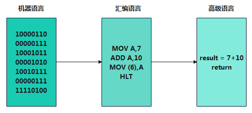
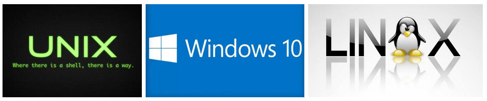

# 第01章_C语言入门

讲师：尚硅谷-宋红康（江湖人称：康师傅）

官网：[http://www.atguigu.com](http://www.atguigu.com/)

***

### 适合对象

- 考研同学，且考试科目中包含数据结构等（需要使用C/C++写代码）
- 考研同学，考试科目中包含C/C++程序设计语言
- 零基础的编程自学者、爱好者
- 想从事嵌入式开发的语言薄弱的同学
- 参加毕业设计的同学


## 本章专题脉络


## 1、初识计算机语言

### 1.1 计算机语言是什么

- **人类语言**：是人与人之间用于沟通的一种方式。例如：中国人与中国人用普通话沟通。而中国人要和英国人交流，可以使用普通话或英语。

- **计算机编程语言**，就是人与计算机交流的方式。人们可以使用`编程语言`对计算机下达`命令`，让计算机完成人们需要的功能。
  - 计算机语言有很多种。如：C 、C++、Java、Go、JavaScript、Python，Scala等。

> 体会：语言 = 语法 + 逻辑

### 1.2 计算机语言简史

* **第一代：机器语言（相当于人类的石器时代）**

  * 1946年2月14日，世界上第一台计算机`ENAC`诞生，使用的是最原始的`穿孔卡片`。这种卡片上使用的是用`二进制代码`表示的语言，与人类语言差别极大，这种语言就称为`机器语言`。比如一段典型的机器码：

    ```
    1.	0000,0000,000000010000 代表 LOAD A, 16
    2.	0000,0001,000000000001 代表 LOAD B, 1
    3.	0001,0001,000000010000 代表 STORE B, 16
    ```

  * 这种语言本质上是计算机能识别的`唯一语言`，人类很难理解。可以大胆想象"`此时的程序员99.9%都是异类！`"

    

* **第二代：汇编语言（相当于人类的青铜&铁器时代）**

  * 使用英文缩写的`助记符`来表示基本的操作，这些助记符构成了汇编语言的基础。比如：`LOAD`、`MOVE`等，使人更容易使用。因此，汇编语言也称为`符号语言`。

  * 优点：能编写`高效率`的程序。

  * 缺点：汇编语言是`面向机器的`，不同计算机会有不同的汇编语言，程序不易移植。

    

  * 目前仍然应用于工业电子编程领域、软件的加密解密、计算机病毒分析等。

* **第三代：高级语言（相当于人类的信息时代）**

  * 高级语言，是一种`接近于人们使用习惯`的程序设计语言。它允许程序员使用`接近日常英语`的指令来编写程序，程序中的符号和算式也与`日常用的数学式子`差不多，接近于自然语言和数学语言，容易为人们掌握。比如：

    

  * 高级语言`独立于计算机硬件`，有一定的通用性；计算机不能直接识别和执行用高级语言编写的程序，需要使用**编译器或者解释器**，`转换为机器语言`才能被识别和执行。

    

  * 使用普遍的高级语言有Fortran、ALGOL、Basic、COBOL、LISP、Pascal、PROLOG、C、C++、VC、VB、Delphi、Java等。

## 2、初识C语言

### 2.1 C语言的由来

**C 语言最初是作为 Unix 系统的开发工具而发明的。**

1969年，美国贝尔实验室的肯·汤普森（Ken Thompson）与丹尼斯·里奇（Dennis Ritchie）一起开发了Unix 操作系统。Unix 是用`汇编语言`写的，依赖于计算机硬件。为了程序的`可读性`和`可移植性`，他们决定使用高级语言重写。但是，当时的高级语言无法满足他们的要求，汤普森就在 BCPL 语言的基础上发明了 `B 语言`。

1972年，丹尼斯·里奇（Dennis Ritchie）在 B 语言的基础上重新设计了一种新语言，这种新语言取代了 B 语言，称为` C 语言`。

1973年，`整个 Unix 系统都使用 C 语言重写`。


此后，这种语言快速流传，广泛用于各种操作系统和系统软件的开发。如UNIX、MS-DOS、Microsoft Windows及Linux等。



1988年，美国国家标准协会（ANSI）正式将` C语言标准化`，标志着 C 语言开始稳定和规范化。

### 2.2 为什么要学习C语言

1、**C语言具有可移植性好、跨平台的特点**，用C编写的代码可以在不同的操作系统和硬件平台上编译和运行。

- C 语言的原始设计目的，是将 Unix 系统移植到其他计算机架构，这使得它从一开始就非常注重可移植性。

2、**C语言在许多领域应用广泛。**掌握C语言可以让你有更多就业机会。

- `操作系统`：C 广泛用于开发操作系统，如 Unix、Linux 和 Windows。
- `嵌入式系统`：C 是一种用于开发嵌入式系统（如微控制器、微处理器和其他电子设备）的流行语言。
- `系统软件`：C用于开发设备驱动程序、编译器和汇编器等系统软件。
- `网络`：C 语言广泛用于开发网络应用程序，例如 Web 服务器、网络协议和网络驱动程序。
- `数据库系统`：C 用于开发数据库系统，例如 Oracle、MySQL 和 PostgreSQL。
- `游戏`：由于 C 能够处理低级硬件交互，因此经常用于开发计算机游戏。
- `人工智能`：C 用于开发人工智能和机器学习应用程序，例如神经网络和深度学习算法。
- `科学应用`：C 用于开发科学应用程序，例如仿真软件和数值分析工具。
- `金融应用`：C用于开发股票市场分析和交易系统等金融应用。

3、C 语言能够直接对硬件进行操作、管理内存、跟操作系统对话，这使得它是一种非常接近底层的语言，非常适合写需要**跟硬件交互、有极高性能要求的程序**。

4、**学习C语言有助于快速上手其他编程语言**，比如C++（原先是C语言的一个扩展，在C语言的基础上嫁接了面向对象编程）、C#、Java、PHP、Javascript、Perl等。这些语言都继承或深受C语言的影响和启发。

5、C 语言长盛不衰。至今，**依然是最广泛使用、最流行的编程语言之一**。包括很多大学将C语言作为计算机教学的入门语言，拥有庞大而活跃的用户社区，这意味着有许多资源和库可供开发人员使用。

### 2.3 计算机语言排行榜

TIOBE （https://www.tiobe.com/tiobe-index/）是一个流行编程语言排行，每月更新。排名权重基于世界范围内 工程师数量，Google、Bing、Yahoo! 、Wikipedia、Amazon、Youtube和百度这些主流的搜索引擎，也将作为排名权重的参考指标。


计算机走势图：


### 2.4 网友一言话C

https://www.nowcoder.com/stack/209


### 2.5 C语言的版本选择

随着微型计算机的日益普及，出现了许多C语言版本。

**版本1：K＆R C**

K&R C 指的是 C 语言的原始版本。1978年，C 语言的发明者布莱恩·柯林（Brian Kernighan）和丹尼斯·里奇（Dennis Ritchie）合写了一本著名的教材《C 编程语言》（The C programming language）。

由于 C 语言还没有成文的语法标准，这本书就成了公认标准，以两位作者的姓氏首字母作为版本简称“K&R C”。

**版本2：ANSI C（又称 C89 或 C90）**

C 语言的原始版本非常简单，对很多情况的描述非常模糊，加上 C 语法依然在快速发展，要求将 C 语言标准化的呼声越来越高。

1989年，美国国家标准协会（ANSI）制定了一套 C 语言标准，并于次年被国际标准化组织（ISO）通过。它被称为“ANSI C”，也可以按照发布年份，称为“C89 或 C90”。

**版本3：C99**

C 语言标准的第一次`大型修订`，发生在1999年，增加了许多语言特性，比如双斜杠（ // ）的注释语法，可变长度数组、灵活的数组成员、复数、内联函数和指定的初始值设定项。这个版本称为 C99，`是目前最流行的 C 版本`。

**版本4：C11**

2011年，标准化组织再一次对C 语言进行修订，增加了_Generic、static_assert 和原子类型限定符。这个版本称为C11。

> 需要强调的是，修订标准的原因不是因为原标准不能用，而是需要跟进新的技术。

**版本5：C17**

C11 标准在2017年进行了修补，但发布是在2018年。新版本只是解决了 C11 的一些缺陷，没有引入任何新功能。这个版本称为 C17。

**版本6：C23**

2023年预计发布，计划进一步增强安全性，消除实现定义的行为，引入模块化语言概念等新特性，使C语言在安全和可靠性方面有重大提高。

## 3、第一个C程序的编写->编译->运行

### 3.1 步骤1：HelloWorld的编写

C 语言的源代码文件，以**后缀名 .c 结尾**。下面是一个简单的 C 程序 `Hello.c` 。

```c
#include <stdio.h>              

int main()                  	
{                               
    printf("hello,world!!\n"); 
  	return 0;                   
}
```

### 3.2 步骤2：编译器的安装与配置

C 语言是一种`编译型语言`，源码都是`文本文件`，本身无法执行。必须通过编译器，生成二进制的可执行文件，才能执行。

目前，最常见的 C 语言编译器是自由软件基金会推出的 `GCC 编译器`，可以免费使用。Linux 和 Mac 系统可以直接安装 GCC，Windows 系统可以安装 `MinGW`。

> 补充知识：MinGW和GCC的区别：
>
> GCC是一个跨平台的编译器集合，可用于多种操作系统和处理器架构，包括Windows；而MinGW是GCC在Windows平台上的移植版本，主要用于在Windows上本地编译C和C++代码。

在Windows下，MinGW的详细安装和配置见`《第01章附录：MinGW编译器的安装和配置.md》`。

### 3.3 步骤3：编译和运行

编译器将代码从文本翻译成二进制指令的过程，就称为编译阶段，又称为“编译时”（compile time），跟运行阶段（又称为“运行时”）相区分。

假设你已经安装好了 GCC 编译器，可以通过`win+r`打开cmd命令行，在Hello.c文件所在目录下执行下面的命令。

```
> gcc Hello.c
```


上面命令使用 gcc 编译器，将源文件 Hello.c 编译成二进制代码。

运行这个命令以后，默认会在当前目录下生成一个编译产物文件 a.exe。执行该文件，就会在屏幕上输出 Hello World 。

```
> a.exe
hello,world!!
```


**GCC 的 -o 参数（output 的缩写）可以指定编译产物的文件名。**

```
> gcc -o Hello Hello.c
```


上面命令的 `-o Hello` 指定，编译得到的可执行文件名为 Hello.exe ，取代默认的 a.exe。执行该文件，也会得到同样的结果。

```
> Hello.exe
hello,world!!
```


**GCC 的 `-std= 参数`（standard 的缩写）还可以指定按照哪个 C 语言的标准进行编译。**

```
> gcc -std=c99 Hello.c
```

上面命令指定按照 C99 标准进行编译。

## 4、IDE的使用

IDE(Integrated Development Environment，集成开发环境)：相较于文本开发工具，IDE可以把代码编写，编译，执行，调试等多种功能综合到一起的开发工具。

### 4.1 开发工具介绍

#### 方式1：本地安装的IDE工具

**1. Code::Block**

Code::Block是一个免费的跨平台IDE，它支持C、C++和Fortan程序的开发。Code::Block的最大特点是它支持通过插件的方式对IDE自身功能进行扩展，这使得Code::Block具有很强的灵活性，方便用户使用。

官网地址：https://www.codeblocks.org

**2. Microsoft Visual C++ 2010**

Visual C++ 2010，简称VC2010，是由微软开发的独立的、免费的 C/C++ 编译工具，与Visual Basic等并列，最后微软将它们整合在一起组成了Visual Studio。

Visual C++从发布起到现在已经有10个大版本了，这里介绍的Visual C++ 2010就是Visual C++ 10，简称VC10。上朔10多年发布的Visual C++ 6.0，被称为史上最经典的VC，现在有很多企业还在用它，大量的教材基于这个版本的VC来写的。但VC6比较弱，被淘汰是迟早的。

**3. Microsoft Visual Studio**

Visual Studio（简称 VS）是由微软公司发布的集成开发环境。它包括了整个软件生命周期中所需要的大部分工具，如UML工具、代码管控工具、集成开发环境（IDE）等。

Visual Studio 支持 C/C++、C#、F#、VB 等多种程序语言的开发和测试，可以用于生成Web应用程序，也可以生成桌面应用程序，功能十分强大。但下载和安装很可能耗时数小时，还可能会塞满磁盘。

Visual Studio 2019有三种版本：社区版(免费，不支持企业使用)，专业版(第一年1199美元/ 799美元续订)和企业版(第一年5999美元/2569美元续订)。企业版拥有面向架构师的功能、高级调试和测试，这些功能是另两种SKU所没有的。

Visual Studio旨在成为世界上最好的IDE（集成开发环境），目前最新版本为 Visual Studio 2023。

> 这就好像Office 2007是由Word 2007、Excel 2007、Access 2007等等组成的一个道理。其中Visual C++就是Visual Studio的一个重要的组成部分。

官网地址：https://visualstudio.microsoft.com

**4. CLion**

CLion是一款由JetBrains推出的跨平台C/C++集成开发环境（IDE），它具有智能编辑器、CMake构建支持、调试器、单元测试、代码分析等功能,可以极大提高C/C++开发效率。

官网地址：https://www.jetbrains.com/clion

#### 方式2：可在线使用的工具

CodingGround: https://tutorialspoint.com/compile_c_online.php


OnlineGDB: https://onlinegdb.com/online_c_compiler


Lightly：https://cde2f3ce.lightly.teamcode.com/


### 4.2 CLion的下载与安装

详细见`《第01章附录：C开发利器：CLion的使用.md》`。

### 4.3 CLion中HelloWorld的执行

1）选择"New Project"：


2）指定创建C可执行文件、工程目录，图中的“untitled1”需要修改为自己的工程名称。如下所示：


3）选择C可执行文件，修改工程名称为demo1


4）点击“Create”进行下一步，如图所示


5）此处选择编译器，默认MinGW即可，点击“OK”按钮，如图所示，默认创建了main.c文件。


6）点击执行按钮，如下所示


### 4.4 C 程序运行机制

**过程1：编辑**

编写C语言源程序代码，并以文件的形式存储到磁盘中。源程序文件以“`.c`”作为扩展名。

**过程2：编译**

将C语言源程序转换为`目标程序(或目标文件)`。如果程序没有错误，没有任何提示，就会生成一个扩展名为“`.obj`”的二进制文件。C语言中的每条可执行语句经过编译后最终都将被转换成二进制的机器指令。

**过程3：链接/连接**

将编译形成的目标文件“.obj”和库函数及其他目录文件连接/链接，形成统一的`可执行的`二进制文件“`.exe`”。

> 为什么需要链接库文件呢？
>
> 因为我们的C程序中会使用 C程序库的内容，比如<stdio.h> 、<stdlib.h> 中的函数printf()、system()等，这些函数不是程序员自己写的，而是C程序库中提供的，因此需要链接。链接后，生成的.exe 文件，比obj 文件大了很多。

**过程4：运行**

有了可执行的exe文件，我们可以在控制台下直接运行此exe文件。


> 注意：
>
> 对修改后的xxx.c源文件需要**重新编译、链接**，生成新的exe文件后，再执行，才能生效。

练习：

> 计算机高级语言程序的运行方法有编译执行和解释执行两种，以下叙述中正确的是（　　）。
> A．C语言程序仅可以编译执行
> B．C语言程序仅可以解释执行
> C．C语言程序既可以编译执行，又可以解释执行
> D．以上说法都不对
>
> 【答案】A
>
> 【解析】编译执行是指程序执行前需要一个专门的编译过程把程序编译成机器语言的文件，再次运行时不需要重新翻译，执行效率高；解释执行是指每个语句都是执行的时候才翻译，执行效率低。用C语言编写的程序必须经过编译器编译后，转换为二进制的机器指令来运行。

练习：

> 以下叙述中错误的是（　　）。
> A．C语言的可执行程序是由一系列机器指令构成的
> B．用C语言编写的源程序不能直接在计算机上运行
> C．通过编译得到的二进制目标程序需要链接才可以运行
> D．在没有安装C语言集成开发环境的机器上不能运行C源程序生成的exe文件
>
> 【答案】D
>
> 【解析】A项正确，C语言的可执行程序是由一系列机器指令组成的；BC项正确，用C语言编写的源程序必须经过编译，生成二进制目标代码，再经过连接才能运行；D项错误，C语言经过编译链接后的二进制目标代码可以脱离C语言集成开发环境独立运行。答案选择D选项。

## 5、注 释(comment)


- 什么是注释？

  - 源文件中用于`解释`、`说明`程序的文字就是注释。
  - 注释只是给人看的，程序执行时，`编译器会忽略注释`，注释对代码执行没有影响

- 注释是一个程序员必须要具有的良好编程习惯。实际开发中，程序员可以先将自己的`思想`通过注释整理出来，再用`代码`去体现。

  > 程序员最讨厌两件事：
  >
  > - 一件是自己写代码被要求加注释
  >
  >
  > - 另一件是接手别人代码，发现没有注释

- 不加注释的危害

  

- C语言中的注释类型：

  - **单行注释**

  ```c
  // 单行注释
  ```

  - **多行注释(或块注释)**

  ```c
  /*
    这是第一行注释
    这是第二行注释
    这是第三行注释
  */
  ```

  ```c
  /* 我是被注释的文字 */
  ```

- 举例

  - 举例1

  ```c
  #include <stdio.h>              //这是编译预处理指令
  
  int main()                  	//定义主函数
  {                               //函数开始的标志
      printf("Hello World\n");    //输出所指定的一行信息
    	return 0;                   //函数执行完毕时返回函数值0
  }                               //函数结束的标志
  ```

  - 举例2

  ```c
  int x = 1; // 这里定义了一个变量
  ```

  - 举例3

  ```c
  printf("1"); 
  /* 
  printf("2");
  printf("3");  
  */
  printf("4");
  ```

  - 举例4

  ```c
  int open(char* s /* file name */, int mode);
  ```

- 注意：

  1. 多行注释不能嵌套使用

     ```c
     /*
     我是注释信息1
     /*
     我是注释信息2
     */
     我是注释信息3
     */
     ```

  2. 双引号内使用注释，会被当做普通字符串看待，失去注释作用

     ```c
     printf("// hello /* atguigu */ ");
     ```

- 一个段子

  ```c
  A：嘿 //是什么意思啊？
  B：嘿.
  A：呃 我问你//是什么意思？
  B：问吧.
  A：我刚才不是问了么？
  B：啊？
  A：你再看看记录...
  B：看完了.
  A：......所以//是啥？
  B：所以什么？
  A：你存心耍我呢吧？
  B：没有啊 你想问什么？
  ……
  不断循环之后，A一气之下和B绝交，自己苦学程序。
  N年之后，A终于修成正果，回想起B，又把聊天记录翻出来看，这时，他突然发现B没有耍他……
  而他自己也不知道当年他问B的究竟是什么问题……
  ```

练习：

> 以下叙述中错误的是（　　）。
> A．C语言中的每条可执行语句和非执行语句最终都将被转换成二进制的机器指令
> B．C程序经过编译、链接步骤之后才能形成一个真正可执行的二进制机器指令文件
> C．用C语言编写的程序称为源程序，它以ASCII代码形式存放在一个文本文件中
> D．C语言源程序经编译后生成后缀为.obj的目标程序
>
> 【答案】A
>
> 【解析】A项错误，注释语句不会被翻译成二进制的机器指令。C源程序经过C编译程序编译之后生成后缀为.obj的二进制文件（称为目标文件），然后由“链接程序”（Link）的软件把.obj文件与各种库函数连接起来生成一个后缀为.exe的可执行文件。答案选择A选项。

## 6、HelloWorld的剖析

```c
#include <stdio.h>              

int main()                  	
{                               
    printf("Hello World\n");    
  	return 0;                   
}
```

### 6.1 规范的代码风格

**正确的缩进和空白**

1) 使用一次tab操作，实现缩进，默认整体向右边移动。相反，使用shift+tab整体向左移

2) 运算符两边习惯性各加一个空格。比如：`2 + 4 * 5`。

3) 可以使用代码格式化快捷键 ctrl+alt+L。(在CLion中使用)

**代码块的风格**

1）行尾风格

```c
int main(){                                      
    if(a > b) {
		return a;
	} 
	else{
		return b;
	}  
  	return 0;                   
}  
```

2）次行风格

```c
int main()
{                                      
    if(a > b) 
	{
		return a;
	} 
	else 
	{
		return b;
	}  
  	return 0;                   
} 
```

**正确的注释和注释风格：**

1）如果注释一个函数，可以使用多行注释(或块注释)。

2）如果注释函数中的某一行语句，可以使用单行注释。

### 6.2 代码细节剖析

#### ① main()

```c
int main(){}
```

- 每一个程序(或工程)可以定义很多函数(后面讲)，但有且只有一个main()函数，作为程序执行的入口，在 main()函数结尾结束整个程序的运行。
- 空括号()，表示 main 不接受任何参数。
- 写在main之前的“int”称为关键字，代表数据类型是整型。它是main()的返回值类型。即在执行main()函数后会得到一个整型值(即函数值)。
- C 语言约定： `return 0`，表示main()函数终止运行，且运行成功；如果返回其它非零整数，就表示运行失败。默认情况下，如果 main() 里面省略 `return 0` 这一行，编译器会自动加上，但是为了保持统一的代码风格，不建议省略。


#### ② 函数体

- 一对花括号{}定义了函数的主体，所有函数都必须以大括号开头和结尾，成对出现。


- C 程序中的函数体指的是作为该函数一部分的语句。它可以是任何操作，比如搜索、排序、打印等。


- 每一个执行语句后面都会有一个英文分号“;”作为语句结束的标志。

- 一行内可写几条语句，一条语句也可写在几行上。

#### ③ printf()

printf()函数是产生格式化输出的函数，作用是将参数文本输出到屏幕。它名字里面的 f 代表 format (格式化)，表示可以指定输出文本的格式。

```c
printf("Hello World"); //将字符串输出到控制台，行尾不换行
```

为了让光标移到下一行的开头，可以在输出文本的结尾，添加一个换行符 \n 。

```c
printf("Hello World\n");
```

#### ④ 标准库、头文件

printf() 是在标准库的头文件 `stdio.h` 中定义的。要想在程序中使用这个函数，必须在源文件头部引入这个头文件。即：

```c
#include <stdio.h>
```

**何为标准库？**

程序需要用到的功能，不一定需要自己编写，C 语言可能已经自带了。程序员只要去调用这些自带的功能就可以了。C 语言自带的所有这些功能，统称为`“标准库”(standard library)`，包含C 内置函数、常量和头文件。

因为它们是写入标准的，到底包括哪些功能，应该怎么使用，都是规定好的，我们直接调用即可。

**何为头文件？**

不同的功能定义在不同的文件里，这些文件统称为`“头文件”(header file)`。如果系统自带某一个功能，就一定会自带描述这个功能的头文件，比如 printf() 的头文件就是系统自带的 `stdio.h` 。头文件的后缀通常是 `.h` 。

**预处理命令：#include命令**

如果要使用某个功能，就必须先加载其对应的头文件，加载使用的是 `#include` 命令，声明在各文件模块的开头。C语言中以 # 号开头的命令称为`预处理命令`。顾名思义，在编译器对当前C程序进行编译前执行预处理操作。

格式：

```c
#include <头文件名>
```

举例：

```c
#include <stdio.h>   
```

> 注意，加载头文件的 #include 语句不需要分号结尾

对比写法：

```c
#include <stdio.h>： //编译系统在系统头文件所在目录搜索

#include "stdio.h"： //编译系统首先在当前的源文件目录中查找 stdio.h，找不到的话，再转向系统头文件所在目录搜索。
```

`stdio.h`是系统提供的一个文件名，`stdio`是standard input & output的缩写。

结论：

-  引用系统头文件，两种形式都会可以，`#include <> `效率高。

* 引用用户头文件，只能使用 `#include ""`。

**常用的C头文件**

- `stdio.h`——定义核心输入和输出函数
  - printf()、scanf()、getchar()、putchar()
- `stdlib.h`——定义数值转换函数、伪随机网络生成器和内存分配
- `string.h`——定义字符串处理函数
- `stdint.h`——定义精确宽度的整数类型
- `math.h`——定义常用的数学函数
  - sin()、sqrt()
- `stddef.h`——定义了几个有用的类型和宏

练习：

> 以下叙述中正确的是（　）。
> A．C程序中的注释只能出现在程序的开始位置和语句的后面
> B．C程序书写格式严格，要求一行内只能写一个语句
> C．C程序书写格式自由，一个语句可以写在多行上
> D．用C语言编写的程序只能放在一个程序文件中
>
> 【答案】C
>
> 【解析】C程序的注释可以出现在C程序的任何位置，注释符号：“//”或“/*…*/”，选项A错误。C程序中，一行内可写多个语句，每条语句用分号“；”结束，选项B错误，选项C正确。用C语言编写的程序可以放在多个程序文件中，用#include命令行实现文件包含功能，选项D错误。答案选择C选项。


>  【中央财经大学2018研】以下叙述错误的是（　）。
>  A．在程序中凡是以“#”开始的语句行都是预处理命令行
>  B．预处理命令行的最后不能以分号表示结束
>  C．#include MAX是合法的宏定义命令行
>  D．C程序对预处理命令行的处理是在程序执行的过程中进行的
>
>  【答案】D
>
>  【解析】在C语言中，凡是以“#”开头的行都称为编译预处理命令行，为了区别C语句，后面是不加分号的。编译预处理是在编译程序对C源程序进行编译前执行的，而不是在程序执行过程中进行的。

**注意：**

> 学习编程最容易犯的错是`语法错误`。C语言要求必须按照语法规则编写代码。如果你的程序违反了语法规则，例如：忘记了分号、大括号、引号 或者拼错了单词等，C编译器都会报语法错误。`尝试着去看懂编译器会报告的错误信息`。


## 7、关于输出

### 7.1 printf()标准格式

```c
printf(格式控制字符串,输出列表);
```


其中，

- `"格式控制字符串"`是用双引号括起来的一个字符串。包括：
  - 普通字符：普通字符即需要在输出时原样输出的字符。
  - 占位符：由“%”和格式字符组成。这个位置可以用其它值代入。

- `"输出列表"`是程序需要输出的一些数据，可以是常量、变量或表达式。用于替换占位符的位置。

> 注意：printf() 参数与占位符是一一对应关系。如果参数个数少于对应的占位符， printf() 可能会输出内存中的任意值。

### 7.2 占位符

占位符的第一个字符是 `%` ，第二个字符表示占位符的类型。

printf() 的占位符有许多种类，与 C 语言的数据类型相对应。

下面按照字母顺序，列出占位符如下，方便查阅(红色为常用的)：

> %a ：浮点数(仅C99有效)
> %A ：浮点数(仅C99有效)
> **%c ：char型数据**
> **%d ：十进制整数(int)**
> %e ：使用科学计数法的浮点数，指数部分的 e 为小写
> %E ：使用科学计数法的浮点数，指数部分的 E 为大写
> %i ：整数，基本等同于 %d 
> **%f ：浮点数(float)**
> %g ：6个有效数字的浮点数。整数部分一旦超过6位，就会自动转为科学计数法，指数部分的 e 为小写
> %G ：等同于 %g ，唯一的区别是指数部分的 E 为大写
> %hd ：十进制 short int 类型
> %ho ：八进制 short int 类型
> %hx ：十六进制 short int 类型
> %hu ：unsigned short int 类型
> **%ld ：十进制整数(long)**
> %lo ：八进制 long int 类型
> %lx ：十六进制 long int 类型
> %lu ：unsigned long int 类型
> %lld ：十进制 long long int 类型
> %llo ：八进制 long long int 类型
> %llx ：十六进制 long long int 类型
> %llu ：unsigned long long int 类型
> %le ：科学计数法表示的 long double 类型浮点数
> **%lf ：十进制浮点数(double)**
> %n ：已输出的字符串数量。该占位符本身不输出，只将值存储在指定变量之中
> %o ：八进制整数
> **%p ：指针**
> **%s ：字符串**
> **%u ：十进制无符号整数（unsigned int）**
> %x ：十六进制整数
> %zd ： size_t 类型
> %% ：输出一个百分号

### 7.3 举例

**举例1：%d**

```c
int num = 10;
printf("count is %d\n",num);  //输出：count is 10  
```

```c
printf("There are %i students\n", 5);   //输出：There are 5 students
```

**举例2：%lf 和 %f**

```c
float f = 3.1415926535f;    // 单精度浮点数
double d = 3.1415926535;  // 双精度浮点数

// 使用 %f 输出单精度浮点数
printf("Float: %f\n", f);  //Float: 3.141593
// 使用 %lf 输出双精度浮点数
printf("Double: %lf\n", d); //Double: 3.141593

// 使用 %f 输出单精度浮点数
printf("Float: %.8f\n", f);  //Float: 3.14159274
// 使用 %lf 输出双精度浮点数
printf("Double: %.8lf\n", d); //Double: 3.14159265
```

**举例3：%c**

```c
char level = 'A';
printf("this score level is:%c\n",level); //输出：this score level is:A
```

**举例4：%s**

```c
printf("%s是我最喜欢的冷门歌手.\n","孙燕姿"); //输出：孙燕姿是我最喜欢的冷门歌手.
```

**举例5：多个占位符**

输出文本里面可以使用多个占位符。

```c
printf("%s有%d部手机\n", "老板", 2); //输出：老板有2部手机
```


### 7.4 输出格式

printf() 可以定制占位符的输出格式。

**格式1：限定宽度**

printf() 允许限定占位符的最小宽度。

```c
printf("%5d\n", 123); // 输出为 "  123" 
```

说明：%5d 表示这个占位符的宽度至少为5位。如果不满5位，对应的值的前面会添加空格。

输出的值默认是右对齐，即输出内容前面会有空格；如果希望改成左对齐，在输出内容后面添加空格，可以在占位符的 % 的后面插入一个 - 号。

```c
printf("%-5d\n", 123); // 输出为 "123  "
```

对于小数，这个限定符会限制所有数字的最小显示宽度

```c
printf("%12f\n", 123.45); // 输出 "  123.450000"
```

%12f 表示输出的浮点数最少要占据12位。由于小数的默认显示精度是小数点后6位，所以123.45 输出结果的头部会添加2个空格。

**格式2：总是显示正负号**

默认情况下， printf() 不对正数显示 + 号，只对负数显示 - 号。如果想让正数也输出 + 号，可以在占位符的 % 后面加一个 + 。

```c
printf("%+d\n", 11); // 输出 +11
printf("%+d\n", -11); // 输出 -11
```

**格式3：限定小数位数**

输出小数时，有时希望限定小数的位数。举例来说，希望小数点后面只保留两位，占位符可以写成 %.2f 。

```c
printf("Number is %.2f\n", 0.8); // 输出 Number is 0.80
```

这种写法可以与限定宽度占位符，结合使用。

```c
printf("%6.2f\n", 0.8); // 输出为 "  0.80"
```

说明：%6.2f 表示输出字符串最小宽度为6，小数位数为2。整体长度不足 6 位时，右对齐显示。

最小宽度和小数位数这两个限定值，都可以用 * 代替，通过 printf() 的参数传入。

```c
printf("%*.*f\n", 6, 2, 0.8);
//等同于
printf("%6.2f\n", 0.8);
```


>  【华南理工大学2018研】十六进制形式输出整数的格式说明符是（　）。
>
>  A．%u
>  B．%ld
>  C．%x
>  D．%o
>
>  【答案】C
>
>  【解析】A表示输出的是无符号整型；B表示输出的是有符号长整型；D表示输出的是八进制。


## 8、练习

练习1：开发一个 ILoveC.c 程序，可以输出 "某某 is studying c!"

```c
#include<stdio.h>

int main(){
    //printf("谷小妹 is studying C!\n");
    //printf("%s is studying C!\n","谷小妹");
    return 0;
}
```


练习2：控制台打印：5 + 3 = 8

```c
#include <stdio.h>

int main() {
    printf("%d + %d = %d\n", 5, 3, (5 + 3));
    return 0;
}								//函数结束
```


## 附录：C/C++ Single File Execution插件的安装

**1、为何安装C/C++ Single File Execution插件？**

前面已经创建了一个demo1工程，项目文件夹内存在一个代码文件，名为`main.c`。如果再创建一个C源文件，内部如果也包含main()函数，则会报错！因为默认C工程下只能有一个main()函数。如何解决此问题呢？

2、安装并测试

1）在 File - Settings - Plugins 中搜索 `C/C++ Single File Execution` 插件并安装


2）在需要运行的代码中右键，点击 Add executable for single c/cpp file


3）此时可以在 Cmakelists.text 文件中看到多出的这一行代码，这就是插件帮我们完成的事情


4）右键项目文件夹，点击 Reload CMake Project 进行刷新


5）此时右上角标签处已经增加了我们的文件选项，选择需要的标签


6）点击小三角，或右键代码处点击 Run 选项，即可运行代码。


7）在该工程下创建main2.c文件，文件中的代码如下所示，执行上面相同的步骤。

```c
#include <stdio.h>

int main() {
    printf("Hello, World2!\n");
    return 0;
}
```

可以发现一个工程中允许存在多个main方法了，而且可以独立允许。