# C开发利器：CLion的使用

讲师：尚硅谷-宋红康（江湖人称：康师傅）

官网：[http://www.atguigu.com](http://www.atguigu.com/)

***

## 1. 认识CLion

### 1.1 JetBrains  公司介绍

CLion，是 JetBrains (https://www.jetbrains.com/)公司的产品，该公司成立于2000年，总部位于捷克的布拉格，致力于为开发者打造最高效智能的开发工具。


公司旗下的各种产品：

- CLion：用于开发 C/C++
- IDEA：用于开发 Java
- PyCharm：用于开发 python

* WebStorm：用于开发 JavaScript、HTML5、CSS3 等前端技术
* PhpStorm：用于开发 PHP
* RubyMine：用于开发 Ruby/Rails
* AppCode：用于开发 Objective - C/Swift
* DataGrip：用于开发数据库和 SQL
* Rider：用于开发.NET
* GoLand：用于开发 Go

### 1.2 CLion 介绍

Clion是一款专门开发C以及C++所设计的跨平台的集成开发环境(IDE)。它是以IntelliJ为基础设计的，包含了许多智能功能来提高开发人员的生产力。这种强大的IDE帮助开发人员在Linux、OS X和Windows上来开发C/C++，同时它还能使用智能编辑器来提高代码质量、自动代码重构并且深度整合Cmake编译系统，从而提高开发人员的工作效率。

### 1.3 Clion  的下载

- 下载网址： https://www.jetbrains.com/clion/download/#section=windows


- Clion 目前没有 `社区版(Community)`。

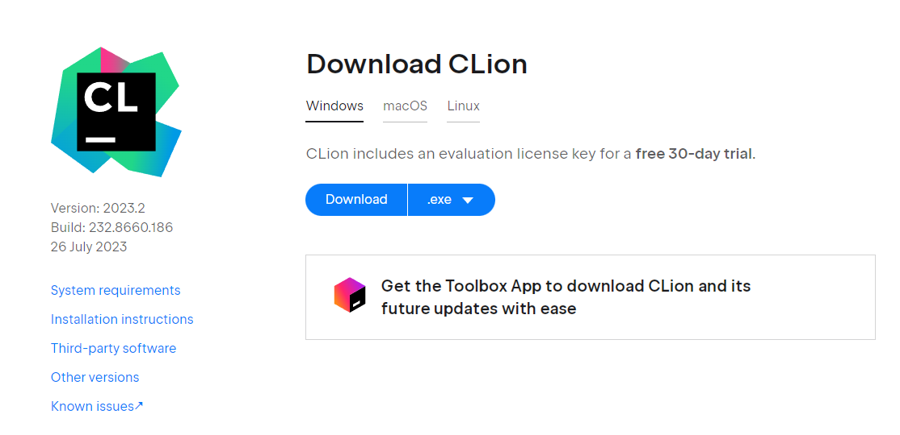

官网提供的详细使用文档：
https://www.jetbrains.com.cn/clion/features/

## 2. 安装

### 2.1 安装前的准备

* 64 位 Microsoft Windows 11、10、8
* 最低 2 GB 可用 RAM，推荐 8 GB 系统总 RAM
* 3.5 GB 硬盘空间，推荐 至少5G的SSD硬盘
* 最低屏幕分辨率 1024x768，推荐1920×1080

### 2.2 安装过程

1、下载完安装包，双击直接安装

2、欢迎安装

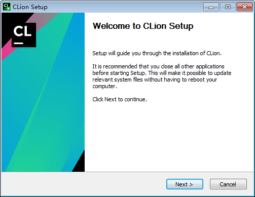

4、选择安装目录

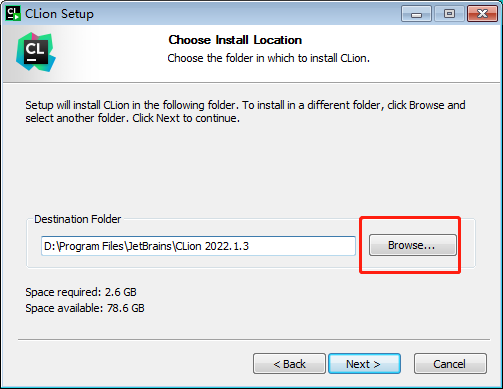

选择安装目录，目录中要避免中文和空格。

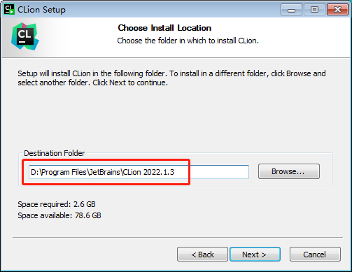

5、创建桌面快捷图标等

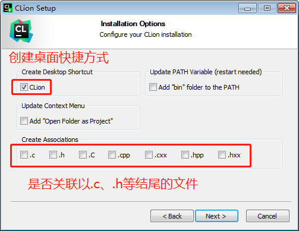

确认是否与.c、.h、.cpp格式文件进行关联。这里建议不关联。

6、在【开始】菜单新建一个文件夹（这里需要确认文件夹的名称），来管理CLion的相关内容。

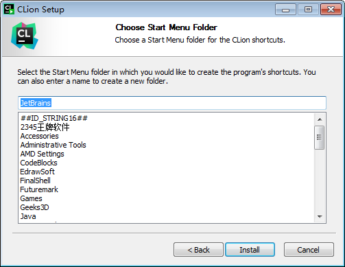

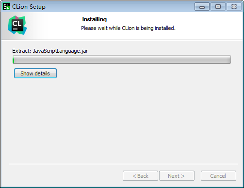

7、完成安装

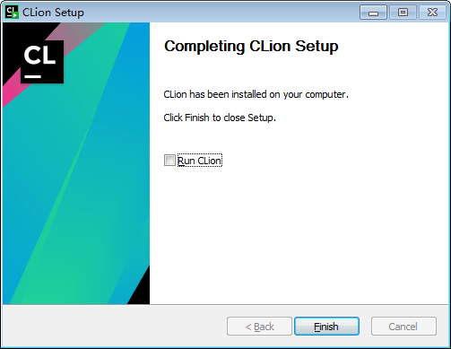

8、双击打开


9、选择“Do not import settings”，点击“OK”按钮

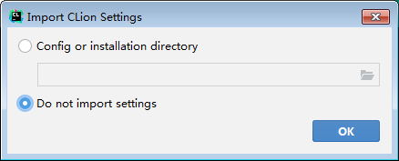

10、如图所示，需要激活CLion

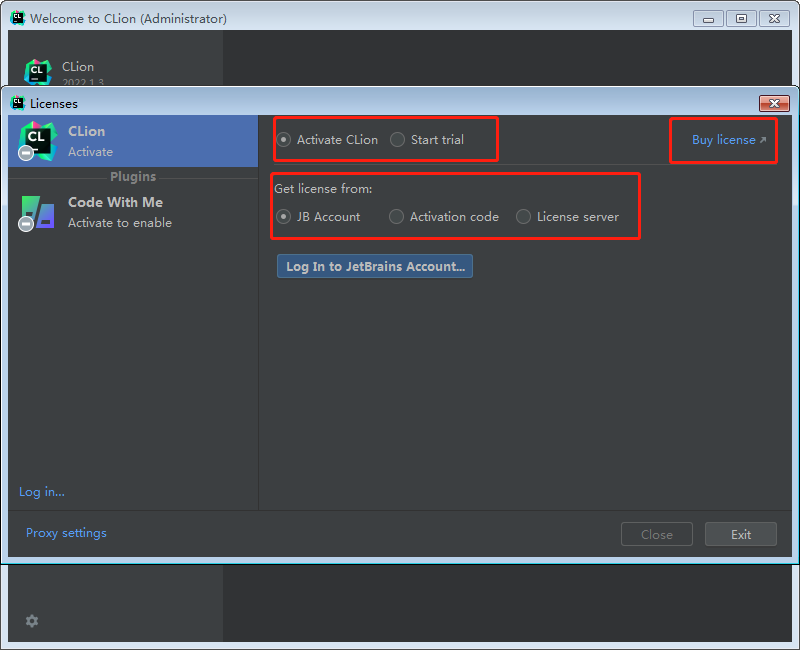

### 2.3 注册

- 选择1：适用30天。在CLion版本中，需要先登录，才能开启试用。

  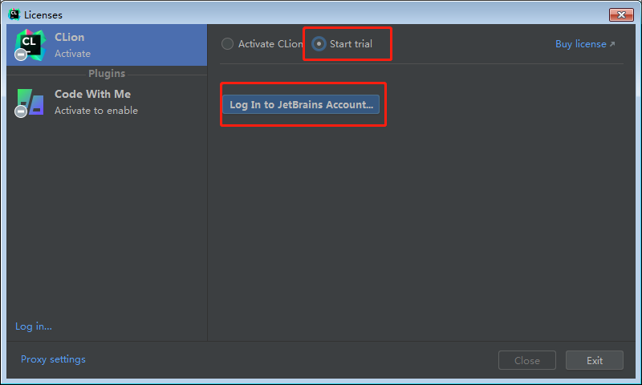

- 选择2：付费购买旗舰版

  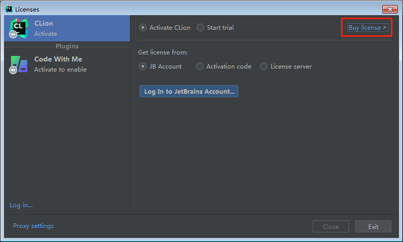

  

- 选择3：（推荐）

  - 大家参照《`02-软件\CLion-2022.1.3安装包\CLion注册文档\CLion注册文档.docx`》操作即可。
  - 由于存在时效性，如果失效，大家可以自行搜索注册方式即可。

## 3. HelloWorld的实现

### 3.1 新建Project

选择"New Project"：

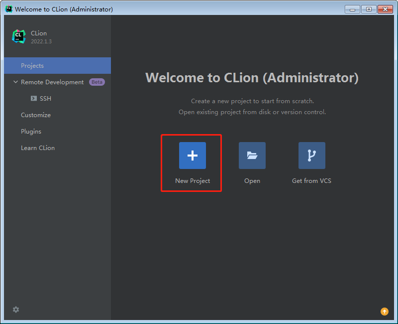

指定创建C可执行文件、工程目录，图中的“untitled1”需要修改为自己的工程名称。如下所示：


选择C可执行文件，修改工程名称为demo1

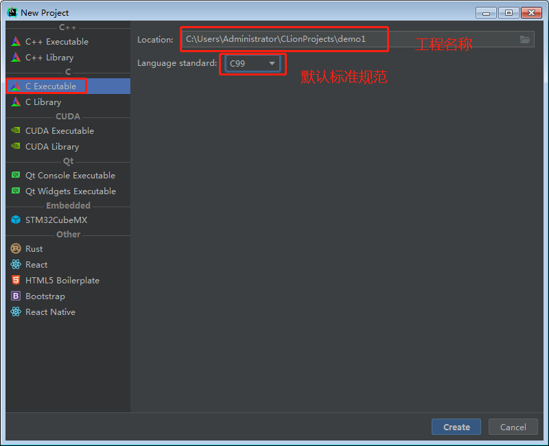

点击“Create”进行下一步，如图所示


此处选择编译器，默认MinGW即可，点击“OK”按钮，如图所示，默认创建了main.c文件。


### 3.2 运行

点击执行按钮，如下所示


## 4. 详细设置

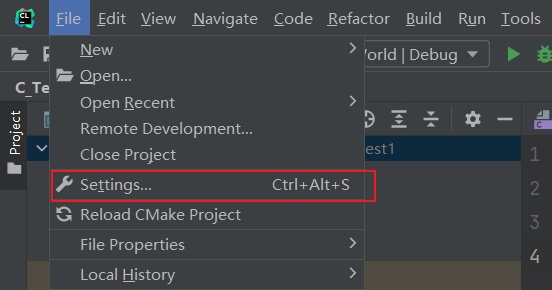

CLion的设置都在 File - Settings 中进行。

### 4.1 设置整体主题

#### 1、选择主题

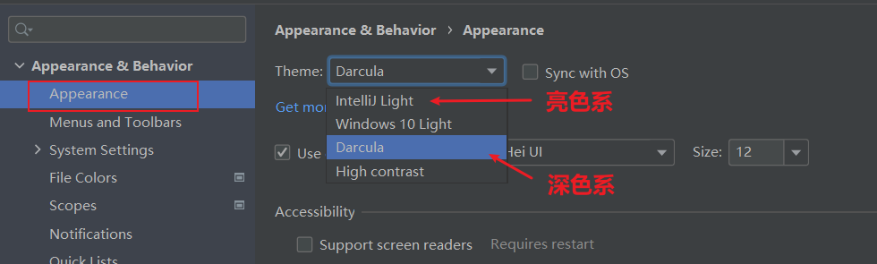

#### 2、设置菜单和窗口字体和大小

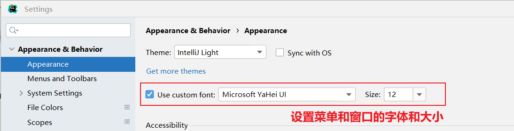

### 4.2 设置编辑器主题样式

#### 1、字体大小

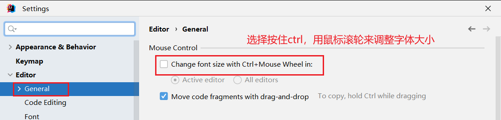

更详细的字体与颜色如下：

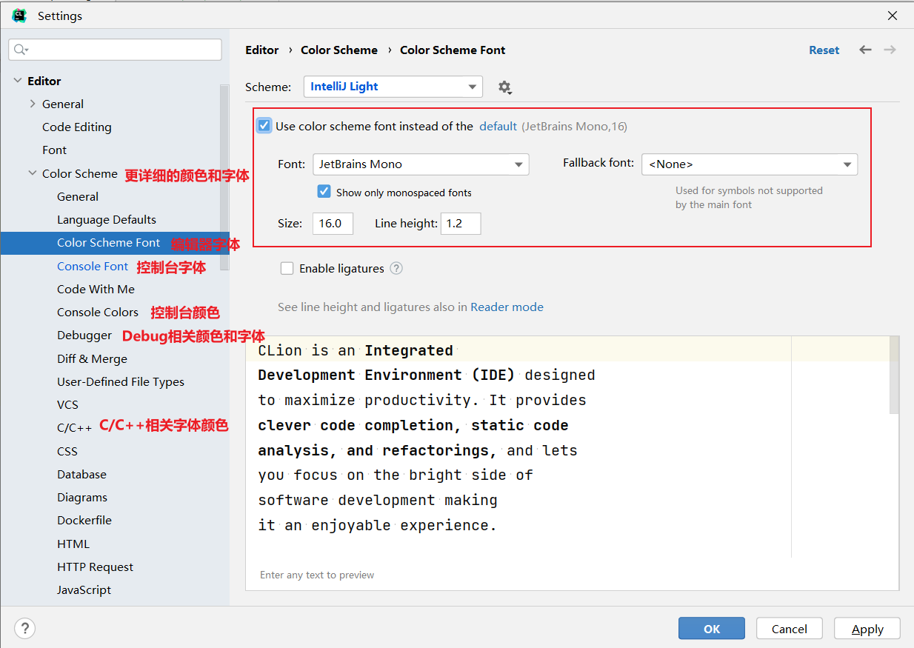

> 温馨提示：如果选择某个font字体，中文乱码，可以在fallback font（备选字体）中选择一个支持中文的字体。

#### 2、注释的字体颜色


- Block comment：修改多行注释的字体颜色
- Doc Comment –> Text：修改文档注释的字体颜色
- Line comment：修改单行注释的字体颜色

### 4.3 代码智能提示功能

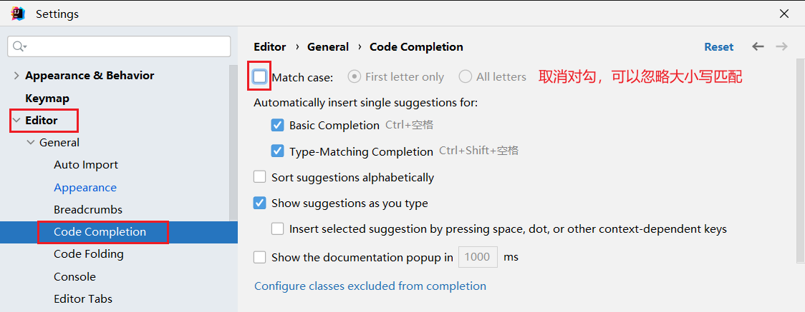

代码提示和补充功能有一个特性：`区分大小写`。 如果想不区分大小写的话，就把这个对勾去掉。`建议去掉勾选`。

### 4.4 设置项目文件编码（一定要改）

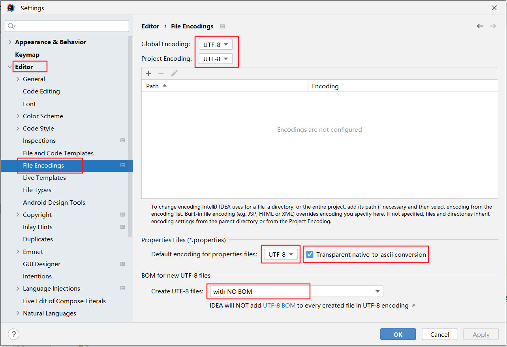

说明： Transparent native-to-ascii conversion主要用于转换ascii，显式原生内容。一般都要勾选。

### 4.5 设置控制台的字符编码

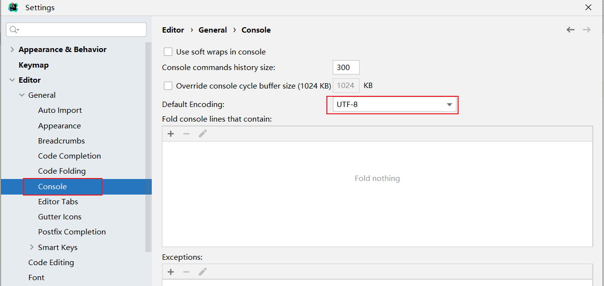

## 5. 插件的使用(重要)

**1、为何安装C/C++ Single File Execution插件？**

前面已经创建了一个demo1工程，项目文件夹内存在一个代码文件，名为`main.c`。如果再创建一个C源文件，内部如果也包含main()函数，则会报错！因为默认C工程下只能有一个main()函数。如何解决此问题呢？

2、安装并测试

1）在 File - Settings - Plugins 中搜索 `C/C++ Single File Execution` 插件并安装


2）在需要运行的代码中右键，点击 Add executable for single c/cpp file


3）此时可以在 Cmakelists.text 文件中看到多出的这一行代码，这就是插件帮我们完成的事情

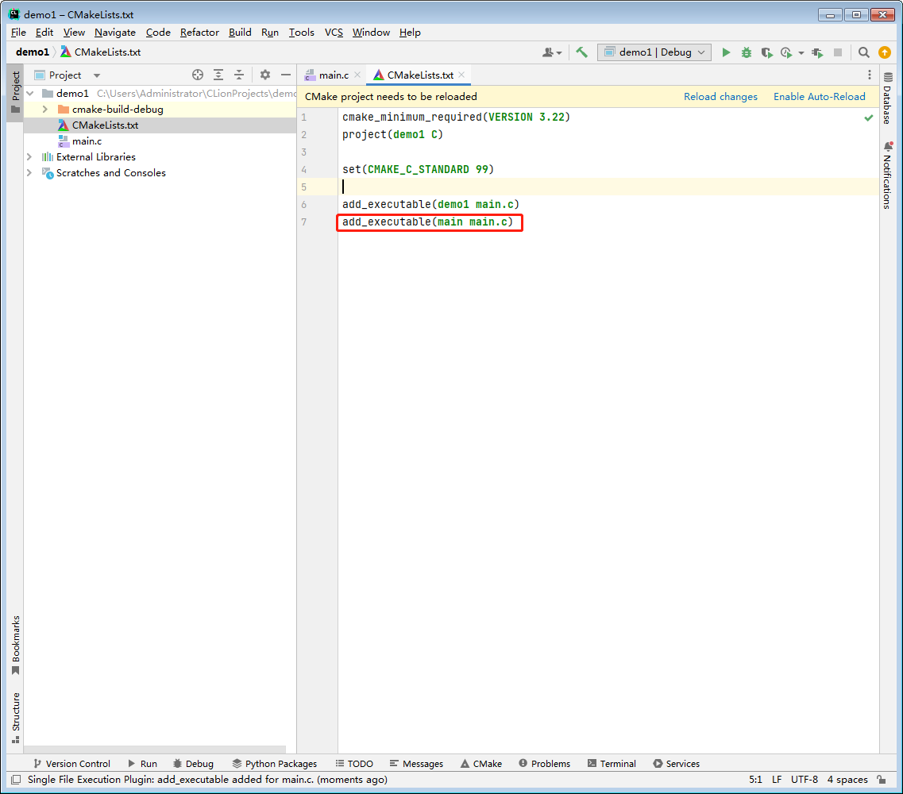

4）右键项目文件夹，点击 Reload CMake Project 进行刷新

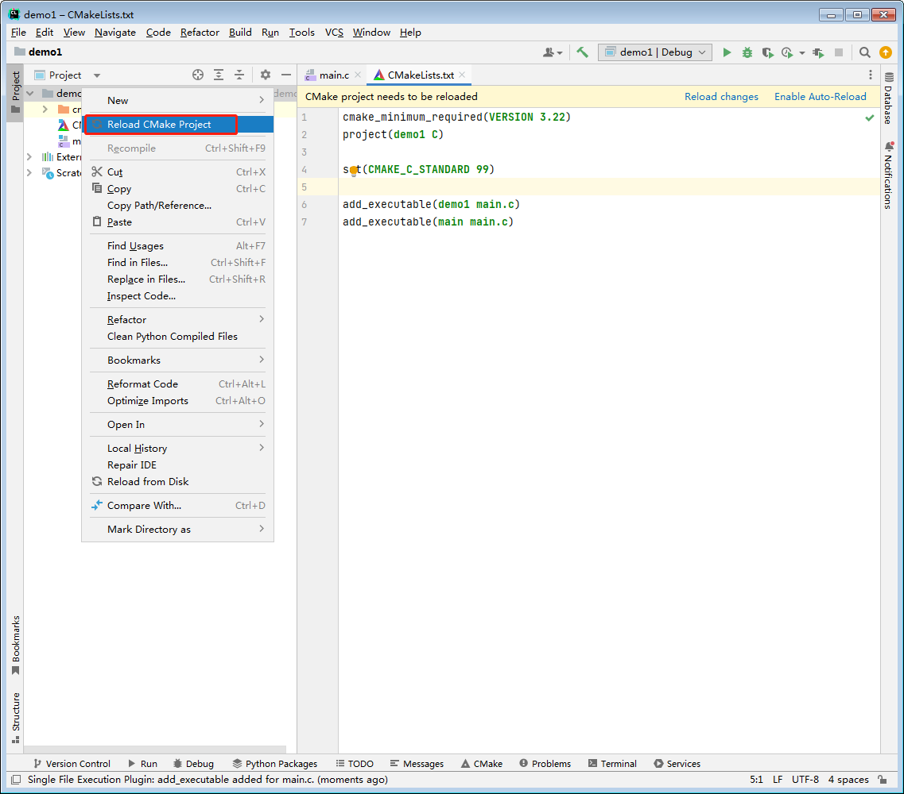

5）此时右上角标签处已经增加了我们的文件选项，选择需要的标签


6）点击小三角，或右键代码处点击 Run 选项，即可运行代码。


7）在该工程下创建main2.c文件，文件中的代码如下所示，执行上面相同的步骤。

```c
#include <stdio.h>

int main() {
    printf("Hello, World2!\n");
    return 0;
}
```

可以发现一个工程中允许存在多个main方法了，而且可以独立允许。

## 6. 快捷键的使用

### 6.1 常用快捷键

#### 第1组：通用型

| 说明            | 快捷键           |
| --------------- | ---------------- |
| 复制代码-copy   | ctrl + c         |
| 粘贴-paste      | ctrl + v         |
| 剪切-cut        | ctrl + x         |
| 撤销-undo       | ctrl + z         |
| 反撤销-redo     | ctrl + shift + z |
| 保存-save all   | ctrl + s         |
| 全选-select all | ctrl + a         |

#### 第2组：提高编写速度（上）

| 说明                                               | 快捷键           |
| -------------------------------------------------- | ---------------- |
| 提示代码模板-insert live template                  | ctrl+j           |
| 使用xx块环绕-surround with ...                     | ctrl+alt+t       |
| 调出生成getter/setter/构造器等结构-generate ...    | alt+insert       |
| 自动生成返回值变量-introduce variable ...          | ctrl+alt+v       |
| 复制指定行的代码-duplicate line or selection       | ctrl+d           |
| 删除指定行的代码-delete line                       | ctrl+y           |
| 切换到下一行代码空位-start new line                | shift + enter    |
| 切换到上一行代码空位-start new line before current | ctrl +alt+ enter |
| 向上移动代码-move statement up                     | ctrl+shift+↑     |
| 向下移动代码-move statement down                   | ctrl+shift+↓     |
| 向上移动一行-move line up                          | alt+shift+↑      |
| 向下移动一行-move line down                        | alt+shift+↓      |

#### 第3组：提高编写速度（下）

| 说明                                        | 快捷键       |
| ------------------------------------------- | ------------ |
| 批量修改指定的变量名、方法名、类名等-rename | shift+f6     |
| 抽取代码重构方法-extract method ...         | ctrl+alt+m   |
| 选中的结构的大小写的切换-toggle case        | ctrl+shift+u |

#### 第4组：类结构、查找和查看源码

| 说明                                          | 快捷键        |
| --------------------------------------------- | ------------- |
| 退回到前一个编辑的页面-back                   | ctrl+alt+←    |
| 进入到下一个编辑的页面-forward                | ctrl+alt+→    |
| 打开的类文件之间切换-select previous/next tab | alt+←/→       |
| 定位某行-go to line/column                    | ctrl+g        |
| 回溯变量或方法的来源-go to implementation(s)  | ctrl+alt+b    |
| 折叠方法实现-collapse all                     | ctrl+shift+ - |
| 展开方法实现-expand all                       | ctrl+shift+ + |

#### 第5组：查找、替换与关闭

| 说明                                               | 快捷键       |
| -------------------------------------------------- | ------------ |
| 查找指定的结构                                     | ctlr+f       |
| 快速查找：选中的Word快速定位到下一个-find next     | ctrl+l       |
| 查找与替换-replace                                 | ctrl+r       |
| 直接定位到当前行的首位-move caret to line start    | home         |
| 直接定位到当前行的末位 -move caret to line end     | end          |
| 查询当前元素在当前文件中的引用，然后按 F3 可以选择 | ctrl+f7      |
| 全项目搜索文本-find in path ...                    | ctrl+shift+f |
| 关闭当前窗口-close                                 | ctrl+f4      |

#### 第6组：调整格式

| 说明                                         | 快捷键           |
| -------------------------------------------- | ---------------- |
| 格式化代码-reformat code                     | ctrl+alt+l       |
| 使用单行注释-comment with line comment       | ctrl + /         |
| 使用/取消多行注释-comment with block comment | ctrl + shift + / |
| 选中数行，整体往后移动-tab                   | tab              |
| 选中数行，整体往前移动-prev tab              | shift + tab      |

#### 第7组-Debug快捷键

| 说明                                                  | 快捷键        |
| ----------------------------------------------------- | ------------- |
| 单步调试（不进入函数内部）- step over                 | F8            |
| 单步调试（进入函数内部）- step into                   | F7            |
| 强制单步调试（进入函数内部） - force step into        | alt+shift+f7  |
| 选择要进入的函数 - smart step into                    | shift + F7    |
| 跳出函数 - step out                                   | shift + F8    |
| 运行到断点 - run to cursor                            | alt + F9      |
| 继续执行，进入下一个断点或执行完程序 - resume program | F9            |
| 停止 - stop                                           | Ctrl+F2       |
| 查看断点 - view breakpoints                           | Ctrl+Shift+F8 |
| 关闭 - close                                          | Ctrl+F4       |

### 6.2 查看快捷键

#### 1、已知快捷键操作名，未知快捷键

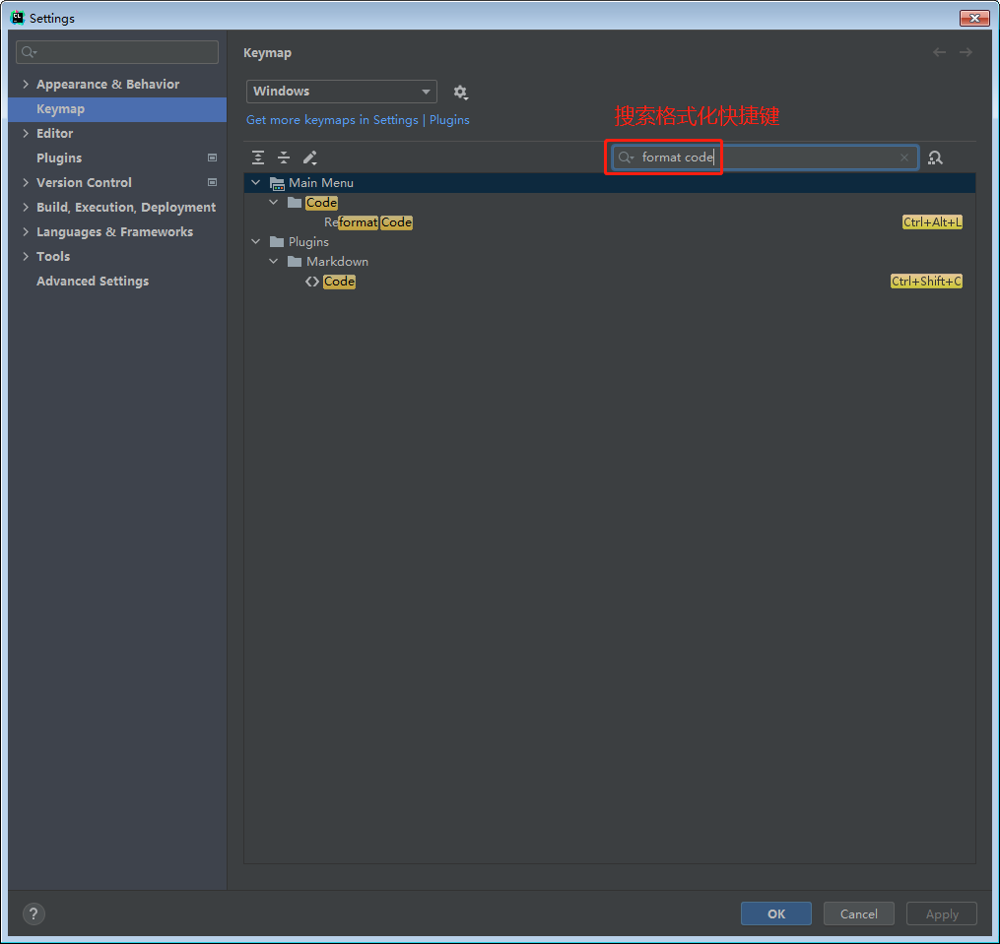

#### 2、已知快捷键，不知道对应的操作名

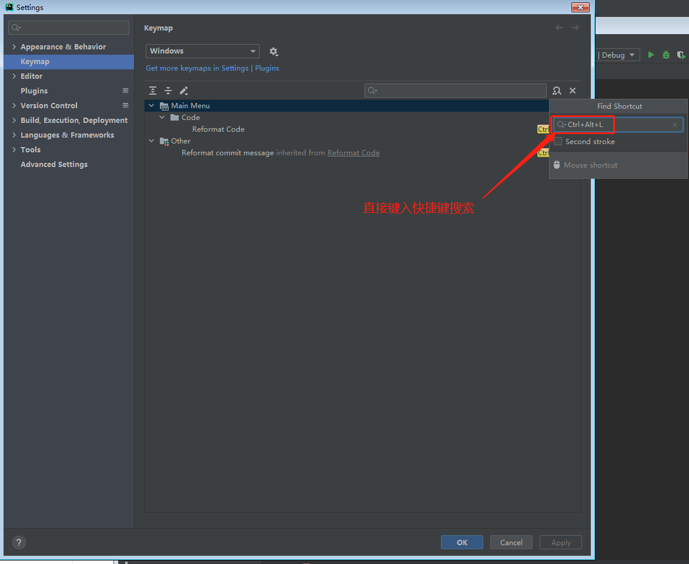

### 6.3 自定义快捷键


