# 第01章附录：MinGW编译器的安装和配置

## 1、MinGW介绍

MinGW（Minimalist GNU on Windows）实际上是GCC在Windows平台上的移植版本，因此可以将源代码编译为可在 Windows 中运行的可执行程序。MinGW是，主要用于在Windows上本地编译C和C++代码。

> 目前适用于 Windows 平台、受欢迎的 GCC 移植版主要有 2 种，分别为 MinGW 和 Cygwin。
> 其中：
>
> MinGW 侧重于服务 Windows 用户可以使用 GCC 编译环境，是真正的GCC移植，相比后者体积更小，使用更方便；
> Cygwin 只是提供一个类unix的环境内部是原生的GCC，借助它不仅可以在 Windows 平台上使用 GCC 编译器，理论上可以运行 Linux 平台上所有的程序；
>
> Cygwin 只是提供一个类unix的环境内部是原生的GCC。
>
> 如果读者仅需要在 Windows 平台上使用 GCC，可以使用 MinGW 或者 Cygwin；除此之外，如果还有更高的需求（例如运行 POSIX 应用程序），就只能选择安装 Cygwin。

## 2、下载与安装

### 2.1 下载

下载地址：<https://sourceforge.net/projects/mingw/files/>

点击“Download Latest Version”即可

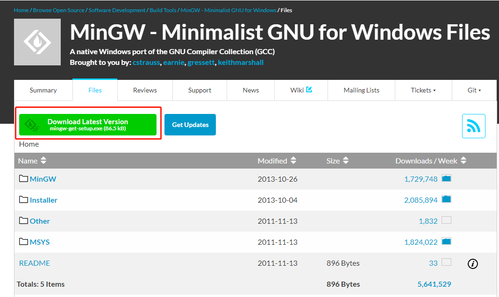

### 2.2 安装

下载完成后，会得到一个名为 mingw-get-setup.exe 的安装包，双击打开它，可以看到如下的对话框：

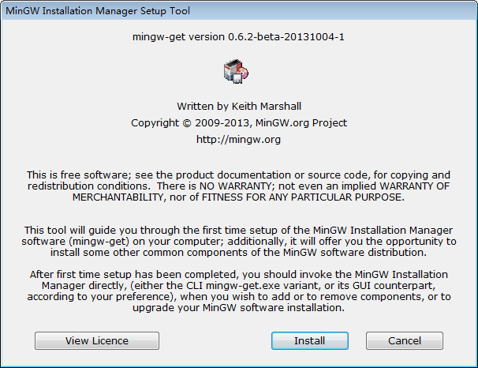

直接点击“Install”，进入下面的对话框：

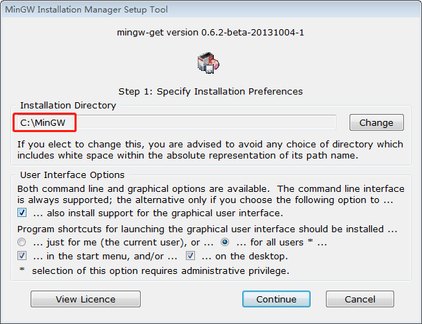

读者可根据自己操作系统的实际情况，自定义 MinGW 的安装位置（`建议安装到非C盘的指定目录下`），然后点击“continue”，进入下面的对话框：

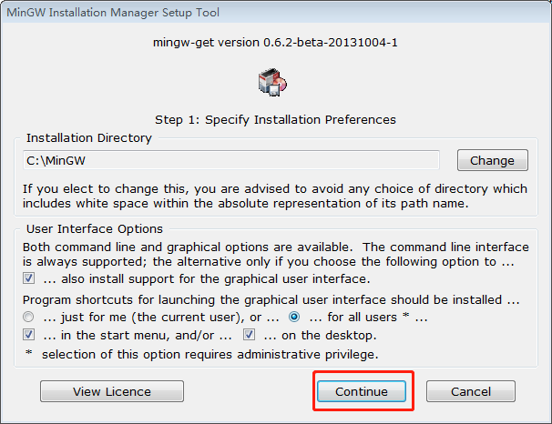

​	进入安装 MinGW 配置器的界面，耐心等待安装完成（显示 100%）即可。

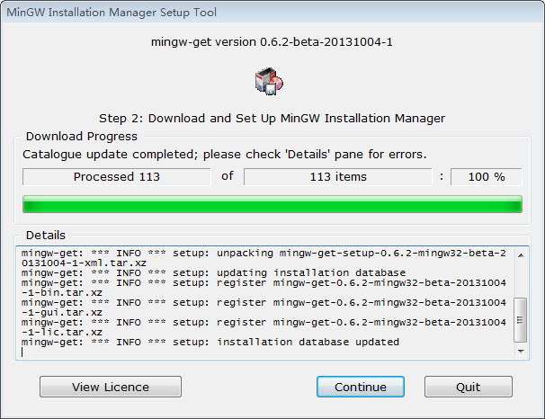

安装完成之后，继续点击“continue”，进入下面的对话框，这是一个名为 “`MinGW Installer Manager`” 的软件，借助它，我们可以随时根据需要修改 GCC 编译器的配置。

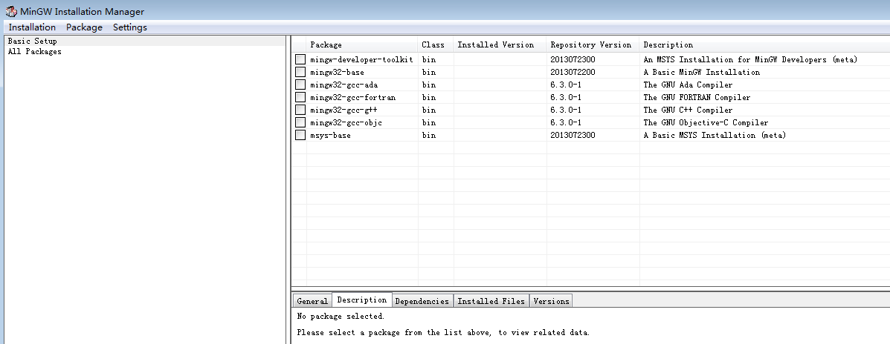

常见的安装包介绍如下。

| 安装包名称          | 作用                                             |
| ------------------- | ------------------------------------------------ |
| mingw32-binutils    | 用于编译生成的 .o 文件的链接、汇编、生成静态库等 |
| mingw32-gcc         | 核心的 C 编译器                                  |
| mingw32-gcc-ada     | Ada 编译器                                       |
| mingw32-gcc-fortran | Fortran 编译器                                   |
| mingw32-gcc-g++     | C++ 编译器                                       |
| mingw32-gcc-objc    | Objective-C 编译器                               |
| mingw32-libgcc      | C 编译器编译出来的程序的运行库                   |

其中minw32-gcc-g++支持C++编译和minw32-gcc支持C编译。

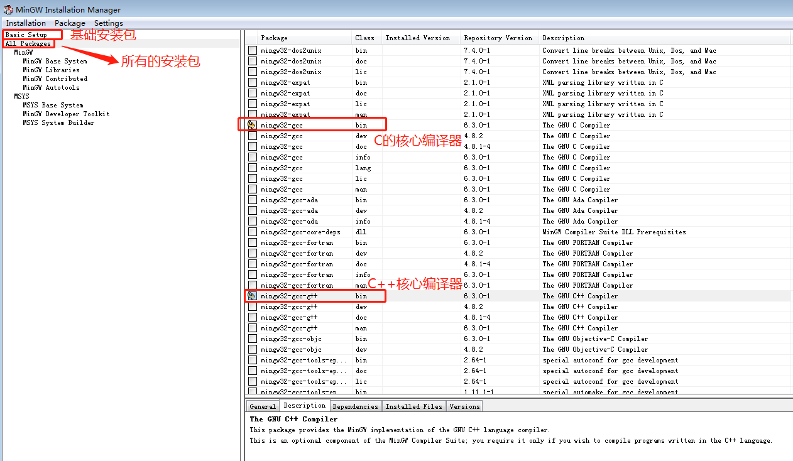

为使 GCC 同时支持编译 `C` 语言和 `C++`，需勾选上图中标注的 2 项。选中其中一项，鼠标右键点击，选择“Mark for Installation”，如图所示。

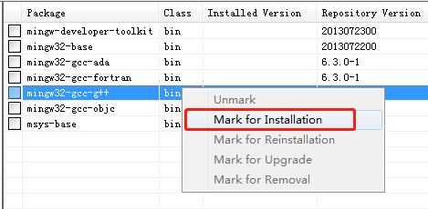

标记完以后如图所示。

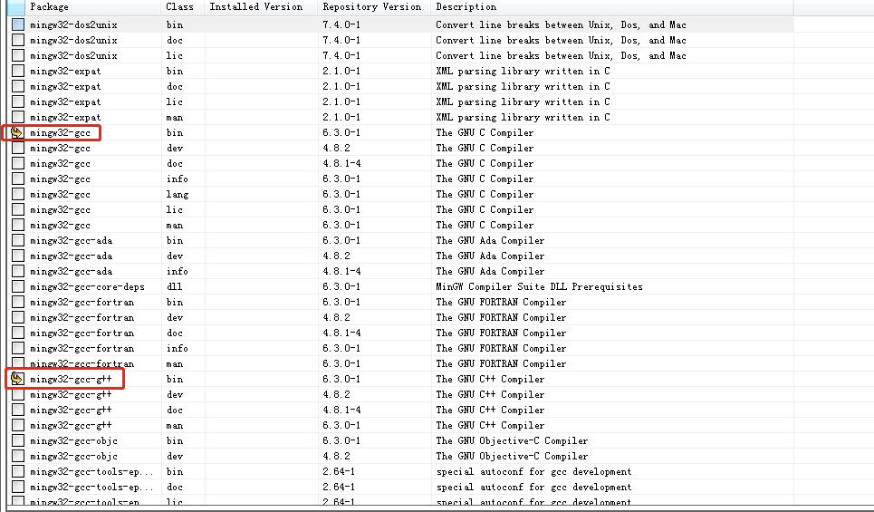

> GCC 还支持其它编程语言，读者可借助此配置器，随时根据需要安装自己需要的编译环境。

勾选完成后，在菜单栏中选择 `Installation -> Apply Changes`，

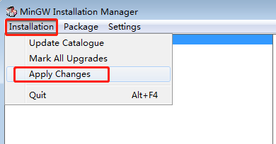

弹出如下对话框：

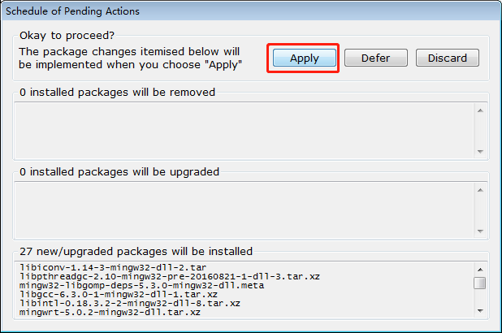

选择“Apply”。然后耐心等待，直至安装成功，即可关闭此界面。

## 3、配置：path环境变量

在安装完成的基础上，我们需要手动配置 PATH 环境变量。

1）依次 `右击计算机（我的电脑） -> 属性 -> 高级系统设置 -> 环境变量`，例如我将其安装到了C:\MinGW文件夹中，因此 PATH 环境变量的设置如下：

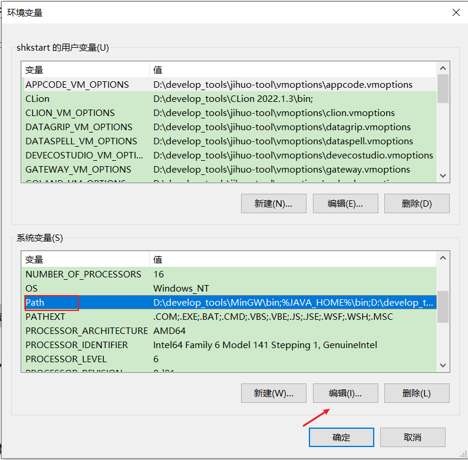

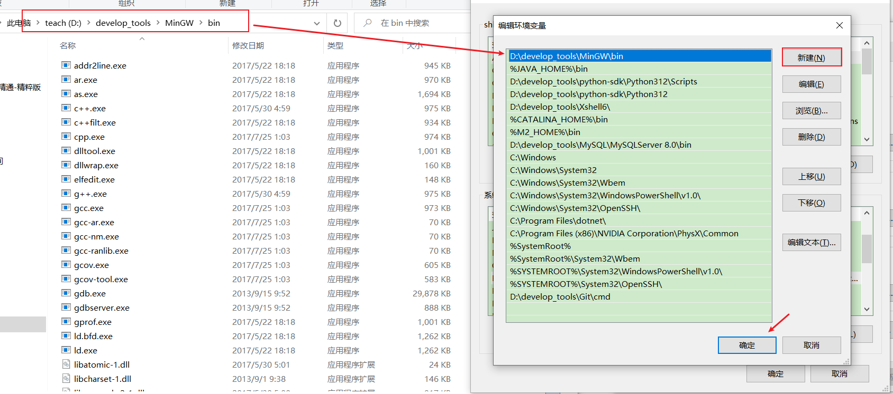

2）打开命令行窗口（通过在搜索栏中执行 cmd 指令即可），输入`gcc -v`指令，如果输出 GCC 编译器的具体信息，则表示安装成功，例如：

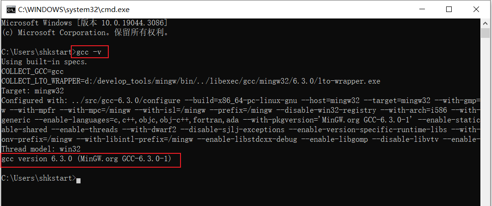

通过上面的安装，我们就可以在当前 Windows 平台上编译、运行 C 或者 C++ 程序了。

因为 MinGW-w64 本来就是将 GCC 移植到 Windows 上的产物，所以操作方式和 GCC 一样，只是在 Linux 下命令是被键入到“终端”中，而 Windows 下则是被键入到“命令提示符”里。

