# 第02章_变量与进制

讲师：尚硅谷-宋红康（江湖人称：康师傅）

官网：[http://www.atguigu.com](http://www.atguigu.com/)

***

## 本章专题脉络

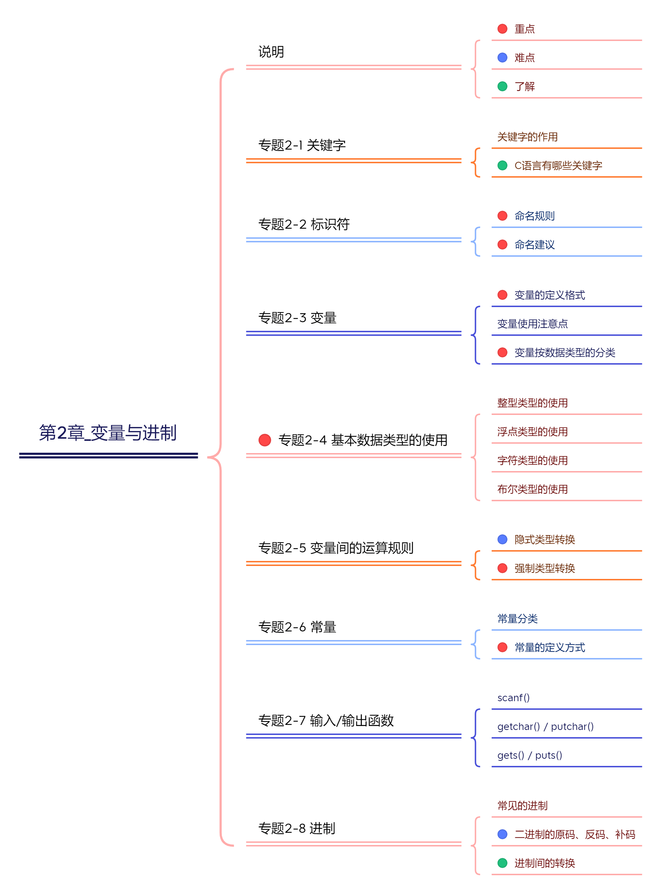

## 1、关键字(keyword)

定义：**被C语言赋予了特殊含义，用做专门用途的字符串（或单词）。**

特点：全部关键字都是`小写字母`。

举例：HelloWorld案例中，出现的关键字有 `int`、`return`等，这些单词已经被C语言定义好了。

传统的C语言（ANSI C）有32个关键字。如下：

| 类型                    | 具体关键字                                                   |
| ----------------------- | ------------------------------------------------------------ |
| 控制语句关键字（12 个） | break, case, continue, default, do, else, for, goto, if, return, switch, while |
| 数据类型关键字（12 个） | char, enum, double, long, float, int, short, signed, struct, unsigned, union, void |
| 存储类型关键字（4 个）  | auto, extern, register, static                               |
| 其他关键字（4 个）      | const, sizeof, typedef, volatile                             |

后续，1999年，C99标准增加了5个关键字：`inline`、`restrict`、`_Bool`、`_Complex`和`_Imaginary`。

2011年，C11标准又增加了7个关键字：`_Alignas`、`_Alignof`、`_Atomic`、`_Static_assert`、`_Noreturn`、`_Thread_local`和`_Generic`。

> 说明：
>
> 1、ANSI C、C99和C11，它们之间差别并不大，在大多数情况下，它们都是和谐共处的。
>
> 2、不需要死记硬背，学到哪里记到哪里即可。

## 2、标识符(Identifier)

C语言中变量、函数、数组名、结构体等要素命名时使用的字符序列，称为标识符。

技巧：凡是自己可以起名字的地方都叫标识符。

**标识符的命名规则**（必须遵守的`硬性规定`）

- 只能由26个英文字母大小写，0-9 或 _ 组成
- 数字不可以开头
- 不可以是关键字，但可以包含关键字
- C99和C11允许使用更长的标识符名，但是编译器只识别前63个字符。(会忽略超出的字符)
- 不允许有空格。
- 严格区分大小写字母。比如：Hello、hello是不同的标识符。

**标识符的命名建议**（建议遵守的`软性要求`）

- 在起名字时，为了提高阅读性，要尽量有意义，“见名知意”。如：sum，name，max，year，total 等。

- 不要出现仅靠大小写区分不同的标识符。如：name、Name 容易混淆

- 尽量避免名字中出现数字编号，如value1、value2等，除非逻辑上需要编号。

- 习惯上，所有宏定义、枚举常数、常量(只读变量)全用大写字母命名，用下划线分隔单词。

  比如： const double TAX_RATE = 0.08; //TAX_RATE 只读变量

- 系统内部使用了一些下划线开头的标识符（比如两个下划线开头的变量名、一个下划线 + 大写英文字母开头的变量名）。比如，C99 标准添加的类型 `_Bool`。为防止冲突，建议用户尽量避免使用下划线开头的标识符。

- 下划线通常用于连接一个比较长的变量名。如：max_classes_per_student。

- 变量名、函数名：多单词组成时，第一个单词首字母小写，第二个单词开始每个单词首字母大写：xxxYyyZzz (驼峰法，小驼峰)。比如：`short stuAge = 20; `，`tankShotGame`。 


举例：合法的标识符：

```c
a、BOOK1、_sun、MAX_SIZE、Mouse、student23、Football、FOOTBALL、max、_add、num_1、sum_of_numbers
```

举例：非法的标识符：

```
$zj、3sum、ab#cd、23student、Foot-baii、s.com、b＆c、j**p、book-1、tax rate、don't
```


> 【武汉科技大学2019研】
>
> 以下均是合法变量名的是（　）。
> A．#name   total
> B．node 　value_max
> C．_var 　long
> D．stu－code   a＋b
>
> 【答案】B
>
> 【解析】C语言中变量名只能包含数字，字母和下划线，且只能以字母和下划线开始。A项含非法字符#，错误；C中long为关键字，变量不能以关键字命名；D中含非法字符－和＋。


>  【四川大学2017研】以下不合法的用户标识符是（　　）。
>  A．J2_KEY
>  B．Double
>  C．4d
>  D．\_8_
>
>  【答案】C
>
>  【解析】标识符只能包含数字，字母，下划线，且不能以数字开头，选项C错误。


> 练习
>
> 下列定义变量的语句中错误的是（　　）。
> A．double int_；
> B．float US$；
> C．char For；
> D．int _int；
>
> 【答案】B【解析】标识符由字母、数字、下划线组成。$是非法字符，不能出现在标识符中。答案选择B选项。


## 3、变量(variable)

### 3.1 为什么需要变量


一花一世界，如果把一个程序看做一个世界或一个社会的话，那么变量就是程序世界的花花草草、万事万物。即，**变量是程序中不可或缺的组成单位，最基本的存储单元**。


### 3.2 初识变量

- 变量的概念：

  - 内存中的一个存储区域，该区域的数据可以在同一类型范围内不断变化。

  - 通过变量名，可以访问这块内存区域，获取里面存储的值。

  - 变量的构成包含三个要素：`数据类型`、`变量名`、`存储的值`

  - C语言中变量声明的格式：`数据类型 变量名 = 变量值`

    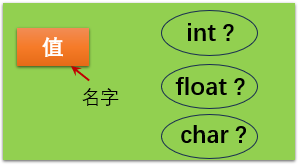

- 变量的作用：用于在内存中保存数据。

- 使用变量注意：

  - C语言中每个变量必须先声明，后使用。
  - 不同的数据类型，占用的空间大小不一样。
  - 一旦声明，变量的类型就不能在运行时修改。

### 3.3 变量的声明与赋值

#### 步骤1：变量的声明

格式：

```c
数据类型  变量名;  //声明变量的语句必须以分号结尾
```

举例1：

```c
int width;
```

举例2：

```c
int width,height;

// 等同于
int width;
int height;
```

#### 步骤2：变量的赋值

变量声明时，就为它分配内存空间，但是不会清除内存里面原来的值。这导致声明变量以后，变量会是一个随机的值。所以，变量一定要赋值以后才能使用。

```c
int age; //变量的声明
age = 18;  //变量的赋值
```

变量的声明和赋值，也可以写在一行。

```c
int age = 18;
```

多个相同类型变量的赋值，可以写在同一行。

```c
int a = 1, b = 2;
```

```c
int a, b;
a = 1;
b = (a = 2 * a);
```

```c
int a, b, c, x, y;
a = b = c = x = y = 10;  //连续赋值
```

> 注意：声明变量以后，不用忘记初始化赋值！定义变量时编译器并不一定清空了这块内存，它的值可能是无效的数据，运行程序，会异常退出。

### 3.4 变量的作用域(scope)

- 变量的作用域：其定义所在的一对{ }内。
- 变量只有在其`作用域`内才有效。出了作用域，变量不可以再被调用。
- 同一个作用域内，不能定义重名的变量。

- C 语言的变量作用域主要有两种：文件作用域（file scope）和块作用域（block scope）。


`文件作用域（file scope）`指的是，在源码文件顶层声明的变量，从声明的位置到文件结束都有效。

```c
int x = 1;
int main() {
	printf("%d\n", x);
    return 0;
}
```

`块作用域（block scope）`指的是由大括号（ {} ）组成的代码块，它形成一个单独的作用域。凡是在块作用域里面声明的变量，只在当前代码块有效，代码块外部不可见。

```c
int main() {
    int m = 10;
    if (m == 10) {
        int n = 20;
        printf("%d %d\n", m, n);  // 10 20
    }
    printf("%d\n", m);  // 10
    printf("%d\n", n);  // 超出作用域，报错
    
    return 0;
}
```

最常见的块作用域就是函数，函数内部声明的变量，对于函数外部是不可见的。 for 循环也是一个块作用域，循环变量只对循环体内部可见，外部是不可见的。

```c
for (int i = 0; i < 10; i++){
	printf("%d\n", i);
}
printf("%d\n", i); // 超出作用域，报错
```

### 3.5 变量按类型的分类

变量可以按`数据类型`来分，也可以按`声明的位置`来分（全局变量、局部变量）。本节主讲变量的不同类型。

C 语言中的变量按照数据类型分为：


> 注意1：这里列举的是C语言的常用类型，后续C语言版本还有新增的类型。
>
> 注意2：空类型：void 表示空类型（无类型）。通常应用于函数的返回值类型、函数的参数、指针类型。
>
> 注意3：在C语言中，没有`字符串类型`，使用字符数组表示字符串。


## 4、基本数据类型

### 4.1 整数类型

#### 4.1.1 类型说明

- C语言规定了如下的几类整型：短整型(short)、整型(int)、长整型(long)、更长的整型(long long)

- 每种类型都可以被 signed 和unsigned 修饰。其中，

  - 使用 `signed 修饰`，表示该类型的变量是带符号位的，有正负号，可以表示负值。`默认是signed`。
  - 使用 `unsigned 修饰`，表示该类型的变量是不带符号位的，没有有正负号，只能表示零和正整数。

- bit(位)：计算机中的最小存储单位。

  byte(字节)：计算机中基本存储单元。

  1byte = 8bit

| 类型        | 修饰符   | 占用空间       | 取值范围                                                   |
| ----------- | -------- | -------------- | ---------------------------------------------------------- |
| short [int] | signed   | 2个字节(=16位) | -32768 ~ 32767 (-$2^{15}$ ~ $2^{15}$-1)                    |
| short [int] | unsigned | 2个字节(=16位) | 0 ~ 65535  (0 ~ $2^{16}$-1)                                |
| int         | signed   | 通常4个字节    | -2147483648 ~ 2147483647 (-$2^{31}$ ~ $2^{31}$-1)          |
| int         | unsigned | 通常4个字节    | 0 ~ 4294967295  (0 ~ $2^{32}$-1)                           |
| long [int]  | signed   | 4个或8个字节   | 4字节时：-2147483648 ~ 2147483647 (-$2^{31}$ ~ $2^{31}$-1) |
| long [int]  | unsigned | 4个或8个字节   | 4字节时：-0 ~ 4294967295  (0 ~ $2^{32}$-1)                 |

long long int是`C99新增`的：

| 类型            | 修饰符   | 占用空间       | 取值范围                                                     |
| --------------- | -------- | -------------- | ------------------------------------------------------------ |
| long long [int] | signed   | 8个字节(=64位) | -9223372036854775808~ 9223372036854775807(-$2^{63}$ ~ $2^{63}$-1) |
| long long [int] | unsigned | 8个字节(=64位) | 0 ~ 18446744073709551615(0 ~ $2^{64}$-1)                     |

> 说明1：不同计算机的 int 类型的大小是不一样的。比较常见的是使用4个字节（32位）存储一个 int 类型的值，具体情况如下：

| 类型          | 16位编译器 | 32位编译器 | 64位编译器 |
| ------------- | ---------- | ---------- | ---------- |
| short int     | 2字节      | 2字节      | 2字节      |
| int           | 2字节      | 4字节      | 4字节      |
| unsigned int  | 2字节      | 4字节      | 4字节      |
| long          | 4字节      | 4字节      | 8字节      |
| unsigned long | 4字节      | 4字节      | 8字节      |
| long long     | 8字节      | 8字节      | 8字节      |

> 说明2：C标准虽然没有具体规定各种类型数据所占用存储单元的长度，但几条铁定的原则（ANSI/ISO制订的）：
> ① sizeof(short int) ≤ sizeof(int) ≤ sizeof(long int) ≤ sizeof(long long)，具体由各编译系统自行决定的。其中，sizeof是测量类型或变量长度的运算符。
>
> ② short int至少应为2字节，long int至少应为4字节。

这样约定的好处就是使得C语言可以长久使用。`现在的主流CPU是64位`，可以预测不久的将来会推出128位甚至256位的CPU，但是在C语言刚刚出现的时候，CPU还是以8位和16位为主。如果那时候就将整型定死为8位或16位，那么现在我们肯定不会再学习C语言了。

> 说明3：
>
> 最常用的整型类型为：int类型。
>
> 整数型常量，默认为int类型。

#### 4.1.2 举例

举例1：对于 int 类型，默认是带有正负号的。即 int 等同于 signed int 。一般情况下，关键字signed省略不写。

```c
signed int m;  //声明了一个带符号的整数变量 m 
// 等同于
int m;   //声明了一个带符号的整数变量 m
```

举例2：int 类型也可以不带正负号，只表示非负整数。这时就必须使用关键字 unsigned 声明变量。表数范围为：0~4294967295

```c
unsigned int a;   //声明了一个不带符号的整数变量a，表数范围为：0~4294967295
```

unsigned int 里面的 int 可以省略，所以上面的变量声明也可以写成这样：

```c
unsigned a;
```

举例3：

int 类型使用4个字节表示一个整数，对于小整数，这样做很浪费空间。另一方面，某些场合需要更大的整数，8个字节还不够。此时，可以使用short int （简写为 short ）、long int （简写为 long ）、long long int （简写为 long long ）

```c
signed short int a; 
signed long int b;
signed long long int c;
```

默认情况下， short 、 long 、 long long 都是带符号的（signed），即 signed 关键字可以省略。代码简写为：

```c
short a; 
long b;
long long c;
```

它们也可以声明为不带符号（unsigned），使得能够表示的最大值扩大一倍。

```c
unsigned short a;  //无符号短整型，表数范围：0~65535
unsigned long b;   //无符号长整型，表数范围：0~4294967295
unsigned long long c;  //无符号长整型，表数范围：0~18446744073709551615
```

#### 4.1.3 关于后缀

编译器将一个整数字面量指定为 int 类型，但是如果希望将其指定为 long 类型，需要在该字面量末尾加上后缀 `l` 或 `L` ，编译器会把这个字面量的类型指定为 long 。

```c
long x = 123L; //或者写成 123l
```

如果希望字面量指定为long long类型，则后缀以`ll`或`LL`结尾。

```c
long long y = 123LL;
```

如果希望指定为无符号整数 unsigned int ，可以使用后缀 `u` 或 `U` 。

```c
unsigned int x = 123U;
```

L 和 U 可以结合使用，表示 unsigned long 类型。 L 和 U 的大小写和组合顺序无所谓。

u 还可以与其他整数后缀结合，放在前面或后面都可以，比如 10UL 、 10ULL 和 10LLU 都是合法的。

```c
unsigned long int      x = 1234UL;
unsigned long long int x = 1234ULL;
```

#### 4.1.4 精确宽度类型(了解)

C 语言的整数类型（short、int、long）在不同计算机上，占用的字节宽度可能是不一样的，无法提前知道它们到底占用多少个字节。程序员有时控制准确的字节宽度，这样的话，代码可以有更好的可移植性，头文件 stdint.h 创造了一些新的类型别名。

**精确宽度类型(exact-width integer type)**：保证某个整数类型的宽度是确定的。

- int8_t ：8位有符号整数


- int16_t ：16位有符号整数


- int32_t ：32位有符号整数


- int64_t ：64位有符号整数


- uint8_t ：8位无符号整数


- uint16_t ：16位无符号整数


- uint32_t ：32位无符号整数


- uint64_t ：64位无符号整数


上面这些都是类型别名，编译器会指定它们指向的底层类型。比如，某个系统中，如果 int 类型为32位， int32_t 就会指向 int ；如果 long 类型为32位， int32_t 则会指向 long 。

```c
#include <stdio.h>
#include <stdint.h>

int main() {
	int32_t x32 = 45933945;  //变量 x32 声明为 int32_t 类型，可以保证是32位的宽度。
	printf("x32 = %d\n", x32);
	return 0;
}
```

#### 4.1.5 整型的极限值(了解)

有时候需要查看，当前系统不同整数类型的最大值和最小值，C 语言的头文件 `limits.h` 提供了相应的常量。比如：INT_MIN 代表 signed int 类型的最小值 -2147483648， INT_MAX 代表 signed int 类型的最大值 2147483647。

```c
#include <limits.h>

int main() {
    printf("%d\n", INT_MIN  );  // -2147483648
    printf("%d\n", INT_MAX  );  // 2147483647
    return 0;
}
```

为了代码的可移植性，需要知道某种整数类型的极限值时，应该尽量使用这些常量。

- SCHAR_MIN ， SCHAR_MAX ：signed char 的最小值和最大值。

- SHRT_MIN ， SHRT_MAX ：short 的最小值和最大值。

- INT_MIN ， INT_MAX ：int 的最小值和最大值。

- LONG_MIN ， LONG_MAX ：long 的最小值和最大值。

- LLONG_MIN ， LLONG_MAX ：long long 的最小值和最大值。

- UCHAR_MAX ：unsigned char 的最大值。

- USHRT_MAX ：unsigned short 的最大值。

- UINT_MAX ：unsigned int 的最大值。

- ULONG_MAX ：unsigned long 的最大值。

- ULLONG_MAX ：unsigned long long 的最大值。


### 4.2 浮点类型

#### 4.2.1 类型说明

浮点型变量，也称为实型变量，用来存储小数数值的。因为32位浮点数提供的精度或者数值范围还不够，C 语言又提供了另外两种更大的浮点数类型。

在C语言中，浮点型变量分为三种：单精度浮点型(float)、双精度浮点型(double)、长双精度浮点型(long double)。

| 类型        | 占用空间        | 取值范围                                                     |
| ----------- | --------------- | ------------------------------------------------------------ |
| float       | 4个字节 (=32位) | $-1.4*10^{-45}$ ~ $-3.4*10^{+38}$，$1.4*10^{-45}$ ~ $3.4*10^{+38}$ |
| double      | 8个字节 (=64位) | $-4.9*10^{-324}$ ~ $-1.7*10^{+308}$，$4.9*10^{-324}$ ~ $1.7*10^{+308}$ |
| long double | 12个字节(=96位) | 太大了...                                                    |

其中，

| 类型   | 16位编译器 | 32位编译器 | 64位编译器 |
| ------ | ---------- | ---------- | ---------- |
| float  | 4字节      | 4字节      | 4字节      |
| double | 8字节      | 8字节      | 8字节      |

C语言的第3种浮点类型是long double，以满足比double类型更高的精度要求。不过，C只保证long double类型至少与double类型的精度相同。

浮点型变量不能使用signed或unsigned修饰符。

最常用的浮点类型为：double 类型，因为精度比float高。

浮点型常量，默认为 double 类型。

**关于后缀：**

对于浮点数，编译器默认指定为 double 类型，如果希望指定为float类型，需要在小数后面添加后缀 `f`或`F`；如果希望指定为long double类型，需要在小数后面添加后缀 `l`或`L`。

```c
float x       = 3.14f;
double x      = 3.14;
long double x = 3.14L;
```

#### 4.2.2 举例

**举例1：**

```c
float f = 123.4f;　　//后面必须加上字母f
double d1 = 101.1;　//后面可以省略字母d
double d2 = 299.4;　　//后面可以加上字母d
```

**举例2：**

C 语言允许使用科学计数法表示浮点数，使用字母 e 来分隔小数部分和指数部分。注意，e 的前后，不能存在空格。

```c
double x = 123.456e+3; // 123.456 x 10^3
// 等同于
double x = 123.456e3;
```

另外，科学计数法的小数部分如果是 0.x 或 x.0 的形式，那么 0 可以省略。

```c
0.3E6
// 等同于
.3E6
    
3.0E6
// 等同于
3.E6
```

**举例3：**可以在常量的末尾加专用字符，强制指定常量的类型

```c
float a = 3.14159f; //把此3.14159按单精度浮点常量处理
long double a = 1.23L; //把此1.23作为long double型处理
```

**举例4：**

有人用温度计测量出用华氏法表示的温度(如64°F），今要求把它转换为以摄氏法表示的温度(如17.8℃)。转换的公式为：$c = \frac{5}{9}(f - 32)$。

其中，f 代表华氏温度，c 代表摄氏温度。

```c
#include <stdio.h>

int main() {
    float f, c; //定义f和c分别表示华氏温度、摄氏温度
    f = 64.0; //指定f的值
    c = (5.0 / 9) * (f - 32); //利用公式计算c的值
    printf("f=%f\nc=%f\n", f, c); //输出c的值
    return 0;
}
```

#### 4.2.3 存储规则(了解)

任何有小数点的数值，都会被编译器解释为浮点数。所谓“浮点数”就是使用 m * b^e 的形式，存储一个数值， m 是小数部分， b 是基数， e 是指数部分。

**从十进制的角度：**


**从二进制的角度：**

根据国际标准IEEE（电气和电子工程协会） 754，任意一个二进制浮点数V可以表示成下面的形式：$(-1)^S * M * 2^E$

其中：

- $(-1)^s$表示符号位，当s=0，V为正数；当s=1，V为负数。

- M表示有效数字，大于等于1，小于2。

- $2^E$表示指数位。

举例来说：

十进制的5.0，写成二进制是 101.0 ，相当于 1.01×2^2 。即，按照上面V的格式，可以得出s=0，M=1.01，E=2。

十进制的-5.0，写成二进制是 -101.0 ，相当于 -1.01×2^2 。即，s=1，M=1.01，E=2。

`IEEE 754规定：`

对于32位的浮点数，最高的1位是符号位s，接着的8位是指数E，剩下的23位为有效数字M。


对于64位的浮点数，最高的1位是符号位S，接着的11位是指数E，剩下的52位为有效数字M。


浮点数的存储方式，决定了浮点数精度控制在一定范围内。有效数字部分可能丢失，造成精度损失。


### 4.3 字符类型

C语言中，使用 char 关键字来表示字符型，用于存储一个`单一字符`。

字符型变量赋值时，需要用一对英文半角格式的单引号（`''`）把字符括起来。

每个字符变量，在16位、32位或64位编译器中都是`占用 1 个字节(=8位)`。

**表示方式1：最常见**

```c
char c = 'A';　//为一个char类型的变量赋值字符'A'
```

每个字符对应一个整数（由 ASCII 码确定），比如 A 对应整数 65 。

只要在字符类型的范围之内，整数与字符是可以互换的，都可以赋值给字符类型的变量。

**表示方式2：ASCII 码值**

```c
char c = 66;
// 等同于
char c = 'B';
```

两个字符类型的变量可以进行数学运算。

```c
char a = 'B'; // 等同于 char a = 66;
char b = 'C'; // 等同于 char b = 67;
printf("%d\n", a + b); // 输出133
```

`常见的ASCII值与对应的字符如下：(ASCII数值范围为0-127)`


> ASCII码：上个世纪60年代，美国制定了一套字符编码，对**英语字符**与**二进制位之间的关系**，做了统一规定。这被称为ASCII码。ASCII码一共规定了**127**个字符的编码，比如空格“SPACE”是32（二进制00100000），大写的字母A是65（二进制01000001）。这128个符号（包括32个不能打印出来的控制符号），只占用了一个字节的后面7位，最前面的1位统一规定为0，也就是说，ASCII虽然用8位二进制编码表示字符，但是其有效位为7位。


举例1：字符′1′和整数1是不同的概念。（参看ASCII码表）

```c
char c1 = 1;
char c2 = '1';
printf("c1 = %d\n",c1); // c1 = 1
printf("c2 = %d\n",c2); // c2 = 49
```

举例2：

```c
char c='?'; //定义c为字符型变量并使初值为字符'?'。'?'的ASCII代码是63，系统把整数63赋给变量c。
printf("%d %c\n",c,c); //用"%d"格式输出十进制整数63，用"%c"格式输出字符'?'
```

**signed 和 unsigned 修饰：**

根据C90标准，C语言允许在关键字char前面使用signed或unsigned。

```c
signed char c; // 范围为 -128 到 127
unsigned char c; // 范围为 0 到 255
```

注意，C 语言规定 char 类型默认是否带有正负号，由当前系统决定，这一点与 int 不同， int 等同于 signed int 。这就是说， char 不等同于signed char ，它有可能是 signed char（范围-128 到 127） ，也有可能是 unsigned char （范围0 到255）。不管是哪种，范围都正好都能覆盖 0 到 127 的 ASCII 字符范围。

**表示方式3：使用转义字符**

单引号本身也是一个字符，如果要表示这个字符常量，必须使用反斜杠转义。

```c
char t = '\'';
```

char还可以用来表示转义字符。比如：

| 字符形式 | 含义                                               |
| -------- | -------------------------------------------------- |
| `\n`     | 换行符（光标移动到下行行首）                       |
| `\t`     | 水平制表符，光标移到下一个Tab位置                  |
| `\'`     | 单引号字符 '                                       |
| `\"`     | 双引号字符 "                                       |
| `\\`     | 反斜杠字符 ’\’                                     |
| `\r`     | 回车符，光标移到本行开头                           |
| `\0`     | null 字符，代表没有内容。注意，这个值不等于数字0。 |
| `\b`     | 退格键，光标回退一个字符，但不删除字符             |


### 4.4 布尔类型

C语言标准（C89）没有为布尔值单独设置一个类型，所以在判断真假时，使用整数 0 表示假，所有非0表示真。比如：

```c
int main(){
    int handsome = 1;
    
    if (handsome) {
        printf("我好帅!\n");
    }
    
	return 0;
}
```

上述做法不直观，可以借助于C语言的宏定义处理。比如：

```c
// 定义布尔类型的宏
#define BOOL int   //可以使用 typedef int BOOL; 替换
#define TRUE 1
#define FALSE 0


int main(){
    BOOL handsome = TRUE;
    
    if(handsome){
        printf("好帅~");
    }

    return 0;
}
```

此外，C99 标准添加了类型 `_Bool`，表示布尔值，即逻辑值true和false。但是，这个类型的值其实只是整数类型的别名，还是使用 0 表示false， 1 表示true，其它非0的值都会被存储为1。所以_Bool类型实际上也是一种整数类型。

```c
#include <stdio.h>

int main() {
    _Bool isFlag = 1;
    if (isFlag)
        printf("你好毒~~\n");
    return 0;
}
```

与此同时，C99还提供了一个头文件 stdbool.h，文件中定义了`bool`代表`_Bool`，并且定义了 true 代表 1 、 false 代表 0 。只要加载这个头文件，就可以使用 bool 定义布尔值类型，以及 false 和 true 表示真假。

```c
#include <stdio.h>
#include <stdbool.h>

int main() {
    bool isFlag = true;
    if (isFlag)
        printf("你好毒~~\n");
    return 0;
}
```


> 【武汉科技大学2019研】
>
> 以下选项中不属于C语言类型的是（　　）。
> A．short int
> B．unsigned long int
> C．char
> D．bool
>
> 【答案】D
>
> 【解析】C语言中没有bool型，只有C++才有boolean型，也称bool。C语言中一般用“0”表示“假”，用“1”表示“真”。


> 【四川大学2017研】有4个圆塔，圆心分别为（2，2）、（－2，2）、（－2，－2）、（2，－2），圆半径为1。这4个塔的高度为10m，塔以外无建筑物。今输入任一点的坐标，求该点的建筑高度（塔外的高度为零）。
>
> 【答案】
> N-S图如图1所示。
>
> 
>
> ​										图1　计算某点建筑高度的N-S流程图
> 程序如下：
>
> ```c
> #include<stdio.h>
> 
> int main() {
> 
>  int h = 10;
>  float x1 = 2, y1 = 2, x2 = -2, y2 = -2, x3 = -2, y3 = -2, x4 = 2, y4 = -2;
>  float x, y; //表示随意选中的一个点的坐标
>  float d1, d2, d3, d4; //(x,y)这个点的坐标到各个圆心的距离
>  printf("请输入一个点(x,y)：");
>  scanf("%f,%f", &x, &y);
>  d1 = (x - x1) * (x - x1) + (y - y1) * (y - y1); //求该点到各中心点距离
>  d2 = (x - x2) * (x - x2) + (y - y2) * (y - y2);
>  d3 = (x - x3) * (x - x3) + (y - y3) * (y - y3);
>  d4 = (x - x4) * (x - x4) + (y - y4) * (y - y4); 
>  if (d1 > 1 && d2 > 1 && d3 > 1 && d4 > 1) //判断该点是否在塔外  
>      h = 0;
>  printf("该点高度为%d\n", h);
>  return 0;
> }
> ```


## 5、变量间的运算规则

在C语言编程中，经常需要对不同类型的数据进行运算，运算前需要先转换为同一类型，再运算。为了解决数据类型不一致的问题，需要对数据的类型进行转换。

### 5.1 隐式类型转换

**情况1：窄类型自动转为宽类型**

即，系统自动将`字节宽度较小`的类型转换为`字节宽度较大`的数据类型，它是由系统自动转换完成的。


基本数据类型的转换规则如图所示：


> 注意：最好避免无符号整数与有符号整数的混合运算。因为这时 C 语言会自动将 signed int 转为unsigned int ，可能不会得到预期的结果。

举例1：

- 不同的整数类型混合运算时，宽度较小的类型会提升为宽度较大的类型。比如 short 转为 int ，int 转为 long 等。
- 不同的浮点数类型混合运算时，宽度较小的类型转为宽度较大的类型，比如 float 转为double ， double 转为 long double 。

```c
float y = 12 * 2; //整数赋值给浮点数变量时，会自动转为浮点数。结果24.0
```

```c
//char类型 与 int类型运算，会自动提升为 int 。
char c = 10;
int i = 10;
int j = c + i;  //ok
```

```c
short s1 = 10;
int num1 = s1;    //ok
double num2 = s1; //ok
```

```c
int i = 10;
double d1 = 12.3;
double d2 = i + d1; //系统自动将i的类型由int转换为double类型，故i+d1结果为double类型
```

```c
double d;
d = 2 + 'A' + 1.5F;
```

举例2：

两个相同类型的整数运算时，或者单个整数的运算，一般来说，运算结果也属于同一类型。但是有例外，宽度小于 int 的类型，运算结果会自动提升为 int 。

```c
char c1 = 10;
short s1 = 10;
int i1 = c1 + s1;  //char类型和short类型的变量运算的结果默认为int类型
```

```c
unsigned char a = 1;
unsigned char b = 255;
unsigned char c = 255;

if ((a - 5) < 0) 
    do_something();

if ((b + c) > 300) 
    do_something();
```

说明：表达式 a - 5 和 b + c 都会自动转为 int 类型，所以函数 do_something() 会执行两次。


**情况2：宽类型赋值给窄类型**

`字节宽度较大`的类型，赋值给`字节宽度较小`的变量时，会发生类型降级，自动转为后者的类型。这时可能会发生截值（truncation），系统会自动截去多余的数据位，导致精度损失。

> 这反映了C语言在检查类型匹配方面不太严格。最好不要养成这样的习惯。

举例1：

```c
double pi = 3.14159;
int i = pi; // i 的值为 3
```

C编译器把浮点数转换成整数时，会直接丢弃（截断）小数部分，而不进行四舍五入。

举例2：

```c
int x = 3.14; //浮点数赋予整数变量时，C 语言直接丢弃小数部分。结果 3
```

```c
int cost = 12.99;         	 // double类型的值转为int类型,结果为：12
float pi = 3.1415926536;     // double类型的值转为float类型,结果为：3.141593
```

举例3：

```c
int i = 322;
char ch = i; // ch 的值是 66
```

图示：

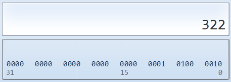

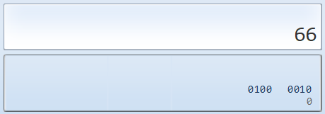

举例4：

```c
float f1 = 1.1f; //ok
double d2 = 4.58667435;
f1 = d2; // 出现精度损失 (double -> float )

printf("f1=%.8f", f1); // 期望： 4.58667435

```

由于存在精度限制，浮点数只是一个近似值，它的计算是不精确的。

举例5：

```c
float a = 3.14159; //3.14159为双精度浮点常量，分配8个字节；a为float变量，分配4个字节
```

编译时系统会发出警告(warning: truncation from ′const double′ to′float′)，提醒用户注意这种转换可能损失精度。

### 5.2 强制类型转换

隐式类型转换中的宽类型赋值给窄类型，编译器是会产生警告的，提示程序存在潜在的隐患。如果非常明确地希望转换数据类型，就需要用到`强制(或显式)类型转换`。

形式： **(类型名称)(变量、常量或表达式)**

功能：将“变量、常量或表达式”的运算结果强制转换为“类型名称”所表示的数据类型。

注意：强制类型转换会导致精度损失。

举例：

```c
double x = 12.3;
int y = 10;
int z = (int)x + y; //将变量x的值转换成int后,再与y相加
```

将浮点数转换为整数时，将舍弃浮点数的小数部分，只保留整数部分。

```c
float f1,f2;
f1 = (int)1.2 + 3.4;
f2 = (int)(1.2 + 3.4);
printf("f1=%f,f2=%f",f1,f2);
```

输出结果：f1=4.4，f2=4.0。

举例2：

```c
int i = 40000;
short s = (short)i;
printf("%d\n",s); //-25536
```

举例3：

```c
long y = (long) 10 + 12; // (long) 将 10 显式转为 long 类型。这里的显示转换其实是不必要的,因为可以自动转换
```

### 5.3 运算的溢出问题

每一种数据类型都有数值范围，如果存放的数值超出了这个范围（小于最小值或大于最大值），需要更多的二进制位存储，就会发生溢出。大于最大值，叫做`向上溢出（overflow）`；小于最小值，叫做`向下溢出（underflow）`。

一般来说，编译器不会对溢出报错，会正常执行代码，但是会忽略多出来的二进制位，只保留剩下的位，这样往往会得到意想不到的结果。所以，应该避免溢出。

举例1：

```c
unsigned char x = 255;
x = x + 1;
printf("%d\n", x); // 0
```

 x 是 unsign char 类型，最大值是255 （二进制 11111111 ），加 1 后就发生了溢出， 256 （二进制 100000000 ）的最高位 1 被丢弃，剩下的值就是 0 。

举例2：

```c
unsigned int ui = UINT_MAX;  // 4,294,967,295
ui++;
printf("ui = %u\n", ui); // 0
ui--;
printf("ui = %u\n", ui); // 4,294,967,295
```

常量 UINT_MAX 是 unsigned int 类型的最大值。如果加 1 ，对于该类型就会溢出，从而得到 0 ；而 0 是该类型的最小值，再减 1 ，又会得到 UINT_MAX 。

> 溢出很容易被忽视，编译器又不会报错，所以必须非常小心。


## 6、常量

### 6.1 常量分类

程序运行时，其值不能改变的量，即为`常量`。

C语言中的常量分为以下以下几种：

- 字面常量
- \#define 定义的标识符常量
- const 修饰的常变量
- 枚举常量

举例：字面常量

1、2、12是整型常量，2.1、12.5、3.14是实型常量，'a'、 'b'、'c'是字符型常量。

```c
#include <stdio.h>

int main(){
	//字面常量
	3.14;//字面常量
	1000;//字面常量
}
```

### 6.2 多种方式定义常量

#### 6.2.1 使用#define

这种方式是在文件开头用 #define 来定义常量，也叫作“宏定义”。所谓宏定义，**就是用一个标识符来表示一个常量值**，如果在后面的代码中出现了该标识符，那么编译时就全部替换成指定的常量值。即用宏体替换所有宏名，简称`宏替换`。

定义格式：`#define 符号常量名 常量值`

- 符号常量名，称为`宏体`，属于标识符，一般定义时用大写字母表示。
- 常量值，称为`宏名`，可以是数值常量，也可以是字符常量。

习惯上，**宏名用大写字母表示**，以便于与变量区别。但也允许用小写字母。

举例1：

```c
#include <stdio.h>

#define ZERO 0   //#define的标识符常量

int main() {
	printf("zero = %d\n", ZERO);
    return 0;
}
```

> 跟#include一样，“#”开头的语句都是“预处理语句”，在编译之前，预处理器会查找程序中所有的“ZERO”，并把它替换成0，这个过程称为预编译处理。
>
> 然后将预处理的结果和源程序一起再进行通常的编译处理，以得到目标代码 (OBJ文件)。

举例2：

```c
#include <stdio.h>

#define PI = 3.14  // 定义常量 PI，常量值 3.14。因为宏定义不是 C 语句，后面不能有分号

int main() {
   //PI = 3.1415  可以吗? => 不可以
  double area;
  double r = 1.2;
  area = PI * r * r;
  printf("面积 : %.2f", area);
  getchar();
  return 0;
}

```

举例3：

```c
//函数结果状态代码
#define OK 1
#define ERROR 0
#define OVERFLOW -2
```

> #define 对于考研数据结构来说没有什么贡献，我们只要认得它就行。
>
> 例如1，`#define MAX_Size 50`这句，即定义了常量`MAX_Size`(此时x = 50;等价于x = MAX_Size;)。
>
> 例如2，你要定义一个数组，如`int A[MAX_Size];`，加上一句注释“`/*MAX_Size为已经定义的常量，其值为50*/`”即可。

#### 6.2.2 使用const限定符

C99中新的声明方式，这种方式跟定义一个变量是一样的，只需要在变量的数据类型前再加上一个const关键字，这被称为“限定符”。

格式：

```c
const 数据类型 常量名 = 常量值;
```

举例：

```c
#include <stdio.h>

int main(){
	//const 修饰的常变量
	const float PI = 3.14f;
	//PI = 5.14;//是不能直接修改的！

	return 0;
}
```

const修饰的对象一旦创建就不能改变，所以必须初始化。

跟使用 #define定义宏常量相比，const定义的常量有详细的数据类型，而且会在编译阶段进行安全检查，在运行时才完成替换，所以会更加安全和方便。

#### 6.3.3 定义枚举常量

举例：

```c
#include <stdio.h>

//使用enum定义枚举类
enum Sex{
    //括号中的MALE,FEMALE,SECRET是枚举常量
	MALE,
	FEMALE,
	SECRET
};

int main(){
	//枚举常量
	printf("%d\n", MALE);
	printf("%d\n", FEMALE);
	printf("%d\n", SECRET);
	//注：枚举常量默认是从0开始，依次向下递增1的
	return 0;
}

```


> 【北京航空航天大学2018研】若已知有如下宏定义
>
> ```c
> #define  CANBERRA(x,y)  ((x－y)/(x＋y))
> ```
>
> 则以下表达式中，返回结果值最大的是（　　）。
> A．CANBERRA（3.0，2.0）；
> B．CANBERRA（4.0，1.0）；
> C．CANBERRA（1.0＋2.0，0.0＋2.0）；
> D．CANBERRA（1.0＋2.0，1.0＋1.0）；
>
> 【答案】C
>
> 【解析】A项中为1.0/5.0，结果为0.2；B项中为3.0/5.0，结果为0.6；C项中的宏替换后为（1.0＋2.0－0.0＋2.0）/（1.0＋2.0＋0＋2.0）＝1.0；D项中宏替换后为（1.0＋2.0－1.0＋1.0）/（1.0＋2.0＋1.0＋1.0）＝0.6，因此最后答案为C。


> 【中央财经大学2018研】若有如下宏定义：
>
> ```c
> #define  N  2
> #define  y(n)  ((N＋1)*n)
> ```
>
> 则执行下列语句：z＝4\*(N＋y(5))；后的结果是（　　）。
> A．语句有错误
> B．z值为68
> C．z值为60
> D．z值为180
>
> 【答案】B
>
> 【解析】y(5)＝15，z＝4\*(N＋y(5))＝4*17＝68，答案选B。


## 7、输入/输出函数

所谓输入输出是以计算机主机为主体而言的。

- 输出：从计算机向外部输出设备(显示器、打印机)输出数据。
- 输入：从输入设备(键盘、鼠标、扫描仪)向计算机输入数据。

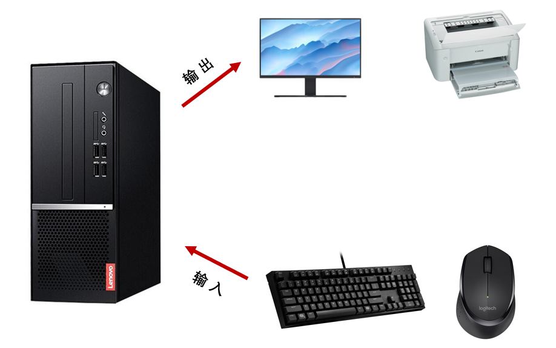

c语言本身没有提供专门的输入输出语句，所有的输入输出都是由调用标准库函数中的输入输出函数来实现的。

**输入函数：scanf() 、 getchar()、gets()：** 

- scanf()，是格式输入函数，可接收`任意类型`的数据。 
- getchar()，是`字符`输入函数， 只能接收`单个字符`。
- gets()，是`字符串`输入函数。

**输出函数：printf() 、 putchar()、puts()：**

- printf()，是格式输出函数，可按指定的格式显示任意类型的数据。
- putchar()，`字符`显示函数，只能显示`单个字符`。
- puts()，是`字符串`输出函数。

### 7.1 scanf()的使用

scanf()函数的作用：把从键盘上输入的数据根据找到的地址存入内存中，即给变量赋值。

格式： `scanf("格式控制字符串",参数地址列表); `

- “格式控制字符串”：约定输入数据的类型和格式，参数的个数必须与变量地址的个数一致。
- “参数地址列表”：以逗号 “, ”分隔的、`输入数据变量地址`序列。

举例：

```c
scanf("%d%d%d",&a,&b,&c)
```

其中，&a,&b,&c中的`&`是寻址操作符，&a表示对象a在内存中的地址。

注意，

- 如果scanf中%d是连着写的，如“`%d%d%d`”，在输入数据时，数据之间不可以用逗号分隔，只能用空白字符（空格或tab键或者回车键）分隔。即“`2(空格)3(tab)4`” 或 “`2(tab)3(回车)4`”等。
- 如果是“`%d,%d,%d`”，则在输入数据时需要加“,”，如“`2,3,4`”。

举例1：计算圆的面积，其半径由用户指定

```c
#include <stdio.h>

int main() {
    float radius, area;
    printf("请输入半径值：  ");
    scanf("%f", &radius);      //输入半径
    area = 3.14 * radius * radius;
    printf("area=%f\n", area); //输出圆的面积
    
    return 0;
}

```

> 注意：变量名之前要加上&运算符，表示取变量的地址，如“&a，&b”。否则将会出现错误。

举例2：输入一个整数，求其绝对值。

```c
#include <stdio.h>

int main() {

    int num;
    printf("输入一个整数:");

    scanf("%d", &num);
    int absNum = num;
    if(absNum < 0)
        absNum = -absNum;
    printf("\n 整数:%d--->绝对值为:%d\n", num, absNum);

    return 0;
}
```

举例3：输入多个变量的值，求乘积

```c
#include <stdio.h>

int main() {
    int a,b,c;
    printf("请输入整数a,b:");
    scanf("%d%d",&a,&b);
    c=a*b;
    printf("%d*%d=%d\n",a,b,c);
    
    return 0;
}
```

> 【武汉科技大学2019研】若有声明语句：int x； char y[20]； double z；则正确的输入语句是（　）。
> A．scanf（"%d%c%le\n"，&x，&y，&z）；
> B．scanf（"%2d%s%lf"，&x，&y，&z）；
> C．scanf（"%d%s%lf"，&x，y，&z）；
> D．scanf（"%x%s%3.2f"，&x，y，&z）；
>
> 【答案】C
>
> 【解析】y为一维数组名，指向数组首元素的地址，因此不需要再使用取地址运算符&，AB错误；D中%3.2f表示长度为3，小数为2位，但是小数点也占一位，因此D错误，答案选C。

### 7.2 getchar()与putchar()的使用

- getchar()：输入字符数据
  - 格式：getchar()
  - 功能：从键盘缓冲区读入一个字符

- putchar()：输出字符
  - 格式： putchar(ch)，其中ch是一个字符变量
  - 功能：从标准输出设备输出一个字符

举例：

```c
#include <stdio.h>

int main() {
    char c = 0;
	putchar('A'); //输出单个字符A
	putchar(c);   //输出变量c的ASCII对应字符
	putchar('\n'); //执行换行效果，屏幕不显示
}
```

```c
#include <stdio.h>

int main() {
    char ch;
    ch = getchar();
    putchar(ch);
    return 0;
}
```

### 7.3 gets()与puts()的使用(超纲)

**puts()：**

在C语言中，puts() 是一个用于输出字符串的标准库函数，其原型定义在 `<stdio.h>` 头文件中。`puts()` 函数的作用是将一个以 null 字符（`\0`）结尾的字符串打印到标准输出（通常是控制台）上，并自动添加一个换行符。

```c
int main() {

    char str1[]={"China\nBeijing"};
    char str2[] = "helloworld";

    puts(str1);

    puts(str2);

    return 0;
}

```

注意，puts()函数只能用于输出字符串，而不能输出其他类型的数据。如果需要输出其他类型的数据，应使用 `printf()` 函数。

**gets()：**

读取标准输入设备输入的字符串，直到遇到【Enter】键才结束。

```c
char str[20];   //定义一个数组
gets(str);      //获取输入的字符串,存放到字符数组中
```

举例：字符串的读写

```c
int main() {

    char str[15];
    printf("enter your name:");
    gets(str);        //输入字符串至数组变量str
    printf("your name is ");
    puts(str);        //输出字符串

    return 0;
}
```


## 8、变量按声明位置的分类(后面讲)

变量按照声明的位置，可以分为：局部变量 和 全局变量。

- **局部变量**
  - 在`函数体内定义`的变量，也称内部变量。局部变量只能在定义它的函数中使用。

- **全局变量**
  - 在`函数之外`定义的变量称为外部变量，外部变量是`全局变量`（也称全程变量）。

  - 一个程序中，凡是在全局变量之后定义的函数，都可以使用在其之前定义的全局变量。

举例：

```c
#include <stdio.h>

int global = 2023;//全局变量
int main(){
    int local = 2022;//局部变量
    
    //下面定义的global会不会报错？
    int global = 2024;//局部变量
    printf("global = %d\n", global);
    return 0;
}
```

> 当局部变量和全局变量同名的时候，局部变量优先使用。


## 9、常见的进制

### 9.1 二进制概述

**计算机底层如何存储数据呢？**

> 计算机世界中只有二进制，所以计算机中存储和运算的`所有数据`都要转为`二进制`。包括数字、字符、图片、声音、视频等。


> **世界上有10种人 ，认识和不认识二进制的。**

**二进制的由来**

二进制，是计算技术中广泛采用的一种数制，由德国数理哲学大师`莱布尼茨`于1679年发明。

二进制数据是用0和1两个数码来表示的数。它的基数为2，进位规则是“`逢二进一`”。

**二进制的应用**

二进制广泛应用于我们生活的方方面面。比如，广泛使用的摩尔斯电码（Morse Code），它由两种基本信号组成：短促的点信号“`·`”，读“`滴`”；保持一定时间的长信号“`—`”，读“`嗒`”。然后，组成了26个字母，从而拼写出相应的单词。

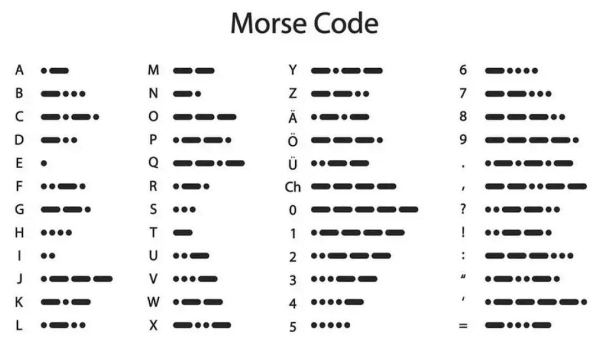

我们偶尔会看到的：SOS，即为：


### 9.2 进制的分类

- **十进制（decimal）**

  - 数字组成：0-9
  - 进位规则：满十进一
  - C 语言的整数默认都是十进制数

- **二进制（binary）**

  - 数字组成：0-1
  - 进位规则：满二进一，以`0b`或`0B`开头

  ```c
  int x = 0b101010;
  ```

- **八进制（octal）：很少使用**

  - 数字组成：0-7
  - 进位规则：满八进一，以数字`0`开头表示

  ```c
  int a = 012; // 八进制，相当于十进制的10
  int b = 017; // 八进制，相当于十进制的15
  ```

- **十六进制**

  - 数字组成：0-9，a-f
  - 进位规则：满十六进一，以`0x`或`0X`开头表示。此处的 a-f 不区分大小写

  ```c
  int a = 0x1A2B; // 十六进制，相当于十进制的6699
  int b = 0X10;   // 十六进制，相当于十进制的16
  ```

### 9.3 进制的换算举例

| 十进制 | 二进制 | 八进制 | 十六进制 |
| ------ | ------ | ------ | -------- |
| 0      | 0      | 0      | 0        |
| 1      | 1      | 1      | 1        |
| 2      | 10     | 2      | 2        |
| 3      | 11     | 3      | 3        |
| 4      | 100    | 4      | 4        |
| 5      | 101    | 5      | 5        |
| 6      | 110    | 6      | 6        |
| 7      | 111    | 7      | 7        |
| 8      | 1000   | 10     | 8        |
| 9      | 1001   | 11     | 9        |
| 10     | 1010   | 12     | a或A     |
| 11     | 1011   | 13     | b或B     |
| 12     | 1100   | 14     | c或C     |
| 13     | 1101   | 15     | d或D     |
| 14     | 1110   | 16     | e或E     |
| 15     | 1111   | 17     | f或F     |
| 16     | 10000  | 20     | 10       |

### 9.4 输出格式

不同的进制只是整数的书写方法不同，不会对整数的实际存储方式产生影响。不同进制可以混合使用，比如 10 + 015 + 0x20 是一个合法的表达式。

printf() 的进制相关占位符如下：

- %d ：十进制整数。


- %o ：八进制整数。


- %x ：十六进制整数。


- %#o ：显示前缀 0 的八进制整数。


- %#x ：显示前缀 0x 的十六进制整数。


- %#X ：显示前缀 0X 的十六进制整数。


```c
int x = 100;
printf("dec = %d\n", x); // 100
printf("octal = %o\n", x); // 144
printf("hex = %x\n", x); // 64
printf("octal = %#o\n", x); // 0144
printf("hex = %#x\n", x); // 0x64
printf("hex = %#X\n", x); // 0X64
```

### 9.5 进制间的转换(了解)

#### 9.5.1 二进制如何表示整数？

- 计算机数据的存储使用二进制`补码`形式存储，并且`最高位是符号位`。
  - 正数：`最高位是0`
  - 负数：`最高位是1`


- 规定1：正数的补码与反码、原码一样，称为`三码合一`
- 规定2：负数的补码与反码、原码不一样：
  - 负数的`原码`：把十进制转为二进制，然后最高位设置为1
  - 负数的`反码`：在原码的基础上，最高位不变，其余位取反（0变1,1变0）
  - 负数的`补码`：反码+1

#### 9.5.2 二进制与十进制间的转换


**二进制转十进制：权相加法**

针对于一个字节的数据举例来说：

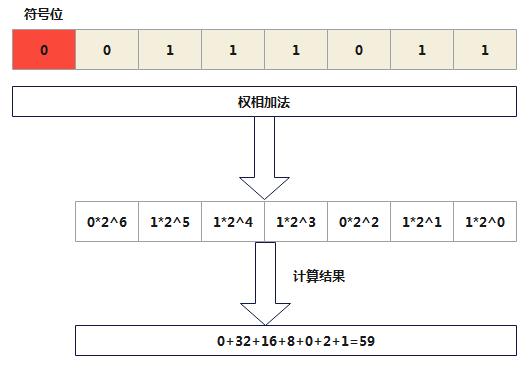


- 例如：1个字节（8位）

  25 ==> 原码  0001 1001 ==> 反码  0001 1001 -->补码  0001 1001

  -25 ==>原码  1001 1001 ==> 反码1110 0110 ==>补码 1110 0111

```java
整数：
正数：25   00000000 00000000 000000000 00011001（原码）
正数：25   00000000 00000000 000000000 00011001（反码）
正数：25   00000000 00000000 000000000 00011001（补码）

负数：-25  10000000 00000000 000000000 00011001（原码）
负数：-25  11111111 11111111 111111111 11100110（反码）
负数：-25  11111111 11111111 111111111 11100111（补码）
```

**一个字节可以存储的整数范围是多少？**

```java
//1个字节：8位

0000 0001  ~  0111 111 ==> 1~127

1000 0001 ~ 1111 1111 ==> -127 ~ -1

0000 0000 ==>0

1000 0000 ==> -128（特殊规定）=-127-1
```

**十进制转二进制**

十进制转二进制：`除2取余的逆`


#### 9.5.3 二进制与八进制、十六进制间的转换

**二进制转八进制**

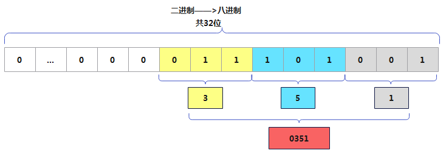

**二进制转十六进制**

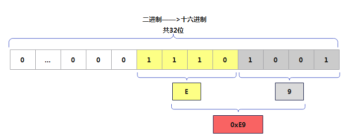

**八进制、十六进制转二进制**

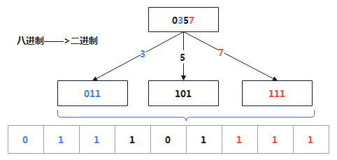

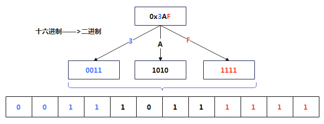

> 练习：以下叙述中错误的是（　　）。
> A．C程序在运行过程中所有计算都以十进制方式进行
> B．C程序在运行过程中所有计算都以二进制方式进行
> C．所有C程序都需要编译链接无误后才能运行
> D．C程序中字符变量存放的是字符的ASCII值
>
> 【答案】A
>
> 【解析】C程序在运行过程中所有计算都以二进制方式进行。答案选择A选项。


>  【华南理工大学2018研】与十进制1100等值的十六进制数是（　　）。
>  A．44A
>  B．44C
>  C．54A
>  D．54C
>
>  【答案】B
>
>  【解析】1100转换成二进制为0100 0100 1100，因此转换为十六进制为44C。

