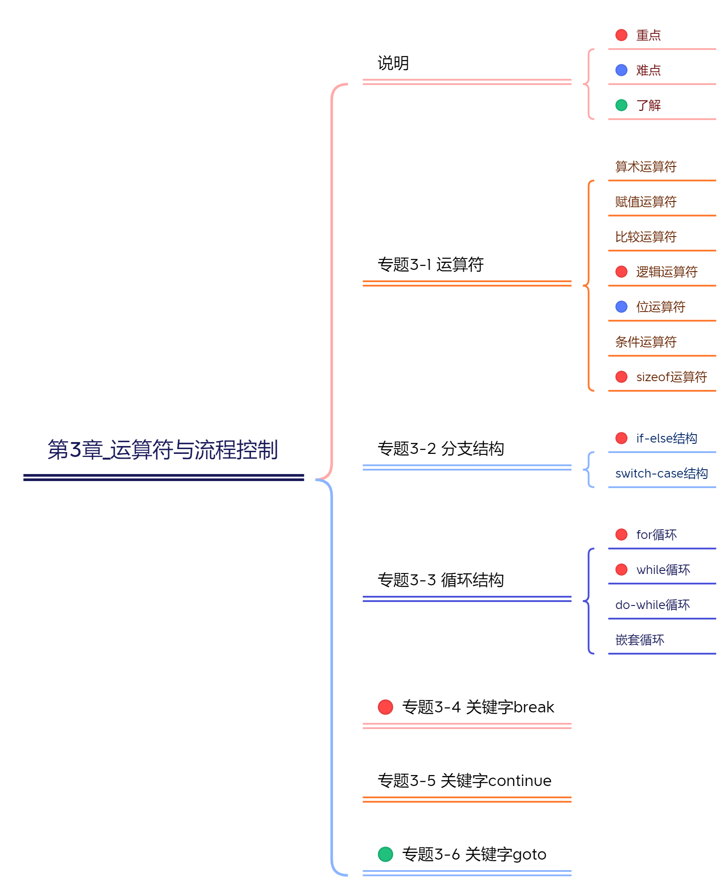
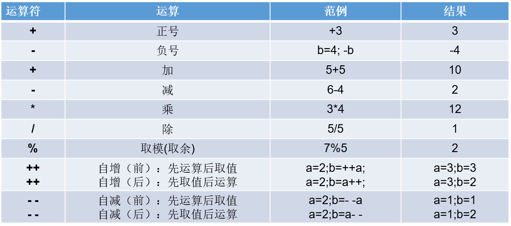
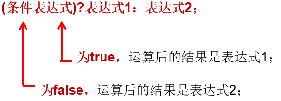
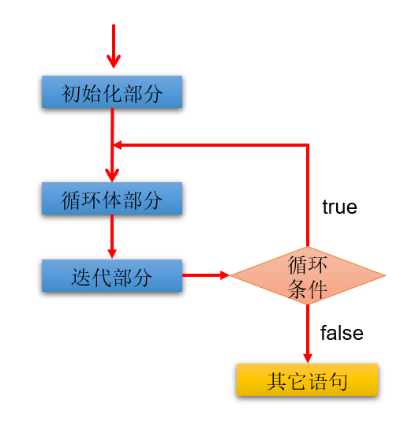
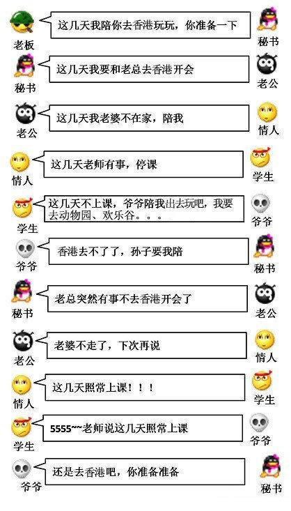
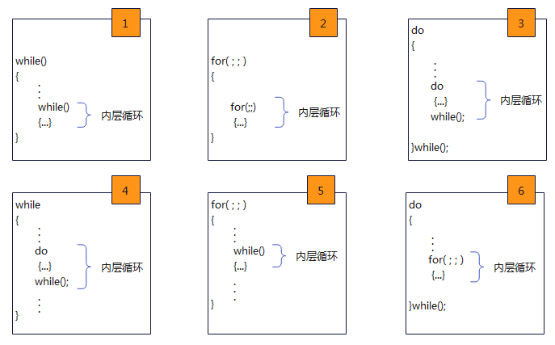

# 第03章_运算符与流程控制

讲师：尚硅谷-宋红康（江湖人称：康师傅）

官网：[http://www.atguigu.com](http://www.atguigu.com/)

***

## 本章专题脉络




## 1. 运算符（Operator）

运算符是一种特殊的符号，用以表示数据的运算、赋值和比较等。

运算符的分类：

- 按照`功能`分为：算术运算符、赋值运算符、比较(或关系)运算符、逻辑运算符、位运算符、条件运算符、sizeof运算符

|        分类        |           运算符            |
| :----------------: | :-------------------------: |
|     算术运算符     | +、-、+、-、*、/、%、++、-- |
|     赋值运算符     |   =、+=、-=、*=、/=、%=等   |
| 比较(或关系)运算符 |    >、>=、<、<=、==、!=     |
|     逻辑运算符     |         &&、\|\|、!         |
|      位运算符      |     &、\|、^、~、<<、>>     |
|     条件运算符     |  (条件表达式)?结果1:结果2   |
|    sizeof运算符    |          sizeof()           |

* 按照`操作数个数`分为：一元运算符（单目运算符）、二元运算符（双目运算符）、三元运算符 （三目运算符）

|           分类            |                  运算符                  |
| :-----------------------: | :--------------------------------------: |
| 一元运算符（单目运算符）  |    正号（+）、负号（-）、++、--、!、~    |
| 二元运算符（双目运算符）  | 除了一元和三元运算符剩下的都是二元运算符 |
| 三元运算符 （三目运算符） |         (条件表达式)?结果1:结果2         |

### 1.1 算术运算符

算术运算符专门用于算术运算，主要有下面几种。



举例1：

```c
int x = -12;
int y = -x;
int z = +y; //+可以省略
```

举例2：

```c
int a = 4 + 2;

int num = 5;
printf("%d\n", num * num); // 输出 25

float x = 6 / 4;
printf("%f\n", x); // 输出 1.000000

float x = 6.0 / 4; // 或者写成 6 / 4.0
printf("%f\n", x); // 输出 1.500000
```

举例3：%，运算结果的符号与被模数相同

```c
int x1 = 6 % 4; // 2
int x2 = -6 % 4; // -2
int x3 = 6 % -4; // 2
int x4 = -6 % -4; // -2
```

举例4：自加自减运算

理解：`++`  运算，表示`自增1`。同理，`--` 运算，表示`自减1`，用法与++ 一致。

1、单独使用

* 变量在单独运算的时候，变量`前++`和变量`后++`，是没有区别的。
* 变量`前++`   ：例如 `++a` 。
* 变量`后++`   ：例如 `a++` 。

```c
int main() {
    int a = 10;

    //++a;
    a++;
    //无论是变量前++还是变量后++，结果都是11
    printf("%d\n",a);

    return 0;
}
```

2、复合使用

* 和`其他变量放在一起使用`或者和`输出语句放在一起使用`，`前++`和`后++`就产生了不同。

- 变量`前++` ：变量先自增1，然后再运算。
- 变量`后++` ：变量先运算，然后再自增1。

```c
int main() {
    // 其他变量放在一起使用
    int x = 3;
    //int y = ++x; // y的值是4，x的值是4，
    int y = x++; // y的值是3，x的值是4

    printf("%d\n",x);
    printf("%d\n",y);
    printf("==========\n");

    // 和输出语句一起
    int z = 5;
    //printf("%d\n",++z);// 输出结果是6，z的值也是6
    printf("%d\n",z++);// 输出结果是5，z的值是6
    printf("%d\n",z);

    return 0;
}
```

与此对应的：

- 变量`前--` ：变量先自减1，然后再运算。
- 变量`后--` ：变量先运算，然后再自减1。

**案例1：**

```
随意给出一个整数，打印显示它的个位数，十位数，百位数的值。
格式如下：
数字xxx的情况如下：
个位数：
十位数：
百位数：

例如：
数字153的情况如下：
个位数：3
十位数：5
百位数：1

```

```c
#include <stdio.h> 
    
int main() {
    int num = 153;

    int bai = num / 100;
    int shi = num % 100 / 10;//int shi = num / 10 % 10;
    int ge = num % 10;

    printf("百位为：%d\n", bai);
    printf("十位为：%d\n", shi);
    printf("个位为：%d\n", ge);

    return 0;
}

```

**案例2：**为抵抗洪水，战士连续作战89小时，编程计算共多少天零多少小时？

```c
#include <stdio.h>

int main() {
    int hours = 89;
    int day = hours / 24;
    int hour = hours % 24;
    printf("为抵抗洪水，战士连续作战%d小时：是%d天%d小时\n",hours,day,hour);

    return 0;
}
```


### 1.2 赋值运算符

- 符号 = 
  - 当“=”两侧数据类型不一致时，可以使用自动类型转换或使用强制类型转换原则进行处理。
  - 支持`连续赋值`。
- 扩展赋值运算符： +=、 -=、*=、 /=、%=

| 运算符 | 名称       | 实例 | 展开形式 |
| ------ | ---------- | ---- | -------- |
| +=     | 复合加赋值 | a+=b | a=a+b    |
| -=     | 复合减赋值 | a-=b | a=a-b    |
| *=     | 复合乘赋值 | a*=b | a=a*b    |
| /=     | 复合除赋值 | a/=b | a=a/b    |
| %=     | 复合模赋值 | a%=b | a=a%b    |

举例：

```c
i += 3;  // 等同于 i = i + 3
i -= 8;  // 等同于 i = i - 8
i *= 9;  // 等同于 i = i * 9
i /= 2;  // 等同于 i = i / 2
i %= 5;  // 等同于 i = i % 5
```

举例：

```c
//连续赋值的测试
//以前的写法
int a1 = 10;
int b1 = 10;

//连续赋值的写法
int a2,b2;
a2 = b2 = 10;

int a3 = 10,b3 = 20;
```

举例：

```c
int a = 10;
a += 1.7;  // a=a+1.7 => 11.7 => 11
printf("a=%d", a);  // a=11
```

举例：

```c
int a, b, c;
a = (b = 5);    //表达式的值为5,将5赋值给b，接着将b的值赋值给a
a = 5 + (c = 6);        //表达式值为11，a值为11，c值为6
a = (b = 4) + (c = 6);    //表达式值为10，a值为10，b等于4，c等于6
a = (b = 10) / (c = 2);    //表达式值为5，a等于5，b等于10，c等于2
a = (b = 3 * 4);        //表达式值为12，a,b值均为12
```


> 【武汉科技大学2019研】
>
> 若a、b和t都为int变量，则下面不能交换变量a和b值的是（　　）。
> A．t＝a； a＝b； b＝t；
> B．a＝t； t＝b； b＝a；
> C．t＝b； b＝a； a＝t；
> D．a＝a＋b； b＝a－b； a＝a－b；
>
> 【答案】B
>
> 【解析】B中首先把t的值赋值给了a，则a的值已经被取代了，后面执行b＝a，则ab的值都等于t的值。


>  【中央财经大学2018研】以下程序运行后的输出结果是（　　）。
>
>  ```c
>  int main(){  
>    double d;  
>    float f;  
>    long l;  
>    int i;  
>    i = f = l = d = 20/3;  
>    printf("%d %ld %.1f %.1f\n",i,l,f,d);  
>    return 0;
>  } 
>  ```
>
>  A．6 6 6.0 6.0
>  B．6 6 6.7 6.7
>  C．6 6 6.0 6.7
>  D．6 6 6.7 6.0
>
>  【答案】A
>
>  【解析】赋值运算符是自右向左结合的，所以首先执行d＝20/3＝6，同时i、l、f也全为6，在进行输出时，f和d要保留一位小数，所以答案选A。


> 练习：
>
> 以下选项中正确的定义语句是（　　）。
> A．double a；b；
> B．double a＝b＝7；
> C．double a＝7，b＝7；
> D．double，a，b；
>
> 【答案】C
>
> 【解析】同一类型变量的定义时，不同变量之间需要用“，”分隔，选项A错误；定义变量时初始化赋值不能用等号连接，选项B错误；变量类型说明后面不能用逗号，而是用空格分离，选项D错误。答案选择C选项。


### 1.3 比较运算符(或关系运算符)

常用的比较运算符：

| 关系运算符 | 含义     | 举例      |
| ---------- | -------- | --------- |
| >          | 大于     | num > 10  |
| >=         | 大于等于 | num >= 10 |
| <          | 小于     | num < 10  |
| <=         | 小于等于 | num <= 10 |
| `==`       | 等于     | num == 10 |
| !=         | 不等于   | num != 10 |

- 比较运算的结果只有两个取值，要么是真(非0 表示，默认使用1)，要么是假(0 表示)。
  - 比如， 20 > 12 返回 1 ， 12 > 20 返回 0 。
- 比较运算符“`==`”不能误写成“`=`” 

举例1：

```c
int i1 = 10;
int i2 = 20;

printf("%d\n",i1 == i2);//0
printf("%d\n",i1 != i2);//1
printf("%d\n",i1 >= i2);//0


int m = 10;
int n = 20;
printf("%d\n",m == n);//0
printf("%d\n",m = n);//20
```

举例2：多个关系运算符不宜连用。

```c
i < j < k   //期望判断j是否大于i，且小于k
```

这是合法表达式，不会报错，但是通常达不到想要的结果，即不是保证变量 j 的值在 i 和 k 之间。比如：

```c
//i < j < k
int j = 10;
if(15 < j < 20){
    printf("j大于15,且小于20"); //输出此语句
}else{
    printf("j不在15到20之间");
}
```

因为关系运算符是从左到右计算，所以实际执行的是：

```c
(i < j) < k; //i < j 返回 0 或 1 ，所以最终是 0 或 1 与变量 k 进行比较
```

期望的效果应该写为：

```c
//i < j < k
int j = 10;
if(15 < j && j < 20){
    printf("j大于15,且小于20"); 
}else{
    printf("j不在15到20之间"); //输出此语句
}
```


>  【北京航空航天大学2018研】若变量a，b，c的取值分别是1，2，3，则表达式“!((b＋c)＞(a＋4))”的值是（　）。
>  A．0
>  B．1
>  C．2
>  D．3
>
>  【答案】B
>
>  【解析】首先b＋c等于5，a＋4也等于5，因此 (b＋c)＞(a＋4)为“假”，即0，对0取非结果为1，因此答案为B。


### 1.4 逻辑运算符

主要有下面三个运算符：

| 逻辑运算符 | 描述     | 功能                 | 举例                              |
| ---------- | -------- | -------------------- | --------------------------------- |
| &&         | 与运算符 | 两个条件都要满足     | num1 >= 10 && num2 >= 20          |
| \|\|       | 或运算符 | 两个条件只需满足其一 | num1 >= 10 \|\| num2 >= 20        |
| !          | 非运算符 | 否定条件             | !(num1 >= 10)（等价于 num1 < 10） |

逻辑运算符提供逻辑判断功能，用于构建更复杂的表达式。

举例：

| a       | b       | a && b  | a \|\| b | !a      |
| ------- | ------- | ------- | -------- | ------- |
| 1（真） | 1（真） | 1（真） | 1（真）  | 0（假） |
| 1（真） | 0（假） | 0（假） | 1（真）  | 0（假） |
| 0（假） | 1（真） | 0（假） | 1（真）  | 1（真） |
| 0（假） | 0（假） | 0（假） | 0（假）  | 1（真） |

> 对于逻辑运算符来说，任何非零值都表示真，零值表示伪。比如， 5 || 0 会返回 1 ， 5 && 0 会返回0 。

举例1：

```c
int x = 5;
int y = 11;
if (x < 10 && y > 20)
	printf("今天天气真晴朗\n");
```

举例2：**短路现象**

- &&：a && b
  - 当 a 为假(或0)时，因为a && b 结果必定为 0，所以不再执行表达式 b
  - 当 a 为真(非0)时，因为a && b 结果不确定，所以会继续求解表达式b

```c
int i = 0;
int j = 10;
if(i && j++ > 0){
    printf("床前明月光");
}else{
    printf("我叫郭德纲");
}

printf("%d\n",j); //10
```

- || ：a || b
  - 当 a 为真(非0)时，因为a || b 结果必定为 1，所以不再执行表达式 b
  - 当 a 为假(或0)时，因为a || b 结果不确定，所以会继续求解表达式b

```c
int i = 1;
int j = 10;
if(i || j++ > 0){
    printf("床前明月光");
}else{
    printf("我叫郭德纲");
}

printf("%d\n",j); //10
```

练习：请写出如下程序运行后的结果

```c
int main() {
    int x = 1;
    int y = 0;
    short z = 42;

    if ((z++ == 42) && (y = 1)) {
        z++; // z = 44
    }
    if ((x = 0) || (++z == 45)) {
        z++;  // z = 46
    }

    printf("z=%d", z);

    return 0;
}
```

> 答案：z=46

>  【华南理工大学2018研】设int a＝3；，下列哪一个表达式的值等于0（　　）。
>  A．a&&(a＞0)
>  B．!a||a
>  C．a%＝a
>  D．a＞＝a
>
>  【答案】C
>
>  【解析】A中a!＝0且a＞0所以表达式的值为1；B中||表示或，所以值也为1；D中表达式值也为1；答案选C。


>  【四川大学2017研】语句：printf("%d",(a＝2) && (b＝－2))；的输出结果是（　　）。
>  A．无输出
>  B．结果不确定
>  C．－1
>  D．1
>
>  【答案】D
>
>  【解析】a＝2为真，b＝－2也为真，所以输出1，答案选D。


### 1.5 位运算符

- C 语言提供一些位运算符，用来操作二进制位（bit）。

- 位运算符的运算过程都是基于二进制的补码运算。

| 运算符 | 描述       | 运算规则                                                     |
| ------ | ---------- | ------------------------------------------------------------ |
| <<     | 二进制左移 | 将一个数的各二进制位全部左移指定的位数，左边的二进制位丢弃，右边补0。 |
| >>     | 二进制右移 | 将一个数的各二进制位全部右移指定的位数，正数左补0，负数左补1，右边丢弃。 |
| &      | 按位与     | 两个二进制位都为 1，结果为1，否则为0。                       |
| \|     | 按位或     | 两个二进制位只要有一个为1（包含两个都为 1 的情况），结果为1，否则为0。 |
| ^      | 按位异或   | 两个二进制位一个为0，一个为1，结果为1，否则为0。             |
| ~      | 按位取反   | 将每一个二进制位变成相反值，即 0 变成 1 ， 1 变成 0 。       |

- 结合赋值运算符的经验，这里有：<<= 、 >>= 、 &= 、 ^= 等

**举例1：**

`（1）左移：<<`

> 运算规则：在一定范围内，数据每向左移动一位，相当于原数据*2。（正数、负数都适用）

【注意】当左移的位数n超过该数据类型的总位数时，相当于左移（n-总位数）位

```c
3<<4  类似于  3*2的4次幂 => 3*16 => 48
```


```c
-3<<4  类似于  -3*2的4次幂 => -3*16 => -48
```


`（2）右移：>>`

> 运算规则：在一定范围内，数据每向右移动一位，相当于原数据/2。（正数、负数都适用）

【注意】

1、如果不能整除，`向下取整`。

2、右移运算符最好只用于无符号整数，不要用于负数。因为不同系统对于右移后如何处理负数的符号位，有不同的做法，可能会得到不一样的结果。

```java
69>>4  类似于  69/2的4次幂 = 69/16 =4
```


```c
-69>>4  类似于  -69/2的4次幂 = -69/16 = -5
```


练习：高效的方式计算2 * 8的值（经典面试题）

```
答案：2 << 3 、  8  << 1
```

**举例2：**

`（1）按位与：&`

运算规则：对应位都是1才为1，否则为0。

- 1 & 1 结果为1

- 1 & 0 结果为0

- 0 & 1 结果为0


- 0 & 0 结果为0


```c
9 & 7 = 1
```


```c
-9 & 7 = 7
```


`（2）按位或：|`

运算规则：对应位只要有1即为1，否则为0。

- 1 | 1 结果为1

- 1 | 0 结果为1

- 0 | 1 结果为1

- 0 & 0 结果为0


```c
9 | 7  //结果： 15
```


```c
-9 | 7 //结果： -9
```


`（3）按位异或：^`

运算规则：对应位一个为1一个为0，才为1，否则为0。

- 1 ^ 1 结果为0

- 1 ^ 0 结果为1

- 0 ^ 1 结果为1


- 0 ^ 0 结果为0


```c
9 ^ 7  //结果为14
```


```c
-9 ^ 7 //结果为-16
```


`（4）按位取反：~`

运算规则：对应位为1，则结果为0；对应位为0，则结果为1。

- ~0就是1  

- ~1就是0

```c
~9  //结果：-10
```


```c
~-9  //结果：8
```


练习1：

```c
int i = 12,j = 5;

printf("%d\n",i & j); //4
printf("%d\n",i | j); //13
printf("%d\n",i ^ j); //9
```


**练习2：特定位清零**

技巧：待清零的位与0，其它位与1

示例：设字符型 x 的当前值为 53，将其最低两位清 0，其余位保持不变

分析：与二进制的0b11111100数值求&运算即可。

```c
int main() {
    char x = 53; // 0b00110101
    x = x & 252; // 0b11111100
    printf("%d", x); //0b00110100
    return 0;
}
```

举例：判断特定位是否为零

技巧：待判定位与 1，其它位与 0；判与运算结果是否为 0

示例：设字符型 x 的当前值为 53，判定其最高位是否为 0

分析：与二进制的0b10000000求&运算，若结果为 0，则最高位为 0，否则为 1

```c
int main() {
    char x = 53; // 0b00110101
    x = x & 128; // 0b10000000
    if(x == 0)
        printf("最高位为0");
    else
        printf("最高位不为0");
    
    return 0;

}
```

举例：保留特定位

技巧：待保留位全部与 1，其余位与 0

示例：设字符型 x 的当前值为 53，保留其最低 4 位，其余位清零

分析：与二进制的0b00001111求&运算即可。

```c
int main() {
    char x = 53; // 0b00110101
    x = x & 15;  // 0b00001111

    printf("%d\n",x); //0b00000101

    return 0;

}
```

举例：待置 1 或 1，保持位或 0

示例：设字符型 x 的当前值为 53，将其最低两位置 1，其余位保持不变

分析：与二进制0b00000011求或运算即可

```c
int main() {
    char x = 53; // 0b00110101
    x = x | 3;   // 0b00000011

    printf("%d\n",x); //0b00110111

    return 0;

}
```

举例：特定位取反

待取反位异或 1，保持位异或 0

示例：设字符型 x 的当前值为 53，将其最低两位取反，其余位保持不变

分析：与二进制0b00000011求异或运算即可

```c
int main() {
    char x = 53; // 0b00110101
    x = x ^ 3;   // 0b00000011

    printf("%d\n",x); //0b00110110

    return 0;

}
```

### 1.6 条件运算符

- 条件运算符格式：


```c
(条件表达式)? 表达式1:表达式2
```

- 说明：条件表达式是如果为 true (非0值)，就执行表达式1，否则执行表达式2。

  

- 如果运算后的结果赋给新的变量，要求表达式1和表达式2为同种或兼容的类型

**举例1：**获取两个数中的较大值

```c
int main() {
    //获取两个数的较大值
    int m1 = 10;
    int m2 = 20;

    int max1 = (m1 > m2)? m1 : m2;
    printf("m1和m2中的较大值为%d\n",max1);

    return 0;

}
```

**举例2：**获取三个数中的最大值

```c
int main() {
    int n1 = 23;
    int n2 = 13;
    int n3 = 33;
    //写法1：
    int tempMax = (n1 > n2)? n1:n2;
    int finalMax = (tempMax > n3)? tempMax : n3;
    printf("三个数中最大值为%d\n",finalMax);

    //写法2：不推荐，可读性差
    int finalMax1 = (((n1 > n2)? n1:n2) > n3)? ((n1 > n2)? n1:n2) : n3;
    printf("三个数中最大值为%d\n",finalMax1);

    return 0;

}
```


>  【华南理工大学2018研】输入一个字符，判别它是否为大写字母，如果是，将它变为小写字母；如果不是，不转换。然后输出最后得到的字符。请在下面空白处填上适当语句。
>
>  ```c
>  #include<stdio.h>
>  int main(){ 
>    char ch;  
>    scanf("%c", ① );  
>    ch=(ch>='A'&& ② )?(ch+32): ③ ;  
>    printf( ④ ,ch);  
>    return ⑤ ;
>  } 
>  ```
>
>  【答案】①&ch②ch＜＝'Z'③ch④"%c"⑤0
>
>  【解析】程序进行输入时要加上地址符&；main函数中的第三行为一个三目运算符，当ch在A～Z之间时ch为真，此时ch＋32变为小写字母，否则不变；程序进行输出时应用%加上数据类型进行输出，最后用return 0来结束程序。


### 1.7 sizeof 运算符

sizeof 运算符：sizeof(参数)

- 参数可以是`数据类型`的关键字，也可以是`变量名`或某个`具体的值`。
- 返回某种数据类型或某个值占用的字节数量。

举例1：参数为数据类型

```c
int x = sizeof(int);  //通常是 4 或 8
```

举例2：参数为变量

```c
int i;
sizeof(i); //通常是 4 或 8

// 参数为数值
sizeof(3.14); //浮点数的字面量一律存储为double类型,故返回 8
```

**sizeof返回值的类型说明**

sizeof 运算符的返回值，C 语言只规定是无符号整数，并没有规定具体的类型，留给系统自己去决定sizeof 到底返回什么类型。不同的系统中，返回值的类型有可能是 unsigned int ，也有可能是unsigned long ，甚至是 unsigned long long ，对应的 printf() 占位符分别是 %u 、 %lu和 %llu 。这样不利于程序的可移植性。

C 语言提供了一个解决方法，创造了一个类型别名 `size_t` ，用来统一表示 sizeof 的返回值类型。该别名定义在 `stddef.h` 头文件里面，对应当前系统的 sizeof 的返回值类型，可能是 unsigned int ，也可能是 unsigned long 。

printf() 有专门的占位符 `%zd` 或 `%zu` ，用来处理 size_t 类型的值。

```c
printf("%zd\n", sizeof(int));
```

上面代码中，不管 sizeof 返回值的类型是什么， %zd 占位符（或 %zu ）都可以正确输出。

如果当前系统不支持 %zd 或 %zu ，可使用 %u （unsigned int）或 %lu （unsigned long int）代替。


### 1.8 运算符的优先级

运算符有不同的优先级，所谓优先级就是在表达式运算中的运算符顺序。

上一行中的运算符总是优先于下一行的。


> 开发建议：
>
> 1. 不要过多的依赖运算的优先级来控制表达式的执行顺序，这样可读性太差，尽量`使用()来控制`表达式的执行顺序。
> 2. 不要把一个表达式写得过于复杂，如果一个表达式过于复杂，则把它`分成几步`来完成。例如：
>    ​ (num1 + num2) * 2 > num3 && num2 > num3 ? num3 : num1 + num2;


## 2. 流程控制结构

- 流程控制结构是用来控制程序中各`语句执行顺序`的语句，可以把语句组合成能`完成一定功能`的小逻辑模块。
- 程序设计中规定的`三种`流程结构，即：
  - **顺序结构**
    - 程序从上到下逐行地执行，中间没有任何判断和跳转。
  - **分支结构**
    - 根据条件，选择性地执行某段代码。
    - 有`if…else`和`switch-case`两种分支语句。
  - **循环结构**
    - 根据循环条件，重复性的执行某段代码。
    - 有`for`、`while`、`do-while`三种循环语句。
- 生活中、工业生产中流程控制举例


### 2.1 顺序结构

程序`从上到下逐行`地执行。表达式语句都是顺序执行的。并且上一行对某个变量的修改对下一行会产生影响。


```c
int main() {
    int x = 1;
    int y = 2;
    printf("x = %d\n", x);
    printf("y = %d\n", y);
    //对x、y的值进行修改
    x++;
    y = 2 * x + y;
    x = x * 10;
    printf("x = %d\n", x);
    printf("y = %d\n", y);

    return 0;

}
```

c语言中定义变量时采用合法的`前向引用`。如：

```c
int main() {
	int num1 = 12;
	int num2 = num1 + 2;
    
    return 0;
}
```

错误形式：

```c
int main() {
	int num2 = num1 + 2; //use of undeclared identifier 'num1'
	int num1 = 12;
    
    return 0;
}
```

### 2.2 分支结构1：if-else

#### 2.2.1 基本语法

**结构1：单分支**

```java
if(条件表达式)｛
  	语句块;
｝
```

`执行流程：`条件表达式为真（值不为 0 ）时，就执行语句块。

`图示：`


`举例：`成年人心率的正常范围是每分钟60-100次。体检时，如果心率不在此范围内，则提示需要做进一步的检查。

```c
int main(){
    int heartBeats = 89;

    if(heartBeats < 60 || heartBeats > 100){
        printf("你需要做进一步的检查");
    }

    printf("体检结束");
    return 0;
}
```

**结构2：双分支**

```java
if(条件表达式) { 
  	语句块1;
}else {
  	语句块2;
}
```

`执行流程：`

1. 首先判断条件表达式看其结果是为真（值不为 0 ）还是假（值为0）
2. 如果是真，就执行语句块1
3. 如果是假，就执行语句块2


`举例：`定义一个整数，判定是偶数还是奇数

```c
int main() {
    int a = 10;

    if (a % 2 == 0) {
        printf("%d是偶数\n", a);
    } else {
        printf("%d是奇数\n", a);
    }
    
    return 0;
}
```

**结构3：多重分支**

```java
if (条件表达式1) {
  	语句块1;
} else if (条件表达式2) {
  	语句块2;
}
...
}else if (条件表达式n) {
 	语句块n;
} else {
  	语句块n+1;
}
```

`执行流程：`

1. 首先判断关系表达式1看其结果是真（值不为0）还是假（值为0）
2. 如果是真，就执行语句块1，然后结束当前多分支
3. 如果是假，就继续判断条件表达式2，看其结果是真还是假
4. 如果是真，就执行语句块2，然后结束当前多分支
5. 如果是假，就继续判断条件表达式…看其结果是真还是假

​    …

   n.  如果没有任何关系表达式为真，就执行语句块n+1，然后结束当前多分支。


`举例：`

```
岳小鹏参加C语言考试，他和父亲岳不群达成承诺：
如果：
成绩为100分时，奖励一辆跑车；
成绩为(80，99]时，奖励一辆山地自行车；
当成绩为[60,80]时，奖励环球影城一日游；
其它时，胖揍一顿。

说明：默认成绩是在[0,100]范围内
```

```c
int main() {
    int score = 67;//岳小鹏的期末成绩
    //写法一：默认成绩范围为[0,100]
    if (score == 100) {
        printf("奖励一辆跑车");
    } else if (score > 80 && score <= 99) {    //错误的写法：}else if(80 < score <= 99){
        printf("奖励一辆山地自行车");
    } else if (score >= 60 && score <= 80) {
        printf("奖励环球影城玩一日游");
    }
    //else{
    //	printf("胖揍一顿");
    //}


    //写法二：
    // 默认成绩范围为[0,100]
    if (score == 100) {
        printf("奖励一辆跑车");
    } else if (score > 80) {
        printf("奖励一辆山地自行车");
    } else if (score >= 60) {
        printf("奖励环球影城玩一日游");
    } else {
        printf("胖揍一顿");
    }

    return 0;
}
```

> 当条件表达式之间是“`互斥`”关系时（即彼此没有交集），条件判断语句及执行语句间顺序无所谓。
>
> 当条件表达式之间是“`包含`”关系时，“`小上大下 / 子上父下`”，否则范围小的条件表达式将不可能被执行。

> 当if-else结构是“多选一”时，最后的`else是可选的`，根据需要可以省略

> 语句块只有一条执行语句时，一对`{}可以省略`，但建议保留

练习：判断输出结果

```c
int main() {
    int number = 20;
    if (number > 6)
        if (number < 12)
            printf("The number >= 6,且 <= 12.\n");
    else
        printf("判断不成功.\n");

    return 0;
}
```

> 说明：
>
> 如果有多个 if 和 else ，没有{}的情况下， else 总是跟最接近的 if 匹配。
>
> 为了提供代码的可读性，建议使用大括号，明确 else 匹配哪一个 if 。

如果希望else与外层的if匹配，改写为如下：

```c
int main() {
    int number = 20;
    if (number > 6) {
        if (number < 12) {
            printf("The number >= 6,且 <= 12.\n");
        }
    } else {
        printf("判断不成功.\n");
    }

    return 0;
}

```

#### 2.2.2 举例

举例1：

```c
#include <stdio.h>

int main() {

    int age = 0;
    scanf("%d", &age);
    if (age < 18) {
        printf("未成年\n");
    } else {
        printf("成年\n");
    }

    return 0;
}

```

举例2：

编写一个程序，判定某个年份是否为闰年。年份满足如下条件之一，即是闰年：

⑴ year 是 400 的整倍数： year%400==0

(2) 能被4整除，但不能被100整除：year % 4 == 0 && year % 100 != 0

```c
#include<stdio.h>

int main() {
	int year;
    printf("输入年份: ");
    scanf("%d", &year);
    if (year % 400 == 0 || (year % 4 == 0 && year % 100 != 0))
        printf("%d 是闰年\n", year);
    else
        printf("%d 不是闰年\n", year);
    
    return 0;
}
```

举例3：解方程

设计求解一元二次方程 $ax^2+bx+c=0$ （a≠0）的程序

```c
#include<stdio.h>
#include <math.h>

int main() {
    float a, b, c;
    float x1, x2, d;
    printf("输入方程中的系数与常量 a,b,c: ");
    scanf("%f%f%f", &a, &b, &c);
    d = b * b - 4 * a * c;

    if (d >= 0) {
        x1 = (-b + sqrt(d)) / (2 * a);
        x2 = (-b - sqrt(d)) / (2 * a);
        printf("x1=%f,x2=%f\n", x1, x2);
    } else
        printf("方程没有根\n");

    return 0;
}

```

举例4：判断水的温度

```
如果大于95℃，则打印“开水”；

如果大于70℃且小于等于95℃，则打印“热水”；

如果大于40℃且小于等于70℃，则打印“温水”；

如果小于等于40℃，则打印“凉水”。
```

```c
int main() {

    int waterTemperature = 85;

    if (waterTemperature > 95) {
        printf("开水");
    } else if (waterTemperature > 70 && waterTemperature <= 95) {
        printf("热水");
    } else if (waterTemperature > 40 && waterTemperature <= 70) {
        printf("温水");
    } else {
        printf("凉水");
    }


    return 0;
}
```

举例5：**if-else的嵌套**

出票系统：根据淡旺季的月份和年龄，打印票价。要求，月份和年龄从键盘获取输入。

4_10 旺季：
	成人（18-60）：60
	儿童（< 18）   :  半价
	老人（> 60）   :  1/3
淡季：
	成人   :  40
	其他   :  20

```c
int main() {
    int month, age;
    double price = 60.0;

    printf("请输入月份（1-12）：");
    scanf("%d", &month);

    printf("请输入年龄：");
    scanf("%d", &age);

    if (month >= 4 && month <= 10) {  // 旺季
        if (age < 18) {
            price = price / 2;  // 半价
        } else if (age > 60) {
            price = price / 3;  // 1/3价格
        }
    } else {  // 淡季
        if (age >= 18) {
            price = 40.0;
        } else {
            price = 20.0;
        }
    }

    printf("您的票价是：￥%.2f\n", price);

    return 0;

}
```


> 【武汉科技大学2019研】对下述程序段的描述正确的是（　　）。
>
> ```c
> scanf("%d,%d",&a,&b);
> if(a>b)  
> a=b;b=a;
> else  
> a++;b++;
> printf("a=%d,b=%d",a,b); 
> ```
>
> A．若输入4，5则输出a＝5，b＝6
> B．若输入5，4则输出a＝4，b＝5
> C．若输入5，4则输出a＝5，b＝5
> D．有语法错误，不能通过编译
>
> 【答案】D
>
> 【解析】if（表达式）后面如果没有用花括号括起来，那么if的子语句只包括第一条语句，即在程序中只有a＝b是属于if语句块的，if和else中间隔了一条语句b＝a，编译无法通过。


>  【华南理工大学2018研】两次运行下面的程序，如果从键盘上分别输入6和4，则输出的结果是（　　）
>
>  ```c
>  void main(void){
>    int x;
>    scanf("%d",&x);
>    if(x++>5)
>        printf("%d\n",x);
>    else
>    	printf("%d\n",x--);
>    return 0;
>  } 
>  ```
>
>  A．7和5
>  B．6和3
>  C．7和4
>  D．6和4
>
>  【答案】A
>
>  【解析】当输入6时，判断 x++＞5为真，进入if语句块，此时x＝7，输出7；当输入4时，进入else语句块，此时x＝5，然后因为--是先运算后自减，所以先输出5，后x的值为4，答案选A。


### 2.3 分支结构2：switch-case

#### 2.3.1 基本语法

switch 语句用于判断条件有多个常量结果的情况。它把多重的 else if 改成更易用、可读性更好的形式。

```c
switch(表达式){
	case 常量值1: 
        语句块1;
        //break;
	case 常量值2: 
        语句块2;
        //break;
	┇ ┇
	case 常量值n: 
        语句块n; 
        //break;
	[default: 
        语句块n+1;
    ]
}
```

**执行流程图：**


**执行过程：**

第1步：根据switch中表达式的值，依次匹配各个case。如果表达式的值等于某个case中的常量值，则执行对应case中的执行语句。

第2步：执行完此case的执行语句以后，
​              情况1：如果遇到break，则执行break并跳出当前的switch-case结构
​		        情况2：如果没有遇到break，则会继续执行当前case之后的其它case中的执行语句。--->`case穿透`
​		         ...
​		        直到遇到break关键字或执行完所有的case及default的执行语句，跳出当前的switch-case结构

**使用注意点：**

- case子句中的值必须是常量，不能是变量名或不确定的表达式值或范围。

- 同一个switch语句，所有case子句中的常量值互不相同。
- 如果没有break，程序会顺序执行到switch结尾；从使用频率说，一般switch-case结构中，都需要编写break。
- default子句是可选的。同时，位置也是灵活的。当没有匹配的case时，执行default语句。

#### 2.3.2 举例

举例1：

```c
int main() {
    int grade = 1;
    switch (grade) {
        case 0:
            printf("zero\n");
            break;
        case 1:
            printf("one\n");
            break;
        case 2:
            printf("two\n");
            break;
        case 3:
            printf("three\n");
            break;
        default:
            printf("other\n");
    }
    return 0;
}
```

与如下代码对比：

```c
int main() {
    int grade = 1;
    switch (grade) {
        case 0:
            printf("zero\n");
            //break;
        case 1:
            printf("one\n");
            //break;
        case 2:
            printf("two\n");
            //break;
        case 3:
            printf("three\n");
            //break;
        default:
            printf("other\n");
    }
    return 0;
}
```

举例2：使用switch-case实现：对学生成绩大于60分的，输出“合格”。低于60分的，输出“不合格”。

```c
int main() {
    int score = 83;

    //方式1：
    switch(score / 10){
        case 0:
            printf("不及格");
            break;
        case 1:
            printf("不及格");
            break;
        case 2:
            printf("不及格");
            break;
        case 3:
            printf("不及格");
            break;
        case 4:
            printf("不及格");
            break;
        case 5:
            printf("不及格");
            break;
        case 6:
            printf("及格");
            break;
        case 7:
            printf("及格");
            break;
        case 8:
            printf("及格");
            break;
        case 9:
            printf("及格");
            break;
        case 10:
            printf("及格");
            break;
        default:
            printf("成绩输入有误");
            break;
    }
    return 0;
}

```

如果多个 case 分支对应同样的语句体，可以改写如下：

```c
int main() {
    int score = 83;

    //方式2：体会case穿透
    switch(score / 10){
        case 0:
        case 1:
        case 2:
        case 3:
        case 4:
        case 5:
            printf("不及格");
            break;
        case 6:
        case 7:
        case 8:
        case 9:
        case 10:
            printf("及格");
            break;
        default:
            printf("成绩输入有误");
            break;
    }

    return 0;
}
```

从算法层面，还可以优化下代码，改为如下：

```c
int main() {
    int score = 83;

    //方式3：算法层面优化
    switch(score / 60){
        case 0:
            printf("不及格");
            break;
        case 1:
            printf("及格");
            break;
        default:
            printf("成绩输入有误");
            break;
    }

    return 0;
}
```

错误举例：

```c
int main() {

    int key = 10;
    switch (key) {
        case key > 0 :  //提示：Expression is not an integer constant expression
            printf("正数");
            break;
        case key < 0:
            printf("负数");
            break;
        default:
            printf("零");
            break;
    }

    return 0;
}
```


> 【武汉科技大学2019研】若有定义：int a＝1，b＝2； float x＝3，w； 则合法的switch语句是（　）。
>
> A.
>
> ```c
> switch (a) {
> case 1:
>   w = a / b;
>   break;
> case 2:
>   w = a % b;
>   break;
> }
> ```
>
>
> B．
>
> ```c
> switch (b) {
> case 1:
>   z = a % b;
> case 2:
>   z = a / b;
>   break;
> }
> ```
>
> C．
>
> ```c
> switch (x) {
> case 2:
>   w = a % b;
>   break;
> case 1:
>   w = a / b;
>   break;
> }
> ```
>
> D．
>
> ```c
> switch (a + b);{
> case 3:
> case 2:
> w = a % b;
> break;
> }
> ```
>
> 【答案】A
>
> 【解析】B中，变量z未定义；C中x为浮点型，switch后面的表达式不能是浮点型，只能是整型和字符型；D中swith表达式后面不能加分号，答案选A。


> 【北京航空航天大学2018研】对于下列代码：
>
> ```c
> switch(option){
> case 'H':
>   printf("Hello ");
> case 'W':
>   printf("Welcome ");
> case 'B':
>   printf("Bye");
>   break;
> }
> ```
>
> 若option的取值为'W'，则该代码段的输出结果是（　　）。
> A．Welcome
> B．Welcome Bye
> C．Hello Welcome Bye
> D．以上结果都不对
>
> 【答案】B
>
> 【解析】由于option为'W'，所以首先应该输出Welcome，但是由于该语句后面没有break语句来终止选择语句switch，因此会继续执行下面的语句，直到遇上break，所以最后输出Welcome Bye，答案为B。


#### 2.3.3 if-else与switch-case比较

- 结论：凡是使用switch-case的结构都可以转换为if-else结构。反之，不成立。
- 开发经验：如果既可以使用switch-case，又可以使用if-else，建议使用switch-case。因为效率稍高。

- 细节对比：
  - if-else语句优势
    - if语句的条件可以用于范围的判断，也可以用于等值的判断，`使用范围更广`。
    - switch语句的条件是一个常量值，只能判断某个变量或表达式的结果是否等于某个常量值，`使用场景较狭窄`。
  - switch语句优势
    - 当条件是判断某个变量或表达式是否等于某个固定的常量值时，使用if和switch都可以，习惯上使用switch更多。因为`效率稍高`。当条件是区间范围的判断时，只能使用if语句。
    - 使用switch可以利用`穿透性`，同时执行多个分支，而if...else没有穿透性。


### 2.4 循环结构之1：for循环

- 循环结构的理解：循环语句具有在`某些条件`满足的情况下，`反复执行`特定代码的功能。

- 循环结构分类：
  - for 循环
  - while 循环
  - do-while 循环 

- 循环结构`四要素`：

  - 初始化部分
  - 循环条件部分
  - 循环体部分
  - 迭代部分

#### 2.4.1 基本语法

**语法格式：**


```c
for (①初始化部分; ②循环条件部分; ④迭代部分)｛
         	③循环体部分;
｝
```

**执行过程：**①-②-③-④-②-③-④-②-③-④-.....-②

**图示：**


**说明：**

- for(;;)中的两个；不能多也不能少
- ①初始化部分，用于初始化循环变量，只执行一次。可以声明多个变量，但必须是同一个类型，用逗号分隔
- ②循环条件部分，只要为 true ，就会不断执行循环体；当值为false时，退出循环
- ④迭代部分，每轮循环结束后执行，使得循环变量发生变化。可以有多个变量更新，用逗号分隔

#### 2.4.2 举例

**案例1：使用for循环重复执行某些语句**

题目：输出5行HelloWorld

```c
int main() {

    //写法1：
//    printf("Hello World!\n");
//    printf("Hello World!\n");
//    printf("Hello World!\n");
//    printf("Hello World!\n");
//    printf("Hello World!\n");

    //写法2：
    for (int i = 1; i <= 5; i++) {
        printf("Hello World!\n");
    }

    return 0;
}
```

**案例2：格式的多样性**

题目：写出输出的结果

```c
int main() {

    int num = 1;
    for(printf("a");num < 3;printf("c"),num++){
        printf("b");

    }
    return 0;
}
```

```c
int main() {

    int i, j;
    for (i = 0, j = 999; i < 10; i++, j--) {
        printf("%d, %d\n", i, j);
    }

    return 0;
}
```

**案例3：累加的思想**

题目：遍历1-100以内的偶数，并获取偶数的个数，获取所有的偶数的和

```c
int main() {

    int count = 0;//记录偶数的个数
    int sum = 0;//记录偶数的和

    for (int i = 1; i <= 100; i++) {

        if (i % 2 == 0) {
            printf("%d\n", i);
            count++;
            sum += i;
        }

        //printf("偶数的个数为：" + count);
    }

    printf("偶数的个数为：%d\n", count);
    printf("偶数的总和为：%d\n", sum);
    
    return 0;
}
```

**案例4：结合分支结构使用**

题目：输出所有的水仙花数，所谓水仙花数是指一个3位数，其各个位上数字立方和等于其本身。例如： `153 = 1*1*1 + 3*3*3 + 5*5*5`

```c
int main() {

    //定义统计变量，初始化值是0
    int count = 0;

    //获取三位数，用for循环实现
    for (int x = 100; x < 1000; x++) {
        //获取三位数的个位，十位，百位
        int ge = x % 10;
        int shi = x / 10 % 10;
        int bai = x / 100;

        //判断这个三位数是否是水仙花数，如果是，统计变量++
        if ((ge * ge * ge + shi * shi * shi + bai * bai * bai) == x) {
            printf("水仙花数：%d\n", x);
            count++;
        }
    }

    //输出统计结果就可以了
    printf("水仙花数共有%d个", count);

    return 0;
}

```

拓展：

```
打印出四位数字中“个位+百位”等于“十位+千位”并且个位数为偶数，千位数为奇数的数字，并打印符合条件的数字的个数。
```

**案例5：结合break的使用**

说明：输入两个正整数m和n，求其最大公约数和最小公倍数。

比如：12和20的最大公约数是4，最小公倍数是60。

```c
int main() {

    //需求1：最大公约数
    int m = 12, n = 20;
    //取出两个数中的较小值
    int min = (m < n) ? m : n;

    for (int i = min; i >= 1; i--) {//for(int i = 1;i <= min;i++){

        if (m % i == 0 && n % i == 0) {
            printf("最大公约数是：%d\n", i); //公约数

            break; //跳出当前循环结构
        }
    }


    //需求2：最小公倍数
    //取出两个数中的较大值
    int max = (m > n) ? m : n;

    for (int i = max; i <= m * n; i++) {

        if (i % m == 0 && i % n == 0) {

            printf("最小公倍数是：%d\n", i);//公倍数

            break;
        }
    }

    return 0;
}

```

> 说明：
>
> 1、我们可以在循环中使用break。一旦执行break，就跳出当前循环结构。
>
> 2、小结：如何结束一个循环结构？
>
> ​      结束情况1：循环结构中的循环条件部分返回false
>
> ​      结束情况2：循环结构中执行了break。
>
> 3、如果一个循环结构不能结束，那就是一个死循环！我们开发中要避免出现死循环。


> 【华南理工大学2018研】有一个分数序列$2/1,3/2,5/3,8/5,13/8,21/13,...$,求这个数列的前20项之和。请在下面空白处填上适当语句。
>
> ```c
> int main(){  
>  int i,n=20;  
>  double a=2,b=1,s=0,t;  
>  for(i=1; ① ;i++){    
>     s= ② ;        
>     ③ ;   
>     a=a+b;        
>     ④ ;  
>  }  
>  printf("sum=%16.10f\n", ⑤ );  
>  return 0;
> } 
> ```
>
> 【答案】①i＜＝n②s＋a/b③t＝a④b＝t⑤s
>
> 【解析】此程序循环是从＝1开始，所以要计算数列前20项，则循环条件应为i＜＝n；s用来累加求和，所以每次进行累加操作，即s＝s＋a/b；通过分析数列可知，数列中分子是上一项的分子分母之和，而分母是上一项的分子，依照此关系可以通过中间变量t进行换算，最后输出所求结果s。


> 【华南理工大学2018研】从键盘输入10个整数，编程求其中大于3且小于100的数的平均值并输出结果。
>
> 【答案】
> 此题可以先利用循环从屏幕读取10个数，然后依次判断数值是否大于3且小于100的数，最后取平均值进行输出，程序如下：
>
> ```c
> #include<stdio.h>
> int main() {
>  int n = 10;
>  int num; //输入的整数
>  int sum; //记录总和
>  int count;//记录个数
>  for(int i = 1;i <= n;i++){
>      scanf("%d",&num);
> 
>      if(num > 3 && num < 100){
>          sum += num;
>          count++;
>      }
>  }
> //    printf("%d\n",sum);
> //    printf("%d\n",count);
>  printf("%d\n",sum / count);
>  return 0;
> }
> ```


### 2.5 循环结构之2：while循环

#### 2.5.1 基本语法

**语法格式：**

```c
①初始化部分
while(②循环条件部分)｛
    ③循环体部分;
    ④迭代部分;
}
```

**执行过程：**①-②-③-④-②-③-④-②-③-④-...-②

**图示：**


**说明：**

- while(循环条件部分)中循环条件为非零值，表示true、真；为零值，表示false、伪。
- 注意不要忘记声明④迭代部分。否则，循环将不能结束，变成死循环。
- for循环和while循环`可以相互转换`。二者没有性能上的差别。实际开发中，根据具体结构的情况，选择哪个格式更合适、美观。
- for循环与while循环的区别：`初始化条件部分的作用域不同`。

#### 2.5.2 举例

**案例1：**输出5行HelloWorld!

```c
int main() {
    int i = 1;
    while (i <= 5) {
        printf("Hello World!\n");
        i++;
    }
    return 0;
}
```

**案例2：**遍历1-100的偶数，并计算所有偶数的和、偶数的个数（累加的思想）

```c
int main() {
    //遍历1-100的偶数，并计算所有偶数的和、偶数的个数（累加的思想）
    int num = 1;

    int sum = 0;//记录1-100所有的偶数的和
    int count = 0;//记录1-100之间偶数的个数

    while (num <= 100) {

        if (num % 2 == 0) {
            printf("%d\n", num);
            sum += num;
            count++;
        }

        //迭代条件
        num++;
    }

    printf("偶数的总和为：%d\n", sum);
    printf("偶数的个数为：%d\n", count);
    return 0;
}

```

**案例3：折纸珠穆朗玛峰**

```
世界最高山峰是珠穆朗玛峰，它的高度是8848.86米，假如我有一张足够大的纸，它的厚度是0.1毫米。
请问，我折叠多少次，可以折成珠穆朗玛峰的高度?
```

```c
int main() {
    //定义一个计数器，初始值为0
    int count = 0;

    //定义珠穆朗玛峰的高度
    int zf = 8848860;//单位：毫米

    double paper = 0.1;//单位：毫米

    while (paper < zf) {
        //在循环中执行累加，对应折叠了多少次
        count++;
        paper *= 2;//循环的执行过程中每次纸张折叠，纸张的厚度要加倍
    }

    //打印计数器的值
    printf("需要折叠：%d次\n", count);
    printf("折纸的高度为%f米，超过了珠峰的高度", paper / 1000);

    return 0;
}
```


>  【武汉科技大学2019研】如果有定义：int x＝0，s＝0； 则下面程序段的执行结果是（　　）。
>
>  ```c
>  while(!x!= 0)  
>  	s+=x++;
>  printf("%d",s);
>  ```
>
>  A．1
>  B．0
>  C．无限循环
>  D．控制表达式非法，无法编译
>
>  【答案】B
>
>  【解析】while后面的表达式中，首先执行!运算符，然后再执行!＝运算符，第一次判断中，x＝0则!x!＝0满足条件，进入循环中，执行s += x++，x++是先运算，再自加，执行完后s＝0，x＝1，再回到while的判断条件，判断为false，跳出循环，输出s的值为0，答案选B。


### 2.6 循环结构之3：do-while循环

do-while 结构是 while 的变体，它会先执行一次循环体，然后再判断是否满足条件。如果满足的话，就继续执行循环体，否则跳出循环。

#### 2.6.1 基本语法

**语法格式：**

```c
①初始化部分;
do{
	③循环体部分
	④迭代部分
}while(②循环条件部分); 
```

**执行过程：**①-③-④-②-③-④-②-③-④-...-②

**图示：**



**说明：**

- do{}while();最后有一个分号
- do-while结构的循环体语句是至少会执行一次，这个和for和while是不一样的
- 循环的三个结构for、while、do-while三者是可以相互转换的。

#### 2.6.2 举例

**案例1：**遍历1-100的偶数，并计算所有偶数的和、偶数的个数（累加的思想）

```c
int main() {
    //遍历1-100的偶数，并计算所有偶数的和、偶数的个数（累加的思想）
    //初始化部分
    int num = 1;

    int sum = 0;//记录1-100所有的偶数的和
    int count = 0;//记录1-100之间偶数的个数

    do {
        //循环体部分
        if (num % 2 == 0) {
            printf("%d\n", num);
            sum += num;
            count++;
        }

        num++;//迭代部分


    } while (num <= 100); //循环条件部分


    printf("偶数的总和为：%d\n", sum);
    printf("偶数的个数为：%d\n", count);

    return 0;
}
```

**案例2：**体会do-while至少会执行一次循环体

```c
int main() {
    //while循环:
    int num1 = 10;
    while (num1 > 10) {
        printf("hello:while\n");
        num1--;
    }

    //do-while循环:
    int num2 = 10;
    do {
        printf("hello:do-while\n");
        num2--;
    } while (num2 > 10);

    return 0;
}
```

**案例3：ATM取款**

```
声明变量balance并初始化为0，用以表示银行账户的余额，下面通过ATM机程序实现存款，取款等功能。

=========ATM========
   1、存款
   2、取款
   3、显示余额
   4、退出
请选择(1-4)：
```

```c
int main() {
    //初始化条件
    double balance = 0.0;//表示银行账户的余额
    int selection; //记录客户的选择

    double addMoney, minusMoney; //分别记录存钱、取钱的额度

    int isFlag = 1;//用于控制循环的结束

    do {
        printf("=========ATM========\n");
        printf("\t1、存款\n");
        printf("\t2、取款\n");
        printf("\t3、显示余额\n");
        printf("\t4、退出\n");
        printf("请选择(1-4)：");

        scanf("%d", &selection);

        switch (selection) {
            case 1:
                printf("要存款的额度为：");
                scanf("%lf", &addMoney);
                if (addMoney > 0) {
                    balance += addMoney;
                }
                break;
            case 2:
                printf("要取款的额度为：");
                scanf("%lf", &minusMoney);
                if (minusMoney > 0 && balance >= minusMoney) {
                    balance -= minusMoney;
                } else {
                    printf("您输入的数据非法或余额不足\n");
                }
                break;
            case 3:
                printf("当前的余额为：%lf\n", balance);
                break;
            case 4:
                printf("欢迎下次进入此系统。^_^\n");
                isFlag = 0;
                break;
            default:
                printf("请重新选择！\n");
                break;
        }

    } while (isFlag);

    return 0;
}

```

#### 2.6.3 小结：三种循环结构

- **三种循环结构都具有四个要素：**
  - 循环变量的初始化条件
  - 循环条件
  - 循环体语句块
  - 循环变量的修改的迭代表达式

* **从循环次数角度分析**
  * do-while循环至少执行一次循环体语句。
  * for和while循环先判断循环条件语句是否成立，然后决定是否执行循环体。
* **如何选择**
  * 遍历有明显的循环次数（范围）的需求，选择for循环
  * 遍历没有明显的循环次数（范围）的需求，选择while循环
  * 如果循环体语句块至少执行一次，可以考虑使用do-while循环
  * 本质上：三种循环之间完全可以互相转换，都能实现循环的功能

### 2.7 "无限"循环



#### 2.7.1 基本语法

**语法格式：**

- 最简单"无限"循环格式：`while(1)` , `for(;;)` 

**适用场景：**

- 开发中，有时并不确定需要循环多少次，需要根据循环体内部某些条件，来控制循环的结束（使用break）。
- 如果此循环结构不能终止，则构成了死循环！开发中要避免出现死循环。

#### 2.7.2 举例

**案例1：**实现爱你到永远...

```c
int main() {
    for (;;) {
        printf("我爱你！\n");
    }
    //printf("end\n");//永远无法到达的语句

    return 0;
}
```

```c
int main() {
    for (int i = 1; i <= 10; ){ //循环变量没有修改，条件永远成立，死循环
        printf("我爱你！\n");
    }

    return 0;
}
```

思考：如下代码执行效果

```c
int main() {
    for (int i = 1; i >= 10;) { //一次都不执行
        printf("我爱你！");
    }
    return 0;
}
```

**案例2：**从键盘读入个数不确定的整数，并判断读入的正数和负数的个数，输入为0时结束程序。

```c
int main() {

    int positiveNumber = 0;//统计正数的个数
    int negativeNumber = 0;//统计负数的个数
    int num;  //记录输入的整数

    while(1){   //for (;;){
        printf("请输入一个整数(输入为0时结束程序):");
        scanf("%d", &num);
        if (num > 0) {
            positiveNumber++;
        } else if (num < 0) {
            negativeNumber++;
        } else {
            printf("程序结束\n");
            break;
        }
    }
    printf("正数的个数为：%d\n", positiveNumber);
    printf("负数的个数为：%d\n", negativeNumber);


    return 0;
}
```

### 2.8 嵌套循环(或多重循环)

#### 2.8.1 使用说明

- **所谓嵌套循环**，是指一个循环结构A的循环体是另一个循环结构B。比如，for循环里面还有一个for循环，就是嵌套循环。其中，for ,while ,do-while均可以作为外层循环或内层循环。
  - 外层循环：循环结构A
  - 内层循环：循环结构B




- 实质上，`嵌套循环就是把内层循环当成外层循环的循环体`。只有当内层循环的循环条件为false（值为0）时，才会完全跳出内层循环，才可结束外层的当次循环，开始下一次的外层循环。
- 设外层循环次数为`m`次，内层为`n`次，则内层循环体实际上需要执行`m*n`次。
- **技巧：**从二维图形的角度看，外层循环控制`行数`，内层循环控制`列数`。
- **开发经验：**实际开发中，我们最多见到的嵌套循环是两层。一般不会出现超过三层的嵌套循环。如果将要出现，一定要停下来重新梳理业务逻辑，重新思考算法的实现，控制在三层以内。否则，可读性会很差。

例如：两个for嵌套循环格式	

```c
for(初始化语句①; 循环条件语句②; 迭代语句⑦) {
    for(初始化语句③; 循环条件语句④; 迭代语句⑥) {
      	循环体语句⑤;
    }
}

//执行过程：① - ② - ③ - ④ - ⑤ - ⑥ - ④ - ⑤ - ⑥ - ... - ④ - ⑦ - ② - ③ - ④ - ⑤ - ⑥ - ④..
```

**执行特点：**外层循环执行一次，内层循环执行一轮。

#### 2.8.2 举例

**案例1：**打印5行6个*

```c
int main() {

    /*

    ******
    ******
    ******
    ******
    ******

    */

    for (int j = 1; j <= 5; j++) {

        for (int i = 1; i <= 6; i++) {
            printf("*");
        }

        printf("\n");
    }

    return 0;
}
```

**案例2：**打印5行直角三角形

```
*
**
***
****
*****
```

```c
int main() {

    for (int i = 1; i <= 5; i++) {
        for (int j = 1; j <= i; j++) {
            printf("*");
        }
        printf("\n");
    }

    return 0;
}	
```

**案例3：**打印5行倒直角三角形

```
		i	j(*的上限)   i + j = 6  --> j = 6 - i
*****   1	5
****	2	4
***		3	3
**		4	2
*		5	1
```

```java
int main() {

    for (int i = 1; i <= 5; i++) {
        for (int j = 1; j <= 6 - i; j++) {
            printf("*");

        }
        printf("\n");
    }

    return 0;
}
```

**案例4：九九乘法表**


```c
int main() {

    for (int i = 1; i <= 9; i++) {
        for (int j = 1; j <= i; j++) {
            printf("%d*%d=%d\t", i, j, i * j);
        }
        printf("\n");
    }
    return 0;
}
```


> 【北京航空航天大学2018研】对于下列for循环语句，请将其改写为功能完全相同的while循环语句。
>
> ```c
> int i,j,count=0;
> for(i=0;i<100;i++){  
> for(j=100;j>=i;j-=2)  {    
> count+=j-i;  
> }
> } 
> ```
>
> 【答案】
> 此题可以在定义时先令i＝0，j＝100，在第一层while循环时只需判断i＜100即可，在第二层while循环时只需判断j＞＝i即可，j－＝2放在内层循环体中即可，具体程序如下：
>
> ```c
> int i=0, j=100, count=0;
> while(i<100){  
> while(j>=i)  {    
> count+=j-i;    
> j-=2;  
> }  
> i++;
> } 
> ```


### 2.9 break和continue关键字

#### 2.9.1 使用说明

| 关键字   | 适用范围    | 循环结构中的作用                     | 相同点                       |
| -------- | ----------- | ------------------------------------ | ---------------------------- |
| break    | switch-case | -                                    | -                            |
| break    | 循环结构    | 一旦执行，就结束(或跳出)当前循环结构 | 此关键字的后面，不能声明语句 |
| continue | 循环结构    | 一旦执行，就结束(或跳出)当次循环结构 | 此关键字的后面，不能声明语句 |

代码验证：

```c
int main() {

    for (int i = 1; i <= 10; i++) {
        if (i % 4 == 0) {
            break;//123
            //continue;//123567910
            //如下的语句不可能被执行!
            //printf("今晚迪丽热巴要约我吃饭");
        }

        printf("%d", i);
    }

    printf("\n####\n");

    //嵌套循环中的使用
    for (int i = 1; i <= 4; i++) {

        for (int j = 1; j <= 10; j++) {
            if (j % 4 == 0) {
                break; //结束的是包裹break关键字的最近的一层循环！
                //continue;//结束的是包裹break关键字的最近的一层循环的当次！
            }
            printf("%d", j);
        }
        printf("\n");
    }
    return 0;
}
```

#### 2.9.2 举例

举例1：在全系1000名学生中举行慈善募捐，当总数达到10万元时就结束，统计此时捐款的人数以及平均每人捐款的数目。

```c
#include <stdio.h>

#define SUM 100000 //指定符号常量SUM代表10万

//在全系1000名学生中举行慈善募捐，当总数达到10万元时就结束，统计此时捐款的人数以及平均每人捐款的数目。
int main() {
    double amount, total = 0;//分别代表着每人捐款的数额，总捐款额
    int count = 0; //捐款人数
    for (int i = 1; i <= 1000; i++) {
        printf("请输入你的捐款额:");
        scanf("%lf", &amount);
        total = total + amount;
        count++;
        if (total >= SUM)
            break;
    }
    double aver = total / count; //人均捐款额度
    printf("捐款总人数是：%d\n人均捐款额为：%10.2f\n", count, aver);
    return 0;
}
```

举例2：要求输出100～200之间的不能被3整除的数。

```c
int main() {
    int n;
    for (n = 100; n <= 200; n++) {
        if (n % 3 == 0)
            continue;
        printf("%d ", n);
    }
    printf("\n");
    return 0;
}
```


> 【华南理工大学2018研】编程求100～200间的全部素数。
>
> 【答案】
> 素数意思是只能被1和本身整除，因此将1到本身之间的数做除数，进行求余，如果余数为0，则不是素数，否则是素数。根据经验，假设所要判断的数为n，则一般只需要判断1到根号n之间的数即可，具体程序如下：
>
> ```c
> #include <stdio.h>
> #include<math.h>
> 
> int main() {
>  int count = 0; //记录是否有约数
>  for (int i = 100; i <= 200; i++) {
>      for (int j = 2; j <= sqrt(i); j++) {
>          if (i % j == 0){
>              count++;
>              break;
>          }
>      }
>      if (count == 0)
>          printf("%d\n", i);
> 
>      count = 0;
>  }
> }
> ```


> 【武汉科技大学2019研】以下正确的描述是（　　）。
> A．从多层循环嵌套中退出时，只能使用break语句
> B．在循环体内使用continue和break语句，作用相同
> C．只能在循环体内和switch体内使用break语句
> D．continue语句的作用是结束整个循环的执行
>
> 【答案】C
>
> 【解析】从多层嵌套中退出不是只能使用break语句，也可以使用return或者程序自己执行完，A错误；在循环体内continue代表不执行该次循环中的剩余未执行语句，break代表直接跳出本层循环，BD错误，答案选C。


>  【北京航空航天大学2018研】以下关于循环语句的叙述中，正确的是（　　）。
>  A．for循环语句的三个部分必须都要有表达式
>  B．while循环语句的循环体内至少要有一条语句
>  C．do…while循环语句的循环体至少会被执行一次
>  D．continue语句可以退出包含它的整个循环体
>
>  【答案】C
>
>  【解析】for循环的三个表达式都可以省略，但是之间的分号不能省略，同时要有退出循环的机制，因此A项错误；while循环语句的循环体内可以为空，并不违反相应语法，只不过循环什么也不执行，因此B项错误；continue语句只是不执行本次循环的剩余语句，而并非退出整个循环，因此D项错误，答案选C。


### 2.10 goto关键字

使用goto，可以实现无条件的语句的转移。

**一般格式：** 

```c
goto 标号;
```

> 其中，标号，属于标识符，以“:”为标记，位于某语句前面。

执行 goto 语句后，程序将跳转到指定标号处执行。这样可以随意将控制转移到程序中的任意一条语句上，然后执行它。

**举例1：**

```c
int main() {
    
    loop_label:printf("Hello, world!\n");
    goto loop_label;

    return 0;
}
```

loop_label是一个标签名，可以放在正常语句的前面。程序执行到 goto 语句，就会跳转到它指定的标签名位置继续执行。因此，上面的代码会产生无限循环。

实际使用中，goto语句通常与条件语句配合。可用来实现条件转移，跳出循环体等功能。

**举例2：**录入学生成绩，并计算学生的平均分。当输入-1时程序结束。

```c
int main() {
    int score, i = 0, sum = 0;
    next:printf("请输入第 %d 个学生成绩(输入-1结束)：", i+1);
    scanf("%d", &score);
    if (score != -1) {
        sum += score;
        i++;
        goto next;
    }
    if (i != 0)
        printf("%d个学生的平均分是 %d\n",i, sum / i);

    return 0;
}
```

> 注意：goto 只能在同一个函数之中跳转，并不能跳转到其他函数。

**举例3：**goto 的一个主要用法是跳出多层循环

```c
for(...) {
  for (...) {
    while (...) {
      do {
        if (some_error_condition)
          goto bail;    
     } while(...);
   }
 }
}
    
bail:
// ... ...
```

上面代码有很复杂的嵌套循环，不使用 goto 的话，想要完全跳出所有循环，写起来很麻烦。

**举例4：**goto 的另一个用途是提早结束多重判断

```c
if (do_something() == ERR)
  goto error;
if (do_something2() == ERR)
  goto error;
if (do_something3() == ERR)
  goto error;
if (do_something4() == ERR)
  goto error;
```

上面示例有四个判断，只要有一个发现错误，就使用 goto 跳过后面的判断。


> 小结：
>
> 从理论上 goto语句是没有必要的，实践中没有goto语句也可以很容易的写出代码。使用goto反而容易造成程序流程的混乱，致使程序容易出错。故建议不要轻易使用。
>
> 这里只是为了语法的完整，介绍一下它的用法。

