# 第04章_数组

讲师：尚硅谷-宋红康（江湖人称：康师傅）

官网：[http://www.atguigu.com](http://www.atguigu.com/)

***

## 本章专题脉络

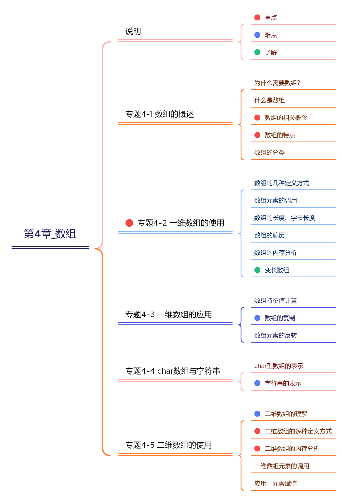

## 1、数组的概述

### 1.1 为什么需要数组

**需求分析1：**

需要统计某公司50个员工的工资情况，例如计算平均工资、找到最高工资等。用之前知识，首先需要声明`50个变量`来分别记录每位员工的工资，这样会很麻烦。因此我们可以将所有的数据全部存储到一个容器中统一管理，并使用容器进行计算。

**需求分析2：**


容器的概念：

- **生活中的容器：**水杯（装水等液体），衣柜（装衣服等物品），集装箱（装货物等）。
- **程序中的容器：**将多个数据存储到一起，每个数据称为该容器的元素。

### 1.2 数组的概念

- 数组(Array)，是多个`相同类型`数据按`一定顺序`排列的集合，并使用一个名字命名，并通过编号的方式对这些数据进行统一管理。

- 数组中的概念
  - 数组名
  - 下标（或索引、index）
  - 元素
  - 数组的长度


**数组的特点：**

- 数组中的元素在内存中是依次紧密排列的，有序的。
- 创建数组对象会在内存中开辟一整块`连续的空间`。占据的空间的大小，取决于数组的长度和数组中元素的类型。
- 我们可以直接通过下标(或索引)的方式调用指定位置的元素，速度很快。
- 数组，一旦初始化完成，其长度就是确定的。数组的`长度一旦确定，就不能修改`。
- 数组名中引用的是这块连续空间的首地址。

### 1.3 数组的分类

**按照数组维度分：**

- 一维数组：存储一组数据
- 二维数组：存储多组数据，相当于二维表，一行代表一组数据。每一行长度可以不同。
- 三维数组、四维数组、....


**按照元素的数据类型分：**

- int类型数组
- char类型数组
- double类型数组
- ....

## 2、一维数组的定义

### 2.1 数组的定义方式1

数组通过变量名后加方括号表示，方括号里面是数组可以容纳的成员数量（即长度）。

```c
int arr[10];  //数组 arr ，里面包含10个成员，每个成员都是 int 类型
```

```c
#define NUM 10
int arr1[NUM];
```

注意，声明数组时，必须给出数组的大小。


### 2.2 数组元素的调用

- 格式：`数组名[下标]`

- 数组的`下标从0开始`，用“int arr[10];”定义数组，则`最大下标值为9`，不存在数组元素arr[10]。

```c
arr[0] = 13;       //对该位置数组元素进行赋值
int score = arr[0]; //调用此位置的元素值
```

**数组角标越界：**

假设数组有n个元素，如果使用的数组的下标小于0，或者大于n-1，就是数组越界访问了，超出了数组合法空间的访问。

C语言不做数组下标越界的检查，编译器也不一定报错，但是编译器不报错，并不意味着程序就是正确！

```c
int scores[20];
scores[20] = 51;
```

> 说明：数组 scores 只有20个成员，因此 scores[20] 这个位置是不存在的。但是，引用这个位置并不会报错。赋值操作会导致紧跟在 scores 后面的那块内存区域被赋值(这实际是其它变量的区域)，因此不知不觉就更改了其它变量的值。这很容易引发错误，而且难以发现。

### 2.3 关于长度

**数组的字节长度**

sizeof 运算符会返回整个数组的字节长度。

```c
int arr[10];
printf("数组的字节长度为：%zd\n",sizeof(arr)); //40
```

**数组的长度**

在定义数组时，需要指定数组中元素的个数，方括号中的常量表达式用来表示元素的个数，即数组长度。

由于数组成员都是同一个类型，每个成员的字节长度都是一样的，所以数组整体的字节长度除以某个数组元素的字节长度，就可以得到数组的成员数量。

```c
//数组中元素的个数：
int arrLen = sizeof(arr) / sizeof(arr[0]);
```

```c
int a[10];
printf("数组的字节长度为：%zu\n", sizeof(a));   // 40
printf("数组每个元素的字节长度为：%zu\n", sizeof(int)); // 4
printf("数组的长度为：%zu\n", sizeof(a) / sizeof(int)); // 10
```

> 复习： sizeof 返回值的数据类型是 `size_t` ，所以 sizeof(a) / sizeof(a[0]) 的数据类型也是size_t 。在 printf() 里面的占位符，要用 %zd 或 %zu 。

注意：数组一旦声明/定义了，其**长度就固定了，不能动态变化**。

### 2.4 数组的遍历

将数组中的每个元素分别获取出来，就是`遍历`。for循环与数组的遍历是绝配。

举例1：声明长度为10的int类型数组，给数组元素依次赋值为0,1,2,3,4,5,6,7,8,9，并遍历数组所有元素

```c
int main() {

    int arr[10];
    
    //给数组中的每个元素赋值
    for (int i = 0; i < sizeof(arr)/sizeof(int); i++) { //对数组元素arr[0]~arr[9]赋值
        arr[i] = i;
    }
    //遍历数组中的元素
    printf("遍历数组中的元素：\n");
    for (int i = 0; i < sizeof(arr)/sizeof(int); i++) { //输出arr[0]~arr[9]共10个数组元素
        printf("%d ", arr[i]);
    }
    printf("\n");
    return 0;
}
```

### 2.5 数组的其它定义方式

**定义方式2：**(定义方式1在2.1节讲的)

数组可以在声明时，使用大括号，同时对每一个成员赋值。

```c
int arr[5] = {22, 37, 90, 48, 95};
```

`变形形式1：`C 语言允许省略方括号里面的数组成员数量，这时根据大括号里面的值的数量，自动确定数组的长度。

```c
int arr[3] = {10,20,30};
// 等同于
int arr[] = {10,20,30};  //数组 arr 的长度，将根据大括号里面的值的数量，确定为 3
```

`变形形式2：`

对数组部分元素赋初值：如果大括号里面的值，少于数组的成员数量，那么未赋值的成员自动初始化为 0 。

```c
int arr[5] = {10, 20, 30};
// 等同于
int arr[5] = {10,20,30, 0, 0};
```

`变形方式3`：

将整个数组的每一个成员都设置为零，最简单的方式如下

```c
int a[100] = {0};
```

`错误方式：`

使用大括号赋值时，大括号里面的值不能多于数组的长度，否则编译时会报错。

```c
int arr[3] = {1,2,3,4};  // 报错
```

**定义方式3：**数组初始化时，可以指定为哪些位置的成员赋值。

```c
int arr[15] = {[2] = 10, [5] = 20, [14] = 30};  //非角标2、5、14的位置自动赋值为0

//等同于
int arr[15] = {[5] = 20, [14] = 30, [2] = 10}; //指定位置的赋值可以不按角标从小到大的顺序
```

`变形形式1：`指定位置的赋值与顺序赋值，可以结合使用。

```c
int arr[15] = {1, [5] = 10, 11, [10] = 20, 21}; //角标0、5、6、10、11的位置被赋值
```

`变形形式2：`省略成员数量时，如果同时采用指定位置的赋值，那么数组长度将是最大的指定位置再加1。

```c
int arr[] = {[2] = 6, [9] = 12};  //此时数组的长度是10
```

## 3、一维数组内存分析

### 3.1 数组内存图

针对于如下代码：

```c
int a[5] = {1,2,3,4,5};
```

对应的内存结构：

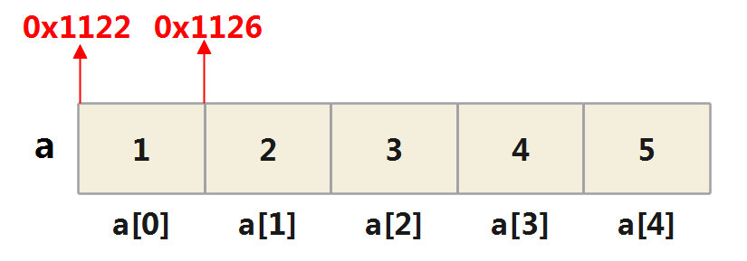

说明：

1）数组名，记录该数组的首地址 ，即 a[0]的地址。

2）数组的各个元素是连续分布的， 假如 a[0] 地址是0x1122，则`a[1]地址= a[0]的地址+int字节数(4)` = 0x1122 + 4 = 0x1126，后面 `a[2] 地址 = a[1]地址 + int 字节数(4)` = 0x1126 + 4 = 0x112A，依次类推...

### 3.2 注意事项

**C 语言规定，数组变量一旦声明，数组名指向的地址就不可更改。**因为声明数组时，编译器会自动为数组分配内存地址，这个地址与数组名是绑定的，不可更改。

因此，当数组定义后，再用大括号重新赋值，是不允许的。下面的代码会报错。

错误举例1：

```c
int nums[5];
nums = {22, 37, 3490, 18, 95}; // 使用大括号赋值时，必须在数组声明时赋值，否则编译时会报错。
```

错误举例2：

```c
int nums[5] = {1, 2, 3, 4, 5};
nums = {6, 7, 8, 9, 10}; // 报错
```

错误举例3：

```c
int ints[100];
ints = NULL; //报错
```

这也导致不能将一个数组名赋值给另外一个数组名。

```c
int a[5] = {1, 2, 3, 4, 5};
// 写法一
int b[5] = a; // 报错
// 写法二
int b[5];
b = a; // 报错
```

上面两种写法都会更改数组 b 的地址，导致报错。

### 3.3 变长数组

数组声明的时候，数组长度除了使用常量，也可以使用变量或表达式来指定数组的大小。这叫做`变长数组`（variable-length array，简称 VLA）。

**方式1：**

```c
int n = 10;
int arr[n];
```

变长数组的根本特征是数组长度只有`运行时才能确定`。它的好处是程序员不必在开发时，随意为数组指定一个估计的长度，程序可以在运行时为数组分配精确的长度。

任何长度需要运行时才能确定的数组，都是变长数组。比如，

```c
int i = 10;
int a1[i];
int a2[i + 5];
int a3[i + k];
```

> 注意：变长数组在C99标准中被引入，在C11标准中被标记为可选特性。某些编译器可能不支持变长数组，或者可能有特定的限制和行为。

**方式2：**

如果你的编译器版本不支持变长数组，还可以考虑使用动态内存分配（使用`malloc()函数` ）来创建动态大小的数组。

分配：

```c
int length = 5;
int *arr = (int *)malloc(length * sizeof(int));
```

释放：

```c
free(arr);
```


## 4、一维数组的应用

### 4.1 数值型数组特征值统计

这里的特征值涉及到：平均值、最大值、最小值、总和等

举例1：定义一个int型的一维数组，包含10个元素，然后求出数组中的最大值，最小值，总和，平均值，并输出出来。

```c
int main() {
    int arr[10] = {34, 54, 2, 32, 54, 57, 3, 32, 87, 43};

    int max = arr[0];//用于记录数组的最大值
    int arrLen = sizeof(arr) / sizeof(int);//获取数组中元素的个数
    for (int i = 1; i < arrLen; i++) {
        if (max < arr[i]) {
            max = arr[i];
        }
    }
    printf("最大值为：%d\n", max);

    //获取数组的最小值
    int min = arr[0];
    for (int i = 1; i < arrLen; i++) {
        if (min > arr[i]) {
            min = arr[i];
        }
    }
    printf("最小值为：%d\n", min);

    //获取数组的总和
    int sum = 0;
    for (int i = 0; i < arrLen; i++) {
        sum += arr[i];
    }
    printf("总和为：%d\n", sum);

    //获取数组的平均值
    int avg = sum / arrLen;
    printf("平均值为：%d\n", avg);


    return 0;
}
```

举例2：评委打分

分析以下需求，并用代码实现：

（1）在编程竞赛中，有10位评委为参赛的选手打分，分数分别为：5，4，6，8，9，0，1，2，7，3

（2）求选手的最后得分（去掉一个最高分和一个最低分后其余8位评委打分的平均值）

```c
int main() {
    int scores[10] = {5,4,6,8,9,0,1,2,7,3};

    int max = scores[0]; //记录最高分
    int min = scores[0]; //记录最低分
    int sum = 0; //记录总分
    int arrLen = sizeof(scores) / sizeof(int); //记录数组长度
    for(int i = 0;i < arrLen;i++){
        if(max < scores[i]){
            max = scores[i];
        }

        if(min > scores[i]){
            min = scores[i];
        }

        sum += scores[i];
    }
    //计算平均分
    double avg = (double)(sum - max - min) / (arrLen - 2);

    printf("选手去掉最高分和最低分之后的平均分为：%.2lf\n" , avg);

    return 0;
}
```


### 4.2 数组的复制

由于数组名是指针，所以复制数组不能简单地复制数组名。

```c
int a[3] = {10,20,30};
int* b;
b = a;
```

上面的写法，结果不是将数组 a 复制给数组 b ，而是让 a 和 b 指向同一个数组。

**正确方式1：使用循环**

这是复制数组最简单的方法，将数组元素逐个进行复制。比如，将数组 a 的成员逐个复制给数组 b。

```c
#include <stdio.h>

#define LENGTH 3

int main() {
    int a[LENGTH] = {10, 20, 30};
    int b[LENGTH];

    // 复制数组 a 到数组 b
    for (int i = 0; i < LENGTH; i++) {
        b[i] = a[i];
    }

    // 打印数组 b 的内容
    printf("复制后的数组 b：");
    for (int i = 0; i < LENGTH; i++) {
        printf("%d ", b[i]);
    }
    printf("\n");

    return 0;
}
```

**正确方式2：使用 memcpy() 函数**

 memcpy() 函数定义在头文件 string.h 中，直接把数组所在的那一段内存，再复制一份。3个参数依次为：`目标数组`、`源数组`以及`要复制的字节数`。

```c
#include <stdio.h>
#include <string.h>

#define LENGTH 3

int main() {
    int a[LENGTH] = {10, 20, 30};
    int b[LENGTH];

    // 使用 memcpy 函数复制数组 a 到数组 b
    memcpy(b, a, LENGTH * sizeof(int));

    // 打印数组 b 的内容
    printf("复制后的数组 b：");
    for (int i = 0; i < LENGTH; i++) {
        printf("%d ", b[i]);
    }
    printf("\n");

    return 0;
}
```

**两种方式对比：**

下面是对两种方式进行比较的一些要点：

1. 循环复制：
   - 优点：`简单直观`，容易理解和实现。不需要引入额外的头文件。
   - 缺点：需要编写循环代码来遍历数组并逐个赋值，相对而言可能`稍显繁琐`。不适用于复制大型数组或复杂数据结构。
2. memcpy函数复制：
   - 优点：使用标准库提供的函数，可以实现`快速且高效`的内存复制。适用于`大型数组或复杂数据`结构的复制。可以直接复制字节数，不需要遍历数组。
   - 缺点：需要包含 `<string.h>` 头文件。对于简单的数组复制，可能有些`过于繁重`。

### 4.3 数组元素的反转

**实现思想：**数组对称位置的元素互换。

方式1：

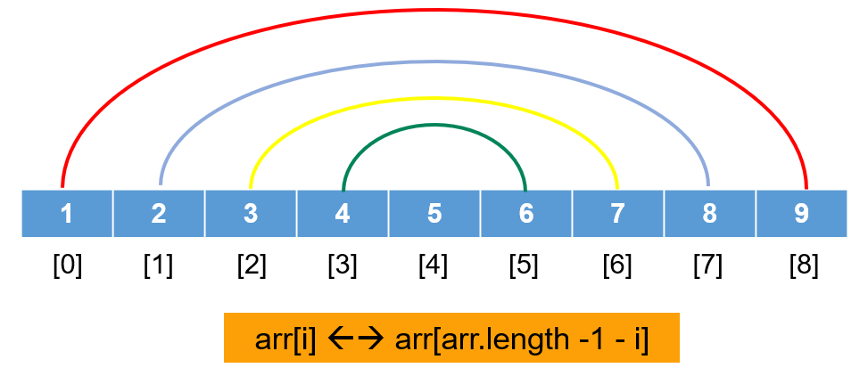

代码实现

```c
int main() {
    int arr[] = {1,2,3,4,5,6,7,8,9};
    int size = sizeof(arr) / sizeof(arr[0]); //数组的长度

    printf("原始数组：");
    for (int i = 0; i < size; i++) {
        printf("%d ", arr[i]);
    }
    printf("\n");

    for(int i = 0;i < size / 2;i++){
        int temp = arr[i];
        arr[i] = arr[size - 1 - i];
        arr[size - 1 - i] = temp;
    }

    printf("反转后的数组：");
    for (int i = 0; i < size; i++) {
        printf("%d ", arr[i]);
    }
    printf("\n");

    return 0;
}
```

方式2：

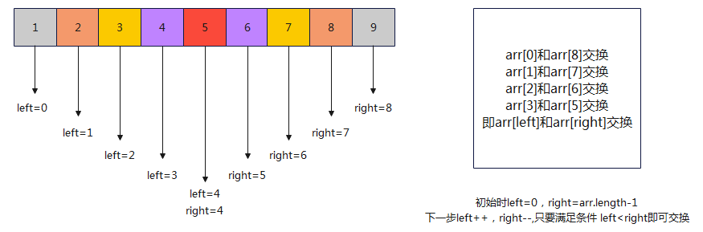

```c
int main() {
    int arr[] = {1, 2, 3, 4, 5,6,7,8,9};
    int size = sizeof(arr) / sizeof(arr[0]); //数组的长度

    printf("原始数组：");
    for (int i = 0; i < size; i++) {
        printf("%d ", arr[i]);
    }
    printf("\n");

    int left = 0; // 起始指针
    int right = size - 1; // 结尾指针

    while (left < right) {
        // 交换起始指针和结尾指针指向的元素
        int temp = arr[left];
        arr[left] = arr[right];
        arr[right] = temp;

        // 更新指针位置
        left++;
        right--;
    }

    printf("反转后的数组：");
    for (int i = 0; i < size; i++) {
        printf("%d ", arr[i]);
    }
    printf("\n");

    return 0;
}
```

### 4.4 char型数组与字符串

#### 4.4.1 char型数组

字符型数组，顾名思义，数组元素的数据类型为字符型的数组。

一方面，可以看做普通的数组，初始化、常用操作如前所述。比如：

```c
char arr[] = {'a','b','c','d'};
```

另一方面，字符型数组可以用于存储字符串。

#### 4.4.2 字符串的使用

```c
"helloworld"
"abc"
"a"
"123"
```

这种由双引号引起来的一串字符称为字符串字面值(String Literal)，简称字符串(String)。

通常把`""`称为`空串`，即一个不包含任意字符的字符串；而`" "`则称为`空格串`，是包含一个空格字符的字符串。二者不能等同。

C语言没有专门用于存储字符串的变量类型，字符串都被存储在char类型的数组中。在字符串结尾，C 语言会自动添加一个`'\0' `的转义字符作为字符串结束的标志，所以字符数组也必须以 '\0'字符结束。

**声明方式1：标准写法**

```c
//显式以'\0'为最后一个字符元素结束
char str[] = {'h','e','l','l','o',' ','w','o','r','l','d','\0'};
```

如果一个字符数组声明如下，由于必须留一个位置给 `\0` ，所以最多只能容纳9个字符的字符串。

```c
char str1[10];
```

**声明方式2：简化写法**

字符串写成数组的形式，是非常麻烦的，C 语言提供了一种简化写法。双引号之中的字符，会被自动视为字符数组。

```c
//自动在末尾添加'\0'字符
char str1[12] = {"hello world"};  //注意使用双引号，非单引号
//或者
char str2[12] = "hello world";   //可以省略一对{}来初始化数组元素
```

由于字符数组的长度可以让编译器自动计算，所以声明时可以省略字符数组的长度：

```c
char str1[] = {"hello world"};
//或者
char str2[] = "hello world"; 
```

双引号里面的字符串，不用自己添加结尾字符 \0 ，C 语言会自动添加。所以，代码中数组 str1或str2的元素依次为 'h', 'e', 'l', 'l', 'o', ' ', 'w', 'o', 'r', 'l', 'd', '\0'。

**字符串对应数组的长度**

对应的存储为：

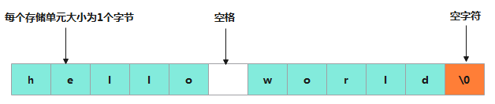

其中，数组由连续的存储单元组成，字符串中的字符被存储在相邻的存储单元中，每个单元存储一个字符。所以，上述两个数组的长度不是11，而是12。

**字符串的长度**

```c
char nation[10]={"China"};
```

数组nation的前5个元素为: ′C′,′h′,′i′,′n′,′a′，第6个元素为′\0′，后4个元素也自动设定为空字符。

 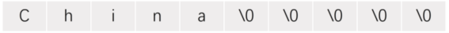

> 注意：在计算字符串长度的时候，'\0' 是结束标志，不算作字符串内容。

```c
#include <stdio.h>
#include <string.h>    //需要加载此头文件

int main() {
    char nation[10] = "China";
    printf("%d\n", strlen(nation));     //5
}
```

**区分：'\0'、0、'0'**

字符 '\0' 不同于字符 '0' ，前者的ASCII 码是0（二进制形式 00000000 ），后者的 ASCII 码是48（二进制形式 00110000 ）。

**练习1：字符数组、字符串的长度**

```c
char s1[50] = "hello";  //声明1

char s2[] = "hello";    //声明2

char s3[5] = "hello";   //声明3
```

对于声明1：赋给的元素的个数小于该数组的长度，则会自动在后面加 '\0', 表示字符串结束。所以，字符数组 s1 的长度是 50 ，但是字符串“hello”的实际长度只有5（不包含结尾符号 '\0' ），所以后面空出来的45个位置，都会被初始化为 '\0'。

对于声明2：字符数组 s2 的长度是 6（包含结尾符号 '\0' ），但是字符串“hello”的实际长度只有5。

对于声明3：赋给的元素的个数等于该数组的长度，则不会自动添加 '\0'。但字符串要求以'\0'结束，所以这种写法是错误的，要避免。

**练习2：比较"x"和'x'的不同**

- 书写形式不同：字符串常量用双引号，字符常量用单引号。

- 存储空间不同：在内存中，字符常量只占用一个字节的存储空间，而字符串存储时自动加一个结束标记'\0'，所以'x'占用1个字节，而"x"占用2个字节。

  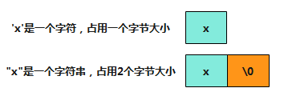

- 二者的操作也不相同。例如，可对字符常量进行加减运算，字符串常量则不能。

**练习3：输出字符数组**

```c
#include <stdio.h>

int main() {

    char str1[]={"China\nBeijing"};
    char str2[] = "helloworld";

    puts(str1);

    puts(str2);

    return 0;
}
```


>  【中央财经大学2018研】若有定义和语句：char s[10]; s="abcd"; printf("%s\n",s);，则结果是（　）。
>  A．输出abcd@#$
>  B．输出a
>  C．输出abcd
>  D．编译不通过
>
>  【答案】D
>
>  【解析】在定义一维字符数组时，s为数组名，指向数组首元素的地址，为地址常量，不可更改，因此语句s＝"abcd"是非法的，编译不会通过。


## 5、多维数组

### 5.1 理解

二维数组、三维数组、...都称为多维数组。本节主要讲解二维数组，三维及以上的数组，以此类推即可。

举例：公司有3个攻坚小分队，每队有6名同事，要把这些同事的工资用数组保存起来以备查看。

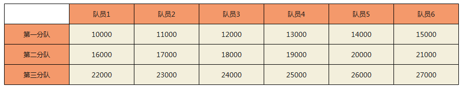

此时建立数组salary用于存储工资，它应当是二维的。第一维用来表示第几分队，第二维用来表示第几个同事。例如用`salary2,3`表示角标2对应分队的角标3对应队员的工资。

> 对于二维数组的理解，可以看作是由一维数组嵌套而成的。即一维数组array1又作为另一个一维数组array2的元素而存在。

### 5.2 二维数组的定义方式1

**定义方式1：**

```c
int a[3][4]; //二维数组
```

二维数组a可看成由三个一维数组构成，它们的数组名分别为 a[0]、a[1]、a[2]。这三个一维数组各有 4 个元素，如，一维数组 a[0] 的元素为 `a[0][0]`、`a[0][1]`、`a[0][2]`、`a[0][3]`。二维数组a共有12个成员（3 x 4 = 12）。

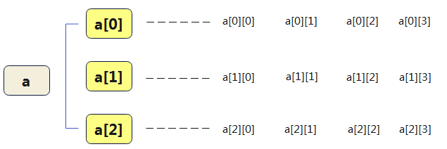

也可以简化理解为：

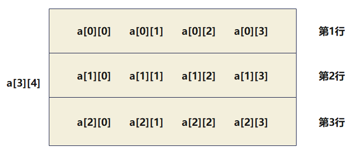

二维数组，常称为`矩阵(matrix)`。把二维数组写成`行(row)`和`列(column)`的排列形式，可以形象化地理解二维数组的逻辑结构。

三维数组如下：

```c
int arr1[3][4][5]; //三维数组
```

> 技巧：C 语言允许声明多维数组，有多少个维度，就用多少个方括号，比如二维数组就使用两个方括号。

**错误方式：**

```c
float a[3,4];  //在一对方括号内不能写两个下标
```

### 5.3 二维数组的内存分析

用`矩阵形式`（如3行4列形式）表示二维数组，是`逻辑`上的概念，能形象地表示出行列关系。而在`内存`中，各元素是连续存放的，不是二维的，是`线性`的。

C语言中，二维数组中元素排列的顺序是`按行存放`的。即：先顺序存放第一行的元素，再存放第二行的元素。（最右边的下标变化最快，第一维的下标变化最慢）。

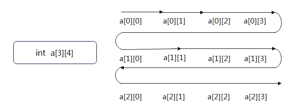

举例，整型数组`b[3][3]`在内存中的存放：

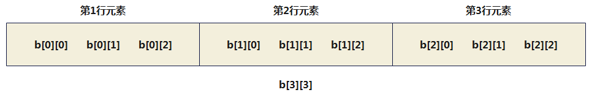

举例：关于长度

```c
int b[3][3];
printf("%d\n",sizeof(b)); //36
printf("%d\n",sizeof(b)/sizeof(int)); //9
```

### 5.4 成员的调用

格式：**数组名[下标] [下标]**

跟一维数组一样，多维数组每个维度的第一个成员也是从 0 开始编号。

举例1：给指定索引位置的元素赋值

```c
int arr1[3][5];
//给指定索引位置的元素赋值
arr1[0][0] = 12;
arr1[3][4] = 5;
```

举例2：查看数组元素的地址

```c
int main() {

    int arr2[3][4];

    for (int i = 0; i < 3; i++) {
        for (int j = 0; j < 4; j++) {
            printf("&arr2[%d][%d] = %p\n", i, j, &arr2[i][j]);
        }
    }

    return 0;
}
```

输出结果如下：

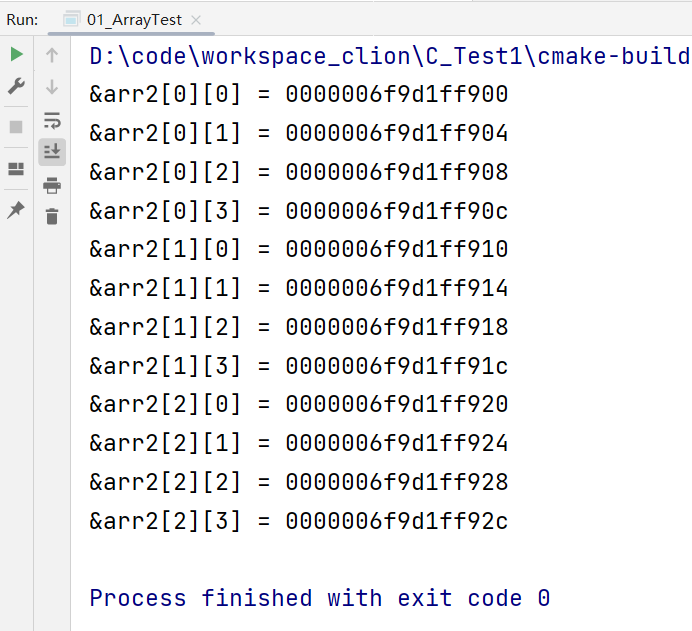

### 5.5 二维数组其它定义方式

**定义方式2：声明与初始化同时进行**

多维数组也可以使用大括号，在声明的同时，一次性对所有成员赋值。

```c
int a[3][4] = {{1,2,3,4},
               {5,6,7,8},
               {9,10,11,12}};
```

上例中， a 是一个二维数组，这种赋值写法相当于将第一维的每个成员写成一个数组。

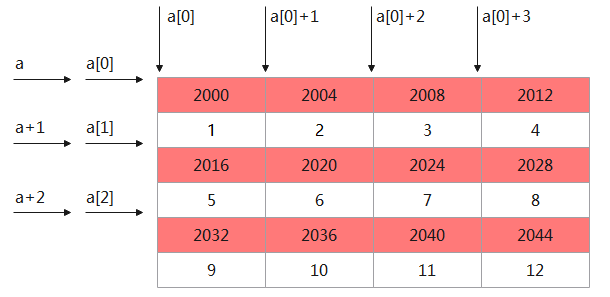

> 说明：这里的地址以十进制数值进行的说明。

```c
int main() {

    int a[3][4] = {{1,2,3,4},
                   {5,6,7,8},
                   {9,10,11,12}};

    printf("%p\n",a[0]);     //0000006ac71ffd30
    printf("%p\n",a[0] + 1); //0000006ac71ffd34
    printf("%p\n",a[0] + 2); //0000006ac71ffd38
    printf("%p\n",a[0] + 3); //0000006ac71ffd3c
    printf("%p\n",a[0] + 4); //0000006ac71ffd40
    printf("%p\n",a + 1);    //0000006ac71ffd40

    printf("%p\n",a[1]);     //0000006ac71ffd40
    printf("%p\n",a[1] + 1); //0000006ac71ffd44

    return 0;
}
```

**定义方式3：部分元素赋值**

多维数组也可以仅为指定的位置进行初始化赋值，未赋值的成员会自动设置为“零”值 。

```c
//指定了 [0][0] 和 [1][1] 位置的值，其他位置就自动设为 0 。
int a[2][2] = {[0][0] = 1, [1][1] = 2};  
```

**定义方式4：使用单层大括号赋值**

多维数组也可以使用单层大括号赋值。不管数组有多少维度，在内存里面都是线性存储。对于`a[2][2]`来说， `a[0][0]` 的后面是 `a[0][1]` ，再后面是`a[1][0]` ，以此类推。

```c
int a[2][2] = {1, 0, 0, 2};  //会自动匹配到各行各列
```

**定义方式5：方式4的简化**

在方式4的基础上，如果对全部元素赋值，那么第一维的长度可以不给出。

```c
//int a[2][3] = {1, 2, 3, 4, 5, 6}; 
//可以写为：
int a[][3] = {1, 2, 3, 4, 5, 6}; 
//也可以写为：
int a[][3] = {{1, 2, 3},{4, 5, 6}}; //行数自然判定为2
```

练习：下面哪些赋值操作是正确的？（都对）

```c
int arr1[3][2]={{1,2},{3,4},{5,6}};  //对应定义方式2

int arr2[3][2]={1,2,3,4,5,6};  //对应定义方式4

int arr3[][2]={1,2,3,4,5,6};  //对应定义方式5

int arr4[][2]={{1,2},{3,4},{5,6}}; //对应定义方式5

int arr5[][2]={1,2,3,4,5};  //对应定义方式5。未显式赋值的位置默认赋值为0
```

**错误方式：**在定义二维数组时，必须指定列数（即一行中包含几个元素）

```c
int array[][];  //错误，必须指定列数
int array[3][]; //错误，必须指定列数
```


>  【武汉科技大学2019研】以下能对数组value进行正确初始化的语句是（　　）。
>  A．int value\[2][]＝{{1，1}，{2，2}}；
>  B．int value[][3]＝{{1，，3}，{4，5，6}}；
>  C．int value\[2][3]＝{1，2，3，4，5，6}；
>  D．int value[][3]＝{{1}，{4，6，}}；
>
>  【答案】C
>
>  【解析】二维数组的定义必须指定列数，可以不用指定行数，A错误；数组value为int型数组，不能给数组里面的元素赋空值，BD错误，答案选C。

### 5.6 举例

举例1：获取arr数组中所有元素的和

提示：使用for的嵌套循环即可。


```c
#include <stdio.h>


#define ROWS 3
#define COLS 4

int main() {

    int arr[ROWS][COLS] = {{3, 5, 8},
                           {12, 9},
                           {7, 0, 6, 4}};

    int sum = 0;//记录总和

    for (int i = 0; i < ROWS; i++) {
        for (int j = 0; j < COLS; j++) {
            sum += arr[i][j];
        }
    }

    printf("总和为%d\n", sum);
    return 0;
}
```

举例2：求二维数组最大值以及对应的行列角标

```c
#include <stdio.h>

#define ROWS 3
#define COLS 4

int main() {
    int a[ROWS][COLS] = {{1,   2,  3,  4},
                         {9,   8,  7,  6},
                         {-10, 10, -5, 2}};

    int maxValue = a[0][0];
    int maxRow = 0;
    int maxCol = 0;

    for (int i = 0; i < ROWS; i++) {
        for (int j = 0; j < COLS; j++) {
            if (maxValue < a[i][j]) {
                maxValue = a[i][j];
                maxRow = i;
                maxCol = j;
            }
        }
    }

    printf("最大值: %d\n", maxValue);
    printf("对应的行索引: %d\n", maxRow);
    printf("对应的列索引: %d\n", maxCol);

    return 0;
}

```

举例3：将一个二维数组行和列的元素互换，存到另一个二维数组中。

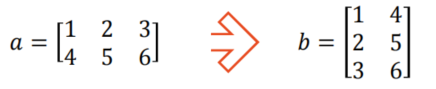

> `a[i][j] ---> b[j][i]`

```c
#include <stdio.h>

#define ROWS 2
#define COLS 3

int main() {
    int a[ROWS][COLS] = {{1, 2, 3},
                         {4, 5, 6}};
    int b[COLS][ROWS];
    printf("数组 a:\n");
    for (int i = 0; i < ROWS; i++) { //处理a数组中的一行中各元素
        for (int j = 0; j < COLS; j++) { //处理a数组中某一列中各元素
            printf("%5d", a[i][j]); //输出a数组的一个元素
        }
        printf("\n");
    }

    for (int i = 0; i < ROWS; i++) { //处理a数组中的一行中各元素
        for (int j = 0; j < COLS; j++) { //处理a数组中某一列中各元素
            b[j][i] = a[i][j]; //将a数组元素的值赋给b数组相应元素
        }
    }

    printf("数组 b:\n"); //输出b数组各元素
    for (int i = 0; i < COLS; i++) { //处理b数组中一行中各元素
        for (int j = 0; j < ROWS; j++) //处理b数组中一列中各元素
            printf("%5d", b[i][j]); //输出b数组的一个元素
        printf("\n");
    }
    return 0;
}

```

运行结果：

 

举例4：二维char型数组

将"Apple"、"Orange"、"Grape"、"Pear"、"Peach"存储在数组中。

```c
char fruit[][7]={"Apple","Orange","Grape","Pear","Peach"};
```

对应图示：

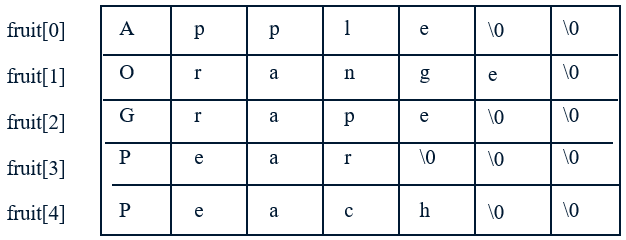

举例5：使用二维数组打印一个 10 行杨辉三角。

提示：

1. 第一行有 1 个元素, 第 n 行有 n 个元素

2. 每一行的第一个元素和最后一个元素都是 1

3. 从第三行开始, 对于非第一个元素和最后一个元素的元素。即：

   ```
   yanghui[i][j] = yanghui[i-1][j-1] + yanghui[i-1][j];
   ```


```c
#include <stdio.h>

#define ROWS 10

int main() {
    int yangHui[ROWS][ROWS];


    for (int i = 0; i < ROWS; i++) {
        //初始化第一列和对角线上的元素为1
        yangHui[i][0] = 1;
        yangHui[i][i] = 1;
        //给其他位置元素赋值
        for (int j = 1; j < i; j++) {
            yangHui[i][j] = yangHui[i - 1][j - 1] + yangHui[i - 1][j];
        }
    }

    // 打印杨辉三角
    for (int i = 0; i < ROWS; i++) {
        // 打印每行的元素
        for (int j = 0; j <= i; j++) {
            printf("%5d ", yangHui[i][j]);
        }
        printf("\n");
    }

    return 0;
}
```


> 【华南理工大学2018研】以下数组定义中不正确的是（　　）。
> A．int a\[2][3]；
> B．int b\[][3]＝{0}；
> C．int c\[100][100]＝{0}；
> D．int d\[3][]＝{{1}， {1， 2， 3}，{1}}；
>
> 【答案】D
>
> 【解析】定义二维数组时一定要指定数组的列数，可以不指定数组的行数，D错误。

