# 第05章_指针

讲师：尚硅谷-宋红康（江湖人称：康师傅）

官网：[http://www.atguigu.com](http://www.atguigu.com/)

***

指针是 C 语言`最重要`的概念之一，也是最`难理解`的概念之一。

指针是C语言的`精髓`，要想掌握C语言就需要深入地了解指针。

指针类型在考研中用得最多的地方，就是和结构体结合起来`构造结点`(如链表的结点、二叉树的结点等)。

## 本章专题脉络

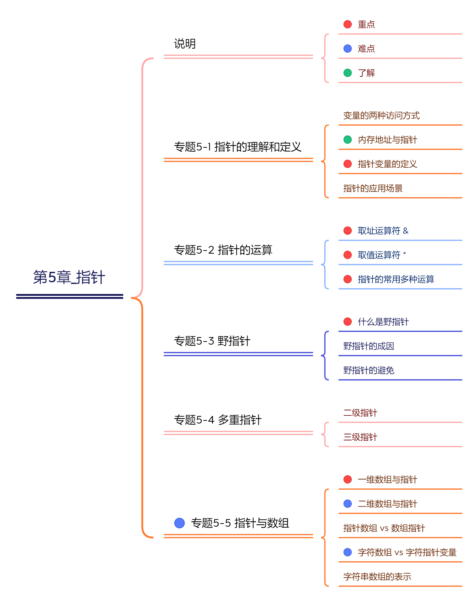

## 1、指针的理解与定义

### 1.1 变量的访问方式

计算机中程序的运行都是在内存中进行的，变量也是在内存中分配的空间，且不同类型的变量占用不同大小的空间。那如何访问内存中变量存储的数据呢？有两种方式：`直接访问`和`间接访问`。直接访问，直接使用变量名进行的访问，以前的程序中都是采用这种方式。

```c
int num1 = 10;
int num2 = 20;
int num3 = num1 + num2;
```

间接访问，通过指针来实现。下面看如何理解指针。

### 1.2 内存地址与指针

为了能够有效的访问到内存的每个单元(即一个字节)，就给内存单元进行了编号，这些编号被称为该**内存单元的地址**。因为每个内存单元都有地址，所以变量存储的数据也是有地址的。

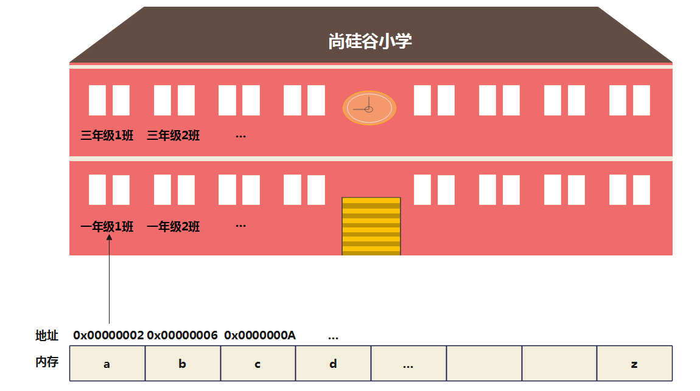

```c
int num = 5;
```


通过地址能找到所需的变量单元，可以说，**地址指向该变量单元**，将**地址形象化地称为“指针”**。即：

- `变量`：命名的内存空间，用于存放各种类型的数据。


- `变量名`：变量名是给内存空间取的一个容易记忆的名字。
- `变量值`：在变量单元中存放的数据值。

- `变量的地址`：变量所使用的内存空间的地址，即`指针`。


- `指针变量`：一个变量专门用来存放另一变量在内存中数据的地址 (即指针)，则它称为“指针变量”。我们可以通过访问指针变量达到访问内存中另一个变量数据的目的。(有时为了阐述方便，将指针变量直接说成指针。)


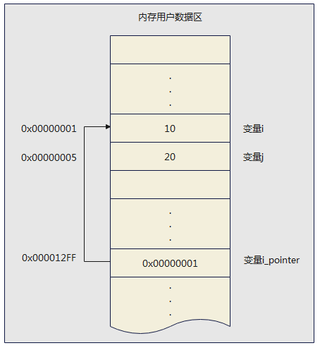

上图中，地址0x00000001是变量 i 的指针，i_pointer就是一个指针变量。

> 体会：指针就是内存地址，使用指针访问变量，就是直接对内存地址中的数据进行操作。

### 1.3 指针变量的定义

**一般格式：**

```c
数据类型 *指针变量名 [=初始地址值];
```

- 数据类型是指针变量所指向变量数据类型。可以是 int、char、float 等基本类型，也可以是数组等构造类型。


- 字符 `*` 用于告知系统这里定义的是一个指针变量，通常跟在类型关键字的后面。比如， char * 表示一个指向字符的指针， float * 表示一个指向 float 类型的值的指针。此外，还有指向数组的指针、指向结构体的指针。

**举例1：**

```c
int *p;  //读作：指向int的指针”或简称“int指针”
```

这是一个指针变量，用于存储int型的整数在内存空间中数据的地址。

变形写法：

```c
int* p;
int * p;
```

> 注意：
>
> 1、指针变量的名字是 p，不是*p。
>
> 2、指针变量中只能存放地址，不要将一个整数（或任何其它非地址类型的数据）赋给一个指针变量。

举例2：同一行声明两个指针变量

```c
// 正确
int * a, * b;
// 错误
int* a, b;   //此时a是整数指针变量，而b是整数变量
```

举例3：一个指针指向的可能还是指针，这时就要用两个星号 ** 表示。(后面讲)

```c
int **foo;
```

### 1.4 指针的应用场景

场景1：使用指针访问变量或数组的元素。

场景2：应用在数据结构中。比如：

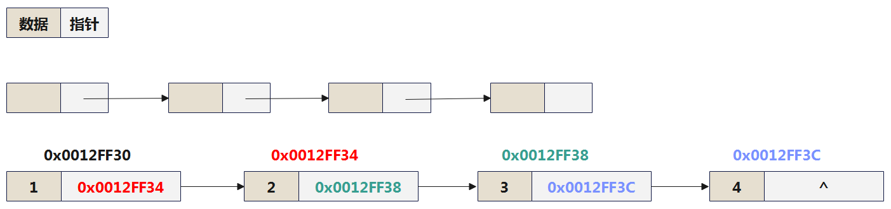

## 2、指针的运算

指针作为一种特殊的数据类型可以参与运算，但与其他数据类型不同的是，指针的运算都是针对内存中的地址来实现的。

### 2.1 取址运算符：&

取址运算符，使用“`&`”符号来表示。作用：`取出指定变量在内存中的地址`，其语法格式如下：

```c
&变量
```

举例1：

```c
int num = 10; 
printf("num = %d\n", num); // 输出变量的值。 num = 10
printf("&num = %p\n", &num); // 输出变量的内存地址。&num = 00000050593ffbbc
```

> 说明：
>
> 1、在输出取址运算获得的地址时，需要使用“%p”作为格式输出符。
>
> 2、这里num的4个字节，每个字节都有地址，取出的是第一个字节的地址（较小的地址）。

举例2：将变量的地址赋值给指针变量

```c
int num = 10;
int *p; //p为一个整型指针变量
p = &num; 
```

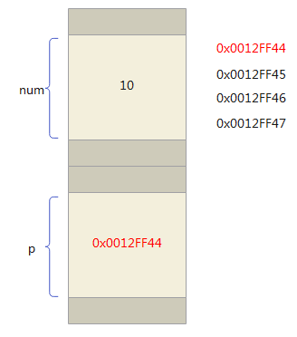

举例3：

```c
int d = 10;
int *e, *f;
e = &d;
f = e;
```

**指针变量的赋值**

1、指针变量中只能存放地址（指针），不要将一个整数（或任何其它非地址类型的数据）赋给一个指针变量。

2、C语言中的地址包括位置信息(内存编号，或称纯地址)和它所指向的数据的类型信息，即它是“`带类型的地址`”。所以，一个指针变量只能指向同一个类型的变量，不能抛开类型随意赋值。

- char* 类型的指针是为了存放 char 类型变量的地址。
- short* 类型的指针是为了存放 short 类型变量的地址。
- int* 类型的指针是为了存放 int 类型变量的地址。

3、在没有对指针变量赋值时，指针变量的值是不确定的，可能系统会分配一个未知的地址，此时使用此指针变量可能会导致不可预料的后果甚至是系统崩溃。为了避免这个问题，通常给指针变量赋初始值为0(或NULL)，并把值为0的指针变量称为`空指针变量`。

举例4：通过指针变量修改指向的内存中的数据

```c
int main() {

    int num = 10, *ptr;
    ptr = &num;
    printf("%d\n",num);

    scanf("%d", ptr); //等价于scanf("%d", &num);
    
    printf("%d\n",num);

    return 0;
}
```


### 2.2 取值运算符：*

在C语言中针对指针运算还提供了一个取值运算符，使用“`*`”符号表示。其`作用与&相反`，根据一个给定的内存地址取出该地址对应变量的值。也称为`解引用符号`。其格式如下：

```c
*指针表达式
```

其中，“`*`”不同于定义指针变量的符号，这里是运算符。“指针表达式”用于得到一个内存地址，与“*”结合以获得该内存地址对应变量的值。

举例1：

```c
int main() {

    int a = 2024;
    int *p;
    p = &a;
    
    printf("%p\n",&a); //0000005cc43ff6d4
    printf("%p\n",p);  //0000005cc43ff6d4
    printf("%d\n", *p); //2024
    
    return 0;
}
```

举例2：

```c
int main() {

    int num = 10; //这里定义一个整型变量num
    printf("num = %d\n", num); //输出变量num的值。输出：num = 10
    printf("&num = %p\n", &num); //输出变量num的地址。输出：&num = 000000e6a11ffa1c
    
    int *p = &num;
    printf("%p\n",p); //000000e6a11ffa1c
    printf("%d\n",*p);//10
    
    printf("*&num = %d\n", *&num);//通过num地址读取num中的数据。输出：*&num = 10
    
    return 0;
}
```

> `&` 运算符与 `*` 运算符互为逆运算，下面的表达式总是成立：
>
> ```c
> int i = 5;
> if (i == *(&i)) // 正确
> ```

举例3：通过指针变量修改指向内存地址位置上的值

```c
int main() {

    int num = 10;
    int *p = &num;
    *p = 20;
    printf("num = %d\n",num);  //num = 20

    char ch = 'w';
    char* pc = &ch;
    *pc = 's';
    printf("ch = %c\n", ch); //ch = 's'

    return 0;
}
```

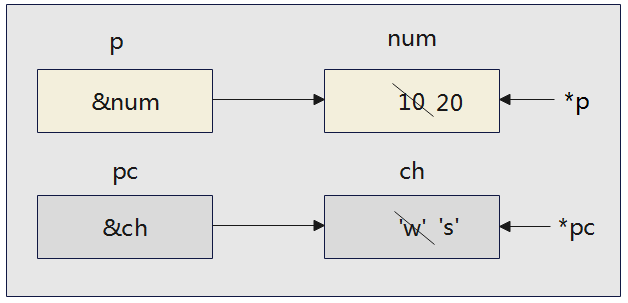

举例4：

定义指针变量 p1、p2，默认各自指向整数a、b，a、b从键盘输入。设计程序，使得 p1 指向其中的较大值，p2 指向其中的较小值 。

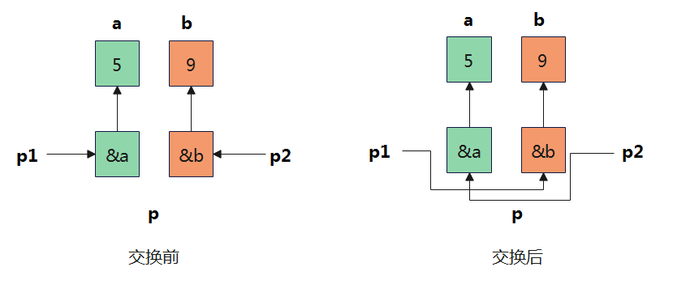

```c
int main() {

    int *p1, *p2, *p, a, b;
    printf("请输入两个整数: ");
    scanf("%d,%d", &a, &b);
    p1 = &a;
    p2 = &b;
    if (a < b) {
        p = p1;
        p1 = p2;
        p2 = p;
    }

    printf("输出p1、p2: ");
    printf("%d,%d\n", *p1, *p2);

    return 0;
}
```

举例5：已有代码如下：

```c
int a = 10;
int *p;
p = &a;
```

请看问题：

问题1：`&*p`的含义是什么?

- `“&”`和`“*”`两个运算符的优先级别相同，但按自右而左方向运算。因此，`&*p`与`&a`相同，即变量a的地址。
- 如果有`p1 = &*p; `它的作用是将`&a` (a的地址)赋给`p1` ，如果`p1`原来指向 b，经过重新赋值后它已不再指向b了，而指向了a。

问题2：`*&a`的含义是什么?

- 先进行`&a`运算，得a的地址，再进行`*`运算。`*&a`和`*p`的作用是一样的，它们都等价于变量a。即`*&a`与 a 等价。

### 2.3 指针的常用运算

指针本质上就是一个无符号整数，代表了内存地址。除了上面提到的取址运算外，指针还可以与整数加减、自增自减、同类指针相减运算等。但是规则并不是整数运算的规则。

#### 2.3.1 指针与整数值的加减运算

格式：`指针±整数`

指针与整数值的加减运算，表示指针所指向的内存地址的移动（加，向后移动；减，向前移动）。指针移动的单位，与指针指向的数据类型有关。**数据类型占据多少个字节，每单位就移动多少个字节。**

通过此操作，可以快速定位你要的地址。 

```c
short *s;
s = (short *) 0x1234;
printf("%hx\n", s + 1); //0x1236   复习：%hx ：十六进制 short int 类型
printf("%hx\n", s - 1); //0x1232

int *i;
i = (int *) 0x1234;
printf("%x\n", i + 1); //0x1238    复习：%x ：十六进制整数
```

说明：s + 1 表示指针向内存地址的高位移动一个单位，而一个单位的 short 类型占据两个字节的宽度，所以相当于向高位移动两个字节。

再比如：变量a、b、c、d和e都是整型数据int类型，它们在内存中占据一块连续的存储区域。指针变量p指向变量a，也就是p的值是0xFF12，则：


说明：指针p+1并不是地址+1，而是指针p指向数组中的下一个数据。比如，int *p，p+1表示当前地址+4，指向下一个整型数据。

举例1：

```c
int main() {

    int arr[5] = {1, 2, 3, 4, 5};
    int *p = &arr[1];
    printf("p的地址为：%p,对应的值为%d\n", p, *p); //p1的地址为：000000df21bff6e4,对应的值为2
    printf("p+1=的地址为：%p,对应的值为%d\n", p + 1, *(p + 1)); //p1+1=的地址为：000000df21bff6e8,对应的值为3
    printf("p-1=的地址为：%p,对应的值为%d\n", p - 1, *(p - 1)); //p1-1=的地址为：000000df21bff6e0,对应的值为1

    return 0;
}
```

> 注意：只有指向连续的同类型数据区域，指针加、减整数才有实际意义。

举例2：

对于长度是 N 的一维数组 a，当使用指针 p 指向其首元素后，即可通过指针 p 访问数组的各个元素。

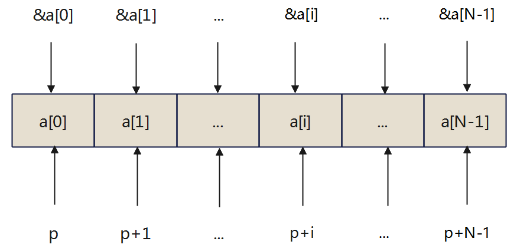

其中：

- `a[0]`用 `*p` 表示

- `a[1]`用`*(p+1)`表示

- `a[i]`用`*(p+i)`表示

遍历数组操作如下：

```c
#include <stdio.h>
#define LENGTH 5

int main() {

    int arr[LENGTH] = {10,20,30,40,50};

    //方式1：传统直接访问的方式
    for(int i = 0;i < LENGTH;i++){
        printf("%d ",arr[i]);
    }

    printf("\n");

    //方式2：使用指针访问
    int *p = &arr[0];
    for(int i = 0;i < LENGTH;i++){
        printf("%d ",*(p+i));
    }

    return 0;
}
```

#### 2.3.2 指针的自增、自减运算

指针类型变量也可以进行自增或自减运算，如下：

```c
p++ 、 p-- 、 ++p 、--p
```

++和--在运算符章节已经讲过，这里针对指针的增加或减少指的是内存地址的向前或向后移动。

针对于数组来说，由于数组在内存中是连续分布的。

- 当对指针进行++时，指针会按照它指向的数据类型字节数大小增加，比如 int * 指针，每 ++ 一次， 就增加4个字节。
- 当对指针进行--时，指针会按照它指向的数据类型字节数大小减少，比如 int \* 指针，每 -- 一次， 就减少4个字节。

举例1：

```c
int main() {
    int arr[5] = {1, 2, 3, 4, 5};
    int *p1 = &arr[0];
    int *p2 = &arr[3];
    printf("p1的值为：%d\n", *p1);        //1
    printf("++p1的值为：%d\n", *(++p1));  //2
    printf("p1的值为：%d\n", *p1);        //2

    printf("p1的地址为：%p\n", p1);      //00000055c0bff704
    printf("p1++的地址为：%p\n", ++p1);  //00000055c0bff708


    printf("p2的值为：%d\n", *p2);       //4
    printf("--p2的值为：%d\n", *(--p2)); //3
    printf("p2的值为：%d\n", *p2);       //3

    return 0;
}
```

举例2：请分析下面几种情况。

初始情况：

```c
int a[5] = {10,20,30,40,50};
```

情况1：

```c
int *p = a;  //p开始时指向数组a的首元素    等同于 int *p = &a[0];

p++; //使p指向下一元素a[1]
printf("%d\n",*p); //得到下一个元素a[1]的值，即20
```

情况2：

```c
int *p = a;  //p开始时指向数组a的首元素

printf("%d\n",*p++); //10   分析：由于++和*同优先级，结合方向自右而左，因此它等价于*(p++)
printf("%d\n",*p);   //20
```

拓展：

```c
*(p++); //先取*p值，然后使p自增1
*(++p); //先使p自增1，再取*p
```

拓展：如果 p 当前指向 a 数组中第 i 个元素a[i]，则：

```c
*(p--) //相当于a[i--]，先对p进行“*”运算，再使p自减
*(++p) //相当于a[++i]，先使p自加，再进行“*”运算
*(--p) //相当于a[--i]，先使p自减，再进行“*”运算
```

情况3：

```c
int *p = &a[2];  //p开始时指向数组a的第3个元素
printf("%d\n",*(p--)); //30
    
p = &a[2];
printf("%d\n",*(++p)); //40

p = &a[2];
printf("%d\n",*(--p)); //20
```

情况3：

```c
int *p = a;            //p开始时指向数组a的首元素
printf("%d\n",++(*p)); //11

/*
分析：表示p所指向的元素值加1，如果p=a, 则相当于++a[0]，若a[0]的值为10，则a[0]的值为11。
注意: 是元素a[0]的值加1，而不是指针p的值加1
*/
```

#### 2.3.3 同类指针相减运算

格式：`指针 - 指针`

相同类型的指针允许进行减法运算，返回它们之间的距离，即`相隔多少个数据单位（注意：非字节数）`。高位地址减去低位地址，返回的是正值；低位地址减去高位地址，返回的是负值。

返回的值属于 `ptrdiff_t` 类型，这是一个带符号的整数类型别名，具体类型根据系统不同而不同。这个类型的原型定义在头文件 stddef.h 里面。

举例1：

```c
int main() {

    short *ps1;
    short *ps2;
    ps1 = (short *) 0x1234;
    ps2 = (short *) 0x1236;
    ptrdiff_t dist = ps2 - ps1;
    printf("%d\n", dist); // 1   相差2个字节正好存放1个 short 类型的值。

    int *pi1;
    int *pi2;

    pi1 = (int *) 0x1234;
    pi2 = (int *) 0x1244;

    ptrdiff_t dist1 = pi2 - pi1;
    printf("%d\n",dist1);  //4   相差16个字节正好存放4个 int 类型的值。

    return 0;
}
```

举例2：

```c
int main() {
    int arr[5] = {1, 2, 3, 4, 5};
    int *p1 = &arr[0];
    int *p2 = &arr[3];
    printf("p1的地址为：%d\n", p1); //497022544
    printf("p2的地址为：%d\n", p2); //497022556
    printf("p2-p1=%d\n", p2 - p1); //3 等同于 (497022556 - 497022544)/4 ==> 3

    return 0;
}
```

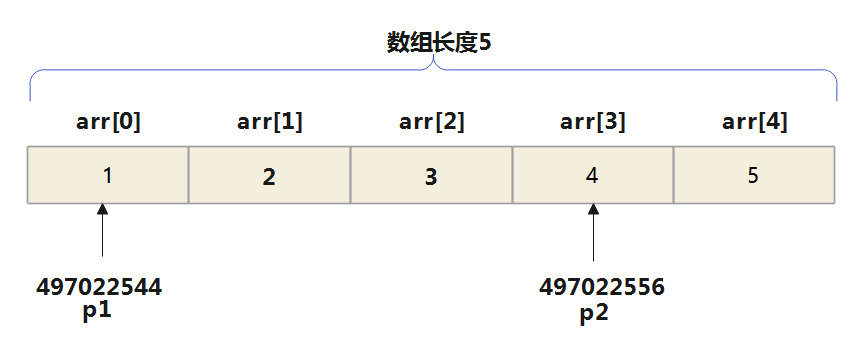

> 体会：两个指针相减，通常两个指针都是指向同一数组中的元素才有意义。结果是两个地址之差除以数组元素的长度。不相干的两个变量的地址，通常没有做减法的必要。

举例：

```c
int main() {

    int i = 10;
    int j = 20;
    int *p1 = &i;
    int *p2 = &j;

    ptrdiff_t dist = p1 - p2;
    printf("%d\n",dist);   //通常没有计算减法的必要

    return 0;
}
```

**非法：同类指针相加运算**

两个指针进行加法是`非法的`，所得结果是没有意义的。

```c
int i = 10,j = 20;
int *p1 = &i;
int *p2 = &j;
int *p3 = p1 + p2; //非法
```

#### 2.3.4 指针间的比较运算

指针之间的比较运算，比如 ==、!= 、<、 <= 、 >、 >=。比较的是各自的内存地址的大小，返回值是整数 1 （true）或 0 （false）。

举例：

```c
int arr[5] = {1, 2, 3, 4, 5};
int *p1 = &arr[0];
int *p2 = &arr[3];

printf("%d\n",p1 > p2);  //0
printf("%d\n",p1 < p2);  //1
printf("%d\n",p1 == p2); //0
printf("%d\n",p1 != p2); //1
```

练习：

```c
int main() {

    int arr[] = {10, 20, 30};
    int *ptr;
    ptr = arr;  //ptr指向arr首地址(第一个元素)
    if (ptr == arr[0]) { //错误,类型不一样
        printf("ok1\n");
    }
    if (ptr == &arr[0]) { // 可以
        printf("ok2\n"); //输出
    }
    if (ptr == arr) { //可以
        printf("ok3\n"); //输出
    }
    if (ptr >= &arr[1]) { //可以比较,但是返回false
        printf("ok4\n");//不会输出
    }

    if (ptr < &arr[1]) { //可以比较,返回true
        printf("ok5\n");//输出
    }

    return 0;
}
```


> 【华南理工大学2018研】若有说明：int \*p，m＝5，n；，以下正确的程序段是（　　）。
> A．
>
> ```c
> p=&n;  
> scanf("%d",n); 
> ```
>
> B．
>
> ```c
> p=&n;  
> scanf("%d",*p); 
> ```
>
> C．
>
> ```c
> scanf("%d",&n);  
> p=n 
> ```
>
> D．
>
> ```c
> p=&n;  
> *p=n; 
> ```
>
> 【答案】D
>
> 【解析】scanf语句中第二个参数应该是变量的地址，AB错误；C中p为指针变量，不可以直接把一个int型变量赋值给指针型，C错误；答案选D。


>  【华南理工大学2018研】若有定义：int \*p，\*s，c；，且各变量已正确赋值，则非法的赋值表达式是（　）。
>  A．p＝s
>  B．c＝\*s
>  C．*s＝&p
>  D．p＝&c
>
>  【答案】C
>
>  【解析】C中p为指针变量，则&p表示的是指针的地址，若要赋值，则左边变量应该是一个二级指针，而*s代表的是s所指向地址的变量值，这个变量是一个int型，显然不正确。


> 【中央财经大学2018研】有如下说明
>
> ```c
> int a[10]={1,2,3,4,5,6,7,8,9,10}, *p=a;
> ```
>
> 则数值为9的表达式是（　　）。
> A．\*p＋9
> B．\*(p＋8)
> C．*p += 9   
> D．p＋8
>
> 【答案】B
>
> 【解析】A中\*p＝1，\*p＋9＝10，A错误。C中*p得到的是1，加9后结果是10，C错误。D中p是地址，p＋8仍然表示一个地址。因此B项正确，p＋8指向元素9，进行取值得9。


## 3、野指针

### 3.1 什么是野指针

野指针：就是指针指向的位置是不可知（`随机性`，`不正确`，`没有明确限制的`）。

### 3.2 野指针的成因

#### ① 指针使用前未初始化

指针变量在定义时如果未初始化，`其值是随机的`，此时操作指针就是去访问一个不确定的地址，所以结果是不可知的。此时p就为野指针。

```c
int main() {
    int *p;
    printf("%d\n",*p);

    return 0;
}
```

在没有给指针变量显式初始化的情况下，一系列的操作(包括修改指向内存的数据的值)也是错误的。

```c
#include<stdio.h>
int main(){
	int* p;                       
	*p = 10;  
	
	return 0;
}
```

拓展：注意如下的赋值操作也是错误的

```c
int main() {
    int num = 10;
    int *p;
    p = num;

    return 0;
}
```

#### ② 指针越界访问 

```c
#include <stdio.h>

int main() {
    int arr[10] = {0};
    int *p = arr;
    for (int i = 0; i <= 10; i++,p++) {
        *p = i;                   //i=10时越界
    }
    return 0;
}
```

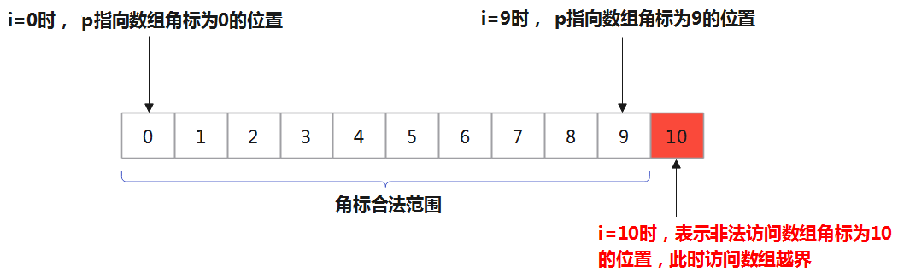

当i=10时，此时`*p`访问的内存空间不在数组有效范围内，此时`*p`就属于非法访问内存空间，p为野指针。

#### ③ 指针指向已释放的空间

```c
#include <stdio.h>

int *test() {
    int a = 10;
    return &a;          //&a=0x0012ff40
}

int main() {
    int *p = test();
    printf("%d", *p);
    return 0;
}
```

调用test函数将返回值赋给p，test函数的返回值是局部变量a的地址。由于a只在test函数内有效，出了test函数其内存空间就被释放，也就意味着`a的地址编号不存在`，若将其赋值给p，导致p获取到的地址是`无效`的。

如果短时间内再次利用这块地址，它的值还未被改变也就是0x0012ff40还存在，p的值为0x0012ff40，*p时还是10，可以打印出。

但如果在打印之前有其他函数调用了这块地址，这块地址的名称就会发生变化，不再是0x0012ff40，打印*p时不再为10。

总之，此时p为野指针。

### 3.3 野指针的避免

**1、指针初始化**

定义指针的时候，如果没有确切的地址赋值，为指针变量赋一个 NULL 值是好的编程习惯。即

```c
int *p = NULL;
```

> 赋为 NULL 值的指针被称为`空指针`，NULL 指针是一个定义在标准库 <stdio.h>中的值为零的常量 **#define NULL 0**

后面如果用到指针的话再让指针指向具有实际意义的地址，然后通过指针的取值符号(*)改变其指向的内容。

练习：

```c
#include<stdio.h>

int main() {
    int *p = NULL; //空指针不要与未初始化的指针混淆

    int b = 8;
    p = &b;   //显式赋值
    *p = 100;
    printf("%d\n", *p);  //100
    printf("%d\b", b);   //100

    return 0;
}
```

**2、小心指针越界**

**3、避免返回局部变量的地址**

**4、指针指向空间释放，及时置NULL**

```c
int a = 10;			
int* pa = &a;
printf("%d\n", *pa);
 
pa = NULL;				//把pa指针置成NULL
 
printf("%d\n",pa);
```

**5、指针使用之前检查有效性**

```c
if (pa != NULL){
	//进行使用
}

if (pa == NULL){
	//不进行使用
}
```


## 4、二级指针(多重指针)

一个指针p1记录一个变量的地址。由于指针p1也是变量，自然也有地址，那么p1变量的地址可以用另一个指针p2来记录。则p2就称为`二级指针`。

简单来说，二级指针即一个指针变量的值是另外一个指针变量的地址。通俗来说，二级指针就是指向指针的指针。

**格式：**

```
数据类型 **指针名;
```

举例1：

```c
int a = 10;
int *pa = &a;  //pa是一级指针
int **ppa = &pa; //ppa是二级指针，类型为int **
```


> 进而推理，会有int ***pppa = &ppa; 等情况，但这些情况一般不会遇到。

在上述代码基础上，

```c
int b = 20;
ppa = &b; //报错
```

将 ppa（类型为 `int **`，即二级指针）赋值为 &b，但 &b是一个 `int *` 类型的指针，而不是 `int **` 类型。这会导致类型不匹配的错误。

如果您想要将 ppa 指向 b，可以找一个额外的一级指针作为中介。如下操作：

```c
int b = 20;
int *pb = &b;     // 使用一级指针来指向b
ppa = &pb;        // 将ppa指向pb的地址，ppa是二级指针
```

举例2：

```c
int main() {
    int var = 3000;
    int *ptr = &var;        // 一级指针指向 var
    int **pptr = &ptr;      // 二级指针指向 ptr
    int ***ppptr = &pptr;   // 三级指针指向 pptr

    printf("Value of var: %d\n", var);
    printf("Value of ptr: %d\n", *ptr);         // 解引用一次
    printf("Value of pptr: %d\n", **pptr);      // 解引用两次
    printf("Value of ppptr: %d\n", ***ppptr);   // 解引用三次

    return 0;
}
```

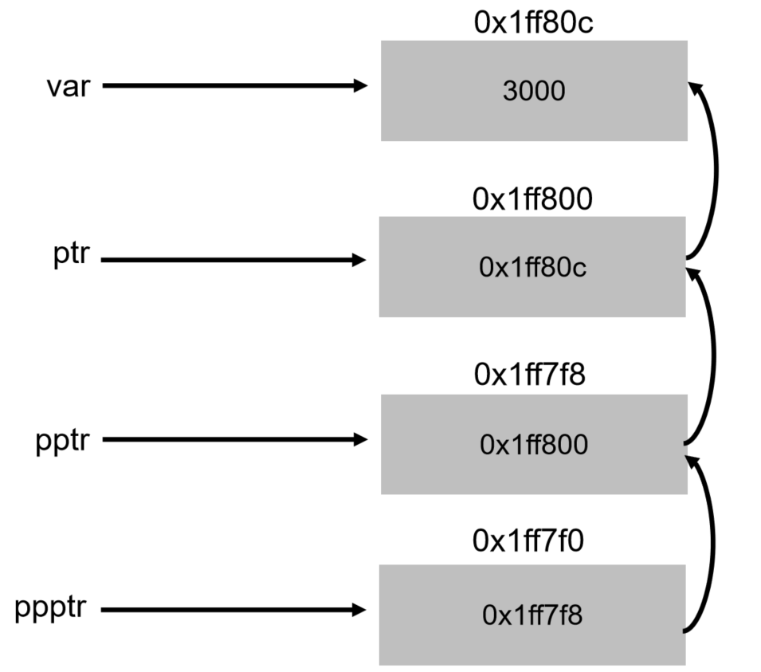

举例3：使用malloc()函数创建二维数组

malloc()函数用于动态分配堆内存，free()函数用于释放堆内存。这两个函数通常都是配合一起使用的。

```c
#include <stdio.h>
#include <stdlib.h>


int main() {
    int rows, cols;// 定义二维数组的行和列
    printf("第一维为：");
    scanf("%d", &rows);
    printf("第二维为：");
    scanf("%d", &cols);

    int **array = (int **) malloc(sizeof(int *) * rows);//先创建第一维
    for (int i = 0; i < rows; i++) {
        //在内层循环中动态创建第二维
        array[i] = (int *) malloc(sizeof(int) * cols);
        //
        for (int j = 0; j < cols; j++) {
            array[i][j] = 1;
            printf("%d　", array[i][j]);
        }
        printf("\n");
    }

    free(array);

    return 0;
}
```


## 5、专题：指针与数组

复习：


- "`*`"，也称为解引用符号，其`作用与&相反`。
- "`*`"，后面只能跟指针(即地址)或指针变量，"`&`"后面跟的是普通变量(包括指针变量)。

### 5.1 一维数组与指针

#### 5.1.1 指向一维数组的指针变量

所谓`数组元素的指针就是数组元素的地址`。可以用一个指针变量指向一个数组元素。

```c
int a[10]={2,4,6,8,10,12,14,16,18,20}; 
int *p; //定义p为指向整型变量的指针变量
p = &a[0]; //把a[0]元素的地址赋给指针变量p
```

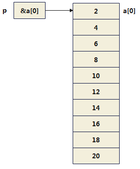

如下几个写法是等价的：

```c
int *p;
p = &a[0];  //千万不要写成*p = &a[0];，那就错了
```

```c
int *p = &a[0];
```

```c
int *p = a; //a不代表整个数组，所以这里不是将数组a赋给p。而代表数组元素a[0]的首地址。
```

注意：

因为数组名a保存的是`数组首元素a[0]的地址`，所以在scanf函数中的输入项如果是数组名，`不要再加地址符&`。

```c
int main() {
    char arr[10];
    scanf("%s", arr);  //arr前不应加 &

    puts(arr);

    return 0;
}
```

#### 5.1.2 使用指针访问数组的元素

如果指针变量p的初值为`&a[0]`，则：

- `p+i`和`a+i`就是数组元素`a[i]`的地址。或者说，它们指向a数组序号为i的元素。

- `*(p+i)`或`*(a+i)`是`p+i`或`a+i`所指向的数组元素的值，即a[i]的值。


举例1：数组元素赋值、遍历

方式1：下标法

```c
#include <stdio.h>
#define N 5

int main() {
    int a[N];

    printf("请输入%d个整数：\n",N);
    for (int i = 0; i < N; i++)
        scanf("%d", &a[i]); //数组元素用数组名和下标表示

    for (int i = 0; i < N; i++)
        printf("%d ", a[i]);

    printf("\n");
    return 0;
}
```

方式2：

```c
#include <stdio.h>
#define N 5

int main() {
    int a[N];

    printf("请输入%d个整数：\n",N);
    for (int i = 0; i < N; i++)
        scanf("%d", &a[i]); //数组元素用数组名和下标表示

    for (int i = 0; i < N; i++)
        printf("%d ", *(a + i));

    printf("\n");
    return 0;
}
```

方式3：使用指针变量

```c
#include <stdio.h>

#define N 5

int main() {
    int a[N];
    int *p = a;
    printf("请输入%d个整数：\n", N);
    for (int i = 0; i < N; i++)
        scanf("%d", p + i);

    for (int i = 0; i < N; i++)
        printf("%d ", *(p + i));

    printf("\n");
    return 0;
}
```

或者

```c
#include <stdio.h>

#define N 5

int main() {
    int a[N];
    int *p = a;
    printf("请输入%d个整数：\n", N);
    for (int i = 0; i < N; i++)
        scanf("%d", p + i);

    for (p = a; p < (a + N); p++)
        printf("%d ", *p);

    printf("\n");
    return 0;
}
```

> 第(1)和第(2)种方法执行效率是相同的。C编译系统是将a[i]转换为*(a+i)处理的，即先计算元素地址。因此用第(1)和第(2)种方法找数组元素`费时较多`。
>
> 第(3)种方法比第(1)、第(2)种方法快，用指针变量直接指向元素，不必每次都重新计算地址，像p++这样的自加操作是比较快的。这种有规律地改变地址值(p++)能大大`提高执行效率`。但第(1)方法比较直观，适合初学者。

**思 考：**

可以通过改变指针变量p的值指向不同的元素。如果不用p变化的方法而用数组名a变化的方法（例如，用a++）行不行呢？ （不行）

```c
for(p = a;a < (p + N);a++)
	printf("%d",*a);
```

因为数组名a代表数组的首地址（或数组首元素的地址），它是一个指针型`常量`，它的值在程序运行期间是固定不变的。所以a++是无法实现的。必须将 a 的地址赋值给指针变量 p ，然后对 p 进行自增。

举例2：获取数组的最大值

```c
#include<stdio.h>
#define N 5

int main() {
    int a[N];
    int *p;
    p = a;
    printf("请输入%d个数据：\n", N);
    for (int i = 0; i < N; i++)
        scanf("%d", p + i);
    //获取最大值
    int max = *p;
    for (int i = 1; i < N; i++)
        if (max < *(p + i))
            max = *(p + i);
    printf("Max: %d\n", max);

    return 0;
}
```

#### 5.1.3 指针带下标的使用

指向数组元素的指针变量也可以带下标，如`p[i]`。p[i]被处理成`*(p+i)`，如果p是指向一个整型数组元素a[0]，则p[i]代表a[i]。但是必须弄清楚p的当前值是什么？**如果当前p指向a[3]，则p[2]并不代表a[2]，而是a[3+2]，即a[5]。**

举例：

```c
int main() {
    int a[5] = {10,20,30,40,50};
    int *p = a;

    //遍历数组元素
    for(int i = 0;i < 5;i++){
        printf("%d ",p[i]);
    }
    printf("\n");

    //注意：
    p++;
    printf("%d ",p[0]); //20

    return 0;
}
```

#### 5.1.4 &数组名

举例1：

```c
//复习
int main() {
    int arr[5] = {0};
    int *p = arr;
    printf("%p\n",p);  //000000000034fa50
	printf("%p\n",&p); //000000000037fbd8
    
    return 0;
}
```


进一步思考：

```c
printf("%p\n", arr);  //000000000034fa50
printf("%p\n", &arr); //000000000034fa50
```

发现，`数组名` 和 `&数组名` 打印的地址是一样的。

举例2：

```c
#include <stdio.h>

int main() {
    int arr[5] = {0};
    printf("arr = %p\n", arr);        //000000cade5ff750
    printf("&arr= %p\n", &arr);       //000000cade5ff750
    printf("arr+1 = %p\n", arr + 1);    //000000cade5ff754
    printf("&arr+1= %p\n", &arr + 1);   //000000cade5ff764

    return 0;
}
```

&arr 理解为`数组的地址`，而不要理解为数组首元素a[0]的地址。

本例中 &arr 的类型是： int(*)[5] ，是一种数组指针类型。数组的地址+1，跳过整个数组的大小，所以 &arr+1 相对于 &arr 的差值是20。


> 【北京航空航天大学2018研】若有以下变量的声明语句：
>
> ```c
> int i = 1,a[] = {0,2,4}, *b;
> b = &i;
> ```
>
> 则下列选项中，其结果与表达式“\*(a＋1)”相等的是（　）。
> A．a[0]
> B．\*a＋i
> C．\*(a＋b)
> D．\*(a＋*b)
>
> 【答案】D
>
> 【解析】a指向数组的首元素，因此\*(a＋1) 表示取数组第二个元素的值，为2。A项，a[0]＝0，不相等；B项，\*a为数组第一个元素的值为0，再加上i＝1，因此结果为1，不相等；C项，a和b都是指针，相加没有意义，错误；D项，\*b的值i的值，即1，*(a＋1) 表示取数组第二个元素的值为2，相等，因此答案选D。


### 5.2 二维数组与指针

#### 5.2.1 使用数组名访问

设有一个二维数组 a 定义为：

```c
int a[3][4] = {{1, 2,  3,  4},
               {5, 6,  7,  8},
               {9, 10, 11, 12}};
```

二维数组 a，可视为三个一维数组：a[0]、a[1]、a[2]；而每个一维数组又是一维数组，分别由 4 个元素组成。首先，理解如下的操作：

```c
printf("%d\n",a[0][0]);  //二维数组中元素a[0][0]的值
printf("%p\n",&a[0][0]); //二维数组中元素a[0][0]的值对应的地址
printf("%p\n",a[0]);     //二维数组中a[0][0]的地址
printf("%p\n",a);        //二维数组中a[0]的地址
printf("%p\n",&a);       //二维数组a的地址
```

对应图示


举例：

| 表示形式                         | 含义                                            | 地址        |
| -------------------------------- | ----------------------------------------------- | ----------- |
| `a`                              | 二维数组名，指向一维数组a[0]，<br>即0行起始地址 | 2000        |
| `&a[0][0],a[0],*a `              | 0行0列元素地址                                  | 2000        |
| `a[0][0],*(a[0]),**a`            | 0行0列元素`a[0][0]`的值                         | 1           |
| `&a[1],a+1`                      | 指向索引为1行的起始地址                         | 2016        |
| `&a[1][0],a[1],*(a+1)`           | 1行0列元素`a[1][0]`的地址                       | 2016        |
| `a[1][0],*(a[1]),*(*(a+1))`      | 1行0列元素`a[1][0]`的值                         | 5           |
| `&a[1][2],a[1]+2,*(a+1)+2`       | 1行2列元素`a[1][2]`的地址                       | 2024        |
| `a[1][2],*(a[1]+2),*(*(a+1)+2) ` | 1行2列元素`a[1][2]`的值                         | 是元素值，7 |

总结：

> ```
> &a:二维数组a的地址
> a: 二维数组中a[0]的地址
> a[0]:二维数组中a[0][0]的地址
> 
> 讨论：a[0][0]相关的
> a[0][0]的地址：&a[0][0],a[0],*a,
> a[0][0]的值： a[0][0],*(a[0]),**a,
> 
> 讨论：a[1]相关的
> a[1]的地址：&a[1],a + 1
> 
> 讨论：a[1][0]相关的
> a[1][0]的地址：&a[1][0],a[1],*(a+1)
> a[1][0]的值：a[1][0],*a[1],*(*(a+1))
> 
> 讨论：a[1][2]相关的
> a[1][2]的地址：&a[1][2],a[1]+2,*(a+1)+2
> a[1][2]的值：a[1][2],*(a[1]+2),*(*(a+1)+2)
> ```

> 注意：
>
> 如果 a 是二维数组，则 a[i]代表一个数组名， a[i]并不占内存单元，也不能存放a 数组元素值。它只是一个地址。所以：a、a+i、a[i]、\*(a+i)、\*(a+i)+j、a[i]+j 都是地址。

获取数组元素值的三种表示形式：

1） `a[i][j]` 下标法

2） `*(a[i]+j)` 用一维数组名

3） `*(*(a+i)+j)` 用二维数组名

#### 5.2.2 使用指针变量访问

设 p 是指针变量，若p 指向数组首元素，即`p = a[0];`，那`a[i][j]`的指针如何表示？

先看一个代码：

```c
int main() {
    int a[3][2] = {{10, 20},
                   {30, 40},
                   {50, 60}};

    int *p;
    p = &a[0][0];
    printf("%p\n", p);     //000000f2f49ff7b0
    printf("%p\n", p + 1); //000000f2f49ff7b4
    printf("%p\n", p + 2); //000000f2f49ff7b8

    int *q;
    q = a[0];
    printf("%p\n", q);      //000000f2f49ff7b0
    printf("%p\n", q + 1);  //000000f2f49ff7b4
    printf("%p\n", q + 2);  //000000f2f49ff7b8

    int *r;
    r = a;  //代码片段1
    printf("%p\n", r);      //000000f2f49ff7b0
    printf("%p\n", r + 1);  //000000f2f49ff7b4
    printf("%p\n", r + 2);  //000000f2f49ff7b8

    return 0;
}
```

进而：

- p+j 将指向 a[0] 数组中的元素 `a[0][j]`。

- 对于二维数组`a[M][N]`来讲，由于 a[0]、a[1]、... 、a[M-1]等各行数组在内存中是依次连续存储，则对于 a 数组中的任一元素 `a[i][j]`：
  - 地址表示：`p+i*N+j`
  - 值表示：`*(p+i*N+j)`、`p[i*N+j]`

> 注意：上述代码中，代码片段1中的赋值操作会存在类型不匹配的情况，我们在5.6节中展开说明。

举例1：

```c
int b[4][3] = {{10, 20, 30},
               {40, 50, 60},
               {70, 80, 90},
               {100, 110, 120}};

int *p = b[0];
```

则：元素 `b[1][2]`对应的地址/指针、元素值为：

```c
printf("b[1][2]对应的地址/指针为：%p\n",p+1*3+2);
printf("b[1][2]对应的值为：%d\n",*(p+1*3+2));
printf("b[1][2]对应的值为：%d\n",p[1*3+2]);
```

举例2：用指针访问二维数组，求二维数组元素的最大值。

```c
#include <stdio.h>

#define ROWS 3
#define COLS 4

int main() {
    int a[ROWS][COLS] = {{10,  20,  30,  40},
                   {50,  60,  70,  80},
                   {120, 110, 100, 90}};

    //方式1：
//    int max = a[0][0];
//    for (int i = 0; i < ROWS; i++) {
//        for (int j = 0; j < COLS; j++) {
//            if (max < a[i][j]) {
//                max = a[i][j];
//            }
//        }
//    }

    //方式2：
    int *p = a[0];
    int max;
    for (int i = 0; i < ROWS; i++) {
        for (int j = 0; j < COLS; j++) {
            if (max < *(p + i * COLS + j)) {
                max = *(p + i * COLS + j);
            }
        }
    }
    printf("max=%d\n", max);

    //方式3：
    int *q, max1;
    for (q = a[0], max1 = *q; q < a[0] + ROWS * COLS; q++)
        if (max1 < *q)
            max1 = *q;
    printf("Max=%d\n", max1);


    return 0;
}
```

### 5.3 指针数组

#### 5.3.1 数组指针 vs 指针数组

**数组指针：**

当指针变量里存放一个数组的首地址时，此指针变量称为指向数组的指针变量，简称`数组指针`。

数组指针是指针？还是数组？

```
答案是：指针。
```

整型指针： int * pint; 能够指向整型数据的指针。

浮点型指针： float * pf; 能够指向浮点型数据的指针。

数组指针：能够指向数组的指针。

**指针数组：**

数组是用来存放一系列相同类型的数据，当然数组也可以用来存放指针，这种用来`存放指针的数组`被称为指针数组，它要求存放在数组中指针的`数据类型必须一致`。

问题：指针数组是指针还是数组？

```
答案：是数组。是存放指针的数组。
```

#### 5.3.2 指针数组的使用

格式：

```c
数据类型 *指针数组名[大小];
```

举例1：

```c
int *arr[5];
```

arr是一个数组，有5个元素，每个元素是一个整型指针，需要使用下标来区分。

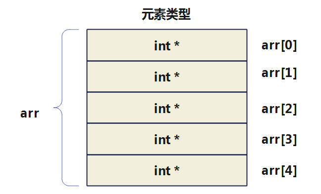

举例2：

```c
int main() {
    int a, b, c, d, e;
    a = 1;
    b = 2;
    c = 3;
    d = 4;
    e = 5;
    int *arr[] = {&a, &b, &c, &d, &e};//定义一个int类型的指针数组

    for(int i = 0;i < 5;i++){
        printf("%d ",*arr[i]);
    }

    return 0;
}
```

举例3：

```c
#include <stdio.h>

int main() {
    int line1[] = {1, 2, 3, 4};         //声明数组，矩阵的第一行
    int line2[] = {5, 6, 7, 8};         //声明数组，矩阵的第二行
    int line3[] = {9, 10, 11, 12};         //声明数组，矩阵的第三行
    int *p_line[3];              //声明整型指针数组
    p_line[0] = line1;           //初始化指针数组元素
    p_line[1] = line2;
    p_line[2] = line3;
    printf("矩阵:\n");
    for (int i = 0; i < 3; i++) {      //对指针数组元素循环

        for (int j = 0; j < 4; j++) {    //对矩阵每一列循环
            printf("%d\t", p_line[i][j]); //或改为printf("%d\t", *(p_line[i] + j));
        }
        printf("\n");
    }
    return 0;
}
```

运行结果：

 

### 5.4 字符数组 vs 字符指针变量

一个字符串，可以使用`一维字符数组`表示，也可以使用`字符指针`来表示。

- 字符数组由若干个元素组成，每个元素放一个字符
- 字符指针变量中存放的是地址（字符串/字符数组的首地址），绝不是将字符串放到字符指针变量中。

举例1：

```c
char str[] = "hello tom";  //使用字符数组

char * pStr = "hello tom";  //使用字符指针
```

图示：

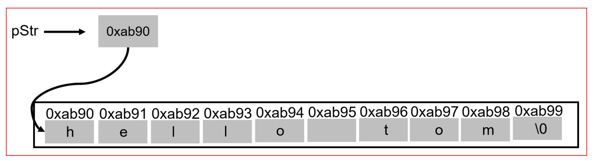

**两种方式的对比：**

对已声明好的字符数组，只能一一对各个元素赋值，不能用以下错误方法对字符数组赋值

```c
char str[14];

str[0] = 'i'; //正确

str = "hello Tom"; //错误
```

对字符指针变量，采用如下方式赋值是可以的。

```c
char * pStr = "hel";

pStr = "hello tom"; //正确
```

图示：

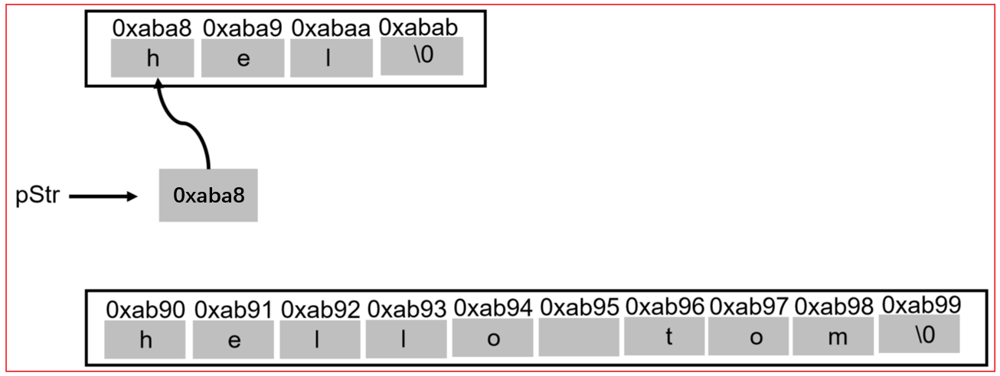

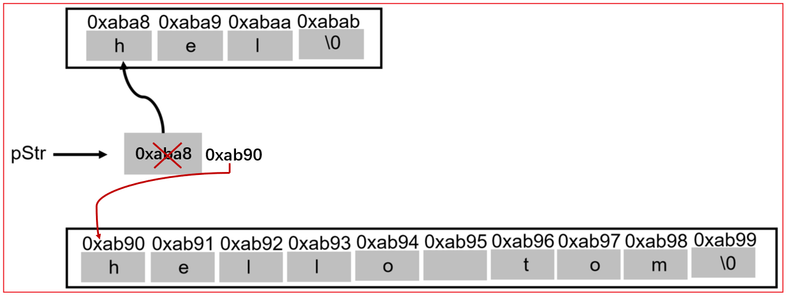

> 一个字符数组，因为它有确定的内存地址，所以字符数组名是一个`常量`。而定义一个字符指针变量时，它在指向某个确定的字符串数据的情况下，也可以多次`重新赋值`。

举例2：体会字符串字面量的不可变性

情况1：针对于整型数组、整型指针变量

```c
int main() {
    int arr[10] = {1, 2, 3, 4, 5, 6, 7, 8, 9, 10};

    int *p = arr;

    printf("%d\n", p[1]); //2

    p[1] = 50;
    printf("%d\n", p[1]); //50
    printf("%d\n", arr[1]);  //50

    //
    int num = 30;
    p = &num;
    printf("%d\n",*p);    //30
    printf("%d\n",p[0]);  //30

    return 0;
}
```

情况2：针对于字符数组、字符指针变量

```c
int main() {
    
    char arr[] = "hello";

    arr[1] = "m";    	//运行时错误 
    printf("%s\n",arr);

    return 0;
}
```

因为字符串字面量存储在只读内存区域，是不可变的，不能修改其值。

拓展：

```c
int main() {
    char *pStr = "hello";
    pStr = "hello tom"; //正确

    pStr[1] = 'm';      //运行时错误
    printf("%s\n",pStr);

    return 0;
}
```

### 5.5 字符串数组的表示

字符串可以使用一维字符数组或字符指针变量等两种方式表示，那么字符串数组如何表示呢？

如果一个数组的每个成员都是一个字符串，则构成了字符串数组。字符串数组有两种表示方式：`① 二维字符数组` ；`②字符指针数组`。

举例1：

方式1：使用二维字符数组

```c
char fruit[][7]={"Apple","Orange","Grape","Pear","Peach"};  //上一章5.6节举例4
```

```c
char weekdays[7][10] = {   //行数7也可以省略
	"Monday",
	"Tuesday",
	"Wednesday",
	"Thursday",
	"Friday",
	"Saturday",
	"Sunday"
};
```

字符串数组，一共包含7个字符串，所以第一维的长度是7。其中，最长的字符串的长度是10（含结尾的终止符 \0 ），所以第二维的长度统一设为10。

**思考：**数组的第二维，长度统一定为10，有点浪费空间，因为大多数成员的长度都小于10。解决方法就是把数组的第二维，从字符数组改成字符指针。

方式2：使用字符指针数组

```c
char* weekdays[7] = {  //7也可以省略
  "Monday",
  "Tuesday",
  "Wednesday",
  "Thursday",
  "Friday",
  "Saturday",
  "Sunday"
};
```

上面的字符串数组，其实是一个一维数组，成员就是7个字符指针，每个指针指向一个字符串（字符数组）。

类似的：定义表示颜色的指针数组 colors，存储“red”、“yellow”、“blue”、“white”、“black” 5 种颜色。

```c
char *colors[5] = {"red", "yellow", "blue", "white", "black"};
```

**遍历字符指针数组：**

```c
for (int i = 0; i < 7; i++) {
	printf("%s\n", weekdays[i]);
}
```

举例2：

请编写程序，定义一个字符指针数组，用来存储四大名著的书名， 并通过遍历该指针数组，显示字符串信息 ， (即：定义一个指针数组，该数组的每个元素，指向的是一个字符串)

方式1：二维字符数组

```c
int main() {

    char books[4][13] = {"三国演义", "西游记", "红楼梦", "水浒传"};
    int len = 4;
    for(int i = 0;i < len;i++){
        printf("books[%d] : %s\n",i,books[i]);
    }

    return 0;
}
```

方式2：字符指针数组

```c
int main() {
    //定义一个指针数组，该数组的每个元素，指向的是一个字符串
    char *books[] = {
            "三国演义",
            "西游记",
            "红楼梦",
            "水浒传",
    };

    //遍历
    int len = 4;
    for (int i = 0; i < len; i++) {
        printf("books[%d] : %s\n", i, books[i]);
    }

    return 0;
}
```


### 5.6 拓展：指向固定长度数组的指针变量

定义一个整型指针变量指向一维数组，一维数组的每个元素包含 m 个元素。

定义格式：

```
(*标识符)[一维数组元素个数];
```

例如：定义一个指针变量 p，它指向包含有 4 个元素的一维数组。

```
int (*p)[4];
```

> 说明：p先和*结合，说明p是一个指针变量，指向一个大小为4的整型数组。
>
> 注意：此时定义的是一个指针变量，并非是一个指针数组。(*p 必须放在括弧内，否则就变成了定义指针数组。)

由于 p 是指向有 4 个整型元素的一维数组的指针变量，因此，p+1 是将地址值加上 4*4，即指向下一个一维数组。

举例：

```c
int a[3][4] = {{1, 2,  3,  4},
               {5, 6,  7,  8},
               {9, 10, 11, 12}};
int (*q)[4];
q = a;
```

则：

`q` 为二维数组第 0 行首地址，与 `a` 相同；

`q+1` 为二维数组第 1 行首地址，与 `a+1`相同；

`q+2` 为二维数组第 2 行首地址，与 `a+2`相同；

`*(q+i)`为二维数组第 i 行第 0 列元素的地址，与`*(a+i)`相同；

`*(q+i)+j `为二维数组第 i 行第 j 列元素的地址，与`*(a+i)+j` 相同；

`*(*(q+i)+j) `为二维数组第 i 行第 j 列元素值，与`*(*(a+i)+j)`相同，即 `a[i][j]`。

举例：

```c
int main() {
    int arr[3][4] = {{1, 2,  3,  4},
                     {5, 6,  7,  8},
                     {9, 10, 11, 12}};
    int (*q)[4];
    q = arr;

    printf("arr[0]的地址为：%p\n", arr);            //0000006460dffb40
    printf("arr[0]的地址为：%p\n", q);              //0000006460dffb40
    printf("arr[0][1]的地址为：%p\n", *arr + 1);    //0000006460dffb44
    printf("arr[0][1]的地址为：%p\n", *q + 1);      //0000006460dffb44
    printf("arr[0][1]的地址为：%p\n", arr[0] + 1);  //0000006460dffb44
    printf("arr[0][1]的地址为：%p\n", q[0] + 1);    //0000006460dffb44

    printf("arr[1]的地址为：%p\n", arr + 1);       //0000006460dffb50
    printf("arr[1]的地址为：%p\n", q + 1);         //0000006460dffb50

    printf("arr[1][0]的值为：%d\n", *(*(arr + 1))); //5
    printf("arr[1][0]的值为：%d\n", *(*(q + 1)));   //5
    printf("arr[1][1]的值为：%d ", *(*(q + 1) + 1));//6

    //遍历arr[0]中的几个元素
    for (int i = 0; i < 4; i++) {
        printf("%d ", *(*q + i)); //输出1 2 3 4
    }
    printf("\n");

    return 0;
}
```


>【华南理工大学2018研】若有以下说明：
>
>```c
>int w[3][4]={{0,1},{2,4},{5,8}};
>int (*p)[4]=w;
>```
>
>则数值为4的表达式是（　）。
>A．\*w[1]＋1
>B．p++，*(p＋1)
>C．w\[2][2]
>D．p\[1][1]
>
>【答案】D
>
>【解析】A中\*w[1]表示的是数值2，则表达式的值为3，错误；B中p++表示指向二维数组第二行w[1]的地址，而*(p＋1)代表的是第三行w\[2][0]元素的地址，B错误；C中表示的是数值0，答案选D。


