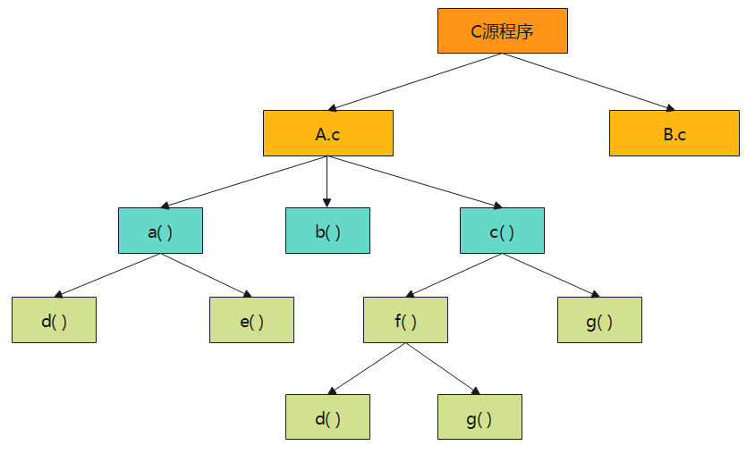
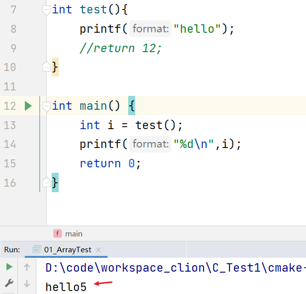

# 第06章_函数

讲师：尚硅谷-宋红康（江湖人称：康师傅）

官网：[http://www.atguigu.com](http://www.atguigu.com/)

***

## 本章专题脉络


## 1、函数的基本使用

### 1.1 为什么需要函数


《街霸》游戏中，每次人物出拳、出脚或跳跃等动作都需要编写50-80行的代码，在每次出拳、出脚或跳跃的地方都需要`重复地编写`这50-80行代码，这样程序会变得`很臃肿`，可读性也非常差。为了解决代码重复编写的问题，可以将出拳、出脚或跳跃的`代码提取`出来放在一个{}中，并为这段代码起个名字，这样在每次的出拳、出脚或跳跃的地方通过这个名字来调用这个{}的代码就可以了。

> 提取出来的代码可以看作是程序中定义的一个`函数`，程序在需要出拳、出脚或跳跃时调用该函数即可。


- 将特定功能的代码封装为函数的好处：`实现代码重用，减少冗余，简化代码`。

- 一个C源程序可以由一个或多个源文件构成（C文件扩展名是“.c”），一个源文件是一个编译单位。一个源文件可以由若干个函数构成，函数之间可以相互调用。也就是说，`函数是C程序基本的组成单位`。

  

> 练习：
>
> C语言主要是借助以下（　　）功能来实现程序模块化的。
> A．定义函数
> B．定义常量和外部变量
> C．三种基本结构语句
> D．丰富的数据类型
>
> 【答案】A
>
> 【解析】C程序的模块化主要通过函数来实现。C语言允许对函数单独进行编译，从而可以实现模块化。

### 1.2 函数的分类

**角度1：从程序执行的角度看**

- 主函数：main()函数
- 子函数：非main()函数

每个C应用程序只有一个，且必须有一个main()主函数。无论主函数写在什么位置，C程序总是从main()函数开始执行。main()函数可以调用其它的子函数，子函数之间可以相互调用任意多次。

**角度2：是否允许源文件外调用角度看**

- 内部函数
- 外部函数

**角度3：从用户使用的角度看**

`① 库函数(或标准函数)`

它是由C系统提供的，用户不必自己定义，可直接使用它们。注意，不同的C语言编译系统提供的库函数的数量和功能会有一些不同，但是一些基本的函数是共同的。比如：

- 字符串操作函数
- 字符操作函数
- 时间/日期函数
- 数学函数
- IO函数
- 内存操作函数
- 其它库函数

> 使用库函数，必须包含 `#include` 对应的头文件。

`② 用户自己定义的函数`

它是用以解决用户特定业务需求的函数。

### 1.3 函数的声明格式

**函数定义的格式：**

```
返回值类型 函数名(数据类型1 形参1,数据类型2 形参2,…,数据类型n 形参n){
	函数体;
}
```

**举例：**

```c
//计算两个整数的和，并返回
int add(int m,int n) {
	return m + n;
}
```

```c
//计算两个整数的较大值，并返回
int max(int a, int b){  //定义函数max()
    int c;
    c = a > b ? a : b;     //求a,b两个数的最大值，赋给c
    return c;     //将最大值返回
}
```

```c
void printMax(int x,int y){
	int z;
    z = x > y ? x : y;     //求x,y两个数的最大值，赋给z
    printf("%d\n",z);
}
```

**具体说明：**

`1) 返回值类型`

函数调用后，是否需要在主调函数(比如main()函数)中得到一个确定的、返回的值，针对这个返回值的描述，就是返回值类型。返回值常常是一个计算的结果，或是用来作为判断函数执行状态(完成还是出错)的标记。

函数按是否有返回值来分类的话，分为：

- `无返回值的类型`：针对函数无返回值或明确不需返回值的情况，使用 `void` (即空类型)表示。
  - 举例：输出函数 void printf(const char *format, ...)。
- `有返回值的类型`：指明具体的类型。比如， int、float、char 等。如果省略，默认为int类型。
  - 有返回值类型，则需要在函数体内与“`return 返回值`”搭配使用。返回值需要与返回值类型一致。
  - 举例：int rand()，调用后返回一个随机整数

```c
#include <stdio.h>
#include <stdlib.h>

void printHello() {
    printf("Hello!\n");
}

int getRandomNumber() {
    return rand() % 100;
}

//在main()中调用printHello()、getRandomNumber()，相对于这两个方法，main()称为主调函数
int main() { 
    //调用printHello()
    printHello();
    
    //调用getRandomNumber()
    int randomNumber = getRandomNumber();
    printf("Random number: %d\n", randomNumber);
    
    return 0;
}
```

> 特殊的：如果返回值类型非 void，但被调函数中没有 return 语句，函数会返回一个不确定的值。

```c
int test(){
    printf("hello");
    //return 12;
}

int main(){
    int i = test();
    printf("%d\n",i);
    return 0;
}
```

运行结果：



`2) 函数名`

函数名，属于标识符。要遵循标识符的命名规则，同时要`见名知意`，以增强程序的可读性。

`3) 参数列表`

函数名后面的圆括号里面，可以声明参数的类型和参数名。表示完成函数体功能时需要外部提供的数据列表。

根据是否有参数，函数可以分为：

- `无参函数`，在调用无参函数时，主调函数不向被调用函数传递数据。但函数名后的()不能省略。
  - 举例：abort()：立即终止程序的执行，不接受任何形参。
- `有参函数`，在调用函数时，主调函数在调用被调用函数时，通过参数向被调用函数传递数据。
  - 函数参数为多个参数时，其间用逗号隔开。
  - 举例：add(int m,int n)，strcmp(const char *str1, const char *str2)

```c
//打印5行6列的*型矩形
void print(){
    for(int i = 0;i < 5;i++){
        for(int j = 0;j < 6;j++){
            printf("*");
        }
        printf("\n");
    }
}

//打印m行n列的*型矩形
void printGraph(int m,int n){
    for(int i = 0;i < m;i++){
        for(int j = 0;j < n;j++){
            printf("*");
        }
        printf("\n");
    }
}

int main() {
//    print();

    printGraph(5,10);
}
```

`4) 函数体`

函数体要写在大括号{}里面，是函数被调用后要执行的代码。

对于调用者来说，不了解函数体如何实现的，并不影响函数的使用。

`5) 关于return 语句`

- return语句的作用：① 结束函数的执行 ②将函数运算的结果返回。
- return语句后面就不能再写其它代码了，否则会报错。(与break、continue情况类似)
- 下面分两种情况讨论：
  - 情况1：返回值类型不是void时，函数体中必须保证一定有 `return 返回值; `语句，并且要求该返回值结果的类型与声明的返回值类型一致或兼容。
  - 情况2：返回值类型是void时，函数体中可以没有return语句。如果要用return语句提前结束函数的执行，那么return后面不能跟返回值，直接写`return;` 就可以。

```c
#include <stdio.h>

int addInt(int m ,int n){
    int sum = m + n;
    return sum;
}

double addDouble(double d1,double d2){
    double sum = d1 + d2;
    return sum;
}

void printNum(int start,int limit){
    for(int i = start;i <= limit;i++){
        if(i % 5 == 0){
            return;
            //printf("今天买彩票，一定能中奖");
        }
        printf("i = %d\n", i);
    }
	printf("over!\n", i);
}

int main() {

    int result = addInt(10,20);
    printf("result = %d\n",result);

    printNum(1,20);
}
```

**类比举例：**


### 1.4 声明注意事项

1、C程序中的所有函数都是互相独立的。一个函数并不从属于另一个函数，即函数不能嵌套定义。

```c
//错误演示
int func1(int a,int b){   //第1个函数的定义
    ...
    int func2(int c,int d){    //第2个函数的定义
       ...
    }
    ...
}
```

2、同一个程序中函数不能重名，`函数名用来唯一标识一个函数`。即在标准的 C 语言中，并不支持函数的重载。


`什么是函数的重载？`

函数的重载是一种编程语言特性，像C++、Java等语言都支持。它允许在同一个作用域内(比如同一个"类"中)定义多个`函数名相同`但`参数列表不同`(即参数个数不同或参数类型不同)的函数。此时的多个函数彼此构成重载。

调用时，编译器会根据传递的参数类型和数量来确定调用哪个函数。

如果想在 C 中模拟函数的重载有两种方式。不过，都不如 C++ 中的函数重载那样灵活和方便。

- 方式1：使用不同的函数名来区分不同的函数
- 方式2：为函数添加后缀来表示不同的版本。

```c
void multiply(int m){
    int result = m * m;
    printf("结果为：%d\n",result);
}

void multiply1(int m,int n){
    int result = m * n;
    printf("结果为：%d\n",result);
}
```


>  【华南理工大学2018研】在C语言中，当函数的返回值缺省时，表示该函数返回值的类型是（　　）。
>  A．char
>  B．float
>  C．long
>  D．int
>
>  【答案】D
>
>  【解析】在C语言中，当函数的返回值缺省时，函数返回值的类型默认为int型。


> 【华南理工大学2018研】以下叙述中不正确的是（　）。
> A．在不同的函数中可以使用相同名字的变量
> B．函数中的形式参数是局部变量
> C．在一个函数内定义的变量只能在本函数范围内有效
> D．在一个函数的复合语句中定义的变量在本函数范围内有效
>
> 【答案】D
>
> 【解析】在一个函数的复合语句中定义的变量只在该复合语句中有效。

```c
void func(){
    int i = 10;
    
    {
        int j = 10;
        //
    }
    //不能调用j
}
```


> 【四川大学2017研】已定义如下函数：
>
> ```c
> fun(int *p){
> 	return *p;
> }
> ```
>
> 该函数的返回值是（　　）。
>
> A．不确定的值
> B．形参p中存放的值
> C．形参p所指存储单元中的值
> D．形参p的地址值
>
> 【答案】C
>
> 【解析】p是一个指向int型的指针变量，*p表示的是p所指向内存存放的变量，是一个int型，所以return *p表示返回p所指存储单元中的值，答案选C。


> 【华南理工大学2018研】下列函数的功能是（　）。
>
> ```c
> int fun1(char *x) {
> 	char *y = x;
> 	while (*y++);
> 	return (y - x - 1);
> }
> ```
>
> A．求字符串的长度
> B．比较两个字符串的大小
> C．将字符串X复制到字符串Y
> D．将字符串X连接到字符串Y后
>
> 【答案】A
>
> 【解析】while后面的表达式是指针依次遍历直到碰到\0，此时y指向字符串最后一个元素的后一个位置，但是由于y++，因此y会继续后移一位，而x指向字符串的头部，后面的y－x－1显然是用于计算字符串的长度。


### 1.5 函数的调用

调用函数时，需要传入实际的参数值。如果没有参数，只要在函数名后面加上圆括号就可以了。

举例1：

函数的声明

```c
void func() {
    printf("这是我的第一个函数！\n");
}
```

函数的调用

```c
int main() {
    func();
    
    //func(10);     // 报错
	//func(10,20);  // 报错
    
    return 0; //程序正常结束，默认返回0
}
```


举例2：

```c
void func(int x, int y) {
    int sum = x + y;
    printf("x+y=%d\n", sum);
}

int main() {
    func(3, 5);
    
    return 0;
}
```


举例3：

```c
int func(int x, int y) {
    return x + y;
}

int main() {
    int sum = func(3, 5);
    printf("x+y=%d\n", sum);
    
    return 0;
}
```


> 说明：
>
> 1、调用时，参数个数必须与函数声明里的参数个数一致，参数过多或过少都会报错。
>
> 2、函数间可以相互调用，但不能调用main函数，因为main函数是被操作系统调用的，作为程序的启动入口。反之，main() 函数可以调用其它函数。
>
> 3、函数的参数和返回值类型，会根据需要进行自动类型转换。
>
> ```c
> void func(int num){
> 	printf("%d\n",num);
> }
> 
> char func1() {
> 	int a = 65;
>  return a;  //变量a的类型由int自动转换为char了。
> }
> 
> 
> 
> int main() {
> 	//函数体
> 	short b = 10;
> 	func(b);
> 
> 	char c = func1();
> 	printf("%c\n",c);
> }
> ```

### 1.6 练习

练习1：

① 编写程序，声明一个print1()函数，在函数中打印一个`10*8的*型矩形`。

② 编写程序，声明一个print2()函数，除打印一个`10*8的*型矩形`外，再计算该矩形的面积，并将其作为函数返回值。

③ 编写程序，声明一个print3()函数，函数提供m和n两个参数，函数中打印一个`m*n的*型矩形`，并计算该矩形的面积， 将其作为返回值。

```c
void print1(){
    for(int i = 0;i < 10;i++){
        for(int j = 0;j < 8;j++){
            printf("* ");
        }
        printf("\n");
    }
}
```

```c
int print2(){
    for(int i = 0;i < 10;i++){
        for(int j = 0;j < 8;j++){
            printf("* ");
        }
        printf("\n");
    }
    return 10 * 8;
}
```

```c
int print3(int m,int n){
    for(int i = 0;i < m;i++){
        for(int j = 0;j < n;j++){
            printf("* ");
        }
        printf("\n");
    }
    return m * n;
}
```

练习2：定义函数max()，求两个double型变量的最大值，求三个double型变量的最大值

```java
#include <stdio.h>

double dualMax(double x, double y) {
    return x > y ? x : y;
}

double triMax(double x, double y, double z) {
    return dualMax(dualMax(x, y), z);  //嵌套调用
}

int main() {
    double a, b, c;
    printf("a,b,c: ");
    scanf("%lf,%lf,%lf", &a, &b, &c);
    printf("%.2lf和%.2lf的最大值是：%.2lf\n",a,b,dualMax(a, b));
    printf("%.2lf、%.2lf、%.2lf的最大值是：%.2lf\n",a,b,c,triMax(a,b,c));

    return 0;
}
```

练习3：定义求和函数getSum，求 1+2+…+n，并返回结果

```c
#include<stdio.h>

int getSum(int n) {
    int sum = 0;
    for (int i = 1; i <= n; i++) {
        sum += i;
    }
    return sum;
}

int main() {
    int n = 100;
    int result = getSum(n);

    printf("1+2+...+%d = %d\n", n, result);
}
```

练习4：哥德巴赫猜想

任一大于 2 的偶数都可写成两个素数之和。利用判断素数的函数 prime()验证哥德巴赫猜想。

```java
#include <stdio.h>

#include <math.h>

int prime(int n) {  //判断素数函数

    for (int i = 2; i <= sqrt(n); i++) {
        if (n % i == 0)
            return 0;
    }

    return 1;
}

int main() {
    int num;
    printf("请输入一个大于2的偶数：");
    scanf("%d", &num);
    for (int i = 2; i <= num / 2; i++) {
        if (prime(i) && prime(num - i)) {
            printf("%d = %d + %d\n", num, i, num - i);
            break;
        }
    }
    return 0;
}
```

练习5：

编写一组函数，用于处理日期和时间相关的操作。使用这些函数，可以进行日期和时间相关的计算。

① 编写一个函数 `char *getWeekName(int week)`，该函数接收一个代表星期的整数（1表示星期一，7表示星期日），并返回相应的星期名称。如果输入无效，则返回空字符串。

② 编写一个函数 `char *getMonthName(int month)`，该函数接收一个代表月份的整数（1表示一月，12表示十二月），并返回相应的月份名称。如果输入无效，则返回空字符串。

③ 编写一个函数 `int isLeapYear(int year)`，该函数接收一个年份，并检查它是否为闰年。如果是闰年，则返回1，否则返回0。如果输入年份为负数，则返回-1作为错误标志。

提示：能被4整除但不能被100整除，或者能被400整除的年份，即为闰年。

④ 编写一个函数 `int getTotalDaysOfMonth(int year, int month)`，该函数接收一个年份和月份，并返回指定月份的总天数。如果输入无效，则返回-1作为错误标志。

⑤ 编写一个函数 `int getTotalDaysOfYear(int year)`，该函数接收一个年份，并返回指定年份的总天数。如果输入无效，则返回-1作为错误标志。

模板：

```c
// 函数：getWeekName
// 描述：根据输入的星期数，返回相应的星期名称
// 参数：week - 代表星期的整数（1表示星期一，7表示星期日）
// 返回值：返回表示星期名称的字符串，如果输入无效则返回空字符串
char *getWeekName(int week) {
    
}

// 函数：getMonthName
// 描述：根据输入的月份数，返回相应的月份名称
// 参数：month - 代表月份的整数（1表示一月，12表示十二月）
// 返回值：返回表示月份名称的字符串，如果输入无效则返回空字符串
char *getMonthName(int month) {
    
}

// 函数：isLeapYear
// 描述：检查输入的年份是否为闰年
// 参数：year - 待检查的年份
// 返回值：如果是闰年则返回1，否则返回0，如果输入为负数则返回-1作为错误标志
//提示：能被4整除但不能被100整除，或者能被400整除的年份，即为闰年。
int isLeapYear(int year) {
    
}

// 函数：getTotalDaysOfMonth
// 描述：获取指定年份和月份的总天数
// 参数：year - 年份，month - 月份
// 返回值：返回该月份的总天数，如果输入无效则返回-1作为错误标志
int getTotalDaysOfMonth(int year, int month) {
    
}

// 函数：getTotalDaysOfYear
// 描述：获取指定年份的总天数
// 参数：year - 年份
// 返回值：返回该年份的总天数，如果输入无效则返回-1作为错误标志
int getTotalDaysOfYear(int year) {
    
}
```

完整代码：

```c
#include <stdio.h>

// 函数：getWeekName
// 描述：根据输入的星期数，返回相应的星期名称
// 参数：week - 代表星期的整数（1表示星期一，7表示星期日）
// 返回值：返回表示星期名称的字符串，如果输入无效则返回空字符串
char *getWeekName(int week) {
    switch (week) {
        case 1:
            return "Monday";
        case 2:
            return "Tuesday";
        case 3:
            return "Wednesday";
        case 4:
            return "Thursday";
        case 5:
            return "Friday";
        case 6:
            return "Saturday";
        case 7:
            return "Sunday";
    }
    return "";
}

// 函数：getMonthName
// 描述：根据输入的月份数，返回相应的月份名称
// 参数：month - 代表月份的整数（1表示一月，12表示十二月）
// 返回值：返回表示月份名称的字符串，如果输入无效则返回空字符串
char *getMonthName(int month) {
    char *months[] = {"January", "February", "March", "April", "May", "June", "July",
                   "August", "September", "October", "November", "December"};
    if (month >= 1 && month <= 12) {
        return months[month - 1];
    }
    return "";
}

// 函数：isLeapYear
// 描述：检查输入的年份是否为闰年
// 参数：year - 待检查的年份
// 返回值：如果是闰年则返回1，否则返回0，如果输入为负数则返回-1作为错误标志
// 提示：能被4整除但不能被100整除，或者能被400整除的年份，即为闰年。
int isLeapYear(int year) {
    if (year >= 0) {
        return year % 4 == 0 && year % 100 != 0 || year % 400 == 0;
    }
    return -1; // 输入年份为负数，返回错误标志
}

// 函数：getTotalDaysOfMonth
// 描述：获取指定年份和月份的总天数
// 参数：year - 年份，month - 月份
// 返回值：返回该月份的总天数，如果输入无效则返回-1作为错误标志
int getTotalDaysOfMonth(int year, int month) {
    int days[] = {31, 28, 31, 30, 31, 30, 31, 31, 30, 31, 30, 31};
    if (isLeapYear(year)) {
        days[1]++; // 闰年2月有29天
    }
    if (month >= 1 && month <= 12) {
        return days[month - 1];
    }
    return -1; // 输入月份无效，返回错误标志
}

// 函数：getTotalDaysOfYear
// 描述：获取指定年份的总天数
// 参数：year - 年份
// 返回值：返回该年份的总天数，如果输入无效则返回-1作为错误标志
int getTotalDaysOfYear(int year) {
    int result = isLeapYear(year);
    switch(result){
        case 1:
            return 366;
        case 0:
            return 365;
    }
    return -1;
}

int main() {
    // 在主函数中使用这些函数的示例代码
    int result = getTotalDaysOfMonth(2023, 2);
    printf("Total days in February 2023: %d\n", result);

    char *monthName = getMonthName(4);
    printf("Month 4: %s\n", monthName);

    return 0;
}
```


>  【武汉科技大学2019研】函数fun和实参数组的声明形式为：void fun（char ch，float x[]）； float a[5]；
>  以下对函数的调用语句中，正确的是（　）。
>  A．fun（"a"，a[]）；
>  B．fun（'D'，a）；
>  C．fun（'65'，2.8）；
>  D．fun（32，a[5]）；
>
>  【答案】B
>
>  【解析】调用函数fun需要传入两个实参，第一个实参的类型是char字符型，第二个实参的类型是float数组型，只有选项B满足条件。其中C项'65'本身有语法错误，D项在传递数组时只需要数组名即可。


>  【武汉科技大学2019研】设有定义int a\[3][3]；和函数调用语句sort(a,3)；则正确的函数声明是（　　）。
>  A．void sort（int a，n）；
>  B．void sort（int a\[][]，int n）；
>  C．void sort（int a\[][3]，int n）；
>  D．void sort（int a[][3]，n）；
>
>  【答案】C
>
>  【解析】根据函数调用语句可以知道sort函数有两个参数，第一个参数的类型是一个二维int型数组，第二个参数是一个int型数据，所以A错误；B中因为二维数组一定要指定列数，B错误；D中形参n没有指定数据类型，错误；答案选C。


## 2、进一步认识函数

### 2.1 关于main()

**main()的作用**

C 语言规定， main() 是程序的入口函数，即所有的程序一定要包含一个 main() 函数。程序总是从这个函数开始执行，如果没有该函数，程序就无法启动。

main()函数可以调用其它函数，但其它函数不能反过来调用main()函数。main()函数也不能调用自己。

**main() 的一般格式**

```c
int main() {
  //函数体（略）
  return 0;
}
```

C 语言约定：返回值 0 表示函数运行成功；返回其它非零整数值，表示运行失败，代码出了问题。系统根据 main() 的返回值，作为整个程序的返回值，确定程序是否运行成功。

正常情况下，如果 main() 里面省略 return 0 这一行，编译器会自动加上，即 main() 的默认返回值为0。所以，也可以声明如下：

```c
int main() {
  //函数体（略）
}
```

> 注意，C 语言只会对 main() 函数默认添加返回值，对其它函数不会这样做，所以建议书写时保留 return 语句，以便形成统一的代码风格。

**main()函数的其它写法**

main()的声明中可以带有两个参数，格式如下。

```c
int main(int argc, char *argv[]) {
   //函数体
} 
```

其中，形参argc，全称是argument count，表示传给程序的参数个数，其值至少是1；而argv，全称是argument value，argv[]则是指向字符串的指针数组。

这种方式可以通过命令行的方式，接收指定的字符串传给参数argv。举例：

```c
#include <stdio.h>

int main(int argc, char *argv[]) {
    printf("argc = %d\n",argc);
    //函数体
    for(int i = 0;i < argc;i++){
        printf("%s\n",argv[i]);
    }
    
    return 0;
}
```

命令行执行参考：


或者


> 练习：
>
> 以下叙述中错误的是（　　）。
> A．一个C程序可以包含多个不同名的函数
> B．一个C程序只能有一个主函数
> C．C程序在书写时，有严格的缩进要求，否则不能编译通过
> D．C程序的主函数必须用main作为函数名
>
> 【答案】C
>
> 【解析】一个C程序有且只有一个主函数main。一个C程序可以包含多个不同名字的子函数。C程序在书写时没有严格的缩进要求。答案选择C选项。


> 【北京航空航天大学2018研】已知有以下sample.c程序的定义：
>
> ```c
> /*sample.c*/
> #include <stdio.h>
> 
> int main(int argc,char *argv[]){  
> 	printf("%c",*++argv[2]);  
> 	return 0;
> } 
> ```
>
> 将该程序编译成可执行文件sample后，若在命令行下输入如下命令：
> sample  January  February  March
> 则该命令正确的输出是（　　）。
> A．J
> B．a
> C．F
> D．e
>
> 【答案】D
>
> 【解析】根据命令行的输入可知，四个字符串赋给相应的指针数组，所以argv[2]表示第三个字符串February，再进行++操作，指针指向字符串的第二个字符e，最后进行取值操作，结果为e，答案为D。

### 2.2 关于exit()

exit() 函数用来终止整个程序的运行。一旦执行到该函数，程序就会立即结束。该函数的原型定义在头文件 `stdlib.h` 里面。

exit() 可以向程序外部返回一个值，它的参数就是程序的返回值。一般来说，使用两个常量作为它的参数，这两个常量也是定义在 stdlib.h 里面： 

- EXIT_SUCCESS （相当于 0）表示程序运行成功，正常结束；

- EXIT_FAILURE （相当于 1）表示程序异常中止。

```c
// 程序运行成功
// 等同于 exit(0);
exit(EXIT_SUCCESS);

// 程序异常中止
// 等同于 exit(1);
exit(EXIT_FAILURE);
```

在main()函数结束时也会隐式地调用exit()函数，exit() 等价于使用 return 语句。其它函数使用 exit() ，就是终止整个程序的运行，没有其它作用。

C 语言还提供了一个 atexit() 函数，用来登记 exit() 执行时额外执行的函数，用来做一些退出程序时的收尾工作。该函数的原型也是定义在头文件 stdlib.h 。

```c
int atexit(void (*func)(void));
```

atexit() 的参数是一个函数指针。注意，它的参数函数（下例的 print ）不能接受参数，也不能有返回值。

```c
void print(void) {
  printf("something wrong!\n");
}

atexit(print);
exit(EXIT_FAILURE);
```

上例中， exit() 执行时会先自动调用 atexit() 注册的 print() 函数，然后再终止程序。

### 2.3 函数原型

函数必须先声明，后使用。由于程序总是先运行 main() 函数，所以其它函数都必须在main()之前声明。

```c
#include <stdio.h>

void func1() {
    //...
}
void func2() {
    //...
}
int main() {
  func1();
  func2();
  return 0;
}
```

上面代码中， main() 函数必须在最后声明，否则编译时会产生警告，找不到 func1() 或 func2() 的声明。

```c
#include <stdio.h>

int main() {
    func1();  //报错
    func2();  //报错
    return 0;
}
void func1() {
    //...
}
void func2() {
    //...
}
```

对于函数较多的程序，保证每个函数的顺序正确，会变得很麻烦。C 语言提供的解决方法是，只要在程序开头处给出函数原型，函数就可以先使用、后声明。

```c
int add(int, int);   //函数原型

int main() {
    int m = 10, n = 20;
    int sum = add(m, n);
    printf("sum = %d\n", sum);
}

int add(int num1, int num2) {
    return num1 + num2;
}
```

所谓`函数原型(function prototype)`，就是函数在调用前提前告诉编译器每个函数的基本信息(它包括了返回值类型、函数名、参数个数、参数类型和参数顺序)，其它信息都不需要（不用包括函数体、参数名），函数具体的实现放在哪里，就不重要了。在函数调用时，检查函数原型和函数声明是否一致，只要一致就可以正确编译、调用。

函数原型中包括参数名也可以，虽然这样对于编译器是多余的，但是阅读代码时，有助于理解函数的意图。

```c
int add(int,int);
// 等同于
int add(int num1,int num2);
```

举例：

```c
#include <stdio.h>

// 函数原型
int add(int, int);

int main() {
    int num1 = 5;
    int num2 = 3;
    int result = add(num1, num2); // 调用函数

    printf("Sum: %d\n", result);
    return 0;
}

// 函数定义
int add(int a, int b) {
    return a + b;
}
```

有时，也会看到如下的写法。虽然理论上可以在 main() 函数的首行放置函数原型，但这不是推荐的做法。

```c
#include <stdio.h>

int main() {
    int add(int, int);  // 函数原型
    
    int num1 = 5;
    int num2 = 3;
    int result = add(num1, num2); // 调用函数

    printf("Sum: %d\n", result);
    return 0;
}

// 函数定义
int add(int a, int b) {
    return a + b;
}
```


> 在C语言中，通常在main()函数之前或是程序源码文件的开头，给出当前脚本使用的所有函数的原型。以确保在main()函数内部调用其他函数时编译器已经了解这些函数的信息。


## 3、参数传递机制

### 3.1 复习：函数内变量的传递

```c
int main() {
    //情况1：针对于基本数据类型的变量，将变量的值传递过去
    int a = 10;
    int b = a;

    printf("a = %d\n",a);

    b = 20;


    printf("a = %d\n",a);

    //情况2：针对于数组，将数组的地址传递过去
    int arr1[5] = {1,2,3,4,5};
    int *arr2;
    arr2 = arr1;

    //遍历数组arr1
    for(int i = 0;i < 5;i++){
        printf("%d ",arr1[i]);
    }
    printf("\n");

    arr2[0] = 10;

    //遍历数组arr1
    for(int i = 0;i < 5;i++){
        printf("%d ",arr1[i]);
    }
    printf("\n");

    //情况3：针对于指针，将指针保存的地址传递过去
    int i = 10;
    int *p = &i;

    printf("%d\n",*p);

    int *q = p;

    *q = 20;
    printf("%d\n",*q);


    return 0;
}
```

### 3.2 形参、实参

* `形参（formal parameter）`：在定义函数时，函数名后面括号()中声明的变量称为`形式参数`，简称`形参`。
* `实参（actual parameter）`：在调用函数时，函数名后面括号()中使用的值/变量/表达式称为`实际参数`，简称`实参`。

举例：

```java
int add(int x, int y) {  //x,y是add()中的形参
    int z;
    z = x + y;
    return (z); 
}

int main() {
    int c;
    int a = 10,b = 20;
    c = add(a, b); //此时将实参a,b赋值给add()的形参
    printf("sum is %d\n", c);
    return 0;
}
```

> 说明：
>
> 1、实参与形参的类型应相同或赋值兼容，个数相等、一一对应。
>
> 2、形参只是一个形式，在调用之前并不分配内存。函数调用时，系统为形参分配内存单元，然后将主调函数中的实参传递给被调函数的形参。被调函数执行完毕，通过return语句返回结果，系统将形参的内存单元释放。

形参和实参的功能主要是数据传递，按照传递的是“数据”还是“地址”，分为“`值传递`”和“`地址传递`”两种方式。

### 3.3 参数传递机制1：值传递

值传递，又称传值方式、数据复制方式，就是把主调函数的实参值`复制`给被调用函数的`形参`，使形参获得初始值。接着在函数内对形参值的修改，不影响实参值。

值传递，是`单向传递`，只能把实参的值传递给形参，而不能把形参的值再传回给实参。

**默认传递值的类型：基本数据类型 (整型类型、浮点类型，字符类型)、结构体、共用体、枚举类型。**

举例1：

```c
void increment(int a) {
    a++;
    printf("a = %d\n",a); // a = 11
}

int main(){
    int i = 10;
    printf("i = %d\n", i); // i = 10
    increment(i);
    printf("i = %d\n", i); // i = 10
    return 0;
}
```

调用 increment(i)，因为传入函数的是 i 的数据值，将数据值赋给遍历a，而不是 i 本身。修改a数据值，影响不到原始变量 i。

如果希望获取变化的参数值，可以把它作为返回值传回。

```c
int increment(int a) {
    a++;
    printf("a = %d\n", a);// a = 11
    return a;
}

int main() {
    int i = 10;
    printf("i = %d\n", i); // i = 10
    i = increment(i);
    printf("i = %d\n", i); // i = 11
    return 0;
}
```

体会：`形参、实参各占独立的存储空间`。函数在被调用时，给形参动态分配临时存储空间，函数返回释放。

举例2：交换两个变量的值

```c
void swap(int a, int b) {
    int temp = a;
    a = b;
    b = temp;
    //printf("a = %d,b = %d\n", a, b);  //输出交换后的结果
}

int main() {
    int x = 6, y = 8;
    printf("调用函数之前：\n");
    printf("x = %d,y = %d\n", x, y); //输出调用swap()函数之前x,y的值

    swap(x, y);               //调用swap()函数
    printf("调用函数之后:\n");
    printf("x = %d,y = %d\n", x, y); //输出调用swap()函数之后x,y的值
}
```

分析：为什么在swap()函数内变量a和b的值互换了，而主调函数main()中实参x和y却没有交换呢？这是参数按值传递的缘故。


如果想要实现值的交换，那就需要传入变量本身，这就需要传入变量的地址，即`地址传递`。

### 3.4 参数传递机制2：地址传递

地址传递，又称传地址方式、地址复制方式、指针传递，就是把实参地址常量进行复制，传送给形参。

**默认传递地址的类型：指针、数组**。实参将地址传递给形参，二者地址值相同。

- 比如1：当指针作为函数的形参时，实参传递给形参的是地址，在函数中通过形参保存的地址访问实参，进而在函数中通过地址对实参的修改影响到实参的值。这也称为`双向传递`。


- 比如2：当传递数组首元素地址时，即把实参数组的起始地址传递给形参。这样形参和实参数组就占用了共同的存储空间。在被调函数中，如果通过形参修改了数组元素值，调用函数后实参数组元素值也发生相应变化。

#### 3.4.1 简单变量指针作为形参

当函数的形参类型是指针类型时，使用该函数时，需要传递指针，或者地址，或者数组给该形参。函数内以指针的方式操作变量(*指针)。

举例1：

```c
int num = 100;
int *p1 = &num;
int *p2 = p1;
*p2 = 50;
```


举例2：

```c
void increment(int *a) {
    (*a)++;
    printf("a = %d\n", *a); // a = 11
}

int main() {
    int i = 10;
    printf("i = %d\n", i); // i = 10
    increment(&i);
    printf("i = %d\n", i); // i = 11
    return 0;
}
```

因为传入的是地址，函数体内部对该地址包含的值的操作，会影响到函数外部变量的值。

举例3：针对上节举例2，交换两个变量的值

```c
void swap(int *a, int *b) { //函数参数为指针类型
    int temp = *a;
    *a = *b;
    *b = temp;
    printf("*a = %d,*b = %d\n", *a, *b);  //输出交换后的结果
}

int main() {
    int x = 6, y = 8;
    printf("调用函数之前：\n");
    printf("x = %d,y = %d\n", x, y); //输出调用swap()函数之前x,y的值

    swap(&x, &y);               //调用swap()函数
    printf("调用函数之后:\n");
    printf("x = %d,y = %d\n", x, y); //输出调用swap()函数之后x,y的值
}
```

通过传入变量 x 和 y 的地址，函数内部就可以直接操作该地址，从而实现交换两个变量的值。


**错误：**

错误方式1：

```c
void swap(int *p1, int *p2) {
    int *temp;
    *temp = *p1;
    *p1 = *p2;
    *p2 = *temp;
}
```

上述代码中存在错误。问题出在临时指针 temp 没有分配内存空间，因此不能正确保存变量的值。因此对*temp的赋值就没有意义。

错误方式2：

```c
void swap(int *p1, int *p2) { //形参是指针变量
    int *temp;
    temp = p1;
    p1 = p2;
    p2 = temp;
    //printf("*p1 = %d,*p2 = %d\n", *p1, *p2); //*p1 = 8,*p2 = 6
}
```

在函数内部，只是交换了指针变量本身的值，而没有影响到原始调用函数时传递给 swap 函数的指针变量。

**复习：**虽然跟传参无关，这里特别提醒，函数不要返回内部变量的指针。

```c
int* f() {
  int i;
  // ...
  return &i;
}
```

函数返回内部变量 i 的指针，这种写法是错的。因为当函数结束运行时，内部变量就失效了，这时指向内部变量 i 的内存地址就是无效的，再使用这个地址是错误的。

#### 3.4.2 数组作为形参

数组名本身就代表该数组首地址，传数组的本质就是传地址。

因此，把数组名传入一个函数，就等同于传入一个指针变量。在函数内部，就可以通过这个指针变量获得整个数组。

举例1：对比传值与传址的方式

```c
void test1(int a, int b, int c) {
    a += 1;
    b += 1;
    c += 1;
}

void test2(int arr[], int n) {
    for (int i = 0; i < n; i++) {
        arr[i] += 1;
    }
}

int main() {
    //测试test1()
    int arr1[3] = {1, 2, 3};
    printf("调用函数前数组各元素值为： ");
    printf("%d,%d,%d\n", arr1[0], arr1[1], arr1[2]); //1,2,3
    test1(arr1[0], arr1[1], arr1[2]);
    printf("调用函数后数组各元素值为： ");
    printf("%d,%d,%d\n", arr1[0], arr1[1], arr1[2]); //1,2,3 

    //测试test2()
    int arr2[3] = {1, 2, 3};
    printf("调用函数前数组各元素值为：");
    printf("%d,%d,%d\n", arr2[0], arr2[1], arr2[2]); //1,2,3
    test2(arr2, 3);
    printf("调用函数后数组各元素值为： ");
    printf("%d,%d,%d\n", arr2[0], arr2[1], arr2[2]); //2,3,4

    return 0;
}
```

举例2：定义一个数组，通过函数给数组元素赋值

```c
#include <stdio.h>

#define MAXLEN 5

void setValue(int vals[], int len) {  
    int i;
    for (i = 0; i < len; i++) {
        vals[i] = i * 10;
    }
}

int main() {
    int nums[MAXLEN] = {0};           //数组初始化
    printf("调用函数前输出结果：\n");
    for (int i = 0; i < MAXLEN; i++)  //遍历数组元素
        printf("nums[%d] = %d\n", i, nums[i]);

    setValue(nums, MAXLEN);           //调用函数，传递数组名和简单变量

    printf("调用函数后输出结果：\n");
    for (int i = 0; i < MAXLEN; i++)  //遍历数组元素
        printf("nums[%d] = %d\n", i, nums[i]);

    return 0;
}
```

上例中，传入一个整数数组，与传入一个整数指针是同一回事，数组符号 [] 与指针符号 * 是可以互换的。比如，

```c
void setValue1(int *vals, int len) {  
    int i;
    for (i = 0; i < len; i++) {
        vals[i] = i * 10;
    }
}
```

举例3：数组的元素的反转操作

```c
#include<stdio.h>

#define N 5

//遍历数组
void print(int arr[],int len){
    for(int i = 0;i < len;i++){
        printf("%d ",arr[i]);
    }
    printf("\n");
}

//反转数组元素
void reverse(int arr[],int len){
    for(int i = 0,j = len - 1;i < j;i++,j--){
        int temp = arr[i];
        arr[i] = arr[j];
        arr[j] = temp;
    }
}

int main() {
    int data[N] = {23,54,96,7,8};

    print(data,N);

    reverse(data,N);

    print(data,N);
    return 0;
}
```

> 说明：
>
> void f(int x[], int n){
> 	…………;
> }
>
> 参数1：数组的定义，只需写出中括号即可，不需要限定数组长度。
>
> 参数2：数组作为参数的习惯操作。将函数中要操作的数组元素的长度传入（并不是指数组的总长度）。
>
> 由于数组名就是一个指针，如果只传数组名，那么函数只知道数组开始的地址，不知道结束的地址，所以才需要把数组长度也一起传入。


小结：实参与形参的对应关系有以下4种情况：

（1）形参和实参都用数组名

（2）实参形参都用指针变量

（3）实参用数组名，形参用指针变量

（4）实参为指针变量，形参为数组名


#### 3.4.3 字符串(字符指针)作为形参

字符串(或字符指针)作为函数的参数，与数组指针作为函数参数没有本质的区别，传递的都是地址值，所不同的仅是指针指向对象的类型不同而已。

举例1：定义函数，要求字符串作函数参数，统计数字字符出现的个数。

```c
#include<stdio.h>

#define N 100

int digitalCount(char *p) {
    int count = 0;
    for (; *p != '\0'; p++)
        if (*p >= '0' && *p <= '9')
            count++;

    return count;
}

int main() {
    char strs[N] = "a12bc43hec22b68o";
    printf("数字字符的个数为 % d个\n", digitalCount(strs)); //8

    return 0;
}
```

#### 3.4.4 指针数组作为形参

指针数组的元素是指针变量，用指针数组能够实现一组字符串的处理。

举例：编写能对多个字符串排序的函数

```c
#include <stdio.h>

#include <string.h>

void stringSort(char *[], int);

void stringPrint(char *[], int);

int main() {
    char *days[7] = {"Sunday", "Monday",
                     "Tuesday", "Wednesday", "Thursday", "Friday", "Saturday"};

    stringSort(days, 7);
    stringPrint(days, 7);

    return 0;
}

void stringSort(char *string[], int n) {
    char *temp;
    for (int i = 0; i < n - 1; i++) {
        for (int j = 0; j < n - 1 - i; j++)
            if (strcmp(string[j], string[j + 1]) > 0) { 
                temp = string[j];
                string[j] = string[j + 1];
                string[j + 1] = temp;
            }
    }
}

void stringPrint(char *string[], int n) {
    for (int i = 0; i < n; i++)
        printf("%s ", string[i]);

}
```

### 3.5 举例

**举例1：定义函数，求一维数组元素的最大值**

原型：int pMax(int *p,int n)

功能：在长度为 n、由 p 指向的一维数组中求元素最大值

```c
#include<stdio.h>

#define N 5

int pMax(int *p, int n) {
    int max = *p;
    for (int i = 1; i < n; i++){
        if (max < *(p + i)){
            max = *(p + i);
        }
    }
    return max;
}

int main() {
    int a[N];
    for (int i = 0; i < N; i++)
        scanf("%d", &a[i]);

    printf("Max = %d\n", pMax(a, N));

    return 0;
}
```

**举例2：多维数组名作为形参**

有一个3×4的矩阵，求所有元素中的最大值。

```c
#include <stdio.h>

#define N 3

int maxValue(int array[][4], int n) { //n:第一维的长度
    int max = array[0][0];
    for (int i = 0; i < n; i++)
        for (int j = 0; j < 4; j++)
            if (max < array[i][j])
                max = array[i][j]; //把较大值重新赋值给max
    return max;
}

int main() {
    int a[N][4] = {{11,  33, 3,  17},
                   {32, 54, 6,  68},
                   {24, 17, 34, 12}};
    printf("Max value is %d\n", maxValue(a, N));
    return 0;
}
```

> 说明：
>
> 如果函数的参数是二维数组，那么除了第一维的长度可以当作参数传入函数，其他维的长度需要写入函数的定义。也就是说，在定义二维数组时，必须指定列数(即一行中包含几个元素) ，由于形参数组与实参数组类型相同，所以它们是由具有相同长度的一维数组所组成的。所以必须指定第2维(列数)。
>
> 在第2维大小相同的前提下，形参数组的第1维可以与实参数组不同。因为C语言编译系统不检查第一维的大小。例如，实参数组定义为`int score[5][10]`;而形参数组定义为`int array[][10]`;或`int array[8][10]`;均可以。这时形参数组和实参数组都是由相同类型和大小的一维数组组成的。

练习：

```c
void f(int x[][5]){
	…………;
}

//1、int a[10][5]; 可以传给f函数吗？  可以！

//2、int b[10][3];可以传给f函数吗？   不可以！
```

**举例3：变长数组作为参数**

变长数组作为函数参数时，写法略有不同。

```c
#include <stdio.h>

//int sum_array(int a[n],int n) { //报错
//    // ...
//}

int sumArray(int n, int a[n]) {
    // ...
}

int main() {
    int a[] = {1, 3, 5, 7};
    int sum = sumArray(4, a);
    return 0;
}
```

数组 a[n] 是一个变长数组，它的长度取决于变量 n 的值，只有运行时才能知道。所以，变量 n 作为参数时，顺序一定要在变长数组前面，这样运行时才能确定数组 a[n] 的长度，否则就会报错。

因为函数原型可以省略参数名，所以变长数组的原型中，可以使用 * 代替变量名，也可以省略变量名。

```c
int sumArray(int, int [*]);
int sumArray(int, int []);
```

变长数组作为函数参数有一个好处，就是多维数组的参数声明，可以把后面的维度省掉了。

```c
// 原来的写法
int sumArray(int a[][4], int n);
// 变长数组的写法
int sumArray(int n, int m, int a[n][m]);
```

说明：函数 sum_array() 的参数是一个多维数组，按照原来的写法，一定要声明第二维的长度。但是使用变长数组的写法，就不用声明第二维长度了，因为它可以作为参数传入函数。

### 3.6 C++中的引用传递

```c
void f(int x){
    x++;
}

int main() {
    int a = 1;
    f(a);
    printf("a = %d",a); // a = 1

    return 0;
}
```

如果想让a实现+1，使用C语言的话，可以如下操作：

```c
void f1(int *x){
    //(*x)++;
    *x = *x + 1;
}

int main() {
    int a = 1;
    f1(&a);
    printf("a = %d",a); // a = 2

    return 0;
}
```

C语言是靠传入变量地址的方式实现的，相对麻烦且容易出错。这里还可以使用C++的语法来操作。

**情况1：传入数值类型变量**

```c
#include <iostream>

void f2(int &x) {
    x = x + 1;
}

int main() {
    int a = 1;
    f2(a);
    std::cout << "a = " << a << std::endl; // a = 2

    return 0;
}
```

> 上述代码在c语言环境中执行会报错，必须在c++环境中执行。
>
> 在这个C++版本中，我们使用了C++的`#include <iostream>` 来代替C的 `<stdio.h>`，并使用 `std::cout` 来替代 `printf` 函数。此外，f1函数的参数类型也从指针 `int *x` 改为引用 `int &x`，这是C++的引用特性，允许更直观地操作变量，而不需要使用指针。其他部分保持不变，代码仍然具有相同的功能，将整数`a`的值增加1并打印结果。

**情况2：传入结构体变量**

如果传入的是结构体变量，如果内部需要改变结构体的成员，则需要如下声明：

```c
void insert(SqList &L,int x){
	//修改L内部data[]数组的内容，则认为修改了L,因此需要传入引用型L
	//....
}
```

**情况3：传入指针型变量**

上述是普通变量的传入方式，如果传入的变量是指针型变量，且在函数内部需要对传入的指针进行改变，则：

```c
void f(int *&x){  //指针型变量在函数体中需要改变的写法
	x++; //将指针 x 向后移动一个整数的大小。
}
```

> `int *&x`：这里 `int *` 表示指向整数的指针，`&` 表示引用，因此 `int *&x` 表示引用指向整数的指针。这个参数允许传递一个指向整数的指针，并且在函数内部可以改变指针的值。

举例1：

```c++
#include <iostream>

void f(int *&x) {
    x++;
}

int main() {
    int arr[] = {1, 2, 3, 4, 5};
    int *ptr = arr; // 将指针指向数组的第一个元素

    std::cout << "Original value: " << *ptr << std::endl;

    f(ptr); // 传递指针给函数，函数将指针移动到下一个元素
    std::cout << "New value: " << *ptr << std::endl;

    return 0;
}
```

举例2：将A、B两个链表合并成一个C，此时C发生了改变，需要引用型。A、B没发生改变，不需要引用型。

```c
void merge(LNode *A,LNode *B,LNode *&C){
	LNode *p = A->next;
	LNode *q = B->next;
    LNode *r;
    C = A;
    //...
    
}
```

> 上述写法在树、图的算法中应用广泛。

## 4、函数的高级应用

### 4.1 递归(recursion)函数

举例1：


举例2：

```
从前有座山,山上有座庙,庙里有个老和尚,老和尚在给小和尚讲故事,讲的啥?
      从前有座山,山上有座庙,庙里有个老和尚,老和尚在给小和尚讲故事,讲的啥?
          从前有座山,山上有座庙,庙里有个老和尚,老和尚在给小和尚讲故事,讲的啥?
              从前有座山,山上有座庙,庙里有个老和尚,老和尚在给小和尚讲故事,讲的啥?...
    			...
老和尚没了,庙塌了,小和尚还俗结婚了。
```

**递归函数调用**：函数自己调用自己的现象就称为递归。

**递归的分类**：直接递归、间接递归。

* 直接递归：函数自身调用自己。

  ```java
  int func(int a){
     int b,c;
     …
     c=func(b);
     …
  }
  ```

* 间接递归：可以理解为A()函数调用B()函数，B()函数调用C()函数，C()函数调用A()函数。

  ```java
  void A(){
  	B();
  }
  
  void B(){
  	C();
  }
  
  void C(){
  	A();
  }
  ```

**说明**：

- 递归函数包含了一种`隐式的循环`。
- 递归函数会`重复执行`某段代码，但这种重复执行无须循环控制。
- 递归一定要向`已知方向`递归，否则这种递归就变成了无穷递归，停不下来，类似于`死循环`。最终发生`栈内存溢出`。
- C语言支持函数的递归调用。

举例1：计算1 ~ n的和

```c
// 递归函数，计算1到n的和
int getSum(int n) {
    // 基本情况：当n为1时，返回1
    if (n == 1) {
        return 1;
    } else {
        // 递归情况：将n与1到n-1的和相加
        return n + getSum(n - 1);
    }
}

int main() {
    int n;
    printf("输入一个正整数:");
    scanf("%d", &n);

    // 调用递归函数计算1到n的和
    int result = getSum(n);

    printf("1到%d的和为%d\n", n, result);

    return 0;
}
```

图示：


举例2：递归函数计算n!

```c
// 递归函数，计算n的阶乘
int factorial(int n) {
    // 基本情况：当n为0或1时，阶乘为1
    if (n == 0 || n == 1) {
        return 1;
    } else {
        // 递归情况：n! = n * (n-1)!
        return n * factorial(n - 1);
    }
}

int main() {
    int n = 5;

    // 调用递归函数计算n的阶乘
    int result = factorial(n);
    printf("%d! = %d\n", n, result);

    return 0;
}
```

图示：


举例3：计算斐波那契数列（Fibonacci）的第n个值，斐波那契数列满足如下规律，

```java
1,1,2,3,5,8,13,21,34,55,....
```

即前两个数都是1，从第三个数开始，每个数等于前两个数之和。假设f(n)代表斐波那契数列的第n个值，那么f(n)满足：
f(n) = f(n-2) + f(n-1);  其中，n >= 3。

```c
// 递归函数，计算第n个斐波那契数
int fibonacciRecursion(int n) {
    if(n == 1 || n == 2){
        return 1;
    }else{
        return FibonacciRecursion(n - 1) + FibonacciRecursion(n - 2);
    }
}
```

如果不使用递归函数，而是使用迭代的方式计算第n个斐波那契数列，如下：

```c
int FibonacciIteration(int n){
    if(n == 1 || n == 2){
        return 1;
    }

    int a = 1;
    int b = 1;
    int temp;
    for(int i = 3;i <= n;i++){
        temp = a + b;
        a = b;
        b = temp;
    }
    return b;
}
```


> 总结：
>
> 1、使用递归函数大大简化了算法的编写。
>
> 2、递归调用会占用大量的系统堆栈，内存耗用多，在递归调用层次多时速度要比循环`慢的多`，所以在使用递归时要慎重。
>
> 3、在要求高性能的情况下尽量避免使用递归，递归调用既`花时间`又`耗内存`。考虑使用循环迭代

练习1：

有5个学生坐在一起，问第5个学生多少岁，他说比第4个学生大2岁。问第4个学生岁数，他说比第3个学生大2岁。问第3个学生，又说比第2个学生大2岁。问第2个学生，说比第1个学生大2岁。最后问第1个学生，他说是10岁。请问第5个学生多大。即：


```c
#include <stdio.h>
int age(int n); //对age函数的声明

int main() {
    printf("NO.5:age is %d\n", age(5)); //输出第5个学生的年龄
    return 0;
}

int age(int n){ //定义递归函数

    int c; //c用作存放函数的返回值的变量
    if (n == 1)
        c = 10;
    else
        c = age(n - 1) + 2; //年龄是前一个学生的年龄加2(如第4个学生年龄是第3个学生年龄加2)
    return c;
}
```

练习2：走台阶问题

```
假如有10阶楼梯，小朋友每次只能向上走1阶或者2阶，请问对于n阶台阶一共有多少种不同的走法呢？
阶数：1    2    3     4
走法：1    2    3     5

fun(n) = fun(n - 1) + fun(n - 2)


【奇妙的属性】随着数列的增加，斐波那契数列前一个数与后一个数的比值越来越逼近黄金分割的数值0.618。
```

### 4.2 可变参数

有些函数的参数数量是不确定的，此时可以使用C语言提供的`可变参数函数`（Variadic Functions）。

声明可变参数函数的时候，使用省略号 ... 表示可变数量的参数。最常见的例子：

```c
#include <stdarg.h>

int printf(const char* format, ...);
```

这里的 ... 表示可以传递任意数量的参数，但是它们都需要与`format`字符串中的格式化标志相匹配。

> 注意， ... 符号必须放在`参数序列的结尾`，否则会报错。

**可变参数函数的使用：**

1. 为了使用可变参数，你需要引入`<stdarg.h>`头文件。
2. 在函数中，需要声明一个`va_list`类型的变量来存储可变参数。它必须在操作可变参数时，首先使用。
3. 使用`va_start`函数来初始化`va_list`类型的变量。它接受两个参数，参数1是可变参数对象，参数2是原始函数里面，可变参数之前的那个参数，用来为可变参数定位。
4. 使用`va_arg`函数来逐个获取可变参数的值。每次调用后，内部指针就会指向下一个可变参数。它接受两个参数，参数1是可变参数对象，参数2是当前可变参数的类型。
5. 使用`va_end`函数来结束可变参数的处理。

举例：

```c
#include <stdio.h>
#include <stdarg.h>

// 可变参数函数，计算多个整数的平均值
double average(int count, ...) {
    va_list args; // 声明一个va_list变量，存储可变参数
    va_start(args, count); // 初始化va_list，指向可变参数的位置
    double sum = 0;

    for (int i = 0; i < count; i++) {
        int num = va_arg(args, int); // 逐个获取整数参数
        sum += num;
    }

    va_end(args); // 结束可变参数的处理

    return sum / count;
}

int main() {
    double avg = average(5, 10, 20, 30, 40, 50); // 调用可变参数函数
    printf("Average: %lf\n", avg);

    return 0;
}
```

> 小结：
>
> 可变参数函数，在编写各种工具函数和格式化输出函数时非常有用。但要小心确保传递的参数数量和类型与函数的预期相匹配，以避免运行时错误。

### 4.3 指针函数(返回值是指针)

C语言允许函数的返回值是一个指针（地址），这样的函数称为`指针函数`。

指针函数的定义的一般格式

```c
返回值类型 *函数名(形参列表) {
	函数体
｝
```

函数体中的 return 命令须返回一个地址。

举例1：获取两个字符串中较长的那个字符串

```c
#include <stdio.h>
#include <string.h>

char *maxLengthStr(char *str1, char *str2) { //函数返回char * (指针)
    printf("\nstr1的长度%d,str2的长度%d", strlen(str1), strlen(str2));
    if (strlen(str1) >= strlen(str2)) {
        return str1;
    } else {
        return str2
    }
}

int main() {
    char str1[30], str2[30];
    printf("请输入第1个字符串:");
    gets(str1);
    printf("请输入第2个字符串:");
    gets(str2);

    char *str;
    str = maxLengthStr(str1, str2);
    printf("\nLonger string: %s \n", str);
    return 0;
}
```

拓展：编写函数char *maxLlen (char *string[],int n)，用于查找多个字符串中的最长字符串，并返回该字符串的地址。

```c
#include <stdio.h>
#include <string.h>

char *maxLen(char *[], int);

int main() {
    char *pString[5] = {"Atlanta1996", "Sydney2000", "Beijing2008", "London2012", "RIO2016"};

    puts(maxLen(pString, 5));

    return 0;
}

char *maxLen(char *string[], int n) {

    int posion, maxLen;

    maxLen = strlen(string[0]);

    for (int i = 1; i < n; i++){
        if (maxLen < strlen(string[i])){
            maxLen = strlen(string[i]);
            posion = i;
        }

    }
    return string[posion];

}
```

举例2：

```c
#include <stdio.h>
#include <stdlib.h>

int *func() {
    int *n = (int *)malloc(sizeof(int));  //分配动态内存
    if (n != NULL) {
        *n = 100;
    }
    return n;
}

int main() {
    int *p = func();
    int n = *p;
    printf("value = %d\n", n);

    free(p); // 释放动态分配的内存，以免出现内存泄漏

    return 0;
}
```

注意，上述操作很容易错写成如下方式：

```c
int *func() {
    int n = 100;
    return &n;
}

int main() {
    int *p = func();
    int n = *p;
    printf("value = %d\n", n);

    return 0;
}
```

在 func() 函数中，声明了一个整数变量 n，然后返回其地址 `&n`。但是，一旦 func() 函数执行完毕，局部变量 n将被销毁，它的地址也将变得无效。这意味着在 main() 函数中，尝试访问 p 指向的地址时，它实际上已经不再是一个有效的内存位置，这会导致未定义的行为。

如果确实希望返回局部变量的地址，除了使用malloc()函数的方式之外，还可以定义局部变量为 `static` 的，此时数据空间在`静态数据区`分配，静态变量在程序的生命周期内都存在，不会像局部变量那样在函数执行完毕后被销毁。比如：

```c
int *func() {
    static int n = 100;
    return &n;
}

int main() {
    int *p = func();
    int n = *p;
    printf("value = %d\n", n);

    return 0;
}
```


### 4.4 函数指针(指向函数的指针)

一个函数本身就是一段内存里面的代码，总是占用一段连续的内存区域。这段内存区域也有首地址，把函数的这个首地址（或称入口地址）赋予一个指针变量，使指针变量指向函数所在的内存区域，然后通过指针变量就可以找到并调用该函数。这种指针就是**函数指针**。

简单来说，函数指针，就是指向函数的指针。

**格式：**

```c
返回值类型 (*指针变量名)(参数列表);
```

其中，参数列表中可以同时给出参数的类型和名称，也可以只给出参数的类型，省略参数的名称。

举例：

```c
void print(int a) {
    printf("%d\n", a);
}

int main() {
    void (*print_ptr)(int); //1
    print_ptr = &print;     //2
    
    return 0;
}
```

注释1处，变量 print_ptr 是一个函数指针，它可以指向函数返回值类型为void且有1个整型参数的函数。

注释2处，print_ptr 指向函数 print() 的地址。函数 print() 的地址可以用 &print 获得。

> 注意，` (*print_ptr) `的小括号一定不能省略，否则因为函数参数 (int) 的优先级高于 * ，整个结构就变成了函数原型： `void *print_ptr(int) `，`void *` 成了返回值类型了。

有了函数指针，通过它也可以调用函数。

```c
(*print_ptr)(10);
// 等同于
print(10);
```

举例：用函数指针来实现对函数的调用，返回两个整数中的最大值。

```c
int max(int a, int b) {
    return a > b ? a : b;
}

int main() {
    int x, y;
    int (*pmax)(int, int) = &max; // 使用函数指针

    printf("输入两个整数:");
    scanf("%d %d", &x, &y);

    int maxVal = (*pmax)(x, y);
    printf("较大值为: %d\n", maxVal);

    return 0;
}

```

**拓 展**

C 语言规定，函数名本身就是指向函数代码的指针，通过函数名就能获取函数地址。也就是说， print 和 &print 是一回事。

```c
if (print == &print) // true
```

因此，上面代码的 print_ptr 等同于 print 。

```c
void (*print_ptr)(int) = &print;
// 或
void (*print_ptr)(int) = print;

if (print_ptr == print) // true
```

注意：

1、对指向函数的指针变量不能进行算术运算，如p+n，p++，p--等运算是无意义的。

2、用函数名调用函数，只能调用所指定的一个函数，而通过指针变量调用函数比较灵活，可以根据不同情况先后调用不同的函数。

>  【武汉科技大学2019研】有函数定义：int func(int *p)，x和y是int型变量，则正确的调用是（　）。
>  A．y＝func(x)；
>  B．func(x)；
>  C．func()＝x；
>  D．y＝func(&x)；
>
>  【答案】D
>
>  【解析】根据func函数的定义可以知道调用func函数需要传入一个指针，且该指针的指向类型是int型，只有D传入的是指向int型数据的指针，答案选D。


### 4.5 回调函数

指向函数a的指针变量的一个重要用途是把函数a的入口地址作为参数传递到其它函数b中，此时的函数b就称为`回调函数`。在此基础上，我们就可以在回调函数b中使用实参函数a。

它的原理可以简述如下: 有一个函数（假设函数名为fun），它有两个形参（x1和x2），定义x1和x2为指向函数的指针变量。在调用函数fun时，实参为两个函数名f1和f2，给形参传递的是函数f1和f2的入口地址。这样在函数fun中就可以调用f1和f2函数了。


举例1：使用回调函数的方式，给一个整型数组int arr[10] 赋10个随机数。

```c
#include <stdio.h>
#include <stdlib.h>

// 回调函数
void initArray(int *array, int arrayLen, int (*f)()) {
    for (int i = 0; i < arrayLen; i++)
        array[i] = (*f)();
}

// 获取随机值
int getRandomValue() {
    return rand();
}

int main() {
    int arrLen = 10;
    int myArray[arrLen];
    initArray(myArray, arrLen, &getRandomValue);

    //遍历数组
    for (int i = 0; i < 10; i++) {
        printf("%d ", myArray[i]);
    }
    printf("\n");

    return 0;
}
```

举例2：有两个整数a和b，由用户输入1,2或3。如输入1，程序就给出a和b中的大者，输入2，就给出a和b中的小者，输入3，则求a与b之和。

```c
#include <stdio.h>

int fun(int x, int y, int (*p)(int, int)); //fun函数声明
int max(int, int); //max函数声明
int min(int, int); //min函数声明
int add(int, int); //add函数声明

int main() {
    int a = 10, b = 20, n;
    printf("please choose 1,2 or 3:");
    scanf("%d", &n); //输入1,2或3之一
    switch(n){
        case 1:
            fun(a, b, max); //输入1时调用max函数
            break;
        case 2:
            fun(a, b, min); //输入2时调用min函数
            break;
        case 3:
            fun(a, b, add); //输入3时调用add函数
            break;
    }

    return 0;
}

int fun(int x, int y, int (*p)(int, int)){ //定义fun函数
    int result;
    result = (*p)(x, y);
    printf("%d\n", result); //输出结果
}

int max(int x, int y){ //定义max函数
    int z;
    if (x > y)
        z = x;
    else
        z = y;

    printf("max=");
    return z; //返回值是两数中的大者
}

int min(int x, int y){ //定义min函数

    int z;
    if(x < y)
        z = x;
    else
        z = y;

    printf("min=");
    return z; //返回值是两数中的小者
}

int add(int x, int y){ //定义add函数
    int z;
    z = x + y;
    printf("sum=");
    return z; //返回值是两数之和
}
```


### 4.6 函数说明符

C 语言提供了一些函数说明符，让函数用法更加明确。

函数一旦定义，就可以被其它函数调用。但是当一个源程序由多个源文件组成时，在一个源文件中定义的函数能否被其他源文件中的函数调用呢？因此，C语言又把函数分为两类——`内部函数`和`外部函数`。

#### ① 内部函数(静态函数)

如果在一个源文件中定义的函数只能被本文件中的函数调用，而不能被同一源程序其他文件中的函数调用，这种函数称为内部函数。此时，内部函数需要使用static修饰。

定义内部函数的一般形式是：

```
static 类型说明符 函数名(<形参表>)
```

举例：

```c
static int f(int a,int b){
   …
} 
```

说明：f()函数只能被本文件中的函数调用，在其他文件中不能调用此函数。

但此处static的含义并不是指存储方式，而是指对函数的调用范围只局限于本文件。因此在不同的源文件中定义同名的内部函数不会引起混淆，互不影响。

#### ② 外部函数

外部函数在整个源程序中都有效，只要定义函数时，在前面加上`extern`关键字即可。

其定义的一般形式为：

```
extern 类型说明符 函数名(<形参表>) 
```

例如：

```c
extern int f(int a,int b){
  …
}
```

因为函数与函数之间都是并列的，函数不能嵌套定义，所以函数在本质上都具有外部性质。因此**在定义函数省去extern说明符时，则隐含为外部函数**。所以说，本节之前定义的使用的函数都是外部函数。

如果定义为外部函数，则它不仅可被定义它的源文件调用，而且可以被其他文件中的函数调用，即其作用范围不只局限于其源文件，而是整个程序的所有文件。在一个源文件的函数中调用其他源文件中定义的外部函数时，通常使用extern说明被调函数为外部函数。

练习：

（1）新建名称为“ExternFunction”的项目，在项目中创建下面的3个文件。
（2）新建名为“file1.c”的文件，并在代码编辑区域输入以下代码。

```c
#include<stdio.h>

extern void add(int c, int d) {       //定义外部函数add()，extern可省略不写
    printf("%d+%d=%d\n", c, d, c + d);
}
```

（3）新建名为“file2.c”的文件，并在代码编辑区域输入以下代码。

```c
#include<stdio.h>

extern void sub(int c, int d) {     //定义外部函数sub()，extern可省略不写
    printf("%d-%d=%d\n", c, d, c - d);
}
```

（4）新建名为“file3.c”的文件，并在代码编辑区域输入以下代码。

```c
#include<stdio.h>

//由于函数原型默认就是 extern ，所以这里不加 extern ，效果是一样的。
extern void add(int arg1, int arg2);  
extern void sub(int arg1, int arg2);

int main() {
    int a = 100, b = 20;

    add(a, b);
    sub(a, b);

    return 0;
}
```

整个程序是由3个文件组成的，file3.c文件的主函数中使用了4个函数的调用语句。其中，printf()、scanf()是库函数，另外两个是用户自定义的函数，它们都被定义为外部函数。

在当前file3.c文件里面，main()函数使用前需要给出外部函数的原型，并用 extern 说明该函数的定义来自其它文件。

## 5、再谈变量


### 5.1 按声明位置的不同分类

#### ① 局部变量(Local Variable)

在函数体内定义的变量或函数的形参，都是内部变量，称为`局部变量`。局部变量只能在定义它的函数中使用。

举例1：

```c
#include <stdio.h>

void printStar();

int main() {
    int i;
    for (i = 1; i <= 5; i++) {
        printStar();
        putchar('\n');
    }
    return 0;
}

void printStar() {
    int i;
    for (i = 1; i <= 10; i++)
        putchar('*');
}
```

举例2：


#### ② 全局变量(Global Variable)

在函数之外定义的变量就是外部变量，称为**全局变量**(或全程变量)。

一个程序中，凡是在全局变量之后定义的函数，都可以使用在函数之前定义的全局变量。也就是说，一个全局变量，可以被多个函数使用，但并不一定能被所在程序中的每一个函数使用。


> 注意：
>
> 如果全局变量与函数中定义的局部变量重名，则在函数内部调用此同名的变量，默认是局部变量（就近原则）。

```c
#include <stdio.h>

int counter = 10;

void add(){
    counter++;
    printf("counter = %d\n",counter);
}


int main() {
    add();
    add();
    printf("counter = %d\n",counter); //counter = 12
    int counter = 100;
    printf("counter = %d\n",counter); //counter = 100
    return 0;
}

```

>  利用全局变量传递数据：
>
>  - 利用全局变量进行函数间的数据传递，简单而运行效率高。
>
>
>  - 全局变量使用过多增加了函数间联系的复杂性，降低了函数的独立性。

**局部变量与全局变量的对比：**

`1、作用域`

- 局部变量：它的作用域只能在其定义的函数或代码块内部，超出该范围将无法访问。
- 全局变量：它的作用域默认是整个程序，也就是所有的代码文件。

`2、访问权限`

- 局部变量：由于局部变量的作用域仅限于定义它们的函数或代码块，只有在该范围内才能访问它们。其他函数无法直接访问局部变量。
- 全局变量：全局变量可以被程序中的任何函数访问，只要它们在被访问之前已经被声明。

`3、生命周期`

- 局部变量：局部变量的生存周期仅限于定义它们的函数或代码块的执行时间。它们在函数或代码块执行结束后会被销毁。
- 全局变量：全局变量的生命周期从程序开始运行直到程序结束。它们在程序整个运行期间都存在。

`4、初始值`

- 局部变量：系统不会对其默认初始化，必须对局部变量初始化后才能使用，否则，程序运行后可能会异常退出。

- 全局变量：如果没有显式初始化，它们会被自动、默认初始化为零或空值，具体取决于数据类型。

  | 数据类型 | 默认初始化值 |
  | -------- | ------------ |
  | int      | 0            |
  | char     | '\0' 或 0    |
  | float    | 0.0f         |
  | double   | 0.0          |
  | 指针     | NULL         |

`5、内存中的位置`

- 局部变量：保存在`栈`中，函数被调用时才动态地为变量分配存储单元。
- 全局变量：保存在内存的`全局存储区`中，占用静态的存储单元。


**全局变量使用建议：不在必要时不要使用全局变量。**

原因如下：

① `占用内存时间长`：全局变量在程序的全部执行过程中都占用存储单元，而不是仅在需要时才开辟单元。

② `降低了函数、程序的可靠性和通用性`：如果在函数中引用了全局变量，那么执行情况会受到有关的外部变量的影响；如果将一个函数移到另一个文件中，还要考虑把有关的外部变量及其值一起移过去。但是若该外部变量与其它文件的变量同名时，就会出现问题。

一般要求把C程序中的函数做成一个相对的封闭体，除了可以通过“实参—形参”的渠道与外界发生联系外，没有其它渠道。这样的程序移植性好，可读性强。

③ `程序容易出错`：使用全局变量过多，人们往往难以清楚地判断出每个瞬时各个外部变量的值。由于在各个函数执行时都可能改变外部变量的值，程序容易出错。因此，要限制使用全局变量。

### 5.2 按存储方式的不同分类

在C语言中，每一个变量都有两个属性: `数据类型`和`数据的存储类别`。存储类别指的是数据在内存中存储的方式(如静态存储和动态存储)。在声明变量时，一般应同时指定其数据类型和存储类别，也可以采用默认方式指定（即如果用户不指定，系统会隐含地指定为某一种存储类别）。

变量的存储有两种不同的方式: **静态存储方式**和**动态存储方式**。

从变量值`存在的时间`（即`生命周期`）来观察，有的变量在程序运行的整个过程都是存在的，而有的变量则是在调用其所在的函数时才临时分配存储单元，而在函数调用结束后该存储单元就马上释放了，变量不存在了。

#### ① 动态(自动)存储方式

动态存储方式：在程序运行期间根据需要进行`动态的分配存储空间`的方式，数据存放在`动态存储区`。

**在动态存储区中存放以下数据：**

- 函数形参：在调用函数时给形参分配存储空间。
- 函数中定义的局部变量且没有用关键字static声明的变量，即自动变量。
- 函数调用时的返回地址等。

在调用该函数时，系统会给这些变量分配存储空间，**在函数调用结束时就自动释放这些存储空间**。因此这类局部变量称为**自动变量**。自动变量用关键字`auto`作存储类别的声明。


实际上，关键字auto可以省略，**不写auto则隐含指定为“自动存储类别”**，它属于动态存储方式。程序中大多数变量属于自动变量。每个函数中的局部变量的生命周期与函数的执行周期相匹配。

```c
auto int b = 3; //等价于int b = 3;
```

如果在一个程序中两次调用同一函数，而在此函数中定义了局部变量，在两次调用时，函数的内部变量都会重新初始化，不会保留上一次运行的值。分配给这些局部变量的存储空间的地址可能是不相同的。

#### ② 静态存储方式

静态存储方式：在程序运行期间数据存放在`静态存储区`。它们在程序整个运行期间都不释放，故生命周期存在于程序的整个运行过程。

`局部变量`，使用static修饰以后，则使用静态存储方式。

- 有时希望函数中的局部变量的值在函数调用结束后不消失而继续保留原值，即其占用的存储单元不释放，在下一次再调用该函数时，该变量已有值（就是上一次函数调用结束时的值）。这时就应该指定该局部变量为“**静态局部变量**”，用关键字`static`进行声明。

- 静态局部变量在声明时未赋初值，编译器也会把它初始化为0。

  ```c
  static int a;
  // 等同于
  static int a = 0;
  ```

`全局变量`大多存放在静态存储区中（不包括extern修饰和malloc函数分配的方式），在程序开始执行时给全局变量分配存储区，程序执行完毕就释放。在程序执行过程中它们占据固定的存储单元，而不是动态地进行分配和释放。

- 普通全局变量对整个工程可见，其他文件可以使用extern外部声明后直接使用。也就是说其他文件不能再定义一个与其相同名字的变量了（否则编译器会认为它们是同一个变量）。
- 而全局变量使用static修饰，则称为**静态全局变量**，静态全局变量`仅对当前文件可见`，其他文件不可访问，其他文件可以定义与其同名的变量，两者互不影响。定义不需要与其他文件共享的全局变量时，加上static关键字能够有效地降低程序模块之间的耦合，避免不同文件同名变量的冲突，且不会误使用。

举例1：

```c
#include <stdio.h>

void nonStaticFun() {
    int n = 10; //动态存储方式
    printf("n=%d\n", n);
    n++;
    printf("n++=%d\n", n);
}

void staticFun() {
    static int n = 10; //静态存储方式
    printf("static n=%d\n", n);
    n++;
    printf("n++=%d\n", n);
}

int main(void) {
    nonStaticFun();
    staticFun();
    printf("\n");

    nonStaticFun();
    staticFun();
    printf("\n");
    return 0;
}
```

运行结果：

```
n=10
n++=11
static n=10
n++=11

n=10
n++=11
static n=11
n++=12
```

> 说明： 
>
> 1、对静态局部变量是在编译时赋初值的，即只赋初值一次，在程序运行时它已有初值。以后每次调用函数时不再重新赋初值而只是保留上次函数调用结束时的值。
>
> 2、对自动变量赋初值，不是在编译时进行的，而是在函数调用时进行的，每调用一次函数就执行一次赋值语句。

举例2：

```c
#include <stdio.h>

int f(int); //函数原型

int main() {
    int a = 2, i; //(自动)局部变量
    for (i = 0; i < 3; i++)
        printf("%d\n", f(a)); //输出f(a)的值

    return 0;
}

int f(int a) {
    auto int b = 0; //(自动)局部变量
    static int c = 3; //静态局部变量
    printf("c = %d\n",c);
    b++;
    c++;
    return (a + b + c);
}
```

图示：


运行结果：

```
c = 3
7
c = 4
8
c = 5
9
```

> 补充说明：
>
> 1、虽然静态局部变量在函数调用结束后仍然存在，但其它函数是不能引用它的。因为它是局部变量，只能被本函数引用，而不能被其它函数引用。
>
> 2、如果在定义局部变量时不赋初值的话，则对静态局部变量来说，编译时自动赋初值0（对数值型变量）或空字符′\0′（对字符变量）。而对自动变量来说，它的值是一个不确定的值。这是由于每次函数调用结束后存储单元已释放，下次调用时又重新另分配存储单元，而所分配的单元中的内容是不可知的。

**使用静态存储的弊端及建议：**

- 静态存储要久占内存（长期占用不释放，而不能像动态存储那样一个存储单元可以先后为多个变量使用，节约内存）
- 降低了程序的可读性，当调用次数多时往往弄不清静态局部变量的当前值是什么。

因此，若非必要，不要频繁使用静态局部变量。


>  【华南理工大学2018研】设有下列程序
>
>  ```c
>  #include <stdio.h>
>  
>  void ff() {
>    int c = 9;
>    static int a = 1, b = 4;
>    if (b == 4) {
>        a += c;
>        b++;
>    } else {
>        a += c;
>        b--;
>    }
>    printf("a=%d,b=%d\n", a, b);
>  }
>  
>  int main() {
>    ff();
>    ff();
>  } 
>  ```
>
>  则该程序执行后，显示的结果为（　）。
>  A．a＝10，b＝5
>  a＝19，b＝5
>  B．a＝10，b＝4
>  a＝19，b＝5
>  C．a＝10，b＝4
>  a＝19，b＝4
>  D．a＝10，b＝5
>  a＝19，b＝4
>
>  【答案】D
>
>  【解析】第一次调用ff()时，c＝9，a＝1，b＝4，程序进入if语句块，执行完后a＝10，b＝5；第二次调用ff()，因为a、b是静态变量，所以a、b的值不会重新初始化，所以进入else语句块，执行完后a＝19，b＝4，答案选D。


### 5.3 其它变量修饰符(了解)

#### 5.3.1 寄存器变量(register变量)

一般情况下，变量（包括静态存储方式和动态存储方式）的值是存放在内存中的。当程序中用到哪一个变量的值时，由控制器发出指令将内存中该变量的值送到运算器中。 经过运算器进行运算，如果需要存数，再从运算器将数据送到内存存放。

如果有一些变量使用频繁（例如，在一个函数中执行10 000次循环，每次循环中都要引用某局部变量），则为存取变量的值要花费不少时间。为提高执行效率，允许将局部变量的值放在CPU中的寄存器中，需要用时直接从寄存器取出参加运算，不必再到内存中去存取。由于对寄存器的存取速度远高于对内存的存取速度，因此这样做可以提高执行效率。这种变量叫做寄存器变量，用关键字register作声明。如

```c
register int f; //定义f为寄存器变量
```

由于现在的计算机的速度愈来愈快，性能愈来愈高， 优化的编译系统能够识别使用频繁的变量，从而自动地将这些变量放在寄存器中，而不需要程序设计者指定。因此，现在实际上用register声明变量的必要性不大。

> 3种局部变量的存储位置是不同的：
>
> - (自动)局部变量存储在动态存储区；
>
> - 静态局部变量存储在静态存储区；
>
> - 寄存器存储在CPU中的寄存器中。


#### 5.3.2 extern修饰变量

一般来说，外部变量是在函数的外部定义的全局变量，它的作用域是从变量的定义处开始，到本程序文件的末尾。在此作用域内，全局变量可以为程序中各个函数所引用。但有时程序员希望能扩展外部变量的作用域。

**在一个文件内扩展全局变量的作用域**

如果外部变量不在文件的开头定义，其有效的作用范围只限于定义处到文件结束。 在定义点之前的函数不能引用该外部变量。如果由于某种考虑，在定义点之前的函数需要引用该外部变量，则应该在引用之前用关键字**extern**对该变量作“`外部变量声明`”，表示把该外部变量的作用域扩展到此位置。有了此声明，就可以从“声明”处起，合法地使用该外部变量。

举例：调用函数，求3个整数的最大值。

```c
#include <stdio.h>

int max(); //函数原型

extern int a, b, c; //把外部变量a,b,c的作用域扩展到从此处开始

int main() {
    printf("输入3个整数：");
    scanf("%d %d %d", &a, &b, &c); //输入3个整数给a,b,c
    printf("max is %d\n", max());
    return 0;
}

int a, b, c; //定义外部变量a,b,c
int max() {
    int m;
    m = (a > b) ? a : b; //把a和b中的大者放在m中
    m = (m > c) ? m : c; //将a,b,c三者中的大者放在m中
    return m; //返回m的值
}
```

> 注意：
>
> 1、提倡将外部变量的定义放在引用它的所有函数之前，这样可以避免在函数中多加一个extern声明。
>
> 2、用extern声明外部变量时，类型名可以写也可以省写。例如，“extern int a,b,c;”也可以写成“extern a,b,c;”。因为它不是定义变量，可以不指定类型，只须写出外部变量名即可。

**将全局变量的作用域扩展到其它文件**

如果一个程序包含两个文件，在两个文件中都要用到同一个外部变量num，不能分别在两个文件中各自定义一个外部变量num，否则在进行程序的连接时会出现“重复定义”的错误。正确的做法是: 在任一个文件中定义外部变量num，而在另一文件中用extern对num作“外部变量声明”，即“extern num; ”。

在编译和连接时，系统会由此知道num有“外部链接”，可以从别处找到已定义的外部变量num，并将在另一文件中定义的外部变量num的作用域扩展到本文件，在本文件中可以合法地引用外部变量num。

举例：给定b的值，输入a和m，求a*b和a^m的值。

【file1.c】

```c
#include <stdio.h>

int A; //定义外部变量
int power(int); //函数声明

int main() {
    int b = 3, c, d, m;
    printf("enter the number a and its power m:\n");
    scanf("%d,%d", &A, &m);

    c = A * b;
    printf("%d*%d=%d\n", A, b, c);

    d = power(m);
    printf("%d**%d=%d\n", A, m, d);
    
    return 0;
}
```

【file2.c】

```c
extern A;

//把file1中定义的外部变量的作用域扩展到本文件
int power(int n) {
    int i, y = 1;
    for (i = 1; i <= n; i++)
        y *= A;
    return (y);
}
```

> 用这种方法扩展全局变量的作用域应十分慎重，因为在执行一个文件中的操作时，可能会改变该全局变量的值，会影响到另一文件中全局变量的值，从而影响该文件中函数的执行结果。

extern既可以用来扩展外部变量在本文件中的作用域，又可以使外部变量的作用域从一个文件扩展到程序中的其它文件，系统在编译过程中遇到extern时，

- 先在本文件中找外部变量的定义，如果找到，就在本文件中扩展作用域；


- 如果找不到，就在连接时从其它文件中找外部变量的定义。如果从其它文件中找到了，就将作用域扩展到本文件；


- 如果再找不到，就按出错处理。


**将外部变量的作用域限制在本文件中**

有时在程序设计中希望某些外部变量`只限于被本文件引用`，而不能被其它文件引用。这时可以在定义外部变量时加一个static声明。


这种加上static声明、只能用于本文件的全局变量称为**静态全局变量**。在程序设计中，常由若干人分别完成各个模块，各人可以独立地在其设计的文件中使用相同的外部变量名而互不相干。只须在每个文件中定义外部变量时加上static即可。

这就为程序的模块化、通用性提供方便。如果已确认其它文件不需要引用本文件的外部变量，就可以对本文件中的外部变量都加上static，成为静态外部变量，以免被其它文件误用。

#### 5.3.3 const修饰变量

在C语言中，`const` 关键字用于创建常量，它指示编译器将标识符（变量、参数、函数等）视为不可修改的值。const关键字可以应用于不同的上下文，以下是它的主要用途和使用方法：

**1、常量变量声明**：

```c
void func1() {
    const int myConstant = 42;
    myConstant = 23; //报错，因为myConstant是常量
}
```

在上面的示例中，myConstant被声明为一个整数常量，它的值在程序的执行期间不能被修改。任何尝试修改它的操作都会导致编译器错误。

**2、指向常量的指针**：

```c
void func2() {
    int num1 = 10;
    const int *ptr;
    ptr = &num1;
    *ptr = 20; //报错

}
```

这里，ptr 是一个指向常量整数的指针，这意味着你可以使用 ptr 访问整数 x，但不能通过 ptr 修改x的值。

上面这种写法，const 只限制 *ptr 不能修改，而 ptr 本身的地址是可以修改的。

**3、常量指针**：

如果想限制 ptr不能修改 ，可以把 const 放在 ptr 前面，此时即为常量指针

```c
void func3() {

    int num1 = 10;
    int *const ptr = &num1;

    int num2 = 20;
    ptr = &num2; //报错
    
    *ptr = 20;   //未报错
}
```

或

```c
void func(int* const p) {
  int x = 13;
  p = &x; // 报错
}
```

如果想同时限制修改 ptr 和 *ptr ，需要使用两个 const 。

```c
void func3() {

    int num1 = 10;
    const int *const ptr = &num1;

    int num2 = 20;
    ptr = &num2; //报错

    *ptr = 20;   //报错
}
```

**4、常量参数**：

```c
void func4(const int param) {
    param = 20; //报错
}
```

这个函数声明中，param 是一个常量参数，这意味着在函数内部不能修改传递给它的参数的值。

**5、常量数组**：

```c
void func5() {
    const int arr[] = {1, 2, 3, 4};
    
    arr[0] = 10; //报错
    arr[1] = 20; //报错
}
```

numbers 数组被声明为一个包含整数常量的数组。这表示数组的每个元素都是常量，不能被修改。

**6、常量结构体**：

```c
struct Point {
    const int x;
    const int y;
};
```

在结构体声明中使用 const 可以创建包含常量成员的结构体，这表示结构体的每个成员都不能被修改。

> 总结： 
>
> const 关键字有助于编程中的可读性和代码的安全性，因为它使得编译器能够在编译时捕获对常量的非法修改。在编写代码时，使用 const 可以明确表达你的意图，告诉其他人或将来的自己这个值不应该被修改。


> 【四川大学2017研】在C语言中，形参的缺省存储类型是（　　）。
> A．auto
> B．register
> C．static
> D．extern
>
> 【答案】A
>
> 【解析】形参是局部变量，缺省类型为auto型。


小结：

