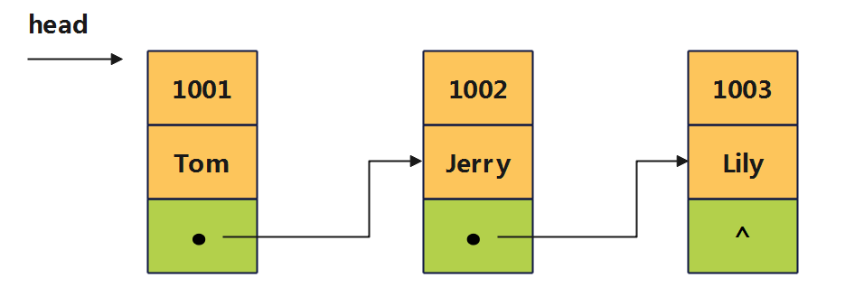

# 第07章_结构体与共用体

讲师：尚硅谷-宋红康（江湖人称：康师傅）

官网：[http://www.atguigu.com](http://www.atguigu.com/)

***

## 本章专题脉络


## 1、结构体(struct)类型的基本使用

### 1.1 为什么需要结构体？

C 语言内置的数据类型，除了几种原始的基本数据类型，只有数组属于复合类型，可以同时包含多个值，但是只能包含`相同类型`的数据，实际使用场景受限。

**举例1：**

现有一个需求，编写学生档案管理系统，这里需要描述一个学生的信息。该学生的信息包括学号、姓名、性别、年龄、家庭住址等，这些数据共同说明一个学生的总体情况。


显然，这些数据类型各不相同，无法使用数组进行统一管理。

**举例2：**

隔壁老王养了两只猫咪。一只名字叫小黄，今年2岁，橘色；另一只叫小黑，今年3岁，黑色。请编写一个程序，当用户输入小猫的名字时，就显示该猫的名字，年龄，颜色。如果用户输入的小猫名错误，则显示老王没有这只猫。


传统的解决方法

`尝试1`：单独定义多个变量存储，实现需求。但是，多个变量，不便于数据的管理。

`尝试2`：使用数组，它是一组具有相同类型的数据的集合。但在编程中，往往还需要一组类型不同的数据，例如猫的名字使用字符串、年龄是int，颜色是字符串，因为数据类型不同，不能用一个数组来存放。

`尝试3`：C语言提供了结构体。使用结构体，内部可以定义多个不同类型的变量作为其成员。

> 考研中见的最多的就是指针和结构体结合起来构造结点（如链表的结点、二叉树的结点等）。

### 1.2 结构体的理解

C 语言提供了 `struct`关键字，允许自定义复合数据类型，将不同类型的值组合在一起，这种类型称为结构体（structure）类型。

C 语言没有其他语言的对象(object)和类(class)的概念，struct 结构很大程度上提供了对象和类的功能。

比如：


### 1.3 声明结构体

构建一个结构体类型的一般格式：

```c
struct 结构体名{ 
    数据类型1 成员名1;   //分号结尾
    数据类型2 成员名2; 
    ……
    数据类型n 成员名n;
}; //注意最后有一个分号
```

举例：学生

```c
struct Student{       // 定义结构体：学生
    int id;           //学号
    char name[20];    //姓名
    char gender;      //性别
    char address[50]; //家庭住址
};  
```

举例：猫

```c
struct Cat{
    char name[20];   //名字
    int age;         //年龄
    char color[20];  //颜色
};
```

举例：人类

```c
struct Person{
    char name[20];    //姓名
    char gender;      //性别
    int age;          //年龄
    double weight;    //体重
}; 
```

举例：通讯录

```c
struct Contacts{            
    char name[50];          //姓名
    int year;               //年
    int month;              //月
    int day;                //日
    char email[100];        //电子邮箱
    char phone_number[15]; //手机号
};
```

举例：员工

```c
struct Employee {  
    int id;               //员工编号 
    char name[20];		  //员工姓名
    char gender;		  //员工性别
    int age;			  //员工年龄
    char address[30];	  //员工住址
};
```

### 1.4 声明结构体变量并调用成员

定义了新的数据类型以后，就可以声明该类型的变量，这与声明其他类型变量的写法是一样的。

**声明结构体变量格式1：** 

```c
struct 结构体类型名称 结构体变量名;
```

> 注意，声明自定义类型的变量时，类型名前面，不要忘记加上 struct 关键字。

举例：

```c
struct Student stu1;
```

**调用结构体变量的成员：**

```c
结构体变量名.成员名 [= 常量或变量值]
```

举例：

```c
#include <stdio.h>
#include <string.h>
int main() {

    struct Student stu1; //声明结构体变量
	
    //调用结构体成员
    stu1.id = 1001;
    //stu1.name = "Tom"; //报错，不能直接通过赋值运算符来给字符数组赋值
    strcpy(stu1.name, "Tony");
    stu1.gender = 'M';
    strcpy(stu1.address, "北京市海淀区五道口");

    printf("id = %d,name = %s,gender = %c,address = %s\n", 
           stu1.id, stu1.name, stu1.gender, stu1.address);

    return 0;
}
```

> 说明：
>
> 1）先声明了一个 struct Student类型的变量 stu1，这时编译器就会为 stu1 分配内存，接着就可以为 stu1 的不同属性赋值。可以看到，struct 结构的属性通过点（ . ）来表示，比如 id 属性要写成 stu1.id。
>
> 2）字符数组是一种特殊的数组，直接改掉字符数组名的地址会报错，因此不能直接通过赋值运算符来对它进行赋值。你可以使用字符串库函数 `strcpy()` 来进行字符串的复制操作。

**声明结构体变量格式2：** 

除了逐一对属性赋值，也可以使用大括号，一次性对 struct 结构的所有属性赋值。此时，初始化的属性个数最好与结构体中成员个数相同，且成员的先后顺序一一对应。格式：

```c
struct 结构体名 结构体变量={初始化数据};
```

举例：

```c
//声明结构体
struct Car {
  char* name;
  double price;
  int speed;
};

//声明结构体变量
struct Car audi = {"audi A6L", 460000.99, 175};
```

> 注意：如果大括号里面的值的数量少于属性的数量，那么缺失的属性自动初始化为 0 。

```c
struct Student {
    int id;
    char name[20];
    char gender;
    int score;  //学生成绩

};

int main() {
    struct Student stu = {1001, "songhk", 'M'};
    printf("Name: %s\n", stu.name);
    printf("Score: %d\n", stu.score);

    return 0;
}
```


**声明结构体变量格式3：** 

方式2中大括号里面的值的顺序，必须与 struct 类型声明时属性的顺序一致。此时，可以为每个值指定属性名。

格式：

```c
struct 结构体名 结构体变量={.成员1=xxx,.成员2=yyy,...};
```

举例：

```c
struct Car audi = {.speed=175, .name="audi A6L"};
```

> 同样，初始化的属性少于声明时的属性，剩下的那些属性都会初始化为 0 。

声明变量以后，可以修改某个属性的值。

```c
struct Car audi = {.speed=175, .name="audi A6L"};
audi.speed = 185;  //将 speed 属性的值改成 185
```


**声明结构体变量格式4：** 声明类型的同时定义变量

struct 的数据类型声明语句与变量的声明语句，可以合并为一个语句。格式：

```c
struct 结构体名 {
    成员列表
} 变量名列表;
```

举例：同时声明了数据类型 Circle 和该类型的变量 c1

```c
struct Circle {
	int id;
    double radius;
} c1;
```

举例：

```c
struct Employee {
    char name[20];
    int age;
    char gender;
    char phone[11];
} emp1, emp2;
```


**声明结构体变量格式5：** 不指定类型名而直接定义结构体类型变量

如果类型标识符（比如Student、Circle、Employee等）只用在声明时这一个地方，后面不再用到，那就可以将类型名省略。 该结构体称为`匿名结构体`。

格式：

```c
struct {
    成员列表;
} 变量名列表;
```

举例：

```c
struct {
    char name[20];
    int age;
    char gender;
    char phone[11];
} emp1, emp2;
```

struct 声明了一个匿名数据类型，然后又声明了这个类型的两个变量emp1、emp2 。与其他变量声明语句一样，可以在声明变量的同时，对变量赋值。

举例：

```c
struct {
    char name[20];
    int age;
    char gender;
    char phone[11];
} emp1 = {"Lucy", 23, 'F', "13012341234"},
  emp2 = {"Tony", 25, 'M', "13367896789"};
```

上例在声明变量 emp1 和 emp2 的同时，为它们赋值。


**声明结构体变量格式6：**使用 typedef 命令

使用 typedef 可以为 struct 结构指定一个别名，这样使用起来更简洁。

举例：

```c
//声明结构体
typedef struct cell_phone {
    int phone_no;              //电话号码
    double minutes_of_charge;  //每分钟费用
} Phone;

//声明结构体变量
Phone p = {13012341234, 5};
```

上例中， Phone 就是 struct cell_phone 的别名。声明结构体变量时，可以省略struct关键字。

这种情况下，C 语言允许省略 struct 命令后面的类型名。进一步改为：

```c
//声明匿名结构体
typedef struct {
    int phone_no;
    double minutes_of_charge;
} Phone;

//声明结构体变量
Phone p = {13012341234, 5};
```

进一步，在考研中，还会出现如下的声明方式：

```c
typedef struct {
    int phone_no;
    double minutes_of_charge;
} Phone,*pPhone;
```

这里多了个*pPhone，其实在定义一个结点指针p时，`Phone *p;` 等价于 `pPhone p; `，前者的写法类似于int *a、char *b等更方便记忆，不必再加个pPhone p来增加记忆负担。所以在考研中我们不采用这种方法，统一删掉 *pPhone的写法。

> 说明：
>
> 1、在创建一个结构体变量后，需要给成员赋值。在没有给成员赋值的情况下调用，打印的值是垃圾数据，可能导致程序异常终止。
>
> 2、不同结构体变量的成员是独立的，互不影响，一个结构体变量的成员更改，不影响另外一个。

### 1.5 举例

**练习：盒子案例**

（1）编程创建一个Box结构体，在其中定义三个成员表示一个立方体的长、宽和高，长宽高可以通过控制台输入。

（2）定义一个函数获取立方体的体积（volume）。

（3）创建一个结构体，打印给定尺寸的立方体的体积。

```c
#include <stdio.h>

// 1. 定义Box结构体
struct Box {
    double length;
    double width;
    double height;
};

// 2. 获取立方体体积的函数
double getVolume(struct Box box) {
    return box.length * box.width * box.height;
}

int main() {

    // 3. 创建结构体实例
    struct Box box;
    printf("输入长度：");
    scanf("%lf", &box.length);

    printf("输入宽度：");
    scanf("%lf", &box.width);

    printf("输入高度：");
    scanf("%lf", &box.height);

    // 调用函数获取体积并打印
    printf("体积为: %.2lf\n", getVolume(box));

    return 0;
}
```


### 1.6 小 结

区分三个概念：结构体、结构体变量、结构体变量的成员。

- 结构体是**自定义的数据类型**，表示的是一种数据类型。

- 结构体变量代表一个具体变量。类比：

  ```c
  int num1 ; // int 是数据类型, 而num1是一个具体的int变量
  
  struct Car car1; // Car 是结构体数据类型，而car1是一个Car变量
  ```

- Car 就像一个“汽车图纸”，生成出来的具体的一辆辆汽车，就类似于一个个的结构体变量。这些结构体变量都含有相同的成员，将结构体变量的成员比作“零件”，同一张图纸生产出来的零件的作用都是一样的。


## 2、进一步认识结构体

### 2.1 结构体嵌套

结构体的成员也是变量，那么成员可以是`基本数据类型`，也可以是`数组`、`指针`、`结构体`等类型 。如果结构体的成员是另一个结构体，这就构成了结构体嵌套。

举例1：

```c
#include <stdio.h>
#include <string.h>

struct Name {
    char firstName[50];
    char lastName[50];
};

struct Student {
    int age;
    struct Name name;
    char gender;
} stu1;

int main(){
    strcpy(stu1.name.firstName, "美美");
    strcpy(stu1.name.lastName, "韩");
    //stu1.age = 18;
    //stu1.gender = 'F';

    //或者
    struct Name myname = {"美美","韩"};
    stu1.name = myname;
    //stu1.age = 18;
    //stu1.gender = 'F';
    return 0;
}
```

举例2：

```c
struct Date {    //声明一个结构体类型 struct Date 
    int year;    //年
    int month;   //月
    int day;     //日
};

struct Employee { //声明一个结构体类型 struct Employee
    int id;
    char name[20];
    int age;
    struct Date birthday; //成员birthday属于struct Date类型
};
```

声明结构体变量并调用成员：

```c
#include <stdio.h>
#include <string.h>

int main(){
    struct Employee emp1;

    emp1.id = 1001;
    strcpy(emp1.name,"Tony");
    emp1.age = 24;

    emp1.birthday.year = 2001;
    emp1.birthday.month = 3;
    emp1.birthday.day = 12;

    return 0;
}
```

说明：如果成员本身又属一个结构体类型，则要用若干个点（ . ），一级一级地找到最低的一级的成员。比如，`emp1.birthday.year`。

赋值的时候还有多种写法：

```c
#include <stdio.h>

int main() {
    //方式1：
    struct Employee emp1 = {1001, "Tony", 24, {1999, 10, 11}};

    //方式2：
    struct Date birthday = {2001, 5, 6};
    struct Employee emp2 = {1002, "Tom", 22, birthday};

    //方式3：
    struct Employee emp3 = {
            .id = 1003,
            .age = 24,
            .name = "Jerry",
            .birthday = {2001, 3, 16}};

    //方式4：
    struct Employee emp4 = {
            .id = 1003,
            .age = 27,
            .name = "Jerry",
            .birthday.year = 1998,
            .birthday.month = 8,
            .birthday.day = 12};

    return 0;
}
```

举例3：自我嵌套

单链表结构的结点定义如下：

```c
struct Node {
    int data;            //这里默认的是int型，如需其他类型可修改
    struct Node* next;   //指向Node型变量的指针
};
//等同于
typedef struct Node {
    int data;
    struct Node *next;
} LNode;
```

二叉树结构的结点定义如下：

```c
typedef struct BTNode {
    int data;              //这里默认的是int型，如需其他类型可修改
    struct BTNode *lchild;        //指向左孩子结点指针,在后续的二叉树章节中讲解
    struct BTNode *rchild;        //指向右孩子结点指针,在后续的二叉树章节中讲解
} BTNode;
```


### 2.2 结构体占用空间

结构体占用的存储空间，不是各个属性存储空间的总和。为了计算效率，C 语言的内存占用空间一般来说，都必须是 int 类型存储空间的整数倍。如果 int 类型的存储是4字节，那么 struct 类型的存储空间就总是4的倍数。

```c
struct A{
    char a;
    int b;
} s;

int main() {
    printf("%d\n", sizeof(s)); // 8
    return 0;
}
```

变量 s 的存储空间不是5个字节，而是占据8个字节。a 属性与 b 属性之间有3个字节的“空洞”。


### 2.3 结构体变量的赋值操作

同类型的结构体变量可以使用赋值运算符（ = ），赋值给另一个变量，比如

```c
student1 = student2; //假设student1和student2已定义为同类型的结构体变量
```

这时会生成一个`全新的副本`。系统会分配一块新的内存空间，大小与原来的变量相同，把每个属性都复制过去，即原样生成了一份数据。

也就是说，结构体变量的传递机制是值传递，而非地址传递。这一点跟数组的赋值不同，使用赋值运算符复制数组，不会复制数据，只是传递地址。

**举例1：**

```c
struct Car {
    double price;
    char name[30];
} a = {.name = "Audi A6L", .price = 390000.99};

int main() {
    struct Car b = a;

    printf("%p\n", &a); //结构体a变量的地址 00007ff75a019020
    printf("%p\n", &b); //结构体b变量的地址 000000a6201ffcd0

    printf("%p\n", a.name);  //结构体a变量的成员name的地址  00007ff719199028
    printf("%p\n", b.name);  //结构体b变量的成员name的地址  000000c2565ffd88

    a.name[0] = 'B';
    printf("%s\n", a.name); // Budi A6L
    printf("%s\n", b.name); // Audi A6L

    return 0;
}
```

上例中，变量 b 是变量 a 的副本，两个变量的值是各自独立的，修改掉 b.name 不影响 a.name 。

**举例2：**将结构体内的字符数组改为字符指针

上个例子有个前提，就是 struct 结构的属性必须定义成字符数组，才可以复制数据。如果属性定义成字符指针，结果就不一样了。

```c
struct Car {
    char *name;
    double price;
} a = {"Audi A6L", 390000.99};

int main() {
    struct Car b = a;

    printf("%p\n", &a); //结构体a变量的地址 00007ff75a019020
    printf("%p\n", &b); //结构体b变量的地址 000000a6201ffcd0

    printf("%p\n", a.name); //结构体a变量的成员name的地址  00007ff7d778a000
    printf("%p\n", b.name); //结构体b变量的成员name的地址  00007ff7d778a000

    return 0;
}
```

上例中， name 属性变成了一个字符指针，这时 a 赋值给 b ，此时的b变量仍然是新开辟的内存空间。但是，a 和 b的 name 成员保存的指针相同，也就是说两个属性共享同一个"Audi A6L"。

在C语言中，相同的字符串常量通常只会保存一份，即这些字符串常量共享相同的内存。当你声明多个指针变量并让它们指向相同的字符串常量时，它们实际上都指向相同的内存地址。字符串常量的共享，有助于减小程序的内存占用。

> 注意：C 语言没有提供比较两个自定义数据结构是否相等的方法，无法用比较运算符（比如 == 和 != ）比较两个数据结构是否相等或不等。


>  【武汉科技大学2019研】已知书籍结构体定义如下，则对结构体变量bk的正确赋值是（　）。
>
>  ```c
>  struct BOOK {
>    struct {
>        int year, month, day;
>    } publish;
>  } bk; 
>  ```
>
>  A．bk.year＝1998；  bk.month＝11；  bk.day＝11；
>  B．publish.year＝1998；  publish.month＝11；  publish.day＝11；
>  C．year＝1998；  month＝11；  day＝11；
>  D．bk.publish.year＝1998；  bk.publish.month＝11；  bk.publish.day＝11；
>
>  【答案】D
>
>  【解析】变量bk是结构体BOOK的一个结构体变量，该变量含有一个成员变量publish，publish也是一个结构体变量，该结构变量含三个成员变量，分别是year、month、day，结构体变量中的成员变量不可直接访问，必须以结构体变量名.成员变量名形式访问，所以只能通过bk.publish.year形式访问到最内层的变量并为其赋值，答案选D。


## 3、结构体数组

### 3.1 对比结构体与数组

```c
//定义一个结构体A
typedef struct{
    int a ;
    char b;
    float c;
} A;
//定义一个结构体变量
A a;

//定义一个数组类型的变量
int b[3];

```

语句int b[3]；定义了一个数组，名字为b，由3个整型分量组成。而语句A a；可以类似认为定义了一个数组，名字为a，只不过组成a数组的3个分量是不同类型的。对于数组b，b[0]、b[1]、b[2]分别代表数组中第1、第2、第3个同为int类型的元素的值。而结构体a中，a. a、a. b、a. c分别对应于结构体变量a 中第1、第2、第3个元素的值，两者十分相似。


如果有3个结构体A类型的元素，如何存储呢？使用结构体数组，即：`A a[3]`

对比：`A a[3]`和`int b[3][3]`：

a数组中的每个元素都是结构型且每个元素都有3个分量，可以把它类比成一个二维数组。例如， `int b[3][3]`。


### 3.2 结构体数组的声明

**结构体数组：数组元素是结构体变量而构成的数组。**先定义结构体类型，然后用结构体类型定义数组变量。

**方式1：**先声明一个结构体类型，再用此类型定义结构体数组

```c
结构体类型 数组名[数组长度];
```

举例：

```c
struct Person{ 
	char name[20];
	int age;
};

struct Person pers[3]; //pers是结构体数组名
```

举例：

```c
struct Student{       // 定义结构体：学生
    int id;           //学号
    char name[20];    //姓名
    char gender;      //性别
    int age;          //年龄
}; 

struct Student stus[10]; //stus是结构体数组名
```

**方式2：**定义结构体类型的同时，定义数组变量。

```c
struct 结构体名{
	成员列表;
} 数组名[数组长度];
```

举例：

```c
struct Person{ 
	char name[20];
	int age;
} pers[3];
```

举例：

```c
struct Date{
	int year;
	int month;
	int day;
}dates1[10],dates2[10];
```

### 3.3 初始化数组元素

**对应前面的声明方式1：**

举例：

```c
struct Student stus[3] = { {1001,"Tom",'M', 14},
                           {1002, "Jerry", 'M', 13},
                           {1003, "Lily",'F',12}};
```


**对应前面的声明方式2：**

举例：

```c
struct Person {
    char name[20];
    int age;
} pers[3] = {{"Tom",   12},
             {"Jerry", 11},
             {"Lily",  10}};
```

或者：

```c
struct Person {
    char name[20];
    int age;
} pers[] = {{"Tom",   12},
             {"Jerry", 11},
             {"Lily",  10}};
```

> 说明：初始化结构体数组元素时，也可以不指定结构体数组的长度。系统在编译时，会自动根据初始化的值决定结构体数组的长度。

### 3.4 结构体数组元素的成员的调用

**方式1：使用数组角标方式**

```c
结构体数组名[下标].成员名
```

如：

```c
stus[1].age = 23;
```

**方式2：使用指向数组或数组元素的指针(下节讲)**

```c
指针->成员名
```

如：

```c
p->age=24;  //p为指向某个数组元素的指针
```


举例1：输入一个班级的学生信息(包含id、name、gender、score)，并把学习成绩超过全班平均成绩的学生找出来，输出这部分学生的姓名和成绩。

```c
#include <stdio.h>

#define N 4
#define MAX_NAME_LENGTH 20

struct Student {
    int id;
    char name[MAX_NAME_LENGTH];
    char gender;
    int score;
};

int main() {
    struct Student stu[N];
    int sum = 0;

    for (int i = 0; i < N; i++) {
        printf("请输入学生信息 (ID, 姓名, 性别, 成绩): \n");
        scanf("%d %19s %c %d", &stu[i].id, stu[i].name, &stu[i].gender, &stu[i].score);
        sum += stu[i].score;
    }

    double avg = (double)sum / N; //计算平均成绩
    printf("平均成绩为: %.2lf\n", avg);

    printf("高于平均分的学生:\n");
    for (int i = 0; i < N; i++) {
        if (stu[i].score > avg) {
            printf("%-20s:%d\n", stu[i].name, stu[i].score);
        }
    }
    return 0;
}
```

测试如下：

```
请输入学生信息 (ID, 姓名, 性别, 成绩):
1 Tom M 89
请输入学生信息 (ID, 姓名, 性别, 成绩):
2 Jerry F 99
请输入学生信息 (ID, 姓名, 性别, 成绩):
3 Lucy F 56
请输入学生信息 (ID, 姓名, 性别, 成绩):
4 Tony M 66
平均成绩为: 77.50
高于平均分的学生:
Tom                 :89
Jerry               :99

Process finished with exit code 0
```

举例2：编写一个统计选票的系统，根据先后输入的候选人姓名，统计各人的得票数。

```c
#include <stdio.h>

#include <string.h>

#define N 3

struct Person { //声明结构体类型struct Person
    char name[20]; //候选人姓名
    int count; //候选人得票数
} leader[N] = {{"zhang3", 0},
               {"li4",    0},
               {"wang5",  0}}; //定义结构体数组并初始化

int main() {
    char leader_name[20]; //定义字符数组
    for (int i = 1; i <= 10; i++) {
        printf("你要投票给谁？(zhang3、li4、wang5)：");
        scanf("%s", leader_name); //输入所选的候选人姓名
        for (int j = 0; j < N; j++) {
            if (strcmp(leader_name, leader[j].name) == 0){
                leader[j].count++;
                break;
            }
        }
    }
    printf("\n统计结果:\n");
    for (int i = 0; i < N; i++)
        printf("%-10s:%d\n", leader[i].name, leader[i].count);

    return 0;
}
```


>  【武汉科技大学2019研】对于以下定义，能打印出字母h的语句是（　）。
>
>  ```c
>  struct person{ 
>  	char title[20];  
>  	int code;
>  };
>  
>  struct person book[5]＝{"Physics",17,"Math",18,"English",20,"History",18};
>  ```
>
>  A．printf（"%c"，book[0].title[1]）；
>  B．printf（"%c"，book[1].title[4]）；
>  C．printf（"%c"，book[2].title[7]）；
>  D．printf（"%c"，book[3].title[6]）；
>
>  【答案】A
>
>  【解析】person是一个自定义结构体类型，该结构体含有两个成员变量，分别是一个字符数组和一个int数据，BC选项打印出来的是'\0'；D选项打印出来的是y，只有A打印出来的是h，答案选A。


## 4、结构体指针

### 4.1 结构体指针格式

结构体指针：**指向结构体变量的指针** （将结构体变量的起始地址存放在指针变量中）

具体应用场景：①可以指向单一的结构体变量  ②可以用作函数的参数 ③可以指向结构体数组

定义结构体指针变量格式：

```c
struct 结构体名 *结构体指针变量名;

//int num;
//int *num;
```

举例：

```c
struct Book {
    char title[50];
    char author[10];
    double price;
};

struct Book *b1;
```

等价于

```c
struct Book {
    char title[50];
    char author[10];
    double price;
} *b1;
```

说明：变量 b1 是一个指针，指向的数据是 struct Book 类型的实例。

### 4.2 结构体传参

如果将 struct 变量传入函数，函数内部得到的是一个原始值的副本。

```c
#include <stdio.h>

struct Person {
    char *name;
    int age;
    char *address;
};

void addAge(struct Person per) {
    per.age = per.age + 1;
}

int main() {
    struct Person p1 = {"Tom", 20, "北京市海淀区"};
    addAge(p1);
    printf("age = %d\n", p1.age); // 输出 20
    return 0;
}
```

函数 addAge() 要求传入一个 struct 变量 per，但实际上传递的是 struct 变量p1的`副本`，改变副本影响不到函数外部的原始数据。

通常情况下，开发者希望传入函数的是同一份数据，函数内部修改数据以后，会反映在函数外部。而且，传入的是同一份数据，也有利于提高程序性能。这时就需要将 struct 变量的指针传入函数，通过指针来修改 struct 属性。如下

```c
struct Person {
    char *name;
    int age;
    char *address;
};

void addAge(struct Person *per) {   //说明1
    (*per).age = (*per).age + 1;    //说明2
}

int main() {
    struct Person p1 = {"Tom", 20, "北京市海淀区"};
    addAge(&p1);                    //说明3
    printf("age = %d\n", p1.age);   // 说明4：输出 21
    return 0;
}
```

- 说明1：per 是 struct 结构的指针，调用函数时传入的是指针。

- 说明2：函数内部必须使用 `(*per).age` 的写法，从指针拿到 struct 结构本身。因为运算符优先级问题，不能写成`*per.age`，会将per.age看成是一个指针，然后取其值。

- 说明3：结构体类型跟数组不一样，类型标识符本身并不是指针，所以传入时，指针必须写成 &p1。

- 说明4： addAge() 内部对 struct 结构的操作，就会反映到函数外部。


**练习1：**

（1）编写一个Dog结构体，包含name(char[10])、age(int)、weight(double)属性

（2）编写一个say函数，返回字符串，方法返回信息中包含所有成员值。

（3）在main方法中，创建Dog结构体变量，调用say函数，将调用结果打印输出。

写法1：

```c
#include <stdio.h>
#include <string.h>

// 定义Dog结构体
struct Dog {
    char name[10];  //或者  char * name;
    int age;
    double weight;
};

// 定义say函数，返回包含所有成员值的字符串
char* say(struct Dog dog) {
    static char info[100]; // 静态数组用于存储结果,此数组生命周期会持续到整个程序运行结束。
    sprintf(info, "Name: %s, Age: %d, Weight: %.2lf", dog.name, dog.age, dog.weight);
    return info;
}

int main() {
    // 创建Dog结构体变量
    struct Dog myDog;
    strcpy(myDog.name, "大黄");
    myDog.age = 3;
    myDog.weight = 12.5;

    // 调用say函数，打印结果
    char* result = say(myDog);
    printf("info = %s\n", result);

    return 0;
}
```

其中，sprintf() 函数是C标准库中的一个函数，它用于将格式化的数据写入一个字符数组(字符串)。

```
int sprintf(char *str, const char *format, ...);
> str：是一个字符数组，用于存储格式化后的字符串。
> format：是格式化字符串，包含了要输出的文本以及格式说明符，就像 printf() 函数中的格式字符串一样。
> ...：是可变参数，用于提供要格式化的数据。
```

顺便看一个问题，如果say()函数如下声明，请问main()中打印dog.name会是多少呢？为什么？

```c
char* say(struct Dog dog) {
    static char info[100]; // 静态数组用于存储结果,此数组生命周期会持续到整个程序运行结束。
    sprintf(info, "Name: %s, Age: %d, Weight: %.2lf", dog.name, dog.age, dog.weight);
    strcpy(dog.name, "小花");
    return info;
}

int main() {
    // 创建Dog结构体变量
    struct Dog myDog;
    strcpy(myDog.name, "大黄");
    myDog.age = 3;
    myDog.weight = 12.5;

    // 调用say函数，打印结果
    char* result = say(myDog);
    printf("info = %s\n", result);
    printf("name = %s", myDog.name);  //大黄
    return 0;
}
```

在C语言中，函数参数是按值传递的，这意味着 say 函数接受的是 dog 结构体的一个副本，而不是原始的 dog 结构体。因此，在 say 函数内部对 dog 结构体的修改不会影响到 main 函数中的原始结构体。

虽然在 say 函数内部将 dog.name 设置为 "小花"，但这只会影响 say 函数内的副本，而不会影响 main 函数中的 dog 结构体。所以，最后打印 dog.name 时输出的是 "大黄"，而不是 "小花"。

写法2：

```c
#include <stdio.h>
#include <string.h>

// 定义Dog结构体
struct Dog {
    char name[10];  //或者  char * name;
    int age;
    double weight;
};

// 定义say函数，返回包含所有成员值的字符串
char *say(struct Dog *dog) {
    static char info[100]; // 静态数组用于存储结果,此数组生命周期会持续到整个程序运行结束。
    sprintf(info, "Name: %s, Age: %d, Weight: %.2lf", (*dog).name, (*dog).age, (*dog).weight);
    return info;
}

int main() {
    // 创建Dog结构体变量
    struct Dog myDog;
    strcpy(myDog.name, "大黄");
    myDog.age = 3;
    myDog.weight = 12.5;

    // 调用say函数，打印结果
    char *result = say(&myDog);
    printf("info = %s\n", result);

    return 0;
}

```

练习2：

```c
struct S {
    int data[100];
    int num;
};
struct S s = {{1, 2, 3, 4}, 100};

//结构体传参
void print1(struct S s) {
    printf("%d\n", s.num);
}

//结构体地址传参
void print2(struct S *ps) {
    printf("%d\n", (*ps).num);
}

int main() {
    print1(s);     //传结构体
    print2(&s);    //传地址
    return 0;
}
```

从性能开销角度考虑，上面的 print1 和 print2 函数哪个好些？

答案：print2函数。函数传参的时候，参数是需要压栈的。如果传递一个结构体对象的时候，结构体过大，参数压栈的的系统开销比较大，所以会导致性能的下降。（考研中定义的结点作为形参时一定要注意考虑此问题）

> 结论：结构体传参的时候，建议传结构体的地址。

**练习3：景区门票**

一个景区根据游客的年龄收取不同价格的门票。

（1）请编写游客结构体（Visitor），包含姓名，年龄，应付票价

（2）编写函数ticket()，根据年龄段决定能够购买的门票价格并输出。

​          规则：年龄>=18，门票为20元，其它情况免费。

（3）可以循环从控制台输入名字和年龄，打印门票收费情况，如果名字输入n，则退出程序。

```c
#include <stdio.h>

#include <string.h>


//定义结构体
struct Visitor {
    char *name;  //姓名
    int age;     //年龄
    double pay;  //应付票价
};

//编写函数处理业务
void ticket(struct Visitor *visitor) {
    //判断
    if ((*visitor).age >= 18) {
        (*visitor).pay = 20;
    } else {
        (*visitor).pay = 0;
    }
}

int main() {
    //创建结构体变量(创建一个游客)
    struct Visitor visitor;
    //循环的输入名字和年龄
    while (1) {
        printf("请输入游客名字(输入n退出程序):");
        scanf("%s", visitor.name);
        //判断如果名字输入 n ,则退出程序
        if (!strcmp("n", visitor.name)) {
            break;
        }
        printf("请输入游客年龄:");
        scanf("%d", &visitor.age);
        //调用函数 ticket，获取应付的票价
        ticket(&visitor);
        printf("该游客应付票价=%.2lf\n", visitor.pay);
    }

    printf("退出程序");

    return 0;
}
```


### 4.3 -> 操作符

前面例子中，`(*per).age` 的写法很麻烦，C 语言就引入了一个新的箭头运算符（ `->` ），可以从结构体指针上直接获取属性，大大增强了代码的可读性。

```c
void addAge(struct Person * per) {
    per->age = per->age + 1;  //使用结构体指针访问指向对象的成员
}
```

另例：

```c
struct Student {
    char name[20];
    int age;
    char gender;
};

int main() {
    //打印结构体信息
    struct Student s = {"张三", 20, 'M'};

    //方式1：.为结构成员访问操作符
    printf("name = %s,age = %d,gender = %c\n", s.name, s.age, s.gender);

    struct Student *ps = &s;
    //方式2：.为结构成员访问操作符
    printf("name = %s,age = %d,gender = %c\n", (*ps).name, (*ps).age, (*ps).gender);

    //方式3：->操作符
    printf("name = %s,age = %d,gender = %c\n", ps->name, ps->age, ps->gender);

    return 0;
}
```

总结：如果指针变量p指向一个结构体变量stu，以下3种用法等价：

```
① stu.成员名    stu.num
② (*p).成员名   (*p).num
③ p->成员名     p->num
```

### 4.4 指向结构体数组的指针

举例：

```c
struct Person {
    int id;
    char name[20];
};

int main() {

    struct Person per;
    struct Person arr[5];

    struct Person *p,*q;

    p = &per;  //指向单个结构体变量
    q = arr;   //指向结构体数组

    return 0;
}
```

举例：

```c
#include <stdio.h>

struct Student {
    int id;
    char name[20];
    char gender;
} stu[3] = {{1001, "Tom",   'M'},
            {1002, "Jerry", 'M'},
            {1003, "Lily",  'F'}};

int main() {

    //方式1：
    for (int i = 0; i < 3; i++) {
        printf("%d%10s%3c\n", stu[i].id, stu[i].name, stu[i].gender);
    }

    //方式2：
    struct Student *p = stu;
    for (int i = 0; i < 3; i++) {
        printf("%d%10s%3c\n", p[i].id, p[i].name, p[i].gender);
    }

    //方式3：
    struct Student *q;
    for (q = stu; q < stu + 3; q++) {
        printf("%d%10s%3c\n", q->id, q->name, q->gender);
    }

    return 0;
}
```


> 【中央财经大学2018研】若有以下说明和语句：
>
> ```c
> struct worker {
>  int no;
>  char *name;
> } work, *p = &work; 
> ```
>
> 则以下引用方式不正确的是（　）。
> A．work.no
> B．(*p).no
> C．p->no
> D．work->no
>
> 【答案】D
>
> 【解析】结构体变量访问成员变量的引用方式采用“.”，而结构体指针采用“->”，因此AC是正确的，B项中*p表示结构体变量，因此可以用“.”，所以答案选择D。


## 5、结构体在数据结构中的应用

### 5.1 声明结点的结构体

链表是一种动态的数据存储结构（非固定长度），链表的基本单位是`结点(node)`，同一链表的所有结点具有相同的数据类型。而结点使用`结构体`类型进行定义。

一个链表结点包括数据域和指针域两部分：数据域存储需要处理的数据、指针域存储下一个结点的位置。


单链表结构的结点定义如下：

```c
struct Node {
    int data;           //这里默认的是int型，如需其他类型可修改
    struct Node *next;  //指向Node型变量的指针
};
```

或者：

```c
typedef struct Node {
    int data;
    struct Node *next;
} LNode;
```

二叉树结构的结点定义如下：

```c
struct BTNode {
    int data;                     //这里默认的是int型，如需其他类型可修改
    struct BTNode *lchild;        //指向左孩子结点指针
    struct BTNode *rchild;        //指向右孩子结点指针
};
```

或者

```c
typedef struct BTNode {
    int data;                     //这里默认的是int型，如需其他类型可修改
    struct BTNode *lchild;        //指向左孩子结点指针
    struct BTNode *rchild;        //指向右孩子结点指针
} BTNode;
```

### 5.2 声明结点变量

这里不需要事先说明链表所包括的结点个数，新数据到达时创建结点变量即可。

以创建二叉树结点为例，方式①：

```c
BTNode bt1;
```

方式②：

```c
BTNode *bt;
bt = (BTNode*) malloc(sizeof (BTNode));//此句要熟练掌握
```

方式①中只用一句就制作了一个结点，而方式②中需要两句，使用了系统已有的函数malloc()申请新结点所需内存空间，比①要烦琐。

②的执行过程为：先定义一个结点的指针bt，然后用函数malloc()来`动态申请`一个结点的内存空间，接着让指针 bt 指向这片内存空间，这样就完成了一个结点变量的创建。后续不需要数据时，删除结点，释放空间（使用`free(bt)`释放）即可。

### 5.3 两种方式对比

对比1：是否可以重新赋值

> ②中的bt是个指针型变量，用来存储刚创建好的结点的地址。因bt是变量，虽然现在bt指向了刚生成的结点，但是在以后必要的时候bt可以离开这个结点转而指向其他结点。而①则不行，①中的bt1就是某个结点的名字，一旦定义好，它就不能脱离这个结点了。
>
> 结论：②比①更灵活，因此②用得多。

对比2：①和②中的BT取分量的操作也是不同的。比如，想取其data 域的值赋给x。

对于①，用结构体变量直接取分量，其操作用`“.”`

```c
int x = bt1.data;
```

对于②，用指向结构体变量的指针来取分量，其操作用`“->”`

```c
int x = bt->data;
//等同于
int x = (*bt).data; //这里的()不要省略
```

> 考研数据结构中所有类型结点的内存分配中使用最多的就是方式② ，即使用函数malloc()来完成，模式固定，务必记忆。

**注意点**

可能会有人认可如下的两种简便写法。虽然这种写法简单，但是在一些纯C编译器中是不通过的，如果你所报考的目标学校严格要求用纯C语言来写程序，则不能这样写结构体定义。

```c
//链表结点：
struct Node {
    int data;
    Node *next;
};

//二叉树结点：
struct BTNode {
    int data;
    BTNode *lchild;
    BTNode *rchild;
};

```


### 5.4 malloc()模板

模板：（当需要制作一个新结点时，只要把结点结构型的名称填入括号中的“类型”处即可）

```c
类型 *p;
p = (类型 *)malloc(sizeof(类型));  //将=右边创建的结点的地址赋给p
```

举例：

```c
typedef struct BTNode {
    int data;
    struct BTNode *lchild;
    struct BTNode *rchild;
}BTNode;

int main() {
    BTNode *newNode;
    newNode = (BTNode *) malloc(sizeof(BTNode));

    return 0;
}
```

此外，还可以一次申请一组结点，可以看做是动态申请数组空间的方法。如下：

```c
int *p;
p = (int *) malloc(n * sizeof(int));
```

这样就申请了一个由指针p所指的( p指向数组中第一个元素的地址)元素为int 型的、长度为n 的动态数组。取元素时和一般的数组(静态数组)一样，如取第二个元素，则可写成p[1]。

### 5.5 举 例

在考研的数据结构中，只需要熟练掌握以上两种结点(链表、二叉树)的定义方法，其他结点都是由这两种衍生而来的。

举例：定义结构体，表示学生结点

```c
struct StudentNode {
    int id;
    char name[20];
    struct StudentNode *next;
};
```

创建多个结点，彼此构成链表

```c
#include <stdio.h>
#include <malloc.h>
#include <string.h>

typedef struct StudentNode {
    int id;
    char name[20];
    struct StudentNode *next;
} StuNode;

int main() {

    StuNode *head;

    // 生成一个三个节点的列表 {1001,"Tom"} -> {1002,"Jerry"} -> {1003,"Lily"}
    head = (StuNode *)malloc(sizeof(StuNode));
    head->id = 1001;
    strcpy(head->name, "Tom");

    StuNode *p = (StuNode *)malloc(sizeof(StuNode));
    p->id = 1002;
    strcpy(p->name, "Jerry");
    head->next = p;

    p = (StuNode *)malloc(sizeof(StuNode));
    p->id = 1003;
    strcpy(p->name, "Lily");
    head->next->next = p;

    //遍历链表
    StuNode *cur;
    for (cur = head; cur != NULL; cur = cur->next) {
        printf("id = %d,name = %s\n", cur->id, cur->name);
    }

    return 0;
}
```

构成如下图的链表：



为了准确定位第一个结点，每个链表要有一个表头指针，从第一个结点开始，沿指针链遍历链表中的所有结点。

## 6、共用体类型(union)

### 6.1 共用体概述

有时需要一种数据结构，不同的场合表示不同的数据类型。比如，如果只用一种数据结构表示学生的“成绩”，这种结构就需要有时是整数（80、90），有时是字符（'A'、'B'），又有时是浮点数（80.5、60.5）。

**C 语言提供了共用体类型(Union 结构)，用来自定义可以灵活变更的数据结构。**它内部可以包含各种属性，但同一时间只能有一个属性，因为所有属性都保存在同一个内存地址，后面写入的属性会覆盖前面的属性。这样做的最大好处是`节省内存空间`。

“共用体”与“结构体”的定义形式相似，但它们的含义是不同的。

- 结构体变量所占内存长度是各成员占的内存长度之和；每个成员分别占有其自己的内存单元。
- 共用体变量所占的内存长度等于最长的成员的长度；几个成员共用一个内存区。

### 6.2 声明共用体

格式：

```c
union 共用体类型名称{
    数据类型 成员名1;
    数据类型 成员名2;
    …
    数据类型 成员名n;
};
```

举例：

```c
union Data {
    short m;
    float x;
    char c;
};
```

上例中， union 命令定义了一个包含三个属性的数据类型 Data。虽然包含三个属性，但是同一时间只能取到一个属性。最后赋值的属性，就是可以取到值的那个属性。

### 6.3 声明共用体变量

方式1：先定义共用体类型，再定义共用体变量

```c
union Data {
    short m;
    float x;
    char c;
};

//声明共用体变量
union Data a, b;
```

方式2：定义共用体类型的同时定义共用体变量

```c
union Data {
    short m;
    float x;
    char c;
} a, b;
```

方式3：直接定义共用体类型变量

```c
union {
    short m;
    float x;
    char c;
} a, b;
```

以共用体变量a为例，它由3个成员组成，分别是m、x和c，编译时，系统会按照最长的成员为它分配内存，由于成员x的长度最长，它占4个字节，所以共用体变量a的内存空间也为4个字节。


```c
union {
    short m;
    float x;
    char c;
} a, b;

int main(){
    printf("%d\n",sizeof(a));  //4
    return 0;
}
```

### 6.4 调用共同体变量的成员

**正确的方式**

方式1：

```c
union Data a;
a.c = 4;
```

方式2：声明共同体变量的同时，给任一成员赋值

```c
union Data a = {.c = 4};
```

方式3：声明共同体变量的同时，给首成员赋值

```c
union Data a = {8};
```

> 注意，方式3不指定成员名，所以只能为第一个成员进行赋值。

**错误的方式**

```c
union Data a = {1,1.5,'a'};  //错误的
```

**后续操作**

执行完上面的代码以后， 另外取其它属性取不到值。

```c
int main() {
    union Data a = {.c = 4};

    printf("c is %i\n", a.c); // c is 4
    printf("x is %f\n", a.x); // 未定义，x is 0.000000
}
```

如果要让 a.x属性可以取到值，就要先为它赋值。

```c
int main() {
    union Data a = {.c = 4};

    printf("c is %i\n", a.c); // c is 4
    printf("x is %f\n", a.x); // 未定义，x is 0.000000

    a.x = 0.5;
    printf("x is %f\n", a.x); // x is 0.500000
    printf("c is %i\n", a.c); // c is 0
}
```

一旦为其他属性赋值，原先可以取到值的 a.c 属性就不再有效了。除了这一点，Union 结构的其他用法与 Struct 结构，基本上是一致的。

### 6.5 ->操作符

Union 结构也支持指针运算符 -> 。

```c
union evaluation { //评价
    int score;
    float grade;
    char level;
};

int main() {
    union evaluation e;
    e.score = 85;

    union evaluation *p;
    p = &e;
    printf("%d\n", p->score); // 85

    return 0;
}
```

上例中， p 是 e 的指针，那么 p->score等同于 e.score。

了解：Union指针与它的属性有关，当前哪个属性能够取到值，它的指针就是对应的数据类型。

```c
union foo {
    int a;
    float b;
} x;

int main() {
    x.a = 12;
    int *p1 = (int *) &x;
    printf("%d\n", x.a);  // 12
    printf("%d\n", *p1); // 12

    x.b = 3.141592;
    float *p2 = (float *) &x;
    printf("%f\n", x.b);  // 3.141592
    printf("%f\n", *p2); // 3.141592

    return 0;
}
```

上例中， &x 是 foo 结构的指针，它的数据类型完全由当前赋值的属性决定。

### 6.6 补充说明

- 不能对共用体变量名赋值，也不能企图引用变量名来得到一个值。只能引用共用体变量中的成员。


- C99允许同类型的共用体变量互相赋值。


```c
a.i //引用共用体变量中的整型变量i
a.ch //引用共用体变量中的字符变量ch
a.f //引用共用体变量中的实型变量f
```

```c
printf("%d",a);   //错误的

printf("%d",a.i); //正确的
```

- C99允许用共用体变量作为函数参数。


```c
b = a; //a和b是同类型的共用体变量，合法
```

- 共用体类型可以出现在结构体类型定义中，也可以定义共用体数组。反之，结构体也可以出现在共用体类型定义中，数组也可以作为共用体的成员。

### 6.7 练习

现有一张关于学生信息和教师信息的表格。

学生信息包括姓名、编号、性别、职业、分数；

教师的信息包括姓名、编号、性别、职业、教学科目。

请看下面的表格，请使用共用体编程完成。

| name     | id    | gender | profession | score/course |
| -------- | ----- | ------ | ---------- | ------------ |
| 孙悟空   | 12345 | 男(m)  | 学生(s)    | 89.5         |
| 菩提祖师 | 1001  | 男(m)  | 老师(t)    | math         |
| 孙尚香   | 54321 | 女(f)  | 学生(s)    | 92.0         |
| 诸葛亮   | 34567 | 男(m)  | 老师(t)    | english      |

```c
#define TOTAL 2 //人员总数

struct Person {
    char name[20];
    int id;
    char gender; //性别  m->男  f->女
    char profession;//职业 s->学生  t->老师
    union {
        float score;
        char course[20];
    } sc; //sc 是一个共用体变量
};

int main() {
    int i;
    struct Person persons[TOTAL];  //定义一个结构体数组

    //输入人员信息
    for (i = 0; i < TOTAL; i++) {
        printf("Input info: ");
        scanf("%s %d %c %c", persons[i].name, &(persons[i].id), &(persons[i].gender), &(persons[i].profession));
        if (persons[i].profession == 's') { //如果是学生
            printf("请输入学生成绩：");
            scanf("%f", &persons[i].sc.score);
        } else { //如果是老师
            printf("请输入老师课程：");
            scanf("%s", persons[i].sc.course);
        }
    }

    //输出人员信息
    printf("\nName\tid\tgender\tProfession\tScore/Course\n");
    for (i = 0; i < TOTAL; i++) {
        if (persons[i].profession == 's') { //如果是学生
            printf("%s\t%d\t%c\t%c\t\t%f\n", persons[i].name,
                   persons[i].id, persons[i].gender, persons[i].profession, persons[i].sc.score);
        } else { //如果是老师
            printf("%s\t%d\t%c\t%c\t\t%s\n", persons[i].name,
                   persons[i].id, persons[i].gender, persons[i].profession, persons[i].sc.course);
        }

    }
    return 0;
}
```


## 7、typedef 的使用(熟悉)

### 7.1 为什么使用typedef

C语言允许为一个数据类型起一个新的别名，就像给人起“绰号”一样。

起别名的目的不是为了提高程序运行效率，而是为了`编码方便`。例如，有一个结构体的名字是 student，定义一个结构体变量stu1，代码如下：

```c
struct student stu1;
```

struct 看起来就是多余的，但不写又会报错。如果为 struct student起了一个别名 Student，书写起来就简单了：

```c
Student stu1;
```

这种写法更加简练，意义也非常明确，不管是在标准头文件中还是以后的编程实践中，都会大量使用这种别名。

### 7.2 使用格式

用typedef声明数组类型、指针类型，结构体类型、共用体类型等，使得编程更加方便。

**1、为某个基本类型起别名**

typedef 命令用来为某个类型起别名

```c
typedef 类型名 别名;
```

> 习惯上，常把用typedef声明的类型名的第1个字母用大写表示，以便与系统提供的标准类型标识符相区别。

举例：

```c
typedef int Integer;  //用Integer作为int类型别名，作用与int相同
Integer a, b;
a = 1;
b = 2;
```

`Integer a, b;`等同于`int a, b;`。

举例：

```c
typedef unsigned char Byte;  //为类型 unsign char 起别名 Byte
Byte c = 'z';
```

注意：使用 typedef 可以为基本类型一次起多个别名。

```c
typedef int chocolate, doughnut, mushroom; //一次性为 int 类型起了三个别名
```

**2、为结构体、共用体起别名**

为 struct、union等命令定义的复杂数据结构创建别名，从而便于引用。

```c
struct treenode {
  // ...
};

typedef struct treenode* Tree;  //Tree 为 struct treenode* 的别名
```

typedef 也可以与 struct 定义数据类型的命令写在一起。

```c
typedef struct animal {
  char* name;
  int legs;
  int speed;
} Animal;
```

上例中，自定义数据类型时，同时使用 typedef 命令，为 struct animal 起了一个别名 Animal 。

这种情况下，C 语言允许省略 struct 命令后面的类型名。

```c
typedef struct {
  char* name;
  int legs;
  int speed;
} Animal;
```

上例相当于为一个匿名的数据类型起了别名 Animal 。进而：

```c
//使用typedef之前
struct animal dog;

//使用typedef之后
Animal dog;
```

再举例：typedef 命令可以为 union 数据类型起别名。

```c
typedef union {
  short count;
  float weight;
  float volume;
} quantity;
```

上例中， union 命令定义了一个包含三个属性的数据类型， typedef 命令为它起别名为quantity 。

**3、为指针起别名**

typedef 可以为指针起别名。

```c
typedef int* intptr;
int a = 10;
intptr x = &a;
```

上例中， intptr 是 int* 的别名。不过，使用的时候要小心，这样不容易看出来，变量 x 是一个指针类型。

再举例：

```c
typedef char* String;

char * str1 = "hello"; //之前的写法
String str2 = "hello"; //现在的写法
```

为字符指针起别名为 String，以后使用 String声明变量时，就可以轻易辨别该变量是字符串。

**4、为数组类型起别名**

typedef 也可以用来为数组类型起别名。

```c
//举例1
typedef int five_ints[5];
five_ints x = {11, 22, 33, 44, 55};  

//举例2
typedef int Num[100]; //声明Num为整型数组类型名
Num a; //定义a为整型数组名，它有100个元素
```

上例中， five_ints 是一个数组类型。我们把原有的`int [5]`看做是数组的类型。

举例：指针数组

```c
typedef int (*PTR_TO_ARR)[4];
```

表示 PTR_TO_ARR 是类型`int * [4]`的别名，它是一个二维数组指针类型。接着可以使用 PTR_TO_ARR 定义二维数组指针：

```c
PTR_TO_ARR p1, p2;
```

**5、为函数起别名**

typedef 为函数起别名的写法如下

```c
typedef signed char (*fp)(void);
```

类型别名 fp 是一个指针，代表函数 signed char (*)(void) 。

再举例：

```c
typedef int (*PTR_TO_FUNC)(int, int);
PTR_TO_FUNC pfunc;
```

### 7.3 举 例

```c
#include <stdio.h>

int add(int a, int b) {
    int sum = a + b;
    return sum;
}

char str[3][30] = {"尚硅谷教育", "www.atguigu.com", "010-56253825"};


typedef int(*PTR_FUNC)(int,int);

typedef char (*PTR_ARR)[30];

int main() {

    //使用函数指针
    int (*add_ptr)(int,int);
    add_ptr = &add;
    int sum = (*add_ptr)(10,20);
    printf("sum = %d\n",sum);

    //使用数组指针
    char (*arr_ptr)[30]; //arr_ptr是一个指针，指向30个元素构成的char型数组
    arr_ptr = str; //将str[0]的首地址赋给ptr_arr指针
    for(int i = 0;i < 3;i++){
        printf("str[%d]=%s\n",i,*(arr_ptr + i));
    }

    //使用typedef之后：
    //调用函数
    PTR_FUNC ptr_add = &add;
    int sum1 = (*ptr_add)(10,20);
    printf("sum1 = %d\n",sum1);

    //调用数组
    PTR_ARR ptr_arr = str;
    for(int i = 0;i < 3;i++){
        printf("str[%d]=%s\n",i,*(ptr_arr + i));
    }

    return 0;
}
```

### 7.4 小 结

(1) typedef的方法实际上是为特定的类型指定了一个同义字(synonyms)。

(2) 用typedef只是对已经存在的类型指定一个新的类型名，而没有创造新的类型。

(3) typedef与#define是不同的。#define是在`预编译时处理`的，它只能作简单的字符串替换，而typedef是在`编译阶段处理`的，且并非简单的字符串替换。

(4) 当不同源文件中用到同一类型数据（尤其是像数组、指针、结构体、共用体等类型数据）时，常用typedef 声明这些同一的数据类型。

技巧：可以把所有的typedef名称声明单独`放在一个头文件`中，然后在需要用到它们的文件中用#include指令把它们包含到文件中。这样编程者就不需要在各文件中自己定义typedef名称了。

(5) 使用typedef名称有利于`程序的通用与移植`。有时程序会依赖于硬件特性，用typedef类型就便于移植。

某一个值在不同计算机上的类型，可能是不一样的。

```c
int i = 100000;
```

上面代码在32位整数的计算机没有问题，但是在16位整数的计算机就会出错。C 语言的解决办法，就是提供了类型别名，在不同计算机上会解释成不同类型，比如 int32_t 。

```c
int32_t i = 100000;
```

上例将变量 i 声明成 int32_t 类型，保证它在不同计算机上都是32位宽度，移植代码时就不会出错。

这一类的类型别名都是用 typedef 定义的。下面是类似的例子。

```c
typedef long int ptrdiff_t;
typedef unsigned long int size_t;
typedef int wchar_t;
```

这些整数类型别名都放在头文件 stdint.h ，不同架构的计算机只需修改这个头文件即可，而无需修改代码。

### 7.5 应用场景

**场景1：**

在考研中， typedef主要用在结构体的定义过程中，如二叉树结点的结构体定义，其他地方几乎不用。新定义的结构体若没有名字，则用typedef 给它起个名字是有必要的。

**场景2：**

对于已有的数据类型，如int、float等已经有了简洁的名字，还有必要给它起个新名字吗？有必要，但不是在考研数据结构中。举个例子：

在一个大工程中，对于其中的一个变量，在整个工程中都已经用int 型定义过了，但是工程如果要求修改，将所有int 型换成long型，如果事先给int型起个新名字为ElemType，则在整个工程中凡是类似于int x;的语句都写成ElemType x; ，此时只需将typedef int ElemType这一句中的int 换成long 即可实现全局的数据类型替换，这就是typedef 的意义所在。（上述这些对考研答卷的实际意义并不大。）

```c
typedef int ElemType;
ElemType i1, i2, i3;
```

上例中，变量 i1 、 i2 、 i3 的类型都是 int。如果以后需要为它们改类型，只需要修改typedef 语句即可。

```c
typedef long ElemType;
```

上面命令将变量 i1 、 i2 、 i3 的类型都改为 long。

