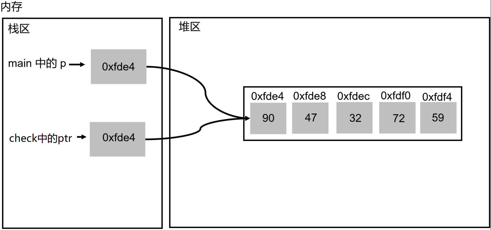

# 第08章_C语言常用函数

讲师：尚硅谷-宋红康（江湖人称：康师傅）

官网：[http://www.atguigu.com](http://www.atguigu.com/)

***

## 本章专题脉络


## 1、字符串相关函数

### 1.1 字符串的表示方式

C 语言没有单独的字符串类型，字符串被当作字符数组，即 char 类型的数组。表示方式如下：

**方式1：**

```c
char str[] = "hello";
```

**方式2：**

```c
char *str = "hello";
```

### 1.2 两种方式的区别

字符指针和字符数组，这两种声明字符串变量的写法基本是等价的，但是也有区别。

**区别1：**指针指向的字符串，在 C 语言内部被当作常量，不能修改字符串本身。

```c
char* str = "hello!";
str[0] = 'z'; // 报错
```

如果使用数组声明字符串变量，就没有这个问题，可以修改数组的任意成员。

```c
char str[] = "hello";
str[0] = 'z'; // 不报错
```

为什么字符串声明为指针时不能修改，声明为数组时就可以修改？

因为系统会将字符串的字面量保存在内存的常量区，这个区域是不允许用户修改的。声明为指针时，指针变量存储的值是一个指向常量区的内存地址，因此用户不能通过这个地址去修改常量区。但是，声明为数组时，编译器会给数组单独分配一段内存，字符串字面量会被编译器解释成字符数组，逐个字符写入这段新分配的内存之中，而这段新内存是允许修改的。

测试代码：

```c
int main() {

    char str1[] = "hello"; //新开辟的空间，保存数组中的数据
    char str2[] = "hello"; //新开辟的空间，保存数组中的数据
    printf("%p\n",str1); //000000f4a93ff81a
    printf("%p\n",str2); //000000f4a93ff814

    char * str3 = "hello"; 
    char * str4 = "hello"; //与前一个str3的数据是共享的，存在于常量区
    printf("%p\n",str3); //00007ff6842ca004
    printf("%p\n",str4); //00007ff6842ca004
    
    return 0;
}
```

**区别2：**指针变量可以指向其它字符串。

```c
char* s = "hello";
s = "world";
```

但是，字符数组变量不能指向另一个字符串。

```c
char s[] = "hello";
s = "world"; // 报错
```

字符数组的数组名，总是指向初始化时的字符串地址，不能修改。所以，声明字符数组后，不能直接用字符串赋值。

```c
char s[10];
s = "abc"; // 错误
```

为什么数组变量不能赋值为另一个数组？

因为数组变量所在的地址无法改变，或者说，编译器一旦为数组变量分配地址后，这个地址就绑定这个数组变量了，这种绑定关系是不变的，即不能用赋值运算符为它重新赋值。

想要重新赋值，必须使用 C 语言原生提供的 strcpy() 函数，通过字符串拷贝完成赋值。这样做以后，数组变量的地址还是不变的，即 strcpy() 只是在原地址写入新的字符串，而不是让数组变量指向新的地址。

```c
char s[10];
strcpy(s, "abc");
```


> 【武汉科技大学2019研】下面各语句中，能正确进行字符串操作的语句是（　　）。
> A．char a[10]＝{'A'，'B'，'C'，'D'，'\0'}；
> B．char a[10]；  a＝"ABCDE"；
> C．char *p；  *p＝"ABCDE"；
> D．char *s； scanf（"%s"， s）；
>
> 【答案】A
>
> 【解析】B项中，字符数组的数组名指向数组的首元素地址，初始化后不可再被更改；CD两项中的字符指针在定义时均没有进行初始化，对其赋值是非法的，答案选A。


>  【北京航空航天大学2018研】对于以下C程序，其正确的是（　　）。
>
>  ```c
>  #include<stdio.h>
>  int main(){  
>    char str1[]="Hello";  
>    char str2[]="Hello";  
>    if(str1==str2)    
>      printf("Equal\n");  
>    else    
>      printf("Unequal\n");  
>    return 0;
>  } 
>  ```
>
>  A．Unequal
>  B．Equal
>  C．该程序无法通过编译
>  D．该程序运行时出错
>
>  【答案】A
>
>  【解析】首先该程序符合语法规则，因此不会编译时产生错误，其次字符数组str1和str2都为指针常量，将他们直接用关系运算符进行比较肯定是不相等的，但是它们所指的字符串是相等的，因此最后输出Unequal。


### 1.2 字符串常用函数

这里的字符串处理函数，都属于**库函数**。库函数并非C语言本身的组成部分，而是C语言编译系统为方便用户使用而提供的公共函数。不同的编译系统提供的函数数量和函数名、函数功能都不尽相同，使用时要小心，必要时查一下**库函数手册**。

在使用字符串处理函数时，应当在程序文件的开头用`#include <string.h>`把 string.h 文件包含到本文件中。

#### strlen()

作用：返回字符串的字节长度，不包括末尾的空字符 '\0' 。

函数原型：

```c
// string.h
//参数是字符串变量，返回的是 size_t 类型的无符号整数,一般当做int类型处理。
size_t strlen(const char* s);
```

举例：

```c
#include <stdio.h>
#include <string.h>    //需要加载此头文件

int main() {
    char str[10] = "China";
    printf("%d\n", strlen(str));     //5

    printf("%d\n", strlen("China")); //5
    
    //区别于sizeof(),是两个不同的概念
    printf("%d\n", sizeof(str));        //10
}
```

#### strcpy()

**strcpy(字符数组1, 字符数组2)** ：字符串的复制，不能使用赋值运算符，直接将字符数组2的字符串复制到字符数组1中。

函数原型：

```c
// string.h
strcpy(char dest[], const char source[])
```

使用此函数前，如何复制字符串呢？

一方面，下面两种字符串的复制写法，都是错的。因为数组的变量名是一个固定的地址，不能修改，使其指向另一个地址。

```c
char str1[10];
char str2[10];
str1 = "abc"; // 报错
str2 = str1;  // 报错
```

另一方面，如果是字符指针，赋值运算符（ = ）只是将一个指针的地址复制给另一个指针，而不是复制字符串。

```c
char* str1;
char* str2;

str1 = "abc";
str2 = str1;
```

此时，可以使用 strcpy(字符数组1,字符数组2) 函数，用于将一个字符串的内容复制到另一个字符串（**前提**：字符数组1的长度不小于字符数组2的长度，否则会溢出）。

举例：

```c
#include <stdio.h>
#include <string.h>

int main() {
    char str1[10], str2[] = "China";
    strcpy(str1, str2);
    
    printf("%s\n",str1);

    //或
//    strcpy(str1, "China"); //参数2，也可以是一个字符串常量
//    printf("%s\n",str1);
    
    //进一步
    str1[0] = 'A';
    printf("%s\n",str1); //Ahina
    printf("%s\n",str2); //China
}
```

思考：如下程序的输出结果

```c
int main() {

    char str1[10] = "abcde1234", str2[] = "China";
    strcpy(str1, str2);

    printf("%s\n",str1); //

    for(int i = 0;i < 10;i++){
        printf("%c",str1[i]); //
    }
    printf("\n");

    return 0;
}
```

```
China
China 2345
```

复制时将字符串2和其后的′\0′一起复制到字符数组1中，取代字符数组1中前面的字符，未被取代的字符保持原有内容。

#### strncpy()

作用：将字符串2中前面n个字符复制到字符数组1中去。

```c
strncpy(str1, str2, n);
```

将str2中最前面n个字符复制到str1中，取代str1中原有的最前面n个字符。但复制的字符个数n不应多于str1中原有的字符（不包括′\0′）。

```c
int main() {

    char s1[40] = "1234567890";
    char s2[12] = "helloworld";
    strncpy(s1, s2, 5);
//    s1[5] = '\0';  //测试这行代码添加的必要性
    printf("%s\n", s1); // 

    return 0;
}
```

#### strcat()

**strcat(字符数组1, 字符数组2)**：把两个字符数组中的字符串连接起来，把字符串2接到字符串1的后面，结果放在字符数组1中，函数调用后得到一个函数值——字符数组1的地址。

函数原型：

```c
char* strcat(char* s1, const char* s2);
```

说明：

1、字符数组1必须足够大，以便容纳连接后的新字符串。

2、连接前两个字符串的后面都有′\0′，连接时将字符串1后面的′\0′取消，只在新串最后保留′\0′。

```c
#include <stdio.h>
#include <string.h>

int main() {
    char str1[30] = {"People′s Republic of "};
    char str2[] = {"China"};
    printf("%s\n", strcat(str1, str2)); //People′s Republic of China
    printf("%s\n", str1);  //People′s Republic of China

}
```

#### strncat()

作用：将字符串2中前面n个字符连接到字符数组1中去。

```c
strncat(str1, str2, n);
```

strncat() 总是会在拼接结果的结尾，自动添加空字符′\0′ ，所以第三个参数的最大值，应该是 str1 的变量长度减去 str1 的字符串长度，再减去 1 。

```c
#include <stdio.h>
#include <string.h>

int main() {

    char s1[10] = "Hello";
    char s2[8] = "World";
    strncat(s1, s2, 3);
    printf("%s\n", s1);  //HelloWor
    return 0;
}
```

#### strcmp()

函数原型：

```c
int strcmp(const char* s1, const char* s2);
```

**strcmp(字符串1, 字符串2)**：比较字符串1和字符串2。

字符串比较的规则是：将两个字符串自左至右逐个字符相比(按ASCII码值大小比较)，直到出现不同的字符或遇到′\0′为止。

(1) 如全部字符相同，则认为两个字符串相等。返回值为0

(2) 若出现不相同的字符，如果返回值为正数，则字符串1大；反之，返回值为负数，则字符串2大。

```c
#include <stdio.h>
#include <string.h>

int main() {
    char *str1 = "abxy";
    char *str2 = "abmn";
    printf("%d\n",strcmp(str1, str2));  // 1

    int compare1 = strcmp("China", "Korea");
    printf("%d\n",compare1);  // -1

    return 0;
}
```

#### strlwr()/strupr()

**strlwr(字符串)**：将字符串中大写字母换成小写字母。

**strupr(字符串)**：将字符串中小写字母换成大写字母。

```c
#include <stdio.h>
#include <string.h>

int main() {

    char str[] = "HelloWorld";
    strlwr(str);
    puts(str); //helloworld

    strupr(str);
    puts(str); //HELLOWORLD
}
```

### 1.3 基本数据类型和字符串的转换

在程序开发中，我们经常需要将基本数据类型转成字符串类型(即 char数组 )。或者将字符串类型转成基本数据类型。

#### 基本数据类型 -> 字符串

sprintf()函数可以将其他数据类型转换成字符串类型。此函数声明在`stdio.h`头文件中。

sprintf()和平时我们常用的printf()函数的功能相似，只是sprintf()函数输出到字符串中，而printf()函数输出到屏幕上。

```c
#include <stdio.h>

int main() {
    char str1[20]; //字符数组，即字符串
    char str2[20];
    char str3[20];
    int a = 111, b = 222;
    char c = 'a';
    double d = 333.444;


    sprintf(str1, "%d %d", a, b);
    sprintf(str2, "%d%c", a, c);
    sprintf(str3, "%.5f", d);
    printf("str1=%s\n", str1); //111 222
    printf("str2=%s\n", str2); //111a
    printf("str3=%s\n", str3); //333.44400
    
    return 0;
}
```

#### 字符串 -> 基本数据类型

调用头文件` <stdlib.h>` 的函数`atoi()` 或 `atof()` 即可。

```c
#include <stdio.h>
#include <stdlib.h>

int main() {
    char str1[10] = "123456";
    char str2[4] = "111";
    char str3[10] = "12.67423";
    char str4[2] = "a";

    int i = atoi(str1);
    int j = atof(str1);
    short s = atoi(str2);
    double d = atof(str3);
    char c = str4[0];
    printf("i=%d,j=%d,s=%d,d=%lf,c=%c", i, j, s, d, c);

    return 0;
}
```


## 2、日期和时间相关函数

在编程中，程序员会经常使用到日期相关的函数，比如：统计某段代码执行花费的时间等等。头文件是 `<time.h>`。

举例说明：

- 返回一个值，即格林尼治时间1970年1月1日00:00:00到当前时刻的时长，时长单位是秒。

```c
time_t time(time_t *t)
```

- 获取当前时间，返回一个表示当地时间的字符串(当地时间是基于参数timer的)。

```c
char *ctime(const time_t *timer)
```

- 计算time1和time2之间相差的秒数（time1-time2）

```c
double difftime(time_t time1, time_t time2)
```

举例：

```c
#include <stdio.h>
#include <time.h> //该头文件中，声明日期和时间相关的函数

//  运行test函数，看看执行花费时间
void test() {
    int i = 0;
    int sum = 0;
    int j = 0;
    for (i = 0; i < 10000000; i++) {
        sum = 0;
        for (j = 0; j < 100; j++) {
            sum += j;
        }
    }
}

int main() {
    printf("程序启动...\n");

    time_t start_t;
    //先得到执行test前的时间
    time(&start_t); //获取当前时间

    test(); //执行test

    time_t end_t;
    //再得到执行test后的时间
    time(&end_t); //获取当前时间

    double diff_t; //存放时间差
    diff_t = difftime(end_t, start_t); //时间差，按秒 ent_t - start_t


    //然后得到两个时间差就是耗用的时间
    printf("%d\n",start_t); //1697026306
    printf("%d\n",end_t); //1697026308
    printf("执行test()函数 耗用了%.2f 秒\n", diff_t); //执行test()函数 耗用了2.00 秒

    //获取时间对应的字符串的表示
    char * startTimeStr = ctime(&start_t);
    printf("%s\n",startTimeStr); //Wed Oct 11 20:11:48 2023

    return 0;
}
```


## 3、数学运算相关的函数

`math.h`头文件定义了各种数学函数。在这个库中所有可用的功能都带有一个 double 类型的参数，且都返回 double 类型的结果。

- double exp(double x) ：返回 e 的 x 次幂的值。
- double log(double x) ：返回 x 的自然对数（基数为 e 的对数）
- double pow(double x, double y) ：返回 x 的 y 次幂。
- double sqrt(double x) ：返回 x 的平方根。
- double fabs(double x) ：返回 x 的绝对值。

```c
#include <stdio.h>
#include <math.h>

int main() {
    double d1 = pow(2.0, 3.0);
    double d2 = sqrt(5.0);

    printf("d1=%.2f\n", d1); //d1=8.00
    printf("d2=%f\n", d2);   //d2=2.236068

    return 0;
}
```


## 4、内存管理相关函数

### 4.1 C程序的内存分配

**C程序中，不同数据在内存中分配说明：**

1) 全局变量和静态局部变量——内存中的静态存储区/全局区

2) 非静态的局部变量——内存中的动态存储区：stack 栈

3) 临时使用的数据——建立动态内存分配区域，需要时随时开辟，不需要时及时释放——heap 堆

4) 根据需要`向系统申请`所需大小的空间，由于未在声明部分定义其为变量或者数组，不能通过变量名或者数组名来引用这些数据，只能通过**指针**来引用）


### 4.2 void 指针(无类型指针)

- 每一块内存都有地址，通过指针变量可以获取指定地址的内存块。

- 指针变量必须有类型，否则编译器无法知道如何解读内存块保存的二进制数据。但是，向系统请求内存的时候，有时不确定会有什么样的数据写入内存，需要先获得内存块，稍后再确定写入的数据类型。

综上，为了满足这种需求，C 语言提供了一种不定类型的指针，叫做 void 指针。它只有内存块的`地址信息`，`没有类型信息`，等到使用该块内存的时候，再向编译器补充说明，里面的数据类型是什么。

此外，由于void 指针等同于无类型指针(typeless pointer)，可以`指向任意类型`的数据，但是`不能解读数据`。void 指针与其他所有类型指针之间是`互相转换关系`，任一类型的指针都可以转为 void 指针，而 void 指针也可以转为任一类型的指针。

```c
int x = 10;
void *p = &x; // 整数指针转为 void 指针
int *q = p; // void 指针转为整数指针
```

```c
char a = 'X';
void* p = &a;
printf("%c\n", *p); // 报错
```

由于不知道 void 指针指向什么类型的值，所以不能用 * 运算符取出它指向的值。

> void 指针的重要之处在于，很多内存相关函数的返回值就是 void 指针。

### 4.3 内存动态分配函数

头文件` <stdlib.h>`声明了四个关于内存动态分配的函数。**所谓动态分配内存，就是按需分配，申请才能获得。**

#### 掌握：malloc()

函数原型：

```c
void *malloc(unsigned int size);  //size的类型为无符号整型
```

作用：在内存的`动态存储区(堆区)`中分配一个`长度为size`的`连续空间`。并将该空间的首地址作为函数值返回，即此函数是一个指针函数。

由于返回的指针的基类型为 void，应通过显式类型转换后才能存入其他基类型的指针变量，否则会有警告。如果分配不成功，返回空指针（NULL）。

举例1： 

```c
int *p;
p=(int *)malloc(sizeof(int));
```

举例2：动态申请数组空间

```c
int *p;
p = (int *)malloc(n * sizeof(int));
for (int i = 0; i < n; i++)
  p[i] = i * 5;
```

得到一个元素类型为int型，长度为n的数组。取元素方式与之前相同，如获取第2个元素：p[1]。

举例3：

```c
struct node *p;
p = (struct node *) malloc(sizeof(struct node));  //(struct node*)为强制类型转换
```

```c
typedef struct BTNode{
	int data;
	struct BTNode *lchild;
	struct BTNode *rchild;
}BTNode;

//声明二叉树结点方式1
BTNode bt1;
//声明二叉树结点方式2：需熟练掌握
BTNode *bt2;
bt2 = (BTNode*)malloc(sizeof(BTNode));
```

> 考研数据结构中所有类型结点的内存分配都可以用函数malloc()来完成，模式固定，容易记忆。

方式2中的BT是指针型变量，还可以指向其它节点。而方式1中的BT则不行。此外，调用结构体成员时，

```c
//针对于方式1：结构体变量取成员，用"."
int x = bt1.data;

//针对于方式2：指向结构体的指针取成员，用"->"
int x = bt2->data;
int x = (*bt2).data;//以前的写法
```

**关于返回值为NULL：**

malloc() 分配内存有可能分配失败，这时返回常量 NULL。Null 的值为0，是一个无法读写的内存地址，可以理解成一个不指向任何地方的指针。它在包括 `stdlib.h` 等多个头文件里面都有定义，所以只要可以使用 malloc() ，就可以使用 NULL 。由于存在分配失败的可能，所以最好在使用 malloc() 之后检查一下，是否分配成功。

```c
int* p = malloc(sizeof(int));
if (p == NULL) { // 内存分配失败
  
}
// 或
if (p != NULL) {
  //...
}
```

上面示例中，通过判断返回的指针 p 是否为 NULL ，确定 malloc() 是否分配成功。

#### 了解：calloc()

函数原型：

```c
void *calloc(unsigned int n,unsigned int size);
```

作用：在内存的**动态存储区(堆区)**中分配n个，单位长度为size的连续空间，这个空间一般比较大，总共占用n*size 个字节。并将该空间的首地址作为函数的返回值。如果函数没有成功执行，返回NULL。

calloc()函数适合为`一维数组`开辟动态存储空间，n为数组元素个数，每个元素长度为size。

举例：

```c
int *p;
p = (int *)calloc(10,sizeof(int)); //开辟空间的同时，其内容初始化为零

//等同于
int* p;
p = (int *)malloc(10 * sizeof(int));
memset(p, 0, sizeof(int) * 10);
```

上面示例中， calloc() 相当于 malloc() + memset() 。

#### 了解：realloc()

函数原型： 

```c
void *realloc(void* p, unsigned int size)
```

作用：重新分配malloc()或calloc()函数获得的动态空间大小，即调整大小的内存空间。将先前开辟的内存块的指针p指向的动态空间大小改变为size，单位字节。返回值是一个全新的地址（数据也会自动复制过去），也可能返回跟原来一样的地址。分配失败返回NULL。

- realloc() 优先在原有内存块上进行缩减，尽量不移动数据，所以通常是返回原先的地址。
- 如果新内存块小于原来的大小，则丢弃超出的部分；如果大于原来的大小，则不对新增的部分进行初始化（程序员可以自动调用 memset() ）。

举例1：

```c
int* b;
b = (int *)malloc(sizeof(int) * 10);
b = (int *)realloc(b, sizeof(int) * 2000);
```

指针 b 原来指向10个成员的整数数组，使用 realloc() 调整为2000个成员的数组。


举例2：动态栈入栈时，判断是否需要扩容

```c
int push(SqStack &S, ElemType e) {
    if (S.top - S.bottom >= S.stacksize) {               //栈满，追加存储空间
        S.bottom = (ElemType *) realloc(S.bottom,(STACKINCREMENT + S.stacksize) * sizeof(ElemType));
        if (!S.bottom) //if(S.bottom == NULL)
            return FALSE;       //空间分配失败
        S.top = S.bottom + S.stacksize;
        S.stacksize += STACKINCREMENT;
    }
    *S.top = e;
    S.top++;     // 栈顶指针加1
    return TRUE;
}
```


#### 掌握：free()

函数原型：

```c
void free(void *p);
```

函数无返回值。p是最近一次调用malloc()或calloc()函数时的返回值。

作用：释放指针变量p所指向的内存空间，使这部分内存能重新被其它变量使用。否则这个内存块会一直占用到程序运行结束。

举例：

```c
int *p;
p=(int *)malloc(sizeof(int));
    
//...各种操作...
    
free(p); //千万不要忘了使用free()释放内存！
```

> 注意：
>
> 1、指针 p 必须是经过动态分配函数 malloc 成功后返回的首地址。
>
> 2、分配的内存块一旦释放，就不应该再次操作已经释放的地址，也不应该再次使用 free() 对该地址释放第二次。
>
> 3、如果忘记调用free()函数，同时p所在的函数调用结束后p指针已经消失了，导致无法访问未回收的内存块，构成内存泄漏。

### 4.4 举例

举例：动态创建数组，输入5个学生的成绩，另外一个函数检测成绩低于60 分的，输出不合格的成绩。

```c
#include <stdio.h>
#include <stdlib.h>

#define N 5

void check(int *ptr) {
    printf("\n不及格的成绩有: ");
    for (int i = 0; i < 5; i++) {
        if (ptr[i] < 60) {
            printf(" %d ", ptr[i]);
        }
    }
}

int main() {
    int *p;
    //动态创建数组
    p = (int *) malloc(N * sizeof(int));

    printf("请输入%d个成绩：\n",N);
    for (int i = 0; i < N; i++) {
        scanf("%d", p + i);
    }
    //检查不及格的学生
    check(p);
    
    free(p); //销毁 堆区 p 指向的空间

    return 0;
}
```

图示：




### 4.5 动态分配内存的基本原则

1）**避免分配大量的小内存块。**分配堆上的内存有一些系统开销，所以分配许多小的内存块比分配几个大内存块的系统开销大

2）**仅在需要时分配内存。**只要使用完堆上的内存块，就需要及时释放它，否则可能出现内存泄漏。

这里需要遵守原则：谁分配，谁释放。

3）**总是确保释放以分配的内存。**在编写分配内存的代码时，就要确定在代码的什么地方释放内存。

### 4.6 常见的内存错误及其对策

**1）内存分配未成功，却使用了它**

新手常犯这种错误，因为他们没有意识到内存分配会不成功。

常用解决办法是，在使用内存之前检查指针是否为NULL。比如，如果指针p是函数的参数，那么在函数的入口处应该用`if(p==NULL)`或`if(p!=NULL)`进行防错处理。

**2）内存分配虽然成功，但是尚未初始化就引用它**

犯这种错误主要有两个起因：一是没有初始化的观念；二是误以为内存的缺省初值全为零，导致引用初值错误。

```c
int * p = NULL;
p = (int*)malloc(sizeof(int));
if (p == NULL){/*...*/}
/*初始化为0*/
memset(p, 0, sizeof(int));
```

题外话，无论用何种方式创建数组，都别忘了赋初值，即便是赋零值也不可省略，不要嫌麻烦。

**3）内存分配成功并且已经初始化，但操作时提示内存越界**

在使用数组时经常发生下标“+1”或者“-1”的操作，特别是在for循环语句中，循环次数很容易搞错，导致数组操作越界。

数组访问越界在运行时，它的表现是不定的，有时什么事也没有，程序一直运行（当然，某些错误结果已造成）；有时，则是程序一下子崩溃。

**4）忘记了释放内存，造成内存泄漏**

含有这种错误的函数每被调用一次就丢失一块内存。刚开始时系统的内存充足，你看不到错误。终有一次程序突然死掉，系统出现提示：内存耗尽。

动态内存的申请与释放必须配对，程序中`malloc()`与`free()`的使用次数一定要相同，否则肯定有错误。

**5）未正确的释放内存，造成内存泄漏**

程序中的对象调用关系过于复杂，实在难以搞清楚某个对象究竟是否已经释放了内存。此时应该重新设计数据结构，从根本上解决对象管理的混乱局面。

```c
#include <stdio.h>
#include <stdlib.h>

void getMemory(int *p) {
    p = (int *) malloc(sizeof(int));  // 在这里修改的是局部指针 p，不会影响 main 函数中的原始指针 ptr
    //....
}

int main() {
    int *ptr = NULL;
    getMemory(ptr);  // 将 ptr 的值传递给 getMemory，但是在函数内部修改的是 p，而不是 ptr
    printf("ptr = %d\n", *ptr);  // 这里的 *ptr 是未定义行为，因为 ptr 没有指向有效的内存
    free(ptr);  // 这里试图释放未分配的内存，会导致问题
}
```

在本例中，getMemory()中的p申请了新的内存，只是把 p所指的内存地址改变了，但是ptr丝毫未变。getMemory()中的p也始终没有进行内存的释放。事实上，因为没有用free释放内存，每执行一次getMemory()就会泄漏一块内存。

**6）释放了内存却继续使用它**

函数的return语句写错了，注意不要返回指向“栈内存”的“指针”或者“引用”，因为该内存在函数体结束时被自动销毁。

```c
long *p;

void addr() {
    long k;
    k = 0;
    p = &k;
}
void port() {
    long i, j;
    j = 0;
    for (i = 0; i < 10; i++) {
        (*p)--;
        j++;
    }
}


int main() {
    addr();
    port();
}


```

由于addr函数中的变量k在函数返回后就已经不存在了，但是在全局变量p中却保存了它的地址。在下一个函数port中，试图通过全局指针p访问一个不存在的变量，进而出错。


**在计算机系统，特别是嵌入式系统中，内存资源是非常有限的。尤其对于`移动端开发者`来说，硬件资源的限制使得其在程序设计中首要考虑的问题就是如何`有效地管理内存资源`。**

