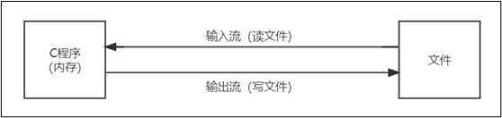

# 第09章_文件操作

讲师：尚硅谷-宋红康（江湖人称：康师傅）

官网：[http://www.atguigu.com](http://www.atguigu.com/)

***

## 本章专题脉络


## 1、文件和流的介绍

文件，对我们并不陌生，文件是数据源（保存数据的地方）的一种，比如大家经常使用的word文档，txt文件，excel文件，avi文件...都是文件。文件最主要的作用就是`保存数据`，它既可以保存一张图片，也可以保持视频，声音...

C程序中，对于文件中数据的输入/输出操作以“`流(stream)`” 的方式进行，可以看做是一种数据的流动。


**输入流**：数据从数据源(比如:文件)到程序(或内存)的流动过程。

**输出流**：数据从程序(或内存)到数据源(比如:文件)的流动过程。




## 2、C 输入 & 输出

- 当我们提到输入时，这意味着要向程序(或内存)中写入一些数据。输入的数据来源可以是从`键盘`中、从`文件`中或从`网络`中。C 语言提供了一系列`内置的函数`来读取给定的输入，并根据需要写入到程序中。


- 当我们提到输出时，这意味着要在`屏幕`上、`打印机`上或`任意文件中`显示(或保存)一些数据。同样，C 语言提供了一系列`内置的函数`来输出数据到指定的载体上。


### 2.1 标准文件I/O

C 语言把所有的设备都当作文件。所以设备（比如显示器）被处理的方式与文件相同。以下三个文件会在程序执行时自动打开，以便访问键盘和屏幕。

| **标准文件** | **文件指针** | **设备** |
| ------------ | ------------ | -------- |
| **标准输入** | stdin        | 键盘     |
| **标准输出** | stdout       | 屏幕     |
| **标准错误** | stderr       | 屏幕     |

文件指针是访问文件的方式，我们会讲解如何从屏幕读取值以及如何把结果输出到屏幕上。

### 2.2 scanf()和printf()函数

C 语言中的 I/O （输入/输出）通常使用`printf()` 和`scanf()` 两个函数。

- `int scanf(const char *format, ...)` 函数从标准输入流 stdin 读取输入，并根据提供的 format 来浏览输入。
- `int printf(const char *format, ...)` 函数把输出写入到标准输出流 stdout ，并根据提供的格式产生输出。

其中，format 可以是一个简单的常量字符串，但是您可以分别指定 %s、%d、%c、%f 等来输出或读取字符串、整数、字符或浮点数。如需了解完整的细节，可以查看这些函数的参考手册。

举例1：将内容输出到屏幕

```c
#include <stdio.h>	// 执行printf() 函数需要该库

int main(){
    printf("hello"); //显示引号中的内容
    return 0;
}

```

举例2：

```c
#include <stdio.h>

int main( ) {

  char str[100];
  int i;

  printf( "Enter a value :");
  scanf("%s %d", str, &i);

  printf( "\nYou entered: %s %d ", str, i);
  printf("\n");
  
  return 0;
}

```


### 2.3 getchar()和putchar() 函数

- `int getchar(void)` 函数从屏幕读取下一个可用的字符，并把它返回为一个整数。这个函数在同一个时间内只会读取一个单一的字符。您可以在循环内使用这个方法，以便从屏幕上读取多个字符。


- `int putchar(int c)`函数把字符输出到屏幕上，并返回相同的字符。这个函数在同一个时间内只会输出一个单一的字符。您可以在循环内使用这个方法，以便在屏幕上输出多个字符。


举例：程序会读取一个单一的字符

```c
#include <stdio.h> 

int main( ){
    int c;
    printf( "Enter a value :"); 
    c = getchar();
    
    printf( "\nYou entered: ");
    putchar(c);
    printf("\n");

    return 0;
}

```

### 2.4 gets()和puts() 函数

- `char *gets(char *s)` 函数从stdin读取一行到 s 所指向的缓冲区，直到一个终止符或EOF。


- `int puts(const char *s)` 函数把字符串s 和一个尾随的换行符写入到stdout。


举例：程序读取一整行直到该行结束。

```c
#include <stdio.h>

int main( ){
    char str[100];
    
    printf( "Enter a value :"); 
    gets(str);
    
    printf( "\nYou entered: "); 
	puts( str );

    return 0;
}
```


## 3、C 文件的读写

一个文件，无论它是文本文件还是二进制文件，都是代表了一系列的字节。C 语言不仅提供了访问顶层的函数，也提供了底层调用来处理存储设备上的文件。

### 3.1 创建/打开文件

使用 fopen( ) 函数来创建一个新的文件或者打开一个已有的文件，这个调用会初始化类型 FILE 的一个对象，类型 FILE 包含了所有用来控制流的必要的信息。

函数原型：

```c
FILE *fopen( const char * filename e, const char * mode );
```

说明：在这里，filename是字符串，用来命名文件；访问模式mode的值可以是下列值中的一个。

第1波：

| 模 式  | 描 述                                                        |
| ------ | ------------------------------------------------------------ |
| **r**  | `只读`。打开一个已有的文本文件，只允许读取。                 |
| **w**  | `只写`。打开一个文本文件，只允许写入文件。如果文件不存在，则会创建一个新文件，<br/>并从文件的开头写入内容。如果文件存在，则截断文件为零长度，从开始写入！ |
| **a**  | `追加`。打开一个文本文件，用于写入。如果文件不存在，则创建一个新文件。<br/>如果文件已存在，则将写入的数据追加到文件末尾。 |
| **rb** | `只读（二进制）`。打开一个二进制文件，只允许读取。           |
| **wb** | `只写（二进制）`。打开一个二进制文件，只允许写入。如果文件不存在，则创建一个<br/>新文件。如果文件已存在，则截断文件为零长度，从开始写入！ |
| **ab** | `追加（二进制）`。打开一个二进制文件，用于写入。如果文件不存在，则创建一个<br/>新文件。如果文件已存在，则将写入的数据追加到文件末尾。 |

第2波：


| 模 式   | 描 述                                                        |
| ------- | ------------------------------------------------------------ |
| **r+**  | `读写`。打开一个文本文件，允许读取和写入。                   |
| **w+**  | `读写`。打开一个文本文件，允许读取和写入。如果文件不存在，则创建一个新文件。<br/>如果文件已存在，则截断文件为零长度，从开始写入！ |
| **a+**  | `读写`。打开一个文本文件，允许读取和写入。如果文件不存在，则创建一个新文件。<br/>如果文件已存在，则将写入的数据追加到文件末尾。 |
| **r+b** | 或 **"rb+"**：`读写（二进制）`。打开一个二进制文件，允许读取和写入。 |
| **w+b** | 或 **"wb+"**：`读写（二进制）`。打开一个二进制文件，允许读取和写入。如果文件<br/>不存在，则创建一个新文件。如果文件已存在，则截断文件为零长度。 |
| **a+b** | 或 **"ab+"**：`读写（二进制）`。打开一个二进制文件，允许读取和写入。如果文件<br/>不存在，则创建一个新文件。如果文件已存在，则将写入的数据追加到文件末尾。 |

技巧：这些访问模式字符串可以根据需要进行组合使用。例如，"r+" 表示读写，"r+b" 表示读写(二进制)。

注意：如果处理的是二进制文件（图片，视频..），则需使用下面的访问模式： "rb", "wb", "ab", "rb+", "r+b", "wb+", "w+b", "ab+", "a+b" 。

### 3.2 关闭文件

使用完文件后（读，写），一定要将该文件关闭。

关闭文件，使用fclose( ) 函数。

函数原型：

```c
int fclose( FILE *fp );
```

- 如果成功关闭文件，fclose( ) 函数返回零。此时，会`清空缓冲区中的数据`，关闭文件，并释放用于该文件的所有内存。
- 如果关闭文件时发生错误，函数返回 EOF。EOF 是一个定义在头文件 `stdio.h` 中的常量。

### 3.3 写入文件

C 标准库提供了各种函数来按字符或者以固定长度字符串的形式读/写文件。

**1）fputc 函数**

函数原型：

```c
int fputc( int c, FILE *fp );
```

说明：

函数 fputc() 把参数c 的`字符值`写入到fp 所指向的输出流中。如果写入成功， 它会返回写入的字符，如果发生错误，则会返回 EOF。

**2）fputs 函数**

函数原型：

```c
int fputs( const char *s, FILE *fp );
```

说明：

函数fputs() 把`字符串 s` 写入到 fp 所指向的输出流中。如果写入成功，它会返回一个非负值，如果发生错误，则会返回 EOF。

**3）fprintf 函数**

函数原型：

```c
int fprintf(FILE *fp,cons t char *format, ...);
```

功能与fputs()类似，将一个`字符串`写入到文件中。

举例：

```c
#include <stdio.h>

int main() {

    //创建一个文件指针
    FILE *fp = NULL;

    //打开该文件
    fp = fopen("d:/hello.txt", "w+"); //w+模式是:如果文件已存在，则截断文件为零长度。
    //fp = fopen("d:/hello.txt", "a+"); //a+模式是:如果文件已存在，则将写入的数据追加到文件末尾。

    //将内容写入到文件中
    fputs("你好，北京！！\n", fp);
    fprintf(fp, "你好，世界！！\n");

    //关闭文件！如果不关闭 ，我们的内容没有保存到文件中!
    fclose(fp);

    printf("创建，写入信息完成");

    return 0;
}
```

### 3.4 读取文件

**1）fgetc 函数**

函数原型：

```c
int fgetc( FILE * fp );
```

说明：

fgetc() 函数从fp 所指向的输入文件中`读取一个字符`。返回值是读取的字符， 如果发生错误则返回 EOF。

**2）fscanf 函数**

函数原型：

```c
int fscanf(FILE *fp, const char *format, ...)
```

说明：

使用 fscanf() 函数从文件中读取格式化的数据，比如`整数、浮点数等各种类型的数据`。`format` 参数指定了数据的格式，后面的参数是用于存储读取数据的变量。

如果使用 fscanf() 函数从文件中`读取字符串`，会在遇到第一个空白字符（空格、制表符、换行符等）时，停止读取，之后的内容会被忽略。

 如果函数成功读取了一些数据并按照指定格式存储到相应的变量中，它会返回成功读取的参数个数。或者在读取失败或文件结束时返回 EOF。

**3）fgets 函数**

函数原型：

```c
char *fgets( char *buf, int n, FILE *fp );
```

说明：

此函数按行读取数据，它从文件中`读取一行数据`（包括换行符 '\n'），并将这一行的内容存储到指定的缓冲区中。参数中 buf 是用于存储读取的文本的缓冲区，n 是缓冲区的大小，fp 是文件指针。

 如果成功读取，返回参数 buf，即读取到的字符串的首地址。如果到达文件末尾或者读取失败，返回NULL。

举例：

```c
#include <stdio.h>

int main() {

    //创建一个文件指针
    FILE *fp = NULL;
    //定义一个缓冲区
    char buff[1024];

    //打开文件
    fp = fopen("d:/hell.txt", "r");
    //方法1
    //fscanf(fp, "%s", buff);
    ////输出
    //printf("%s\n", buff);

    //方法2 读取整个文件
    //说明，循环读取fp指向的文件内容，如果读到NULL,就结束

    while (fgets(buff, 1024, fp) != NULL) {
        printf("%s", buff);
    }

    //关闭文件
    fclose(fp);

    return 0;
}
```

