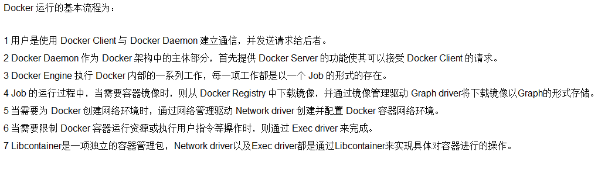

## Docker简介

### 是什么

解决了运行环境和配置问题的软件容器，方便做持续集成并有助于整体发布的容器虚拟化技术。

### docker的理念

**Docker是基于Go语言实现的云开源项目**。

Docker的主要目标是“Build，Ship and Run Any App,Anywhere”，也就是通过对应用组件的封装、分发、部署、运行等生命周期的管理，使用户的APP（可以是一个WEB应用或数据库应用等等）及其运行环境能够做到“一次镜像，处处运行”。

Linux容器技术的出现就解决了这样一个问题，而 Docker 就是在它的基础上发展过来的。将应用打成镜像，通过镜像成为运行在Docker容器上面的实例，而 Docker容器在任何操作系统上都是一致的，这就实现了跨平台、跨服务器。只需要一次配置好环境，换到别的机子上就可以一键部署好，大大简化了操作。

###  容器与虚拟机比较

#### 传统虚拟机技术

虚拟机（virtual machine）就是带环境安装的一种解决方案。

它可以在一种操作系统里面运行另一种操作系统，比如在Windows10系统里面运行Linux系统CentOS7。应用程序对此毫无感知，因为虚拟机看上去跟真实系统一模一样，而对于底层系统来说，虚拟机就是一个普通文件，不需要了就删掉，对其他部分毫无影响。这类虚拟机完美的运行了另一套系统，能够使应用程序，操作系统和硬件三者之间的逻辑不变。

* 启动慢  资源占用多  冗余步骤多

#### 容器虚拟化技术

由于前面虚拟机存在某些缺点，Linux发展出了另一种虚拟化技术：

Linux容器(Linux Containers，缩写为 LXC)

Linux容器是与系统其他部分隔离开的一系列进程，从另一个镜像运行，并由该镜像提供支持进程所需的全部文件。容器提供的镜像包含了应用的所有依赖项，因而在从开发到测试再到生产的整个过程中，它都具有可移植性和一致性。

Linux 容器不是模拟一个完整的操作系统而是对进程进行隔离。有了容器，就可以将软件运行所需的所有资源打包到一个隔离的容器中。容器与虚拟机不同，不需要捆绑一整套操作系统，只需要软件工作所需的库资源和设置。系统因此而变得高效轻量并保证部署在任何环境中的软件都能始终如一地运行。

#### 对比

比较了 Docker 和传统虚拟化方式的不同之处：

* 传统虚拟机技术是虚拟出一套硬件后，在其上运行一个完整操作系统，在该系统上再运行所需应用进程；

* 容器内的应用进程直接运行于宿主的内核，容器内没有自己的内核且也没有进行硬件虚拟。因此容器要比传统虚拟机更为轻便。
*  每个容器之间互相隔离，每个容器有自己的文件系统 ，容器之间进程不会相互影响，能区分计算资源。

### 能干嘛

#### 开发/运维（DevOps）新一代开发工程师

#####  一次构建、随处运行

* **更快速的应用交付和部署**

  * 传统的应用开发完成后，需要提供一堆安装程序和配置说明文档，安装部署后需根据配置文档进行繁杂的配置才能正常运行。Docker化之后只需要交付少量容器镜像文件，在正式生产环境加载镜像并运行即可，应用安装配置在镜像里已经内置好，大大节省部署配置和测试验证时间。

* **更便捷的升级和扩缩容**

  * 随着微服务架构和Docker的发展，大量的应用会通过微服务方式架构，应用的开发构建将变成搭乐高积木一样，每个Docker容器将变成一块“积木”，应用的升级将变得非常容易。当现有的容器不足以支撑业务处理时，可通过镜像运行新的容器进行快速扩容，使应用系统的扩容从原先的天级变成分钟级甚至秒级。

* **更简单的系统运维**

  * 应用容器化运行后，生产环境运行的应用可与开发、测试环境的应用高度一致，容器会将应用程序相关的环境和状态完全封装起来，不会因为底层基础架构和操作系统的不一致性给应用带来影响，产生新的BUG。当出现程序异常时，也可以通过测试环境的相同容器进行快速定位和修复。

* **更高效的计算资源利用**

  * Docker是内核级虚拟化，其不像传统的虚拟化技术一样需要额外的Hypervisor支持，所以在一台物理机上可以运行很多个容器实例，可大大提升物理服务器的CPU和内存的利用率。

##### Docker应用场景


## Docker安装

### 前提条件

目前，CentOS 仅发行版本中的内核支持 Docker。Docker 运行在CentOS 7 (64-bit)上，

要求系统为64位、Linux系统内核版本为 3.8以上，这里选用Centos7.x

查看自己的内核

uname命令用于打印当前系统相关信息（内核版本号、硬件架构、主机名称和操作系统类型等）。


## Docker的基本组成

### 镜像(image)

* Docker 镜像（Image）就是一个只读的模板。镜像可以用来创建 Docker 容器，一个镜像可以创建很多容器。

  它也相当于是一个root文件系统。比如官方镜像 centos:7 就包含了完整的一套 centos:7 最小系统的 root 文件系统。

  相当于容器的“源代码”，**docker镜像文件类似于Java的类模板，而docker容器实例类似于java中new出来的实例对象。**

### 容器(container)

1. 从面向对象角度

   Docker 利用容器（Container）独立运行的一个或一组应用，应用程序或服务运行在容器里面，容器就类似于一个虚拟化的运行环境，容器是用镜像创建的运行实例。就像是Java中的类和实例对象一样，镜像是静态的定义，容器是镜像运行时的实体。容器为镜像提供了一个标准的和隔离的运行环境，它可以被启动、开始、停止、删除。每个容器都是相互隔离的、保证安全的平台

2.  从镜像容器角度

   可以把容器看做是一个简易版的 Linux 环境（包括root用户权限、进程空间、用户空间和网络空间等）和运行在其中的应用程序。

### 仓库（Repository）

仓库（Repository）是集中存放镜像文件的场所。

类似于

Maven仓库，存放各种jar包的地方；

github仓库，存放各种git项目的地方；

Docker公司提供的官方registry被称为Docker Hub，存放各种镜像模板的地方。

仓库分为公开仓库（Public）和私有仓库（Private）两种形式。

最大的公开仓库是 Docker Hub(https://hub.docker.com/)，

存放了数量庞大的镜像供用户下载。国内的公开仓库包括阿里云 、网易云等

## Docker平台架构图解(入门版)


## Docker工作原理

* Docker是一个Client-Server结构的系统，Docker守护进程运行在主机上， 然后通过Socket连接从客户端访问，守护进程从客户端接受命令并管理运行在主机上的容器。 容器，是一个运行时环境，就是我们前面说到的集装箱。可以对比mysql演示对比讲解


## Docker平台架构图解(架构版)

#### 整体架构及底层通信原理简述

Docker 是一个 C/S 模式的架构，后端是一个松耦合架构，众多模块各司其职




## centos7 docker安装步骤

#### 确定你是 CentOS7 及以上版本

```sh
cat /etc/redhat-release
```

#### 卸载旧版本docker


####  执行命令

```sh
yum install -y yum-utils
```

####  设置stable镜像仓库

```sh
yum-config-manager --add-repo http://mirrors.aliyun.com/docker-ce/linux/centos/docker-ce.repo
```

#### 更新yum软件包索引

```sh
yum makecache fast
```

####  安装DOCKER CE

```sh
yum -y install docker-ce docker-ce-cli containerd.io
```

####  启动docker

```sh
systemctl start docker
```

####  测试docker

```sh
docker version

docker run hello-world
```

#### 卸载docker

```sh
systemctl stop docker 

yum remove docker-ce docker-ce-cli containerd.io

rm -rf /var/lib/docker

rm -rf /var/lib/containerd
```

#### 底层原理

**为什么Docker会比VM虚拟机快**

**docker有着比虚拟机更少的抽象层**

由于docker不需要Hypervisor(虚拟机)实现硬件资源虚拟化,运行在docker容器上的程序直接使用的都是实际物理机的硬件资源。因此在CPU、内存利用率上docker将会在效率上有明显优势。

**docker利用的是宿主机的内核,而不需要加载操作系统OS内核**

当新建一个容器时,docker不需要和虚拟机一样重新加载一个操作系统内核。进而避免引寻、加载操作系统内核返回等比较费时费资源的过程,当新建一个虚拟机时,虚拟机软件需要加载OS,返回新建过程是分钟级别的。而docker由于直接利用宿主机的操作系统,则省略了返回过程,因此新建一个docker容器只需要几秒钟。


## Docker常用命令

#### 帮助启动类命令

```sh
启动docker： systemctl start docker
停止docker： systemctl stop docker
重启docker： systemctl restart docker
查看docker状态： systemctl status docker
开机启动： systemctl enable docker
查看docker概要信息： docker info
查看docker总体帮助文档： docker --help
查看docker命令帮助文档： docker 具体命令 --help
```

#### 镜像命令

```sh
#列出本地主机上的镜像
docker images

REPOSITORY：表示镜像的仓库源
TAG：镜像的标签版本号
IMAGE ID：镜像ID
CREATED：镜像创建时间
SIZE：镜像大小

OPTIONS说明：
	-a :列出本地所有的镜像（含历史映像层）
	-q :只显示镜像ID

# docker search 某个XXX镜像名字
docker search [OPTIONS] 镜像名字
OPTIONS说明：
	--limit : 只列出N个镜像，默认25个
docker search --limit 5 redis

#下载镜像
docker pull 镜像名字[:TAG]

docker system df #查看镜像/容器/数据卷所占的空间

# 删除镜像
docker rmi  -f 镜像ID # 删除单个
docker rmi -f 镜像名1:TAG 镜像名2:TAG  # 删除多个
docker rmi -f $(docker images -qa) # 删除全部
```

#### 面试题：谈谈docker虚悬镜像是什么？

仓库名、标签都是`<none>`的镜像，俗称虚悬镜像dangling image

#### 容器命令

**有镜像才能创建容器，这是根本前提(下载一个CentOS或者ubuntu镜像演示)**

`docker pull centos`、  `docker pull ubuntu`

##### 新建+启动容器

```sh
docker run [OPTIONS] IMAGE [COMMAND] [ARG...]

OPTIONS说明 : 
	OPTIONS说明（常用）：有些是一个减号，有些是两个减号
 
--name="容器新名字"       为容器指定一个名称；
-d: 后台运行容器并返回容器ID，也即启动守护式容器(后台运行)；
 
-i：以交互模式运行容器，通常与 -t 同时使用；
-t：为容器重新分配一个伪输入终端，通常与 -i 同时使用；
也即启动交互式容器(前台有伪终端，等待交互)；
 
-P: 随机端口映射，大写P
-p: 指定端口映射，小写p
```


```sh
#使用镜像centos:latest以交互模式启动一个容器,在容器内执行/bin/bash命令。
docker run -it centos /bin/bash 

参数说明：
-i: 交互式操作。
-t: 终端。
centos : centos 镜像。
/bin/bash：放在镜像名后的是命令，这里我们希望有个交互式 Shell，因此用的是 /bin/bash。
要退出终端，直接输入 exit:
```

##### 退出容器

```sh
两种退出方式:
exit # run进去容器，exit退出，容器停止

ctrl+p+q  # run进去容器，ctrl+p+q退出，容器不停止
```

##### 启动已停止运行的容器

```sh
docker start 容器ID或者容器名
```

##### 重启容器

```sh
docker restart 容器ID或者容器名
```

##### 停止容器

```sh
docker stop 容器ID或者容器名
```

##### 强制停止容器

```sh
docker kill 容器ID或容器名
```

##### 删除已停止的容器

```sh
docker rm 容器ID

# 一次性删除多个容器实例
docker rm -f $(docker ps -a -q)
或
docker ps -a -q | xargs docker rm
```

##### 重要

```sh
# 有镜像才能创建容器，这是根本前提(下载一个Redis6.0.8镜像演示)
启动守护式容器(后台服务器)
在大部分的场景下，我们希望 docker 的服务是在后台运行的，
我们可以过 -d 指定容器的后台运行模式。
#使用镜像centos:latest以后台模式启动一个容器
docker run -d centos
 
问题：然后docker ps -a 进行查看, 会发现容器已经退出
很重要的要说明的一点: Docker容器后台运行,就必须有一个前台进程.
容器运行的命令如果不是那些一直挂起的命令（比如运行top，tail），就是会自动退出的。
 
这个是docker的机制问题,比如你的web容器,我们以nginx为例，正常情况下,
我们配置启动服务只需要启动响应的service即可。例如service nginx start
但是,这样做,nginx为后台进程模式运行,就导致docker前台没有运行的应用,
这样的容器后台启动后,会立即自杀因为他觉得他没事可做了.
所以，最佳的解决方案是,将你要运行的程序以前台进程的形式运行，
常见就是命令行模式，表示我还有交互操作，别中断.


前台交互式启动
docker run -it redis:6.0.8

后台守护式启动
docker run -d redis:6.0.8


问题：为什么 docker run -d redis:6.0.8 后台启动，容器不退出，docker run -d centos 容器退出?


---------------------------------------------------------

查看容器日志
docker logs 容器ID

查看容器内运行的进程 
docker top 容器ID

查看容器内部细节
docker inspect 容器ID
```

###### 进入正在运行的容器并以命令行交互

```sh
docker exec -it 容器ID bashShell


重新进入docker attach 容器ID

上述两个区别:
attach 直接进入容器启动命令的终端，不会启动新的进程
用exit退出，会导致容器的停止。

exec 是在容器中打开新的终端，并且可以启动新的进程
用exit退出，不会导致容器的停止。


推荐使用 docker exec 命令，因为退出容器终端，不会导致容器的停止。

进入redis服务
docker exec -it 容器ID /bin/bash
docker exec -it 容器ID redis-cli

一般用-d后台启动的程序，再用exec进入对应容器实例
```

###### 从容器内拷贝文件到主机上

```sh
容器→主机

docker cp  容器ID:容器内路径 目的主机路径
```

###### 导入和导出容器

```sh
export 导出容器的内容留作为一个tar归档文件[对应import命令]

import 从tar包中的内容创建一个新的文件系统再导入为镜像[对应export]

docker export 容器ID > 文件名.tar

cat 文件名.tar | docker import - 镜像用户/镜像名:镜像版本号
```

##### 常用命令

```sh
attach    Attach to a running container                 # 当前 shell 下 attach 连接指定运行镜像
build     Build an image from a Dockerfile              # 通过 Dockerfile 定制镜像
commit    Create a new image from a container changes   # 提交当前容器为新的镜像
cp        Copy files/folders from the containers filesystem to the host path   #从容器中拷贝指定文件或者目录到宿主机中
create    Create a new container                        # 创建一个新的容器，同 run，但不启动容器
diff      Inspect changes on a container's filesystem   # 查看 docker 容器变化
events    Get real time events from the server          # 从 docker 服务获取容器实时事件
exec      Run a command in an existing container        # 在已存在的容器上运行命令
export    Stream the contents of a container as a tar archive   # 导出容器的内容流作为一个 tar 归档文件[对应 import ]
history   Show the history of an image                  # 展示一个镜像形成历史
images    List images                                   # 列出系统当前镜像
```


## Docker镜像

#### 镜像

是一种轻量级、可执行的独立软件包，它包含运行某个软件所需的所有内容，我们把应用程序和配置依赖打包好形成一个可交付的运行环境(包括代码、运行时需要的库、环境变量和配置文件等)，这个打包好的运行环境就是image镜像文件。

只有通过这个镜像文件才能生成Docker容器实例(类似Java中new出来一个对象)。

分层的镜像

以我们的pull为例，在下载的过程中我们可以看到docker的镜像好像是在一层一层的在下载

#### UnionFS（联合文件系统）

UnionFS（联合文件系统）：Union文件系统（UnionFS）是一种分层、轻量级并且高性能的文件系统，它支持对文件系统的修改作为一次提交来一层层的叠加，同时可以将不同目录挂载到同一个虚拟文件系统下(unite several directories into a single virtual filesystem)。Union 文件系统是 Docker 镜像的基础。镜像可以通过分层来进行继承，基于基础镜像（没有父镜像），可以制作各种具体的应用镜像。

特性：一次同时加载多个文件系统，但从外面看起来，只能看到一个文件系统，联合加载会把各层文件系统叠加起来，这样最终的文件系统会包含所有底层的文件和目录

#### Docker镜像加载原理

```
docker的镜像实际上由一层一层的文件系统组成，这种层级的文件系统UnionFS。

	bootfs(boot file system)主要包含bootloader和kernel, bootloader主要是引导加载kernel, Linux刚启动时会加载bootfs文件系统，在Docker镜像的最底层是引导文件系统bootfs。这一层与我们典型的Linux/Unix系统是一样的，包含boot加载器和内核。当boot加载完成之后整个内核就都在内存中了，此时内存的使用权已由bootfs转交给内核，此时系统也会卸载bootfs。
```

```
rootfs (root file system) ，在bootfs之上。包含的就是典型 Linux 系统中的 /dev, /proc, /bin, /etc 等标准目录和文件。rootfs就是各种不同的操作系统发行版，比如Ubuntu，Centos等等。 
```

```
平时我们安装进虚拟机的CentOS都是好几个G，为什么docker这里才200M？？
	对于一个精简的OS，rootfs可以很小，只需要包括最基本的命令、工具和程序库就可以了，因为底层直接用Host的kernel，自己只需要提供 rootfs 就行了。由此可见对于不同的linux发行版, bootfs基本是一致的, rootfs会有差别, 因此不同的发行版可以公用bootfs。
```


#### 为什么 Docker 镜像要采用这种分层结构呢

```
镜像分层最大的一个好处就是共享资源，方便复制迁移，就是为了复用。
 
比如说有多个镜像都从相同的 base 镜像构建而来，那么 Docker Host 只需在磁盘上保存一份 base 镜像；
同时内存中也只需加载一份 base 镜像，就可以为所有容器服务了。而且镜像的每一层都可以被共享。
```

#### 重点理解

```
Docker镜像层都是只读的，容器层是可写的
当容器启动时，一个新的可写层被加载到镜像的顶部。
这一层通常被称作“容器层”，“容器层”之下的都叫“镜像层”。
```

#### Docker镜像commit操作案例

```
docker commit提交容器副本使之成为一个新的镜像

docker commit -m="提交的描述信息" -a="作者" 容器ID 要创建的目标镜像名:[标签名]
```

##### 案例演示ubuntu安装vim

```sh
从Hub上下载ubuntu镜像到本地并成功运行
docker run -it ubuntu /bin/bash

原始的默认Ubuntu镜像是不带着vim命令的

外网连通的情况下，安装vim

docker容器内执行上述两条命令：
apt-get update
apt-get -y install vim

安装完成后，commit我们自己的新镜像

docker commit -m="描述" -a="作者" 容器ID  新镜像名字
```

## 本地镜像发布到阿里云

#### 本地镜像发布到阿里云流程


#### 阿里云开发者平台

```http
https://promotion.aliyun.com/ntms/act/kubernetes.html
```


#### 创建仓库镜像

##### 选择控制台，进入容器镜像服务


##### 选择个人实例


##### 命名空间


##### 仓库名称


##### 进入管理界面获得脚本


##### 将镜像推送到阿里云

```sh
 docker login --username=zzyybuy registry.cn-hangzhou.aliyuncs.com
 
 docker tag cea1bb40441c registry.cn-hangzhou.aliyuncs.com/atguiguwh/myubuntu:1.1
 
 docker push registry.cn-hangzhou.aliyuncs.com/atguiguwh/myubuntu:1.1
```

##### 将阿里云镜像下载到本地

```sh
docker pull registry.cn-hangzhou.aliyuncs.com/atguiguwh/myubuntu:1.1
```

## 本地镜像发布到私有库

##### 本地镜像发布到私有库流程


##### Docker Registry是什么

```
 
1 官方Docker Hub地址：https://hub.docker.com/，中国大陆访问太慢了且准备被阿里云取代的趋势，不太主流。
 
2 Dockerhub、阿里云这样的公共镜像仓库可能不太方便，涉及机密的公司不可能提供镜像给公网，所以需要创建一个本地私人仓库供给团队使用，基于公司内部项目构建镜像。
 
Docker Registry是官方提供的工具，可以用于构建私有镜像仓库
```

##### 将本地镜像推送到私有库

###### 1. 下载镜像Docker Registry

```sh
docker pull registry 
```

###### 2. 运行私有库Registry，相当于本地有个私有Docker hub

```sh
docker run -d -p 5000:5000  -v /zzyyuse/myregistry/:/tmp/registry --privileged=true registry
默认情况，仓库被创建在容器的/var/lib/registry目录下，建议自行用容器卷映射，方便于宿主机联调
```

###### 3. 案例演示创建一个新镜像，ubuntu安装ifconfig命令

```sh
#从Hub上下载ubuntu镜像到本地并成功运行
docker pull ubuntu
# 原始的Ubuntu镜像是不带着ifconfig命令的

# 外网连通的情况下，安装ifconfig命令并测试通过
docker容器内执行上述两条命令：
apt-get update
apt-get install net-tools

# 安装完成后，commit我们自己的新镜像
公式：
docker commit -m="提交的描述信息" -a="作者" 容器ID 要创建的目标镜像名:[标签名]
命令：在容器外执行，记得
docker commit -m="ifconfig cmd add" -a="zzyy" a69d7c825c4f zzyyubuntu:1.2
```

###### 4. curl验证私服库上有什么镜像

```http
 curl -XGET http://192.168.111.162:5000/v2/_catalog
```

###### 5. 将新镜像修改符合私服规范的Tag

```

按照公式： docker   tag   镜像:Tag   Host:Port/Repository:Tag
自己host主机IP地址，填写同学你们自己的，不要粘贴错误
使用命令 docker tag 将zzyyubuntu:1.2 这个镜像修改为192.168.111.162:5000/zzyyubuntu:1.2
 
docker tag  zzyyubuntu:1.2  192.168.111.162:5000/zzyyubuntu:1.2
```

###### 6. 修改配置文件使之支持http

```sh
vim命令新增如下内容：vim /etc/docker/daemon.json

{
  "registry-mirrors": ["https://aa25jngu.mirror.aliyuncs.com"],
  "insecure-registries": ["192.168.111.162:5000"]
}

重启docker
systemctl restart docker
```

###### 7. push推送到私服库

```sh
docker push 192.168.111.162:5000/zzyyubuntu:1.2
```

###### 8. curl验证私服库上有什么镜像

```sh
curl -XGET http://192.168.111.162:5000/v2/_catalog
```

###### 9. pull到本地并运行

```sh
docker pull 192.168.111.162:5000/zzyyubuntu:1.2
```

## Docker容器数据卷

#### 是什么

```
卷就是目录或文件，存在于一个或多个容器中，由docker挂载到容器，但不属于联合文件系统，因此能够绕过Union File System提供一些用于持续存储或共享数据的特性：
卷的设计目的就是数据的持久化，完全独立于容器的生存周期，因此Docker不会在容器删除时删除其挂载的数据卷


一句话：有点类似我们Redis里面的rdb和aof文件
将docker容器内的数据保存进宿主机的磁盘中
运行一个带有容器卷存储功能的容器实例
 docker run -it --privileged=true -v /宿主机绝对路径目录:/容器内目录      镜像名
```

#### 能干嘛

```
*  将运用与运行的环境打包镜像，run后形成容器实例运行 ，但是我们对数据的要求希望是持久化的
 
Docker容器产生的数据，如果不备份，那么当容器实例删除后，容器内的数据自然也就没有了。
为了能保存数据在docker中我们使用卷。
 
特点：
1：数据卷可在容器之间共享或重用数据
2：卷中的更改可以直接实时生效，爽
3：数据卷中的更改不会包含在镜像的更新中
4：数据卷的生命周期一直持续到没有容器使用它为止
```

#### 数据卷案例

##### 1. 宿主vs容器之间映射添加容器卷

```sh
直接命令添加
公式：docker run -it -v /宿主机目录:/容器内目录 ubuntu /bin/bash
docker run -it --privileged=true -v /宿主机绝对路径目录:/容器内目录      镜像名

查看数据卷是否挂载成功
docker inspect 容器ID
=====================================================================
"Mounts": [
            {
                "Type": "bind",
                "Source": "/zzyyuse/myregistry", 
                "Destination": "/tmp/registry",
                "Mode": "",
                "RW": true,
                "Propagation": "rprivate"
            },
            {
                "Type": "volume",
                "Name": "6d123f05d79c846b1191ad65cc7ced3e9c8f762904d749070c83eaf585044650",
                "Source": "/var/lib/docker/volumes/6d123f05d79c846b1191ad65cc7ced3e9c8f762904d749070c83eaf585044650/_data",
                "Destination": "/var/lib/registry",
                "Driver": "local",
                "Mode": "",
                "RW": true,
                "Propagation": ""
            }
        ]
================================================================================        
 
 
 容器和宿主机之间数据共享
 1.  docker修改，主机同步获得 
 2.  主机修改，docker同步获得
 3.  docker容器stop，主机修改，docker容器重启看数据是否同步。
```

##### 3. 读写规则映射添加说明

```sh
读写(默认)  默认就是rw
 docker run -it --privileged=true -v /宿主机绝对路径目录:/容器内目录:rw      镜像名

只读
容器实例内部被限制，只能读取不能写
 docker run -it --privileged=true -v /宿主机绝对路径目录:/容器内目录:ro      镜像名
```

##### 4. 卷的继承和共享

```sh
容器1完成和宿主机的映射
docker run -it  --privileged=true -v /mydocker/u:/tmp --name u1 ubuntu

容器2继承容器1的卷规则
docker run -it  --privileged=true --volumes-from 父类  --name u2 ubuntu
```

## Docker常规安装简介

### 总体步骤

###### 1. 搜索镜像

```sh
docker search 镜像名字
```

###### 2. 拉取镜像

```sh
docker pull 镜像名字
```

###### 3. 查看镜像

```sh
docker images
```

###### 4. 启动镜像--服务端口映射

```sh
docker run -d -p 6379:6379 --name myredis redis
```

###### 5. 停止容器

```sh
docker stop 镜像名字
```

###### 6. 移除容器

```sh
docker rm 镜像名字
```

### 安装tomcat

###### docker hub上面查找tomcat镜像

```sh
docker search tomcat
```

###### 从docker hub上拉取tomcat镜像到本地

```sh
docker pull tomcat
```

###### docker images查看是否有拉取到的tomcat

```sh
docker images tomcat
```

###### 使用tomcat镜像创建容器实例(也叫运行镜像)

```sh
docker run -it -p 8080:8080 tomcat

-p 小写，主机端口:docker容器端口
-P 大写，随机分配端口
-i 交互
-t 终端
-d 后台
```

###### 访问tomcat首页

**问题 **


**解决**

```sh
可能没有映射端口或者没有关闭防火墙
ufw status
把webapps.dist目录换成webapps
docker exec -it  c12e0dcf411a /bin/bash
mv   webapps.dist webapps
```

### 安装mysql

##### docker hub上面查找mysql镜像

```sh
docker search mysql
```

###### 从docker hub上(阿里云加速器)拉取mysql镜像到本地标签为5.7

```sh
docker pull mysql:5.7
```

###### 使用mysql5.7镜像创建容器(也叫运行镜像)

**简单版 **

```sh
使用mysql镜像 
docker run -p 3306:3306 -e MYSQL_ROOT_PASSWORD=123456 -d mysql:5.7
docker ps
docker exec -it 容器ID /bin/bash
mysql -uroot -p

建库建表插入数据
create database db01;
use db01;
create table aa(id int, name varchar(20));

insert into aa values(1,"ss");
select * from aa;

外部Win10也来连接运行在dokcer上的mysql容器实例服务

插入中文数据试试
insert into aa values(2, '张三');
#报错
docker上默认字符集编码隐患
 
docker里面的mysql容器实例查看，内容如下：
 
SHOW VARIABLES LIKE 'character%'
```

**实战版**

```sh
新建mysql容器实例
docker run -d -p 3306:3306 --privileged=true -v /zzyyuse/mysql/log:/var/log/mysql -v /zzyyuse/mysql/data:/var/lib/mysql -v /zzyyuse/mysql/conf:/etc/mysql/conf.d -e MYSQL_ROOT_PASSWORD=123456  --name mysql mysql:5.7

新建my.cnf  通过容器卷同步给mysql容器实例
touch /zzyyuse/mysql/conf/my.cnf

[client]
default_character_set=utf8
[mysqld]
collation_server = utf8_general_ci
character_set_server = utf8

重新启动mysql容器实例再重新进入并查看字符编码
再新建库新建表再插入中文测试
docker restart mysql

之前的DB  无效
 
修改字符集操作+重启mysql容器实例
 
之后的DB  有效，需要新建
 
结论：docker安装完MySQL并run出容器后，建议请先修改完字符集编码后再新建mysql库-表-插数据
```

## Docker复杂安装详说

### 安装mysql主从复制

###### 1. 新建主服务器容器实例3307

```sh
docker run -p 3307:3306 --name mysql-master \
-v /mydata/mysql-master/log:/var/log/mysql \
-v /mydata/mysql-master/data:/var/lib/mysql \
-v /mydata/mysql-master/conf:/etc/mysql \
-e MYSQL_ROOT_PASSWORD=root  \
-d mysql:5.7
```

###### 2. 进入/mydata/mysql-master/conf目录下新建my.cnf

```sh
vim /mydata/mysql-master/conf/my.cnf


[mysqld]
## 设置server_id，同一局域网中需要唯一
server_id=101 
## 指定不需要同步的数据库名称
binlog-ignore-db=mysql  
## 开启二进制日志功能
log-bin=mall-mysql-bin  
## 设置二进制日志使用内存大小（事务）
binlog_cache_size=1M  
## 设置使用的二进制日志格式（mixed,statement,row）
binlog_format=mixed  
## 二进制日志过期清理时间。默认值为0，表示不自动清理。
expire_logs_days=7  
## 跳过主从复制中遇到的所有错误或指定类型的错误，避免slave端复制中断。
## 如：1062错误是指一些主键重复，1032错误是因为主从数据库数据不一致
slave_skip_errors=1062
```

###### 3. 修改完配置后重启master实例

```sh
docker restart mysql-master
```

###### 4. 进入mysql-master容器

```sh
docker exec -it mysql-master /bin/bash

mysql -uroot -proot
```

###### 5. master容器实例内创建数据同步用户

```sh
CREATE USER 'slave'@'%' IDENTIFIED BY '123456';
# 授权
GRANT REPLICATION SLAVE, REPLICATION CLIENT ON *.* TO 'slave'@'%';
```

###### 6. 新建从服务器容器实例3308

```sh
docker run -p 3308:3306 --name mysql-slave \
-v /mydata/mysql-slave/log:/var/log/mysql \
-v /mydata/mysql-slave/data:/var/lib/mysql \
-v /mydata/mysql-slave/conf:/etc/mysql \
-e MYSQL_ROOT_PASSWORD=root  \
-d mysql:5.7
```

###### 7. 进入/mydata/mysql-slave/conf目录下新建my.cnf

```sh
vim my.cnf

[mysqld]
## 设置server_id，同一局域网中需要唯一
server_id=102
## 指定不需要同步的数据库名称
binlog-ignore-db=mysql  
## 开启二进制日志功能，以备Slave作为其它数据库实例的Master时使用
log-bin=mall-mysql-slave1-bin  
## 设置二进制日志使用内存大小（事务）
binlog_cache_size=1M  
## 设置使用的二进制日志格式（mixed,statement,row）
binlog_format=mixed  
## 二进制日志过期清理时间。默认值为0，表示不自动清理。
expire_logs_days=7  
## 跳过主从复制中遇到的所有错误或指定类型的错误，避免slave端复制中断。
## 如：1062错误是指一些主键重复，1032错误是因为主从数据库数据不一致
slave_skip_errors=1062  
## relay_log配置中继日志
relay_log=mall-mysql-relay-bin  
## log_slave_updates表示slave将复制事件写进自己的二进制日志
log_slave_updates=1  
## slave设置为只读（具有super权限的用户除外）
read_only=1
```

###### 8. 修改完配置后重启slave实例

```sh
docker restart mysql-slave
```

###### 9. 在主数据库中查看主从同步状态

```sh
show master status;
```

###### 10. 进入mysql-slave容器

```sh
docker exec -it mysql-slave /bin/bash

mysql -uroot -proot
```

###### 11. 在从数据库中配置主从复制

```sh
change master to master_host='宿主机ip', master_user='slave', master_password='123456', master_port=3307, master_log_file='mall-mysql-bin.000001', master_log_pos=617, master_connect_retry=30;
```

**主从命令参数说明**

```sh
master_host：主数据库的IP地址；
master_port：主数据库的运行端口；
master_user：在主数据库创建的用于同步数据的用户账号；
master_password：在主数据库创建的用于同步数据的用户密码；
master_log_file：指定从数据库要复制数据的日志文件，通过查看主数据的状态，获取File参数；
master_log_pos：指定从数据库从哪个位置开始复制数据，通过查看主数据的状态，获取Position参数；
master_connect_retry：连接失败重试的时间间隔，单位为秒。
```

###### 12. 在从数据库中查看主从同步状态

```sh
show slave status \G;
```


###### 13. 在从数据库中开启主从同步

```sh
start slave
```

###### 14. 查看从数据库状态发现已经同步

```sh
show slave status /G;
```


###### 15. 主从复制测试

```sh
主机新建库-使用库-新建表-插入数据，ok
 docker exec -it mysql-master /bin/bash
 
从机使用库-查看记录，ok
docker exec -it mysql-slave /bin/bash
show databases;
```

## DockerFile解析

#### 是什么

```
Dockerfile是用来构建Docker镜像的文本文件，是由一条条构建镜像所需的指令和参数构成的脚本。

https://docs.docker.com/engine/reference/builder/(官网)


```

```sh
构建三步骤

编写Dockerfile文件

docker build命令构建镜像

docker run依镜像运行容器实例
```

#### DockerFile构建过程解析

###### Dockerfile内容基础知识

1. 每条保留字指令都 **必须为大写字母** 且后面要跟随至少一个参数
2. 指令按照从上到下，顺序执行
3. #表示注释
4. 每条指令都会创建一个新的镜像层并对镜像进行提交

###### Docker执行Dockerfile的大致流程

1. docker从基础镜像运行一个容器
2. 执行一条指令并对容器作出修改
3. 执行类似docker commit的操作提交一个新的镜像层
4. docker再基于刚提交的镜像运行一个新容器
5. 执行dockerfile中的下一条指令直到所有指令都执行完成

###### 小总结

```
从应用软件的角度来看，Dockerfile、Docker镜像与Docker容器分别代表软件的三个不同阶段，
*  Dockerfile是软件的原材料
*  Docker镜像是软件的交付品
*  Docker容器则可以认为是软件镜像的运行态，也即依照镜像运行的容器实例
Dockerfile面向开发，Docker镜像成为交付标准，Docker容器则涉及部署与运维，三者缺一不可，合力充当Docker体系的基石。
```


```
1、 Dockerfile，需要定义一个Dockerfile，Dockerfile定义了进程需要的一切东西。Dockerfile涉及的内容包括执行代码或者是文件、环境变量、依赖包、运行时环境、动态链接库、操作系统的发行版、服务进程和内核进程(当应用进程需要和系统服务和内核进程打交道，这时需要考虑如何设计namespace的权限控制)等等;
 
2、 Docker镜像，在用Dockerfile定义一个文件之后，docker build时会产生一个Docker镜像，当运行 Docker镜像时会真正开始提供服务;
 
3、 Docker容器，容器是直接提供服务的。
```

#### DockerFile常用保留字指令

###### FROM

```sh
基础镜像，当前新镜像是基于哪个镜像的，指定一个已经存在的镜像作为模板，第一条必须是FROM
```

###### MAINTAINER

```
镜像维护者的姓名和邮箱地址
```

###### RUN

```
容器构建时需要运行的命令

两种格式 : 
	shell格式  RUN yum -y install vim
	exec格式   RUN ['可执行文件',' 参数1','参数2'] 等价于  RUN ./test.php dev offine

RUN是在 docker build时运行
```

###### EXPOSE

```
当前容器对外暴露出的端口
```

###### WORKDIR

```
指定在创建容器后，终端默认登陆的进来工作目录，一个落脚点
```

###### USER

```
指定该镜像以什么样的用户去执行，如果都不指定，默认是root
```

###### ENV

```
用来在构建镜像过程中设置环境变量

ENV MY_PATH /usr/mytest
这个环境变量可以在后续的任何RUN指令中使用，这就如同在命令前面指定了环境变量前缀一样；
也可以在其它指令中直接使用这些环境变量，
 
比如：WORKDIR $MY_PATH
```

###### ADD

```
将宿主机目录下的文件拷贝进镜像且会自动处理URL和解压tar压缩包
```

###### COPY

```
类似ADD，拷贝文件和目录到镜像中。
将从构建上下文目录中 <源路径> 的文件/目录复制到新的一层的镜像内的 <目标路径> 位置

COPY src dest
COPY ["src", "dest"]
<src源路径>：源文件或者源目录
<dest目标路径>：容器内的指定路径，该路径不用事先建好，路径不存在的话，会自动创建。
```

###### VOLUME

```
容器数据卷，用于数据保存和持久化工作
```

###### CMD

```sh
指定容器启动后的要干的事情

CMD 指令的格式和RUN相似，也是两种格式
	. shell格式 : CMD <命令>
	. exec格式  : CMD ["可执行文件", '参数1','参数2'...]
	. 参数列表格式 : CMD ["可执行文件", '参数1','参数2'...] #  在指定 ENTRYPOINT 指令后,用CMD指定具体参数
```

**注意 **

```
Dockerfile 中可以有多个 CMD 指令，但只有最后一个生效，CMD 会被 docker run 之后的参数替换
```

