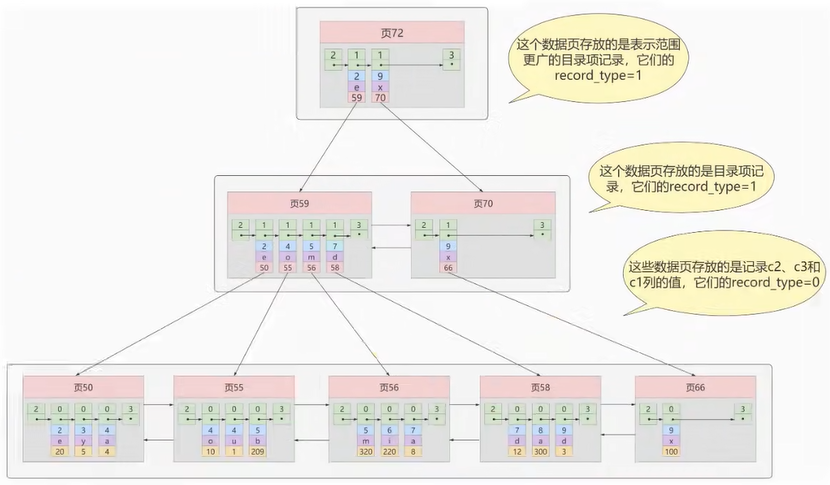
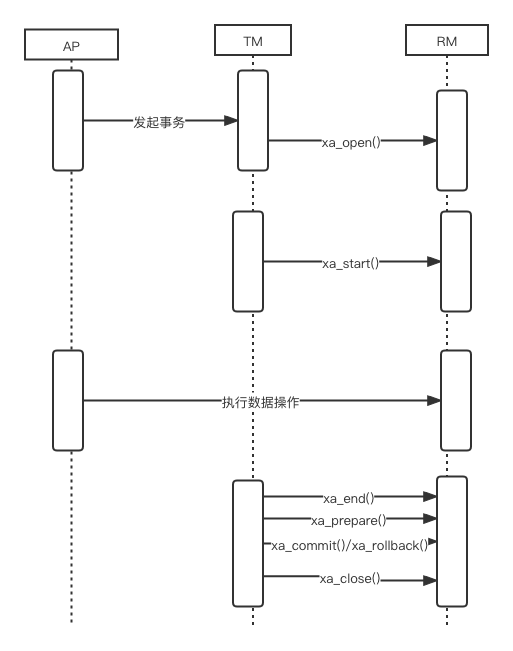
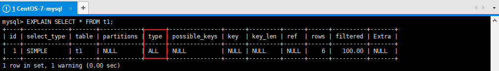
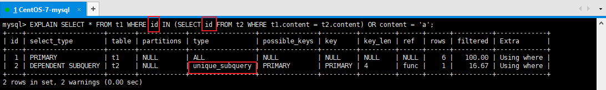
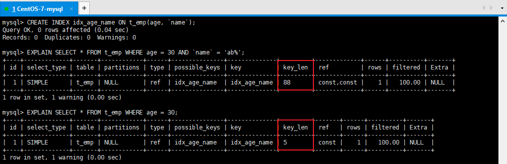
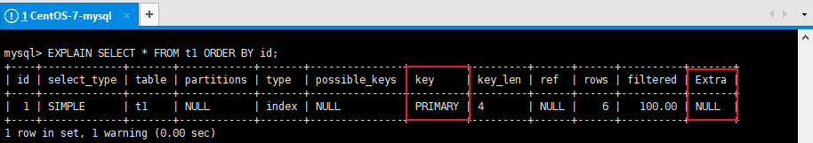
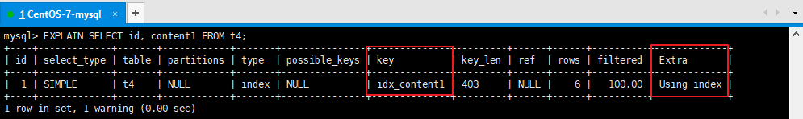
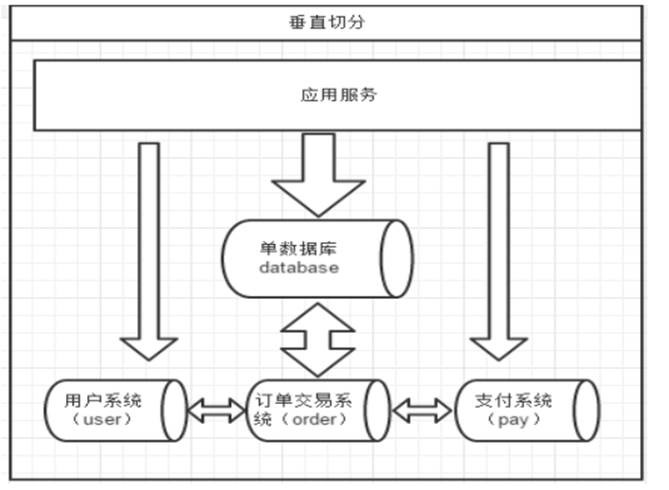
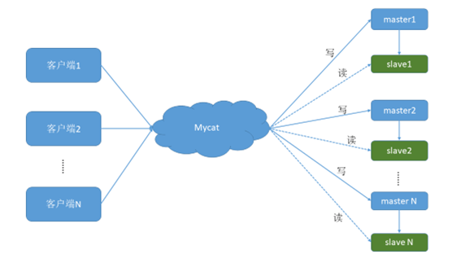

# Mysql面试题
[toc]
## 一 Mysql索引


### 001 Mysql如何实现的索引机制？

MySQL中索引分三类：B+树索引、Hash索引、全文索引

#### 002 InnoDB索引与MyISAM索引实现的区别是什么？

- `MyISAM的索引方式都是非聚簇的，与InnoDB包含1个聚簇索引是不同的。`

  - 在InnoDB存储引擎中，我们只需要根据主键值对聚簇索引进行一次查找就能找到对应的记录，而在MyISAM中却需要进行一次回表操作，意味着MyISAM中建立的索引相当于全部都是二级索引 。 

  - InnoDB的数据文件本身就是索引文件，而MyISAM索引文件和数据文件是分离的 ，索引文件仅保存数据记录的地址。
    - MyISAM的表在磁盘上存储在以下文件中：  `*.sdi（描述表结构）`、`*.MYD（数据）`，`*.MYI（索引）`
    - InnoDB的表在磁盘上存储在以下文件中： `.ibd（表结构、索引和数据都存在一起）`

  - InnoDB的非聚簇索引data域存储相应记录主键的值 ，而MyISAM索引记录的是地址 。换句话说，InnoDB的所有非聚簇索引都引用主键作为data域。
  - MyISAM的回表操作是十分快速的，因为是拿着地址偏移量直接到文件中取数据的，反观InnoDB是通过获取主键之后再去聚簇索引里找记录，虽然说也不慢，但还是比不上直接用地址去访问。
  - InnoDB要求表必须有主键 （ MyISAM可以没有 ）。如果没有显式指定，则MySQL系统会自动选择一个可以非空且唯一标识数据记录的列作为主键。如果不存在这种列，则MySQL自动为InnoDB表生成一个隐含字段作为主键，这个字段长度为6个字节，类型为长整型。

  

  


#### 003 一个表中如果没有创建索引，那么还会创建B+树吗？

会

- 如果有主键会创建聚簇索引

- 如果没有主键会生成rowid作为隐式主键


### 004 说一下B+树索引实现原理（数据结构）


#### 讲义

假设有一个表index_demo，表中有2个INT类型的列，1个CHAR(1)类型的列，c1列为主键：

```sql
CREATE TABLE index_demo(c1 INT,c2 INT,c3 CHAR(1),PRIMARY KEY(c1)) ;
```


index_demo表的简化的行格式示意图如下：


我们只在示意图里展示记录的这几个部分：

- `record_type：`表示记录的类型， 0是普通记录、 2是最小记录、 3 是最大记录、1是B+树非叶子节点记录。
- `next_record：`表示下一条记录的相对位置，我们用箭头来表明下一条记录。
- `各个列的值：`这里只记录在 index_demo 表中的三个列，分别是 c1 、 c2 和 c3 。 
- `其他信息：`除了上述3种信息以外的所有信息，包括其他隐藏列的值以及记录的额外信息。


将`其他信息`项暂时去掉并把它竖起来的效果就是这样：


把一些记录放到页里的示意图就是（这里一页就是一个磁盘块，代表一次IO）：


name age sex


`MySQL InnoDB的默认的页大小是16KB`，因此数据存储在磁盘中，可能会占用多个数据页。如果各个页中的记录没有规律，我们就不得不依次遍历所有的数据页。`如果我们想快速的定位到需要查找的记录在哪些数据页中`，我们可以这样做 ：

- 下一个数据页中用户记录的主键值必须大于上一个页中用户记录的主键值
- 给所有的页建立目录项


以`页28`为例，它对应`目录项2` ，这个目录项中包含着该页的`页号28`以及该页中用户记录的`最小主键值 5`。我们只需要把几个目录项在物理存储器上连续存储（比如：数组），就可以实现根据主键值快速查找某条记录的功能了。`比如：查找主键值为 20 的记录，具体查找过程分两步：`

1. 先从目录项中根据二分法快速确定出`主键值为20的记录在目录项3中`（因为 12 ≤ 20 < 209 ），`对应页9`。 
2. 再到页9中根据二分法快速定位到主键值为 20 的用户记录。

至此，针对数据页做的简易目录就搞定了。这个目录有一个别名，称为`索引` 。 


#### InnoDB中的索引方案

我们新分配一个编号为30的页来专门存储`目录项记录`，页10、28、9、20专门存储`用户记录`： 


`目录项记录和普通的用户记录的不同点：` 

- 目录项记录 的 record_type 值是1，而 普通用户记录 的 record_type 值是0。
- 目录项记录只有主键值和页的编号两个列，而普通的用户记录的列是用户自己定义的，包含很多列，另外还有InnoDB自己添加的隐藏列。

`现在查找主键值为 20 的记录，具体查找过程分两步：`

1. 先到页30中通过二分法快速定位到对应目录项，因为 12 ≤ 20 < 209 ，就是页9。 
2. 再到页9中根据二分法快速定位到主键值为 20 的用户记录。


**更复杂的情况如下：**

我们生成了一个存储更高级目录项的 页33 ，这个页中的两条记录分别代表页30和页32，如果用户记录的主键值在 `[1, 320)` 之间，则到页30中查找更详细的目录项记录，如果主键值 不小于320 的话，就到页32中查找更详细的目录项记录。**这个数据结构，它的名称是 B+树 。** 


#### 005	聚簇索引与非聚簇索引b+树实现有什么区别？

##### 聚簇索引

**特点：**

- `索引和数据保存在同一个B+树中`

- `页内的记录`是按照`主键`的大小顺序排成一个`单向链表` 。
- `页和页之间`也是根据页中记录的`主键`的大小顺序排成一个`双向链表` 。
- 非叶子节点存储的是记录的`主键+页号`。
- 叶子节点存储的是`完整的用户记录`。

**优点：**

- 数据访问更快 ，因为`索引和数据保存在同一个B+树中`，因此从聚簇索引中获取数据比非聚簇索引更快。
- 聚簇索引对于主键的`排序查找`和`范围查找`速度非常快。
- 按照聚簇索引排列顺序，查询显示一定范围数据的时候，由于`数据都是紧密相连`，数据库可以从更少的数据块中提取数据，`节省了大量的IO操作` 。

**缺点：**

- 插入速度严重依赖于插入顺序 ，按照主键的顺序插入是最快的方式，否则将会出现页分裂，严重影响性能。因此，对于InnoDB表，我们一般都会定义一个`自增的ID列为主键`。
- 更新主键的代价很高 ，因为将会导致被更新的行移动。因此，对于InnoDB表，我们一般定义`主键为不可更新`。

**限制：**

- 只有InnoDB引擎支持聚簇索引，`MyISAM不支持聚簇索引`。
- 由于数据的物理存储排序方式只能有一种，所以`每个MySQL的表只能有一个聚簇索引`。
- 如果没有为表定义主键，InnoDB会选择`非空的唯一索引列代替`。如果没有这样的列，InnoDB会`隐式的定义一个主键`作为聚簇索引。
- 为了充分利用聚簇索引的聚簇特性，InnoDB中表的`主键应选择有序的id`，不建议使用无序的id，比如UUID、MD5、HASH、字符串作为主键，无法保证数据的顺序增长。


##### 非聚簇索引

**（二级索引、辅助索引）**

`聚簇索引`，只能在搜索条件是`主键值`时才发挥作用，因为B+树中的数据都是按照主键进行排序的，如果我们想以别的列作为搜索条件，那么需要创建`非聚簇索引`。

**例如，**`以c2列作为搜索条件`，那么需要使`用c2列创建一棵B+树`，如下所示：


**这个B+树与聚簇索引有几处不同：**

- `页内的记录`是按照从`c2列`的大小顺序排成一个`单向链表` 。
- `页和页之间`也是根据页中记录的`c2列`的大小顺序排成一个`双向链表` 。

- 非叶子节点存储的是记录的`c2列+页号`。
- 叶子节点存储的并不是完整的用户记录，而只是`c2列+主键`这两个列的值。


**一张表可以有多个非聚簇索引：**


#### 006	说一下B+树中聚簇索引的查找（匹配）逻辑


#### 007	说一下B+树中非聚簇索引的查找（匹配）逻辑

**例如：**根据c2列的值查找c2=4的记录，查找过程如下：

1. 根据`根页面44`定位到`页42`（因为`2 ≤  4 < 9`）
2. 由于`c2列没有唯一性约束`，所以c2=4的记录可能分布在多个数据页中，又因为 `2 ≤ 4  ≤ 4`，所以确定实际存储用户记录的页在`页34和页35`中。
3. 在页34和35中`定位到具体的记录`。
4. 但是这个B+树的叶子节点`只存储了c2和c1（主键）`两个列，所以我们必须`再根据主键值去聚簇索引中再查找`一遍完整的用户记录。
5. like 张%


#### 008	平衡二叉树，红黑树，B树和B+树的区别是什么？都有哪些应用场景？

平衡二叉树

- 基础数据结构
- 左右平衡
- 高度差大于1会自旋
- 每个节点记录一个数据

**平衡二叉树（AVL）**

AVL树全称G.M. Adelson-Velsky和E.M. Landis，这是两个人的人名。

平衡二叉树也叫平衡二叉搜索树（Self-balancing binary search tree）又被称为AVL树， 可以保证查询效率较高。

`具有以下特点：`

- 它是一棵空树或它的左右两个子树的高度差的绝对值不超过1
- 并且左右两个子树都是一棵平衡二叉树。


AVL的生成演示：https://www.cs.usfca.edu/~galles/visualization/AVLtree.html


**AVL的问题**

众所周知，IO操作的效率很低，在大量数据存储中，查询时我们不能一下子将所有数据加载到内存中，只能逐节点加载（一个节点一次IO）。如果我们利用二叉树作为索引结构，`那么磁盘的IO次数和索引树的高度是相关的`。平衡二叉树由于树深度过大而造成磁盘IO读写过于频繁，进而导致效率低下。


为了提高查询效率，就需要 减少磁盘IO数 。`为了减少磁盘IO的次数，就需要尽量降低树的高度` ，需要把原来“瘦高”的树结构变的“矮胖”，树的每层的分叉越多越好。针对同样的数据，如果我们把二叉树改成 三叉树：


上面的例子中，我们将二叉树变成了三叉树，降低了树的高度。如果能够在一个节点中存放更多的数据，我们还可以进一步减少节点的数量，从而进一步降低树的高度。这就是`多叉树`。

**普通树的问题**

- 左子树全部为空，从形式上看，更像一个单链表，不能发挥BST的优势。
- `解决方案：平衡二叉树(AVL)` 


红黑树

- hashmap存储
- 两次旋转达到平衡
- 分为红黑节点

在这个棵严格的平台树上又进化为“红黑树”{是一个非严格的平衡树 左子树与右子树的高度差不能超过1}，红黑树的长子树只要不超过短子树的两倍即可！


当再次插入7的时候，这棵树就会发生旋转


**B+** **树和** **B** **树的差异：**

- B+树中非叶子节点的关键字也会同时存在在子节点中，并且是在子节点中所有关键字的最大值（或最小）。
- B+树中非叶子节点仅用于索引，不保存数据记录，跟记录有关的信息都放在叶子节点中。而B树中， 非叶子节点既保存索引，也保存数据记录 。 
- B+树中所有关键字都在叶子节点出现，叶子节点构成一个有序链表，而且叶子节点本身按照关键字的大小从小到大顺序链接。


#### 009	一个b+树中大概能存放多少条索引记录？

- `真实环境`中一个页存放的记录数量是非常大的（默认16KB），假设指针与键值忽略不计（或看做10个字节），数据占 1 kb 的空间：
- 如果B+树只有1层，也就是只有1个用于存放用户记录的节点，最多能存放 16 条记录。
- 如果B+树有2层，最多能存放 `1600×16=25600` 条记录。
- 如果B+树有3层，最多能存放 `1600×1600×16=40960000` 条记录。
- 如果存储千万级别的数据，只需要三层就够了

`B+树的非叶子节点不存储用户记录，只存储目录记录，相对B树每个节点可以存储更多的记录，树的高度会更矮胖，IO次数也会更少。`

#### 010	使用B+树存储的索引crud执行效率如何？

c 新增

O(lognN)

N = 高度

#### 011	什么是自适应哈希索引？

自适应哈希索引是Innodb引擎的一个特殊功能，当它注意到某些索引值被使用的非常频繁时，会在内存中基于B-Tree所有之上再创建一个哈希索引，这就让B-Tree索引也具有哈希索引的一些优点，比如快速哈希查找。这是一个完全自动的内部行为，用户无法控制或配置

使用命令

```
SHOW ENGINE INNODB STATUS \G ;
```


查看INSERT BUFFER AND ADAPTIVE HASH INDEX

#### 012	什么是2-3树 2-3-4树？


多叉树（multiway tree）允许`每个节点可以有更多的数据项和更多的子节点`。2-3树，2-3-4树就是多叉树，多叉树通过`重新组织节点，减少节点数量，增加分叉，减少树的高度`，能对二叉树进行优化。


**2-3树**

下面2-3树就是一颗多叉树


2-3树具有如下特点：

- 2-3树的所有叶子节点都在同一层。
- 有两个子节点的节点叫二节点，二节点要么没有子节点，要么有两个子节点。
- 有三个子节点的节点叫三节点，三节点要么没有子节点，要么有三个子节点。
- 2-3树是由二节点和三节点构成的树。
- 对于三节点的子树的值大小仍然遵守 BST 二叉排序树的规则。


**2-3-4树**


### 013 为什么官方建议使用自增长主键作为索引？（说一下自增主键和字符串类型主键的区别和影响）

- 自增主键能够维持底层数据顺序写入
- 读取可以由b+树的二分查找定位
- 支持范围查找，范围数据自带顺序


字符串无法完成以上操作

#### 014 使用int自增主键后 最大id是10，删除id 10和9，再添加一条记录，最后添加的id是几？删除后重启mysql然后添加一条记录最后id是几？

删除之后

- 如果重启，会从最大的id开始递增
- 如果没重启，会延续删除之前最大的id开始递增

### 015 索引的优缺点是什么？

**优点**

聚簇（主键）索引：

- 顺序读写
- 范围快速查找
- 范围查找自带顺序

非聚簇索引：

- 条件查询避免全表扫描scan
- 范围，排序，分组查询返回行id，排序分组后，再回表查询完整数据，有可能利用顺序读写
- 覆盖索引不需要回表操作

**索引的代价**

索引是个好东西，可不能乱建，它在空间和时间上都会有消耗：

- **空间上的代价**

每建立一个索引都要为它建立一棵B+树，`每一棵B+树的每一个节点都是一个数据页，一个页默认会占用 16KB 的存储空间`，一棵很大的B+树由许多数据页组成，那就是很大的一片存储空间。

- **时间上的代价**

`每次对表中的数据进行 增、删、改 操作时，都需要去修改各个B+树索引`。而增、删、改操作可能会对节点和记录的排序造成破坏`，所以存储引擎需要额外的时间进行一些记录移位、页面分裂、页面回收等操作来维护好节点和记录的排序。`如果我们建了许多索引，每个索引对应的B+树都要进行相关的维护操作，会给性能拖后腿。

B 树和 B+ 树都可以作为索引的数据结构，**在 MySQL 中采用的是 B+ 树。**

但B树和B+树各有自己的应用场景，不能说B+树完全比B树好，反之亦然。

#### 016	使用索引一定能提升效率吗？

不一定

- 少量数据全表扫描也很快，可以直接获取到全量数据
- 唯一索引会影响插入速度，但建议使用
- 索引过多会影响更新，插入，删除数据速度

#### 017	如果是大段文本内容，如何创建（优化）索引？

```
B 树和 B+ 树都可以作为     索引的数据结构，**在 MySQL 中采用的是 B+ 树。**
```


第一种方式是分表存储，然后创建索引

第二是使用es为大文本创建索引

### 018 什么是聚簇索引？

聚簇索引数据和索引存放在一起组成一个b+树

参考005题

#### 019	一个表中可以有多个（非）聚簇索引吗？

聚簇索引只能有一个

非聚簇索引可以有多个

#### 020	聚簇索引与非聚集索引的特点是什么？

参考005题

#### 021	CRUD时聚簇索引与非聚簇索引的区别是什么？

- 聚簇索引插入新值比采用非聚簇索引插入新值的速度要慢很多，因为插入要保证主键不能重复
- 聚簇索引范围，排序查找效率高，因为是有序的
- 非聚簇索引访问需要两次索引查找，第一次找到主键值，第二次根据主键值找到行数据


#### 022 非聚簇索引为什么不存数据地址值而存储主键？

因为聚簇索引中有时会引发分页操作、重排操作数据有可能会移动

### 023 什么是回表操作？

id age name sex

age -> index

select * from user where age >20 ;

第一次 取回id，第二次（回表）根据id拿到完整数据

select * from user where age >20 ;

#### 024	什么是覆盖索引？

id age name sex

age -> index

select * from user where age >20 ;

第一次 取回id，第二次（回表）根据id拿到完整数据

age,name -> index

select age from user where age >20 and name like"张%" ;

覆盖索引不会回表查询，查询效率也是比较高的

#### 025	非聚集索引一定回表查询吗?

不一定，只要b+树中包含的字段（创建索引的字段），覆盖（包含）想要select 的字段，那么就不会回表查询了。

#### 026	为什么要回表查询？直接存储数据不可以吗？

为了控制非聚簇索引的大小

#### 027	如果把一个 InnoDB 表的主键删掉，是不是就没有主键，就没办法进行回表查询了？

不是，InnoDB会生成rowid辅助回表查询

### 028 什么是联合索引，组合索引，复合索引？

`为c2和c3列建立联合索引，`如下所示：

c2，c3 - > index

c3,c2 -> index

where c3=? 

全职匹配

最左前缀




#### 029 复合索引创建时字段顺序不一样使用效果一样吗？

我们也可以同时以多个列的大小作为排序规则，也就是同时为多个列建立索引，比方说我们想让B+树按照 `c2和c3列` 的大小进行排序，这个包含两层含义：

- 先把各个记录和页按照`c2`列进行排序。
- 在记录的`c2`列相同的情况下，采用`c3`列进行排序
- B+树叶子节点处的记录由`c2列、c3列和主键c1列组成`
- 本质上也是二级索引

`create index idx_c2_c3 on user (c2,c3); `

### 030 什么是唯一索引？

- 随表一起创建索引：

```sql
CREATE TABLE customer (
    
  id INT UNSIGNED AUTO_INCREMENT,
  customer_no VARCHAR(200),
  customer_name VARCHAR(200),
    
  PRIMARY KEY(id), -- 主键索引：列设定为主键后会自动建立索引，唯一且不能为空。
  UNIQUE INDEX uk_no (customer_no), -- 唯一索引：索引列值必须唯一，允许有NULL值，且NULL可能会出现多次。
  KEY idx_name (customer_name), -- 普通索引：既不是主键，列值也不需要唯一，单纯的为了提高查询速度而创建。
  KEY idx_no_name (customer_no,customer_name) -- 复合索引：即一个索引包含多个列。
);
```


- 单独建创索引：

```sql
CREATE TABLE customer1 (
  id INT UNSIGNED,
  customer_no VARCHAR(200),
  customer_name VARCHAR(200)
);

ALTER TABLE customer1 ADD PRIMARY KEY customer1(id); -- 主键索引
CREATE UNIQUE INDEX uk_no ON customer1(customer_no); -- 唯一索引
CREATE INDEX idx_name ON customer1(customer_name);  -- 普通索引
CREATE INDEX idx_no_name ON customer1(customer_no,customer_name); -- 复合索引
```


#### 	031 唯一索引是否影响性能？

是

#### 	032 什么时候使用唯一索引？

业务需求唯一字段的时候，一般不考虑性能问题

. 【强制】业务上具有唯一特性的字段，即使是多个字段的组合，也必须建成唯一索引。 说明：不要以为唯一索引影响了 insert 速度，这个速度损耗可以忽略，但提高查找速度是明 显的；另外，即使在应用层做了非常完善的校验控制，只要没有唯一索引，根据墨菲定律，必 然有脏数据产生。


### 033 什么时候适合创建索引，什么时候不适合创建索引？

适合创建索引

- 频繁作为where条件语句查询字段

- 关联字段需要建立索引
- 排序字段可以建立索引

- 分组字段可以建立索引(因为分组前提是排序)

- 统计字段可以建立索引（如.count(),max()）

不适合创建索引

- 频繁更新的字段不适合建立索引

- where，分组，排序中用不到的字段不必要建立索引

- 可以确定表数据非常少不需要建立索引

- 参与mysql函数计算的列不适合建索引

创建索引时避免有如下极端误解：

 1）宁滥勿缺。认为一个查询就需要建一个索引。 

2）宁缺勿滥。认为索引会消耗空间、严重拖慢更新和新增速度。 

3）抵制惟一索引。认为业务的惟一性一律需要在应用层通过“先查后插”方式解决。

### 034 什么是索引下推？

5.6之前的版本是没有索引下推这个优化的

**Using index condition：**叫作  `Index Condition Pushdown Optimization （索引下推优化）`

- `如果没有索引下推（ICP）`，那么MySQL在存储引擎层找到满足`content1 > 'z'`条件的第一条二级索引记录。`主键值进行回表`，返回完整的记录给server层，server层再判断其他的搜索条件是否成立。如果成立则保留该记录，否则跳过该记录，然后向存储引擎层要下一条记录。
- `如果使用了索引下推（ICP`），那么MySQL在存储引擎层找到满足`content1 > 'z'`条件的第一条二级索引记录。`不着急执行回表`，而是在这条记录上先判断一下所有关于`idx_content1`索引中包含的条件是否成立，也就是`content1 > 'z' AND content1 LIKE '%a'`是否成立。如果这些条件不成立，则直接跳过该二级索引记录，去找下一条二级索引记录；如果这些条件成立，则执行回表操作，返回完整的记录给server层。


总结：

未开启索引下推：

- 根据筛选条件在索引树中筛选第一个条件
- 获得结果集后回表操作
- 进行其他条件筛选
- 再次回表查询

开启索引下推：在条件查询时，当前索引树如果满足全部筛选条件，可以在当前树中完成全部筛选过滤，得到比较小的结果集再进行回表操作

### 035 有哪些情况会导致索引失效？

- 计算、函数导致索引失效

```
-- 显示查询分析
EXPLAIN SELECT * FROM emp WHERE emp.name  LIKE 'abc%';
EXPLAIN SELECT * FROM emp WHERE LEFT(emp.name,3) = 'abc'; --索引失效
```


- LIKE以%，_ 开头索引失效

> **拓展：Alibaba《Java开发手册》**
>
> 【强制】页面搜索严禁左模糊或者全模糊，如果需要请走搜索引擎来解决。

```
EXPLAIN SELECT * FROM emp WHERE name LIKE '%ab%'; --索引失效
```


- 不等于(!= 或者<>)索引失效

```
EXPLAIN SELECT SQL_NO_CACHE * FROM emp WHERE emp.name = 'abc' ;
EXPLAIN SELECT SQL_NO_CACHE * FROM emp WHERE emp.name <> 'abc' ; --索引失效
```


- IS NOT NULL 失效 和 IS NULL

```
EXPLAIN SELECT * FROM emp WHERE emp.name IS NULL;
EXPLAIN SELECT * FROM emp WHERE emp.name IS NOT NULL; --索引失效
```

**注意：**当数据库中的数据的索引列的`NULL值达到比较高的比例的时候`，即使在IS NOT NULL 的情况下 MySQL的查询优化器会选择使用索引，`此时type的值是range（范围查询）`

```sql
-- 将 id>20000 的数据的 name 值改为 NULL
UPDATE emp SET `name` = NULL WHERE `id` > 20000;

-- 执行查询分析，可以发现 IS NOT NULL 使用了索引
-- 具体多少条记录的值为NULL可以使索引在IS NOT NULL的情况下生效，由查询优化器的算法决定
EXPLAIN SELECT * FROM emp WHERE emp.name IS NOT NULL
```

- 类型转换导致索引失效

```sql
EXPLAIN SELECT * FROM emp WHERE name='123'; 
EXPLAIN SELECT * FROM emp WHERE name= 123; --索引失效
```

- 复合索引未用左列字段失效
- 如果mysql觉得全表扫描更快时（数据少）;

#### 036  为什么LIKE以%开头索引会失效？


id,name,age

name 创建索引

select *  from user where  name like '%明'

type=all

select name,id  from user where  name like '%明'

type=index


张明

(name,age)

其实并不会完全失效，覆盖索引下会出现type=index，表示遍历了索引树，再回表查询，

覆盖索引没有生效的时会直接type=all


没有高效使用索引是因为字符串索引会逐个转换成accii码，生成b+树时按首个字符串顺序排序，类似复合索引未用左列字段失效一样，跳过开始部分也就无法使用生成的b+树了


### 037  一个表有多个索引的时候，能否手动选择使用哪个索引？

不可用手动直接干预，只能通过mysql优化器自动选择

#### 038  	如何查看一个表的索引？

```
show index from t_emp; // 显示表上的索引
explain select * from t_emp where id=1; // 显示可能会用到的索引及最终使用的索引
```


#### 039  	能否查看到索引选择的逻辑？是否使用过optimizer_trace？

```
set session optimizer_trace="enabled=on",end_markers_in_json=on;
SELECT * FROM information_schema.OPTIMIZER_TRACE;
set session optimizer_trace="enabled=off";

```


#### 040  	多个索引优先级是如何匹配的？

1. 主键（唯一索引）匹配
2. 全值匹配（单值匹配）
3. 最左前缀匹配
4. 范围匹配
5. 索引扫描
6. 全表扫描


 一般性建议

Ø 对于单键索引，尽量选择过滤性更好的索引（例如：手机号，邮件，身份证）

Ø 在选择组合索引的时候，过滤性最好的字段在索引字段顺序中，位置越靠前越好。

Ø 选择组合索引时，尽量包含where中更多字段的索引

Ø 组合索引出现范围查询时，尽量把这个字段放在索引次序的最后面

Ø 尽量避免造成索引失效的情况

### 041  	使用Order By时能否通过索引排序？

没有过滤条件不走索引

#### 042  		通过索引排序内部流程是什么？

select name,id  from user where  name like '%明' order by name；

select name,id，age  from user where  name like '%明'

关键配置：

- sort_buffer可供排序的内存缓冲区大小
- max_length_for_sort_data 单行所有字段总和限制，超过这个大小启动双路排序

1. 通过索引检过滤筛选条件索到需要排序的字段+其他字段（如果是符合索引）
2. 判断索引内容是否覆盖select的字段
   1. 如果覆盖索引，select的字段和排序都在索引上，那么在内存中进行排序，排序后输出结果
   2. 如果索引没有覆盖查询字段，接下来计算select的字段是否超过max_length_for_sort_data限制，如果超过，启动双路排序，否则使用单路


#### 043  		什么是双路排序和单路排序

单路排序：一次取出所有字段进行排序，内存不够用的时候会使用磁盘

双路排序：取出排序字段进行排序，排序完成后再次回表查询所需要的其他字段


如果不在索引列上，filesort有两种算法： mysql就要启动双路排序和单路排序

 **双路排序（慢）**

Select id,age,name from stu order by name;

Ø MySQL 4.1之前是使用双路排序，字面意思就是两次扫描磁盘，最终得到数据， 读取行指针和order by列，对他们进行排序，然后扫描已经排序好的列表，按照列表中的值重新从列表中读取对应的数据输出

Ø 从磁盘取排序字段，在buffer进行排序，再从磁盘取其他字段。

Ø 取一批数据，要对磁盘进行两次扫描，众所周知，I\O是很耗时的，所以在mysql4.1之后，出现了第二种改进的算法，就是单路排序。

**单路排序（快）**

从磁盘读取查询需要的所有列，按照order by列在buffer对它们进行排序，然后扫描排序后的列表进行输出， 它的效率更快一些，避免了第二次读取数据。并且把随机IO变成了顺序IO，但是它会使用更多的空间， 因为它把每一行都保存在内存中了。

**结论及引申出的问题**

 但是用单路有问题

在sort_buffer中，单路比多路要多占用很多空间，因为单路是把所有字段都取出, 所以有可能取出的数据的总大小超出了sort_buffer的容量，导致每次只能取sort_buffer容量大小的数据，进行排序（创建tmp文件，多路合并），排完再取sort_buffer容量大小，再排……从而多次I/O。

单路本来想省一次I/O操作，反而导致了大量的I/O操作，反而得不偿失。

**优化策略**

Ø 增大sort_buffer_size参数的设置

Ø 增大max_length_for_sort_data参数的设置

Ø 减少select 后面的查询的字段。 禁止使用select * 

**提高Order By的速度** 

\1. Order by时select * 是一个大忌。只Query需要的字段， 这点非常重要。在这里的影响是：

l 当Query的字段大小总和小于max_length_for_sort_data 而且排序字段不是 TEXT|BLOB 类型时，会用改进后的算法——单路排序， 否则用老算法——多路排序。

l 两种算法的数据都有可能超出sort_buffer的容量，超出之后，会创建tmp文件进行合并排序，导致多次I/O，但是用单路排序算法的风险会更大一些，所以要提高sort_buffer_size。 

\2. 尝试提高 sort_buffer_size

l 不管用哪种算法，提高这个参数都会提高效率，当然，要根据系统的能力去提高，因为这个参数是针对每个进程（connection）的 1M-8M之间调整。 MySQL5.7和8.0，InnoDB存储引擎默认值是1048576字节，1MB。

SHOW VARIABLES LIKE '%sort_buffer_size%';

​                               

\3. 尝试提高 max_length_for_sort_data

l 提高这个参数， 会增加用改进算法的概率。

SHOW VARIABLES LIKE '%max_length_for_sort_data%'; 

\#5.7默认1024字节

\#8.0默认4096字节

l 但是如果设的太高，数据总容量超出sort_buffer_size的概率就增大，明显症状是高的磁盘I/O活动和低的处理器使用率。如果需要返回的列的总长度大于max_length_for_sort_data，使用双路算法，否则使用单路算法。1024-8192字节之间调整

#### 

#### 044  		group by 分组和order by在索引使用上有什么区别？

group by 使用索引的原则几乎跟order by一致 ，唯一区别：

- group by 先排序再分组，遵照索引建的最佳左前缀法则
- group by没有过滤条件，也可以用上索引。Order By 必须有过滤条件才能使用上索引。

### 045  	如果表中有字段为null，又被经常查询该不该给这个字段创建索引？

应该创建索引，使用的时候尽量使用is null判断。

- IS NOT NULL 失效 和 IS NULL

```
EXPLAIN SELECT * FROM emp WHERE emp.name IS NULL;
EXPLAIN SELECT * FROM emp WHERE emp.name IS NOT NULL; --索引失效
```

**注意：**当数据库中的数据的索引列的`NULL值达到比较高的比例的时候`，即使在IS NOT NULL 的情况下 MySQL的查询优化器会选择使用索引，`此时type的值是range（范围查询）`

```sql
-- 将 id>20000 的数据的 name 值改为 NULL
UPDATE emp SET `name` = NULL WHERE `id` > 20000;

-- 执行查询分析，可以发现 IS NOT NULL 使用了索引
-- 具体多少条记录的值为NULL可以使索引在IS NOT NULL的情况下生效，由查询优化器的算法决定
EXPLAIN SELECT * FROM emp WHERE emp.name IS NOT NULL
```


#### 046  		有字段为null索引是否会失效？

不一定会失效，每一条sql具体有没有使用索引 可以通过trace追踪一下

最好还是给上默认值

数字类型的给0，字符串给个空串“”，

参考上一题

## 二 MySQL 内部技术架构


### 047 Mysql内部支持缓存查询吗？

当MySQL接收到客户端的查询SQL之后，仅仅只需要对其进行相应的权限验证之后，就会通过Query Cache来查找结果，甚至都不需要经过Optimizer模块进行执行计划的分析优化，更不需要发生任何存储引擎的交互

mysql5.7支持内部缓存，8.0之后就废弃掉了

#### 048 	mysql8为何废弃掉查询缓存？

缓存的意义在于快速查询提升系统性能，可以灵活控制缓存的一致性

mysql缓存的限制

1. mysql基本没有手段灵活的管理缓存失效和生效，尤其对于频繁更新的表
2. SQL必须完全一致才会导致cache命中
3. 为了节省内存空间，太大的result set不会被cache (< query_cache_limit)；
4. MySQL缓存在分库分表环境下是不起作用的；
5. 执行SQL里有触发器,自定义函数时，MySQL缓存也是不起作用的；
6. 在表的结构或数据发生改变时，基于该表相关cache立即全部失效。

#### 049 	替代方案是什么？

应用层组织缓存，最简单的是使用redis，ehcached等


### 050 Mysql内部有哪些核心模块组成，作用是什么？


**Connectors（客户端）**

MySQL服务器之外的客户端程序，与具体的语言相关，例如Java中的JDBC，图形用户界面SQLyog等。`本质上都是在TCP连接上通过MySQL协议和MySQL服务器进行通信。`


**MySQL Server（服务器）**

**第1层：连接层**

- 系统（客户端）访问 MySQL 服务器前，做的`第一件事就是建立 TCP 连接`。
- 经过三次握手建立连接成功后， MySQL 服务器对 TCP 传输过来的账号密码做`身份认证、权限获取`。
  - 用户名或密码不对`，会收到一个`Access denied for user`错误，客户端程序结束执行`
  - `用户名密码认证通过`，会从权限表`查出账号拥有的权限`与连接关联，之后的权限判断逻辑，都将依赖于此时读到的权限
- TCP 连接收到请求后，必须要分配给一个线程专门与这个客户端的交互。所以还会有个线程池，去走后面的流程。每一个连接从线程池中获取线程，省去了创建和销毁线程的开销。


**第2层：服务层**

**Management Serveices & Utilities： 系统管理和控制工具**

**SQL Interface：SQL接口：**

- `接收用户的SQL命令，并且返回用户需要查询的结果。`比如SELECT ... FROM就是调用SQL Interface 
- MySQL支持DML（数据操作语言）、DDL（数据定义语言）、存储过程、视图、触发器、自定义函数等多种SQL语言接口

**Parser：解析器：**

- 在SQL命令传递到解析器的时候会被解析器验证和解析。解析器中SQL 语句进行`语法分析、语法解析`，并为其创建`语法树`。
- 

**语法分析**

语法分析主要是把输入转化成若干个tokens，包含key和非key。

在分析之后，会得到4个Token，其中有2个key，它们分别是SELECT、FROM。

| key    | 非key | key  | 非key |
| ------ | ----- | ---- | ----- |
| SELECT | age   | FROM | user  |


- 典型的解析树如下：


**Optimizer：查询优化器：**

- SQL语句在语法解析后、查询前会使用查询优化器对查询进行优化，`确定SQL语句的执行路径，生成一个执行计划`。

**Caches & Buffers： 查询缓存组件：**

- MySQL内部维持着一些Cache和Buffer，比如Query Cache用来缓存一条SELECT语句的执行结果，如果能够在其中找到对应的查询结果，那么就不必再进行查询解析、查询优化和执行的整个过程了，直接将结果反馈给客户端。
- 这个缓存机制是由一系列小缓存组成的。比如表缓存，记录缓存，key缓存，权限缓存等 。
- 这个查询缓存可以在不同客户端之间共享 。 


**第3层：引擎层**

插件式存储引擎层（ Storage Engines），`负责MySQL中数据的存储和提取，对物理服务器级别维护的底层数据执行操作，服务器通过API与存储引擎进行通信`。不同的存储引擎具有的功能不同，管理的表有不同的存储结构，采用的存取算法也不同，这样我们可以根据自己的实际需要进行选取。例如MyISAM引擎和InnoDB引擎。


**存储层**

所有的数据、数据库、表的定义、表的每一行的内容、索引，都是存在`文件系统` 上，以文件的方式存在，并完成与存储引擎的交互。


### 051 一条sql发送给mysql后，内部是如何执行的？（说一下 MySQL 执行一条查询语句的内部执行过程？）

1.5、查询流程说明


**首先，**`MySQL客户端通过协议与MySQL服务器建连接，通过SQL接口发送SQL语句，先检查查询缓存，如果命中，直接返回结果，否则进行语句解析。`也就是说，在解析查询之前，服务器会先访问查询缓存，如果某个查询结果已经位于缓存中，服务器就不会再对查询进行解析、优化、以及执行。它仅仅将缓存中的结果返回给用户即可，这将大大提高系统的性能。

**接下来，**`MySQL解析器通过关键字将SQL语句进行解析，并生成一棵对应的解析树，`解析器使用MySQL语法规则验证和解析SQL语句。例如，它将验证是否使用了错误的关键字，或者使用关键字的顺序是否正确，引号能否前后匹配等；`预处理器则根据MySQL规则进一步检查解析树是否合法，`例如，这里将检查数据表和数据列是否存在，还会解析名字和别名，看是否有歧义等。`然后预处理器会进行查询重写，生成一棵新解析树。`

**接下来，**`查询优化器将解析树转化成执行计划。`MySQL优化程序会对我们的语句做一些优化，如子查询转换为连接、表达式简化等等。优化的结果就是生成一个执行计划，这个执行计划表明了应该使用哪些索引执行查询，以及表之间的连接顺序是啥样，等等。我们可以使用EXPLAIN语句来查看某个语句的执行计划。

**最后，**`进入执行器阶段。`完成查询优化后，`查询执行引擎`会按照生成的执行计划调用存储引擎提供的接口执行SQL查询并将结果返回给客户端。在MySQL8以下的版本，如果设置了查询缓存，这时会将查询结果进行缓存，再返回给客户端。


#### 052 MySQL 提示“不存在此列”是执行到哪个节点报出的？

是在Parser：解析器 分析sql语法的时候检查的列。


### 053 如果一张表创建了多个索引，在哪个阶段或模块进行的索引选择？

在优化器阶段**Optimizer：查询优化器：**

### 054 MySQL 支持哪些存储引擎？默认使用哪个？

查看MySQL提供什么存储引擎

```sql
SHOW ENGINES;
```

下面的结果表示MySQL中默认使用的存储引擎是InnoDB，支持事务，行锁，外键，支持分布式事务(XA)，支持保存点(回滚)


也可以通过以下语句查看默认的存储引擎：

```sql
SHOW VARIABLES LIKE '%default_storage_engine%';
```


### 055 Mysql8.0自带哪些存储引擎？分别是做什么的？


`1. InnoDB存储引擎`

- InnoDB是MySQL的默认事务型引擎，它被设计用来`处理大量的短期(short-lived)事务`。可以确保事务的完整提交(Commit)和回滚(Rollback)。

- 除非有非常特别的原因需要使用其他的存储引擎，否则`应该优先考虑InnoDB引擎`。

- 数据文件结构：

  - 表名.frm 存储表结构（MySQL8.0时，合并在表名.ibd中）


  - 表名.ibd 存储数据和索引

- InnoDB不仅缓存索引还要缓存真实数据， 对内存要求较 高 ，而且内存大小对性能有决定性的影响。


`2. MyISAM存储引擎`

- MyISAM提供了大量的特性，包括全文索引、压缩、空间函数(GIS)等，但`MyISAM不支持事务和行级锁`，有一个毫无疑问的缺陷就是崩溃后无法安全恢复。

- 优势是访问的 速度快 ，对事务完整性没有要求或者以SELECT、INSERT为主的应用。

- 数据文件结构：

  - 表名.frm 存储表结构


  - 表名.MYD 存储数据


  - 表名.MYI 存储索引

- MyISAM只缓存索引，不缓存真实数据。


`3. Archive引擎`

- `Archive档案存储引擎只支持INSERT和SELECT操作`。
- Archive表适合日志和数据采集（档案）类应用。
- 根据英文的测试结论来看，Archive表比MyISAM表要小大约75%，比支持事务处理的InnoDB表小大约83%。


`4. Blackhole引擎`

- `Blackhole引擎没有实现任何存储机制，它会丢弃所有插入的数据，不做任何保存`。
- 但服务器会记录Blackhole表的日志，所以可以用于复制数据到备库，或者简单地记录到日志。但这种应用方式会碰到很多问题，因此并不推荐。 


`5. CSV引擎` 

- `CSV引擎可以将普通的CSV文件作为MySQL的表来处理，但不支持索引`。
- CSV引擎可以作为一种数据交换的机制，非常有用。
- CSV存储的数据直接可以在操作系统里，用文本编辑器，或者excel读取。


`6. Memory引擎`

- 如果需要快速地访问数据，并且这些数据不会被修改，重启以后丢失也没有关系，那么使用Memory表是非常有用。
- Memory表至少比MyISAM表要快一个数量级。


`7. Federated引擎`

- `Federated引擎是访问其他MySQL服务器的一个代理（跨库关联查询）`，尽管该引擎看起来提供了一种很好的跨服务器的灵活性，但也经常带来问题，因此默认是禁用的。

### 056 MySQL 存储引擎架构了解吗？

https://dev.mysql.com/doc/refman/5.7/en/innodb-architecture.html

下面是官方的InnoDB引擎结构图，主要分为内存结构和磁盘结构两大部分。


**内存区域**

**Buffer Pool**:在InnoDB访问表记录和索引时会在Buffer Pool的页中缓存，以后使用可以减少磁盘IO操作，提升效率。主要用来缓存热的数据页和索引页。

**Log Buffer**：用来缓存redolog

**Adaptive Hash Index**：自适应哈希索引

**Change Buffer**:它是一种应用在非唯一普通索引页（non-unique secondary index page）不在缓冲池中，对页进行了写操作，并不会立刻将磁盘页加载到缓冲池，而仅仅记录缓冲变更（Buffer Changes），等未来数据被读取时，再将数据合并（Merge）恢复到缓冲池中的技术。写缓冲的目的是降低写操作的磁盘IO，提升数据库性能。


**磁盘区域**

磁盘中的结构分为两大类：表空间和重做日志。

- 表空间：分为系统表空间(MySQL 目录的 ibdata1 文件)，临时表空间，常规表空间，Undo 表空间以及 file-per-table 表空间(MySQL5.7默认打开file_per_table 配置）。系统表空间又包括了InnoDB数据字典，双写缓冲区(Doublewrite Buffer)，修改缓存(Change Buffer），Undo日志等。
- Redo日志：存储的就是 Log Buffer 刷到磁盘的数据。


官方文档：

https://dev.mysql.com/doc/refman/8.0/en/innodb-storage-engine.html


#### 057 	能否单独为一张表设置存储引擎？

### 

`方法1：`

设置默认存储引擎：

```sql
SET DEFAULT_STORAGE_ENGINE=MyISAM;
```


`方法2：`

或者修改 my.cnf 文件：vim /etc/my.cnf
新增一行：default-storage-engine=MyISAM 
重启MySQL：systemctl restart mysqld


`方法3：`

我们可以为 不同的表设置不同的存储引擎

```sql
CREATE TABLE 表名( 建表语句; ) ENGINE = 存储引擎名称;
ALTER TABLE 表名 ENGINE = 存储引擎名称;
```


#### 058 	阿里、京东等大厂都有自研的存储引擎，如何开发一套自己的？

开发存储引擎并不难，难的是开发出来高效的有意义的存储引擎。

简单例子可以看一下官方源码中的示例，可以实现一个什么也没做的存储引擎。

有兴趣可以参考官方文档：https://dev.mysql.com/doc/dev/mysql-server/latest/

### 059 MyISAM 和 InnoDB 的区别是什么？

外键 事务 锁

| **对比项**     | **MyISAM**                                               | **InnoDB**                                                   |
| -------------- | -------------------------------------------------------- | ------------------------------------------------------------ |
| 外键           | 不支持                                                   | 支持                                                         |
| 事务           | 不支持                                                   | 支持                                                         |
| 行表锁         | 表锁，即使操作一条记录也会锁住整个表，不适合高并发的操作 | 行锁，操作时只锁某一行，不对其它行有影响，适合高并发的操作   |
| 缓存           | 只缓存索引，不缓存真实数据                               | 不仅缓存索引还要缓存真实数据，对内存要求较高，而且内存大小对性能有决定性的影响 |
| 关注点         | 并发查询，节省资源、消耗少、简单业务                     | 并发写、事务、多表关系、更大资源                             |
| 默认安装       | Y                                                        | Y                                                            |
| 默认使用       | N                                                        | Y                                                            |
| 自带系统表使用 | Y                                                        | N                                                            |


#### 060 	具体说一下如何做技术选型

除非几乎没有写操作全部都是高频的读操作可以选择MyISAM作为表的存储引擎，其他业务可以一律使用InnoDB。

## 三 mysql 事务

### 061 什么是数据库事务？事务的特性是什么？

**事务**：

- 是数据库操作的最小工作单元，是作为单个逻辑工作单元执行的一系列操作；

- 这些操作作为一个整体一起向系统提交，要么都执行、要么都不执行；

- 事务是一组不可再分割的操作集合（工作逻辑单元）


事务都有 **ACID** 特性

#### 062 	什么是ACID？

**1 、原子性**  atomicity

过程的保证

**只做一个步骤**

1 给钱

2 去买

3 交回来

事务是数据库的逻辑工作单位，事务中包含的各操作**要么都做，要么都不做** 

**2 、一致性**  consistency

结果的保证

**保证要吃完** 刚张嘴挂了，失去一致性

事 务执行的结果必须是使数据库从一个一致性状态变到另一个一致性状态。因此当数据库只包含成功事务提交的结果时，就说数据库处于一致性状态。如果数据库系统 运行中发生故障，有些事务尚未完成就被迫中断，这些未完成事务对数据库所做的修改有一部分已写入物理数据库，这时数据库就处于一种不正确的状态，或者说是 不一致的状态。 
**3 、隔离性** isolation

并发事务互相干扰

**不被干扰** 刚张嘴别人塞了东西

一个事务的执行不能其它事务干扰。即一个事务内部的操作及使用的数据对其它并发事务是隔离的，并发执行的各个事务之间不能互相干扰。 
**4 、持续性** **永久性** durability

**保存** 吃到肚子里

也称永久性，指一个事务一旦提交，它对数据库中的数据的改变就应该是永久性的。接下来的其它操作或故障不应该对其执行结果有任何影响。 

### 063 并发事务会有哪些问题？

多个事务并发执行一定会产生相互争夺资源的问题

#### 064	什么是脏读    065	丢失修改    066	不可重复读 067	幻读

#### 

**脏读（Dirty read）**

是一个事务在处理过程中读取了另外一个事务未提交的数据

当一个事务正在访问数据并且对其进行了修改，但是还没提交事务，这时另外一个事务也访问了这个数据，然后使用了这个数据，因为这个数据的修改还没提交到数据库，所以另外一个事务读取的数据就是“**脏数据**”，这种行为就是“**脏读**”，依据“**脏数据**”所做的操作可能是会出现问题的。


**修改丢失（Lost of modify）**

*是指一个事务读取一个数据时，另外一个数据也访问了该数据，那么在第一个事务修改了这个数据之后，第二个事务也修改了这个数据。这样第一个事务内的修改结果就被丢失，这种情况就被称为\**修改丢失

**不可重复读（Unrepeatableread）**

\**指在一个事务内多**次读取同一数据**，在这个事务还没结束时，另外一个事务也访问了这个数据并**对这个数据进行了修改**，那么就可能造成第一个事务两次读取的数据不一致，这种情况就被称为\**不可重复读。


**幻读（Phantom read）**

是指同一个事务内多次查询返回的结果集总数不一样（比如增加了或者减少了行记录）。

幻读与不可重复读类似，幻读是指一个事务**读取了几行数据**，这个事务还没结束，接着另外一个事务**插入了一些数据**，在随后的查询中，第一个事务读取到的数据就会**比原本读取到的多**，就好像发生了幻觉一样，所以称为 **幻读**。

#### 068 不可重复读和幻读有什么区别？

不可重复读 针对的是一份数据的修改

幻读 针对的是行数修改


### 069 Mysql是如何避免事务并发问题的？

避免事务并发问题是需要付出性能代价的，此时和分布式系统设计一样（CAP定理及base理论），为了保证一致性就一定会牺牲性能，要做取舍

在mysql内部通过加锁的方式实现好了解决方案可供选择，就是配置事务隔离级别

#### 070	什么是事务隔离级别？


```pgsql
事务隔离级别                    脏读     不可重复读(被修改)    幻读（删减）
读未提交（read-uncommitted）    是        是            是
不可重复读（read-committed）    否        是            是
可重复读（repeatable-read）     否        否            是
串行化（serializable）          否        否            否
```


#### 071	默认的级别是什么？

`MySQL InnoDB`存储引擎默认的事务隔离级别是**可重复读（REPEATABLE-READ）**

```
MySQL 5.7 SELECT @@tx_isolation;
MySQL 8.0 SELECT @@transaction_isolation;
```


#### 072	如何选择事务隔离级别？

隔离级别越低，事务请求的锁越少相应性能也就越高，如没有特殊要求或有错误发生，使用默认的隔离级别即可，如果系统中有高频读写并且对一致性要求高那么就需要比较高的事务隔离级别甚至串行化。

#### 073 靠缓存可以提升高事务隔离级别的性能吗？

提升事务级别的目的本质是提供更高的数据一致性，如果前置有缓存，那么缓存只能提供高效读并不能保证数据及时一致性，相反的我们还需要对缓存管理有额外的开销。


### 074 Mysql事务隔离是如何实现的？

隔离的实现主要是读写锁和MVCC


#### 075	什么是一致性非锁定读和锁定读？

**锁定读**

使用到了读写锁

读写锁是最简单直接的的事务隔离实现方式

- 每次读操作需要获取一个共享(读)锁，每次写操作需要获取一个写锁。
- 共享锁之间不会产生互斥，共享锁和写锁之间、以及写锁与写锁之间会产生互斥。
- 当产生锁竞争时，需要等待其中一个操作释放锁后，另一个操作才能获取到锁。

锁机制，解决的就是**多个事务同时更新数据**，此时必须要有一个加锁的机制

- 行锁（记录锁）：解决的就是**多个事务同时更新一行数据**
- 间隙锁：解决的就是**多个事务同时更新多行数据**

下列操作属于锁定读

```
select ... lock in share mode
select ... for update
insert、update、delete
```


**非锁定读**

v10 -> age=18 

v11 ->age=19

v12 ->age=15

使用mvcc 多版本控制实现

#### 076	说一下MVCC内部细节

https://dev.mysql.com/doc/refman/5.7/en/innodb-multi-versioning.html

Multi-Version Concurrency Control 多版本并发控制，*MVCC* 是一种并发控制的方法，一般在数据库管理系统中，实现对数据库的并发访问

InnoDB是一个多版本的存储引擎。它保存有关已更改行的旧版本的信息，以支持并发和回滚等事务特性。这些信息存储在一个称为回滚段的数据结构中的系统表空间或undo表空间中。参见第14.6.3.4节“撤消表空间”。InnoDB使用回滚段中的信息来执行事务回滚所需的撤消操作。它还使用这些信息构建行的早期版本，以实现一致的读取

MVCC 的实现依赖于：隐藏字段、Read View、undo log

**隐藏字段**

- A 6-byte `DB_TRX_ID` 用来标识最近一次对本行记录做修改 (insert 、update) 的事务的标识符 ，即最后一次修改本行记录的事务 id。 如果是 delete 操作， 在 InnoDB 存储引擎内部也属于一次 update 操作，即更新行中的一个特殊位 ，将行标识为己删除，并非真正删除。
- A 7-byte `DB_ROLL_PTR` 回滚指针，指向该行的 undo log 。如果该行未被更新，则为空.
- A 6-byte `DB_ROW_ID` 如果没有设置主键且该表没有唯一非空索引时，`InnoDB` 会使用该 id 来生成聚簇索引.

**Read View**

不同的事务隔离级别中，当有事物在执行过程中修改了数据（更新版本号），在并发事务时需要判断一下版本链中的哪个版本是当前事务可见的。为此InnoDB有了ReadView的概念，使用ReadView来记录和隔离不同事务并发时此记录的哪些版本是对当前访问事物可见的。

**undo log**

除了用来回滚数据，还可以读取可见版本的数据。以此实现非锁定读

#### 077Mysql事务一致性，原子性是如何实现的？

首先是通过锁和mvcc实现了执行过程中的一致性和原子性

其次是在灾备方面通过Redo log实现，Redo log会把事务在执行过程中对数据库所做的所有修改都记录下来，在之后系统崩溃重启后可以把事务所做的任何修改都恢复出来。

#### 078Mysql事务的持久性是如何实现的？

使用Redo log保证了事务的持久性。当事务提交时，必须先将事务的所有日志写入日志文件进行持久化，就是我们常说的WAL(write ahead log)机制，如果出现断电重启便可以从redolog中恢复，如果redolog写入失败那么也就意味着修改失败整个事务也就直接回滚了。

#### 079  表级锁和行级锁有什么区别？

 表级锁：串行化（serializable）时，整表加锁，事务访问表数据时需要申请锁，虽然可分为读锁和写锁，但毕竟是锁住整张表，会导致并发能力下降，一般是做ddl处理时使用

行级锁：除了串行化（serializable）时 InnoDB使用的都是行级锁，只锁一行数据，其他行数据不影响，并发能力强。

#### 080	什么是行级锁？Mysql如何完成的？

行级锁实现比较复杂不是单纯锁住一行数据，是由mvcc完成的。

#### 081	什么是共享锁（读锁）？

共享锁或S锁，其它事务可以继续加共享锁，但不能加排它锁

#### 082	什么是排它锁（写锁/独占锁）？

排它锁或X锁，在进行写操作之前要申请并获得，其它事务不能再获得任何锁。

#### 083	什么是意向锁？

它分为意向共享锁（IS）和意向排他锁（IX）

一个事务对一张表的某行添加共享锁前，必须获得对该表一个IS锁或者优先级更高的锁。
一个事务对一张表的某行添加排他锁之前，它必须对该表获取一个IX锁。

意向锁属于表锁，它不与innodb中的行锁冲突，任意两个意向锁之间也不会产生冲突，但是会与表锁（S锁和X锁）产生冲突

#### 084	InnoDB支持哪几种锁？

表锁，行锁，间隙锁，Next-Key锁等

在Serializable中读加共享锁，写加排他锁，读写互斥

两段锁协议，将事务分成两个阶段，加锁阶段和解锁阶段（所以叫两段锁）

#### 085	当前读和快照读分别是什么？

当前读 ：在锁定读（使用锁隔离事物）的时候读到的是最新版本的数据

快照读：可重复读（repeatable-read）下 mvcc生效读取的是数据的快照，并不是最新版本的数据（未提交事物的数据）

### 086 什么是XA协议？

https://dev.mysql.com/doc/refman/8.0/en/xa.html



- AP（Application Program）：应用程序，定义事务边界（定义事务开始和结束）并访问事务边界内的资源。
- RM（Resource Manger）资源管理器: 管理共享资源并提供外部访问接口。供外部程序来访问数据库等共享资源。此外，RM还具有事务的回滚能力。
- TM（Transaction Manager）事务管理器：TM是分布式事务的协调者，TM与每个RM进行通信，负责管理全局事务，分配事务唯一标识，监控事务的执行进度，并负责事务的提交、回滚、失败恢复等。


- 应用程序AP向事务管理器TM发起事务请求
- TM调用xa_open()建立同资源管理器的会话
- TM调用xa_start()标记一个事务分支的开头
- AP访问资源管理器RM并定义操作，比如插入记录操作
- TM调用xa_end()标记事务分支的结束
- TM调用xa_prepare()通知RM做好事务分支的提交准备工作。其实就是二阶段提交的提交请求阶段。
- TM调用xa_commit()通知RM提交事务分支，也就是二阶段提交的提交执行阶段。
- TM调用xa_close管理与RM的会话。
  - 这些接口一定要按顺序执行，比如xa_start接口一定要在xa_end之前。此外，这里千万要注意的是事务管理器只是标记事务分支并不执行事务，事务操作最终是由应用程序通知资源管理器完成的。另外，我们来总结下XA的接口
- xa_start:负责开启或者恢复一个事务分支，并且管理XID到调用线程
- xa_end:负责取消当前线程与事务分支的关系
- xa_prepare:负责询问RM 是否准备好了提交事务分支 xa_commit:通知RM提交事务分支
- xa_rollback:通知RM回滚事务分支

#### 087 	什么是mysql xa事务？

mysql的xa事务分为两部分：

1. InnoDB内部本地普通事务操作协调数据写入与log写入两阶段提交
2. 外部分布式事务

```
5.7 SHOW VARIABLES LIKE '%innodb_support_xa%';
8.0 默认开启无法关闭
```


XA 事务语法示例如下：

```text
XA START '自定义事务id';

SQL语句...

XA END '自定义事务id';
XA PREPARE '自定义事务id';
XA COMMIT\ROLLBACK '自定义事务id';
```

XA PREPARE 执行成功后，事务信息将被持久化。即使会话终止甚至应用服务宕机，只要我们将【自定义事务id】记录下来，后续仍然可以使用它对事务进行 rollback 或者 commit。

#### 088 	xa事务与普通事务区别是什么？

xa事务可以跨库或跨服务器，属于分布式事务，同时xa事务还支撑了InnoDB内部日志两阶段记录

普通事务只能在单库中执行

#### 089 	什么是2pc 3pc？

两阶段提交协议与3阶段提交协议，额外增加了参与的角色保证分布式事务完成更完善

### 090 是否使用过select for update？会产生哪些操作？

```

查询库存 = 100  0 扣减库存  = -1 99
记录日志 = log
提交  commit
```


select本身是一个查询语句，查询语句是不会产生冲突的一种行为，一般情况下是没有锁的，用select for update 会让select语句产生一个排它锁(X), 这个锁和update的效果一样，会使两个事务无法同时更新一条记录。

https://dev.mysql.com/doc/refman/8.0/en/innodb-locks-set.html

https://dev.mysql.com/doc/refman/8.0/en/select.html

- for update仅适用于InnoDB，且必须在事务块(BEGIN/COMMIT)中才能生效。

- 在进行事务操作时，通过“for update”语句，MySQL会对查询结果集中每行数据都添加排他锁，其他线程对该记录的更新与删除操作都会阻塞。排他锁包含行锁、表锁。
- **InnoDB默认是行级别的锁，在筛选条件中当有明确指定主键或唯一索引列的时候，是行级锁。否则是表级别。**

示例

```
SELECT … FOR UPDATE [OF column_list][WAIT n|NOWAIT][SKIP LOCKED];
select * from t for update 会等待行锁释放之后，返回查询结果。
select * from t for update nowait 不等待行锁释放，提示锁冲突，不返回结果
select * from t for update wait 5 等待5秒，若行锁仍未释放，则提示锁冲突，不返回结果
select * from t for update skip locked 查询返回查询结果，但忽略有行锁的记录
```


### 091说一下mysql死锁的原因和处理方法

```

事务 a

表 t  id=100 更新  加行锁
表 t  id=200 更新  已加锁


事务 b

表 t  id=200 更新 加行锁
表 t  id=100 更新 已加锁
```


- 死锁与锁等待是两个概念
  - 如未开启事务，多个客户端执行的insert操作
- 当多个事务同时持有和请求同一资源上的锁而产生循环依赖的时候就产生了死锁。

排查：

- 正在运行的任务
  - show full processlist;  找到卡主的进程
- 解开死锁
  - UNLOCK TABLES ；
- 查看当前运行的事务
  - SELECT * FROM information_schema.INNODB_TRX;
- 当前出现的锁
  - SELECT * FROM information_schema.INNODB_LOCKS;
- 观察错误日志
- 查看InnoDB锁状态
  - `show status like "innodb_row_lock%";`

lnnodb_row_lock_current_waits:当前正在等待锁定的数量;
lnnodb_row_lock_time :从系统启动到现在锁定的总时间长度，单位ms;
Innodb_row_lock_time_avg :每次等待所花平均时间;
Innodb_row_lock_time_max:从系统启动到现在等待最长的一次所花的时间;
lnnodb_row_lock_waits :从系统启动到现在总共等待的次数。

- kill  id 杀死进程


解决：

- 死锁无法避免，上线前要进行严格的压力测试

- 快速失败
  - innodb_lock_wait_timeout 行锁超时时间
- 拆分sql，严禁大事务
- 充分利用索引，优化索引，尽量把有风险的事务sql使用上覆盖索，优化where条件前缀匹配，提升查询速度，引减少表锁
- 无法避免时：
  - 操作多张表时，尽量以相同的顺序来访问避免形成等待环路
  - 单张表时先排序再操作
  - 使用排它锁 比如 for update

### 092 Mysql会产生几种日志？

- **错误日志（error log）**

error log主要记录MySQL在启动、关闭或者运行过程中的错误信息，在MySQL的配置文件my.cnf中，可以通过log-error=/var/log/mysqld.log 执行mysql错误日志的位置。

- **慢查询日志（slow query log）**

0.1秒


Ø MySQL的慢查询日志是MySQL提供的一种日志记录，它用来记录在MySQL中响应时间超过阀值的语句，具体指运行时间超过long_query_time值的SQL，则会被记录到慢查询日志中。 

Ø long_query_time的默认值为10，意思是运行10秒以上的语句。 

Ø 由他来查看哪些SQL超出了我们的最大忍耐时间值，比如一条sql执行超过5秒钟，我们就算慢SQL，希望能收集超过5秒的sql，结合之前explain进行全面分析。


Ø 默认情况下，MySQL数据库没有开启慢查询日志，需要我们手动来设置这个参数。

Ø 当然，如果不是调优需要的话，一般不建议启动该参数，因为开启慢查询日志会或多或少带来一定的性能影响。慢查询**日志支持将日志记录写入文件**。

 在生产环境中，如果要手工分析日志，查找、分析SQL，显然是个体力活，MySQL提供了日志分析工具mysqldumpslow。

- **一般查询日志（general log）**

general log 记录了客户端连接信息以及执行的SQL语句信息，通过MySQL的命令

- **重写日志（redo log）**

- **回滚日志（undo log）**

- **二进制日志（bin log）**

#### 093 	bin log作用是什么？

MySQL的bin log日志是用来记录MySQL中增删改时的记录日志。

当你的一条sql操作对数据库中的内容进行了更新，就会增加一条bin log日志。查询操作不会记录到bin log中。

bin log最大的用处就是进行**主从复制，以及数据库的恢复。**

#### 094	redo log作用是什么？

redo log是一种基于磁盘的数据结构，用来在MySQL宕机情况下将不完整的事务执行数据纠正，redo日志记录事务执行后的状态。

当事务开始后，redo log就开始产生，并且随着事务的执行不断写入redo log file中。redo log file中记录了xxx页做了xx修改的信息，我们都知道数据库的更新操作会在内存中先执行，最后刷入磁盘。

redo log就是为了恢复更新了内存但是由于宕机等原因没有刷入磁盘中的那部分数据。

#### 095 	undo log作用是什么？

undo log主要用来回滚到某一个版本，是一种逻辑日志。

undo log记录的是修改之前的数据，比如：当delete一条记录时，undolog中会记录一条对应的insert记录，从而保证能恢复到数据修改之前。在执行事务回滚的时候，就可以通过undo log中的记录内容并以此进行回滚。

undo log还可以提供多版本并发控制下的读取（MVCC）。


### 096 	Mysql日志是否实时写入磁盘？ 097 		bin log刷盘机制是如何实现的？098 		redo log刷盘机制是如何实现的？  099 		undo log刷盘机制是如何实现的？

磁盘写入固然是比较慢的。

参数：sync_binlog

binlog 写入策略：

**1、sync_binlog=0** 的时候，表示每次提交事务binlog不会马上写入到磁盘，而是先写到page cache,相对于磁盘写入来说写page cache要快得多,不过在Mysql 崩溃的时候会有丢失日志的风险。

**2、sync_binlog=1** 的时候，表示每次提交事务都会执行 fsync 写入到磁盘 ；

**3、sync_binlog的值大于1** 的时候，表示每次提交事务都 先写到page cach，只有等到积累了N个事务之后才fsync 写入到磁盘，同样在此设置下Mysql 崩溃的时候会有丢失N个事务日志的风险。


很显然三种模式下，sync_binlog=1 是强一致的选择，选择0或者N的情况下在极端情况下就会有丢失日志的风险，具体选择什么模式还是得看系统对于一致性的要求。


**innodb_flush_log_at_trx_commit**

```
取值0：每秒（一秒钟内提交的事务）写入磁盘  每秒触发一次缓存日志回写磁盘操作，并调用操作系统fsync刷新IO缓存。
取值1：有事务提交就立即刷盘     每次提交事务都立即调用操作系统fsync刷新IO缓存。
取值2：每次事务提交 都写给操作系统 由系统接管什么时候写入磁盘   每次都把redo log写到系统的page cache中，由系统接管什么时候写入磁盘
```


时机顺序： 

- 1 开启事务

- 2 查询数据库中需要更新的字段，加载到内存中 形成数据**脏页**

- 3 记录undo log到内存缓冲区（用于回滚和mvcc）并关联redo log   -> 可刷盘

- 4 记录 redo log到内存缓冲区 （用于失败重放）准备提交事务           -> 可刷盘

- 5 修改内存中的脏页数据

- 6 提交事务触发redolog刷盘

- 7 undo log 和脏页 刷盘

- 8 事务成功

  

  

  **redo log 与 binlog 的两阶段提交**

redo log 的写入拆成了两个步骤：prepare 和 commit

- **prepare**：redolog写入log buffer，并fsync持久化到磁盘，在redolog事务中记录2PC的XID，在redolog事务打上prepare标识

- **commit**：binlog写入log buffer，并fsync持久化到磁盘，在binlog事务中记录2PC的XID，同时在redolog事务打上commit标识


### 100 MySQL的binlog有有几种录入格式？分别有什么区别？

logbin格式：

- binlog_format=STATEMENT（默认）：数据操作的时间，同步时不一致 每一条会修改数据的sql语句会记录到binlog中。优点是并不需要记录每一 条sql语句和每一行的 数据变化，减少了binlog日志量，节约IO，提高性能。缺点是在某些情况下会导致 master-slave 中的数据不一致( 如sleep()函数， last_insert_id()，以及user-defined functions(udf)等会 出	现 问题)
- binlog_format=ROW：批量数据操作时，效率低   不记录每条sql语句的上下文信息，仅需记录哪条数据被修改了，修改成什么样 了。而且不会出 现某些特定情况下的存储过程、或function、或trigger的调用和触发无法被正确复制的 问题。缺 点是会产生大量的日志，尤其是alter table的时候会让日志暴涨。
- binlog_format=MIXED：是以上两种level的混合使用，有函数用ROW，没函数用STATEMENT，但是无法识别系统变量

### 101 Mysql集群同步时为什么使用binlog？优缺点是什么？

- binlog是mysql提供的日志，所有存储引擎都可用。
- 支持增量同步
- binlog还可以供其他中间件读取，比如同步到hdfs中
- 如果复制表数据：
  - 不支持某个阶段回放
  - 直接复制数据过程中一旦中断复制（比如断网），很难确定复制的offset

## 四 Mysql开发

### 102 可以使用MySQL直接存储文件吗？

可以使用 BLOB (binary large object)，用来存储二进制大对象的字段类型。

TinyBlob 255 值的长度加上用于记录长度的1个字节(8位)
Blob 65K值的长度加上用于记录长度的2个字节(16位)
MediumBlob 16M值的长度加上用于记录长度的3个字节(24位)
LongBlob 4G 值的长度加上用于记录长度的4个字节(32位)。

#### 103	什么时候存，什么时候不存？

存：需要高效查询并且文件很小的时候

不存：文件比较大，数据量多或变更频繁的时候

#### 104	存储的时候有遇到过什么问题吗？

1. 上传数据过大sql执行失败 调整max_allowed_packet
2. 主从同步数据时比较慢
3. 应用线程阻塞
4. 占用网络带宽
5. 高频访问的图片无法使用浏览器缓存

#### 105	Emoji乱码怎么办？

使用utf8mb4

MySQL在5.5.3之后增加了这个utf8mb4的编码，mb4就是most bytes 4的意思，专门用来兼容四字节的unicode。好在utf8mb4是utf8的超集，除了将编码改为utf8mb4外不需要做其他转换。当然，一般情况下使用utf8也就够了。

### 106 如何存储ip地址？

1. 使用字符串
2. 使用无符号整型

- 4个字节即解决问题
- 可以支持范围查询
- **INET_ATON()** 和 **INET_NTOA()** ipv6 使用 **INET6_ATON()** 和 **INET6_NTOA()**

### 107 长文本如何存储？

可以使用Text存储

**TINYTEXT(255长度)**

**TEXT(65535)**

**MEDIUMTEXT（int最大值16M）**

**LONGTEXT(long最大值4G)**

#### 108	大段文本如何设计表结构？

1. 或将大段文本同时存储到搜索引擎
2. 分表存储
3. 分表后多段存储

#### 109	大段文本查找时如何建立索引？

1. 全文检索，模糊匹配最好存储到搜索引擎中
2. 指定索引长度
3. 分段存储后创建索引

#### 110	有没有在开发中使用过TEXT,BLOB 数据类型

 BLOB 之前做ERP的时候使用过，互联网项目一般不用BLOB 

TEXT  文献，文章，小说类，新闻，会议内容 等

### 111  日期，时间如何存取？

1. 使用 TIMESTAMP，DATETIME
2. 使用字符串

#### 112	TIMESTAMP，DATETIME 的区别是什么？

跨时区的业务使用 TIMESTAMP，TIMESTAMP会有时区转换


1、两者的存储方式不一样:
对于TIMESTAMP，它把客户端插入的时间从当前时区转化为UTC（世界标准时间）进行存储。查询时，将其又转化为客户端当前时区进行返回。
而对于DATETIME，不做任何改变，基本上是原样输入和输出。


2、存储字节大小不同

| 数据类型  | MySQL 5.6.4之前需要存储 | MySQL 5.6.4之后需要存储 |
| --------- | ----------------------- | ----------------------- |
| DATETIME  | 8 bytes                 | 5 bytes + 小数秒存储    |
| TIMESTAMP | 4 bytes                 | 4 bytes + 小数秒存储    |

 

| 分秒数精度 | 存储字节大小 |
| ---------- | ------------ |
| 0          | 0 bytes      |
| 1,2        | 1 bytes      |
| 3,4        | 2 bytes      |
| 5,6        | 3 bytes      |

 3、两者所能存储的时间范围不一样:
timestamp所能存储的时间范围为：'1970-01-01 00:00:01.000000' 到 '2038-01-19 03:14:07.999999'。
datetime所能存储的时间范围为：'1000-01-01 00:00:00.000000' 到 '9999-12-31 23:59:59.999999'。

 

#### 113	为什么不使用字符串存储日期？

字符串无法完成数据库内部的范围筛选

在大数据量存储优化索引时，查询必须加上时间范围

#### 114	如果需要使用时间戳 timestamp和int该如何选择？

**int** 存储空间小，运算查询效率高，不受时区影响，精度低

**timestamp** 存储空间小，可以使用数据库内部时间函数比如更新，精度高，需要注意时区转换，timestamp更易读

一般选择timestamp，两者性能差异不明显，本质上存储都是使用的int

### 115	char与varchar的区别？如何选择？

1.char的优点是存储空间固定（最大255），没有碎片，尤其更新比较频繁的时候，方便数据文件指针的操作，所以存储读取速度快。缺点是空间冗余，对于数据量大的表，非固定长度属性使用char字段，空间浪费。

2.varchar字段，存储的空间根据存储的内容变化，空间长度为L+size，存储内容长度加描述存储内容长度信息，优点就是空间节约，缺点就是读取和存储时候，需要读取信息计算下标，才能获取完整内容。

### 116	财务计算有没有出现过错乱？

第一类：锁包括多线程，数据库，UI展示后超时提交等

第二类：应用与数据库浮点运算精度丢失

1. 应用开发问题：多线程共享数据读写，
2. 之前有过丢失精度的问题，使用decimal解决
3. 使用乘法替换除法
4. 使用事务保证acid特性
5. 更新时使用悲观锁 SELECT … FOR UPDATE
6. 数据只有标记删除
7. 记录详细日志方便溯源


#### 117		decimal与float,double的区别是什么？

float：浮点型，4字节，32bit。

double：双精度实型，8字节，64位

decimal：数字型，128bit，不存在精度损失

对于声明语法DECIMAL(M,D)，自变量的值范围如下：

- M是最大位数（精度），范围是1到65。可不指定，默认值是10。
- D是小数点右边的位数（小数位）。范围是0到30，并且不能大于M，可不指定，默认值是0。

例如字段 salary DECIMAL(5,2)，能够存储具有五位数字和两位小数的任何值，因此可以存储在salary列中的值的范围是从-999.99到999.99。

#### 118		浮点类型如何选型？为什么？

- 需要不丢失精度的计算使用DECIMAL

- 仅用于展示没有计算的小数存储可以使用字符串存储
- 低价值数据允许计算后丢失精度可以使用float double
- 整型记录不会出现小数的不要使用浮点类型


### 119   预编译sql是什么？

完整解释：

https://dev.mysql.com/doc/refman/8.0/en/prepare.html

PreparedStatement


#### 120		预编译sql有什么好处？

- 预编译sql会被mysql缓存下来
- 作用域是每个session，对其他session无效，重新连接也会失效
- 提高安全性防止sql注入
  - select * from user where id =?
  - "1;delete from user where id = 1";
- 编译语句有可能被重复调用，也就是说sql相同参数不同在同一session中重复查询执行效率明显比较高
- mysql 5,8 支持服务器端的预编译

### 121	子查询与join哪个效率高？

子查询虽然很灵活，但是执行效率并不高。

#### 122		为什么子查询效率低？

在执行子查询的时候，MYSQL创建了临时表，查询完毕后再删除这些临时表

子查询的速度慢的原因是多了一个创建和销毁临时表的过程。
而join 则不需要创建临时表 所以会比子查询快一点

#### 123		join查询可以无限叠加吗？Mysql对join查询有什么限制吗？

建议join不超过3张表关联，mysql对内存敏感，关联过多会占用更多内存空间，使性能下降

Too many tables; MySQL can only use 61 tables in a join；

系统限制最多关联61个表

#### 124  join 查询算法了解吗？

- Simple Nested-Loop Join：SNLJ，简单嵌套循环连接
- Index Nested-Loop Join：INLJ，索引嵌套循环连接
- Block Nested-Loop Join：BNLJ，缓存块嵌套循环连接

#### 125		如何优化过多join查询关联？

- 适当使用冗余字段减少多表关联查询
- 驱动表和被驱动表（小表join大表）
- 业务允许的话 尽量使用inner join 让系统帮忙自动选择驱动表
- 关联字段一定创建索引
- 调整JOIN BUFFER大小


### 126	是否有过mysql调优经验？

调优：

1. sql调优
2. 表（结构）设计调优
3. 索引调优
4. 慢查询调优
5. 操作系统调优
6. 数据库参数调优

#### 127		开发中使用过哪些调优工具？

官方自带：

- EXPLAIN 
- mysqldumpslow
- show profiles 时间
- optimizer_trace

第三方：性能诊断工具，参数扫描提供建议，参数辅助优化

#### 128		如何监控线上环境中执行比较慢的sql？ 129		如何分析一条慢sql？

开启慢查询日志，收集sql

Ø 默认情况下，MySQL数据库没有开启慢查询日志，需要我们手动来设置这个参数。

Ø 当然，如果不是调优需要的话，一般不建议启动该参数，因为开启慢查询日志会或多或少带来一定的性能影响。慢查询**日志支持将日志记录写入文件**。


**查看及开启**

1. 默认关闭

`SHOW VARIABLES LIKE '%slow_query_log%'; `

默认情况下slow_query_log的值为OFF，表示慢查询日志是禁用的， 

​                               

1. 开启：`set global     slow_query_log=1;` 只对窗口生效，重启服务失效

 

1. 慢查询日志记录long_query_time时间

```sql
SHOW VARIABLES LIKE '%long_query_time%';

SHOW GLOBAL VARIABLES LIKE 'long_query_time';
```

l 全局变量设置，对所有客户端有效。但，必须是设置后进行登录的客户端。

SET GLOBAL long_query_time=0.1;

 

l 对当前会话连接立即生效，对其他客户端无效。

SET SESSION long_query_time=0.1; #session可省略

 

假如运行时间正好等于long_query_time的情况，并不会被记录下来。也就是说，

在mysql源码里是判断大于long_query_time，而非大于等于。

1. 永久生效

1. - 修改配置文件my.cnf（其它系统变量也是如此） 
   - [mysqld]下增加或修改参数
   - slow_query_log 和slow_query_log_file后，然后重启MySQL服务器。也即将如下两行配置进my.cnf文件 

slow_query_log =1

slow_query_log_file=/var/lib/mysql/localhost-slow.log

long_query_time=3

log_output=FILE

1. - 关于慢查询的参数slow_query_log_file，它指定慢查询日志文件的存放路径，如果不设置，系统默认文件：[host_name]-slow.log

**case**

Ø 记录慢SQL并后续分析

SELECT * FROM emp;

SELECT * FROM emp WHERE deptid > 1;

Ø 查询当前系统中有多少条慢查询记录或者直接看慢查询日志

/var/lib/mysql/localhost-slow.log

SHOW GLOBAL STATUS LIKE '%Slow_queries%'; 

 

 **日志分析工具mysqldumpslow**

1. 在生产环境中，如果要手工分析日志，查找、分析SQL，显然是个体力活，MySQL提供了日志分析工具mysqldumpslow。

2. 查看mysqldumpslow的帮助信息


```

a)   mysqldumpslow --help

·    -a: 将数字抽象成N，字符串抽象成S

·    -s: 是表示按照何种方式排序；

 c: 访问次数

 l: 锁定时间

 r: 返回记录

 **t:** **查询时间**

 al:平均锁定时间

 ar:平均返回记录数

 at:平均查询时间

·    -t: 即为返回前面多少条的数据；

·    -g: 后边搭配一个正则匹配模式，大小写不敏感的；

  得到返回记录集最多的10个SQL  mysqldumpslow  -s r -t 10 /var/lib/mysql/localhost-slow.log  得到访问次数最多的10个SQL  mysqldumpslow  -s c -t 10 /var/lib/mysql/localhost-slow.log  得到按照时间排序的前10条里面含有左连接的查询语句  mysqldumpslow  -s t -t 10 -g  "left join"  /var/lib/mysql/localhost-slow.log  另外建议在使用这些命令时结合 | 和more 使用 ，否则有可能出现爆屏情况  mysqldumpslow  -s r -t 10 /var/lib/mysql/localhost-slow.log | more  
```


#### 130		如何查看当前sql使用了哪个索引？

可以使用EXPLAIN，选择索引过程可以使用 optimizer_trace

#### 131	索引如何进行分析和调优？

#### 132	EXPLAIN关键字中的重要指标有哪些？

## 

### EXPLAIN是什么

使用EXPLAIN关键字可以`模拟优化器执行SQL查询语句`，从而知道MySQL是如何处理你的SQL语句的。`分析你的查询语句或是表结构的性能瓶颈`。


### EXPLAIN的用法

**用法：**

```sql
EXPLAIN + SQL语句
```


**数据准备：**

```sql
USE atguigudb;
 
CREATE TABLE t1(id INT(10) AUTO_INCREMENT, content VARCHAR(100) NULL, PRIMARY KEY (id));
CREATE TABLE t2(id INT(10) AUTO_INCREMENT, content VARCHAR(100) NULL, PRIMARY KEY (id));
CREATE TABLE t3(id INT(10) AUTO_INCREMENT, content VARCHAR(100) NULL, PRIMARY KEY (id));
CREATE TABLE t4(id INT(10) AUTO_INCREMENT, content1 VARCHAR(100) NULL, content2 VARCHAR(100) NULL, PRIMARY KEY (id));

CREATE INDEX idx_content1 ON t4(content1);  -- 普通索引

# 以下新增sql多执行几次，以便演示
INSERT INTO t1(content) VALUES(CONCAT('t1_',FLOOR(1+RAND()*1000)));
INSERT INTO t2(content) VALUES(CONCAT('t2_',FLOOR(1+RAND()*1000)));
INSERT INTO t3(content) VALUES(CONCAT('t3_',FLOOR(1+RAND()*1000)));
INSERT INTO t4(content1, content2) VALUES(CONCAT('t4_',FLOOR(1+RAND()*1000)), CONCAT('t4_',FLOOR(1+RAND()*1000)));

```


### 各字段解释

#### table

- **单表：**显示这一行的数据是关于哪张表的

```sql
EXPLAIN SELECT * FROM t1;
```


- **多表关联：**t1为驱动表，t2为被驱动表。

`注意：`内连接时，MySQL性能优化器会自动判断哪个表是驱动表，哪个表示被驱动表，和书写的顺序无关

```sql
EXPLAIN SELECT * FROM t1 INNER JOIN t2;
```


#### id

表示查询中执行select子句或操作表的顺序


- **id相同：**执行顺序由上至下

```sql
EXPLAIN SELECT * FROM t1, t2, t3;
```


- **id不同：**如果是子查询，id的序号会递增，id值越大优先级越高，越先被执行 

```sql
EXPLAIN SELECT t1.id FROM t1 WHERE t1.id =(
  SELECT t2.id FROM t2 WHERE t2.id =(
    SELECT t3.id FROM t3 WHERE t3.content = 't3_434'
  )
);
```


`注意：`查询优化器可能对涉及子查询的语句进行优化，`转为连接查询`

```sql
EXPLAIN SELECT * FROM t1 WHERE content IN (SELECT content FROM t2 WHERE content = 'a');
```


- **id为NULL：**最后执行

```sql
EXPLAIN SELECT * FROM t1 UNION SELECT * FROM t2;
```


**小结：**

- id如果相同，可以认为是一组，从上往下顺序执行
- 在所有组中，id值越大，优先级越高，越先执行
- 关注点：id号每个号码，表示一趟独立的查询, 一个sql的查询趟数越少越好


#### select_type

查询的类型，主要是用于区别普通查询、联合查询、子查询等的复杂查询。


- **SIMPLE：**简单查询。查询中不包含子查询或者UNION。

```sql
EXPLAIN SELECT * FROM t1;
```


- **PRIMARY：**主查询。查询中若包含子查询，则最外层查询被标记为PRIMARY。
- **SUBQUERY：**子查询。在SELECT或WHERE列表中包含了子查询。

```sql
EXPLAIN SELECT * FROM t3 WHERE id = ( SELECT id FROM t2 WHERE content= 'a');
```


- **DEPENDENT SUBQUREY：**如果包含了子查询，并且查询语句不能被优化器转换为连接查询，并且子查询是`相关子查询（子查询基于外部数据列）`，则子查询就是DEPENDENT SUBQUREY。

```sql
EXPLAIN SELECT * FROM t3 WHERE id = ( SELECT id FROM t2 WHERE content = t3.content);
```


- **UNCACHEABLE SUBQUREY：**表示这个subquery的查询要受到外部系统变量的影响

```sql
EXPLAIN SELECT * FROM t3 
WHERE id = ( SELECT id FROM t2 WHERE content = @@character_set_server);
```


- **UNION：**对于包含UNION或者UNION ALL的查询语句，除了最左边的查询是PRIMARY，其余的查询都是UNION。
- **UNION RESULT：**UNION会对查询结果进行查询去重，MYSQL会使用临时表来完成UNION查询的去重工作，针对这个临时表的查询就是"UNION RESULT"。

```sql
EXPLAIN 
SELECT * FROM t3 WHERE id = 1 
UNION  
SELECT * FROM t2 WHERE id = 1;
```


- **DEPENDENT UNION：**子查询中的UNION或者UNION ALL，除了最左边的查询是DEPENDENT SUBQUREY，其余的查询都是DEPENDENT UNION。

```sql
 EXPLAIN SELECT * FROM t1 WHERE content IN
 (
 SELECT content FROM t2 
 UNION 
 SELECT content FROM t3
 );
```


- **DERIVED：**在包含`派生表（子查询在from子句中）`的查询中，MySQL会递归执行这些子查询，把结果放在临时表里。

```sql
EXPLAIN SELECT * FROM (
   SELECT content, COUNT(*) AS c FROM t1 GROUP BY content
) AS derived_t1 WHERE c > 1;
```

这里的`<derived2>`就是在id为2的查询中产生的派生表。


**补充：**MySQL在处理带有派生表的语句时，优先尝试把派生表和外层查询进行合并，如果不行，再把派生表`物化掉（执行子查询，并把结果放入临时表）`，然后执行查询。下面的例子就是就是将派生表和外层查询进行合并的例子：

```sql
EXPLAIN SELECT * FROM (SELECT * FROM t1 WHERE content = 't1_832') AS derived_t1;
```


- **MATERIALIZED：**优化器对于包含子查询的语句，`如果选择将子查询物化后再与外层查询连接查询`，该子查询的类型就是MATERIALIZED。如下的例子中，查询优化器先将子查询转换成物化表，然后将t1和物化表进行连接查询。

```sql
 EXPLAIN SELECT * FROM t1 WHERE content IN (SELECT content FROM t2);
```


#### partitions

代表分区表中的命中情况，非分区表，该项为NULL


#### type **☆** 

> **说明：**
>
> 结果值从最好到最坏依次是： 
>
> `system > const > eq_ref > ref` > fulltext > ref_or_null > index_merge > unique_subquery > index_subquery > `range > index > ALL` 
>
> `比较重要的包含：system、const 、eq_ref 、ref、range > index > ALL`
>
> SQL 性能优化的目标：至少要达到 `range` 级别，要求是 `ref` 级别，最好是 `consts`级别。（阿里巴巴
> 开发手册要求）


- **ALL：**全表扫描。Full Table Scan，将遍历全表以找到匹配的行

```sql
EXPLAIN SELECT * FROM t1;
```




- **index：**当使用`覆盖索引`，但需要扫描全部的索引记录时

`覆盖索引：`如果能通过读取索引就可以得到想要的数据，那就不需要读取用户记录，或者不用再做回表操作了。一个索引包含了满足查询结果的数据就叫做覆盖索引。 

```sql
-- 只需要读取聚簇索引部分的非叶子节点，就可以得到id的值，不需要查询叶子节点
EXPLAIN SELECT id FROM t1;
```


```sql
-- 只需要读取二级索引，就可以在二级索引中获取到想要的数据，不需要再根据叶子节点中的id做回表操作
EXPLAIN SELECT id, deptId FROM t_emp;
```


- **range：**只检索给定范围的行，使用一个索引来选择行。key 列显示使用了哪个索引，一般就是在你的where语句中出现了between、<、>、in等的查询。这种范围扫描索引扫描比全表扫描要好，因为它只需要开始于索引的某一点，而结束于另一点，不用扫描全部索引。

```sql
EXPLAIN SELECT * FROM t1 WHERE id IN (1, 2, 3);
```


- **ref：**通过普通二级索引列与常量进行等值匹配时

```sql
EXPLAIN SELECT * FROM t_emp WHERE deptId = 1;
```


- **eq_ref：**连接查询时通过主键或不允许NULL值的唯一二级索引列进行等值匹配时

```sql
EXPLAIN SELECT * FROM t1, t2 WHERE t1.id = t2.id;
```


- **const：**根据`主键`或者`唯一二级索引`列与`常数`进行匹配时

```sql
EXPLAIN SELECT * FROM t1 WHERE id = 1;
```


- **system：**MyISAM引擎中，当表中只有一条记录时。`（这是所有type的值中性能最高的场景）`

```sql
CREATE TABLE t(i int) Engine=MyISAM;
INSERT INTO t VALUES(1);
EXPLAIN SELECT * FROM t;
```


**其他不太常见的类型（了解）：**

- **index_subquery**：利用`普通索引`来关联子查询，针对包含有IN子查询的查询语句。`content1是普通索引字段`

```sql
EXPLAIN SELECT * FROM t1 WHERE content IN (SELECT content1 FROM t4 WHERE t1.content = t4.content2) OR content = 'a';
```


- **unique_subquery**：类似于index_subquery，利用`唯一索引`来关联子查询。`t2的id是主键，也可以理解为唯一的索引字段`

```sql
EXPLAIN SELECT * FROM t1 WHERE id IN (SELECT id FROM t2 WHERE t1.content = t2.content) OR content = 'a';
```




- **index_merge**：在查询过程中需要`多个索引组合使用`，通常出现在有 or 的关键字的sql中。

```sql
EXPLAIN SELECT * FROM t_emp WHERE deptId = 1 OR id = 1;
```


- **ref_or_null**：当对普通二级索引进行等值匹配，且该索引列的值也可以是NULL值时。

```sql
EXPLAIN SELECT * FROM t_emp WHERE deptId = 1 OR deptId IS NULL;
```


- **fulltext：**全文索引。`一般通过搜索引擎实现，这里我们不展开。`


#### possible_keys 和 keys **☆**

- `possible_keys`表示执行查询时可能用到的索引，一个或多个。 查询涉及到的字段上若存在索引，则该索引将被列出，**但不一定被查询实际使用**。

- `keys`表示实际使用的索引。如果为NULL，则没有使用索引。

```sql
EXPLAIN SELECT id FROM t1 WHERE id = 1;
```


#### key_len **☆** 

表示索引使用的字节数，根据这个值可以判断索引的使用情况，`检查是否充分利用了索引，针对联合索引值越大越好。`

**如何计算：**

1. 先看索引上字段的类型+长度。比如：int=4 ; varchar(20) =20 ; char(20) =20 
2. 如果是varchar或者char这种字符串字段，视字符集要乘不同的值，比如utf8要乘 3，如果是utf8mb4要乘4，GBK要乘2
3. varchar这种动态字符串要加2个字节
4. 允许为空的字段要加1个字节 

```sql
-- 创建索引
CREATE INDEX idx_age_name ON t_emp(age, `name`);
-- 测试1
EXPLAIN SELECT * FROM t_emp WHERE age = 30 AND `name` = 'ab%';
-- 测试2
EXPLAIN SELECT * FROM t_emp WHERE age = 30;
```




#### ref

显示与key中的索引进行比较的列或常量。

```sql
-- ref=atguigudb.t1.id   关联查询时出现，t2表和t1表的哪一列进行关联
EXPLAIN SELECT * FROM t1, t2 WHERE t1.id = t2.id;

-- ref=const  与索引列进行等值比较的东西是啥，const表示一个常数
EXPLAIN SELECT * FROM t_emp WHERE age = 30;
```


#### rows **☆**

MySQL认为它执行查询时必须检查的行数。值越小越好。

```sql
-- 如果是全表扫描，rows的值就是表中数据的估计行数
EXPLAIN SELECT * FROM t_emp WHERE empno = '10001';

-- 如果是使用索引查询，rows的值就是预计扫描索引记录行数
EXPLAIN SELECT * FROM t_emp WHERE deptId = 1;
```


#### filtered

最后查询出来的数据占所有服务器端检查行数（rows）的`百分比`。值越大越好。

```sql
-- 先根据二级索引deptId找到数据的主键，有3条记录满足条件，
-- 再根据主键进行回表，最终找到3条记录，有100%的记录满足条件
EXPLAIN SELECT * FROM t_emp WHERE deptId = 1;

-- 这个例子如果name列是索引列则 filtered = 100 否则filtered = 10(全表扫描)
EXPLAIN SELECT * FROM t_emp WHERE `name` = '风清扬';
```


#### Extra **☆** 

包含不适合在其他列中显示但十分重要的额外信息。通过这些额外信息来`理解MySQL到底将如何执行当前的查询语句`。MySQL提供的额外信息有好几十个，这里只挑介绍比较重要的介绍。


- **Impossible WHERE**：where子句的值总是false

```sql
EXPLAIN SELECT * FROM t_emp WHERE 1 != 1;
```


- **Using where：**使用了where，但在where上有字段没有创建索引

```sql
EXPLAIN SELECT * FROM t_emp WHERE `name` = '风清扬';
```


- **Using temporary：**使了用临时表保存中间结果

```sql
EXPLAIN SELECT DISTINCT content FROM t1;
```


- **Using filesort：**

在对查询结果中的记录进行排序时，是可以使用索引的，如下所示：

```sql
EXPLAIN SELECT * FROM t1 ORDER BY id;
```



如果排序操作无法使用到索引，只能在内存中（记录较少时）或者磁盘中（记录较多时）进行排序（filesort），如下所示：

```sql
EXPLAIN SELECT * FROM t1 ORDER BY content;
```


- **Using index：**使用了覆盖索引，表示直接访问索引就足够获取到所需要的数据，不需要通过索引回表

```sql
 EXPLAIN SELECT id, content1 FROM t4;
```



```sql
EXPLAIN SELECT id FROM t1;
```


- **Using index condition：**叫作  `Index Condition Pushdown Optimization （索引下推优化）`
  - `如果没有索引下推（ICP）`，那么MySQL在存储引擎层找到满足`content1 > 'z'`条件的第一条二级索引记录。`主键值进行回表`，返回完整的记录给server层，server层再判断其他的搜索条件是否成立。如果成立则保留该记录，否则跳过该记录，然后向存储引擎层要下一条记录。
  - `如果使用了索引下推（ICP`），那么MySQL在存储引擎层找到满足`content1 > 'z'`条件的第一条二级索引记录。`不着急执行回表`，而是在这条记录上先判断一下所有关于`idx_content1`索引中包含的条件是否成立，也就是`content1 > 'z' AND content1 LIKE '%a'`是否成立。如果这些条件不成立，则直接跳过该二级索引记录，去找下一条二级索引记录；如果这些条件成立，则执行回表操作，返回完整的记录给server层。

```sql
-- content1列上有索引idx_content1
EXPLAIN SELECT * FROM t4 WHERE content1 > 'z' AND content1 LIKE '%a';
```


**注意：**如果这里的查询条件`只有content1 > 'z'`，那么找到满足条件的索引后也会进行一次索引下推的操作，判断content1 > 'z'是否成立（这是源码中为了编程方便做的冗余判断）


- **Using join buffer：**在连接查询时，当被驱动表不能有效的利用索引时，MySQL会为其分配一块名为连接缓冲区（join buffer）的内存来加快查询速度

```sql
EXPLAIN  SELECT * FROM t1, t2 WHERE t1.content = t2.content;
```


下面这个例子就是被驱动表使用了索引：

```sql
EXPLAIN SELECT * FROM t_emp, t_dept WHERE t_dept.id = t_emp.deptId;
```


### 133 MySQL数据库cpu飙升的话你会如何分析

重点是定位问题。

先

**1 使用top观察mysqld的cpu利用率**

1. 切换到常用的数据库

2. 使用show full processlist;查看会话

3. 观察是哪些sql消耗了资源，其中重点观察state指标

4. 定位到具体sql

   

**2 pidstat** 

1. 定位到线程
2. 在PERFORMANCE_SCHEMA.THREADS中记录了thread_os_id 找到线程执行的sql
3. 根据操作系统id可以到processlist表找到对应的会话
4. 在会话中即可定位到问题sql


**3 使用show profile观察sql各个阶段耗时**

**4 服务器上是否运行了其他程序**

**5 检查一下是否有慢查询**

**6 pref top**

使用pref 工具分析哪些函数引发的cpu过高来追踪定位


### 134 有没有进行过分库分表？

#### 135 	什么是分库分表？

**垂直分库**

一个数据库由很多表的构成，每个表对应着**不同的业务**，垂直切分是指按照业务将表进行分类，分布到不同 的数据库上面，这样也就将数据或者说压力分担到不同的库上面，如下图：       

​                   

系统被切分成了，用户，订单交易，支付几个模块。

**水平分表**

把一张表里的内容按照不同的规则 写到不同的库里

相对于垂直拆分，水平拆分不是将表做分类，而是按照某个字段的某种规则来分散到多个库之中，每个表中包含一部分数据。简单来说，我们可以将数据的水平切分理解为是按照数据行的切分，就是将表中的某些行切分 到一个数据库，而另外的某些行又切分到其他的数据库中，如图： 


#### 136 	什么时候进行分库分表？有没有配合es使用经验？

1. 能不分就不分
2. 单机性能下降明显的时候
3. 增加缓存（通常查询量比较大），细分业务
4. 首先尝试主被集群，读写分离
5. 尝试分库
6. 尝试分表 -> 冷热数据分离

大数据量下可以配合es完成高效查询

#### 137 	说一下实现分库分表工具的实现思路

1. 伪装成mysql服务器，代理用户请求转发到真实服务器
2. 基于本地aop实现，拦截sql，改写，路由和结果归集处理。

#### 138 	用过哪些分库分表工具？


#### 139 	分库分表后可能会有哪些问题？

经典的问题

1. 执行效率明显降低
2. 表结构很难再次调整
3. 引发分布式id问题
4. 产生跨库join
5. 代理类中间件网络io成为瓶颈

#### 140 	说一下读写分离常见方案？





### 141 为什么要使用视图？ 什么是视图？

视图定义：
1、视图是一个虚表，是从一个或几个基本表（或视图）导出的表。
2、只存放视图的定义，不存放视图对应的数据。
3、基表中的数据发生变化，从视图中查询出的数据也随之改变。
视图的作用：
1、视图能够简化用户的操作
2、视图使用户能以多种角度看待同一数据
3、视图对重构数据库提供了一定程度的逻辑独立性
4、视图能够对机密数据提供安全保护
5、适当的利用视图可以更清晰的表达查询

### 142 什么是存储过程？有没有使用过？

项目中禁止使用存储过程，存储过程难以调试和扩展，更没有移植性

### 143 有没有使用过外键？有什么需要注意的地方？

不得使用外键与级联，一切外键概念必须在应用层解决。 

说明：以学生和成绩的关系为例，学生表中的 student_id是主键，那么成绩表中的 student_id 则为外键。如果更新学生表中的 student_id，同时触发成绩表中的 student_id 更新，即为 级联更新。外键与级联更新适用于单机低并发，不适合分布式、高并发集群；级联更新是强阻 塞，存在数据库更新风暴的风险；外键影响数据库的插入速度。

### 144 用过processlist吗？

关键的就是state列，mysql列出的状态主要有以下几种：

- Checking table
  正在检查数据表（这是自动的）。
- Closing tables
  正在将表中修改的数据刷新到磁盘中，同时正在关闭已经用完的表。这是一个很快的操作，如果不是这样的话，就应该确认磁盘空间是否已经满了或者磁盘是否正处于重负中。
- Connect Out
  复制从服务器正在连接主服务器。
- Copying to tmp table on disk
  由于临时结果集大于tmp_table_size，正在将临时表从内存存储转为磁盘存储以此节省内存。
- Creating tmp table
  正在创建临时表以存放部分查询结果。
- deleting from main table
  服务器正在执行多表删除中的第一部分，刚删除第一个表。
- deleting from reference tables
  服务器正在执行多表删除中的第二部分，正在删除其他表的记录。
- Flushing tables
  正在执行FLUSH TABLES，等待其他线程关闭数据表。
- Killed
  发送了一个kill请求给某线程，那么这个线程将会检查kill标志位，同时会放弃下一个kill请求。MySQL会在每次的主循环中检查kill标志位，不过有些情况下该线程可能会过一小段才能死掉。如果该线程程被其他线程锁住了，那么kill请求会在锁释放时马上生效。
- Locked
  被其他查询锁住了。
- Sending data
  正在处理Select查询的记录，同时正在把结果发送给客户端。Sending data”状态的含义，原来这个状态的名称很具有误导性，所谓的“Sending data”并不是单纯的发送数据，而是包括“收集 + 发送 数据”。
- Sorting for group
  正在为GROUP BY做排序。
- Sorting for order
  正在为ORDER BY做排序。
- Opening tables
  这个过程应该会很快，除非受到其他因素的干扰。例如，在执Alter TABLE或LOCK TABLE语句行完以前，数据表无法被其他线程打开。正尝试打开一个表。
- Removing duplicates
  正在执行一个Select DISTINCT方式的查询，但是MySQL无法在前一个阶段优化掉那些重复的记录。因此，MySQL需要再次去掉重复的记录，然后再把结果发送给客户端。
- Reopen table
  获得了对一个表的锁，但是必须在表结构修改之后才能获得这个锁。已经释放锁，关闭数据表，正尝试重新打开数据表。
- Repair by sorting
  修复指令正在排序以创建索引。
- Repair with keycache
  修复指令正在利用索引缓存一个一个地创建新索引。它会比Repair by sorting慢些。
- Searching rows for update
  正在讲符合条件的记录找出来以备更新。它必须在Update要修改相关的记录之前就完成了。
- Sleeping
  正在等待客户端发送新请求.
- System lock
  正在等待取得一个外部的系统锁。如果当前没有运行多个mysqld服务器同时请求同一个表，那么可以通过增加--skip-external-locking参数来禁止外部系统锁。
- Upgrading lock
  Insert DELAYED正在尝试取得一个锁表以插入新记录。=
- Updating
  正在搜索匹配的记录，并且修改它们。
- User Lock
  正在等待GET_LOCK()。
- Waiting for tables
  该线程得到通知，数据表结构已经被修改了，需要重新打开数据表以取得新的结构。然后，为了能的重新打开数据表，必须等到所有其他线程关闭这个表。以下几种情况下会产生这个通知：FLUSH TABLES tbl_name, Alter TABLE, RENAME TABLE, REPAIR TABLE, ANALYZE TABLE,或OPTIMIZE TABLE。
- waiting for handler insert
  Insert DELAYED已经处理完了所有待处理的插入操作，正在等待新的请求。

### 145 某个表有数千万数据，查询比较慢，如何优化？说一下思路

1. 前端优化 减少查询
   1. 合并请求:多个请求需要的数据尽量一条sql拿出来
   2. 会话保存：和用户会话相关的数据尽量一次取出重复使用
   3. 避免无效刷新
2. 多级缓存 不要触及到数据库
   1. 应用层热点数据高速查询缓存（低一致性缓存）
   2. 高频查询大数据量镜像缓存（双写高一致性缓存）
   3. 入口层缓存（几乎不变的系统常量）
3. 使用合适的字段类型，比如varchar换成char
4. 一定要高效使用索引。
   1. 使用explain 深入观察索引使用情况
   2. 检查select 字段最好满足索引覆盖
   3. 复合索引注意观察key_len索引使用情况
   4. 有分组，排序，注意file sort，合理配置相应的buffer大小
5. 检查查询是否可以分段查询，避免一次拿出过多无效数据
6. 多表关联查询是否可以设置冗余字段，是否可以简化多表查询或分批查询
7. 分而治之：把服务拆分成更小力度的微服务
8. 冷热数据分库存储
9. 读写分离，主被集群 然后再考虑分库分表
10. 等

### 146 count(列名)和 count(*)有什么区别？

count(*)是 SQL92 定义的
标准统计行数的语法，跟数据库无关，跟 NULL 和非 NULL 无关。
说明：count(*)会统计值为 NULL 的行，而 count(列名)不会统计此列为 NULL 值的行。


### 147 如果有超大分页改怎么处理？

- `select name from user limit 10000,10;`在 使用的时候并不是跳过 offset 行，而是取 offset+N 行，然后返回放弃前 offset 行，返回 N 行

- 通过索引优化的方案：

  - 如果主键自增可以 `select name from user where id > 10000 limit 10;`
  - 延迟关联
  - 需要order by时
    - 一定注意增加筛选条件，避免全表排序
      - where  -》 order by -》 limit
    - 减少select字段
    - 优化相关参数避免filesort

- 一般大分页情况比较少（很少有人跳转到几百万页去查看数据），实际互联网业务中多数还是按顺序翻页，可以使用缓存提升前几页的查询效率，实际上大多数知名互联网项目也都是这么做的

  

在阿里巴巴《Java开发手册》中的建议：

【推荐】利用延迟关联或者子查询优化超多分页场景。 说明：MySQL 并不是跳过 offset 行，而是取 offset+N 行，然后返回放弃前 offset 行，返回 N 行，那当 offset 特别大的时候，效率就非常的低下，要么控制返回的总页数，要么对超过 特定阈值的页数进行 SQL 改写。 正例：先快速定位需要获取的 id 段，然后再关联： SELECT a.* FROM 表 1 a, (select id from 表 1 where 条件 LIMIT 100000,20 ) b where a.id=b.id

### 148 mysql服务器毫无规律的异常重启如何排查问题？

首先是查看mysql和系统日志来定位错误

**最常见的是关闭swap分区后OOM问题：**

mysql 分为应用进程和守护进程

当应用进程内存占用过高的时候操作系统可能会kill掉进程，此时守护进程又帮我们重启了应用进程，运行一段时间后又出现OOM如此反复

可以排查以下几个关键点

- 运行时内存占用率
- mysql buffer相关参数
- mysql 网络连接相关参数

**异常关机或kill -9 mysql 后导致表文件损坏**

- 直接使用备份
- 配置 innodb_force_recovery 跳过启动恢复过程

#### 149 mysql 线上修改表结构有哪些风险?

针对ddl命令，有以下几种方式

- copy table  锁原表，创建临时表并拷贝数据
- inplace 针对索引修改删除的优化，不需要拷贝所有数据
- Online DDL 细分DDL命令来决定是否锁表


- 可能会锁表，导致无法读写
- ORM中的映射失效
- 索引失效

建议：建个新表，导入数据后重命名

### 150 什么是mysql多实例部署？

指的是在一台主机上部署多个实例

主要目的是压榨服务器性能

缺点是互相影响
