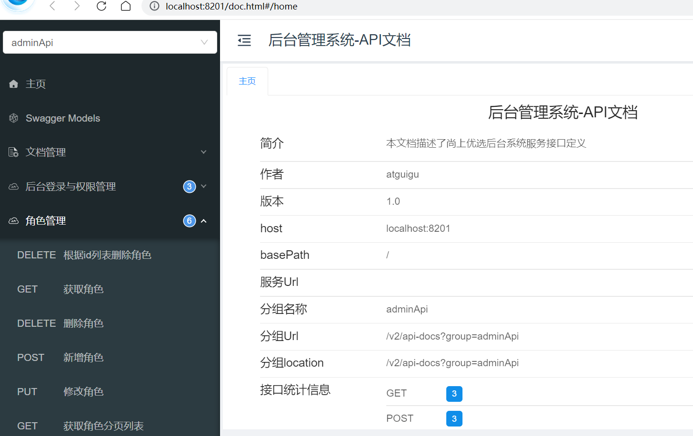
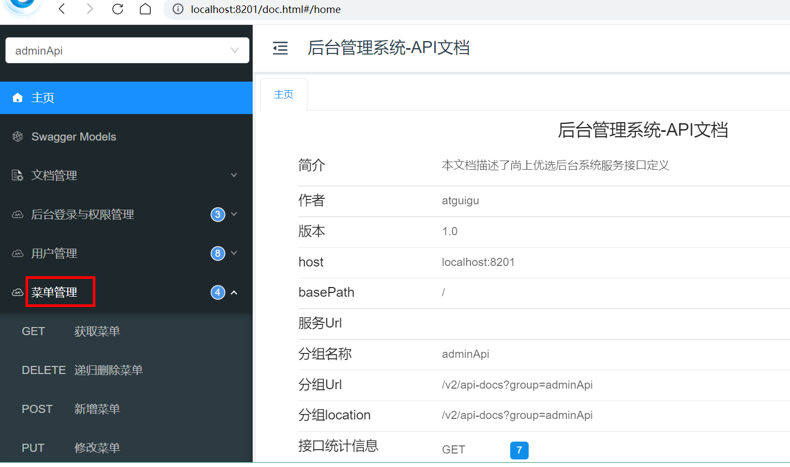
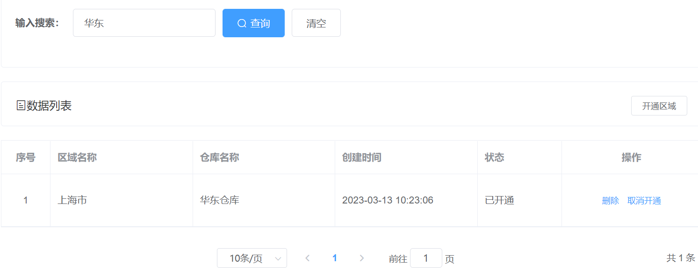
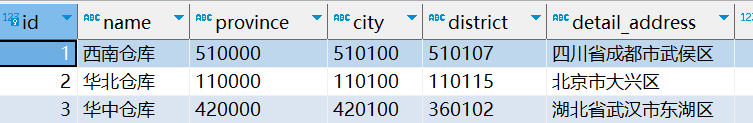
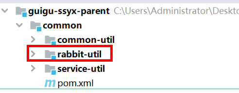
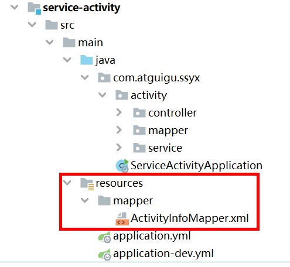
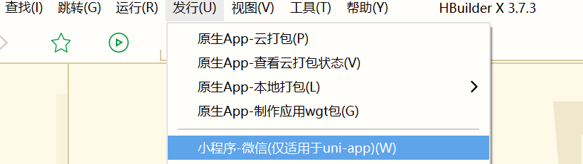

# 企业级微服务架构项目-尚上优选

## 一 项目概述

### 1 项目介绍

社区团购是真实居住社区内居民团体的一种互联网线上线下购物消费行为，是依托真实社区的一种区域化、小众化、本地化、网络化的团购形式。简而言之，它是依托社区和团长社交关系实现生鲜商品流通的新零售模式。

比如：

**美团优选** 是美团旗下的一个社区团购平台，通过自建和加盟的方式，在全国建立了大仓、网格仓、线下服务门店的物流配送体系。美团优选卖的东西也特别的全，蔬菜、水果、肉类、蛋类，然后海鲜等等。


**多多买菜，**它是拼多多旗下的产品，拼多多现在已经是全中国最大的生鲜电商了，它和全国超过一千个农产品产区达成合作。


### 2 业务流程

从具体模式看，主要围绕平台、团长、用户三个角色展开：

1、团长（如社区宝妈、便利店老板等）创建一个群，提前发布优惠商品的链接供用户购买，团长从中抽取佣金；

2、用户提前一天下单；

3、平台在收集好订单之后，调动供应链，从仓库发货到自提点（团长家或者便利店）；

4、用户前往自提点提货


### 3 功能架构

**功能架构分为三层**

1、前台会员应用层

2、前台团长应用层

3、基础模块支撑层


### 4 技术架构


### 5 核心技术

SpringBoot：简化新Spring应用的初始搭建以及开发过程

SpringCloud：基于Spring Boot实现的云原生应用开发工具，SpringCloud使用的技术：（Spring Cloud Gateway、Spring Cloud OpenFeign、Spring Cloud Alibaba Nacos等）

MyBatis-Plus：持久层框架

Redis：缓存数据库

Redisson：基于redis的Java驻内存数据网格，实现分布式锁

RabbitMQ：消息中间件

ElasticSearch +Kibana: 全文检索服务器 +可视化数据监控

ThreadPoolExecutor：线程池来实现异步操作，提高效率

OSS：文件存储服务

Knife4j（Swagger）：Api接口文档工具

Nginx：负载均衡

MySQL：关系型数据库

微信支付

微信小程序

Docker：容器技术

DockerFile：管理Docker镜像命令文本


### 6 项目模块

最终服务器端架构模块


guigu-ssyx-parent：父工程，根目录，管理子模块：

​	common：公共类父模块

​		common-util：核心工具类

​		service-util：service模块工具类

​		rabbit-util：RabbitMQ工具类

​	model：实体类模块

​	service：系统微服务模块

​    service-client：系统远程调用封装模块


### 7 其他资源

实体类、数据库脚本、项目中使用的工具类、前端源码等都在资料文件夹中，实体类直接复制到model模块，后续不做说明。


## 二 前后端分离开发概述

### 1 什么是前后端分离开发

前后端分离开发，就是在项目开发过程中，对于前端的代码专门由前端的开发人员开发，后端代码由后端人员负责，这样可以做到分工明确、各司其职，进而提高开发效率，前后端代码并行开发，加快项目的开发进度。目前前后端分离被各大公司使用，成为项目开发的主流开发方式。前后端分离开发后，工程结构也会发生变化，即前后端代码不会混在同一个maven工程中，而是分为前端工程和后端工程。

在美国等互联网环境比较发达的国家项目开发的分工协作更为明确，整个项目开发分为前端、中间层和后端三个开发阶段，这三个阶段分别由三个或者更多的人来协同完成。国内的大部分互联网公司只有前端工程师和后端工程师，中间层的工作有的由前端来完成，有的由后端来完成。


### 2 开发流程介绍


前后端分离开发过程中，前端人员和后端人员要进行配合来共同完成一个任务。这个时候需要使用到接口。
接口（API接口）：是一个http的请求地址，主要是定义：请求路径、请求方式、请求参数、响应数据等内容。
（1）后端编写和维护接口文档，在 API 变化时更新接口文档
（2）后端根据接口文档进行接口开发
（3）前端根据接口文档进行开发
（4）开发完成后联调和提交测试

后端开发人员为前端提供接口的同时，还需同时提供接口的说明文档。但我们的代码总是会根据实际情况来实时更新，这个时候有可能会忘记更新接口的说明文档，造成一些不必要的问题。我们可以通过一些工具生成接口文档，做到文档实时更新。**Swagger** 是一个规范和完整的框架，用于生成、描述、调用和可视化 RESTful 风格的 Web 服务的接口文档。


## 三 搭建后端环境

### 1 搭建项目结构

**项目结构：**


#### 1.1 搭建父工程guigu-ssyx-parent

管理子模块及依赖

GroupId：com.atguigu

ArtifactId：guigu-ssyx-parent


#### 1.2 搭建工具类父模块common

工具类父模块，继承父工程guigu-ssyx-parent

GroupId：com.atguigu

ArtifactId：common


#### 1.3 搭建工具类模块common-util

核心工具类，继承common模块

GroupId：com.atguigu

ArtifactId：common-util


#### 1.4 搭建工具类模块service-util

service模块工具类，继承common模块

GroupId：com.atguigu

ArtifactId：service-util

搭建方式如：common-util


#### 1.5 搭建实体类模块model

实体类，继承guigu-ssyx-parent

搭建方式如：common

引入资料中java实体类相关代码


#### 1.6 搭建项目模块service

service服务模块，继承guigu-ssyx-parent

搭建方式如：common


### 2 配置依赖关系

#### 2.1 guigu-ssyx-parent父工程管理依赖版本

修改guigu-ssyx-parent模块pom.xml文件

```xml
<?xml version="1.0" encoding="UTF-8"?>
<project xmlns="http://maven.apache.org/POM/4.0.0"
         xmlns:xsi="http://www.w3.org/2001/XMLSchema-instance"
         xsi:schemaLocation="http://maven.apache.org/POM/4.0.0 http://maven.apache.org/xsd/maven-4.0.0.xsd">
    <modelVersion>4.0.0</modelVersion>

    <groupId>com.atguigu</groupId>
    <artifactId>guigu-ssyx-parent</artifactId>
    <packaging>pom</packaging>
    <version>1.0-SNAPSHOT</version>
    <modules>
        <module>common</module>
        <module>model</module>
        <module>service</module>
    </modules>

    <parent>
        <groupId>org.springframework.boot</groupId>
        <artifactId>spring-boot-starter-parent</artifactId>
        <version>2.3.6.RELEASE</version>
    </parent>

    <properties>
        <skipTests>true</skipTests>
        <java.version>1.8</java.version>
        <cloud.version>Hoxton.SR8</cloud.version>
        <alibaba.version>2.2.2.RELEASE</alibaba.version>
        <mybatis-plus.version>3.4.1</mybatis-plus.version>
        <mysql.version>8.0.30</mysql.version>
        <jwt.version>0.7.0</jwt.version>
        <fastjson.version>2.0.0</fastjson.version>
        <httpclient.version>4.5.1</httpclient.version>
        <easyexcel.version>3.1.0</easyexcel.version>
        <aliyun.version>4.1.1</aliyun.version>
        <oss.version>3.9.1</oss.version>
        <knife4j.version>2.0.8</knife4j.version>
        <jodatime.version>2.10.1</jodatime.version>
        <xxl-job.version>2.3.0</xxl-job.version>
    </properties>

    <!--配置dependencyManagement锁定依赖的版本-->
    <dependencyManagement>
        <dependencies>
            <dependency>
                <groupId>org.springframework.cloud</groupId>
                <artifactId>spring-cloud-dependencies</artifactId>
                <version>${cloud.version}</version>
                <type>pom</type>
                <scope>import</scope>
            </dependency>
            <dependency>
                <groupId>com.alibaba.cloud</groupId>
                <artifactId>spring-cloud-alibaba-dependencies</artifactId>
                <version>${alibaba.version}</version>
                <type>pom</type>
                <scope>import</scope>
            </dependency>
            <!--mybatis-plus 持久层-->
            <dependency>
                <groupId>com.baomidou</groupId>
                <artifactId>mybatis-plus-boot-starter</artifactId>
                <version>${mybatis-plus.version}</version>
            </dependency>
            <dependency>
                <groupId>mysql</groupId>
                <artifactId>mysql-connector-java</artifactId>
                <version>${mysql.version}</version>
            </dependency>
            <dependency>
                <groupId>com.github.xiaoymin</groupId>
                <artifactId>knife4j-spring-boot-starter</artifactId>
                <version>2.0.8</version>
            </dependency>
            <dependency>
                <groupId>io.jsonwebtoken</groupId>
                <artifactId>jjwt</artifactId>
                <version>${jwt.version}</version>
            </dependency>
            <dependency>
                <groupId>org.apache.httpcomponents</groupId>
                <artifactId>httpclient</artifactId>
                <version>${httpclient.version}</version>
            </dependency>
            <dependency>
                <groupId>com.alibaba</groupId>
                <artifactId>fastjson</artifactId>
                <version>${fastjson.version}</version>
            </dependency>
            <dependency>
                <groupId>com.alibaba</groupId>
                <artifactId>easyexcel</artifactId>
                <version>${easyexcel.version}</version>
            </dependency>
            <dependency>
                <groupId>com.aliyun</groupId>
                <artifactId>aliyun-java-sdk-core</artifactId>
                <version>${aliyun.version}</version>
            </dependency>
            <!--日期时间工具-->
            <dependency>
                <groupId>joda-time</groupId>
                <artifactId>joda-time</artifactId>
                <version>${jodatime.version}</version>
            </dependency>
            <dependency>
                <groupId>com.xuxueli</groupId>
                <artifactId>xxl-job-core</artifactId>
                <version>${xxl-job.version}</version>
            </dependency>
        </dependencies>
    </dependencyManagement>
    <repositories>
        <repository>
            <id>nexus-aliyun</id>
            <name>Nexus aliyun</name>
            <layout>default</layout>
            <url>https://maven.aliyun.com/repository/public</url>
            <snapshots>
                <enabled>false</enabled>
            </snapshots>
            <releases>
                <enabled>true</enabled>
            </releases>
        </repository>
        <repository>
            <id>spring</id>
            <url>https://maven.aliyun.com/repository/spring</url>
            <releases>
                <enabled>true</enabled>
            </releases>
            <snapshots>
                <enabled>true</enabled>
            </snapshots>
        </repository>
    </repositories>
</project>
```


#### 2.2 common模块

common公共父模块

```xml
<?xml version="1.0" encoding="UTF-8"?>
<project xmlns="http://maven.apache.org/POM/4.0.0"
         xmlns:xsi="http://www.w3.org/2001/XMLSchema-instance"
         xsi:schemaLocation="http://maven.apache.org/POM/4.0.0 http://maven.apache.org/xsd/maven-4.0.0.xsd">
    <parent>
        <artifactId>guigu-ssyx-parent</artifactId>
        <groupId>com.atguigu</groupId>
        <version>1.0-SNAPSHOT</version>
    </parent>
    <modelVersion>4.0.0</modelVersion>

    <artifactId>common</artifactId>
    <packaging>pom</packaging>
    <modules>
        <module>common-util</module>
        <module>service-util</module>
    </modules>

    <dependencies>
        <dependency>
            <groupId>org.springframework.boot</groupId>
            <artifactId>spring-boot-starter-web</artifactId>
            <scope>provided </scope>
        </dependency>

        <!--lombok用来简化实体类：需要安装lombok插件-->
        <dependency>
            <groupId>org.projectlombok</groupId>
            <artifactId>lombok</artifactId>
        </dependency>
        <!-- https://doc.xiaominfo.com/knife4j/documentation/ -->
        <dependency>
            <groupId>com.github.xiaoymin</groupId>
            <artifactId>knife4j-spring-boot-starter</artifactId>
        </dependency>

        <!--用来转换json使用 {JavaObject - json | json - JavaObject}-->
        <dependency>
            <groupId>com.alibaba</groupId>
            <artifactId>fastjson</artifactId>
        </dependency>

        <!-- 服务调用feign -->
        <dependency>
            <groupId>org.springframework.cloud</groupId>
            <artifactId>spring-cloud-starter-openfeign</artifactId>
            <scope>provided </scope>
        </dependency>

    </dependencies>
</project>
```


#### 2.3 common-util模块

```xml
<?xml version="1.0" encoding="UTF-8"?>
<project xmlns="http://maven.apache.org/POM/4.0.0"
         xmlns:xsi="http://www.w3.org/2001/XMLSchema-instance"
         xsi:schemaLocation="http://maven.apache.org/POM/4.0.0 http://maven.apache.org/xsd/maven-4.0.0.xsd">
    <parent>
        <artifactId>common</artifactId>
        <groupId>com.atguigu</groupId>
        <version>1.0-SNAPSHOT</version>
    </parent>
    <modelVersion>4.0.0</modelVersion>

    <artifactId>common-util</artifactId>

    <!--添加依赖-->
    <dependencies>
        <dependency>
            <groupId>org.apache.httpcomponents</groupId>
            <artifactId>httpclient</artifactId>
        </dependency>

        <dependency>
            <groupId>io.jsonwebtoken</groupId>
            <artifactId>jjwt</artifactId>
        </dependency>

        <dependency>
            <groupId>joda-time</groupId>
            <artifactId>joda-time</artifactId>
        </dependency>
        
        <dependency>
            <groupId>com.atguigu</groupId>
            <artifactId>model</artifactId>
            <version>1.0-SNAPSHOT</version>
            <scope>provided</scope>
        </dependency>
    </dependencies>
</project>
```


#### 2.4 service-util模块

```xml
<?xml version="1.0" encoding="UTF-8"?>
<project xmlns="http://maven.apache.org/POM/4.0.0"
         xmlns:xsi="http://www.w3.org/2001/XMLSchema-instance"
         xsi:schemaLocation="http://maven.apache.org/POM/4.0.0 http://maven.apache.org/xsd/maven-4.0.0.xsd">
    <parent>
        <artifactId>common</artifactId>
        <groupId>com.atguigu</groupId>
        <version>1.0-SNAPSHOT</version>
    </parent>
    <modelVersion>4.0.0</modelVersion>

    <artifactId>service-util</artifactId>

    <dependencies>
        <dependency>
            <groupId>com.atguigu</groupId>
            <artifactId>common-util</artifactId>
            <version>1.0-SNAPSHOT</version>
        </dependency>

        <!-- redis -->
        <dependency>
            <groupId>org.springframework.boot</groupId>
            <artifactId>spring-boot-starter-data-redis</artifactId>
        </dependency>

        <!-- spring2.X集成redis所需common-pool2-->
        <dependency>
            <groupId>org.apache.commons</groupId>
            <artifactId>commons-pool2</artifactId>
            <version>2.6.0</version>
        </dependency>

        <!-- redisson 分布式锁-->
        <dependency>
            <groupId>org.redisson</groupId>
            <artifactId>redisson</artifactId>
            <version>3.11.2</version>
        </dependency>

        <!--mybatis-plus-->
        <dependency>
            <groupId>com.baomidou</groupId>
            <artifactId>mybatis-plus-boot-starter</artifactId>
            <scope>provided</scope>
        </dependency>
        <dependency>
            <groupId>com.atguigu</groupId>
            <artifactId>model</artifactId>
            <version>1.0-SNAPSHOT</version>
            <scope>compile</scope>
        </dependency>
    </dependencies>
</project>
```


#### 2.5 model模块

```xml
<?xml version="1.0" encoding="UTF-8"?>
<project xmlns="http://maven.apache.org/POM/4.0.0"
         xmlns:xsi="http://www.w3.org/2001/XMLSchema-instance"
         xsi:schemaLocation="http://maven.apache.org/POM/4.0.0 http://maven.apache.org/xsd/maven-4.0.0.xsd">
    <parent>
        <artifactId>guigu-ssyx-parent</artifactId>
        <groupId>com.atguigu</groupId>
        <version>1.0-SNAPSHOT</version>
    </parent>
    <modelVersion>4.0.0</modelVersion>

    <artifactId>model</artifactId>

    <dependencies>
        <dependency>
            <groupId>org.projectlombok</groupId>
            <artifactId>lombok</artifactId>
        </dependency>

        <!--mybatis-plus-->
        <dependency>
            <groupId>com.baomidou</groupId>
            <artifactId>mybatis-plus-boot-starter</artifactId>
            <scope>provided </scope>
        </dependency>
        
        <dependency>
            <groupId>com.github.xiaoymin</groupId>
            <artifactId>knife4j-spring-boot-starter</artifactId>
            <!--在引用时请在maven中央仓库搜索2.X最新版本号-->
            <scope>provided</scope>
        </dependency>

        <dependency>
            <groupId>org.springframework.boot</groupId>
            <artifactId>spring-boot-starter-data-mongodb</artifactId>
            <scope>provided </scope>
        </dependency>

        <dependency>
            <groupId>com.alibaba</groupId>
            <artifactId>fastjson</artifactId>
            <scope>provided </scope>
        </dependency>

        <!--创建索引库的-->
        <dependency>
            <groupId>org.springframework.boot</groupId>
            <artifactId>spring-boot-starter-data-elasticsearch</artifactId>
            <scope>provided </scope>
        </dependency>
    </dependencies>
</project>
```


**idea中安装lombok插件**


#### 2.6 service模块

```xml
<?xml version="1.0" encoding="UTF-8"?>
<project xmlns="http://maven.apache.org/POM/4.0.0"
         xmlns:xsi="http://www.w3.org/2001/XMLSchema-instance"
         xsi:schemaLocation="http://maven.apache.org/POM/4.0.0 http://maven.apache.org/xsd/maven-4.0.0.xsd">
    <parent>
        <artifactId>guigu-ssyx-parent</artifactId>
        <groupId>com.atguigu</groupId>
        <version>1.0-SNAPSHOT</version>
    </parent>
    <modelVersion>4.0.0</modelVersion>

    <artifactId>service</artifactId>

    <dependencies>
        <!--依赖服务的工具类-->
        <dependency>
            <groupId>com.atguigu</groupId>
            <artifactId>service-util</artifactId>
            <version>1.0-SNAPSHOT</version>
        </dependency>
        <!--数据载体-->
        <dependency>
            <groupId>com.atguigu</groupId>
            <artifactId>model</artifactId>
            <version>1.0-SNAPSHOT</version>
        </dependency>

        <!--web 需要启动项目-->
        <dependency>
            <groupId>org.springframework.boot</groupId>
            <artifactId>spring-boot-starter-web</artifactId>
        </dependency>

        <!--mybatis-plus-->
        <dependency>
            <groupId>com.baomidou</groupId>
            <artifactId>mybatis-plus-boot-starter</artifactId>
        </dependency>

        <!--mysql-->
        <dependency>
            <groupId>mysql</groupId>
            <artifactId>mysql-connector-java</artifactId>
        </dependency>

        <!-- 服务注册 -->
        <dependency>
            <groupId>com.alibaba.cloud</groupId>
            <artifactId>spring-cloud-starter-alibaba-nacos-discovery</artifactId>
        </dependency>

        <!-- 服务调用feign -->
        <dependency>
            <groupId>org.springframework.cloud</groupId>
            <artifactId>spring-cloud-starter-openfeign</artifactId>
        </dependency>

        <!-- 流量控制 -->
        <dependency>
            <groupId>com.alibaba.cloud</groupId>
            <artifactId>spring-cloud-starter-alibaba-sentinel</artifactId>
        </dependency>

        <!--开发者工具-->
        <dependency>
            <groupId>org.springframework.boot</groupId>
            <artifactId>spring-boot-devtools</artifactId>
            <optional>true</optional>
        </dependency>
    </dependencies>
</project>
```


### 3 准备接口相关工具类

**操作service-util模块**


#### 3.1 编写MybatisPlus配置类

**MyBatis-Plus**（简称 MP）是一个**MyBatis的增强工具**，在 MyBatis 的基础上只做增强不做改变，为简化开发、提高效率而生。只需简单配置即可快速进行**单表的CURD操作**，同时提供了**自动分页，代码生成，逻辑删除**等丰富的功能。

**（1）配置Mapper扫描**

**（2）配置MyBatisPlus分页插件**

```java
package com.atguigu.ssyx.common.config;

import com.baomidou.mybatisplus.annotation.DbType;
import com.baomidou.mybatisplus.extension.plugins.MybatisPlusInterceptor;
import com.baomidou.mybatisplus.extension.plugins.inner.OptimisticLockerInnerInterceptor;
import com.baomidou.mybatisplus.extension.plugins.inner.PaginationInnerInterceptor;
import org.mybatis.spring.annotation.MapperScan;
import org.springframework.context.annotation.Bean;
import org.springframework.context.annotation.Configuration;
import org.springframework.transaction.annotation.EnableTransactionManagement;

/**
 * MybatisPlus配置类
 */
@EnableTransactionManagement
@Configuration
@MapperScan("com.atguigu.ssyx.*.mapper")
public class MybatisPlusConfig {

    /**
     * mp插件
     */
    @Bean
    public MybatisPlusInterceptor optimisticLockerInnerInterceptor(){
        MybatisPlusInterceptor interceptor = new MybatisPlusInterceptor();
        //向Mybatis过滤器链中添加分页拦截器
        interceptor.addInnerInterceptor(new PaginationInnerInterceptor(DbType.MYSQL));
        return interceptor;
    }
}
```


#### 3.2 编写统一返回结果类

项目中我们会将接口返回的数据封装成Json数据格式，一般我们会将所有接口的数据格式统一， 使前端(iOS Android, Web)对数据的操作更一致、轻松。一般情况下，统一返回数据格式没有固定的格式，只要能描述清楚返回的数据状态以及要返回的具体数据就可以。但是一般会包含状态码、返回消息、数据这几部分内容。

例如，我们的系统要求返回的基本数据格式如下：

**列表：**

```json
{
  "code": 200,
  "message": "成功",
  "data": [
    {
      "id": 2,
      "roleName": "系统管理员"
    }
  ],
  "ok": true
}
```

**分页：**

```json
{
  "code": 200,
  "message": "成功",
  "data": {
    "records": [
      {
        "id": 2,
        "roleName": "系统管理员"
      },
      {
        "id": 3,
        "name": "普通管理员"
      }
    ],
    "total": 10,
    "size": 3,
    "current": 1,
    "orders": [],
    "hitCount": false,
    "searchCount": true,
    "pages": 2
  },
  "ok": true
}
```

**没有返回数据：**

```json
{
  "code": 200,
  "message": "成功",
  "data": null,
  "ok": true
}
```

**失败：**

```json
{
  "code": 201,
  "message": "失败",
  "data": null,
  "ok": false
}
```


##### 3.2.1 创建统一返回结果状态信息类

```java
package com.atguigu.ssyx.common.result;

import lombok.Getter;
/**
 * 统一返回结果状态信息类
 *
 */
@Getter
public enum ResultCodeEnum {

    SUCCESS(200,"成功"),
    FAIL(201, "失败"),
    SERVICE_ERROR(2012, "服务异常"),
    DATA_ERROR(204, "数据异常"),
    ILLEGAL_REQUEST(205, "非法请求"),
    REPEAT_SUBMIT(206, "重复提交"),

    LOGIN_AUTH(208, "未登陆"),
    PERMISSION(209, "没有权限"),

    ORDER_PRICE_ERROR(210, "订单商品价格变化"),
    ORDER_STOCK_FALL(204, "订单库存锁定失败"),
    CREATE_ORDER_FAIL(210, "创建订单失败"),

    COUPON_GET(220, "优惠券已经领取"),
    COUPON_LIMIT_GET(221, "优惠券已发放完毕"),

    URL_ENCODE_ERROR( 216, "URL编码失败"),
    ILLEGAL_CALLBACK_REQUEST_ERROR( 217, "非法回调请求"),
    FETCH_ACCESSTOKEN_FAILD( 218, "获取accessToken失败"),
    FETCH_USERINFO_ERROR( 219, "获取用户信息失败"),


    SKU_LIMIT_ERROR(230, "购买个数不能大于限购个数"),
    REGION_OPEN(240, "该区域已开通"),
    REGION_NO_OPEN(240, "该区域未开通"),
    ;

    private Integer code;

    private String message;

    private ResultCodeEnum(Integer code, String message) {
        this.code = code;
        this.message = message;
    }
}
```


##### 3.2.2 创建统一返回结果类

```java
package com.atguigu.ssyx.common.result;

import lombok.Data;

@Data
public class Result<T> {

    //状态码
    private Integer code;
    //信息
    private String message;
    //数据
    private T data;

    //构造私有化
    private Result() { }

    //设置数据,返回对象的方法
    public static<T> Result<T> build(T data,ResultCodeEnum resultCodeEnum) {
        //创建Resullt对象，设置值，返回对象
        Result<T> result = new Result<>();
        //判断返回结果中是否需要数据
        if(data != null) {
            //设置数据到result对象
            result.setData(data);
        }
        //设置其他值
        result.setCode(resultCodeEnum.getCode());
        result.setMessage(resultCodeEnum.getMessage());
        //返回设置值之后的对象
        return result;
    }

    //成功的方法
    public static<T> Result<T> ok(T data) {
        Result<T> result = build(data, ResultCodeEnum.SUCCESS);
        return result;
    }

    //失败的方法
    public static<T> Result<T> fail(T data) {
        return build(data,ResultCodeEnum.FAIL);
    }
}
```


#### 3.3 编写统一异常处理类

系统在运行过程中如果出现了异常，默认会直接返回异常信息，比如500错误提示。但是我们想让异常结果也显示为统一的返回结果对象，并且统一处理系统的异常信息，那么需要进行统一异常处理。

##### 3.3.1 全局异常处理

```java
package com.atguigu.ssyx.common.exception;

import com.atguigu.ssyx.common.result.Result;
import org.springframework.web.bind.annotation.ControllerAdvice;
import org.springframework.web.bind.annotation.ExceptionHandler;
import org.springframework.web.bind.annotation.ResponseBody;

@ControllerAdvice
public class GlobalExceptionHandler {

    @ExceptionHandler(Exception.class)
    @ResponseBody
    public Result error(Exception e){
        e.printStackTrace();
        return Result.fail(null);
    }
}
```

##### 3.3.2 自定义异常处理

创建自定义异常类

```java
package com.atguigu.ssyx.common.exception;

import com.atguigu.ssyx.common.result.ResultCodeEnum;
import lombok.Data;

@Data
public class SsyxException extends RuntimeException{

    //异常状态码
    private Integer code;

    /**
     * 通过状态码和错误消息创建异常对象
     * @param message
     * @param code
     */
    public SsyxException(String message, Integer code) {
        super(message);
        this.code = code;
    }

    /**
     * 接收枚举类型对象
     * @param resultCodeEnum
     */
    public SsyxException(ResultCodeEnum resultCodeEnum) {
        super(resultCodeEnum.getMessage());
        this.code = resultCodeEnum.getCode();
    }

    @Override
    public String toString() {
        return "GuliException{" +
                "code=" + code +
                ", message=" + this.getMessage() +
                '}';
    }
}
```

在GlobalExceptionHandler添加方法

```java
    /**
     * 自定义异常处理方法
     * @param e
     * @return
     */
    @ExceptionHandler(SsyxException.class)
    @ResponseBody
    public Result error(SsyxException e){
        return Result.build(null,e.getCode(), e.getMessage());
    }
```


#### 3.4 编写Swagger配置类

##### 3.4.1 Swagger介绍

前后端分离开发模式中，API文档是最好的沟通方式。Swagger 是一个规范和完整的框架，用于生成、描述、调用和可视化 RESTful 风格的 Web 服务。具有以下几个特点：

1、及时性 (接口变更后，能够及时准确地通知相关前后端开发人员)

2、规范性 (并且保证接口的规范性，如接口的地址，请求方式，参数及响应格式和错误信息)

3、一致性 (接口信息一致，不会出现因开发人员拿到的文档版本不一致，而出现分歧)

4、可测性 (直接在接口文档上进行测试，以方便理解业务)

##### 3.4.2 集成knife4j

文档地址：https://doc.xiaominfo.com/

knife4j是为Java MVC框架集成Swagger生成Api文档的增强解决方案。

knife4j属于service模块公共资源，因此我们集成到service-uitl模块

##### 3.4.3 添加依赖

common模块添加依赖

```xml
<dependency>
    <groupId>com.github.xiaoymin</groupId>
    <artifactId>knife4j-spring-boot-starter</artifactId>
</dependency>
```

##### 3.4.4 添加配置类

```java
package com.atguigu.ssyx.common.config;

import org.springframework.context.annotation.Bean;
import org.springframework.context.annotation.Configuration;
import springfox.documentation.builders.ApiInfoBuilder;
import springfox.documentation.builders.ParameterBuilder;
import springfox.documentation.builders.PathSelectors;
import springfox.documentation.builders.RequestHandlerSelectors;
import springfox.documentation.schema.ModelRef;
import springfox.documentation.service.ApiInfo;
import springfox.documentation.service.Contact;
import springfox.documentation.service.Parameter;
import springfox.documentation.spi.DocumentationType;
import springfox.documentation.spring.web.plugins.Docket;
import springfox.documentation.swagger2.annotations.EnableSwagger2WebMvc;
import java.util.ArrayList;
import java.util.List;

/**
 * Swagger2配置信息
 */
@Configuration
@EnableSwagger2WebMvc
public class Swagger2Config {

    @Bean
    public Docket webApiConfig(){
        List<Parameter> pars = new ArrayList<>();
        ParameterBuilder tokenPar = new ParameterBuilder();
        tokenPar.name("userId")
                .description("用户token")
                //.defaultValue(JwtHelper.createToken(1L, "admin"))
                .defaultValue("1")
                .modelRef(new ModelRef("string"))
                .parameterType("header")
                .required(false)
                .build();
        pars.add(tokenPar.build());

        Docket webApi = new Docket(DocumentationType.SWAGGER_2)
                .groupName("webApi")
                .apiInfo(webApiInfo())
                .select()
                //只显示api路径下的页面
                .apis(RequestHandlerSelectors.basePackage("com.atguigu.ssyx"))
                .paths(PathSelectors.regex("/api/.*"))
                .build()
                .globalOperationParameters(pars);
        return webApi;
    }

    @Bean
    public Docket adminApiConfig(){
        List<Parameter> pars = new ArrayList<>();
        ParameterBuilder tokenPar = new ParameterBuilder();
        tokenPar.name("adminId")
                .description("用户token")
                .defaultValue("1")
                .modelRef(new ModelRef("string"))
                .parameterType("header")
                .required(false)
                .build();
        pars.add(tokenPar.build());

        Docket adminApi = new Docket(DocumentationType.SWAGGER_2)
                .groupName("adminApi")
                .apiInfo(adminApiInfo())
                .select()
                //只显示admin路径下的页面
                .apis(RequestHandlerSelectors.basePackage("com.atguigu.ssyx"))
                .paths(PathSelectors.regex("/admin/.*"))
                .build()
                .globalOperationParameters(pars);
        return adminApi;
    }

    private ApiInfo webApiInfo(){
        return new ApiInfoBuilder()
                .title("网站-API文档")
                .description("本文档描述了尚上优选网站微服务接口定义")
                .version("1.0")
                .contact(new Contact("atguigu", "http://atguigu.com", "atguigu"))
                .build();
    }

    private ApiInfo adminApiInfo(){
        return new ApiInfoBuilder()
                .title("后台管理系统-API文档")
                .description("本文档描述了尚上优选后台系统服务接口定义")
                .version("1.0")
                .contact(new Contact("atguigu", "http://atguigu.com", "atguigu"))
                .build();
    }
}
```


#### 3.5 准备实体类

**从资源文件夹中导入实体类到model模块**


## 四 尚上优选平台管理端

### 1 搭建平台管理端前端环境

#### 1.1 安装相关软件

##### 1.1.1 安装Nodejs

Node.js是一个事件驱动I/O服务端JavaScript环境，基于Google的V8引擎，V8引擎执行Javascript的速度非常快，性能非常好。简单的说 Node.js 就是运行在服务端的 JavaScript。

官网：https://nodejs.org/en/

中文网：http://nodejs.cn/

LTS：长期支持版本

Current：最新版

**本课程采用的是 node-v16.16.0-x64.msi**

```shell
node -v  #如果可以看到版本号，证明安装成功
```


如果报以下错误将VS Code以管理员方式运行即可


##### 1.1.2 安装vscode

**（1）下载地址**

https://code.visualstudio.com/

**（2）插件安装**

为方便后续开发，建议安装如下插件


**（3）创建项目**

vscode本身没有新建项目的选项，所以要先创建一个空的文件夹，如project_xxxx。

然后打开vscode，再在vscode里面选择 File -> Open Folder 打开文件夹，这样才可以创建项目。

**（4）保存工作区**

打开文件夹后，选择“文件 -> 将工作区另存为...”，为工作区文件起一个名字，存储在刚才的文件夹下即可

**（5）设置字体大小**

左边栏Manage -> settings -> 搜索 “font” -> Font size


#### 1.2 导入前端项目

##### 1.2.1 Vue 脚手架介绍

Vue-cli(俗称：Vue 脚手架)是 vue 官方提供的、快速生成 vue 工程化项目的工具。
特点：① 开箱即用，② 基于 webpack，③ 功能丰富且易于扩展，④ 支持创建 vue2 和 vue3 的项目

##### （1）创建并运行项目

```shell
#全局安装命令行工具
npm install --location=global @vue/cli
#创建一个项目
vue create vue-test #选择vue2
#进入到项目目录
cd vue-test
#启动程序
npm run serve
```

##### （2）访问项目

默认8080端口

http://127.0.0.1:8080/


##### 1.2.2 vue-admin-template介绍

（1）vue-element-admin是基于Vue和Element-ui 的一套后台管理系统集成方案。vue-admin-template是基于vue-element-admin的一套后台管理系统基础模板（最少精简版），可作为模板进行二次开发。

GitHub地址：https://github.com/PanJiaChen/vue-admin-template

（2）Vue是一套用于构建用户界面的渐进式框架。Vue 的核心库只关注视图层，不仅易于上手，还便于与第三方库或既有项目整合。另一方面，当与现代化的工具链以及各种支持类库结合使用时，Vue 也完全能够为复杂的单页应用提供驱动。

（3）element-ui 是饿了么前端出品的基于 Vue.js的 后台组件库，方便程序员进行页面快速布局和构建。

##### 1.2.3 复制项目到工作区

从资料中找到平台管理端前端代码 **ssyx-admin** 复制到工作区

##### 1.2.4 下载项目依赖

进入项目所在目录，使用命令 **npm install** 下载依赖


##### 1.2.5 启动前端项目

进入项目所在目录，使用命令 **npm run dev** 启动项目


#### 1.3 改造登录功能

##### 1.3.1 登录接口

**搭建模块，查看2.1章节**

创建IndexController

```java
package com.atguigu.ssyx.acl.controller;

import com.atguigu.ssyx.common.result.Result;
import io.swagger.annotations.Api;
import lombok.extern.slf4j.Slf4j;
import org.springframework.beans.factory.annotation.Autowired;
import org.springframework.data.redis.core.RedisTemplate;
import org.springframework.web.bind.annotation.*;
import javax.servlet.http.HttpServletRequest;
import javax.servlet.http.HttpServletResponse;
import java.util.HashMap;
import java.util.Map;
import java.util.concurrent.TimeUnit;

@RestController
@RequestMapping("/admin/acl/index")
@CrossOrigin     //跨域
public class IndexController {

    /**
     * 1、请求登陆的login
     */
    @PostMapping("login")
    public Result login() {
        Map<String,Object> map = new HashMap<>();
        map.put("token","admin-token");
        return Result.ok(map);
    }

}
```

##### 1.3.2 获取用户信息接口

```java
    /**
     * 2 获取用户信息
     */
    @GetMapping("info")
    public Result info(){
        Map<String,Object> map = new HashMap<>();
        map.put("name","atguigu");
        map.put("avatar","https://wpimg.wallstcn.com/f778738c-e4f8-4870-b634-56703b4acafe.gif");
        return Result.ok(map);
    }

    /**
     * 3 退出
     */
    @PostMapping("logout")
    public Result logout(){
        return Result.ok();
    }
```

##### 1.3.3 修改前端整合登录

**（1）修改src -> api -> user.js**

修改为本地接口路径

```javascript
import request from '@/utils/request'

export function login(data) {
  return request({
    url: '/admin/acl/index/login',
    method: 'post',
    data
  })
}

export function getInfo(token) {
  return request({
    url: '/admin/acl/index/info',
    method: 'get',
    params: { token }
  })
}

export function logout() {
  return request({
    url: '/admin/acl/index/logout',
    method: 'post'
  })
}
```

**（2）修改utils -> request.js**

修改响应状态码是200

```javascript
// response interceptor
service.interceptors.response.use(
  /**
   * If you want to get http information such as headers or status
   * Please return  response => response
  */

  /**
   * Determine the request status by custom code
   * Here is just an example
   * You can also judge the status by HTTP Status Code
   */
  response => {
    const res = response.data

    // 修改为200   if the custom code is not 20000, it is judged as an error.
    if (res.code !== 200) {
      Message({
        message: res.message || 'Error',
        type: 'error',
        duration: 5 * 1000
      })
```

**（3）修改.env.development**

修改接口路径为本地

```shell
# just a flag
ENV = 'development'

# base api
# VUE_APP_BASE_API = '/dev-api'
# 修改为本地接口地址
VUE_APP_BASE_API = 'http://localhost:8201'
```


#### 1.4 功能测试

##### 1.4.1 登录功能测试

访问项目：http://localhost:9528/ 


点击登录，如果可以正常进入页面，表示登录成功


### 2 权限管理模块-角色管理

#### 2.1 环境搭建

##### 2.1.1 创建service-acl模块

在service模块下创建子模块service-acl


##### 2.1.2 创建配置文件


**（1）application.yml**

```yaml
spring:
  application:
    name: service-acl
  profiles:
    active: dev
```

**（2）application-dev.yml**

```yaml
server:
  port: 8201

mybatis-plus:
  configuration:
    log-impl: org.apache.ibatis.logging.stdout.StdOutImpl

spring:
  datasource:
    type: com.zaxxer.hikari.HikariDataSource
    driver-class-name: com.mysql.cj.jdbc.Driver
    url: jdbc:mysql://localhost:3306/shequ-acl?characterEncoding=utf-8&useSSL=false
    username: root
    password: root

  jackson:
    date-format: yyyy-MM-dd HH:mm:ss
    time-zone: GMT+8
```

##### 2.1.3 创建启动类

```java
package com.atguigu.ssyx;

import org.springframework.boot.SpringApplication;
import org.springframework.boot.autoconfigure.SpringBootApplication;

//权限管理模块启动类
@SpringBootApplication
public class ServiceAclApplication {

    public static void main(String[] args) {
        SpringApplication.run(ServiceAclApplication.class, args);
    }

}
```

##### 2.1.4 实体类

已经在model模块提前引入了

**实体类说明：**

**@TableName：表名注解，标识实体类对应的表**

**@TableId：主键注解，type = IdType.AUTO（数据库 ID 自增）**

**@TableField：字段注解（非主键）**

**@TableLogic：逻辑删除**

以 Role 角色实体类为例说明：

**Role.java**

```java
@Data     //lombok注解
@ApiModel(description = "角色") //swagger注解提示
@TableName("role")   //实体类对应角色表role
public class Role extends BaseEntity {
	
	private static final long serialVersionUID = 1L;
	
	@ApiModelProperty(value = "角色名称")   //swagger注解提示
	@TableField("role_name")    //属性对应的表的字段 role_name
	private String roleName;

	@ApiModelProperty(value = "备注")
	@TableField("remark")       //属性对应的表的字段 remark
	private String remark;

}
```

**BaseEntity.java**

```java
@Data
public class BaseEntity implements Serializable {

    @ApiModelProperty(value = "id")
    @TableId(type = IdType.AUTO)  //主键注解，type = IdType.AUTO（数据库 ID 自增）
    private Long id;

    @ApiModelProperty(value = "创建时间")
    @JsonFormat(pattern = "yyyy-MM-dd HH:mm:ss")
    @TableField("create_time")
    private Date createTime;

    @ApiModelProperty(value = "更新时间")
    @JsonFormat(pattern = "yyyy-MM-dd HH:mm:ss")
    @TableField("update_time")
    private Date updateTime;

    @ApiModelProperty(value = "逻辑删除(1:已删除，0:未删除)")
    @TableLogic          //逻辑删除
    @TableField("is_deleted")
    private Integer isDeleted;

    @ApiModelProperty(value = "其他参数")
    @TableField(exist = false)    //exist = false 表示表里面没有对应的字段
    private Map<String,Object> param = new HashMap<>();
}
```

##### 2.1.5 创建数据库

使用资料中的数据库脚本运行创建


#### 2.2 开发角色管理接口

操作**shequ-acl**数据库里面**role**角色表，实现role的CURD操作


##### 2.2.1 添加RoleController

```java
package com.atguigu.ssyx.acl.controller;

import com.atguigu.ssyx.acl.service.RoleService;
import com.atguigu.ssyx.common.result.Result;
import com.atguigu.ssyx.model.acl.Role;
import com.atguigu.ssyx.vo.acl.RoleQueryVo;
import com.baomidou.mybatisplus.core.metadata.IPage;
import com.baomidou.mybatisplus.extension.plugins.pagination.Page;
import io.swagger.annotations.Api;
import io.swagger.annotations.ApiOperation;
import io.swagger.annotations.ApiParam;
import lombok.extern.slf4j.Slf4j;
import org.springframework.beans.factory.annotation.Autowired;
import org.springframework.web.bind.annotation.*;
import java.util.List;

/**
 * 角色管理
 */
@RestController
@RequestMapping("/admin/acl/role")
@Api(tags = "用户管理")
@Slf4j
public class RoleController {

    @Autowired
    private RoleService roleService;

    @ApiOperation(value = "获取角色分页列表")
    @GetMapping("{page}/{limit}")
    public Result index(
            @ApiParam(name = "page", value = "当前页码", required = true)
            @PathVariable Long page,

            @ApiParam(name = "limit", value = "每页记录数", required = true)
            @PathVariable Long limit,

            @ApiParam(name = "roleQueryVo", value = "查询对象", required = false)
            RoleQueryVo roleQueryVo) {
        Page<Role> pageParam = new Page<>(page, limit);
        IPage<Role> pageModel = roleService.selectPage(pageParam, roleQueryVo);
        return Result.ok(pageModel);
    }

    @ApiOperation(value = "获取角色")
    @GetMapping("get/{id}")
    public Result get(@PathVariable Long id) {
        Role role = roleService.getById(id);
        return Result.ok(role);
    }

    @ApiOperation(value = "新增角色")
    @PostMapping("save")
    public Result save(@RequestBody Role role) {
        roleService.save(role);
        return Result.ok();
    }

    @ApiOperation(value = "修改角色")
    @PutMapping("update")
    public Result updateById(@RequestBody Role role) {
        roleService.updateById(role);
        return Result.ok();
    }

    @ApiOperation(value = "删除角色")
    @DeleteMapping("remove/{id}")
    public Result remove(@PathVariable Long id) {
        roleService.removeById(id);
        return Result.ok();
    }

    @ApiOperation(value = "根据id列表删除角色")
    @DeleteMapping("batchRemove")
    public Result batchRemove(@RequestBody List<Long> idList) {
        roleService.removeByIds(idList);
        return Result.ok();
    }
}
```

##### 2.2.2 添加Service

**RoleService接口**

```java
package com.atguigu.ssyx.acl.service;

import com.atguigu.ssyx.model.acl.Role;
import com.atguigu.ssyx.vo.acl.RoleQueryVo;
import com.baomidou.mybatisplus.core.metadata.IPage;
import com.baomidou.mybatisplus.extension.plugins.pagination.Page;
import com.baomidou.mybatisplus.extension.service.IService;

public interface RoleService extends IService<Role> {

	//角色分页列表
	IPage<Role> selectPage(Page<Role> pageParam, RoleQueryVo roleQueryVo);

}
```

**RoleServiceImpl实现类**

```java
package com.atguigu.ssyx.acl.service.impl;

import com.atguigu.ssyx.acl.mapper.RoleMapper;
import com.atguigu.ssyx.acl.service.RoleService;
import com.atguigu.ssyx.model.acl.Role;
import com.atguigu.ssyx.vo.acl.RoleQueryVo;
import com.baomidou.mybatisplus.core.conditions.query.LambdaQueryWrapper;
import com.baomidou.mybatisplus.core.metadata.IPage;
import com.baomidou.mybatisplus.extension.plugins.pagination.Page;
import com.baomidou.mybatisplus.extension.service.impl.ServiceImpl;
import org.springframework.stereotype.Service;
import org.springframework.util.StringUtils;

@Service
public class RoleServiceImpl extends ServiceImpl<RoleMapper, Role> 
		                     implements RoleService {

	//角色分页列表
	@Override
	public IPage<Role> selectPage(Page<Role> pageParam, RoleQueryVo roleQueryVo) {
		//获取条件值：角色名称
		String roleName = roleQueryVo.getRoleName();
		//创建条件构造器对象
		LambdaQueryWrapper<Role> wrapper = new LambdaQueryWrapper<>();
		//判断条件值是否为空
		if(!StringUtils.isEmpty(roleName)) {
			//封装条件
			wrapper.like(Role::getRoleName,roleName);
		}
		//调用mapper方法实现条件分页查询
		IPage<Role> pageModel = baseMapper.selectPage(pageParam, wrapper);
		return pageModel;
	}

}
```

##### 2.2.3 添加Mapper

```java
package com.atguigu.ssyx.acl.mapper;

import com.atguigu.ssyx.model.acl.Role;
import com.baomidou.mybatisplus.core.mapper.BaseMapper;
import org.springframework.stereotype.Repository;

@Repository
public interface RoleMapper extends BaseMapper<Role> {
    
}
```

##### 2.2.4 Swagger接口测试

启动项目，访问路径  http://localhost:8201/doc.html 进行接口测试




##### 2.2.5 角色管理前端测试


### 3 权限管理模块-用户管理

#### 3.1 开发用户管理CURD接口

操作**shequ-acl**数据库里面**admin**角色表，实现对admin表操作


##### 3.1.1 添加AdminController

```java
package com.atguigu.ssyx.acl.controller;

import com.atguigu.ssyx.acl.service.AdminService;
import com.atguigu.ssyx.acl.service.RoleService;
import com.atguigu.ssyx.common.result.Result;
import com.atguigu.ssyx.common.utils.MD5;
import com.atguigu.ssyx.model.acl.Admin;
import com.atguigu.ssyx.vo.acl.AdminQueryVo;
import com.baomidou.mybatisplus.core.metadata.IPage;
import com.baomidou.mybatisplus.extension.plugins.pagination.Page;
import io.swagger.annotations.Api;
import io.swagger.annotations.ApiOperation;
import io.swagger.annotations.ApiParam;
import org.springframework.beans.factory.annotation.Autowired;
import org.springframework.web.bind.annotation.*;
import java.util.List;

/**
 * 用户管理 前端控制器
 */
@RestController
@RequestMapping("/admin/acl/user")
@Api(tags = "用户管理")
@CrossOrigin //跨域
public class AdminController {

    @Autowired
    private AdminService adminService;

    @Autowired
    private RoleService roleService;

    @ApiOperation(value = "获取管理用户分页列表")
    @GetMapping("{page}/{limit}")
    public Result index(
            @ApiParam(name = "page", value = "当前页码", required = true)
            @PathVariable Long page,

            @ApiParam(name = "limit", value = "每页记录数", required = true)
            @PathVariable Long limit,

            @ApiParam(name = "userQueryVo", value = "查询对象", required = false)
            AdminQueryVo userQueryVo) {
        Page<Admin> pageParam = new Page<>(page, limit);
        IPage<Admin> pageModel = adminService.selectPage(pageParam, userQueryVo);
        return Result.ok(pageModel);
    }

    @ApiOperation(value = "获取管理用户")
    @GetMapping("get/{id}")
    public Result get(@PathVariable Long id) {
        Admin user = adminService.getById(id);
        return Result.ok(user);
    }

    @ApiOperation(value = "新增管理用户")
    @PostMapping("save")
    public Result save(@RequestBody Admin user) {
        //对密码进行MD5处理
        user.setPassword(MD5.encrypt(user.getPassword()));
        adminService.save(user);
        return Result.ok();
    }

    @ApiOperation(value = "修改管理用户")
    @PutMapping("update")
    public Result updateById(@RequestBody Admin user) {
        adminService.updateById(user);
        return Result.ok();
    }

    @ApiOperation(value = "删除管理用户")
    @DeleteMapping("remove/{id}")
    public Result remove(@PathVariable Long id) {
        adminService.removeById(id);
        return Result.ok();
    }

    @ApiOperation(value = "根据id列表删除管理用户")
    @DeleteMapping("batchRemove")
    public Result batchRemove(@RequestBody List<Long> idList) {
        adminService.removeByIds(idList);
        return Result.ok();
    }
}
```

##### 3.1.2 添加Service

**AdminService接口**

```java
package com.atguigu.ssyx.acl.service;

import com.atguigu.ssyx.model.acl.Admin;
import com.atguigu.ssyx.vo.acl.AdminQueryVo;
import com.baomidou.mybatisplus.core.metadata.IPage;
import com.baomidou.mybatisplus.extension.plugins.pagination.Page;
import com.baomidou.mybatisplus.extension.service.IService;
/**
 * <p>
 * 用户服务接口
 * </p>
 */
public interface AdminService extends IService<Admin> {

	/**
	 * 用户分页列表
	 * @param pageParam
	 * @param userQueryVo
	 * @return
	 */
	IPage<Admin> selectPage(Page<Admin> pageParam, AdminQueryVo userQueryVo);

}
```

**AdminServiceImpl实现类**

```java
package com.atguigu.ssyx.acl.service.impl;

import com.atguigu.ssyx.acl.mapper.AdminMapper;
import com.atguigu.ssyx.acl.service.AdminService;
import com.atguigu.ssyx.acl.service.RoleService;
import com.atguigu.ssyx.model.acl.Admin;
import com.atguigu.ssyx.vo.acl.AdminQueryVo;
import com.baomidou.mybatisplus.core.conditions.query.LambdaQueryWrapper;
import com.baomidou.mybatisplus.core.conditions.query.QueryWrapper;
import com.baomidou.mybatisplus.core.metadata.IPage;
import com.baomidou.mybatisplus.extension.plugins.pagination.Page;
import com.baomidou.mybatisplus.extension.service.impl.ServiceImpl;
import org.springframework.beans.factory.annotation.Autowired;
import org.springframework.stereotype.Service;
import org.springframework.util.StringUtils;
/**
 * <p>
 * 用户角色服务实现类
 * </p>
 */
@Service
public class AdminServiceImpl extends ServiceImpl<AdminMapper, Admin>
								implements AdminService {

	@Autowired
	private AdminMapper userMapper;

	@Autowired
	private RoleService roleService;

	@Override
	public IPage<Admin> selectPage(Page<Admin> pageParam, AdminQueryVo userQueryVo) {
		//获取用户名称条件值
		String name = userQueryVo.getName();
		//创建条件构造器
		LambdaQueryWrapper<Admin> wrapper = new LambdaQueryWrapper<>();
		if(!StringUtils.isEmpty(name)) {
			//封装条件
			wrapper.like(Admin::getName,name);
		}
		//调用mapper方法
		IPage<Admin> pageModel = baseMapper.selectPage(pageParam,wrapper);
		return pageModel;
	}
}
```

##### 3.1.3 添加Mapper

```java
package com.atguigu.ssyx.acl.mapper;

import com.atguigu.ssyx.model.acl.Admin;
import com.baomidou.mybatisplus.core.mapper.BaseMapper;
import org.springframework.stereotype.Repository;
/**
 * 用户Mpper接口
 */
@Repository
public interface AdminMapper extends BaseMapper<Admin> {

}
```

##### 3.1.4 Swagger接口测试

启动项目，访问路径  http://localhost:8201/doc.html 进行接口测试


#### 3.2 开发为用户分配角色接口

##### 3.2.1 接口分析

1、进入分配页面：获取已分配角色与全部角色，进行页面展示

2、保存分配角色：删除之前分配的角色和保存现在分配的角色

3、操作表包含：用户表、角色表和用户角色关系表


##### 3.2.2 添加用户角色Service和Mapper

**（1）添加AdminRoleService**

```java
package com.atguigu.ssyx.acl.service;

import com.atguigu.ssyx.model.acl.AdminRole;
import com.baomidou.mybatisplus.extension.service.IService;
/**
 * <p>
 * 用户角色服务接口
 * </p>
 */
public interface AdminRoleService extends IService<AdminRole> {

}
```

**（2）添加AdminRoleServiceImpl**

```java
package com.atguigu.ssyx.acl.service.impl;

import com.atguigu.ssyx.acl.service.AdminRoleService;
import com.atguigu.ssyx.model.acl.AdminRole;
import org.springframework.beans.factory.annotation.Autowired;
import org.springframework.stereotype.Service;
import org.springframework.util.CollectionUtils;
import java.util.List;

/**
 * 用户角色服务实现类
 */
@Service
public class AdminRoleServiceImpl extends ServiceImpl<AdminRoleMapper, AdminRole> 
										implements AdminRoleService {

}
```

**（3）添加AdminRoleMapper**

```java
package com.atguigu.ssyx.acl.mapper;

import com.atguigu.ssyx.model.acl.AdminRole;
import com.baomidou.mybatisplus.core.mapper.BaseMapper;
import org.apache.ibatis.annotations.Mapper;
import org.springframework.stereotype.Repository;

/**
 * <p>
 * 用户角色Mpper接口
 * </p>
 */
@Repository
public interface AdminRoleMapper extends BaseMapper<AdminRole> {

}
```


##### 3.2.3 添加AdminController方法

**操作类：AdminController**

```java
@ApiOperation(value = "根据用户获取角色数据")
@GetMapping("/toAssign/{adminId}")
public Result toAssign(@PathVariable Long adminId) {
    Map<String, Object> roleMap = roleService.findRoleByUserId(adminId);
    return Result.ok(roleMap);
}

@ApiOperation(value = "根据用户分配角色")
@PostMapping("/doAssign")
public Result doAssign(@RequestParam Long adminId,@RequestParam Long[] roleId) {
    roleService.saveUserRoleRealtionShip(adminId,roleId);
    return Result.ok();
}
```


##### 3.2.4 Roleservice接口

操作类：RoleService添加方法

```java
/**
 * 分配角色
 * @param adminId
 * @param roleIds
 */
void saveUserRoleRealtionShip(Long adminId, Long[] roleIds);

/**
 * 根据用户获取角色数据
 * @param adminId
 * @return
 */
Map<String, Object> findRoleByUserId(Long adminId);
```


##### 3.2.5 RoleServiceImpl接口实现

操作类：RoleServiceImpl实现方法

```java
@Autowired
private AdminRoleService adminRoleService;

/**
 * 分配角色
 * @param adminId
 * @param roleIds
 */
@Override
@Transactional(rollbackFor = Exception.class)
public void saveUserRoleRealtionShip(Long adminId, Long[] roleIds) {
	//删除用户分配的角色数据
	adminRoleService.remove(new QueryWrapper<AdminRole>().eq("admin_id", adminId));

	//分配新的角色
	List<AdminRole> userRoleList = new ArrayList<>();
	for(Long roleId : roleIds) {
		if(StringUtils.isEmpty(roleId)) continue;
		AdminRole userRole = new AdminRole();
		userRole.setAdminId(adminId);
		userRole.setRoleId(roleId);
		userRoleList.add(userRole);
	}
	adminRoleService.saveBatch(userRoleList);
}

/**
 * 根据用户获取角色数据
 * @param adminId
 * @return
 */
@Override
public Map<String, Object> findRoleByUserId(Long adminId) {
	//查询所有的角色
	List<Role> allRolesList =baseMapper.selectList(null);

	//拥有的角色id
	List<AdminRole> existUserRoleList = adminRoleService.list(new QueryWrapper<AdminRole>().eq("admin_id", adminId).select("role_id"));
	List<Long> existRoleList = existUserRoleList.stream().map(c->c.getRoleId()).collect(Collectors.toList());

	//对角色进行分类
	List<Role> assignRoles = new ArrayList<Role>();
	for (Role role : allRolesList) {
		//已分配
		if(existRoleList.contains(role.getId())) {
			assignRoles.add(role);
		}
	}

	Map<String, Object> roleMap = new HashMap<>();
	roleMap.put("assignRoles", assignRoles);
	roleMap.put("allRolesList", allRolesList);
	return roleMap;
}
```


##### 3.2.6 Swagger接口测试


#### 3.3 用户管理前端测试


### 4 权限管理模块-菜单管理

#### 4.1 菜单管理需求

不同角色的用户登录后台管理系统拥有不同的菜单权限与功能权限，我们前端是基于：vue-admin-template这个模块开发的，因此我们菜单表设计也必须基于前端模板进行设计。

前端框架vue-admin-template菜单其实就是我们配置的路由：

```js
{
  path: '/system',
  component: Layout,
  meta: {
    title: '权限管理',
    icon: 'el-icon-s-tools'
  },
  alwaysShow: true,
  children: [
    {
      name: 'sysUser',
      path: 'sysUser',
      component: () => import('@/views/system/sysUser/list'),
      meta: {
        title: '用户管理',
        icon: 'el-icon-s-custom'
      },
    },
    {
      path: 'sysRole',
      component: () => import('@/views/system/sysRole/list'),
      meta: {
        title: '角色管理',
        icon: 'el-icon-s-help'
      },
    },
    {
      name: 'sysMenu',
      path: 'sysMenu',
      component: () => import('@/views/system/sysMenu/list'),
      meta: {
        title: '菜单管理',
        icon: 'el-icon-s-unfold'
      },
    },
    {
      path: 'assignAuth',
      component: () => import('@/views/system/sysRole/assignAuth'),
      meta: {
        activeMenu: '/system/sysRole',
        title: '角色授权'
      },
      hidden: true,
    }
  ]
}
```

因此，菜单表的设计必须满足路由配置的必要信息


#### 4.2 菜单表设计

##### 4.2.1 表结构

操作**shequ-acl**数据库中的**permission表**


重点字段说明：

​	type：菜单类型，分为：目录、菜单与按钮

​				目录：一个分类（可理解为一级菜单）、目录下级节点可以为目录与菜单

​				菜单：一个具体页面，菜单的下级节点只能是按钮

​				按钮：页面上的功能

​	to_code：对应路由里面的路由地址path

​	code：对应菜单的功能权限标识


##### 4.2.2 示例数据


##### 4.2.3 页面效果


#### 4.3 开发菜单管理CRUD接口

##### 4.3.1 添加PermissionMapper

```java
package com.atguigu.shequ.acl.mapper;

import com.atguigu.shequ.acl.entity.Permission;
import com.baomidou.mybatisplus.core.mapper.BaseMapper;
import org.apache.ibatis.annotations.Mapper;
import org.apache.ibatis.annotations.Param;
import org.springframework.stereotype.Repository;
import java.util.List;

/**
 * 菜单Mpper接口
 */
@Repository
public interface PermissionMapper extends BaseMapper<Permission> {

}
```


##### 4.3.2 service接口及实现

**PermissionService接口**

```java
package com.atguigu.ssyx.acl.service;

import com.alibaba.fastjson.JSONObject;
import com.atguigu.ssyx.model.acl.Permission;
import com.baomidou.mybatisplus.extension.service.IService;

import java.util.List;

/**
 * <p>
 * 权限服务接口
 * </p>
 */
public interface PermissionService extends IService<Permission> {

    //获取所有菜单列表
    List<Permission> queryAllMenu();

    //递归删除
    boolean removeChildById(Long id);
}
```

**PermissionServiceImpl实现**

```java
package com.atguigu.ssyx.acl.service.impl;

import com.atguigu.ssyx.acl.helper.PermissionHelper;
import com.atguigu.ssyx.acl.mapper.PermissionMapper;
import com.atguigu.ssyx.acl.service.PermissionService;
import com.atguigu.ssyx.model.acl.Permission;
import com.baomidou.mybatisplus.core.conditions.query.QueryWrapper;
import com.baomidou.mybatisplus.extension.service.impl.ServiceImpl;
import org.springframework.stereotype.Service;
import java.util.ArrayList;
import java.util.List;

/**
 * <p>
 * 权限服务实现类
 * </p>
 */
@Service
public class PermissionServiceImpl extends ServiceImpl<PermissionMapper, Permission>
												implements PermissionService {

	//获取所有菜单
	@Override
	public List<Permission> queryAllMenu() {
		//获取全部权限数据
		List<Permission> allPermissionList = baseMapper.selectList(new QueryWrapper<Permission>().orderByAsc("CAST(id AS SIGNED)"));

		//把权限数据构建成树形结构数据
		List<Permission> result = PermissionHelper.bulid(allPermissionList);
		return result;
	}

	//递归删除菜单
	@Override
	public boolean removeChildById(Long id) {
		List<Long> idList = new ArrayList<>();
		this.selectChildListById(id, idList);
		idList.add(id);
		baseMapper.deleteBatchIds(idList);
		return true;
	}

	/**
	 *	递归获取子节点
	 * @param id
	 * @param idList
	 */
	private void selectChildListById(Long id, List<Long> idList) {
		List<Permission> childList = baseMapper.selectList(new QueryWrapper<Permission>().eq("pid", id).select("id"));
		childList.stream().forEach(item -> {
			idList.add(item.getId());
			this.selectChildListById(item.getId(), idList);
		});
	}
}
```


**添加Menu帮助类PermissionHelper**

```java
package com.atguigu.ssyx.acl.helper;

import com.atguigu.ssyx.model.acl.Permission;
import java.util.ArrayList;
import java.util.List;

/**
 * <p>
 * 根据权限数据构建菜单数据
 * </p>
 */
public class PermissionHelper {

    /**
     * 使用递归方法建菜单
     * @param treeNodes
     * @return
     */
    public static List<Permission> bulid(List<Permission> treeNodes) {
        List<Permission> trees = new ArrayList<>();
        for (Permission treeNode : treeNodes) {
            if (treeNode.getPid() == 0) {
                treeNode.setLevel(1);
                trees.add(findChildren(treeNode,treeNodes));
            }
        }
        return trees;
    }

    /**
     * 递归查找子节点
     * @param treeNodes
     * @return
     */
    public static Permission findChildren(Permission treeNode,List<Permission> treeNodes) {
        treeNode.setChildren(new ArrayList<Permission>());

        for (Permission it : treeNodes) {
            if(treeNode.getId().longValue() == it.getPid().longValue()) {
                int level = treeNode.getLevel() + 1;
                it.setLevel(level);
                if (treeNode.getChildren() == null) {
                    treeNode.setChildren(new ArrayList<>());
                }
                treeNode.getChildren().add(findChildren(it,treeNodes));
            }
        }
        return treeNode;
    }
}
```


##### 4.3.3 添加PermissionAdminController

```java
package com.atguigu.ssyx.acl.controller;

import com.atguigu.ssyx.acl.service.PermissionService;
import com.atguigu.ssyx.common.result.Result;
import com.atguigu.ssyx.model.acl.Permission;
import io.swagger.annotations.Api;
import io.swagger.annotations.ApiOperation;
import org.springframework.beans.factory.annotation.Autowired;
import org.springframework.web.bind.annotation.*;
import java.util.List;
/**
 * 菜单管理 前端控制器
 */
@RestController
@RequestMapping("/admin/acl/permission")
@Api(tags = "菜单管理")
@CrossOrigin //跨域
public class PermissionAdminController {

    @Autowired
    private PermissionService permissionService;

    @ApiOperation(value = "获取菜单")
    @GetMapping
    public Result index() {
        List<Permission> list = permissionService.queryAllMenu();
        return Result.ok(list);
    }

    @ApiOperation(value = "新增菜单")
    @PostMapping("save")
    public Result save(@RequestBody Permission permission) {
        permissionService.save(permission);
        return Result.ok();
    }

    @ApiOperation(value = "修改菜单")
    @PutMapping("update")
    public Result updateById(@RequestBody Permission permission) {
        permissionService.updateById(permission);
        return Result.ok();
    }

    @ApiOperation(value = "递归删除菜单")
    @DeleteMapping("remove/{id}")
    public Result remove(@PathVariable Long id) {
        permissionService.removeChildById(id);
        return Result.ok();
    }
}
```


##### 4.3.4 Swagger接口测试




#### 4.4 开发为角色分配菜单接口

参考 **3.2、开发为用户分配角色接口**，自行完成


#### 4.5 菜单管理前端测试


### 5 区域管理模块

#### 5.1 需求分析

对开通社区团购的区域进行管理。涉及区域、仓库、开通区域。

**主要涉及功能包含：**

**（1）开通区域列表**



**（2）添加开通区域**


**（3）删除开通区域**

**（4）取消开通区域**


#### 5.2 区域管理表设计


##### 5.2.1 地区表

**存储全国的省市区直辖市数据，根据id和parent_id的对应关系，表示省市区的层级关联**


##### 5.2.2 仓库表

**维护各个区域对应的仓库信息，包含仓库名称，仓库地址等信息**





##### 5.2.3 开通区域与仓库关系表

**维护开通社区团购的区域和对应的仓库的关系**


#### 5.3 搭建环境

##### 5.3.1 创建service-sys模块

创建方式和service-acl相同


##### 5.3.2 创建配置文件


**application.yml**

```yaml
spring:
  application:
    name: service-sys
  profiles:
    active: dev
```

**application-dev.yml**

```yaml
server:
  port: 8202

mybatis-plus:
  configuration:
    log-impl: org.apache.ibatis.logging.stdout.StdOutImpl

spring:
  datasource:
    type: com.zaxxer.hikari.HikariDataSource
    driver-class-name: com.mysql.cj.jdbc.Driver
    url: jdbc:mysql://localhost:3306/shequ-sys?characterEncoding=utf-8&useSSL=false
    username: root
    password: root

  jackson:
    date-format: yyyy-MM-dd HH:mm:ss
    time-zone: GMT+8
```


##### 5.3.3 创建启动类


##### 5.3.4 创建Controller


##### 5.3.5 创建Service


##### 5.3.6 创建Mapper


#### 5.4 开发区域管理接口

##### 5.4.1 开通区域列表

**RegionWareController添加方法**

```java
package com.atguigu.ssyx.sys.controller;

import com.atguigu.ssyx.common.result.Result;
import com.atguigu.ssyx.model.sys.RegionWare;
import com.atguigu.ssyx.sys.service.RegionWareService;
import com.atguigu.ssyx.vo.sys.RegionWareQueryVo;
import com.baomidou.mybatisplus.core.metadata.IPage;
import com.baomidou.mybatisplus.extension.plugins.pagination.Page;
import io.swagger.annotations.Api;
import io.swagger.annotations.ApiOperation;
import io.swagger.annotations.ApiParam;
import org.springframework.web.bind.annotation.*;
import javax.annotation.Resource;

@Api(value = "RegionWare管理", tags = "RegionWare管理")
@RestController
@RequestMapping(value="/admin/sys/regionWare")
@SuppressWarnings({"unchecked", "rawtypes"})
public class RegionWareController {
	
	@Resource
	private RegionWareService regionWareService;

    //开通区域列表
	@ApiOperation(value = "获取开通区域列表")
	@GetMapping("{page}/{limit}")
	public Result index(
		@ApiParam(name = "page", value = "当前页码", required = true)
		@PathVariable Long page,
		@ApiParam(name = "limit", value = "每页记录数", required = true)
		@PathVariable Long limit,
		@ApiParam(name = "regionWareVo", value = "查询对象", required = false)
		RegionWareQueryVo regionWareQueryVo) {
		
		Page<RegionWare> pageParam = new Page<>(page, limit);
		
		IPage<RegionWare> pageModel = regionWareService.selectPage(pageParam, regionWareQueryVo);
		
		return Result.ok(pageModel);
	}
}
```

**RegionWareService添加方法**

```java
public interface RegionWareService extends IService<RegionWare> {

    //开通区域列表
    IPage<RegionWare> selectPage(Page<RegionWare> pageParam, 
                                 RegionWareQueryVo regionWareQueryVo);
}
```

**RegionWareServiceImpl实现方法**

```java
@Service
@SuppressWarnings({"unchecked", "rawtypes"})
public class RegionWareServiceImpl extends ServiceImpl<RegionWareMapper, RegionWare> implements RegionWareService {

	@Resource
	private RegionWareMapper regionWareMapper;

    //开通区域列表
    @Override
    public IPage<RegionWare> selectPage(Page<RegionWare> pageParam, RegionWareQueryVo regionWareQueryVo) {
        String keyword = regionWareQueryVo.getKeyword();
        LambdaQueryWrapper<RegionWare> wrapper = new LambdaQueryWrapper<>();
        if(!StringUtils.isEmpty(keyword)) {
            wrapper.like(RegionWare::getRegionName,keyword)
                    .or().like(RegionWare::getWareName,keyword);
        }

        IPage<RegionWare> regionWarePage = baseMapper.selectPage(pageParam, wrapper);
        return regionWarePage;
    }
}
```


##### 5.4.2 添加开通区域

###### **1、添加开通区域方法：**

（1）RegionWareController添加方法

```java
//添加开通区域
@ApiOperation(value = "新增")
@PostMapping("save")
public Result save(@RequestBody RegionWare regionWare) {
	regionWareService.saveRegionWare(regionWare);
	return Result.ok();
}
```

（2）RegionWareService添加开通区域方法

```java
//添加开通区域
void saveRegionWare(RegionWare regionWare);
```

（3）RegionWareServiceImpl实现开通区域方法

```java
//添加开通区域
@Override
public void saveRegionWare(RegionWare regionWare) {
    LambdaQueryWrapper<RegionWare> queryWrapper = new LambdaQueryWrapper();
    queryWrapper.eq(RegionWare::getRegionId, regionWare.getRegionId());
    Integer count = regionWareMapper.selectCount(queryWrapper);
    if(count > 0) {
        throw new SsyxException(ResultCodeEnum.REGION_OPEN);
    }
    baseMapper.insert(regionWare);
}
```


###### **2、添加根据关键字获取地区方法：**

（1）RegionController添加方法

```java
@Api(tags = "区域接口")
@RestController
@RequestMapping("/admin/sys/region")
public class RegionController {

    @Resource
    private RegionService regionService;

    @ApiOperation(value = "根据关键字获取地区列表")
    @GetMapping("findRegionByKeyword/{keyword}")
    public Result findSkuInfoByKeyword(@PathVariable("keyword") String keyword) {
        return Result.ok(regionService.findRegionByKeyword(keyword));
    }
}
```

（2）RegionService添加方法

```java
//根据关键字获取地区列表
List<Region> findRegionByKeyword(String keyword);
```

（3）RegionServiceImpl实现方法

```java
//根据关键字获取地区列表
@Override
public List<Region> findRegionByKeyword(String keyword) {
    LambdaQueryWrapper<Region> queryWrapper = new LambdaQueryWrapper<>();
    queryWrapper.like(Region::getName, keyword);
    return baseMapper.selectList(queryWrapper);
}
```


###### 3、添加获取全部仓库方法

（1）WareController添加方法

```java
@Api(value = "Ware管理", tags = "Ware管理")
@RestController
@RequestMapping(value="/admin/sys/ware")
public class WareController {
	
	@Resource
	private WareService wareService;

	@ApiOperation(value = "获取全部仓库")
	@GetMapping("findAllList")
	public Result findAllList() {
		return Result.ok(wareService.list());
	}
}
```


##### 5.4.3 删除开通区域

**RegionWareController添加方法**

```java
//删除开通区域
@ApiOperation(value = "删除")
@DeleteMapping("remove/{id}")
public Result remove(@PathVariable Long id) {
	regionWareService.removeById(id);
	return Result.ok();
}
```


##### 5.4.4 取消开通区域

**RegionWareController添加方法**

```java
@ApiOperation(value = "取消开通区域")
@PostMapping("updateStatus/{id}/{status}")
public Result updateStatus(@PathVariable Long id,@PathVariable Integer status) {
	regionWareService.updateStatus(id, status);
	return Result.ok();
}
```

**RegionWareService添加方法**

```java
//取消开通区域
void updateStatus(Long id, Integer status);
```

**RegionWareServiceImpl实现方法**

```java
//取消开通区域
@Override
public void updateStatus(Long id, Integer status) {
    RegionWare regionWare = baseMapper.selectById(id);
    regionWare.setStatus(status);
    baseMapper.updateById(regionWare);
}
```


### 6 整合nginx

Nginx ("engine x") 是一个高性能的HTTP和反向代理服务器，特点是占有内存少，并发能力强，事实上nginx的并发能力确实在同类型的网页服务器中表现较好，中国大陆使用nginx网站用户有：百度、京东、新浪、网易、腾讯、淘宝等。Nginx可以作为静态页面的web服务器，同时还支持CGI协议的动态语言，比如perl、php等。但是不支持java。Java程序只能通过与tomcat配合完成。Nginx专为性能优化而开发，性能是其最重要的考量,实现上非常注重效率 ，能经受高负载的考验,有报告表明能支持高达 50,000个并发连接数。

#### 6.1 安装nginx

解压windows版本nginx压缩文件到一个没有中文没有空格的目录


#### 6.2 配置nginx

##### 6.2.1 修改nginx配置

修改conf ->nginx.conf文件

```properties
http {
   ............
    server {
        listen       9001;
        server_name  localhost;

        location ~ /acl/ {           
            proxy_pass http://localhost:8201;
        }      

        location ~ /sys/ {           
            proxy_pass http://localhost:8202;
        }
    }
}
```


##### 6.2.2 修改前端路径

修改.env.development 文件，修改为nginx路径

```shell
# just a flag
ENV = 'development'

# base api
# VUE_APP_BASE_API = '/dev-api'
# 修改为Nginx路径
VUE_APP_BASE_API = 'http://localhost:9001'
```


#### 6.3 功能测试

启动nginx服务，前端测试


### 7 商品信息管理模块

#### 7.1 需求分析

对平台的商品进行维护管理，主要涉及功能包含：

**（1）商品分类管理**


**（2）平台属性分组管理**


**（3）平台属性管理**


**（4）商品SKU管理**

**1、SPU(Standard Product Unit)：**标准化产品单元。是商品信息聚合的最小单位，是一组可复用、易检索的标准化信息的集合，该集合描述了一个产品的特性。通俗点讲，属性值、特性相同的商品就可以称为一个SPU。

**例如：**品牌苹果+型号：5s可以确定一个产品，即SPU
再加上颜色白色，尺码4.0，即表示一个SKU，SKU是从属于SPU的关系

**2、SKU=Stock Keeping Unit(库存量单位)**，即库存进出计量的单位，可以是以件，盒，托盘等为单位。SKU这是对于大型连锁超市DC（配送中心）物流管理的一个必要的方法。当下已经被我们引申为产品统一编号的简称，每种产品均对应有唯一的SKU号。

SKU通俗来讲就是一个产品最小的出库单位，**比如说**一款手机产品有红黑白三个颜色，那么一台红色手机就是一个sku。**再比如说**一件T恤除了有颜色还有尺码，那么一件s码绿色体恤就是单个sku。


#### 7.2 表设计


#### 7.3 搭建环境

##### 7.3.1 创建service-product模块

创建方式和service-acl相同


##### 7.3.2 创建配置文件

**application.yml**

```yaml
spring:
  application:
    name: service-product
  profiles:
    active: dev
```

**application-dev.yml**

```yaml
server:
  port: 8203
  
mybatis-plus:
  configuration:
    log-impl: org.apache.ibatis.logging.stdout.StdOutImpl
    
spring:
  datasource:
    type: com.zaxxer.hikari.HikariDataSource
    driver-class-name: com.mysql.cj.jdbc.Driver
    url: jdbc:mysql://localhost:3306/shequ-product?characterEncoding=utf-8&useSSL=false
    username: root
    password: root

  jackson:
    date-format: yyyy-MM-dd HH:mm:ss
    time-zone: GMT+8
```


##### 7.3.3 创建启动类

```java
package com.atguigu.ssyx;

import org.springframework.boot.SpringApplication;
import org.springframework.boot.autoconfigure.SpringBootApplication;

@SpringBootApplication
public class ServiceProductApplication {

	public static void main(String[] args) {
		SpringApplication.run(ServiceProductApplication.class, args);
	}
}
```


##### 7.3.4 创建Controller


##### 7.3.5 创建Service


##### 7.3.6 创建Mapper


#### 7.4 开发商品分类接口

##### 7.4.1 添加CategoryController方法

```java
package com.atguigu.ssyx.product.controller;

import com.atguigu.ssyx.common.result.Result;
import com.atguigu.ssyx.model.product.Category;
import com.atguigu.ssyx.product.service.CategoryService;
import com.atguigu.ssyx.vo.product.CategoryQueryVo;
import com.baomidou.mybatisplus.core.metadata.IPage;
import com.baomidou.mybatisplus.extension.plugins.pagination.Page;
import io.swagger.annotations.Api;
import io.swagger.annotations.ApiOperation;
import io.swagger.annotations.ApiParam;
import org.springframework.beans.factory.annotation.Autowired;
import org.springframework.web.bind.annotation.*;
import java.util.List;

/**
 *
 * 商品分类管理
 *
 */
@Api(value = "Category管理", tags = "商品分类管理")
@RestController
@RequestMapping(value="/admin/product/category")
@SuppressWarnings({"unchecked", "rawtypes"})
public class CategoryController {
	
	@Autowired
	private CategoryService categoryService;

	@ApiOperation(value = "获取商品分类分页列表")
	@GetMapping("{page}/{limit}")
	public Result index(
		@ApiParam(name = "page", value = "当前页码", required = true)
		@PathVariable Long page,
		@ApiParam(name = "limit", value = "每页记录数", required = true)
		@PathVariable Long limit,
		@ApiParam(name = "categoryQueryVo", value = "查询对象", required = false)
		CategoryQueryVo categoryQueryVo) {

		Page<Category> pageParam = new Page<>(page, limit);

		IPage<Category> pageModel = categoryService.selectPage(pageParam, categoryQueryVo);

		return Result.ok(pageModel);
	}

	@ApiOperation(value = "获取商品分类信息")
	@GetMapping("get/{id}")
	public Result get(@PathVariable Long id) {
		Category category = categoryService.getById(id);
		return Result.ok(category);
	}

	@ApiOperation(value = "新增商品分类")
	@PostMapping("save")
	public Result save(@RequestBody Category category) {
		categoryService.save(category);
		return Result.ok();
	}

	@ApiOperation(value = "修改商品分类")
	@PutMapping("update")
	public Result updateById(@RequestBody Category category) {
		categoryService.updateById(category);
		return Result.ok();
	}

	@ApiOperation(value = "删除商品分类")
	@DeleteMapping("remove/{id}")
	public Result remove(@PathVariable Long id) {
		categoryService.removeById(id);
		return Result.ok();
	}

	@ApiOperation(value = "根据id列表删除商品分类")
	@DeleteMapping("batchRemove")
	public Result batchRemove(@RequestBody List<Long> idList) {
		categoryService.removeByIds(idList);
		return Result.ok();
	}

	@ApiOperation(value = "获取全部商品分类")
	@GetMapping("findAllList")
	public Result findAllList() {
		return Result.ok(categoryService.findAllList());
	}
}
```


##### 7.4.2 添加CategoryService方法

**（1）CategoryService定义方法**

```java
package com.atguigu.ssyx.product.service;

import com.atguigu.ssyx.model.product.Category;
import com.atguigu.ssyx.vo.product.CategoryQueryVo;
import com.baomidou.mybatisplus.core.metadata.IPage;
import com.baomidou.mybatisplus.extension.plugins.pagination.Page;
import com.baomidou.mybatisplus.extension.service.IService;
import java.util.List;

public interface CategoryService extends IService<Category> {

    //商品分类分页列表
    IPage<Category> selectPage(Page<Category> pageParam, CategoryQueryVo categoryQueryVo);

    //查询所有商品分类
    List<Category> findAllList();
}
```

**（2）CategoryServiceImpl实现方法**

```java
package com.atguigu.ssyx.product.service.impl;

import com.atguigu.ssyx.model.product.Category;
import com.atguigu.ssyx.product.mapper.CategoryMapper;
import com.atguigu.ssyx.product.service.CategoryService;
import com.atguigu.ssyx.vo.product.CategoryQueryVo;
import com.baomidou.mybatisplus.core.conditions.query.LambdaQueryWrapper;
import com.baomidou.mybatisplus.core.metadata.IPage;
import com.baomidou.mybatisplus.extension.plugins.pagination.Page;
import com.baomidou.mybatisplus.extension.service.impl.ServiceImpl;
import org.springframework.stereotype.Service;
import org.springframework.util.StringUtils;
import java.util.List;

@Service
public class CategoryServiceImpl extends ServiceImpl<CategoryMapper, Category> implements CategoryService {

    //商品分类分页列表
	@Override
	public IPage<Category> selectPage(Page<Category> pageParam, CategoryQueryVo categoryQueryVo) {
		String name = categoryQueryVo.getName();
		LambdaQueryWrapper<Category> queryWrapper = new LambdaQueryWrapper<>();
		if(!StringUtils.isEmpty(name)) {
			queryWrapper.like(Category::getName,name);
		}
		IPage<Category> categoryPage = baseMapper.selectPage(pageParam, queryWrapper);
		return categoryPage;
	}

    //查询所有商品分类
    @Override
    public List<Category> findAllList() {
		LambdaQueryWrapper<Category> queryWrapper = new LambdaQueryWrapper<>();
		queryWrapper.orderByAsc(Category::getSort);
        return this.list(queryWrapper);
    }

}
```


##### 7.4.3 功能测试


#### 7.5 开发平台属性分组接口

##### 7.5.1 平台属性分组CURD方法

###### （1）添加AttrGroupController方法

```java
package com.atguigu.ssyx.product.controller;

import com.atguigu.ssyx.common.result.Result;
import com.atguigu.ssyx.model.product.AttrGroup;
import com.atguigu.ssyx.product.service.AttrGroupService;
import com.atguigu.ssyx.vo.product.AttrGroupQueryVo;
import com.baomidou.mybatisplus.core.metadata.IPage;
import com.baomidou.mybatisplus.extension.plugins.pagination.Page;
import io.swagger.annotations.Api;
import io.swagger.annotations.ApiOperation;
import io.swagger.annotations.ApiParam;
import org.springframework.beans.factory.annotation.Autowired;
import org.springframework.web.bind.annotation.*;
import java.util.List;

@Api(value = "AttrGroup管理", tags = "平台属性分组管理")
@RestController
@RequestMapping(value="/admin/product/attrGroup")
@CrossOrigin
public class AttrGroupController {
	
	@Autowired
	private AttrGroupService attrGroupService;

	@ApiOperation(value = "获取分页列表")
	@GetMapping("{page}/{limit}")
	public Result index(
		@ApiParam(name = "page", value = "当前页码", required = true)
		@PathVariable Long page,
	
		@ApiParam(name = "limit", value = "每页记录数", required = true)
		@PathVariable Long limit,
	
		@ApiParam(name = "attrGroupQueryVo", value = "查询对象", required = false)
		AttrGroupQueryVo attrGroupQueryVo) {
		Page<AttrGroup> pageParam = new Page<>(page, limit);
		IPage<AttrGroup> pageModel = attrGroupService.selectPage(pageParam, attrGroupQueryVo);
		return Result.ok(pageModel);
	}

	@ApiOperation(value = "获取")
	@GetMapping("get/{id}")
	public Result get(@PathVariable Long id) {
		AttrGroup attrGroup = attrGroupService.getById(id);
		return Result.ok(attrGroup);
	}

	@ApiOperation(value = "新增")
	@PostMapping("save")
	public Result save(@RequestBody AttrGroup attrGroup) {
		attrGroupService.save(attrGroup);
		return Result.ok();
	}

	@ApiOperation(value = "修改")
	@PutMapping("update")
	public Result updateById(@RequestBody AttrGroup attrGroup) {
		attrGroupService.updateById(attrGroup);
		return Result.ok();
	}

	@ApiOperation(value = "删除")
	@DeleteMapping("remove/{id}")
	public Result remove(@PathVariable Long id) {
		attrGroupService.removeById(id);
		return Result.ok();
	}

	@ApiOperation(value = "根据id列表删除")
	@DeleteMapping("batchRemove")
	public Result batchRemove(@RequestBody List<Long> idList) {
		attrGroupService.removeByIds(idList);
		return Result.ok();
	}

	@ApiOperation(value = "获取全部属性分组")
	@GetMapping("findAllList")
	public Result findAllList() {
		return Result.ok(attrGroupService.findAllList());
	}
}
```

###### （2）添加AttrGroupService方法

```java
package com.atguigu.ssyx.product.service;

import com.atguigu.ssyx.model.product.AttrGroup;
import com.atguigu.ssyx.vo.product.AttrGroupQueryVo;
import com.baomidou.mybatisplus.core.metadata.IPage;
import com.baomidou.mybatisplus.extension.plugins.pagination.Page;
import com.baomidou.mybatisplus.extension.service.IService;

import java.util.List;

public interface AttrGroupService extends IService<AttrGroup> {

    //平台属性分组列表
    IPage<AttrGroup> selectPage(Page<AttrGroup> pageParam, AttrGroupQueryVo attrGroupQueryVo);

    //查询所有属性分组
    List<AttrGroup> findAllList();
}
```

###### （3）添加AttrGroupServiceImpl方法

```java
package com.atguigu.ssyx.product.service.impl;

import com.atguigu.ssyx.model.product.AttrGroup;
import com.atguigu.ssyx.product.mapper.AttrGroupMapper;
import com.atguigu.ssyx.product.service.AttrGroupService;
import com.atguigu.ssyx.vo.product.AttrGroupQueryVo;
import com.baomidou.mybatisplus.core.conditions.query.LambdaQueryWrapper;
import com.baomidou.mybatisplus.core.metadata.IPage;
import com.baomidou.mybatisplus.extension.plugins.pagination.Page;
import com.baomidou.mybatisplus.extension.service.impl.ServiceImpl;
import org.springframework.stereotype.Service;
import org.springframework.util.StringUtils;
import java.util.List;

@Service
public class AttrGroupServiceImpl extends ServiceImpl<AttrGroupMapper, AttrGroup> implements AttrGroupService {

    //平台属性分组列表
	@Override
	public IPage<AttrGroup> selectPage(Page<AttrGroup> pageParam, AttrGroupQueryVo attrGroupQueryVo) {
		String name = attrGroupQueryVo.getName();
		LambdaQueryWrapper<AttrGroup> wrapper = new LambdaQueryWrapper<>();
		if (!StringUtils.isEmpty(name)) {
			wrapper.like(AttrGroup::getName,name);
		}
		IPage<AttrGroup> attrGroupPage = baseMapper.selectPage(pageParam, wrapper);
		return attrGroupPage;
	}

    //查询所有属性分组
	@Override
	public List<AttrGroup> findAllList() {
		return this.list();
	}
}
```


##### 7.5.2 平台属性CURD方法

###### （1）添加AttrController方法

```java
package com.atguigu.ssyx.product.controller;

import com.atguigu.ssyx.common.result.Result;
import com.atguigu.ssyx.model.product.Attr;
import com.atguigu.ssyx.product.service.AttrService;
import io.swagger.annotations.Api;
import io.swagger.annotations.ApiOperation;
import io.swagger.annotations.ApiParam;
import org.springframework.beans.factory.annotation.Autowired;
import org.springframework.web.bind.annotation.*;
import java.util.List;

@Api(value = "Attr管理", tags = "平台属性管理")
@RestController
@RequestMapping(value="/admin/product/attr")
@CrossOrigin
public class AttrController {
	
	@Autowired
	private AttrService attrService;

	@ApiOperation(value = "获取列表")
	@GetMapping("{attrGroupId}")
	public Result index(
		@ApiParam(name = "attrGroupId", value = "分组id", required = true)
		@PathVariable Long attrGroupId) {
		return Result.ok(attrService.findByAttrGroupId(attrGroupId));
	}

	@ApiOperation(value = "获取")
	@GetMapping("get/{id}")
	public Result get(@PathVariable Long id) {
		Attr attr = attrService.getById(id);
		return Result.ok(attr);
	}

	@ApiOperation(value = "新增")
	@PostMapping("save")
	public Result save(@RequestBody Attr attr) {
		attrService.save(attr);
		return Result.ok();
	}

	@ApiOperation(value = "修改")
	@PutMapping("update")
	public Result updateById(@RequestBody Attr attr) {
		attrService.updateById(attr);
		return Result.ok();
	}

	@ApiOperation(value = "删除")
	@DeleteMapping("remove/{id}")
	public Result remove(@PathVariable Long id) {
		attrService.removeById(id);
		return Result.ok();
	}

	@ApiOperation(value = "根据id列表删除")
	@DeleteMapping("batchRemove")
	public Result batchRemove(@RequestBody List<Long> idList) {
		attrService.removeByIds(idList);
		return Result.ok();
	}
}
```

###### （2）添加AttrService方法

```java
package com.atguigu.ssyx.product.service;

import com.atguigu.ssyx.model.product.Attr;
import com.baomidou.mybatisplus.extension.service.IService;

import java.util.List;

public interface AttrService extends IService<Attr> {

    //根据属性分组id 获取属性列表
    List<Attr> findByAttrGroupId(Long attrGroupId);
}
```

###### （3）添加AttrServiceImpl方法

```java
package com.atguigu.ssyx.product.service.impl;

import com.atguigu.ssyx.model.product.Attr;
import com.atguigu.ssyx.product.mapper.AttrMapper;
import com.atguigu.ssyx.product.service.AttrService;
import com.baomidou.mybatisplus.core.conditions.query.LambdaQueryWrapper;
import com.baomidou.mybatisplus.extension.service.impl.ServiceImpl;
import org.springframework.stereotype.Service;
import java.util.List;

@Service
public class AttrServiceImpl extends ServiceImpl<AttrMapper, Attr> 
    												implements AttrService {

    //根据属性分组id 获取属性列表
    @Override
    public List<Attr> findByAttrGroupId(Long attrGroupId) {
        LambdaQueryWrapper<Attr> wrapper = new LambdaQueryWrapper<>();
        wrapper.eq(Attr::getAttrGroupId,attrGroupId);
        List<Attr> attrList = baseMapper.selectList(wrapper);
        return attrList;
    }
}
```


##### 7.5.3 功能测试


#### 7.6 开发商品SKU管理接口

##### 7.6.1 商品SKU列表功能

###### （1）添加SkuInfoController方法

```java
package com.atguigu.ssyx.product.controller;

import com.atguigu.ssyx.common.result.Result;
import com.atguigu.ssyx.model.product.SkuInfo;
import com.atguigu.ssyx.product.service.SkuInfoService;
import com.atguigu.ssyx.vo.product.SkuInfoQueryVo;
import com.atguigu.ssyx.vo.product.SkuInfoVo;
import com.baomidou.mybatisplus.core.metadata.IPage;
import com.baomidou.mybatisplus.extension.plugins.pagination.Page;
import io.swagger.annotations.Api;
import io.swagger.annotations.ApiOperation;
import io.swagger.annotations.ApiParam;
import org.springframework.beans.factory.annotation.Autowired;
import org.springframework.web.bind.annotation.*;
import java.util.List;

@Api(value = "SkuInfo管理", tags = "商品Sku管理")
@RestController
@RequestMapping(value="/admin/product/skuInfo")
public class SkuInfoController {
	
	@Autowired
	private SkuInfoService skuInfoService;

	@ApiOperation(value = "获取sku分页列表")
	@GetMapping("{page}/{limit}")
	public Result<IPage<SkuInfo>> index(
		@ApiParam(name = "page", value = "当前页码", required = true)
		@PathVariable Long page,

		@ApiParam(name = "limit", value = "每页记录数", required = true)
		@PathVariable Long limit,

		@ApiParam(name = "skuInfoQueryVo", value = "查询对象", required = false)
		SkuInfoQueryVo skuInfoQueryVo) {
		Page<SkuInfo> pageParam = new Page<>(page, limit);
		IPage<SkuInfo> pageModel = skuInfoService.selectPage(pageParam, skuInfoQueryVo);
		return Result.ok(pageModel);
	}
}
```

###### （2）添加SkuInfoService方法

```java
public interface SkuInfoService extends IService<SkuInfo> {

    //获取sku分页列表
    IPage<SkuInfo> selectPage(Page<SkuInfo> pageParam, SkuInfoQueryVo skuInfoQueryVo);

}
```

###### （3）添加SkuInfoServiceImpl方法

```java
@Service
public class SkuInfoServiceImpl extends ServiceImpl<SkuInfoMapper, SkuInfo> 
                                 implements SkuInfoService {

    //获取sku分页列表
	@Override
	public IPage<SkuInfo> selectPage(Page<SkuInfo> pageParam, SkuInfoQueryVo skuInfoQueryVo) {
		//获取条件值
		String keyword = skuInfoQueryVo.getKeyword();
		String skuType = skuInfoQueryVo.getSkuType();
		Long categoryId = skuInfoQueryVo.getCategoryId();
		//封装条件
		LambdaQueryWrapper<SkuInfo> wrapper = new LambdaQueryWrapper<>();
		if(!StringUtils.isEmpty(keyword)) {
			wrapper.like(SkuInfo::getSkuName,keyword);
		}
		if(!StringUtils.isEmpty(skuType)) {
			wrapper.eq(SkuInfo::getSkuType,skuType);
		}
		if(!StringUtils.isEmpty(categoryId)) {
			wrapper.eq(SkuInfo::getCategoryId,categoryId);
		}
		//调用方法查询
		IPage<SkuInfo> skuInfoPage = baseMapper.selectPage(pageParam, wrapper);
		return skuInfoPage;
	}
}
```


##### 7.6.2 商品SKU添加功能

###### （1）添加SkuInfoController方法

```java
//商品添加方法
@ApiOperation(value = "新增")
@PostMapping("save")
public Result save(@RequestBody SkuInfoVo skuInfoVo) {
	skuInfoService.saveSkuInfo(skuInfoVo);
	return Result.ok();
}
```

###### （2）添加SkuInfoService方法

```java
//添加商品
void saveSkuInfo(SkuInfoVo skuInfoVo);
```

###### （3）添加SkuInfoServiceImpl方法

```java
@Autowired
private SkuPosterService skuPosterService;

@Autowired
private SkuImageService skuImagesService;

@Autowired
private SkuAttrValueService skuAttrValueService;

//添加商品
@Transactional(rollbackFor = {Exception.class})
@Override
public void saveSkuInfo(SkuInfoVo skuInfoVo) {
	//保存sku信息
	SkuInfo skuInfo = new SkuInfo();
	BeanUtils.copyProperties(skuInfoVo, skuInfo);
	this.save(skuInfo);

	//保存sku海报
	List<SkuPoster> skuPosterList = skuInfoVo.getSkuPosterList();
	if(!CollectionUtils.isEmpty(skuPosterList)) {
		int sort = 1;
		for(SkuPoster skuPoster : skuPosterList) {
			skuPoster.setSkuId(skuInfo.getId());
			sort++;
		}
		skuPosterService.saveBatch(skuPosterList);
	}

	//保存sku图片
	List<SkuImage> skuImagesList = skuInfoVo.getSkuImagesList();
	if(!CollectionUtils.isEmpty(skuImagesList)) {
		int sort = 1;
		for(SkuImage skuImages : skuImagesList) {
			skuImages.setSkuId(skuInfo.getId());
			skuImages.setSort(sort);
			sort++;
		}
		skuImagesService.saveBatch(skuImagesList);
	}

	//保存sku平台属性
	List<SkuAttrValue> skuAttrValueList = skuInfoVo.getSkuAttrValueList();
	if(!CollectionUtils.isEmpty(skuAttrValueList)) {
		int sort = 1;
		for(SkuAttrValue skuAttrValue : skuAttrValueList) {
			skuAttrValue.setSkuId(skuInfo.getId());
			skuAttrValue.setSort(sort);
			sort++;
		}
		skuAttrValueService.saveBatch(skuAttrValueList);
	}
}
```


##### 7.6.3 上传商品图片接口

添加商品需要使用图片，使用阿里云OSS进行图片存储

###### 7.6.3.1 使用阿里云OSS

###### （1）开通“对象存储OSS”服务

申请阿里云账号

实名认证

开通“对象存储OSS”服务

进入管理控制台


###### （2）创建Bucket


输入名称，选择区域，选择标准存储、公共读


###### （3）创建accessKeys


###### （4）使用SDK

https://help.aliyun.com/document_detail/84781.html?spm=a2c4g.84778.0.0.6baa4b78CDRoc5


###### 7.6.3.2 pom.xml引入依赖

```xml
<dependencies>
    <!-- 阿里云oss依赖 -->
    <dependency>
        <groupId>com.aliyun.oss</groupId>
        <artifactId>aliyun-sdk-oss</artifactId>
        <version>3.9.1</version>
    </dependency>
    <!-- 日期工具栏依赖 -->
    <dependency>
        <groupId>joda-time</groupId>
        <artifactId>joda-time</artifactId>
        <version>2.10.1</version>
    </dependency>
</dependencies>
```


###### 7.6.3.3 application-dev.yml添加配置

```properties
aliyun:
  endpoint: oss-cn-beijing.aliyuncs.com
  keyid: LTAI5tK6q6QVDqZAY3mD459s
  keysecret: lCaDcmvm7AvfvJ2BhC6456luf45FgM
  bucketname: ssyx-guigu
```


###### 7.6.3.4 添加FileUploadController方法

```java
package com.atguigu.ssyx.product.controller;

import com.atguigu.ssyx.common.result.Result;
import com.atguigu.ssyx.product.service.FileUploadService;
import io.swagger.annotations.Api;
import org.springframework.beans.factory.annotation.Autowired;
import org.springframework.web.bind.annotation.PostMapping;
import org.springframework.web.bind.annotation.RequestMapping;
import org.springframework.web.bind.annotation.RestController;
import org.springframework.web.multipart.MultipartFile;

@Api(tags = "文件上传接口")
@RestController
@RequestMapping("admin/product")
public class FileUploadController {

    @Autowired
    private FileUploadService fileUploadService;

    //文件上传
    @PostMapping("fileUpload")
    public Result fileUpload(MultipartFile file) throws Exception{
        return Result.ok(fileUploadService.fileUpload(file));
    }
}
```


###### 7.6.3.5 添加FileUploadService方法

```java
package com.atguigu.ssyx.product.service;

import org.springframework.web.multipart.MultipartFile;

public interface FileUploadService {

    //文件上传
    String fileUpload(MultipartFile file) throws Exception;
}

```


###### 7.6.3.6 添加FileUploadServiceImpl方法

```java
package com.atguigu.ssyx.product.service.impl;

import com.aliyun.oss.OSS;
import com.aliyun.oss.OSSClientBuilder;
import com.atguigu.ssyx.product.service.FileUploadService;
import org.joda.time.DateTime;
import org.springframework.beans.factory.annotation.Value;
import org.springframework.stereotype.Service;
import org.springframework.web.multipart.MultipartFile;
import java.io.IOException;
import java.io.InputStream;
import java.util.UUID;

@Service
public class FileUploadServiceImpl implements FileUploadService {

    @Value("${aliyun.endpoint}")
    private String endPoint;
    @Value("${aliyun.keyid}")
    private String accessKey;
    @Value("${aliyun.keysecret}")
    private String secreKey;
    @Value("${aliyun.bucketname}")
    private String bucketName;

    @Override
    public String fileUpload(MultipartFile file) throws Exception {
        try {
            // 创建OSSClient实例。
            OSS ossClient = new OSSClientBuilder().build(endPoint, accessKey, secreKey);
            // 上传文件流。
            InputStream inputStream = file.getInputStream();
            String fileName = file.getOriginalFilename();
            //生成随机唯一值，使用uuid，添加到文件名称里面
            String uuid = UUID.randomUUID().toString().replaceAll("-","");
            fileName = uuid+fileName;
            //按照当前日期，创建文件夹，上传到创建文件夹里面
            //  2021/02/02/01.jpg
            String timeUrl = new DateTime().toString("yyyy/MM/dd");
            fileName = timeUrl+"/"+fileName;
            //调用方法实现上传
            ossClient.putObject(bucketName, fileName, inputStream);
            // 关闭OSSClient。
            ossClient.shutdown();
            //上传之后文件路径
            // https://ssyx-atguigu.oss-cn-beijing.aliyuncs.com/01.jpg
            String url = "https://"+bucketName+"."+endPoint+"/"+fileName;
            //返回
            return url;
        } catch (IOException e) {
            e.printStackTrace();
            return null;
        }
    }
}
```


##### 7.6.4 获取商品SKU信息

###### （1）添加SkuInfoController方法

```java
@ApiOperation(value = "获取")
@GetMapping("get/{id}")
public Result<SkuInfoVo> get(@PathVariable Long id) {
	SkuInfoVo skuInfoVo = skuInfoService.getSkuInfoVo(id);
	return Result.ok(skuInfoVo);
}
```

###### （2）添加SkuInfoService方法

```java
//获取商品
SkuInfoVo getSkuInfoVo(Long id);
```

###### （3）添加SkuInfoServiceImpl方法

```java
//获取商品
@Override
public SkuInfoVo getSkuInfoVo(Long skuId) {
	return getSkuInfoDB(skuId);
}

private SkuInfoVo getSkuInfoDB(Long skuId) {
	SkuInfoVo skuInfoVo = new SkuInfoVo();

	SkuInfo skuInfo = skuInfoMapper.selectById(skuId);
    //TODO skuImagesService  skuPosterService  skuAttrValueService分别添加方法
	List<SkuImage> skuImageList = skuImagesService.findBySkuId(skuId);
	List<SkuPoster> skuPosterList = skuPosterService.findBySkuId(skuId);
	List<SkuAttrValue> skuAttrValueList = skuAttrValueService.findBySkuId(skuId);

	BeanUtils.copyProperties(skuInfo, skuInfoVo);
	skuInfoVo.setSkuImagesList(skuImageList);
	skuInfoVo.setSkuPosterList(skuPosterList);
	skuInfoVo.setSkuAttrValueList(skuAttrValueList);
	return skuInfoVo;
}
```

###### （4）在三个Service分别添加方法

在skuImagesService、skuPosterService和skuAttrValueService分别添加方法：

根据skuId查询对应数据列表


##### 7.6.5 商品SKU修改功能

###### （1）添加SkuInfoController方法

```java
@ApiOperation(value = "修改")
@PutMapping("update")
public Result updateById(@RequestBody SkuInfoVo skuInfoVo) {
	skuInfoService.updateSkuInfo(skuInfoVo);
	return Result.ok();
}
```

###### （2）添加SkuInfoService方法

```java
//修改商品
void updateSkuInfo(SkuInfoVo skuInfoVo);
```

###### （3）添加SkuInfoServiceImpl方法

```java
//修改商品
@Transactional(rollbackFor = {Exception.class})
@Override
public void updateSkuInfo(SkuInfoVo skuInfoVo) {
	Long id = skuInfoVo.getId();
	//更新sku信息
	this.updateById(skuInfoVo);

	//保存sku详情
	skuPosterService.remove(new LambdaQueryWrapper<SkuPoster>().eq(SkuPoster::getSkuId, id));
	//保存sku海报
	List<SkuPoster> skuPosterList = skuInfoVo.getSkuPosterList();
	if(!CollectionUtils.isEmpty(skuPosterList)) {
		int sort = 1;
		for(SkuPoster skuPoster : skuPosterList) {
			skuPoster.setSkuId(id);
			sort++;
		}
		skuPosterService.saveBatch(skuPosterList);
	}

	//删除sku图片
	skuImagesService.remove(new LambdaQueryWrapper<SkuImage>().eq(SkuImage::getSkuId, id));
	//保存sku图片
	List<SkuImage> skuImagesList = skuInfoVo.getSkuImagesList();
	if(!CollectionUtils.isEmpty(skuImagesList)) {
		int sort = 1;
		for(SkuImage skuImages : skuImagesList) {
			skuImages.setSkuId(id);
			skuImages.setSort(sort);
			sort++;
		}
		skuImagesService.saveBatch(skuImagesList);
	}

	//删除sku平台属性
	skuAttrValueService.remove(new LambdaQueryWrapper<SkuAttrValue>().eq(SkuAttrValue::getSkuId, id));
	//保存sku平台属性
	List<SkuAttrValue> skuAttrValueList = skuInfoVo.getSkuAttrValueList();
	if(!CollectionUtils.isEmpty(skuAttrValueList)) {
		int sort = 1;
		for(SkuAttrValue skuAttrValue : skuAttrValueList) {
			skuAttrValue.setSkuId(id);
			skuAttrValue.setSort(sort);
			sort++;
		}
		skuAttrValueService.saveBatch(skuAttrValueList);
	}
}
```


##### 7.6.6 商品SKU删除功能

**添加SkuInfoController方法**

```java
@ApiOperation(value = "删除")
@DeleteMapping("remove/{id}")
public Result remove(@PathVariable Long id) {
	skuInfoService.removeById(id);
	return Result.ok();
}

@ApiOperation(value = "根据id列表删除")
@DeleteMapping("batchRemove")
public Result batchRemove(@RequestBody List<Long> idList) {
	skuInfoService.removeByIds(idList);
	return Result.ok();
}
```


##### 7.6.7 商品审核

###### （1）添加SkuInfoController方法

```java
/**
 * 商品审核
 * @param skuId
 * @return
 */
@GetMapping("check/{skuId}/{status}")
public Result check(@PathVariable("skuId") Long skuId, @PathVariable("status") Integer status) {
	skuInfoService.check(skuId, status);
	return Result.ok();
}
```

###### （2）添加SkuInfoService方法

```java
//商品审核
void check(Long skuId, Integer status);
```

###### （3）添加SkuInfoServiceImpl方法

```java
//商品审核
@Transactional(rollbackFor = {Exception.class})
@Override
public void check(Long skuId, Integer status) {
	// 更改发布状态
	SkuInfo skuInfoUp = new SkuInfo();
	skuInfoUp.setId(skuId);
	skuInfoUp.setCheckStatus(status);
	baseMapper.updateById(skuInfoUp);
}
```


##### 7.6.8 商品上架

###### （1）添加SkuInfoController方法

```java
/**
 * 商品上架
 * @param skuId
 * @return
 */
@GetMapping("publish/{skuId}/{status}")
public Result publish(@PathVariable("skuId") Long skuId, 
                      @PathVariable("status") Integer status) {
	skuInfoService.publish(skuId, status);
	return Result.ok();
}
```

###### （2）添加SkuInfoService方法

```java
//商品上架
void publish(Long skuId, Integer status);
```

###### （3）添加SkuInfoServiceImpl方法

```java
//商品上架
@Transactional(rollbackFor = {Exception.class})
@Override
public void publish(Long skuId, Integer status) {
	// 更改发布状态
	if(status == 1) {
		SkuInfo skuInfoUp = new SkuInfo();
		skuInfoUp.setId(skuId);
		skuInfoUp.setPublishStatus(1);
		skuInfoMapper.updateById(skuInfoUp);
		//TODO 商品上架 后续会完善：发送mq消息更新es数据
	} else {
		SkuInfo skuInfoUp = new SkuInfo();
		skuInfoUp.setId(skuId);
		skuInfoUp.setPublishStatus(0);
		skuInfoMapper.updateById(skuInfoUp);
        //TODO 商品下架 后续会完善：发送mq消息更新es数据
	}
}
```


##### 7.6.9 商品新人专享

###### （1）添加SkuInfoController方法

```java
//新人专享
@GetMapping("isNewPerson/{skuId}/{status}")
public Result isNewPerson(@PathVariable("skuId") Long skuId, 
                          @PathVariable("status") Integer status) {
	skuInfoService.isNewPerson(skuId, status);
	return Result.ok();
}
```

###### （2）添加SkuInfoService方法

```java
//新人专享
void isNewPerson(Long skuId, Integer status);
```

###### （3）添加SkuInfoServiceImpl方法

```java
//新人专享
@Override
public void isNewPerson(Long skuId, Integer status) {
	SkuInfo skuInfoUp = new SkuInfo();
	skuInfoUp.setId(skuId);
	skuInfoUp.setIsNewPerson(status);
	skuInfoMapper.updateById(skuInfoUp);
}
```


##### 7.6.10 功能测试


### 8 SpringCloud相关概念

#### 8.1 微服务的由来

微服务最早由Martin Fowler与James Lewis于2014年共同提出，微服务架构风格是一种使用一套小服务来开发单个应用的方式途径，每个服务运行在自己的进程中，并使用轻量级机制通信，通常是HTTP API，这些服务基于业务能力构建，并能够通过自动化部署机制来独立部署，这些服务使用不同的编程语言实现，以及不同数据存储技术，并保持最低限度的集中式管理。 

#### 8.2 微服务本质

（1）微服务，关键其实不仅仅是微服务本身，而是系统要提供一套基础的架构，这种架构使得微服务可以独立的部署、运行、升级，不仅如此，这个系统架构还让微服务与微服务之间在结构上“松耦合”，而在功能上则表现为一个统一的整体。这种所谓的“统一的整体”表现出来的是统一风格的界面，统一的权限管理，统一的安全策略，统一的上线过程，统一的日志和审计方法，统一的调度方式，统一的访问入口等等。
（2）微服务的目的是有效的拆分应用，实现敏捷开发和部署 。
（3）微服务提倡的理念团队间应该是 inter-operate, not integrate 。inter-operate是定义好系统的边界和接口，在一个团队内全栈，让团队自治，原因就是因为如果团队按照这样的方式组建，将沟通的成本维持在系统内部，每个子系统就会更加内聚，彼此的依赖耦合能变弱，跨系统的沟通成本也就能降低。


#### 8.3 什么样的项目适合微服务

微服务可以按照业务功能本身的独立性来划分，如果系统提供的业务是非常底层的，如：操作系统内核、存储系统、网络系统、数据库系统等等，这类系统都偏底层，功能和功能之间有着紧密的配合关系，如果强制拆分为较小的服务单元，会让集成工作量急剧上升，并且这种人为的切割无法带来业务上的真正的隔离，所以无法做到独立部署和运行，也就不适合做成微服务了。

#### 8.4 微服务开发框架

目前微服务的开发框架，最常用的有以下四个：

Spring Cloud：http://projects.spring.io/spring-cloud（现在非常流行的微服务架构）

Dubbo：http：//dubbo.io

Dropwizard：http://www.dropwizard.io （关注单个微服务的开发）

Consul、etcd&etc.（微服务的模块）

#### 8.5 什么是Spring Cloud

Spring Cloud是一系列框架的集合。它利用Spring Boot的开发便利性简化了分布式系统基础设施的开发，如服务发现、服务注册、配置中心、消息总线、负载均衡、 熔断器、数据监控等，都可以用Spring Boot的开发风格做到一键启动和部署。Spring并没有重复制造轮子，它只是将目前各家公司开发的比较成熟、经得起实际考验的服务框架组合起来，通过SpringBoot风格进行再封装屏蔽掉了复杂的配置和实现原理，最终给开发者留出了一套简单易懂、易部署和易维护的分布式系统开发工具包

#### 8.6 Spring Cloud和Spring Boot是什么关系

Spring Boot 是 Spring 的一套快速配置脚手架，可以基于Spring Boot 快速开发单个微服务，Spring Cloud是一个基于Spring Boot实现的开发工具；Spring Boot专注于快速、方便集成的单个微服务个体，Spring Cloud关注全局的服务治理框架； Spring Boot使用了默认大于配置的理念，很多集成方案已经帮你选择好了，能不配置就不配置，Spring Cloud很大的一部分是基于Spring Boot来实现，必须基于Spring Boot开发。可以单独使用Spring Boot开发项目，但是Spring Cloud离不开 Spring Boot。

#### 8.7 Spring Cloud主要基础服务组件

服务发现——Netflix Eureka （Nacos）

服务调用——Netflix Feign 

熔断器——Netflix Hystrix （Sentinel）

服务网关——Spring Cloud GateWay 

分布式配置——Spring Cloud Config  （Nacos）

#### 8.8 Spring Cloud的版本

Spring Cloud并没有熟悉的数字版本号，而是对应一个开发代号。


开发代号看似没有什么规律，但实际上首字母是有顺序的，比如：Dalston版本，我们可以简称 D 版本，对应的 Edgware 版本我们可以简称 E 版本。

 

### 9 SpringCloud-Nacos

#### 9.1 基本概念

**（1）**Nacos 是阿里巴巴推出来的一个新开源项目，是一个更易于构建云原生应用的动态服务发现、配置管理和服务管理平台。Nacos 致力于帮助您发现、配置和管理微服务。Nacos 提供了一组简单易用的特性集，帮助您快速实现动态服务发现、服务配置、服务元数据及流量管理。Nacos 帮助您更敏捷和容易地构建、交付和管理微服务平台。 Nacos 是构建以“服务”为中心的现代应用架构 (例如微服务范式、云原生范式) 的服务基础设施。


**（2）**常见的注册中心：

1. Eureka（原生，2.0遇到性能瓶颈，停止维护）

2. Zookeeper（支持，专业的独立产品。例如：dubbo）

3. Consul（原生，GO语言开发）

4. Nacos

相对于 Spring Cloud Eureka 来说，Nacos 更强大。Nacos = Spring Cloud Eureka + Spring Cloud Config

 Nacos 可以与 Spring, Spring Boot, Spring Cloud 集成，并能代替 Spring Cloud Eureka, Spring Cloud Config

/- 通过 Nacos Server 和 spring-cloud-starter-alibaba-nacos-discovery 实现服务的注册与发现。


**（3）**Nacos是以服务为主要服务对象的中间件，Nacos支持所有主流的服务发现、配置和管理。

Nacos主要提供以下四大功能：

1. 服务发现和服务健康监测

2. 动态配置服务

3. 动态DNS服务

4. 服务及其元数据管理

**（4）**Nacos结构图


#### 9.2 Nacos下载和安装

**（1）下载地址和版本**

下载地址：https://github.com/alibaba/nacos/releases

下载版本：nacos-server-2.2.1.tar.gz或nacos-server-2.2.1.zip，解压没有中文没有空格目录即可

**（2）修改配置文件**

参考官方文档：https://nacos.io/zh-cn/docs/v2/guide/user/auth.html


添加如下内容：


**（3）启动nacos服务**

/- Linux/Unix/Mac

启动命令(standalone代表着单机模式运行，非集群模式)

启动命令：sh startup.sh -m standalone

 

/- Windows

启动方式，cmd打开，执行命令： startup.cmd -m standalone。

访问：http://localhost:8848/nacos

用户名密码：nacos/nacos


#### 9.3 服务注册

把各个微服务注册到注册中心，其他模块步骤相同

##### 9.3.1 在service模块配置pom

配置Nacos客户端的pom依赖

```xml
<!--服务注册-->
<dependency>
    <groupId>org.springframework.cloud</groupId>
    <artifactId>spring-cloud-starter-alibaba-nacos-discovery</artifactId>
</dependency>
```


##### 9.3.2 添加服务配置信息

配置application.yml，在客户端微服务中添加注册Nacos服务的配置信息

```yaml
  cloud:
    nacos:
      discovery:
        server-addr: localhost:8848
```


##### 9.3.3 添加Nacos客户端注解

在客户端微服务启动类中添加注解

```java
@EnableDiscoveryClient
```


##### 9.3.4 启动客户端微服务

启动注册中心

启动已注册的微服务，可以在Nacos服务列表中看到被注册的微服务


### 10 整合ES+MQ实现商品上下架

商品上下架过程中，修改数据库表上下架状态，之后通过RabbitMQ发送消息，最终实现ES中数据同步

#### 10.1 ElasticSearch介绍

##### 10.1.1 ElasticSearch概述

Elasticsearch  (简称ES)是一个分布式、高扩展、高实时的、RESTful 风格的搜索与数据分析引擎。它能很方便的使大量数据具有搜索、分析和探索的能力。充分利用Elasticsearch的水平伸缩性，能使数据在生产环境变得更有价值。Elasticsearch 的实现原理主要分为以下几个步骤，首先用户将数据提交到Elasticsearch 数据库中，再通过分词控制器去将对应的语句分词，将其权重和分词结果一并存入数据，当用户搜索数据时候，再根据权重将结果排名，打分，再将返回结果呈现给用户。

Elasticsearch是面向文档型数据库，一条数据在这里就是一个文档，用JSON作为文档序列化的格式，比如下面这条用户数据：

```json
{
    "name" :     "John",
    "sex" :      "Male",
    "age" :      25,
    "birthDate": "1990/05/01",
    "about" :    "I love to go rock climbing",
    "interests": [ "sports", "music" ]
}
```

用Mysql这样的数据库存储就会容易想到建立一张User表，有各个字段等，在ElasticSearch里这就是一个文档，当然这个文档会属于一个User的类型，各种各样的类型存在于一个索引当中。这里有一份简易的将Elasticsearch和关系型数据术语对照表:


##### 10.1.2 索引(Index)

一个索引就是一个拥有几分相似特征的文档的集合。比如说，你可以有一个客户数据的索引，另一个产品目录的索引，还有一个订单数据的索引。一个索引由一个名字来标识（必须全部是小写字母），并且当我们要对这个索引中的文档进行索引、搜索、更新和删除的时候，都要使用到这个名字。在一个集群中，可以定义任意多的索引。

能搜索的数据必须索引，这样的好处是可以提高查询速度，比如：新华字典前面的目录就是索引的意思，目录可以提高查询速度。

**Elasticsearch索引的精髓：一切设计都是为了提高搜索的性能。**


##### 10.1.3 类型(Type)

在一个索引中，你可以定义一种或多种类型。

一个类型是你的索引的一个逻辑上的分类/分区，其语义完全由你来定。通常，会为具有一组共同字段的文档定义一个类型。不同的版本，类型发生了不同的变化

| 版本    | Type                                               |
| ------- | -------------------------------------------------- |
| 5.x     | 支持多种type                                       |
| 6.x     | 只能有一种type                                     |
| **7.x** | **默认不再支持自定义索引类型（默认类型为：_doc）** |


##### 10.1.4 文档(Document)

一个文档是一个可被索引的基础信息单元，也就是一条数据

比如：你可以拥有某一个客户的文档，某一个产品的一个文档，当然，也可以拥有某个订单的一个文档。文档以**JSON（Javascript Object Notation）格式**来表示，而JSON是一个到处存在的互联网数据交互格式。

在一个index/type里面，你可以存储任意多的文档。


##### 10.1.5 字段(Field)

相当于是数据表的字段，对文档数据根据不同属性进行的分类标识。


##### 10.1.6 映射(Mapping)

mapping是处理数据的方式和规则方面做一些限制，如：某个字段的数据类型、默认值、分析器、是否被索引等等。这些都是映射里面可以设置的，其它就是处理ES里面数据的一些使用规则设置也叫做映射，按着最优规则处理数据对性能提高很大，因此才需要建立映射，并且需要思考如何建立映射才能对性能更好。


#### 10.2 ElasticSearch安装

##### 10.2.1 下载软件

https://www.elastic.co/cn/downloads/past-releases#elasticsearch

**选择7.8版本即可，其它elastic stack也可以在这里下载。**

下载对应操作系统平台的版本:


##### 10.2.2 windows环境安装

解压elasticsearch-7.8.0-windows-x86_64.zip，目录结构:


| 目录    | 说明           |
| ------- | -------------- |
| bin     | 可执行脚本目录 |
| config  | 配置目录       |
| jdk     | 内置jdk目录    |
| lib     | 类库           |
| logs    | 日志目录       |
| modules | 模块目录       |
| plugins | 插件目录       |

解压完成后进入bin目录，双击运行elasticsearch.bat


测试访问: http://localhost:9200/


**注意事项一：**

ElasticSearch是使用java开发的，且本版本的**ES**需要JDK版本要是1.8以上，所以安装ElasticSearch之前保证JDK1.8+安装完毕，并正确的配置好JDK环境变量，否则启动ElasticSearch失败。

 

**注意事项二**：

出现闪退，通过路径访问发现“空间不足”

**修改config/jvm.options文件**的22行23行，把2改成1，让Elasticsearch启动的时候占用1个G的内存。

-Xmx512m：设置JVM最大可用内存为512M。

-Xms512m：设置JVM初始内存512m。此值可设置与-Xmx相同，以避免每次垃圾回收完成后JVM重新分配内存。


##### 10.2.3 kibana安装

elasticsearch服务是一个restful风格的http服务。我们可以采用postman作为客户端来进行操作，elastic stack官方也给我们提供了kibana来进行客户端操作，这个相比postman要友好一点，因为里面有些自动补全的代码提示

下载地址: https://www.elastic.co/cn/downloads/past-releases/kibana-7-8-0


**解压文件:**


**进入到config目录，修改kibana.yml文件：**

Kibana默认端口：5601

                               

Kibana连接elasticsearch服务器的地址：elasticsearch.url: ["[http://localhost:9200](http://localhost:9200/)"]


修改kibana配置支持中文：i18n.locale: "zh-CN"


**运行访问**

执行kibana-7.8.0-windows-x86_64/bin/kibana.bat


开始访问：[http://127.0.0.1:5601](http://127.0.0.1:5601/)


##### 10.2.4 ik分词器安装

###### 10.2.4.1 IK分词器简介

IKAnalyzer是一个开源的，基于Java语言开发的轻量级的中文分词工具包。从2006年12月推出1.0版开始，IKAnalyzer已经推出 了3个大版本。最初，它是以开源项目Lucene为应用主体的，结合词典分词和文法分析算法的中文分词组件。新版本的IKAnalyzer3.0则发展为面向Java的公用分词组件，独立于Lucene项目，同时提供了对Lucene的默认优化实现。

IK分词器3.0的特性如下：

1）采用了特有的“正向迭代最细粒度切分算法“，具有60万字/秒的高速处理能力。

2）采用了多子处理器分析模式，支持：英文字母（IP地址、Email、URL）、数字（日期，常用中文数量词，罗马数字，科学计数法），中文词汇（姓名、地名处理）等分词处理。

3）对中英联合支持不是很好,在这方面的处理比较麻烦.需再做一次查询，同时是支持个人词条的优化的词典存储，更小的内存占用。

4）支持用户词典扩展定义。

5）针对Lucene全文检索优化的查询分析器IKQueryParser；采用歧义分析算法优化查询关键字的搜索排列组合，能极大的提高Lucene检索的命中率。


###### 10.2.4.2 IK分词器的安装

**1)   下载：**

GitHub仓库地址：https://github.com/medcl/elasticsearch-analysis-ik

下载地址: https://github.com/medcl/elasticsearch-analysis-ik/releases/download/v7.8.0/elasticsearch-analysis-ik-7.8.0.zip


**2)   解压安装IK插件**

直接**解压到plugins/ik/目录**下，注意目录结构，解压后的zip不要放在plugins目录下


**3)  重新启动ElasticSearch**

**4)  测试**

在kibana中测试：

测试分词器:

**l ik_max_word：会将文本做最细粒度的拆分**

**ik_smart：会做最粗粒度的拆分，智能拆分**

```json
POST _analyze
{
  "analyzer": "ik_smart",
  "text": "我是中国人"
}
```


#### 10.3 搭建service-search模块

##### 10.3.1 创建模块service-search

在service模块下创建子模块service-search


##### 10.3.2 引入ES依赖

```XML
<dependencies>
    <dependency>
        <groupId>org.springframework.boot</groupId>
        <artifactId>spring-boot-starter-data-elasticsearch</artifactId>
    </dependency>

    <dependency>
        <groupId>com.atguigu</groupId>
        <artifactId>service-product-client</artifactId>
        <version>1.0-SNAPSHOT</version>
    </dependency>
</dependencies>
```


##### 10.3.3 创建配置文件

**application.yml**

```yaml
spring:
  application:
    name: service-search
  profiles:
    active: dev
  cloud:
    nacos:
      discovery:
        server-addr: localhost:8848
```

**application-dev.yml**

```yaml
server:
  port: 8208
feign:
  sentinel:
    enabled: true
  client:
    config:
      default:   #配置全局的feign的调用超时时间  如果 有指定的服务配置 默认的配置不会生效
        connectTimeout: 30000 # 指定的是 消费者 连接服务提供者的连接超时时间 是否能连接  单位是毫秒
        readTimeout: 50000  # 指定的是调用服务提供者的 服务 的超时时间（）  单位是毫秒
spring:
  main:
    allow-bean-definition-overriding: true #当遇到同样名字的时候，是否允许覆盖注册
  elasticsearch:
    rest:
      uris: http://localhost:9200
  rabbitmq:
    host: 192.168.197.128
    port: 5672
    username: guest
    password: guest
    publisher-confirm-type: CORRELATED
    publisher-returns: true
    listener:
      simple:
        prefetch: 1
        concurrency: 3
        acknowledge-mode: manual
  redis:
    host: localhost
    port: 6379
    database: 0
    timeout: 1800000
    password:
    lettuce:
      pool:
        max-active: 20 #最大连接数
        max-wait: -1    #最大阻塞等待时间(负数表示没限制)
        max-idle: 5    #最大空闲
        min-idle: 0     #最小空闲
```


##### 10.3.4 创建启动类

```java
package com.atguigu.ssyx;

import org.springframework.boot.SpringApplication;
import org.springframework.boot.autoconfigure.SpringBootApplication;
import org.springframework.boot.autoconfigure.jdbc.DataSourceAutoConfiguration;
import org.springframework.cloud.client.discovery.EnableDiscoveryClient;
import org.springframework.cloud.openfeign.EnableFeignClients;

@SpringBootApplication(exclude = DataSourceAutoConfiguration.class)//取消数据源自动配置
@EnableDiscoveryClient
@EnableFeignClients
public class ServiceSearchApplication {

    public static void main(String[] args) {
        SpringApplication.run(ServiceSearchApplication.class, args);
    }

}
```


#### 10.4 开发商品上下架操作ES接口

##### 10.4.1 service-product添加远程调用方法

###### 10.4.1.1 添加ProductInnnerController方法

###### （1）根据分类id获取分类信息

```java
@ApiOperation(value = "根据分类id获取分类信息")
@GetMapping("inner/getCategory/{categoryId}")
public Category getCategory(@PathVariable Long categoryId) {
	return categoryService.getById(categoryId);
}
```

###### （2）根据skuId获取sku信息

```java
@ApiOperation(value = "根据skuId获取sku信息")
@GetMapping("inner/getSkuInfo/{skuId}")
public SkuInfo getSkuInfo(@PathVariable("skuId") Long skuId) {
	return skuInfoService.getById(skuId);
}
```


###### 10.4.1.2 service-product-client定义方法

**创建service-client模块**

service-client模块下创建子模块 service-product-client定义接口


**service-client模块引入依赖：**

```xml
<dependencies>
    <dependency>
        <groupId>com.atguigu</groupId>
        <artifactId>common-util</artifactId>
        <version>1.0-SNAPSHOT</version>
        <scope>provided </scope>
    </dependency>

    <dependency>
        <groupId>com.atguigu</groupId>
        <artifactId>model</artifactId>
        <version>1.0-SNAPSHOT</version>
        <scope>provided </scope>
    </dependency>

    <dependency>
        <groupId>org.springframework.boot</groupId>
        <artifactId>spring-boot-starter-web</artifactId>
        <scope>provided </scope>
    </dependency>

    <!-- 服务调用feign -->
    <dependency>
        <groupId>org.springframework.cloud</groupId>
        <artifactId>spring-cloud-starter-openfeign</artifactId>
        <scope>provided </scope>
    </dependency>
</dependencies>
```


###### （1）ProductFeignClient添加定义方法

```java
package com.atguigu.ssyx.client.product;

import com.atguigu.ssyx.model.product.Category;
import com.atguigu.ssyx.model.product.SkuInfo;
import org.springframework.cloud.openfeign.FeignClient;
import org.springframework.web.bind.annotation.GetMapping;
import org.springframework.web.bind.annotation.PathVariable;

@FeignClient(value = "service-product")
public interface ProductFeignClient {

    @GetMapping("/api/product/inner/getCategory/{categoryId}")
    public Category getCategory(@PathVariable("categoryId") Long categoryId);

    @GetMapping("/api/product/inner/getSkuInfo/{skuId}")
    public SkuInfo getSkuInfo(@PathVariable("skuId") Long skuId);
}
```


##### 10.4.2 创建SkuApiController

```java
package com.atguigu.ssyx.search.api;

import com.atguigu.ssyx.common.result.Result;
import com.atguigu.ssyx.model.search.SkuEs;
import com.atguigu.ssyx.search.service.SkuService;
import com.atguigu.ssyx.vo.search.SkuEsQueryVo;
import io.swagger.annotations.ApiOperation;
import io.swagger.annotations.ApiParam;
import org.springframework.beans.factory.annotation.Autowired;
import org.springframework.data.domain.Page;
import org.springframework.data.domain.PageRequest;
import org.springframework.data.domain.Pageable;
import org.springframework.web.bind.annotation.GetMapping;
import org.springframework.web.bind.annotation.PathVariable;
import org.springframework.web.bind.annotation.RequestMapping;
import org.springframework.web.bind.annotation.RestController;
import javax.annotation.Resource;
import java.util.List;

/**
 * <p>
 * 商品搜索列表接口
 * </p>
 */
@RestController
@RequestMapping("api/search/sku")
public class SkuApiController {

    @Autowired
    private SkuService skuService;

    @ApiOperation(value = "上架商品")
    @GetMapping("inner/upperSku/{skuId}")
    public Result upperGoods(@PathVariable("skuId") Long skuId) {
        skuService.upperSku(skuId);
        return Result.ok();
    }

    @ApiOperation(value = "下架商品")
    @GetMapping("inner/lowerSku/{skuId}")
    public Result lowerGoods(@PathVariable("skuId") Long skuId) {
        skuService.lowerSku(skuId);
        return Result.ok();
    }
}
```


##### 10.4.3 创建SkuService

```java
package com.atguigu.ssyx.search.service;

import com.atguigu.ssyx.model.search.SkuEs;
import com.atguigu.ssyx.vo.search.SkuEsQueryVo;
import org.springframework.data.domain.Page;
import org.springframework.data.domain.Pageable;
import org.springframework.stereotype.Service;
import java.util.List;

@Service
public interface SkuService {

    /**
     * 上架商品列表
     * @param skuId
     */
    void upperSku(Long skuId);

    /**
     * 下架商品列表
     * @param skuId
     */
    void lowerSku(Long skuId);
}
```


##### 10.4.4 创建SkuServiceImpl

```java
package com.atguigu.ssyx.search.service.impl;

import com.alibaba.fastjson.JSON;
import com.atguigu.ssyx.enums.SkuType;
import com.atguigu.ssyx.model.product.Category;
import com.atguigu.ssyx.model.product.SkuInfo;
import com.atguigu.ssyx.model.search.SkuEs;
import com.atguigu.ssyx.product.client.ProductFeignClient;
import com.atguigu.ssyx.search.repository.SkuRepository;
import com.atguigu.ssyx.search.service.SkuService;
import lombok.extern.slf4j.Slf4j;
import org.elasticsearch.client.RestHighLevelClient;
import org.springframework.beans.factory.annotation.Autowired;
import org.springframework.stereotype.Service;
import javax.annotation.Resource;

@Slf4j
@Service
public class SkuServiceImpl implements SkuService {

    @Autowired
    private ProductFeignClient productFeignClient;

    @Autowired
    private SkuRepository skuEsRepository;

    @Autowired
    private RestHighLevelClient restHighLevelClient;

    /**
     * 上架商品列表
     * @param skuId
     */
    @Override
    public void upperSku(Long skuId) {
        log.info("upperSku："+skuId);
        SkuEs skuEs = new SkuEs();

        //查询sku信息
        SkuInfo skuInfo = productFeignClient.getSkuInfo(skuId);
        if(null == skuInfo) return;

        // 查询分类
        Category category = productFeignClient.getCategory(skuInfo.getCategoryId());
        if (category != null) {
            skuEs.setCategoryId(category.getId());
            skuEs.setCategoryName(category.getName());
        }
        skuEs.setId(skuInfo.getId());
        skuEs.setKeyword(skuInfo.getSkuName()+","+skuEs.getCategoryName());
        skuEs.setWareId(skuInfo.getWareId());
        skuEs.setIsNewPerson(skuInfo.getIsNewPerson());
        skuEs.setImgUrl(skuInfo.getImgUrl());
        skuEs.setTitle(skuInfo.getSkuName());
        if(skuInfo.getSkuType() == SkuType.COMMON.getCode()) {
            skuEs.setSkuType(0);
            skuEs.setPrice(skuInfo.getPrice().doubleValue());
            skuEs.setStock(skuInfo.getStock());
            skuEs.setSale(skuInfo.getSale());
            skuEs.setPerLimit(skuInfo.getPerLimit());
        } else {
            //TODO 待完善-秒杀商品

        }
        SkuEs save = skuEsRepository.save(skuEs);
        log.info("upperSku："+JSON.toJSONString(save));
    }

    /**
     * 下架商品列表
     * @param skuId
     */
    @Override
    public void lowerSku(Long skuId) {
        this.skuEsRepository.deleteById(skuId);
    }
}
```


##### 10.4.5 创建SkuRepository

```java
package com.atguigu.ssyx.search.repository;

import com.atguigu.ssyx.model.search.SkuEs;
import org.springframework.data.domain.Page;
import org.springframework.data.domain.Pageable;
import org.springframework.data.elasticsearch.repository.ElasticsearchRepository;

public interface SkuRepository extends ElasticsearchRepository<SkuEs, Long> {

}
```


#### 10.5 RabbitMQ

##### 10.5.1 rabbitMQ简介

**以商品订单场景为例，**

如果商品服务和订单服务是两个不同的微服务，在下单的过程中订单服务需要调用商品服务进行扣库存操作。按照传统的方式，下单过程要等到调用完毕之后才能返回下单成功，如果网络产生波动等原因使得商品服务扣库存延迟或者失败，会带来较差的用户体验，如果在高并发的场景下，这样的处理显然是不合适的，那怎么进行优化呢？这就需要消息队列登场了。

消息队列提供一个异步通信机制，消息的发送者不必一直等待到消息被成功处理才返回，而是立即返回。消息中间件负责处理网络通信，如果网络连接不可用，消息被暂存于队列当中，当网络畅通的时候在将消息转发给相应的应用程序或者服务，当然前提是这些服务订阅了该队列。如果在商品服务和订单服务之间使用消息中间件，既可以提高并发量，又降低服务之间的耦合度。

RabbitMQ就是这样一款消息队列。RabbitMQ是一个开源的消息代理的队列服务器，用来通过普通协议在完全不同的应用之间共享数据。

**典型应用场景：**

异步处理。把消息放入消息中间件中，等到需要的时候再去处理。


流量削峰。例如秒杀活动，在短时间内访问量急剧增加，使用消息队列，当消息队列满了就拒绝响应，跳转到错误页面，这样就可以使得系统不会因为超负载而崩溃


##### 10.5.2 安装rabbitMQ

```shell
#拉取镜像
docker pull rabbitmq:3.8-management
#创建容器启动
docker run -d --restart=always -p 5672:5672 -p 15672:15672 --name rabbitmq rabbitmq:3.8-management
```


##### 10.5.3 rabbitMQ服务后台

**管理后台**：http://IP:15672


##### 10.5.4 在common搭建rabbit_util模块




##### 10.5.5 在rabbit_util引入依赖

```xml
<dependencies>
    <!--rabbitmq消息队列-->
    <dependency>
        <groupId>org.springframework.cloud</groupId>
        <artifactId>spring-cloud-starter-bus-amqp</artifactId>
    </dependency>
</dependencies>
```


##### 10.5.6 添加service方法

```java
package com.atguigu.ssyx.common.service;

import org.springframework.amqp.AmqpException;
import org.springframework.amqp.core.Message;
import org.springframework.amqp.core.MessagePostProcessor;
import org.springframework.amqp.rabbit.core.RabbitTemplate;
import org.springframework.beans.factory.annotation.Autowired;
import org.springframework.stereotype.Service;

@Service
public class RabbitService {

    //  引入操作rabbitmq 的模板
    @Autowired
    private RabbitTemplate rabbitTemplate;

    /**
     * 发送消息
     * @param exchange  交换机
     * @param routingKey    路由键
     * @param message   消息
     * @return
     */
    public boolean sendMessage(String exchange,String routingKey, Object message){
        //  调用发送数据的方法
        rabbitTemplate.convertAndSend(exchange,routingKey,message);
        return true;
    }

    /**
     * 发送延迟消息的方法
     * @param exchange  交换机
     * @param routingKey    路由键
     * @param message   消息内容
     * @param delayTime 延迟时间
     * @return
     */
    public boolean sendDelayMessage(String exchange,String routingKey, Object message, int delayTime){

        //  在发送消息的时候设置延迟时间
        rabbitTemplate.convertAndSend(exchange, routingKey, message, new MessagePostProcessor() {
            @Override
            public Message postProcessMessage(Message message) throws AmqpException {
                //  设置一个延迟时间
                message.getMessageProperties().setDelay(delayTime*1000);
                return message;
            }
        });
        return true;
    }
}
```


##### 10.5.7 配置mq消息转换器

```java
package com.atguigu.ssyx.common.config;

import org.springframework.amqp.support.converter.Jackson2JsonMessageConverter;
import org.springframework.amqp.support.converter.MessageConverter;
import org.springframework.context.annotation.Bean;
import org.springframework.context.annotation.Configuration;

@Configuration
public class MQConfig {

    @Bean
    public MessageConverter messageConverter(){
        return new Jackson2JsonMessageConverter();
    }
}

```

说明：默认是字符串转换器


##### 10.5.8 添加消息的确认配置

```java
package com.atguigu.ssyx.common.config;

import org.springframework.amqp.core.Message;
import org.springframework.amqp.rabbit.connection.CorrelationData;
import org.springframework.amqp.rabbit.core.RabbitTemplate;
import org.springframework.beans.factory.annotation.Autowired;
import org.springframework.stereotype.Component;
import javax.annotation.PostConstruct;

@Component
public class MQProducerAckConfig implements RabbitTemplate.ReturnCallback,RabbitTemplate.ConfirmCallback {

    //  我们发送消息使用的是 private RabbitTemplate rabbitTemplate; 对象
    //  如果不做设置的话 当前的rabbitTemplate 与当前的配置类没有任何关系！
    @Autowired
    private RabbitTemplate rabbitTemplate;

    //  设置 表示修饰一个非静态的void方法，在服务器加载Servlet的时候运行。并且只执行一次！
    @PostConstruct
    public void init(){
        rabbitTemplate.setReturnCallback(this);
        rabbitTemplate.setConfirmCallback(this);
    }

    /**
     * 表示消息是否正确发送到了交换机上
     * @param correlationData   消息的载体
     * @param ack   判断是否发送到交换机上
     * @param cause 原因
     */
    @Override
    public void confirm(CorrelationData correlationData, boolean ack, String cause) {
        if(ack){
            System.out.println("消息发送成功！");
        }else {
            System.out.println("消息发送失败！"+cause);
        }
    }

    /**
     * 消息如果没有正确发送到队列中，则会走这个方法！如果消息被正常处理，则这个方法不会走！
     * @param message
     * @param replyCode
     * @param replyText
     * @param exchange
     * @param routingKey
     */
    @Override
    public void returnedMessage(Message message, int replyCode, String replyText, String exchange, String routingKey) {
        System.out.println("消息主体: " + new String(message.getBody()));
        System.out.println("应答码: " + replyCode);
        System.out.println("描述：" + replyText);
        System.out.println("消息使用的交换器 exchange : " + exchange);
        System.out.println("消息使用的路由键 routing : " + routingKey);
    }
}
```


##### 10.5.9 添加常量类

```java
package com.atguigu.ssyx.common.constant;

public class MqConst {
    /**
     * 消息补偿
     */
    public static final String MQ_KEY_PREFIX = "ssyx.mq:list";
    public static final int RETRY_COUNT = 3;

    /**
     * 商品上下架
     */
    public static final String EXCHANGE_GOODS_DIRECT = "ssyx.goods.direct";
    public static final String ROUTING_GOODS_UPPER = "ssyx.goods.upper";
    public static final String ROUTING_GOODS_LOWER = "ssyx.goods.lower";
    //队列
    public static final String QUEUE_GOODS_UPPER  = "ssyx.goods.upper";
    public static final String QUEUE_GOODS_LOWER  = "ssyx.goods.lower";

    /**
     * 团长上下线
     */
    public static final String EXCHANGE_LEADER_DIRECT = "ssyx.leader.direct";
    public static final String ROUTING_LEADER_UPPER = "ssyx.leader.upper";
    public static final String ROUTING_LEADER_LOWER = "ssyx.leader.lower";
    //队列
    public static final String QUEUE_LEADER_UPPER  = "ssyx.leader.upper";
    public static final String QUEUE_LEADER_LOWER  = "ssyx.leader.lower";

    //订单
    public static final String EXCHANGE_ORDER_DIRECT = "ssyx.order.direct";
    public static final String ROUTING_ROLLBACK_STOCK = "ssyx.rollback.stock";
    public static final String ROUTING_MINUS_STOCK = "ssyx.minus.stock";

    public static final String ROUTING_DELETE_CART = "ssyx.delete.cart";
    //解锁普通商品库存
    public static final String QUEUE_ROLLBACK_STOCK = "ssyx.rollback.stock";
    public static final String QUEUE_SECKILL_ROLLBACK_STOCK = "ssyx.seckill.rollback.stock";
    public static final String QUEUE_MINUS_STOCK = "ssyx.minus.stock";
    public static final String QUEUE_DELETE_CART = "ssyx.delete.cart";

    //支付
    public static final String EXCHANGE_PAY_DIRECT = "ssyx.pay.direct";
    public static final String ROUTING_PAY_SUCCESS = "ssyx.pay.success";
    public static final String QUEUE_ORDER_PAY  = "ssyx.order.pay";
    public static final String QUEUE_LEADER_BILL  = "ssyx.leader.bill";

    //取消订单
    public static final String EXCHANGE_CANCEL_ORDER_DIRECT = "ssyx.cancel.order.direct";
    public static final String ROUTING_CANCEL_ORDER = "ssyx.cancel.order";
    //延迟取消订单队列
    public static final String QUEUE_CANCEL_ORDER  = "ssyx.cancel.order";

    /**
     * 定时任务
     */
    public static final String EXCHANGE_DIRECT_TASK = "ssyx.exchange.direct.task";
    public static final String ROUTING_TASK_23 = "ssyx.task.23";
    //队列
    public static final String QUEUE_TASK_23  = "ssyx.queue.task.23";
}
```


#### 10.6 完善SKU管理商品上下架

##### 10.6.1 service-product添加发送MQ消息方法

##### （1）service-product引入依赖

```xml
<dependency>
    <groupId>com.atguigu</groupId>
    <artifactId>rabbit-util</artifactId>
    <version>1.0-SNAPSHOT</version>
</dependency>
```

##### （2）service-product配置文件添加MQ配置

```yaml
  rabbitmq:
    host: 192.168.56.101
    port: 5672
    username: guest
    password: guest
    publisher-confirm-type: CORRELATED  #发布确认模式，消息是否被成功发送到交换机
    publisher-returns: true
    listener:
      simple:
        prefetch: 1
        concurrency: 3
        acknowledge-mode: manual   #消费端手动确认
```

##### （3）修改SkuInfoServiceImpl的publish方法

```java
@Autowired
private RabbitService rabbitService;

@Transactional(rollbackFor = {Exception.class})
@Override
public void publish(Long skuId, Integer status) {
	// 更改发布状态
	if(status == 1) {
		SkuInfo skuInfoUp = new SkuInfo();
		skuInfoUp.setId(skuId);
		skuInfoUp.setPublishStatus(1);
		skuInfoMapper.updateById(skuInfoUp);

		//商品上架：发送mq消息同步es
		rabbitService.sendMessage(MqConst.EXCHANGE_GOODS_DIRECT, MqConst.ROUTING_GOODS_UPPER, skuId);
	} else {
		SkuInfo skuInfoUp = new SkuInfo();
		skuInfoUp.setId(skuId);
		skuInfoUp.setPublishStatus(0);
		skuInfoMapper.updateById(skuInfoUp);

		//商品下架：发送mq消息同步es
		rabbitService.sendMessage(MqConst.EXCHANGE_GOODS_DIRECT, MqConst.ROUTING_GOODS_LOWER, skuId);
	}
}
```


##### 10.6.2 service-search添加接收MQ消息方法

##### （1）service-search引入依赖

```xml
<dependency>
    <groupId>com.atguigu</groupId>
    <artifactId>rabbit-util</artifactId>
    <version>1.0-SNAPSHOT</version>
</dependency>
```

##### （2）添加SkuReceiver接收MQ消息方法

```java
package com.atguigu.ssyx.search.receiver;

import com.atguigu.ssyx.common.constant.MqConst;
import com.atguigu.ssyx.search.service.SkuService;
import com.rabbitmq.client.Channel;
import org.springframework.amqp.core.Message;
import org.springframework.amqp.rabbit.annotation.Exchange;
import org.springframework.amqp.rabbit.annotation.Queue;
import org.springframework.amqp.rabbit.annotation.QueueBinding;
import org.springframework.amqp.rabbit.annotation.RabbitListener;
import org.springframework.beans.factory.annotation.Autowired;
import org.springframework.stereotype.Component;
import java.io.IOException;

@Component
public class SkuReceiver {

    @Autowired
    private SkuService skuService;

    /**
     * 商品上架
     * @param skuId
     * @param message
     * @param channel
     * @throws IOException
     */
    @RabbitListener(bindings = @QueueBinding(
            value = @Queue(value = MqConst.QUEUE_GOODS_UPPER, durable = "true"),
            exchange = @Exchange(value = MqConst.EXCHANGE_GOODS_DIRECT),
            key = {MqConst.ROUTING_GOODS_UPPER}
    ))
    public void upperSku(Long skuId, Message message, Channel channel) throws IOException {
        if (null != skuId) {
            skuService.upperSku(skuId);
        }
        /**
             * 第一个参数：表示收到的消息的标号
             * 第二个参数：如果为true表示可以签收多个消息
             */
        channel.basicAck(message.getMessageProperties().getDeliveryTag(), false);
    }

    /**
     * 商品下架
     * @param skuId
     */
    @RabbitListener(bindings = @QueueBinding(
            value = @Queue(value = MqConst.QUEUE_GOODS_LOWER, durable = "true"),
            exchange = @Exchange(value = MqConst.EXCHANGE_GOODS_DIRECT),
            key = {MqConst.ROUTING_GOODS_LOWER}
    ))
    public void lowerSku(Long skuId, Message message, Channel channel) throws IOException {
        if (null != skuId) {
            skuService.lowerSku(skuId);
        }
        channel.basicAck(message.getMessageProperties().getDeliveryTag(), false);
    }
}
```


### 11 营销活动管理模块

#### 11.1 需求分析

营销活动包含：满减满量活动、商品现金满减优惠卷

##### 11.1.1 营销活动

###### （1）列表


###### （2）添加


###### （3）规则


##### 11.1.2 优惠卷

###### （1）列表


###### （2）添加


###### （3）规则


#### 11.2 表设计


#### 11.3 搭建环境

##### 11.3.1 创建service-activity模块

创建方式和service-acl相同


##### 11.3.2 创建配置文件

**application.yml**

```yaml
spring:
  application:
    name: service-activity
  profiles:
    active: dev
  cloud:
    nacos:
      discovery:
        server-addr: localhost:8848
```

**application-dev.yml**

```yaml
server:
  port: 8204

mybatis-plus:
  configuration:
    log-impl: org.apache.ibatis.logging.stdout.StdOutImpl

spring:
  datasource:
    type: com.zaxxer.hikari.HikariDataSource
    driver-class-name: com.mysql.cj.jdbc.Driver
    url: jdbc:mysql://localhost:3306/shequ-activity?characterEncoding=utf-8&useSSL=false
    username: root
    password: root

  jackson:
    date-format: yyyy-MM-dd HH:mm:ss
    time-zone: GMT+8
```


##### 11.3.3 创建启动类

```java
package com.atguigu.ssyx;

import org.springframework.boot.SpringApplication;
import org.springframework.boot.autoconfigure.SpringBootApplication;

@SpringBootApplication
public class ServiceActivityApplication {
	
	public static void main(String[] args) {
		SpringApplication.run(ServiceActivityApplication.class, args);
	}
}
```


##### 11.3.4 创建Controller


##### 11.3.5 创建Service和Mapper


#### 11.4 开发营销活动管理接口

##### 11.4.1 service-product模块创建接口

###### 11.4.1.1 创建ProductInnnerController方法

```java
package com.atguigu.ssyx.product.api;

import com.atguigu.ssyx.model.product.SkuInfo;
import com.atguigu.ssyx.product.service.SkuInfoService;
import io.swagger.annotations.ApiOperation;
import org.springframework.beans.factory.annotation.Autowired;
import org.springframework.web.bind.annotation.*;
import java.util.List;

@RestController
@RequestMapping("api/product")
@SuppressWarnings({"unchecked", "rawtypes"})
public class ProductInnnerController {

	@Autowired
	private SkuInfoService skuInfoService;

	@ApiOperation(value = "批量获取sku信息")
	@PostMapping("inner/findSkuInfoList")
	public List<SkuInfo> findSkuInfoList(@RequestBody List<Long> skuIdList) {
		return skuInfoService.findSkuInfoList(skuIdList);
	}

	@ApiOperation(value = "根据关键字获取sku列表")
	@GetMapping("inner/findSkuInfoByKeyword/{keyword}")
	public List<SkuInfo> findSkuInfoByKeyword(@PathVariable("keyword") String keyword) {
		return skuInfoService.findSkuInfoByKeyword(keyword);
	}
}
```

###### 10.4.1.2 SkuInfoService添加方法

```java
//批量获取sku信息
List<SkuInfo> findSkuInfoList(List<Long> skuIdList);

//根据关键字获取sku列表
List<SkuInfo> findSkuInfoByKeyword(String keyword);
```

###### 10.4.1.3 SkuInfoServiceImpl实现方法

```java
//批量获取sku信息
@Override
public List<SkuInfo> findSkuInfoList(List<Long> skuIdList) {
	return this.listByIds(skuIdList);
}

//根据关键字获取sku列表
@Override
public List<SkuInfo> findSkuInfoByKeyword(String keyword) {
	LambdaQueryWrapper<SkuInfo> queryWrapper = new LambdaQueryWrapper<>();
	queryWrapper.like(SkuInfo::getSkuName, keyword);
	return baseMapper.selectList(queryWrapper);
}
```


##### 10.4.2 service-product-client定义接口


**在service-product-client模块创建接口，定义远程调用的方法**

```java
@FeignClient(value = "service-product")
public interface ProductFeignClient {

    /**
     * 批量获取sku信息
     * @param skuIdList
     * @return
     */
    @PostMapping("/api/product/inner/findSkuInfoList")
    List<SkuInfo> findSkuInfoList(@RequestBody List<Long> skuIdList);

    /**
     * 根据关键字获取sku列表，活动使用
     * @param keyword
     * @return
     */
    @GetMapping("/api/product/inner/findSkuInfoByKeyword/{keyword}")
    List<SkuInfo> findSkuInfoByKeyword(@PathVariable("keyword") String keyword);
}
```


##### 11.4.3 添加ActivityInfoController方法

```java
package com.atguigu.ssyx.activity.controller;

import com.atguigu.ssyx.activity.service.ActivityInfoService;
import com.atguigu.ssyx.common.result.Result;
import com.atguigu.ssyx.model.activity.ActivityInfo;
import com.atguigu.ssyx.vo.activity.ActivityRuleVo;
import com.baomidou.mybatisplus.core.metadata.IPage;
import com.baomidou.mybatisplus.extension.plugins.pagination.Page;
import io.swagger.annotations.ApiOperation;
import io.swagger.annotations.ApiParam;
import org.springframework.beans.factory.annotation.Autowired;
import org.springframework.web.bind.annotation.*;
import java.util.Date;
import java.util.List;

@RestController
@RequestMapping("/admin/activity/activityInfo")
public class ActivityInfoController {

	@Autowired
	private ActivityInfoService activityInfoService;

	@ApiOperation(value = "获取分页列表")
	@GetMapping("{page}/{limit}")
	public Result index(
		@ApiParam(name = "page", value = "当前页码", required = true)
		@PathVariable Long page,

		@ApiParam(name = "limit", value = "每页记录数", required = true)
		@PathVariable Long limit) {
		Page<ActivityInfo> pageParam = new Page<>(page, limit);
		IPage<ActivityInfo> pageModel = activityInfoService.selectPage(pageParam);
		return Result.ok(pageModel);
	}

	@ApiOperation(value = "获取活动")
	@GetMapping("get/{id}")
	public Result get(@PathVariable Long id) {
		ActivityInfo activityInfo = activityInfoService.getById(id);
		activityInfo.setActivityTypeString(activityInfo.getActivityType().getComment());
		return Result.ok(activityInfo);
	}

	@ApiOperation(value = "新增活动")
	@PostMapping("save")
	public Result save(@RequestBody ActivityInfo activityInfo) {
		activityInfo.setCreateTime(new Date());
		activityInfoService.save(activityInfo);
		return Result.ok();
	}

	@ApiOperation(value = "修改活动")
	@PutMapping("update")
	public Result updateById(@RequestBody ActivityInfo activityInfo) {
			activityInfoService.updateById(activityInfo);
		return Result.ok();
	}

	@ApiOperation(value = "删除活动")
	@DeleteMapping("remove/{id}")
	public Result remove(@PathVariable Long id) {
			activityInfoService.removeById(id);
		return Result.ok();
	}

	@ApiOperation(value="根据id列表删除活动")
	@DeleteMapping("batchRemove")
	public Result batchRemove(@RequestBody List<String> idList){
		activityInfoService.removeByIds(idList);
		return Result.ok();
	}

	@ApiOperation(value = "获取活动规则")
	@GetMapping("findActivityRuleList/{id}")
	public Result findActivityRuleList(@PathVariable Long id) {
		return Result.ok(activityInfoService.findActivityRuleList(id));
	}

	@ApiOperation(value = "新增活动规则")
	@PostMapping("saveActivityRule")
	public Result saveActivityRule(@RequestBody ActivityRuleVo activityRuleVo) {
		activityInfoService.saveActivityRule(activityRuleVo);
		return Result.ok();
	}

	/**
	 * 根据关键字获取sku列表，活动使用
	 * @param keyword
	 * @return
	 */
	@GetMapping("findSkuInfoByKeyword/{keyword}")
	public Result findSkuInfoByKeyword(@PathVariable("keyword") String keyword) {
		return Result.ok(activityInfoService.findSkuInfoByKeyword(keyword));
	}
}
```


##### 11.4.4 添加ActivityInfoService方法

```java
package com.atguigu.ssyx.activity.service;

import com.atguigu.ssyx.model.activity.ActivityInfo;
import com.atguigu.ssyx.model.activity.ActivityRule;
import com.atguigu.ssyx.model.order.CartInfo;
import com.atguigu.ssyx.model.product.SkuInfo;
import com.atguigu.ssyx.vo.activity.ActivityRuleVo;
import com.atguigu.ssyx.vo.order.CartInfoVo;
import com.baomidou.mybatisplus.core.metadata.IPage;
import com.baomidou.mybatisplus.extension.plugins.pagination.Page;
import com.baomidou.mybatisplus.extension.service.IService;

import java.util.List;
import java.util.Map;

public interface ActivityInfoService extends IService<ActivityInfo> {

    /**
     * 分页查询
     * @param pageParam
     * @return
     */
    IPage<ActivityInfo> selectPage(Page<ActivityInfo> pageParam);

    /**
     * 获取活动规则id
     * @param activityId
     * @return
     */
    Map<String, Object> findActivityRuleList(Long activityId);

    //保存活动规则信息
    void saveActivityRule(ActivityRuleVo activityRuleVo);

    //根据关键字获取sku信息列表
    List<SkuInfo> findSkuInfoByKeyword(String keyword);

    /**
     * 根据skuId获取促销规则信息
     * @param skuId
     * @return
     */
    List<ActivityRule> findActivityRule(Long skuId);
}
```


##### 11.4.5 添加ActivityInfoServiceImpl方法

```java
package com.atguigu.ssyx.activity.service.impl;

import com.atguigu.ssyx.activity.mapper.ActivityInfoMapper;
import com.atguigu.ssyx.activity.mapper.ActivityRuleMapper;
import com.atguigu.ssyx.activity.mapper.ActivitySkuMapper;
import com.atguigu.ssyx.activity.service.ActivityInfoService;
import com.atguigu.ssyx.enums.ActivityType;
import com.atguigu.ssyx.model.activity.ActivityInfo;
import com.atguigu.ssyx.model.activity.ActivityRule;
import com.atguigu.ssyx.model.activity.ActivitySku;
import com.atguigu.ssyx.model.product.SkuInfo;
import com.atguigu.ssyx.product.client.ProductFeignClient;
import com.atguigu.ssyx.vo.activity.ActivityRuleVo;
import com.baomidou.mybatisplus.core.conditions.query.QueryWrapper;
import com.baomidou.mybatisplus.core.metadata.IPage;
import com.baomidou.mybatisplus.extension.plugins.pagination.Page;
import com.baomidou.mybatisplus.extension.service.impl.ServiceImpl;
import org.apache.commons.lang3.StringUtils;
import org.springframework.beans.factory.annotation.Autowired;
import org.springframework.stereotype.Service;
import org.springframework.transaction.annotation.Transactional;
import org.springframework.util.CollectionUtils;
import java.util.*;
import java.util.stream.Collectors;

@Service
public class ActivityInfoServiceImpl extends ServiceImpl<ActivityInfoMapper, ActivityInfo> implements ActivityInfoService {

    @Autowired
    private ActivityInfoMapper activityInfoMapper;

    @Autowired
    private ActivityRuleMapper activityRuleMapper;

    @Autowired
    private ActivitySkuMapper activitySkuMapper;

    @Autowired
    private ProductFeignClient productFeignClient;

    //优惠活动列表方法
    @Override
    public IPage<ActivityInfo> selectPage(Page<ActivityInfo> pageParam) {
        QueryWrapper<ActivityInfo> queryWrapper = new QueryWrapper<>();
        queryWrapper.orderByDesc("id");

        IPage<ActivityInfo> page = activityInfoMapper.selectPage(pageParam, queryWrapper);
        page.getRecords().stream().forEach(item -> {
            item.setActivityTypeString(item.getActivityType().getComment());
        });
        return page;
    }

    //活动规则列表方法
    @Override
    public Map<String, Object> findActivityRuleList(Long activityId) {
        Map<String, Object> result = new HashMap<>();

        QueryWrapper queryWrapper = new QueryWrapper<ActivityRule>();
        queryWrapper.eq("activity_id",activityId);
        List<ActivityRule> activityRuleList = activityRuleMapper.selectList(queryWrapper);
        result.put("activityRuleList", activityRuleList);

        QueryWrapper activitySkuQueryWrapper = new QueryWrapper<ActivitySku>();
        activitySkuQueryWrapper.eq("activity_id",activityId);
        List<ActivitySku> activitySkuList = activitySkuMapper.selectList(activitySkuQueryWrapper);
        List<Long> skuIdList = activitySkuList.stream().map(ActivitySku::getSkuId).collect(Collectors.toList());
        List<SkuInfo> skuInfoList = productFeignClient.findSkuInfoList(skuIdList);
        result.put("skuInfoList", skuInfoList);
        return result;
    }

    //保存活动规则
    @Transactional(rollbackFor = Exception.class)
    @Override
    public void saveActivityRule(ActivityRuleVo activityRuleVo) {
        activityRuleMapper.delete(new QueryWrapper<ActivityRule>().eq("activity_id",activityRuleVo.getActivityId()));
        activitySkuMapper.delete(new QueryWrapper<ActivitySku>().eq("activity_id",activityRuleVo.getActivityId()));

        List<ActivityRule> activityRuleList = activityRuleVo.getActivityRuleList();
        List<ActivitySku> activitySkuList = activityRuleVo.getActivitySkuList();
        List<Long> couponIdList = activityRuleVo.getCouponIdList();

        ActivityInfo activityInfo = activityInfoMapper.selectById(activityRuleVo.getActivityId());
        for(ActivityRule activityRule : activityRuleList) {
            activityRule.setActivityId(activityRuleVo.getActivityId());
            activityRule.setActivityType(activityInfo.getActivityType());
            activityRuleMapper.insert(activityRule);
        }

        for(ActivitySku activitySku : activitySkuList) {
            activitySku.setActivityId(activityRuleVo.getActivityId());
            activitySkuMapper.insert(activitySku);
        }
    }

    //根据关键字查询sku信息列表
    @Override
    public List<SkuInfo> findSkuInfoByKeyword(String keyword) {
        List<SkuInfo> skuInfoList = productFeignClient.findSkuInfoByKeyword(keyword);
        List<Long> skuIdList = skuInfoList.stream().map(SkuInfo::getId).collect(Collectors.toList());

        List<SkuInfo> notExistSkuInfoList = new ArrayList<>();
        //已经存在的skuId，一个sku只能参加一个促销活动，所以存在的得排除
        List<Long> existSkuIdList = activityInfoMapper.selectExistSkuIdList(skuIdList);
        String existSkuIdString = "," + StringUtils.join(existSkuIdList.toArray(), ",") + ",";
        for(SkuInfo skuInfo : skuInfoList) {
            if(existSkuIdString.indexOf(","+skuInfo.getId()+",") == -1) {
                notExistSkuInfoList.add(skuInfo);
            }
        }
        return notExistSkuInfoList;
    }

    //查询商品获取规则数据
    @Override
    public List<ActivityRule> findActivityRule(Long skuId) {
        List<ActivityRule> activityRuleList = activityInfoMapper.selectActivityRuleList(skuId);
        if(!CollectionUtils.isEmpty(activityRuleList)) {
            for(ActivityRule activityRule : activityRuleList) {
                activityRule.setRuleDesc(this.getRuleDesc(activityRule));
            }
        }
        return activityRuleList;
    }

    private String getRuleDesc(ActivityRule activityRule) {
        ActivityType activityType = activityRule.getActivityType();
        StringBuffer ruleDesc = new StringBuffer();
        if (activityType == ActivityType.FULL_REDUCTION) {
            ruleDesc
                    .append("满")
                    .append(activityRule.getConditionAmount())
                    .append("元减")
                    .append(activityRule.getBenefitAmount())
                    .append("元");
        } else {
            ruleDesc
                    .append("满")
                    .append(activityRule.getConditionNum())
                    .append("元打")
                    .append(activityRule.getBenefitDiscount())
                    .append("折");
        }
        return ruleDesc.toString();
    }
}
```


##### 11.4.6 添加ActivityInfoMapper方法

```java
package com.atguigu.ssyx.activity.mapper;

import com.atguigu.ssyx.model.activity.ActivityInfo;
import com.atguigu.ssyx.model.activity.ActivityRule;
import com.baomidou.mybatisplus.core.mapper.BaseMapper;
import org.apache.ibatis.annotations.Mapper;
import org.apache.ibatis.annotations.Param;
import java.util.List;

public interface ActivityInfoMapper extends BaseMapper<ActivityInfo> {

    List<Long> selectExistSkuIdList(@Param("skuIdList")List<Long> skuIdList);

    List<ActivityRule> selectActivityRuleList(@Param("skuId")Long skuId);
    
}
```


##### 11.4.7 添加ActivityInfoMapper.xml文件



```xml
<?xml version="1.0" encoding="UTF-8"?>
<!DOCTYPE mapper SYSTEM "http://mybatis.org/dtd/mybatis-3-mapper.dtd" >
<mapper namespace="com.atguigu.ssyx.activity.mapper.ActivityInfoMapper">

    <resultMap id="ActivityRuleMap" type="com.atguigu.ssyx.model.activity.ActivityRule" autoMapping="true"></resultMap>
    <resultMap id="ActivitySkuMap" type="com.atguigu.ssyx.model.activity.ActivitySku" autoMapping="true"></resultMap>

    <select id="selectExistSkuIdList" resultType="Long">
        select
        sku.sku_id
        from activity_info info
        inner join activity_sku sku on sku.activity_id = info.id
        <where>
            <if test="skuIdList != null">
                and sku.sku_id in
                <foreach collection="skuIdList" item="item" index="index" open="(" separator="," close=")">
                    #{item}
                </foreach>
            </if>
            and now() between info.start_time and info.end_time
        </where>
    </select>

    <select id="selectActivityRuleList" resultMap="ActivityRuleMap">
    	select
    	info.activity_type as activityType,
rule.id,rule.activity_id,rule.condition_amount,rule.condition_num,rule.benefit_amount,rule.benefit_discount
	    from activity_info info
	    inner join activity_sku sku on sku.activity_id = info.id
		inner join activity_rule rule on rule.activity_id = info.id
	    where
	    sku.sku_id = #{skuId}
	    and now() between info.start_time and info.end_time
		order by rule.condition_amount desc, rule.condition_num desc
	</select>
</mapper>
```


##### 11.4.8 功能测试


#### 11.5 开发优惠卷管理接口

##### 11.5.1 添加CouponInfoController方法

```java
package com.atguigu.ssyx.activity.controller;

import com.atguigu.ssyx.activity.service.CouponInfoService;
import com.atguigu.ssyx.common.result.Result;
import com.atguigu.ssyx.model.activity.CouponInfo;
import com.atguigu.ssyx.vo.activity.CouponRuleVo;
import com.baomidou.mybatisplus.core.metadata.IPage;
import com.baomidou.mybatisplus.extension.plugins.pagination.Page;
import io.swagger.annotations.ApiOperation;
import io.swagger.annotations.ApiParam;
import org.springframework.beans.factory.annotation.Autowired;
import org.springframework.web.bind.annotation.*;
import java.util.List;

@RestController
@RequestMapping("/admin/activity/couponInfo")
public class CouponInfoController {

	@Autowired
	private CouponInfoService couponInfoService;

	@ApiOperation(value = "获取分页列表")
	@GetMapping("{page}/{limit}")
	public Result index(
		@ApiParam(name = "page", value = "当前页码", required = true)
		@PathVariable Long page,
		@ApiParam(name = "limit", value = "每页记录数", required = true)
		@PathVariable Long limit
		) {
		Page<CouponInfo> pageParam = new Page<>(page, limit);
		IPage<CouponInfo> pageModel = couponInfoService.selectPage(pageParam);
		return Result.ok(pageModel);
	}

	@ApiOperation(value = "获取优惠券")
	@GetMapping("get/{id}")
	public Result get(@PathVariable String id) {
		CouponInfo couponInfo = couponInfoService.getCouponInfo(id);
		return Result.ok(couponInfo);
	}

	@ApiOperation(value = "新增优惠券")
	@PostMapping("save")
	public Result save(@RequestBody CouponInfo couponInfo) {
		couponInfoService.save(couponInfo);
		return Result.ok();
	}

	@ApiOperation(value = "修改优惠券")
	@PutMapping("update")
	public Result updateById(@RequestBody CouponInfo couponInfo) {
		couponInfoService.updateById(couponInfo);
		return Result.ok();
	}

	@ApiOperation(value = "删除优惠券")
	@DeleteMapping("remove/{id}")
	public Result remove(@PathVariable String id) {
		couponInfoService.removeById(id);
		return Result.ok();
	}

	@ApiOperation(value="根据id列表删除优惠券")
	@DeleteMapping("batchRemove")
	public Result batchRemove(@RequestBody List<String> idList){
		couponInfoService.removeByIds(idList);
		return Result.ok();
	}

	@ApiOperation(value = "获取优惠券信息")
	@GetMapping("findCouponRuleList/{id}")
	public Result findActivityRuleList(@PathVariable Long id) {
		return Result.ok(couponInfoService.findCouponRuleList(id));
	}

	@ApiOperation(value = "新增活动")
	@PostMapping("saveCouponRule")
	public Result saveCouponRule(@RequestBody CouponRuleVo couponRuleVo) {
		couponInfoService.saveCouponRule(couponRuleVo);
		return Result.ok();
	}

	/**
	 * 根据关键字获取sku列表，活动使用
	 * @param keyword
	 * @return
	 */
	@GetMapping("findCouponByKeyword/{keyword}")
	public Result findCouponByKeyword(@PathVariable("keyword") String keyword) {
		return Result.ok(couponInfoService.findCouponByKeyword(keyword));
	}
}
```


##### 11.5.2 添加CouponInfoService方法

```java
package com.atguigu.ssyx.activity.service;

import com.atguigu.ssyx.model.activity.CouponInfo;
import com.atguigu.ssyx.model.order.CartInfo;
import com.atguigu.ssyx.vo.activity.CouponRuleVo;
import com.baomidou.mybatisplus.core.metadata.IPage;
import com.baomidou.mybatisplus.extension.plugins.pagination.Page;
import com.baomidou.mybatisplus.extension.service.IService;
import java.util.List;
import java.util.Map;

public interface CouponInfoService extends IService<CouponInfo> {

    //优惠卷分页查询
    IPage<CouponInfo> selectPage(Page<CouponInfo> pageParam);

    //根据id获取优惠券
    CouponInfo getCouponInfo(String id);

    //根据优惠卷id获取优惠券规则列表
    Map<String, Object> findCouponRuleList(Long couponId);

    //新增优惠券规则
    void saveCouponRule(CouponRuleVo couponRuleVo);

    //根据关键字获取sku列表，活动使用
    List<CouponInfo> findCouponByKeyword(String keyword);

}
```


##### 11.5.3 添加CouponInfoServiceImpl方法

```java
package com.atguigu.ssyx.activity.service.impl;

import com.atguigu.ssyx.activity.mapper.CouponInfoMapper;
import com.atguigu.ssyx.activity.mapper.CouponRangeMapper;
import com.atguigu.ssyx.activity.mapper.CouponUseMapper;
import com.atguigu.ssyx.activity.service.CouponInfoService;
import com.atguigu.ssyx.enums.CouponRangeType;
import com.atguigu.ssyx.model.activity.CouponInfo;
import com.atguigu.ssyx.model.activity.CouponRange;
import com.atguigu.ssyx.model.product.Category;
import com.atguigu.ssyx.model.product.SkuInfo;
import com.atguigu.ssyx.product.client.ProductFeignClient;
import com.atguigu.ssyx.vo.activity.CouponRuleVo;
import com.baomidou.mybatisplus.core.conditions.query.QueryWrapper;
import com.baomidou.mybatisplus.core.metadata.IPage;
import com.baomidou.mybatisplus.extension.plugins.pagination.Page;
import com.baomidou.mybatisplus.extension.service.impl.ServiceImpl;
import org.springframework.beans.factory.annotation.Autowired;
import org.springframework.stereotype.Service;
import org.springframework.transaction.annotation.Transactional;
import org.springframework.util.CollectionUtils;
import java.util.*;
import java.util.stream.Collectors;

@Service
public class CouponInfoServiceImpl extends ServiceImpl<CouponInfoMapper, CouponInfo>
        implements CouponInfoService {

    @Autowired
    private CouponInfoMapper couponInfoMapper;

    @Autowired
    private CouponRangeMapper couponRangeMapper;

    @Autowired
    private CouponUseMapper couponUseMapper;

    @Autowired
    private ProductFeignClient productFeignClient;

    //优惠卷分页查询
    @Override
    public IPage selectPage(Page<CouponInfo> pageParam) {
        //  构造排序条件
        QueryWrapper<CouponInfo> queryWrapper = new QueryWrapper<>();
        queryWrapper.orderByDesc("id");
        IPage<CouponInfo> page = couponInfoMapper.selectPage(pageParam, queryWrapper);
        page.getRecords().stream().forEach(item -> {
            item.setCouponTypeString(item.getCouponType().getComment());
            if(null != item.getRangeType()) {
                item.setRangeTypeString(item.getRangeType().getComment());
            }
        });
        //  返回数据集合
        return page;
    }

    //根据id获取优惠券
    @Override
    public CouponInfo getCouponInfo(String id) {
        CouponInfo couponInfo = this.getById(id);
        couponInfo.setCouponTypeString(couponInfo.getCouponType().getComment());
        if(null != couponInfo.getRangeType()) {
            couponInfo.setRangeTypeString(couponInfo.getRangeType().getComment());
        }
        return couponInfo;
    }

    //根据优惠卷id获取优惠券规则列表
    @Override
    public Map<String, Object> findCouponRuleList(Long couponId) {
        Map<String, Object> result = new HashMap<>();
        CouponInfo couponInfo = this.getById(couponId);
        
        QueryWrapper couponRangeQueryWrapper = new QueryWrapper<CouponRange>();
        couponRangeQueryWrapper.eq("coupon_id",couponId);
        List<CouponRange> activitySkuList = couponRangeMapper.selectList(couponRangeQueryWrapper);
        
        List<Long> rangeIdList = activitySkuList.stream().map(CouponRange::getRangeId).collect(Collectors.toList());
        
        if(!CollectionUtils.isEmpty(rangeIdList)) {
            if(couponInfo.getRangeType() == CouponRangeType.SKU) {
                List<SkuInfo> skuInfoList = productFeignClient.findSkuInfoList(rangeIdList);
                result.put("skuInfoList", skuInfoList);
                
            } else if (couponInfo.getRangeType() == CouponRangeType.CATEGORY) {
                List<Category> categoryList = productFeignClient.findCategoryList(rangeIdList);
                result.put("categoryList", categoryList);
                
            } else {
                //通用
            }
        }
        return result;
    }

    //新增优惠券规则
    @Override
    @Transactional(rollbackFor = Exception.class)
    public void saveCouponRule(CouponRuleVo couponRuleVo) {
        /*
        优惠券couponInfo 与 couponRange 要一起操作：先删除couponRange ，更新couponInfo ，再新增couponRange ！
         */
        QueryWrapper<CouponRange> couponRangeQueryWrapper = new QueryWrapper<>();
        couponRangeQueryWrapper.eq("coupon_id",couponRuleVo.getCouponId());
        couponRangeMapper.delete(couponRangeQueryWrapper);

        //  更新数据
        CouponInfo couponInfo = this.getById(couponRuleVo.getCouponId());
        // couponInfo.setCouponType();
        couponInfo.setRangeType(couponRuleVo.getRangeType());
        couponInfo.setConditionAmount(couponRuleVo.getConditionAmount());
        couponInfo.setAmount(couponRuleVo.getAmount());
        couponInfo.setConditionAmount(couponRuleVo.getConditionAmount());
        couponInfo.setRangeDesc(couponRuleVo.getRangeDesc());

        couponInfoMapper.updateById(couponInfo);

        //  插入优惠券的规则 couponRangeList
        List<CouponRange> couponRangeList = couponRuleVo.getCouponRangeList();
        for (CouponRange couponRange : couponRangeList) {
            couponRange.setCouponId(couponRuleVo.getCouponId());
            //  插入数据
            couponRangeMapper.insert(couponRange);
        }
    }

    //根据关键字获取sku列表，活动使用
    @Override
    public List<CouponInfo> findCouponByKeyword(String keyword) {
        //  模糊查询
        QueryWrapper<CouponInfo> couponInfoQueryWrapper = new QueryWrapper<>();
        couponInfoQueryWrapper.like("coupon_name",keyword);
        return couponInfoMapper.selectList(couponInfoQueryWrapper);
    }
}
```


##### 11.5.4 service-product添加方法

**在ProductInnnerController添加方法**

```java
@ApiOperation(value = "批量获取分类信息")
@PostMapping("inner/findCategoryList")
public List<Category> findCategoryList(@RequestBody List<Long> categoryIdList) {
	return categoryService.findCategoryList(categoryIdList);
}
```


##### 11.5.5 service-product-client定义方法

**在ProductFeignClient定义方法**

```java
/**
 * 批量获取分类信息
 * @param categoryIdList
 * @return
 */
@PostMapping("/api/product/inner/findCategoryList")
List<Category> findCategoryList(@RequestBody List<Long> categoryIdList);
```


##### 11.5.6 功能测试


##### 11.6 开发秒杀活动管理接口

##### 11.6.1 添加controller方法

###### （1）添加SeckillController

```java
@Api(value = "Seckill管理", tags = "Seckill管理")
@RestController
@RequestMapping(value="/admin/activity/seckill")
@SuppressWarnings({"unchecked", "rawtypes"})
public class SeckillController {
	
	@Resource
	private SeckillService seckillService;

	@ApiOperation(value = "获取分页列表")
	@GetMapping("{page}/{limit}")
	public Result index(
		@ApiParam(name = "page", value = "当前页码", required = true)
		@PathVariable Long page,
	
		@ApiParam(name = "limit", value = "每页记录数", required = true)
		@PathVariable Long limit,

		@ApiParam(name = "seckillQueryVo", value = "查询对象", required = false)
		SeckillQueryVo seckillQueryVo) {
		Page<Seckill> pageParam = new Page<>(page, limit);
		IPage<Seckill> pageModel = seckillService.selectPage(pageParam, seckillQueryVo);
		return Result.ok(pageModel);
	}

	@ApiOperation(value = "获取")
	@GetMapping("get/{id}")
	public Result get(@PathVariable Long id) {
		Seckill seckill = seckillService.getById(id);
		return Result.ok(seckill);
	}

	@ApiOperation(value = "新增")
	@PostMapping("save")
	public Result save(@RequestBody Seckill seckill) {
		seckillService.save(seckill);
		return Result.ok();
	}

	@ApiOperation(value = "修改")
	@PutMapping("update")
	public Result updateById(@RequestBody Seckill seckill) {
		seckillService.updateById(seckill);
		return Result.ok();
	}

	@ApiOperation(value = "删除")
	@DeleteMapping("remove/{id}")
	public Result remove(@PathVariable Long id) {
		seckillService.removeById(id);
		return Result.ok();
	}

	@ApiOperation(value = "根据id列表删除")
	@DeleteMapping("batchRemove")
	public Result batchRemove(@RequestBody List<Long> idList) {
		seckillService.removeByIds(idList);
		return Result.ok();
	}

	@ApiOperation(value = "更新状态")
	@PostMapping("updateStatus/{id}/{status}")
	public Result updateStatus(@PathVariable Long id, @PathVariable Integer status) {
		seckillService.updateStatus(id, status);
		return Result.ok();
	}
}
```


###### （2）添加SeckillSkuController

```java
@Api(value = "SeckillSku管理", tags = "SeckillSku管理")
@RestController
@RequestMapping(value="/admin/activity/seckillSku")
@SuppressWarnings({"unchecked", "rawtypes"})
public class SeckillSkuController {
	
	@Resource
	private SeckillSkuService seckillSkuService;

	@ApiOperation(value = "获取分页列表")
	@GetMapping("{page}/{limit}")
	public Result index(
		@ApiParam(name = "page", value = "当前页码", required = true)
		@PathVariable Long page,
	
		@ApiParam(name = "limit", value = "每页记录数", required = true)
		@PathVariable Long limit,
	
		@ApiParam(name = "seckillSkuQueryVo", value = "查询对象", required = false)
		SeckillSkuQueryVo seckillSkuQueryVo) {
		Page<SeckillSku> pageParam = new Page<>(page, limit);
		IPage<SeckillSku> pageModel = seckillSkuService.selectPage(pageParam, seckillSkuQueryVo);
		return Result.ok(pageModel);
	}

	@ApiOperation(value = "获取")
	@GetMapping("get/{id}")
	public Result get(@PathVariable Long id) {
		SeckillSku seckillSku = seckillSkuService.getById(id);
		return Result.ok(seckillSku);
	}

	@ApiOperation(value = "新增")
	@PostMapping("save")
	public Result save(@RequestBody List<SeckillSku> seckillSkuList) {
		seckillSkuService.save(seckillSkuList);
		return Result.ok();
	}

	@ApiOperation(value = "修改")
	@PutMapping("update")
	public Result updateById(@RequestBody SeckillSku seckillSku) {
		seckillSkuService.updateById(seckillSku);
		return Result.ok();
	}

	@ApiOperation(value = "删除")
	@DeleteMapping("remove/{id}")
	public Result remove(@PathVariable Long id) {
		seckillSkuService.removeById(id);
		return Result.ok();
	}

	@ApiOperation(value = "根据id列表删除")
	@DeleteMapping("batchRemove")
	public Result batchRemove(@RequestBody List<Long> idList) {
		seckillSkuService.removeByIds(idList);
		return Result.ok();
	}
}
```


###### （3）添加SeckillTimeController

```java
@Api(value = "秒杀场次管理", tags = "秒杀场次管理")
@RestController
@RequestMapping(value="/admin/activity/seckillTime")
@SuppressWarnings({"unchecked", "rawtypes"})
public class SeckillTimeController {
	
	@Resource
	private SeckillTimeService seckillTimeService;

	@ApiOperation(value = "获取分页列表")
	@GetMapping()
	public Result index() {
		return Result.ok(seckillTimeService.list());
	}

	@ApiOperation(value = "获取")
	@GetMapping("get/{id}")
	public Result get(@PathVariable Long id) {
		SeckillTime seckillSession = seckillTimeService.getById(id);
		return Result.ok(seckillSession);
	}

	@ApiOperation(value = "新增")
	@PostMapping("save")
	public Result save(@RequestBody SeckillTime seckillSession) {
		seckillTimeService.save(seckillSession);
		return Result.ok();
	}

	@ApiOperation(value = "修改")
	@PutMapping("update")
	public Result updateById(@RequestBody SeckillTime seckillSession) {
		seckillTimeService.updateById(seckillSession);
		return Result.ok();
	}

	@ApiOperation(value = "删除")
	@DeleteMapping("remove/{id}")
	public Result remove(@PathVariable Long id) {
		seckillTimeService.removeById(id);
		return Result.ok();
	}

	@ApiOperation(value = "根据id列表删除")
	@DeleteMapping("batchRemove")
	public Result batchRemove(@RequestBody List<Long> idList) {
		seckillTimeService.removeByIds(idList);
		return Result.ok();
	}

	@ApiOperation(value = "更新状态")
	@PostMapping("updateStatus/{id}/{status}")
	public Result updateStatus(@PathVariable Long id, @PathVariable Integer status) {
		seckillTimeService.updateStatus(id, status);
		return Result.ok();
	}
}
```


##### 11.6.2 添加service方法

###### （1）添加SeckillService

```java
package com.atguigu.ssyx.activity.service;

import com.atguigu.ssyx.model.activity.Seckill;
import com.atguigu.ssyx.vo.activity.SeckillQueryVo;
import com.baomidou.mybatisplus.core.metadata.IPage;
import com.baomidou.mybatisplus.extension.plugins.pagination.Page;
import com.baomidou.mybatisplus.extension.service.IService;

public interface SeckillService extends IService<Seckill> {

    IPage<Seckill> selectPage(Page<Seckill> pageParam, SeckillQueryVo seckillQueryVo);

    void updateStatus(Long id, Integer status);
}
```


###### （2）添加SeckillSkuService

```java
package com.atguigu.ssyx.activity.service;

import com.atguigu.ssyx.model.activity.SeckillSku;
import com.atguigu.ssyx.vo.activity.SeckillSkuQueryVo;
import com.atguigu.ssyx.vo.activity.SeckillSkuVo;
import com.atguigu.ssyx.vo.product.SkuStockLockVo;
import com.baomidou.mybatisplus.core.metadata.IPage;
import com.baomidou.mybatisplus.extension.plugins.pagination.Page;
import com.baomidou.mybatisplus.extension.service.IService;

import java.util.List;

public interface SeckillSkuService extends IService<SeckillSku> {

    IPage<SeckillSku> selectPage(Page<SeckillSku> pageParam, SeckillSkuQueryVo seckillSkuQueryVo);

    void save(List<SeckillSku> seckillSkuList);

    /**
     * 将某日的秒杀列表加载到缓存
     * @param date
     */
    void saveSeckillSkuListToCache(String date);

    /**
     * 从缓存中读取秒杀sku信息
     * @param timeName 场次名称
     */
    List<SeckillSkuVo> findSeckillSkuListFromCache(String timeName);

    /**
     * 根据skuId获取秒杀sku信息
     * @param skuId
     * @return
     */
    SeckillSkuVo getSeckillSkuVo(Long skuId);

    Boolean checkAndMinusStock(List<SkuStockLockVo> skuStockLockVoList, String orderToken);

    void rollBackStock(String orderNo);
}
```


###### （3）添加SeckillTimeService

```java
package com.atguigu.ssyx.activity.service;

import com.atguigu.ssyx.model.activity.SeckillTime;
import com.baomidou.mybatisplus.extension.service.IService;
import java.util.List;
import java.util.Map;

public interface SeckillTimeService extends IService<SeckillTime> {

    void updateStatus(Long id, Integer status);

    /**
     * 查询秒杀时间段列表放入缓存
     */
    void saveSeckillTimeListToCache();

    /**
     * 从缓存中查询秒杀时间段
     * @return
     */
    List<SeckillTime> findAllSeckillTimeListFromCache();

    /**
     * 获取用户端首页秒杀数据
     *
     * @return
     */
    Map<String, Object> findHomeData();
}
```


##### 11.6.3 添加serviceImpl方法

###### （1）添加SeckillServiceImpl

```java
@Service
@SuppressWarnings({"unchecked", "rawtypes"})
public class SeckillServiceImpl extends ServiceImpl<SeckillMapper, Seckill> implements SeckillService {

	@Resource
	private SeckillMapper seckillMapper;

	@Override
	public IPage<Seckill> selectPage(Page<Seckill> pageParam, SeckillQueryVo seckillQueryVo) {
		Integer status = seckillQueryVo.getStatus();
		String title = seckillQueryVo.getTitle();
		LambdaQueryWrapper<Seckill> wrapper = new LambdaQueryWrapper<>();
		if(!StringUtils.isEmpty(status)) {
			wrapper.eq(Seckill::getStatus,status);
		}
		if(!StringUtils.isEmpty(title)) {
			wrapper.like(Seckill::getTitle,title);
		}
		IPage<Seckill> seckillPage = baseMapper.selectPage(pageParam, wrapper);
		return seckillPage;
	}

    @Override
	public void updateStatus(Long id, Integer status) {
		Seckill seckill = new Seckill();
		seckill.setStatus(status);
		seckill.setId(id);
		this.updateById(seckill);
	}

}
```


###### （2）添加SeckillSkuServiceImpl

```java
@Service
@SuppressWarnings({"unchecked", "rawtypes"})
public class SeckillSkuServiceImpl extends ServiceImpl<SeckillSkuMapper, SeckillSku> implements SeckillSkuService {

	@Resource
	private SeckillSkuMapper seckillSkuMapper;

	@Resource
	private ProductFeignClient productFeignClient;

	@Resource
	private RedisTemplate redisTemplate;

	@Override
	public IPage<SeckillSku> selectPage(Page<SeckillSku> pageParam, SeckillSkuQueryVo seckillSkuQueryVo) {
		IPage<SeckillSku> seckillSkuIPage = seckillSkuMapper.selectPage(pageParam, seckillSkuQueryVo);
		if(CollectionUtils.isEmpty(seckillSkuIPage.getRecords())) return seckillSkuIPage;

		List<Long> skuIdList = seckillSkuIPage.getRecords().stream().map(SeckillSku::getSkuId).collect(Collectors.toList());
		List<SkuInfo> skuInfoList = productFeignClient.findSkuInfoList(skuIdList);
		Map<Long, SkuInfo> skuIdToSkuInfoMap = skuInfoList.stream().collect(Collectors.toMap(SkuInfo::getId, SkuInfo -> SkuInfo));
		seckillSkuIPage.getRecords().stream().forEach(item -> {
			item.setSkuInfo(skuIdToSkuInfoMap.get(item.getSkuId()));
		});
		return seckillSkuIPage;
	}

	@Override
	public void save(List<SeckillSku> seckillSkuList) {
		this.saveBatch(seckillSkuList);

		//更新sku为秒杀商品
		List<Long> skuIdList = seckillSkuList.stream().map(SeckillSku::getSkuId).collect(Collectors.toList());
		productFeignClient.updateSkuType(skuIdList, SkuType.SECKILL);
	}


	@Override
	public void saveSeckillSkuListToCache(String date) {
		List<SeckillSkuVo> seckillSkuVoList = seckillSkuMapper.findSeckillSkuListByDate(date);
		if(CollectionUtils.isEmpty(seckillSkuVoList)) return;

		for(SeckillSkuVo seckillSkuVo: seckillSkuVoList){
			//将秒杀sku信息放入缓存
			redisTemplate.boundHashOps(RedisConst.SECKILL_SKU_MAP).put(seckillSkuVo.getSkuId().toString(), seckillSkuVo);
			//将库存数保存到redis队列，防止超卖
			Integer seckillStock = seckillSkuVo.getSeckillStock();
			Long[] skuIdArray = new Long[seckillStock];
			for (Integer i = 0; i < seckillStock; i++) {
				skuIdArray[i] = seckillSkuVo.getSkuId();
			}
			redisTemplate.boundListOps(RedisConst.SECKILL_SKU_LIST + seckillSkuVo.getSkuId()).leftPushAll(skuIdArray);
			//设置过期时间
			//redisTemplate.expire(RedisConst.SECKILL_SKU_MAP, DateUtil.getCurrentExpireTimes(), TimeUnit.SECONDS);
		}
	}

	@Override
	public List<SeckillSkuVo> findSeckillSkuListFromCache(String timeName) {
		List<SeckillSkuVo> seckillSkuVoList = redisTemplate.boundHashOps(RedisConst.SECKILL_SKU_MAP).values();
		if(seckillSkuVoList.size() >1) {
			seckillSkuVoList.add(seckillSkuVoList.get(0));
			seckillSkuVoList.add(seckillSkuVoList.get(0));
			seckillSkuVoList.add(seckillSkuVoList.get(0));
			seckillSkuVoList.add(seckillSkuVoList.get(0));
		}
		return seckillSkuVoList;
		//return  seckillSkuVoList.stream().filter(seckillSkuVo -> timeName.equals( seckillSkuVo.getTimeName())).collect( Collectors.toList() );
	}

	@Override
	public SeckillSkuVo getSeckillSkuVo(Long skuId) {
		SeckillSkuVo seckillSkuVo = (SeckillSkuVo)redisTemplate.boundHashOps(RedisConst.SECKILL_SKU_MAP).get(skuId.toString());
		if(null == seckillSkuVo) {
			String date = new DateTime().toString("yyyy-MM-dd");
			this.saveSeckillSkuListToCache(date);
		}

		//场次状态 1：已开抢 2：抢购中 3：即将开抢
		Date currentDate = DateUtil.parseTime(new DateTime().toString("HH:mm:ss"));
		if(DateUtil.dateCompare(seckillSkuVo.getStartTime(), currentDate)) {
			seckillSkuVo.setTimeStaus(1);
		} else {
			//即将开抢
			seckillSkuVo.setTimeStaus(3);
		}
		return seckillSkuVo;
	}

	@Transactional
	@Override
	public Boolean checkAndMinusStock(List<SkuStockLockVo> skuStockLockVoList, String orderToken) {
		if (CollectionUtils.isEmpty(skuStockLockVoList)){
			throw new GmallException(ResultCodeEnum.DATA_ERROR);
		}

		// 遍历所有商品，验库存并锁库存，要具备原子性
		skuStockLockVoList.forEach(skuStockLockVo -> {
			checkLock(skuStockLockVo);
		});

		// 只要有一个商品锁定失败，所有锁定成功的商品要解锁库存
		if (skuStockLockVoList.stream().anyMatch(skuStockLockVo -> !skuStockLockVo.getIsLock())) {
			// 获取所有锁定成功的商品，遍历解锁库存
			skuStockLockVoList.stream().filter(SkuStockLockVo::getIsLock).forEach(skuStockLockVo -> {
				seckillSkuMapper.rollBackStock(skuStockLockVo.getSkuId(), skuStockLockVo.getSkuNum());
			});
			// 响应锁定状态
			return false;
		}

		// 如果所有商品都锁定成功的情况下，需要缓存锁定信息到redis。以方便将来解锁库存 或者 减库存
		// 以orderToken作为key，以lockVos锁定信息作为value
		this.redisTemplate.opsForValue().set(RedisConst.SROCK_INFO + orderToken, skuStockLockVoList);

		// 锁定库存成功之后，定时解锁库存。
		//this.rabbitTemplate.convertAndSend("ORDER_EXCHANGE", "stock.ttl", orderToken);
		return true;
	}

	@GmallLock
	private void checkLock(SkuStockLockVo skuStockLockVo){
		SeckillSkuVo seckillSkuVo = this.getSeckillSkuVo(skuStockLockVo.getSkuId());
		if(null == seckillSkuVo) return;

		Integer result = seckillSkuMapper.minusStock(seckillSkuVo.getSeckillSkuId(), skuStockLockVo.getSkuNum());
		if (result == 1) {
			skuStockLockVo.setIsLock(true);
		}
	}

	@Transactional
	@Override
	public void rollBackStock(String orderNo) {
		// 获取锁定库存的缓存信息
		List<SkuStockLockVo> skuStockLockVoList = (List<SkuStockLockVo>)this.redisTemplate.opsForValue().get(RedisConst.SROCK_INFO + orderNo);
		if (CollectionUtils.isEmpty(skuStockLockVoList)){
			return ;
		}

		// 回滚库存
		skuStockLockVoList.forEach(skuStockLockVo -> {
			SeckillSkuVo seckillSkuVo = this.getSeckillSkuVo(skuStockLockVo.getSkuId());
			seckillSkuMapper.rollBackStock(seckillSkuVo.getSeckillSkuId(), skuStockLockVo.getSkuNum());
		});

		// 回滚库存之后，删除锁定库存的缓存。以防止重复解锁库存
		this.redisTemplate.delete(RedisConst.SROCK_INFO + orderNo);
	}

	@Override
	public boolean removeById(Serializable id) {
		SeckillSku seckillSku = this.getById(id);
		seckillSkuMapper.deleteById(id);

		//更新sku为秒杀商品
		List<Long> skuIdList = new ArrayList<>();
		skuIdList.add(seckillSku.getSkuId());
		productFeignClient.updateSkuType(skuIdList, SkuType.COMMON);
		return false;
	}
}
```


###### （3）添加SeckillTimeServiceImpl

```java
@Service
@SuppressWarnings({"unchecked", "rawtypes"})
public class SeckillTimeServiceImpl extends ServiceImpl<SeckillTimeMapper, SeckillTime> implements SeckillTimeService {

	@Resource
	private SeckillTimeMapper seckillTimeMapper;

	@Resource
	private SeckillSkuService seckillSkuService;

	@Resource
	private RedisTemplate redisTemplate;

	@Override
	public void updateStatus(Long id, Integer status) {
		SeckillTime seckillTime = new SeckillTime();
		seckillTime.setId(id);
		seckillTime.setStatus(status);
		this.updateById(seckillTime);
	}

	@Override
	public void saveSeckillTimeListToCache() {
		LambdaQueryWrapper<SeckillTime> queryWrapper = new LambdaQueryWrapper();
		queryWrapper.eq(SeckillTime::getStatus, 1);
		List<SeckillTime> seckillTimeList = seckillTimeMapper.selectList(queryWrapper);

		//以场次名称为key，场次信息为value保存数据到缓存
		Map<String, SeckillTime> nameToSeckillTimeMap = new HashMap(  );
		for(SeckillTime seckillTime : seckillTimeList){
			nameToSeckillTimeMap.put( seckillTime.getName(), seckillTime );
		}
		redisTemplate.boundHashOps(RedisConst.SECKILL_TIME_MAP).putAll(nameToSeckillTimeMap);
		//设置过期时间
		//redisTemplate.expire(RedisConst.SECKILL_TIME_MAP, DateUtil.getCurrentExpireTimes(), TimeUnit.SECONDS);
	}

	@Override
	public List<SeckillTime> findAllSeckillTimeListFromCache() {
		List<SeckillTime> seckillTimeList = redisTemplate.boundHashOps(RedisConst.SECKILL_TIME_MAP).values();
		if(null == seckillTimeList){
			return new ArrayList<>(  );
		}

		//设置当前时间的秒杀场次，开场时间降序排列，秒杀结束时间统一为一个时间点（23:00:00）
		List<SeckillTime> seckillTimeDescSortList = seckillTimeList.stream().sorted(Comparator.comparing(SeckillTime::getStartTime).reversed()).collect( Collectors.toList());
		Date currentDate = DateUtil.parseTime(new DateTime().toString("HH:mm:ss"));
		boolean isFirst = true;
		for(SeckillTime seckillTime : seckillTimeDescSortList) {
			//场次状态 1：已开抢 2：抢购中 3：即将开抢
			if(DateUtil.dateCompare(seckillTime.getStartTime(), currentDate)) {
				//降序，第一个满足条件的为抢购中
				if(isFirst) {
					//抢购中
					seckillTime.setTimeStaus(2);
					isFirst = false;
				} else {
					//已开抢
					seckillTime.setTimeStaus(1);
				}
			} else {
				//即将开抢
				seckillTime.setTimeStaus(3);
			}
		}
		//页面显示为升序，以开场时间排序升序排列
		List<SeckillTime> seckillTimeAscSortList = seckillTimeList.stream().sorted(Comparator.comparing(SeckillTime::getStartTime)).collect( Collectors.toList());
		return seckillTimeAscSortList;
	}

	@Override
	public Map<String, Object> findHomeData() {
		List<SeckillTime> seckillTimeList = this.findAllSeckillTimeListFromCache();
		//如果没有到秒杀开始时间段，则获取第一个”即将开抢“时间段场次数据
		//如果已经开始秒杀，则获取秒杀中的时间段场次数据
		//获取秒杀中的数据
		List<SeckillTime> runingSeckillTimeList = seckillTimeList.stream().filter(seckillTime -> seckillTime.getTimeStaus() == 2).collect(Collectors.toList());
		//当前秒杀场次
		SeckillTime currentReckillTime = null;
		if(!CollectionUtils.isEmpty(runingSeckillTimeList)) {
			//存在秒杀中场次
			currentReckillTime = runingSeckillTimeList.get(0);
		} else {
			//不存在秒杀中场次，则取第一个”即将开抢“时间段场次数据
			currentReckillTime = seckillTimeList.get(0);
		}

		//获取场次对应的商品信息
		List<SeckillSkuVo> seckillSkuVoList = seckillSkuService.findSeckillSkuListFromCache(currentReckillTime.getName());
		if(seckillSkuVoList.size() > 0) {
			seckillSkuVoList.add(seckillSkuVoList.get(0));
			seckillSkuVoList.add(seckillSkuVoList.get(0));
			seckillSkuVoList.add(seckillSkuVoList.get(0));
			seckillSkuVoList.add(seckillSkuVoList.get(0));
			seckillSkuVoList.add(seckillSkuVoList.get(0));
		}

		//返回当前场次与对应的商品信息
		Map<String, Object> result = new HashMap<>();
		result.put("seckillTime", currentReckillTime);
		result.put("seckillSkuVoList", seckillSkuVoList);
		return result;
	}
}
```


### 12 整合Gateway网关

#### 12.1 Spring Cloud Gateway

**Spring cloud gateway**是spring官方基于Spring 5.0、Spring Boot2.0和Project Reactor等技术开发的网关，Spring Cloud Gateway旨在为微服务架构提供简单、有效和统一的API路由管理方式，Spring Cloud Gateway作为Spring Cloud生态系统中的网关，目标是替代Netflix Zuul，其不仅提供统一的路由方式，并且还基于Filter链的方式提供了网关基本的功能，例如：安全、监控/埋点、限流等。


#### 12.2 Spring Cloud Gateway核心概念

网关提供API全托管服务，丰富的API管理功能，辅助企业管理大规模的API，以降低管理成本和安全风险，包括协议适配、协议转发、安全策略、防刷、流量、监控日志等贡呢。一般来说网关对外暴露的URL或者接口信息，我们统称为路由信息。如果研发过网关中间件或者使用过Zuul的人，会知道网关的核心是Filter以及Filter Chain（Filter责任链）。Sprig Cloud Gateway也具有路由和Filter的概念。下面介绍一下Spring Cloud Gateway中几个重要的概念。

**（1）路由。**路由是网关最基础的部分，路由信息有一个ID、一个目的URL、一组断言和一组Filter组成。如果断言路由为真，则说明请求的URL和配置匹配

**（2）断言**。Java8中的断言函数。Spring Cloud Gateway中的断言函数输入类型是Spring5.0框架中的ServerWebExchange。Spring Cloud Gateway中的断言函数允许开发者去定义匹配来自于http request中的任何信息，比如请求头和参数等。

**（3）过滤器**。一个标准的Spring webFilter。Spring cloud gateway中的filter分为两种类型的Filter，分别是Gateway Filter和Global Filter。过滤器Filter将会对请求和响应进行修改处理


如图所示，Spring cloud Gateway发出请求。然后再由Gateway Handler Mapping中找到与请求相匹配的路由，将其发送到Gateway web handler。Handler再通过指定的过滤器链将请求发送到实际的服务执行业务逻辑，然后返回。


#### 12.3 创建service_gateway模块

##### 12.3.1 创建service-gateway模块


##### 12.3.2 在pom.xml引入依赖

```xml
<dependencies>
    <dependency>
        <groupId>com.atguigu</groupId>
        <artifactId>common-util</artifactId>
        <version>1.0-SNAPSHOT</version>
    </dependency>

    <dependency>
        <groupId>org.springframework.cloud</groupId>
        <artifactId>spring-cloud-starter-gateway</artifactId>
    </dependency>
</dependencies>
```


##### 12.3.3 编写配置文件

application.yml

```properties
spring:
  application:
    name: server-gateway
  profiles:
    active: dev
```

application-dev.yml

```yaml
server:
  port: 8200

spring:
  cloud:
    gateway:
      discovery:
        locator:
          enabled: true
      routes:
        - id: service-acl
          uri: lb://service-acl
          predicates:
            - Path=/*/acl/**

        - id: service-sys
          uri: lb://service-sys
          predicates:
            - Path=/*/sys/**

        - id: service-product
          uri: lb://service-product
          predicates:
            - Path=/*/product/**

        - id: service-activity
          uri: lb://service-activity
          predicates:
            - Path=/*/activity/**

        - id: service-order
          uri: lb://service-order
          predicates:
            - Path=/*/order/**

        - id: service-payment
          uri: lb://service-payment
          predicates:
            - Path=/*/payment/**

        - id: service-user
          uri: lb://service-user
          predicates:
            - Path=/*/user/**

        - id: service-search
          uri: lb://service-search
          predicates:
            - Path=/*/search/**

        - id: service-home
          uri: lb://service-home
          predicates:
            - Path=/*/home/**

        - id: service-cart
          uri: lb://service-cart
          predicates:
            - Path=/*/cart/**
```


##### 12.3.4 编写启动类 

```java
package com.atguigu.ssyx;

import org.springframework.boot.SpringApplication;
import org.springframework.boot.autoconfigure.SpringBootApplication;

@SpringBootApplication
public class ServiceGatewayApplication {

	public static void main(String[] args) {
		SpringApplication.run(ServiceGatewayApplication.class, args);
	}

}
```


#### 12.4 网关相关配置

##### 12.4.1 网关解决跨域问题

跨域不一定都会有跨域问题。因为跨域问题是浏览器对于ajax请求的一种安全限制：一个页面发起的ajax请求，只能是与当前页域名相同的路径，这能有效的阻止跨站攻击。因此：跨域问题 是针对ajax的一种限制。

但是这却给我们的开发带来了不便，而且在实际生产环境中，肯定会有很多台服务器之间交互，地址和端口都可能不同

**（1）创建配置类**


```java
package com.atguigu.ssyx.config;

import org.springframework.context.annotation.Bean;
import org.springframework.context.annotation.Configuration;
import org.springframework.web.cors.CorsConfiguration;
import org.springframework.web.cors.reactive.CorsWebFilter;
import org.springframework.web.cors.reactive.UrlBasedCorsConfigurationSource;
import org.springframework.web.util.pattern.PathPatternParser;

@Configuration
public class CorsConfig {
    
    @Bean
    public CorsWebFilter corsFilter() {
        CorsConfiguration config = new CorsConfiguration();
        config.addAllowedMethod("*");
        config.addAllowedOrigin("*");
        config.addAllowedHeader("*");
        UrlBasedCorsConfigurationSource source = new UrlBasedCorsConfigurationSource(new PathPatternParser());
        source.registerCorsConfiguration("/**", config);
        return new CorsWebFilter(source);
    }
}
```

目前我们已经在网关做了跨域处理，那么service服务就不需要再做跨域处理了，将之前在controller类上添加过@CrossOrigin标签的去掉，防止程序异常


##### 12.4.2 修改前端路径

修改.env.development 文件，修改为网关路径

```shell
# just a flag
ENV = 'development'

# base api
# VUE_APP_BASE_API = '/dev-api'
# 修改为网关路径
VUE_APP_BASE_API = 'http://localhost:8200'
```


## 五 尚上优选微信小程序端

### 1 搭建微信小程序前端环境

#### 1.1 申请小程序测试号

申请地址：https://mp.weixin.qq.com/wxamp/sandbox?doc=1


使用微信扫描二维码进行申请，申请成功之后，进入界面，获取小程序ID和秘钥


#### 1.2 安装微信web开发者工具

##### 1.2.1 下载开发者工具和安装

地址：https://developers.weixin.qq.com/miniprogram/dev/devtools/download.html


#### 1.3 下载和安装HBuilder

##### 1.3.1 下载HBuilder

下载地址：https://www.dcloud.io/hbuilderx.html


##### 1.3.2 打开小程序代码

**资料中找到小程序代码目录，启动HBuilder，点击文件 -> 打开目录**


##### 1.3.3 安装插件

也可以不提前安装插件，在运行过程中，根据提示安装需要的插件


#### 1.4 HBuilder运行配置

##### 1.4.1 打开配置 manifest.json

Dcloud_AppID 与 Vue 版本的设置


##### 1.4.2 小程序运行选项配置

- AppId 为开发人员自己的小程序 AppId
- 检查安全域名和 TLS 版本与微信开发者工具的配置是相反的，所以在此是不需要选择
- 地址位置的应用需要进行权限的配置，可以填写获取位置的需求描述


##### 1.4.3 运行设置

想要将当前项目运行到小程序，需要进行将 Hbuilder与微信开发者工具进行关联，所以需要在 Hbuilder 开发工具，“运行”->“运行到小程序模拟器”->“运行时设置”->“微信开发者工具路径”中进行路径设置


##### 1.4.4 安全端口设置

由于微信小程序开发工具不会随便与第三方开发工具进行衔接，需要打开微信开发者工具的安全设置项


#### 1.5 配置内网穿透(ngrok)

##### 1.5.1 注册用户

网址：https://ngrok.cc/login/register


##### 1.5.2 实名认证

**（1）注册成功之后，登录系统，进行实名认证，认证费2元，认证通过后才能开通隧道**


##### 1.5.3 开通隧道

**（1）选择隧道管理 -> 开通隧道**

**最后一个是免费服务器，建议选择付费服务器，10元/月，因为免费服务器使用人数很多，经常掉线**


**（2）点击立即购买 -> 输入相关信息**


**（3）开通成功后，查看开通的隧道**

**这里开通了两个隧道，一个用于后端接口调用，一个用于公众号前端调用**


##### 1.5.4 启动隧道

**（1）下载客户端工具**


**（2）选择windows版本**


**（3）解压，找到bat文件，双击启动**


**（4）输入隧道id，多个使用逗号隔开，最后回车就可以启动**


##### 1.5.5 修改代码路径

修改项目 common -> http.interceptor.js 文件中为内网穿透域名地址


#### 1.6 项目运行结果的查看


### 2 用户登录模块

#### 2.1 需求分析

##### 2.1.1 页面效果


##### 2.1.2 功能分析

小程序登陆wx.login流程图：

https://developers.weixin.qq.com/miniprogram/dev/framework/open-ability/login.html


1、调用 wx.login() 获取 临时登录凭证code ，并回传到开发者服务器。

2、调用 auth.code2Session 接口，换取 用户唯一标识 OpenID 、 用户在微信开放平台帐号下的唯一标识UnionID（若当前小程序已绑定到微信开放平台帐号） 和 会话密钥 session_key。

3、之后开发者服务器可以根据用户标识来生成自定义登录态，用于后续业务逻辑中前后端交互时识别用户身份。


##### 2.1.3 对应接口

1. 微信用户授权登录

   根据微信登录返回到服务器端的临时登录凭证code，调用微信接口获取session_key和openid，更新当前用户信息，生成用户唯一标识token

2. 更新用户信息


#### 2.2 开发用户登录接口

##### 2.2.1 创建service-user模块

在service下创建子模块service-user模块


##### 2.2.2 创建配置文件

application.yml

```yaml
spring:
  application:
    name: service-user
  profiles:
    active: dev
  cloud:
    nacos:
      discovery:
        server-addr: localhost:8848
```

application-dev.yml

```yaml
server:
  port: 8206

mybatis-plus:
  type-enums-package: com.atguigu.ssyx.enums
  configuration:
    log-impl: org.apache.ibatis.logging.stdout.StdOutImpl

spring:
  datasource:
    type: com.zaxxer.hikari.HikariDataSource
    driver-class-name: com.mysql.cj.jdbc.Driver
    url: jdbc:mysql://localhost:3306/shequ-user?characterEncoding=utf-8&useSSL=false
    username: root
    password: root

  jackson:
    date-format: yyyy-MM-dd HH:mm:ss
    time-zone: GMT+8
```


##### 2.2.3 创建启动类

```java
package com.atguigu.ssyx;

import org.springframework.boot.SpringApplication;
import org.springframework.boot.autoconfigure.SpringBootApplication;
import org.springframework.cloud.client.discovery.EnableDiscoveryClient;
import org.springframework.cloud.openfeign.EnableFeignClients;

@SpringBootApplication
@EnableDiscoveryClient
@EnableFeignClients
public class ServiceUserApplication {

    public static void main(String[] args) {
        SpringApplication.run(ServiceUserApplication.class, args);
    }
}
```


##### 2.2.4 开发微信用户授权登录接口


###### 2.2.4.1 整合JWT

**（1）JWT工具概述**

JWT（Json Web Token）是为了在网络应用环境间传递声明而执行的一种基于JSON的开放标准。

JWT的声明一般被用来在身份提供者和服务提供者间传递被认证的用户身份信息，以便于从资源服务器获取资源。比如用在用户登录上

JWT最重要的作用就是对 token信息的**防伪**作用。

 

**（2）JWT的原理**

一个JWT由**三个部分组成：公共部分、私有部分、签名部分**。最后由这三者组合进行base64编码得到JWT。


1、 公共部分

主要是该JWT的相关配置参数，比如签名的加密算法、格式类型、过期时间等等。

Key=ATGUIGU

2、 私有部分

用户自定义的内容，根据实际需要真正要封装的信息。

userInfo{用户的Id，用户的昵称nickName}

3、 签名部分

SaltiP: 当前服务器的Ip地址!{linux 中配置代理服务器的ip}

主要用户对JWT生成字符串的时候，进行加密{盐值}

最终组成 key+salt+userInfo è token!

base64编码，并不是加密，只是把明文信息变成了不可见的字符串。但是其实只要用一些工具就可以把base64编码解成明文，所以不要在JWT中放入涉及私密的信息。


**（3） 在common-util添加依赖**

```xml
<dependencies>
    <dependency>
        <groupId>io.jsonwebtoken</groupId>
        <artifactId>jjwt</artifactId>
    </dependency>
</dependencies>
```


**（4）在common-util添加JWT工具类**

```java
package com.atguigu.ssyx.common.utils.helper;

import io.jsonwebtoken.*;
import org.springframework.util.StringUtils;
import java.util.Date;

public class JwtHelper {

    private static long tokenExpiration = 365*24*60*60*1000;
    private static String tokenSignKey = "ssyx";

    public static String createToken(Long userId, String userName) {
        String token = Jwts.builder()
                .setSubject("ssyx-USER")
                .setExpiration(new Date(System.currentTimeMillis() + tokenExpiration))
                .claim("userId", userId)
                .claim("userName", userName)
                .signWith(SignatureAlgorithm.HS512, tokenSignKey)
                .compressWith(CompressionCodecs.GZIP)
                .compact();
        return token;
    }

    public static Long getUserId(String token) {
        if(StringUtils.isEmpty(token)) return null;

        Jws<Claims> claimsJws = Jwts.parser().setSigningKey(tokenSignKey).parseClaimsJws(token);
        Claims claims = claimsJws.getBody();
        Integer userId = (Integer)claims.get("userId");
        return userId.longValue();
        // return 1L;
    }

    public static String getUserName(String token) {
        if(StringUtils.isEmpty(token)) return "";

        Jws<Claims> claimsJws = Jwts.parser().setSigningKey(tokenSignKey).parseClaimsJws(token);
        Claims claims = claimsJws.getBody();
        return (String)claims.get("userName");
    }

    public static void removeToken(String token) {
        //jwttoken无需删除，客户端扔掉即可。
    }

    public static void main(String[] args) {
        String token = JwtHelper.createToken(7L, "admin");
        System.out.println(token);
        System.out.println(JwtHelper.getUserId(token));
        System.out.println(JwtHelper.getUserName(token));
    }
}
```


###### 2.2.4.2 整合Redis

**（1）service-util添加Redis配置类**

```java
package com.atguigu.ssyx.common.config;

import com.fasterxml.jackson.annotation.JsonAutoDetect;
import com.fasterxml.jackson.annotation.PropertyAccessor;
import com.fasterxml.jackson.databind.ObjectMapper;
import org.springframework.cache.CacheManager;
import org.springframework.cache.annotation.EnableCaching;
import org.springframework.cache.interceptor.KeyGenerator;
import org.springframework.context.annotation.Bean;
import org.springframework.context.annotation.Configuration;
import org.springframework.data.redis.cache.RedisCacheConfiguration;
import org.springframework.data.redis.cache.RedisCacheManager;
import org.springframework.data.redis.connection.RedisConnectionFactory;
import org.springframework.data.redis.core.RedisTemplate;
import org.springframework.data.redis.serializer.Jackson2JsonRedisSerializer;
import org.springframework.data.redis.serializer.RedisSerializationContext;
import org.springframework.data.redis.serializer.RedisSerializer;
import org.springframework.data.redis.serializer.StringRedisSerializer;

import java.lang.reflect.Method;
import java.time.Duration;

/**
 * Redis配置类
 */
@Configuration
@EnableCaching
public class RedisConfig {

    // 使用默认标签做缓存
    @Bean
    public KeyGenerator wiselyKeyGenerator() {
        return new KeyGenerator() {
            @Override
            public Object generate(Object target, Method method, Object... params) {
                StringBuilder sb = new StringBuilder();
                sb.append(target.getClass().getName());
                sb.append(method.getName());
                for (Object obj : params) {
                    sb.append(obj.toString());
                }
                return sb.toString();
            }
        };
    }

    // 声明模板
    /*
    ref = 表示引用
    value = 具体的值
    <bean class="org.springframework.data.redis.core.RedisTemplate" >
        <property name="defaultSerializer" ref = "">
    </bean>
     */
    //  工具类：
    @Bean
    public RedisTemplate<Object, Object> redisTemplate(RedisConnectionFactory redisConnectionFactory) {
        RedisTemplate<Object, Object> redisTemplate = new RedisTemplate<>();
        redisTemplate.setConnectionFactory(redisConnectionFactory);
        Jackson2JsonRedisSerializer jackson2JsonRedisSerializer = new Jackson2JsonRedisSerializer(Object.class);
        ObjectMapper objectMapper = new ObjectMapper();
        objectMapper.setVisibility(PropertyAccessor.ALL, JsonAutoDetect.Visibility.ANY);
        objectMapper.enableDefaultTyping(ObjectMapper.DefaultTyping.NON_FINAL);
        jackson2JsonRedisSerializer.setObjectMapper(objectMapper);
        //  将Redis 中 string ，hash 数据类型，自动序列化！
        redisTemplate.setKeySerializer(new StringRedisSerializer());
        redisTemplate.setValueSerializer(jackson2JsonRedisSerializer);
        redisTemplate.setHashKeySerializer(new StringRedisSerializer());
        redisTemplate.setHashValueSerializer(jackson2JsonRedisSerializer);

        redisTemplate.afterPropertiesSet();
        return redisTemplate;
    }

    @Bean
    public CacheManager cacheManager(RedisConnectionFactory factory) {
        RedisSerializer<String> redisSerializer = new StringRedisSerializer();
        Jackson2JsonRedisSerializer jackson2JsonRedisSerializer = new Jackson2JsonRedisSerializer(Object.class);

        //解决查询缓存转换异常的问题
        ObjectMapper om = new ObjectMapper();
        om.setVisibility(PropertyAccessor.ALL, JsonAutoDetect.Visibility.ANY);
        om.enableDefaultTyping(ObjectMapper.DefaultTyping.NON_FINAL);
        jackson2JsonRedisSerializer.setObjectMapper(om);

        // 配置序列化（解决乱码的问题）,过期时间600秒
        RedisCacheConfiguration config = RedisCacheConfiguration.defaultCacheConfig()
                .entryTtl(Duration.ofDays(365))
                .serializeKeysWith(RedisSerializationContext.SerializationPair.fromSerializer(redisSerializer))
                .serializeValuesWith(RedisSerializationContext.SerializationPair.fromSerializer(jackson2JsonRedisSerializer))
                .disableCachingNullValues();

        RedisCacheManager cacheManager = RedisCacheManager.builder(factory)
                .cacheDefaults(config)
                .build();
        return cacheManager;
    }
}
```


**（2）service-util模块添加常量类**

```java
package com.atguigu.ssyx.common.constant;

/**
 * Redis常量配置类
 * set name admin
 */
public class RedisConst {

    public static final String SKUKEY_PREFIX = "sku:";
    public static final String SKUKEY_SUFFIX = ":info";
    //单位：秒
    public static final long SKUKEY_TIMEOUT = 24 * 60 * 60;
    // 定义变量，记录空对象的缓存过期时间 缓存穿透key的过期时间
    public static final long SKUKEY_TEMPORARY_TIMEOUT = 10 * 60;

    //单位：秒 尝试获取锁的最大等待时间
    public static final long SKULOCK_EXPIRE_PX1 = 1;
    //单位：秒 锁的持有时间
    public static final long SKULOCK_EXPIRE_PX2 = 1;
    public static final String SKULOCK_SUFFIX = ":lock";

    public static final String USER_KEY_PREFIX = "user:";
    public static final String USER_CART_KEY_SUFFIX = ":cart";
    public static final long USER_CART_EXPIRE = 60 * 60 * 24 * 7;
    public static final String SROCK_INFO = "stock:info:";
    public static final String ORDER_REPEAT = "order:repeat:";

    //用户登录
    public static final String USER_LOGIN_KEY_PREFIX = "user:login:";
    public static final String ADMIN_LOGIN_KEY_PREFIX = "admin:login:";
    //    public static final String userinfoKey_suffix = ":info";
    public static final int USERKEY_TIMEOUT = 365;
    public static final String ORDER_SKU_MAP = "order:sku:";

    //秒杀商品前缀
    public static final String SECKILL_TIME_MAP = "seckill:time:map";
    public static final String SECKILL_SKU_MAP = "seckill:sku:map";
    public static final String SECKILL_SKU_LIST = "seckill:sku:list:";
    public static final String SECKILL_USER_MAP = "seckill:user:map:";
    public static final String SECKILL_ORDERS_USERS = "seckill:orders:users";
    public static final String SECKILL_STOCK_PREFIX = "seckill:stock:";
    public static final String SECKILL_USER = "seckill:user:";
    //用户锁定时间 单位：秒
    public static final int SECKILL__TIMEOUT = 60 * 60 * 1;
}
```


**（3）service-user模块添加Redis配置**

在service-user模块配置文件application-dev.yml 添加Redis配置

```yaml
  redis:
    host: localhost
    port: 6379
    database: 0
    timeout: 1800000
    password:
    lettuce:
      pool:
        max-active: 20 #最大连接数
        max-wait: -1    #最大阻塞等待时间(负数表示没限制)
        max-idle: 5    #最大空闲
        min-idle: 0     #最小空闲
```


###### 2.2.4.3 添加配置文件

在service-user模块配置文件添加小程序账号配置

```yaml
wx:
  open:
    # 小程序微信公众平台appId
    app_id: wxcc651fcbab275e33
    # 小程序微信公众平台api秘钥
    app_secret: 5f353399a2eae7ff6ceda383e924c5f6
```


###### 2.2.4.4 添加工具类

**（1）添加获取配置文件工具类**

在service-user模块添加工具类，获取配置文件中小程序账号信息

```java
package com.atguigu.ssyx.user.utils;

import org.springframework.beans.factory.InitializingBean;
import org.springframework.beans.factory.annotation.Value;
import org.springframework.stereotype.Component;

@Component
public class ConstantPropertiesUtil implements InitializingBean {

    @Value("${wx.open.app_id}")
    private String appId;

    @Value("${wx.open.app_secret}")
    private String appSecret;

    public static String WX_OPEN_APP_ID;
    public static String WX_OPEN_APP_SECRET;

    @Override
    public void afterPropertiesSet() throws Exception {
        WX_OPEN_APP_ID = appId;
        WX_OPEN_APP_SECRET = appSecret;
    }
}
```


**（2）添加HttpClient工具类**

在service-user模块添加工具类，实现httpClient调用

```java
package com.atguigu.ssyx.user.utils;

import org.apache.commons.io.IOUtils;
import org.apache.commons.lang.StringUtils;
import org.apache.http.Consts;
import org.apache.http.HttpEntity;
import org.apache.http.HttpResponse;
import org.apache.http.NameValuePair;
import org.apache.http.client.HttpClient;
import org.apache.http.client.config.RequestConfig;
import org.apache.http.client.config.RequestConfig.Builder;
import org.apache.http.client.entity.UrlEncodedFormEntity;
import org.apache.http.client.methods.HttpGet;
import org.apache.http.client.methods.HttpPost;
import org.apache.http.conn.ConnectTimeoutException;
import org.apache.http.conn.ssl.SSLConnectionSocketFactory;
import org.apache.http.conn.ssl.SSLContextBuilder;
import org.apache.http.conn.ssl.TrustStrategy;
import org.apache.http.conn.ssl.X509HostnameVerifier;
import org.apache.http.entity.ContentType;
import org.apache.http.entity.StringEntity;
import org.apache.http.impl.client.CloseableHttpClient;
import org.apache.http.impl.client.HttpClients;
import org.apache.http.impl.conn.PoolingHttpClientConnectionManager;
import org.apache.http.message.BasicNameValuePair;
import javax.net.ssl.SSLContext;
import javax.net.ssl.SSLException;
import javax.net.ssl.SSLSession;
import javax.net.ssl.SSLSocket;
import java.io.IOException;
import java.net.SocketTimeoutException;
import java.security.GeneralSecurityException;
import java.security.cert.CertificateException;
import java.security.cert.X509Certificate;
import java.util.ArrayList;
import java.util.List;
import java.util.Map;
import java.util.Map.Entry;
import java.util.Set;

public class HttpClientUtils {

	public static final int connTimeout=10000;
	public static final int readTimeout=10000;
	public static final String charset="UTF-8";
	private static HttpClient client = null;

	static {
		PoolingHttpClientConnectionManager cm = new PoolingHttpClientConnectionManager();
		cm.setMaxTotal(128);
		cm.setDefaultMaxPerRoute(128);
		client = HttpClients.custom().setConnectionManager(cm).build();
	}

	public static String postParameters(String url, String parameterStr) throws ConnectTimeoutException, SocketTimeoutException, Exception{
		return post(url,parameterStr,"application/x-www-form-urlencoded",charset,connTimeout,readTimeout);
	}

	public static String postParameters(String url, String parameterStr,String charset, Integer connTimeout, Integer readTimeout) throws ConnectTimeoutException, SocketTimeoutException, Exception{
		return post(url,parameterStr,"application/x-www-form-urlencoded",charset,connTimeout,readTimeout);
	}

	public static String postParameters(String url, Map<String, String> params) throws ConnectTimeoutException,
			SocketTimeoutException, Exception {
		return postForm(url, params, null, connTimeout, readTimeout);
	}

	public static String postParameters(String url, Map<String, String> params, Integer connTimeout,Integer readTimeout) throws ConnectTimeoutException,
			SocketTimeoutException, Exception {
		return postForm(url, params, null, connTimeout, readTimeout);
	}

	public static String get(String url) throws Exception {
		return get(url, charset, null, null);
	}

	public static String get(String url, String charset) throws Exception {
		return get(url, charset, connTimeout, readTimeout);
	}

	/**
	 * 发送一个 Post 请求, 使用指定的字符集编码.
	 *
	 * @param url
	 * @param body RequestBody
	 * @param mimeType 例如 application/xml "application/x-www-form-urlencoded" a=1&b=2&c=3
	 * @param charset 编码
	 * @param connTimeout 建立链接超时时间,毫秒.
	 * @param readTimeout 响应超时时间,毫秒.
	 * @return ResponseBody, 使用指定的字符集编码.
	 * @throws ConnectTimeoutException 建立链接超时异常
	 * @throws SocketTimeoutException  响应超时
	 * @throws Exception
	 */
	public static String post(String url, String body, String mimeType,String charset, Integer connTimeout, Integer readTimeout)
			throws ConnectTimeoutException, SocketTimeoutException, Exception {
		HttpClient client = null;
		HttpPost post = new HttpPost(url);
		String result = "";
		try {
			if (StringUtils.isNotBlank(body)) {
				HttpEntity entity = new StringEntity(body, ContentType.create(mimeType, charset));
				post.setEntity(entity);
			}
			// 设置参数
			Builder customReqConf = RequestConfig.custom();
			if (connTimeout != null) {
				customReqConf.setConnectTimeout(connTimeout);
			}
			if (readTimeout != null) {
				customReqConf.setSocketTimeout(readTimeout);
			}
			post.setConfig(customReqConf.build());

			HttpResponse res;
			if (url.startsWith("https")) {
				// 执行 Https 请求.
				client = createSSLInsecureClient();
				res = client.execute(post);
			} else {
				// 执行 Http 请求.
				client = HttpClientUtils.client;
				res = client.execute(post);
			}
			result = IOUtils.toString(res.getEntity().getContent(), charset);
		} finally {
			post.releaseConnection();
			if (url.startsWith("https") && client != null&& client instanceof CloseableHttpClient) {
				((CloseableHttpClient) client).close();
			}
		}
		return result;
	}

	/**
	 * 提交form表单
	 *
	 * @param url
	 * @param params
	 * @param connTimeout
	 * @param readTimeout
	 * @return
	 * @throws ConnectTimeoutException
	 * @throws SocketTimeoutException
	 * @throws Exception
	 */
	public static String postForm(String url, Map<String, String> params, Map<String, String> headers, Integer connTimeout,Integer readTimeout) throws ConnectTimeoutException,
			SocketTimeoutException, Exception {

		HttpClient client = null;
		HttpPost post = new HttpPost(url);
		try {
			if (params != null && !params.isEmpty()) {
				List<NameValuePair> formParams = new ArrayList<NameValuePair>();
				Set<Entry<String, String>> entrySet = params.entrySet();
				for (Entry<String, String> entry : entrySet) {
					formParams.add(new BasicNameValuePair(entry.getKey(), entry.getValue()));
				}
				UrlEncodedFormEntity entity = new UrlEncodedFormEntity(formParams, Consts.UTF_8);
				post.setEntity(entity);
			}

			if (headers != null && !headers.isEmpty()) {
				for (Entry<String, String> entry : headers.entrySet()) {
					post.addHeader(entry.getKey(), entry.getValue());
				}
			}
			// 设置参数
			Builder customReqConf = RequestConfig.custom();
			if (connTimeout != null) {
				customReqConf.setConnectTimeout(connTimeout);
			}
			if (readTimeout != null) {
				customReqConf.setSocketTimeout(readTimeout);
			}
			post.setConfig(customReqConf.build());
			HttpResponse res = null;
			if (url.startsWith("https")) {
				// 执行 Https 请求.
				client = createSSLInsecureClient();
				res = client.execute(post);
			} else {
				// 执行 Http 请求.
				client = HttpClientUtils.client;
				res = client.execute(post);
			}
			return IOUtils.toString(res.getEntity().getContent(), "UTF-8");
		} finally {
			post.releaseConnection();
			if (url.startsWith("https") && client != null
					&& client instanceof CloseableHttpClient) {
				((CloseableHttpClient) client).close();
			}
		}
	}

	/**
	 * 发送一个 GET 请求
	 *
	 * @param url
	 * @param charset
	 * @param connTimeout  建立链接超时时间,毫秒.
	 * @param readTimeout  响应超时时间,毫秒.
	 * @return
	 * @throws ConnectTimeoutException   建立链接超时
	 * @throws SocketTimeoutException   响应超时
	 * @throws Exception
	 */
	public static String get(String url, String charset, Integer connTimeout,Integer readTimeout)
			throws ConnectTimeoutException,SocketTimeoutException, Exception {

		HttpClient client = null;
		HttpGet get = new HttpGet(url);
		String result = "";
		try {
			// 设置参数
			Builder customReqConf = RequestConfig.custom();
			if (connTimeout != null) {
				customReqConf.setConnectTimeout(connTimeout);
			}
			if (readTimeout != null) {
				customReqConf.setSocketTimeout(readTimeout);
			}
			get.setConfig(customReqConf.build());

			HttpResponse res = null;

			if (url.startsWith("https")) {
				// 执行 Https 请求.
				client = createSSLInsecureClient();
				res = client.execute(get);
			} else {
				// 执行 Http 请求.
				client = HttpClientUtils.client;
				res = client.execute(get);
			}
			result = IOUtils.toString(res.getEntity().getContent(), charset);
		} finally {
			get.releaseConnection();
			if (url.startsWith("https") && client != null && client instanceof CloseableHttpClient) {
				((CloseableHttpClient) client).close();
			}
		}
		return result;
	}
	/**
	 * 从 response 里获取 charset
	 *
	 * @param ressponse
	 * @return
	 */
	@SuppressWarnings("unused")
	private static String getCharsetFromResponse(HttpResponse ressponse) {
		// Content-Type:text/html; charset=GBK
		if (ressponse.getEntity() != null  && ressponse.getEntity().getContentType() != null && ressponse.getEntity().getContentType().getValue() != null) {
			String contentType = ressponse.getEntity().getContentType().getValue();
			if (contentType.contains("charset=")) {
				return contentType.substring(contentType.indexOf("charset=") + 8);
			}
		}
		return null;
	}
	/**
	 * 创建 SSL连接
	 * @return
	 * @throws GeneralSecurityException
	 */
	private static CloseableHttpClient createSSLInsecureClient() throws GeneralSecurityException {
		try {
			SSLContext sslContext = new SSLContextBuilder().loadTrustMaterial(null, new TrustStrategy() {
				public boolean isTrusted(X509Certificate[] chain,String authType) throws CertificateException {
					return true;
				}
			}).build();
			SSLConnectionSocketFactory sslsf = new SSLConnectionSocketFactory(sslContext, new X509HostnameVerifier() {

				@Override
				public boolean verify(String arg0, SSLSession arg1) {
					return true;
				}
				@Override
				public void verify(String host, SSLSocket ssl)
						throws IOException {
				}
				@Override
				public void verify(String host, X509Certificate cert)
						throws SSLException {
				}
				@Override
				public void verify(String host, String[] cns,
								   String[] subjectAlts) throws SSLException {
				}
			});
			return HttpClients.custom().setSSLSocketFactory(sslsf).build();
		} catch (GeneralSecurityException e) {
			throw e;
		}
	}
}
```


###### 2.2.4.5 添加WeixinApiController方法

```java
package com.atguigu.ssyx.user.controller;

import com.alibaba.fastjson.JSONObject;
import com.atguigu.ssyx.common.constant.RedisConst;
import com.atguigu.ssyx.common.exception.SsyxException;
import com.atguigu.ssyx.common.result.Result;
import com.atguigu.ssyx.common.result.ResultCodeEnum;
import com.atguigu.ssyx.common.utils.helper.JwtHelper;
import com.atguigu.ssyx.enums.UserType;
import com.atguigu.ssyx.model.user.User;
import com.atguigu.ssyx.user.service.UserService;
import com.atguigu.ssyx.user.utils.ConstantPropertiesUtil;
import com.atguigu.ssyx.user.utils.HttpClientUtils;
import com.atguigu.ssyx.vo.user.LeaderAddressVo;
import com.atguigu.ssyx.vo.user.UserLoginVo;
import io.swagger.annotations.ApiOperation;
import org.springframework.beans.factory.annotation.Autowired;
import org.springframework.data.redis.core.RedisTemplate;
import org.springframework.util.StringUtils;
import org.springframework.web.bind.annotation.*;
import java.util.HashMap;
import java.util.Map;
import java.util.concurrent.TimeUnit;

@RestController
@RequestMapping("/api/user/weixin")
public class WeixinApiController {

    @Autowired
    private UserService userService;

    @Autowired
    private RedisTemplate redisTemplate;

    @ApiOperation(value = "微信登录获取openid(小程序)")
    @GetMapping("/wxLogin/{code}")
    public Result callback(@PathVariable String code) {
        //获取授权临时票据
        System.out.println("微信授权服务器回调。。。。。。"+code);
        if (StringUtils.isEmpty(code)) {
            throw new SsyxException(ResultCodeEnum.ILLEGAL_CALLBACK_REQUEST_ERROR);
        }

        //使用code和appid以及appscrect换取access_token
        StringBuffer baseAccessTokenUrl = new StringBuffer()
                .append("https://api.weixin.qq.com/sns/jscode2session")
                .append("?appid=%s")
                .append("&secret=%s")
                .append("&js_code=%s")
                .append("&grant_type=authorization_code");

        String accessTokenUrl = String.format(baseAccessTokenUrl.toString(),
                ConstantPropertiesUtil.WX_OPEN_APP_ID,
                ConstantPropertiesUtil.WX_OPEN_APP_SECRET,
                code);

        String result = null;
        try {
            result = HttpClientUtils.get(accessTokenUrl);
        } catch (Exception e) {
            throw new SsyxException(ResultCodeEnum.FETCH_ACCESSTOKEN_FAILD);
        }

        System.out.println("使用code换取的access_token结果 = " + result);
        JSONObject resultJson = JSONObject.parseObject(result);
        if(resultJson.getString("errcode") != null){
            throw new SsyxException(ResultCodeEnum.FETCH_ACCESSTOKEN_FAILD);
        }

        String accessToken = resultJson.getString("session_key");
        String openId = resultJson.getString("openid");

        //TODO 为了测试，openId写固定
//        String accessToken = "";
//        String openId = "odo3j4uGJf6Hl2FopkEOLGxr7LE4";

        //根据access_token获取微信用户的基本信息
        //先根据openid进行数据库查询
        User user = userService.getByOpenid(openId);
        // 如果没有查到用户信息,那么调用微信个人信息获取的接口
        if(null == user){
            user = new User();
            user.setOpenId(openId);
            user.setNickName(openId);
            user.setPhotoUrl("");
            user.setUserType(UserType.USER);
            user.setIsNew(0);
            userService.save(user);
        }
        LeaderAddressVo leaderAddressVo = userService.getLeaderAddressVoByUserId(user.getId());
        Map<String, Object> map = new HashMap<>();
        String name = user.getNickName();
        map.put("user", user);
        map.put("leaderAddressVo", leaderAddressVo);
        String token = JwtHelper.createToken(user.getId(), name);
        map.put("token", token);
//        if(user.getUserType() == UserType.LEADER) {
//            Leader leader = leaderService.getLeader();
//            map.put("leader", leader);
//        }
        UserLoginVo userLoginVo = this.userService.getUserLoginVo(user.getId());
        redisTemplate.opsForValue().set(RedisConst.USER_LOGIN_KEY_PREFIX + user.getId(), userLoginVo, RedisConst.USERKEY_TIMEOUT, TimeUnit.DAYS);
        return Result.ok(map);
    }
}
```


###### 2.2.4.6 添加UserService方法

```java
public interface UserService extends IService<User> {

    LeaderAddressVo getLeaderAddressVoByUserId(Long userId);

    /**
     * 根据微信openid获取用户信息
     * @param openId
     * @return
     */
    User getByOpenid(String openId);

    /**
     * 获取当前登录用户信息
     * @param userId
     * @return
     */
    UserLoginVo getUserLoginVo(Long userId);
}
```


###### 2.2.4.7 添加UserServiceImpl实现

```java

@Service
@SuppressWarnings({"unchecked", "rawtypes"})
public class UserServiceImpl extends ServiceImpl<UserMapper, User> implements UserService {

	@Resource
	private UserMapper userMapper;

	@Resource
	private UserDeliveryMapper userDeliveryMapper;

	@Resource
	private LeaderMapper leaderMapper;

	@Resource
	private RegionFeignClient regionFeignClient;

	@Override
	public LeaderAddressVo getLeaderAddressVoByUserId(Long userId) {
		LambdaQueryWrapper<UserDelivery> queryWrapper = new LambdaQueryWrapper<>();
		queryWrapper.eq(UserDelivery::getUserId, userId);
		queryWrapper.eq(UserDelivery::getIsDefault, 1);
		UserDelivery userDelivery = userDeliveryMapper.selectOne(queryWrapper);
		if(null == userDelivery) return null;

		Leader leader = leaderMapper.selectById(userDelivery.getLeaderId());

		LeaderAddressVo leaderAddressVo = new LeaderAddressVo();
		BeanUtils.copyProperties(leader, leaderAddressVo);
		leaderAddressVo.setUserId(userId);
		leaderAddressVo.setLeaderId(leader.getId());
		leaderAddressVo.setLeaderName(leader.getName());
		leaderAddressVo.setLeaderPhone(leader.getPhone());
		leaderAddressVo.setWareId(userDelivery.getWareId());
		leaderAddressVo.setStorePath(leader.getStorePath());
		return leaderAddressVo;
	}

	@Override
	public User getByOpenid(String openId) {
		return userMapper.selectOne(new QueryWrapper<User>().eq("open_id", openId));
	}

	@Override
	public UserLoginVo getUserLoginVo(Long userId) {
		UserLoginVo userLoginVo = new UserLoginVo();
		User user = this.getById(userId);
		userLoginVo.setNickName(user.getNickName());
		userLoginVo.setUserId(userId);
		userLoginVo.setPhotoUrl(user.getPhotoUrl());
		userLoginVo.setOpenId(user.getOpenId());
		userLoginVo.setIsNew(user.getIsNew());

		//如果是团长获取当前前团长id与对应的仓库id
		if(user.getUserType() == UserType.LEADER) {
			LambdaQueryWrapper<Leader> queryWrapper = new LambdaQueryWrapper<>();
			queryWrapper.eq(Leader::getUserId, userId);
			queryWrapper.eq(Leader::getCheckStatus, 1);
			Leader leader = leaderMapper.selectOne(queryWrapper);
			if(null != leader) {
				userLoginVo.setLeaderId(leader.getId());
				Long wareId = regionFeignClient.getWareId(leader.getRegionId());
				userLoginVo.setWareId(wareId);
			}
		} else {
			//如果是会员获取当前会员对应的仓库id
			LambdaQueryWrapper<UserDelivery> queryWrapper = new LambdaQueryWrapper<>();
			queryWrapper.eq(UserDelivery::getUserId, userId);
			queryWrapper.eq(UserDelivery::getIsDefault, 1);
			UserDelivery userDelivery = userDeliveryMapper.selectOne(queryWrapper);
			if(null != userDelivery) {
				userLoginVo.setLeaderId(userDelivery.getLeaderId());
				userLoginVo.setWareId(userDelivery.getWareId());
			} else {
				userLoginVo.setLeaderId(1L);
				userLoginVo.setWareId(1L);
			}
		}
		return userLoginVo;
	}
}
```


### 3 首页数据显示

#### 3.1 需求分析

##### 3.1.1 页面效果


##### 3.1.2 功能分析

微信授权登录之后，如果已经选择提货点，进入首页，显示数据

（1）显示当前登录用户的提货点地址信息

（2）显示新人专享商品

（3）显示商品分类

（4）显示用户首页秒杀数据

（5）显示热销商品


##### 3.1.3 对应接口

​	1.登录拦截器

​	2.获取首页数据接口


#### 3.2 添加登录拦截器

##### 3.2.1 使用场景：

1、微信授权登录，调用后端接口wxLogin，接口生成token，登录用户信息存入Redis，返回token

2、前端接收到微信登录接口返回的token

3、每次发送请求时候，把token放到请求头里面

4、后端从请求头获取token，从token中获取userId，根据userId获取登录的用户信息


##### 3.2.2 实现方式：拦截器

**（1）什么是拦截器：**

在AOP（Aspect-Oriented Programming）中用于在某个方法或字段被访问之前，进行拦截然后在之前或之后加入某些操作，拦截是AOP的一种实现策略

**（2）如何用拦截器：**

**第一步，**实现HandlerInterceptor接口或者它的实现子类：HandlerInterceptorAdapter

**第二步，**实现接口中的方法：

​	preHandle：在业务处理器处理请求之前被调用
​	postHandle：在业务处理器处理请求执行完成后
​	afterCompletion：在完全处理完请求后被调用，可用于清理资源等

**第三步，**创建配置类，配置拦截器需要拦截的路径


##### 3.2.3 添加ThreadLocal工具类

**操作service-util模块**

ThreadLocal叫做线程变量，意思是ThreadLocal中填充的变量属于当前线程，该变量对其他线程而言是隔离的，也就是说该变量是当前线程独有的变量。ThreadLocal为变量在每个线程中都创建了一个副本，那么每个线程可以访问自己内部的副本变量。

```java
package com.atguigu.ssyx.common.security;

import com.atguigu.ssyx.vo.acl.AdminLoginVo;
import com.atguigu.ssyx.vo.user.UserLoginVo;

/**
 * 获取登录用户信息类
 *
 */
public class AuthContextHolder {
    //会员用户id
    private static ThreadLocal<Long> userId = new ThreadLocal<Long>();
    //仓库id
    private static ThreadLocal<Long> wareId = new ThreadLocal<>();
    //会员基本信息
    private static ThreadLocal<UserLoginVo> userLoginVo = new ThreadLocal<>();
    
    //后台管理用户id
    private static ThreadLocal<Long> adminId = new ThreadLocal<Long>();
    //管理员基本信息
    private static ThreadLocal<AdminLoginVo> adminLoginVo = new ThreadLocal<>();

    public static Long getUserId(){
        return userId.get();
    }

    public static void setUserId(Long _userId){
        userId.set(_userId);
    }

    public static Long getWareId(){
        return wareId.get();
    }

    public static void setWareId(Long _wareId){
        wareId.set(_wareId);
    }

    public static UserLoginVo getUserLoginVo() {
        return userLoginVo.get();
    }

    public static void setUserLoginVo(UserLoginVo _userLoginVo) {
        userLoginVo.set(_userLoginVo);
    }

    public static Long getAdminId() {
        return adminId.get();
    }

    public static void setAdminId(Long _adminId) {
        adminId.set(_adminId);
    }
    
    public static AdminLoginVo getAdminLoginVo() {
        return adminLoginVo.get();
    }

    public static void setAdminLoginVo(AdminLoginVo _adminLoginVo) {
        adminLoginVo.set(_adminLoginVo);
    }
}
```


##### 3.2.4 添加登录拦截器

```java
package com.atguigu.ssyx.common.security;

import com.atguigu.ssyx.common.constant.RedisConst;
import com.atguigu.ssyx.common.utils.JwtHelper;
import com.atguigu.ssyx.vo.user.UserLoginVo;
import org.springframework.data.redis.core.RedisTemplate;
import org.springframework.util.StringUtils;
import org.springframework.web.servlet.HandlerInterceptor;

import javax.servlet.http.HttpServletRequest;
import javax.servlet.http.HttpServletResponse;

public class UserLoginInterceptor implements HandlerInterceptor {

    private RedisTemplate redisTemplate;

    public UserLoginInterceptor(RedisTemplate redisTemplate) {
        this.redisTemplate = redisTemplate;
    }

    @Override
    public boolean preHandle(HttpServletRequest request, HttpServletResponse response, Object handler) throws Exception {
        this.initUserLoginVo(request);
        return true;
    }

    private void initUserLoginVo(HttpServletRequest request){
        //从请求头获取token
        String token = request.getHeader("token");
        System.out.println(token);
        if (!StringUtils.isEmpty(token)) {
            Long userId = JwtHelper.getUserId(token);
            UserLoginVo userLoginVo = (UserLoginVo)redisTemplate.opsForValue().get(RedisConst.USER_LOGIN_KEY_PREFIX + userId);
            if(userLoginVo != null) {
                //将UserInfo放入上下文中
                AuthContextHolder.setUserId(userLoginVo.getUserId());
                AuthContextHolder.setWareId(userLoginVo.getWareId());
            }
        }
    }
}
```


##### 3.2.5 设置自定义拦截器路径

```java
package com.atguigu.ssyx.common.security;

import org.springframework.context.annotation.Configuration;
import org.springframework.data.redis.core.RedisTemplate;
import org.springframework.web.servlet.config.annotation.InterceptorRegistry;
import org.springframework.web.servlet.config.annotation.WebMvcConfigurationSupport;

import javax.annotation.Resource;

@Configuration
public class LoginMvcConfigurerAdapter extends WebMvcConfigurationSupport {

    @Resource
    private RedisTemplate redisTemplate;

    @Override
    public void addInterceptors(InterceptorRegistry registry) {
        //添加自定义拦截器，设置路径
        registry.addInterceptor(
                new UserLoginInterceptor(redisTemplate))
                .addPathPatterns("/api/**")
                .excludePathPatterns("/api/user/weixin/wxLogin/*");
        super.addInterceptors(registry);
    }
}
```


##### 3.2.6 添加更新微信用户方法

**WeixinApiController添加方法**

```java
@PostMapping("/auth/updateUser")
@ApiOperation(value = "更新用户昵称与头像")
public Result updateUser(@RequestBody User user) {
    User user1 = userService.getById(AuthContextHolder.getUserId());
    //把昵称更新为微信用户
    user1.setNickName(user.getNickName().replaceAll("[ue000-uefff]", "*"));
    user1.setPhotoUrl(user.getPhotoUrl());
    userService.updateById(user1);
    return Result.ok(null);
}
```


#### 3.3 开发首页数据接口

##### 3.3.1 创建service-home模块


##### 3.3.2 创建配置文件

**application.yml**

```yaml
spring:
  application:
    name: service-home
  profiles:
    active: dev
  cloud:
    nacos:
      discovery:
        server-addr: localhost:8848
```

**application-dev.yml**

```yaml
server:
  port: 8207
feign:
  sentinel:
    enabled: true
  client:
    config:
      default:   #配置全局的feign的调用超时时间  如果 有指定的服务配置 默认的配置不会生效
        connectTimeout: 50000 # 指定的是 消费者 连接服务提供者的连接超时时间 是否能连接  单位是毫秒
        readTimeout: 50000  # 指定的是调用服务提供者的 服务 的超时时间（）  单位是毫秒
spring:
  main:
    allow-bean-definition-overriding: true #当遇到同样名字的时候，是否允许覆盖注册
  redis:
    host: localhost
    port: 6379
    database: 0
    timeout: 1800000
    password:
    lettuce:
      pool:
        max-active: 20 #最大连接数
        max-wait: -1    #最大阻塞等待时间(负数表示没限制)
        max-idle: 5    #最大空闲
        min-idle: 0     #最小空闲
  jackson:
    date-format: yyyy-MM-dd HH:mm:ss
    time-zone: GMT+8
```


##### 3.3.3 创建启动类

```java
package com.atguigu.ssyx;

import org.springframework.boot.SpringApplication;
import org.springframework.boot.autoconfigure.SpringBootApplication;
import org.springframework.boot.autoconfigure.jdbc.DataSourceAutoConfiguration;
import org.springframework.cloud.client.discovery.EnableDiscoveryClient;
import org.springframework.cloud.openfeign.EnableFeignClients;

@SpringBootApplication(exclude = DataSourceAutoConfiguration.class)//取消数据源自动配置
@EnableDiscoveryClient
@EnableFeignClients
public class ServiceHomeApplication {

	public static void main(String[] args) {
		SpringApplication.run(ServiceHomeApplication.class, args);
	}
}
```


##### 3.3.4 service-product添加远程调用方法

###### 3.3.4.1 ProductInnnerController添加方法

```java
@ApiOperation(value = "获取分类信息")
@GetMapping("inner/findAllCategoryList")
public List<Category> findAllCategoryList() {
	return categoryService.findAllList();
}

@ApiOperation(value = "获取新人专享")
@GetMapping("inner/findNewPersonSkuInfoList")
public List<SkuInfo> findNewPersonSkuInfoList() {
	return skuInfoService.findNewPersonList();
}
```

###### 3.3.4.2 service-product-client定义方法

```java
/**
 * 获取分类信息
 * @return
 */
@GetMapping("/api/product/inner/findAllCategoryList")
List<Category> findAllCategoryList();

/**
 * 获取新人专享
 * @return
 */
@GetMapping("/api/product/inner/findNewPersonSkuInfoList")
List<SkuInfo> findNewPersonSkuInfoList();
```


##### 3.3.5 service-user添加远程调用方法

###### 3.3.5.1 添加LeaderApiController方法

```java
@Api(tags = "团长接口")
@RestController
@RequestMapping("/api/user/leader")
public class LeaderApiController {

    @Resource
    private UserService userService;

    @Resource
    private LeaderService leaderService;

    @ApiOperation("提货点地址信息")
    @GetMapping("/inner/getUserAddressByUserId/{userId}")
    public LeaderAddressVo getUserAddressByUserId(@PathVariable(value = "userId") Long userId) {
        return userService.getLeaderAddressVoByUserId(userId);
    }
}
```

###### 3.3.5.2 添加UserService方法

```java
public interface UserService extends IService<User> {
    //提货点地址信息
    LeaderAddressVo getLeaderAddressVoByUserId(Long userId);
}
```

###### 3.3.5.3 添加UserServiceImpl方法

```java
@Service
@SuppressWarnings({"unchecked", "rawtypes"})
public class UserServiceImpl extends ServiceImpl<UserMapper, User> implements UserService {

	@Resource
	private UserMapper userMapper;

	@Resource
	private UserDeliveryMapper userDeliveryMapper;

	@Resource
	private LeaderMapper leaderMapper;

    //提货点地址信息
	@Override
	public LeaderAddressVo getLeaderAddressVoByUserId(Long userId) {
		LambdaQueryWrapper<UserDelivery> queryWrapper = new LambdaQueryWrapper<>();
		queryWrapper.eq(UserDelivery::getUserId, userId);
		queryWrapper.eq(UserDelivery::getIsDefault, 1);
		UserDelivery userDelivery = userDeliveryMapper.selectOne(queryWrapper);
		if(null == userDelivery) return null;

		Leader leader = leaderMapper.selectById(userDelivery.getLeaderId());

		LeaderAddressVo leaderAddressVo = new LeaderAddressVo();
		BeanUtils.copyProperties(leader, leaderAddressVo);
		leaderAddressVo.setUserId(userId);
		leaderAddressVo.setLeaderId(leader.getId());
		leaderAddressVo.setLeaderName(leader.getName());
		leaderAddressVo.setLeaderPhone(leader.getPhone());
		leaderAddressVo.setWareId(userDelivery.getWareId());
		leaderAddressVo.setStorePath(leader.getStorePath());
		return leaderAddressVo;
	}
}
```


##### 3.3.6 service-search添加远程调用方法

###### 3.3.6.1 Spring Data概述

Spring Data是一个用于简化数据库、非关系型数据库、索引库访问，并支持云服务的开源框架。其主要目标是使得对数据的访问变得方便快捷，并支持map-reduce框架和云计算数据服务。 Spring Data可以极大的简化JPA（Elasticsearch…）的写法，可以在几乎不用写实现的情况下，实现对数据的访问和操作。除了CRUD外，还包括如分页、排序等一些常用的功能。 

按照Spring Data的规范的规定，根据方法名称自动实现查询功能。查询方法以find | read | get开头（比如 find、findBy、read、readBy、get、getBy），涉及查询条件时，条件的属性用条件关键字连接，要注意的是：条件属性以首字母大写。直接在接口中定义查询方法，如果是符合规范的，可以不用写实现，即不用写SQL，目前支持的关键字写法如下：


###### 3.3.6.2 添加SkuApiController方法

```java
@ApiOperation(value = "获取爆品商品")
@GetMapping("inner/findHotSkuList")
public List<SkuEs> findHotSkuList() {
    return skuService.findHotSkuList();
}
```

###### 3.3.6.3 添加SkuService方法

```java
/**
 * 获取爆品商品
 * @return
 */
List<SkuEs> findHotSkuList();
```

###### 3.3.6.4 添加SkuServicImpl方法

```java
//获取爆品商品
@Override
public List<SkuEs> findHotSkuList() {
    Pageable pageable = PageRequest.of(0, 10);
    return skuEsRepository.findByOrderByHotScoreDesc(pageable).getContent();
}
```

###### 3.3.6.5 添加SkuRepository方法

```java
//获取爆品商品
Page<SkuEs> findByOrderByHotScoreDesc(Pageable page);
```


##### 3.3.7 添加HomeApiController方法

```java
package com.atguigu.ssyx.home.api;

import com.atguigu.ssyx.common.result.Result;
import com.atguigu.ssyx.common.security.AuthContextHolder;
import com.atguigu.ssyx.home.service.HomeService;
import io.swagger.annotations.Api;
import io.swagger.annotations.ApiOperation;
import org.springframework.web.bind.annotation.GetMapping;
import org.springframework.web.bind.annotation.RequestMapping;
import org.springframework.web.bind.annotation.RestController;

import javax.annotation.Resource;
import javax.servlet.http.HttpServletRequest;

@Api(tags = "首页接口")
@RestController
@RequestMapping("api/home")
public class HomeApiController {

	@Resource
	private HomeService homeService;

	@ApiOperation(value = "获取首页数据")
	@GetMapping("index")
	public Result index(HttpServletRequest request) {
		// 获取用户Id
		Long userId = AuthContextHolder.getUserId();
		return Result.ok(homeService.home(userId));
	}
}
```


##### 3.2.8 添加HomeService方法

```java
public interface HomeService {

    //首页数据
    Map<String, Object> home(Long userId);
}
```


##### 3.2.9 添加HomeServiceImpl方法

```java
package com.atguigu.ssyx.home.service.impl;

import com.atguigu.ssyx.activity.client.ActivityFeignClient;
import com.atguigu.ssyx.search.client.SearchFeignClient;
import com.atguigu.ssyx.activity.client.SeckillFeignClient;
import com.atguigu.ssyx.home.service.HomeService;
import com.atguigu.ssyx.model.product.Category;
import com.atguigu.ssyx.model.product.SkuInfo;
import com.atguigu.ssyx.model.search.SkuEs;
import com.atguigu.ssyx.product.client.ProductFeignClient;
import com.atguigu.ssyx.user.client.UserFeignClient;
import com.atguigu.ssyx.vo.user.LeaderAddressVo;
import org.springframework.stereotype.Service;
import org.springframework.util.CollectionUtils;

import javax.annotation.Resource;
import java.util.HashMap;
import java.util.List;
import java.util.Map;
import java.util.concurrent.ThreadPoolExecutor;
import java.util.stream.Collectors;

@Service
@SuppressWarnings({"unchecked", "rawtypes"})
public class HomeServiceImpl implements HomeService {

    @Resource
    private ProductFeignClient productFeignClient;

    @Resource
    private SeckillFeignClient seckillFeignClient;

    @Resource
    private SearchFeignClient searchFeignClient;

    @Resource
    private UserFeignClient userFeignClient;

    @Resource
    private ActivityFeignClient activityFeignClient;

    @Override
    public Map<String, Object> home(Long userId) {
        Map<String, Object> result = new HashMap<>();

        //获取分类信息
        List<Category> categoryList = productFeignClient.findAllCategoryList();
        result.put("categoryList", categoryList);

        //获取新人专享商品
        List<SkuInfo> newPersonSkuInfoList =  productFeignClient.findNewPersonSkuInfoList();
        result.put("newPersonSkuInfoList", newPersonSkuInfoList);

        //TODO 获取用户首页秒杀数据

        //提货点地址信息
        LeaderAddressVo leaderAddressVo = userFeignClient.getLeaderAddressVoByUserId(userId);
        result.put("leaderAddressVo", leaderAddressVo);

        //获取爆品商品
        List<SkuEs> hotSkuList = searchFeignClient.findHotSkuList();
        //获取sku对应的促销活动标签
        if(!CollectionUtils.isEmpty(hotSkuList)) {
            List<Long> skuIdList = hotSkuList.stream().map(sku -> sku.getId()).collect(Collectors.toList());
            Map<Long, List<String>> skuIdToRuleListMap = activityFeignClient.findActivity(skuIdList);
            if(null != skuIdToRuleListMap) {
                hotSkuList.forEach(skuEs -> {
                    skuEs.setRuleList(skuIdToRuleListMap.get(skuEs.getId()));
                });
            }
        }
        result.put("hotSkuList", hotSkuList);
        return result;
    }
}
```


#### 3.3 功能测试


### 4 商品分类和搜索

#### 4.1 需求分析

##### 4.1.1 页面效果


##### 4.1.2 功能分析

点击分类，

（1）左侧显示商品分类，右侧显示对应商品分类下的商品列表

（2）如果商品分类下没有数据，则显示空内容


##### 4.1.3 对应接口

1. 获取分类

2. 搜索分类下商品

   

#### 4.2 开发接口-查询所有分类接口

##### 4.2.1 service-home添加CategoryApiController

```java
package com.atguigu.ssyx.home.api;

import com.atguigu.ssyx.common.result.Result;
import com.atguigu.ssyx.product.client.ProductFeignClient;
import io.swagger.annotations.Api;
import io.swagger.annotations.ApiOperation;
import org.springframework.web.bind.annotation.GetMapping;
import org.springframework.web.bind.annotation.RequestMapping;
import org.springframework.web.bind.annotation.RestController;
import javax.annotation.Resource;

@Api(tags = "商品分类")
@RestController
@RequestMapping("api/home")
public class CategoryApiController {

	@Resource
	private ProductFeignClient productFeignClient;

	@ApiOperation(value = "获取分类信息")
	@GetMapping("category")
	public Result index() {
		return Result.ok(productFeignClient.findAllCategoryList());
	}
}
```


#### 4.3 开发接口-查询分类下商品

**操作service-search模块**

##### 4.3.1 添加SkuApiController方法

```java
@ApiOperation(value = "搜索商品")
@GetMapping("{page}/{limit}")
public Result list(
        @ApiParam(name = "page", value = "当前页码", required = true)
        @PathVariable Integer page,
        @ApiParam(name = "limit", value = "每页记录数", required = true)
        @PathVariable Integer limit,
        @ApiParam(name = "searchParamVo", value = "查询对象", required = false)
        SkuEsQueryVo searchParamVo) {
    
    Pageable pageable = PageRequest.of(page-1, limit);
    Page<SkuEs> pageModel =  skuService.search(pageable, searchParamVo);    
    return Result.ok(pageModel);
}
```


##### 4.3.2 添加SkuService方法

```java
/**
 * 搜索列表
 * @param skuEsQueryVo
 * @return
 */
Page<SkuEs> search(Pageable pageable, SkuEsQueryVo skuEsQueryVo);
```


##### 4.3.3 添加SkuServiceImpl方法

```java
@Override
public Page<SkuEs> search(Pageable pageable, SkuEsQueryVo skuEsQueryVo) {
    skuEsQueryVo.setWareId(AuthContextHolder.getWareId());
    Page<SkuEs> page = null;
    if(StringUtils.isEmpty(skuEsQueryVo.getKeyword())) {
        page = skuEsRepository.findByCategoryIdAndWareId(skuEsQueryVo.getCategoryId(), skuEsQueryVo.getWareId(), pageable);
    } else {
        page = skuEsRepository.findByKeywordAndWareId(skuEsQueryVo.getKeyword(), skuEsQueryVo.getWareId(), pageable);
    }

    List<SkuEs>  skuEsList =  page.getContent();
    //获取sku对应的促销活动标签
    if(!CollectionUtils.isEmpty(skuEsList)) {
        List<Long> skuIdList = skuEsList.stream().map(sku -> sku.getId()).collect(Collectors.toList());
        Map<Long, List<String>> skuIdToRuleListMap = activityFeignClient.findActivity(skuIdList);
        if(null != skuIdToRuleListMap) {
            skuEsList.forEach(skuEs -> {
                skuEs.setRuleList(skuIdToRuleListMap.get(skuEs.getId()));
            });
        }
    }
    return page;
}
```


##### 4.3.4 添加SkuRepository方法

```java
package com.atguigu.ssyx.search.repository;

import com.atguigu.ssyx.model.search.SkuEs;
import org.springframework.data.domain.Page;
import org.springframework.data.domain.Pageable;
import org.springframework.data.elasticsearch.repository.ElasticsearchRepository;

public interface SkuRepository extends ElasticsearchRepository<SkuEs, Long> {

    Page<SkuEs> findByCategoryIdAndWareId(Long categoryId, Long wareId, Pageable page);

    Page<SkuEs> findByKeywordAndWareId(String keyword, Long wareId, Pageable page);
}
```


##### 4.3.5 service-activity添加远程调用方法

**根据skuId列表获取促销信息**

###### 4.3.5.1 添加ActivityApiController方法

```java
@Api(tags = "促销与优惠券接口")
@RestController
@RequestMapping("/api/activity")
@Slf4j
public class ActivityApiController {

	@Resource
	private ActivityInfoService activityInfoService;

	@ApiOperation(value = "根据skuId列表获取促销信息")
	@PostMapping("inner/findActivity")
	public Map<Long, List<String>> findActivity(@RequestBody List<Long> skuIdList) {
		return activityInfoService.findActivity(skuIdList);
	}
}
```

###### 4.3.5.2 添加ActivityInfoService方法

```java
public interface ActivityInfoService {

    //根据skuId列表获取促销信息
	Map<Long, List<String>> findActivity(List<Long> skuIdList);
}
```

###### 4.3.5.3 添加ActivityInfoServiceImpl方法

```java
@Slf4j
@Service
public class ActivityInfoServiceImpl implements ActivityInfoService {

    //根据skuId列表获取促销信息
    @Override
    public Map<Long, List<String>> findActivity(List<Long> skuIdList) {
        Map<Long, List<String>> result = new HashMap<>();
        //skuIdList遍历，得到每个skuId
        skuIdList.forEach(skuId -> {
            //根据skuId进行查询，查询sku对应活动里面规则列表
            List<ActivityRule> activityRuleList =
                                  baseMapper.findActivityRule(skuId);
            //数据封装，规则名称
            if(!CollectionUtils.isEmpty(activityRuleList)) {
                List<String> ruleList = new ArrayList<>();
                //把规则名称处理
                for (ActivityRule activityRule:activityRuleList) {
                    ruleList.add(this.getRuleDesc(activityRule));
                }
                result.put(skuId,ruleList);
            }
        });
        return result;
    }

    //构造规则名称的方法
    private String getRuleDesc(ActivityRule activityRule) {
        ActivityType activityType = activityRule.getActivityType();
        StringBuffer ruleDesc = new StringBuffer();
        if (activityType == ActivityType.FULL_REDUCTION) {
            ruleDesc
                    .append("满")
                    .append(activityRule.getConditionAmount())
                    .append("元减")
                    .append(activityRule.getBenefitAmount())
                    .append("元");
        } else {
            ruleDesc
                    .append("满")
                    .append(activityRule.getConditionNum())
                    .append("元打")
                    .append(activityRule.getBenefitDiscount())
                    .append("折");
        }
        return ruleDesc.toString();
    }
}
```

###### 4.3.5.4 添加ActivityInfoMapper方法

```java
List<ActivityRule> selectActivityRuleList(@Param("skuId")Long skuId);
```

###### 4.3.5.5 添加ActivityInfoMapper.xml

```xml
<?xml version="1.0" encoding="UTF-8"?>
<!DOCTYPE mapper SYSTEM "http://mybatis.org/dtd/mybatis-3-mapper.dtd" >
<mapper namespace="com.atguigu.ssyx.activity.mapper.ActivityInfoMapper">

    <resultMap id="ActivityRuleMap" type="com.atguigu.ssyx.model.activity.ActivityRule" autoMapping="true"></resultMap>

    <select id="selectActivityRuleList" resultMap="ActivityRuleMap">
    	select
    	info.activity_type as activityType,
rule.id,rule.activity_id,rule.condition_amount,rule.condition_num,rule.benefit_amount,rule.benefit_discount
	    from activity_info info
	    inner join activity_sku sku on sku.activity_id = info.id
		inner join activity_rule rule on rule.activity_id = info.id
	    where
	    sku.sku_id = #{skuId}
	    and now() between info.start_time and info.end_time
		order by rule.condition_amount desc, rule.condition_num desc
	</select>
</mapper>
```

###### 4.3.5.6 service-activity-client定义接口

**service-client模块下创建service-activity-client模块**


**创建ActivityFeignClient定义接口**

```java
package com.atguigu.ssyx.activity.client;

import org.springframework.cloud.openfeign.FeignClient;
import org.springframework.web.bind.annotation.PostMapping;
import org.springframework.web.bind.annotation.RequestBody;

import java.util.List;
import java.util.Map;

@FeignClient("service-activity")
public interface ActivityFeignClient {

    //根据skuId列表获取促销信息
    @PostMapping("/api/activity/inner/findActivity")
    public Map<Long, List<String>> findActivity(@RequestBody List<Long> skuIdList);
}
```


#### 4.4 接口测试


### 5 商品详情页

#### 5.1 需求分析

##### 5.1.1 页面效果


##### 5.1.2 功能分析

点击某个商品，进入商品详情页面，显示商品详细信息


##### 5.1.3 对应接口

商品详情接口


#### 5.2 CompletableFuture异步编排

##### 5.2.1 问题引入

问题：查询商品详情页的数据，都需要通过远程调用获取到，这样操作的话，必然需要花费更多的时间。
假如商品详情页的每个查询，需要如下标注的时间才能完成

```java
// 1. 获取sku的信息	1.5s

// 2. 获取sku对应的优惠券信息	0.5s

// 3. 更新sku商品的热度	1s
```

那么，用户需要3s后才能看到商品详情页的内容。很显然是不能接受的。
如果有**多个线程**同时完成这3步操作，也许只需要1.5s即可完成响应，极大缩短了响应时间。


##### 5.2.2 进程线程概念复习

###### 5.2.2.1 进程和线程

进程：进程是一个具有一定**独立功能的程序**关于某个数据集合的一次运行活动。它是操作系统动态执行的基本单元，在传统的操作系统中，进程既是基本的分配单元，也是基本的执行单元。

线程：通常在**一个进程中可以包含若干个线程**，当然一个进程中至少有一个线程，不然没有存在的意义。线程可以利用进程所拥有的资源，在引入线程的操作系统中，通常都是把进程作为分配资源的基本单位，而把线程作为独立运行和独立调度的基本单位，由于线程比进程更小，基本上不拥有系统资源，故对它的调度所付出的开销就会小得多，能更高效的提高系统多个程序间并发执行的程度。


###### 5.2.2.2 并发、串行和并行

**（1）并发：**同一时刻多个线程在访问同一个资源，多个线程对一个点

​      例子：春运抢票、微信抢红包、电商秒杀...


**（2）串行-同步串行：**代表多任务按先后顺序执行，并且都是**同一个线程**来执行。


**（3）串行-异步串行：**代表多任务按先后顺序执行，并由**不同的线程**来执行。


**（4）并行：**多项任务一起执行，之后再汇总

​      例子：泡方便面，电水壶烧水，一边撕调料倒入桶中


**（5）任务合并：**一个任务的执行依赖于前面多个任务执行的返回值，并且这些任务可以由同一个线程执行，也可以由不同的线程执行；


###### 5.2.2.3 创建线程的方式

第一种 继承Thread类

第二种 实现Runnable接口

第三种 使用Callable接口

第四种 使用线程池


###### 5.2.2.4 线程池

**（1）线程池的优势：**线程复用；控制最大并发数；管理线程。

**（2）创建线程池**


**（3）线程池的7个重要参数**


1. corePoolSize：线程池中的常驻核心线程数
2. maximumPoolSize：线程池中能够容纳同时 执行的最大线程数，此值必须大于等于1
3. keepAliveTime：多余的空闲线程的存活时间 当前池中线程数量超过corePoolSize时，当空闲时间达到keepAliveTime时，多余线程会被销毁直到 只剩下corePoolSize个线程为止
4. unit：keepAliveTime的单位 
5. workQueue：任务队列，被提交但尚未被执行的任务
6. threadFactory：表示生成线程池中工作线程的线程工厂， 用于创建线程，**一般默认的即可**
7. handler：拒绝策略，表示当队列满了，并且工作线程大于 等于线程池的最大线程数（maximumPoolSize）时，如何来拒绝 请求执行的runnable的策略


##### 5.2.3 CompletableFuture概述

Future是Java 5添加的类，用来描述一个异步计算的结果。你可以使用isDone方法检查计算是否完成，或者使用get阻塞住调用线程，直到计算完成返回结果，你也可以使用cancel方法停止任务的执行。

在Java 8中, CompletableFuture提供了非常强大的Future的扩展功能，可以帮助我们简化异步编程的复杂性，提供了函数式编程的能力，可以通过回调的方式处理计算结果，并且提供了转换和组合CompletableFuture的方法。

CompletableFuture和FutureTask同属于Future接口的实现类，都可以获取线程的执行结果。


##### 5.2.4 创建异步对象

CompletableFuture 提供了四个静态方法来创建一个异步操作。

 

没有指定Executor的方法会使用**ForkJoinPool.commonPool()** 作为它的线程池执行异步代码。如果指定线程池，则使用指定的线程池运行。以下所有的方法都类同。

**/- runAsync方法不支持返回值。**

示例代码：

```java
import java.util.concurrent.CompletableFuture;
import java.util.concurrent.ExecutorService;
import java.util.concurrent.Executors;

public class Demo1 {
    public static void main(String[] args) {
        ExecutorService executorService = Executors.newFixedThreadPool(3);
        System.out.println("main begin....");
        CompletableFuture<Void> completableFuture =
                CompletableFuture.runAsync(()->{
                    System.out.println("当前线程："+Thread.currentThread().getId());
                    int result = 1024;
                    System.out.println("result:"+result);
                },executorService);
        System.out.println("main over....");
    }
}
```


**/- supplyAsync可以支持返回值。**

示例代码：

```java
import java.util.concurrent.CompletableFuture;
import java.util.concurrent.ExecutionException;
import java.util.concurrent.ExecutorService;
import java.util.concurrent.Executors;

public class Demo2 {
    public static void main(String[] args) throws Exception {
        ExecutorService executorService = Executors.newFixedThreadPool(3);
        System.out.println("main begin....");
        CompletableFuture<Integer> completableFuture =
                CompletableFuture.supplyAsync(()->{
                    System.out.println("当前线程："+Thread.currentThread().getId());
                    int result = 1024;
                    System.out.println("result:"+result);
                    return result;
                },executorService);
        //获取返回结果
        Integer value = completableFuture.get();
        System.out.println("main over...."+value);
    }
}
```


##### 5.2.5 计算完成时回调方法

当CompletableFuture的计算结果完成，或者抛出异常的时候，可以执行特定的Action。主要是下面的方法：

 

whenComplete可以处理正常或异常的计算结果，exceptionally处理异常情况。BiConsumer<? super T,? super Throwable>可以定义处理业务

**whenComplete 和 whenCompleteAsync 的区别：**

whenComplete：是执行当前任务的线程执行继续执行 whenComplete 的任务。

whenCompleteAsync：是执行把 whenCompleteAsync 这个任务继续提交给线程池来进行执行。

方法不以Async结尾，意味着Action使用相同的线程执行，而Async可能会使用其他线程执行（如果是使用相同的线程池，也可能会被同一个线程选中执行）

代码示例：

```java
public class Demo3 {
    public static void main(String[] args) throws Exception {
        ExecutorService executorService = Executors.newFixedThreadPool(3);
        System.out.println("main begin....");
        CompletableFuture<Integer> completableFuture =
                CompletableFuture.supplyAsync(()->{
                    System.out.println("当前线程："+Thread.currentThread().getId());
                    int result = 10/0;
                    System.out.println("result:"+result);
                    return result;
                },executorService)
                        .whenComplete((rs,exception)->{
                            System.out.println("结果："+rs);
                            System.out.println(exception);
                        });
        System.out.println("main over....");
    }
}
```

 

##### 5.2.6 线程串行化方法

thenApply 方法：当一个线程依赖另一个线程时，获取上一个任务返回的结果，并返回当前任务的返回值。

 

thenAccept方法：消费处理结果。接收任务的处理结果，并消费处理，无返回结果。

 

thenRun方法：只要上面的任务执行完成，就开始执行thenRun，只是处理完任务后，执行 thenRun的后续操作

 

带有Async默认是异步执行的。这里所谓的异步指的是不在当前线程内执行。

**串行化代码演示：**

```java
import java.util.concurrent.CompletableFuture;
import java.util.concurrent.ExecutorService;
import java.util.concurrent.Executors;

public class Demo4 {
    public static void main(String[] args) {
        ExecutorService executorService = Executors.newFixedThreadPool(3);
        // 线程1执行返回的结果：100
        CompletableFuture<Integer> futureA =
                CompletableFuture.supplyAsync(() -> {
                    int res = 100;
                    System.out.println("线程一："+res);
                    return res;
                });

        // 线程2 获取到线程1执行的结果
        CompletableFuture<Integer> futureB = futureA.thenApplyAsync((res)->{
            System.out.println("线程二--"+res);
            return ++res;
        },executorService);

        //线程3: 无法获取futureA返回结果
        CompletableFuture<Void> futureC = futureA.thenRunAsync(() -> {
            System.out.println("线程三....");
        }, executorService);
    }
}
```


##### 5.2.7 多任务组合

```java
public static CompletableFuture<Void> allOf(CompletableFuture<?>... cfs);

public static CompletableFuture<Object> anyOf(CompletableFuture<?>... cfs);
```

 allOf：等待所有任务完成

anyOf：只要有一个任务完成

```java
import java.util.concurrent.CompletableFuture;
import java.util.concurrent.ExecutionException;
import java.util.concurrent.ExecutorService;
import java.util.concurrent.Executors;

public class Demo5 {
    public static void main(String[] args) throws ExecutionException, InterruptedException {
        ExecutorService executorService = Executors.newFixedThreadPool(4);
        // 线程1
        CompletableFuture<Integer> futureA =
                CompletableFuture.supplyAsync(() -> {
                    System.out.println(Thread.currentThread().getName()+"--begin..");
                    int res = 100;
                    System.out.println("一："+res);
                    System.out.println(Thread.currentThread().getName()+"--over..");
                    return res;
                },executorService);

        // 线程2
        CompletableFuture<Integer> futureB =
                CompletableFuture.supplyAsync(() -> {
                    System.out.println(Thread.currentThread().getName()+"--begin..");
                    int res = 30;
                    System.out.println("二："+res);
                    System.out.println(Thread.currentThread().getName()+"--over..");
                    return res;
                },executorService);

        CompletableFuture<Void> all = CompletableFuture.allOf(futureA,futureB);
        all.get();
        System.out.println("over....");
    }
}
```


#### 5.3 开发商品详情接口

**操作service-home模块**

##### 5.3.1 添加ItemApiController

```java
package com.atguigu.ssyx.home.api;

import com.atguigu.ssyx.common.result.Result;
import com.atguigu.ssyx.common.security.AuthContextHolder;
import com.atguigu.ssyx.home.service.ItemService;
import io.swagger.annotations.Api;
import io.swagger.annotations.ApiOperation;
import org.springframework.web.bind.annotation.*;

import javax.annotation.Resource;
import javax.servlet.http.HttpServletRequest;

@Api(tags = "商品详情")
@RestController
@RequestMapping("api/home")
public class ItemApiController {

   @Resource
   private ItemService itemService;

   @ApiOperation(value = "获取sku详细信息")
   @GetMapping("item/{id}")
   public Result index(@PathVariable Long id, HttpServletRequest request) {
      Long userId = AuthContextHolder.getUserId();
      return Result.ok(itemService.item(id, userId));
   }

}
```


##### 5.3.2 添加ItemService

```java
package com.atguigu.ssyx.home.service;

import java.util.Map;

public interface ItemService {

    //获取sku详细信息
    Map<String, Object> item(Long skuId, Long userId);
}
```


##### 5.3.3 添加ItemServiceImpl

```java
package com.atguigu.ssyx.home.service.impl;

import com.atguigu.ssyx.search.client.SearchFeignClient;
import com.atguigu.ssyx.activity.client.ActivityFeignClient;
import com.atguigu.ssyx.activity.client.SeckillFeignClient;
import com.atguigu.ssyx.enums.SkuType;
import com.atguigu.ssyx.product.client.ProductFeignClient;
import com.atguigu.ssyx.home.service.ItemService;
import com.atguigu.ssyx.vo.activity.SeckillSkuVo;
import com.atguigu.ssyx.vo.product.SkuInfoVo;
import org.springframework.stereotype.Service;

import javax.annotation.Resource;
import java.util.HashMap;
import java.util.Map;
import java.util.concurrent.CompletableFuture;
import java.util.concurrent.ThreadPoolExecutor;

@Service
@SuppressWarnings({"unchecked", "rawtypes"})
public class ItemServiceImpl implements ItemService {

    @Resource
    private ProductFeignClient productFeignClient;

    @Resource
    private ActivityFeignClient activityFeignClient;

    @Resource
    private SeckillFeignClient seckillFeignClient;

    @Resource
    private SearchFeignClient searchFeignClient;

    @Resource
    private ThreadPoolExecutor threadPoolExecutor;

    @Override
    public Map<String, Object> item(Long skuId, Long userId) {
        Map<String, Object> result = new HashMap<>();

        // 通过skuId 查询skuInfo
        CompletableFuture<SkuInfoVo> skuInfoCompletableFuture = CompletableFuture.supplyAsync(() -> {
            //sku基本信息
            SkuInfoVo skuInfoVo = productFeignClient.getSkuInfoVo(skuId);
            result.put("skuInfoVo", skuInfoVo);
            return skuInfoVo;
        }, threadPoolExecutor);

        //TODO 如果商品是秒杀商品，获取秒杀信息
        
        CompletableFuture<Void> activityCompletableFuture = CompletableFuture.runAsync(() -> {
            //sku对应的促销与优惠券信息
            Map<String, Object> activityAndCouponMap = activityFeignClient.findActivityAndCoupon(skuId, userId);
            result.putAll(activityAndCouponMap);
        },threadPoolExecutor);

        CompletableFuture<Void> hotCompletableFuture = CompletableFuture.runAsync(() -> {
            searchFeignClient.incrHotScore(skuId);
        },threadPoolExecutor);

        //  任务组合：
        CompletableFuture.allOf(
                skuInfoCompletableFuture,
                seckillSkuCompletableFuture,
                activityCompletableFuture,
                hotCompletableFuture
        ).join();
        return result;
    }
}
```


##### 5.3.4 创建线程池配置类

```java
import org.springframework.context.annotation.Bean;
import org.springframework.context.annotation.Configuration;
import java.util.concurrent.ArrayBlockingQueue;
import java.util.concurrent.ThreadPoolExecutor;
import java.util.concurrent.TimeUnit;

@Configuration
public class ThreadPoolConfig {
    @Bean
    public ThreadPoolExecutor threadPoolExecutor(){
        //  自定义线程池
        ThreadPoolExecutor threadPoolExecutor = new ThreadPoolExecutor(
                2, 
                5,
                2, 
                TimeUnit.SECONDS, 
                new ArrayBlockingQueue<>(3),
                Executors.defaultThreadFactory(),
// ThreadPoolExecutor自带的拒绝策略如下：
//   1. AbortPolicy(默认)：直接抛出RejectedExecutionException异常阻止系统正常运行
//   2. CallerRunsPolicy：“调用者运行”一种调节机制，该策略既不会抛弃任务，也不会抛出异常，而是将某些任务回退到调用者，从而降低新任务的流量。
//   3. DiscardOldestPolicy：抛弃队列中等待最久的任务，然后把当前任务加人队列中 尝试再次提交当前任务。
//   4. DiscardPolicy：该策略默默地丢弃无法处理的任务，不予任何处理也不抛出异常。 如果允许任务丢失，这是最好的一种策略。
                new ThreadPoolExecutor.AbortPolicy()
        );
        return threadPoolExecutor;
    }
}
```


##### 5.3.5 service-product模块添加接口

###### 5.3.5.1 ProductInnnerController添加方法

```java
@ApiOperation(value = "根据skuId获取sku信息")
@GetMapping("inner/getSkuInfoVo/{skuId}")
public SkuInfoVo getSkuInfoVo(@PathVariable("skuId") Long skuId) {
	return skuInfoService.getSkuInfoVo(skuId);
}
```

###### 5.3.5.2 SkuInfoService添加实现

```java
//根据skuId获取sku信息
@Override
public SkuInfoVo getSkuInfoVo(Long skuId) {
	return getSkuInfoDB(skuId);
}

private SkuInfoVo getSkuInfoDB(Long skuId) {
	SkuInfoVo skuInfoVo = new SkuInfoVo();

	SkuInfo skuInfo = skuInfoMapper.selectById(skuId);
	List<SkuImage> skuImageList = skuImagesService.findBySkuId(skuId);
	List<SkuPoster> skuPosterList = skuPosterService.findBySkuId(skuId);
	List<SkuAttrValue> skuAttrValueList = skuAttrValueService.findBySkuId(skuId);

	BeanUtils.copyProperties(skuInfo, skuInfoVo);
	skuInfoVo.setSkuImagesList(skuImageList);
	skuInfoVo.setSkuPosterList(skuPosterList);
	skuInfoVo.setSkuAttrValueList(skuAttrValueList);
	return skuInfoVo;
}
```

**SkuImagesService、SkuPosterService和SkuAttrValueService分别添加根据skuId查询方法**


###### 5.3.5.3 service-product-client定义接口

```java
@GetMapping("/api/product/inner/getSkuInfoVo/{skuId}")
SkuInfoVo getSkuInfoVo(@PathVariable("skuId") Long skuId);
```


##### 5.3.6 service-activity模块添加接口

###### 5.3.6.1 ActivityApiController添加方法

```java
@ApiOperation(value = "根据skuId获取促销与优惠券信息")
@GetMapping("inner/findActivityAndCoupon/{skuId}/{userId}")
public Map<String, Object> findActivityAndCoupon(@PathVariable Long skuId, @PathVariable("userId") Long userId) {
	return activityService.findActivityAndCoupon(skuId, userId);
}
```

###### 5.3.6.2 ActivityInfoService添加实现

```java
@Override
public Map<String, Object> findActivityAndCoupon(Long skuId, Long userId) {
	//一个sku只能有一个促销活动，一个活动有多个活动规则（如满赠，满100送10，满500送50）
	List<ActivityRule> activityRuleList = this.findActivityRule(skuId);

	//获取优惠券信息
	List<CouponInfo> couponInfoList = couponInfoService.findCouponInfo(skuId, userId);

	Map<String, Object> map = new HashMap<>();
	map.put("activityRuleList", activityRuleList);
	map.put("couponInfoList", couponInfoList);
	return map;
}

//根据skuId获取活动规则数据
@Override
public List<ActivityRule> findActivityRuleBySkuId(Long skuId) {
    List<ActivityRule> activityRuleList = baseMapper.findActivityRule(skuId);
    for (ActivityRule activityRule:activityRuleList) {
        String ruleDesc = this.getRuleDesc(activityRule);
        activityRule.setRuleDesc(ruleDesc);
    }
    return activityRuleList;
}
```

###### 5.3.6.3 CouponInfoService添加方法

```java
@Override
public List<CouponInfo> findCouponInfo(Long skuId, Long userId) {
    SkuInfo skuInfo = productFeignClient.getSkuInfo(skuId);
    if(null == skuInfo) return new ArrayList<>();
    return couponInfoMapper.selectCouponInfoList(skuInfo.getId(), skuInfo.getCategoryId(), userId);
}
```

###### 5.3.6.4 CouponInfoMapper添加方法

```java
/**
 * sku优惠券
 * @param skuId
 * @param categoryId
 * @param userId
 * @return
 */
List<CouponInfo> selectCouponInfoList(@Param("skuId") Long skuId, @Param("categoryId") Long categoryId, @Param("userId") Long userId);
```

###### 5.3.6.5 CouponInfoMapper.xml编写sql语句

```xml
<?xml version="1.0" encoding="UTF-8"?>
<!DOCTYPE mapper SYSTEM "http://mybatis.org/dtd/mybatis-3-mapper.dtd" >
<mapper namespace="com.atguigu.ssyx.activity.mapper.CouponInfoMapper">

    <resultMap id="CouponInfoMap" type="com.atguigu.ssyx.model.activity.CouponInfo" autoMapping="true">
    </resultMap>

    <select id="selectCouponInfoList" resultMap="CouponInfoMap">
    	select
info.id,info.coupon_type,info.coupon_name,info.amount,info.condition_amount,info.start_time,info.end_time,info.range_type,info.range_desc,info.publish_count,info.per_limit,info.use_count,info.receive_count,info.expire_time,info.publish_status,info.create_time,info.update_time,info.is_deleted
	    ,cuse.coupon_status
	    from coupon_info info
	    left join coupon_range crange on crange.coupon_id = info.id
	    left join coupon_use cuse on cuse.coupon_id = info.id and cuse.user_id = #{userId}
	    where
	    (
	        info.range_type = 1
	        or (crange.range_type = 2 and crange.range_id = #{skuId})
	        or (crange.range_type = 3 and crange.range_id = #{categoryId})
	    )
	    and now() between info.start_time and info.end_time
		order by info.amount desc
	</select>
</mapper>
```

###### 5.3.6.6 service-activity-client定义接口

```java
package com.atguigu.ssyx.activity.client;

import com.atguigu.ssyx.activity.client.impl.ActivityDegradeFeignClient;
import com.atguigu.ssyx.model.activity.CouponInfo;
import com.atguigu.ssyx.model.order.CartInfo;
import com.atguigu.ssyx.vo.order.CartInfoVo;
import com.atguigu.ssyx.vo.order.OrderConfirmVo;
import io.swagger.annotations.ApiOperation;
import org.springframework.cloud.openfeign.FeignClient;
import org.springframework.web.bind.annotation.GetMapping;
import org.springframework.web.bind.annotation.PathVariable;
import org.springframework.web.bind.annotation.PostMapping;
import org.springframework.web.bind.annotation.RequestBody;

import java.util.List;
import java.util.Map;

/**
 * <p>
 * 活动API接口
 * </p>
 *
 * @author qy
 */
@FeignClient(value = "service-activity", fallback = ActivityDegradeFeignClient.class)
public interface ActivityFeignClient {


    /**
     * 根据skuId获取促销与优惠券信息
     *
     * @param skuId
     * @param userId
     * @return
     */
    @GetMapping("/api/activity/inner/findActivityAndCoupon/{skuId}/{userId}")
    Map<String, Object> findActivityAndCoupon(@PathVariable Long skuId, @PathVariable("userId") Long userId);

    /**
     * 根据skuId列表获取促销信息
     * @param skuIdList
     * @return
     */
    @PostMapping("/api/activity/inner/findActivity")
    Map<Long, List<String>> findActivity(@RequestBody List<Long> skuIdList);
}
```


##### 5.3.7 service-search模块添加接口

###### 5.3.7.1 SkuApiController添加方法

（1）实现功能：更新es 中 hotScore 值，这个值越大说明热度就越高

（2）热度指商品被用户查看的次数。用户每访问一次就更新一次 es 中的hotscore， es 中的数据存储在磁盘中，如果频繁更新会产生大量IO操作，因此使用redis 进行实现。商品每次被访问的时候，将这个访问量 在redis 中进行 +1 操作。当redis 中这个值 达到一定规则的时候，那么再去更新一次es。
规则：hotScore%10==0

（3）Redis支持多种数据类型，包含String、List、Set、Hash、Zset等
Redis有序集合zset与普通集合set非常相似，是一个没有重复元素的字符串集合。有序集合的每个成员都关联了一个评分（score）,这个评分（score）被用来按照从最低分到最高分的方式排序集合中的成员。集合的成员是唯一的，但是评分可以是重复了 。

```java
@ApiOperation(value = "更新商品incrHotScore")
@GetMapping("inner/incrHotScore/{skuId}")
public Boolean incrHotScore(@PathVariable("skuId") Long skuId) {
    // 调用服务层
    skuService.incrHotScore(skuId);
    return true;
}
```

###### 5.3.7.2 SkuService实现方法

```java
@Override
public void incrHotScore(Long skuId) {
    // 定义key
    String hotKey = "hotScore";
    // 保存数据
    Double hotScore = redisTemplate.opsForZSet().incrementScore(hotKey, "skuId:" + skuId, 1);
    if (hotScore%10==0){
        // 更新es
        Optional<SkuEs> optional = skuEsRepository.findById(skuId);
        SkuEs skuEs = optional.get();
        skuEs.setHotScore(Math.round(hotScore));
        skuEsRepository.save(skuEs);
    }
}
```

###### 5.3.7.3 service-search-client定义接口

```java
@FeignClient(value = "service-search", fallback = SearchDegradeFeignClient.class)
public interface SearchFeignClient {

    /**
     * 更新商品incrHotScore
     * @param skuId
     * @return
     */
    @GetMapping("/api/search/sku/inner/incrHotScore/{skuId}")
    Boolean incrHotScore(@PathVariable("skuId") Long skuId);

    /**
     * 获取爆品商品
     * @return
     */
    @GetMapping("/api/search/sku/inner/findHotSkuList")
    List<SkuEs> findHotSkuList();
}
```


#### 5.4 接口测试


### 6 购物车

#### 6.1 需求分析

##### 6.1.1 页面效果


##### 6.1.2 功能分析

选择商品，点击添加购物车，选择商品数量，在购物车中可以看到添加的商品


##### 6.1.3 对应接口

1. 加入购物车
2. 购物车列表
3. 切换购物车商品的选中状态
4. 删除购物车
5. 带活动的购物车列表


#### 6.2 开发接口

##### 6.2.1 创建service-cart模块

（1）在service模块下创建子模块service-cart


（2）创建配置文件

application.yml

```yaml
spring:
  application:
    name: service-cart
  profiles:
    active: dev
  cloud:
    nacos:
      discovery:
        server-addr: localhost:8848
```

application-dev.yml

```yaml
server:
  port: 8208
feign:
  sentinel:
    enabled: true
  client:
    config:
      default:   #配置全局的feign的调用超时时间  如果 有指定的服务配置 默认的配置不会生效
        connectTimeout: 30000 # 指定的是 消费者 连接服务提供者的连接超时时间 是否能连接  单位是毫秒
        readTimeout: 50000  # 指定的是调用服务提供者的 服务 的超时时间（）  单位是毫秒
spring:
  main:
    allow-bean-definition-overriding: true #当遇到同样名字的时候，是否允许覆盖注册

  redis:
    host: localhost
    port: 6379
    database: 0
    timeout: 1800000
    password:
    lettuce:
      pool:
        max-active: 20 #最大连接数
        max-wait: -1    #最大阻塞等待时间(负数表示没限制)
        max-idle: 5    #最大空闲
        min-idle: 0     #最小空闲
  jackson:
    date-format: yyyy-MM-dd HH:mm:ss
    time-zone: GMT+8
```

（3）创建启动类

```java
package com.atguigu.ssyx;

import org.springframework.boot.SpringApplication;
import org.springframework.boot.autoconfigure.SpringBootApplication;
import org.springframework.boot.autoconfigure.jdbc.DataSourceAutoConfiguration;
import org.springframework.cloud.client.discovery.EnableDiscoveryClient;
import org.springframework.cloud.openfeign.EnableFeignClients;

@SpringBootApplication(exclude = DataSourceAutoConfiguration.class)//取消数据源自动配置
@EnableDiscoveryClient
@EnableFeignClients
public class ServiceCartApplication {

	public static void main(String[] args) {
		SpringApplication.run(ServiceCartApplication.class, args);
	}

}
```


##### 6.2.2 添加和删除购物车接口

###### 6.2.2.1 Redis的hash类型

Redis中的hash类型是一个键值对集合，hash特别适合用于存储对象。 类似Java里面的双层Map<String，Map<String，Object>>，项目中购物车数据使用Redis的hash类型进行存储。


###### 6.2.2.2 添加CartApiController方法

```java
/**
 * 添加购物车
 *
 * @param skuId
 * @param skuNum
 * @return
 */
@GetMapping("addToCart/{skuId}/{skuNum}")
public Result addToCart(@PathVariable("skuId") Long skuId,
						@PathVariable("skuNum") Integer skuNum) {
	// 如何获取userId
	Long userId = AuthContextHolder.getUserId();
	cartInfoService.addToCart(skuId, userId, skuNum);
	return Result.ok();
}

/**
 * 删除
 *
 * @param skuId
 * @param request
 * @return
 */
@DeleteMapping("deleteCart/{skuId}")
public Result deleteCart(@PathVariable("skuId") Long skuId,
						 HttpServletRequest request) {
	// 如何获取userId
	Long userId = AuthContextHolder.getUserId();
	cartInfoService.deleteCart(skuId, userId);
	return Result.ok();
}

@ApiOperation(value="清空购物车")
@DeleteMapping("deleteAllCart")
public Result deleteAllCart(HttpServletRequest request){
	// 如何获取userId
	Long userId = AuthContextHolder.getUserId();
	cartInfoService.deleteAllCart(userId);
	return Result.ok();
}

@ApiOperation(value="批量删除购物车")
@PostMapping("batchDeleteCart")
public Result batchDeleteCart(@RequestBody List<Long> skuIdList, HttpServletRequest request){
	// 如何获取userId
	Long userId = AuthContextHolder.getUserId();
	cartInfoService.batchDeleteCart(skuIdList, userId);
	return Result.ok();
}
```

###### 6.2.2.3 添加CartInfoService方法

```java
public interface CartInfoService {

    // 添加购物车 用户Id，商品Id，商品数量。
    void addToCart(Long skuId, Long userId, Integer skuNum);

    void deleteCart(Long skuId, Long userId);

    /**
     * 批量删除购物车
     * @param userId
     */
    void deleteAllCart(Long userId);

    void batchDeleteCart(List<Long> skuIdList, Long userId);
}
```

###### 6.2.2.4 添加CartInfoServiceImpl方法

```java
private String getCartKey(Long userId) {
    //定义key user:userId:cart
    return RedisConst.USER_KEY_PREFIX + userId + RedisConst.USER_CART_KEY_SUFFIX;
}

@Override
public void addToCart(Long skuId, Long userId, Integer skuNum) {
	// 定义key user:userId:cart
        String cartKey = getCartKey(userId);
        //获取缓存对象
        BoundHashOperations<String, String, CartInfo> hashOperations = redisTemplate.boundHashOps(cartKey);
        CartInfo cartInfo = null;
        // 如果购物车中有该商品并且没有失效，则更新个数并选中 && cartInfo.getStatus().intValue() == 1
        if (hashOperations.hasKey(skuId.toString())) {
            cartInfo = hashOperations.get(skuId.toString());
            int currentSkuNum = cartInfo.getSkuNum() + skuNum;
            if(currentSkuNum < 1) {
                return;
            }

            //获取用户当前已经购买的sku个数，sku限量，每天不能超买
            //  添加购物车数量
            cartInfo.setSkuNum(currentSkuNum);
            //当天购买数量
            cartInfo.setCurrentBuyNum(currentSkuNum);
            //大于限购个数，不能更新个数
            if(currentSkuNum >= cartInfo.getPerLimit()) {
                throw new SsyxException(ResultCodeEnum.SKU_LIMIT_ERROR);
            }
            cartInfo.setIsChecked(1);
            cartInfo.setUpdateTime(new Date());
        } else {
            //第一次添加只能添加一个
            skuNum = 1;

            // 当购物车中没用该商品的时候，则直接添加到购物车！insert
            cartInfo = new CartInfo();
            // 购物车数据是从商品详情得到 {skuInfo}
            SkuInfo skuInfo = productFeignClient.getSkuInfo(skuId);
            if(null == skuInfo) {
                throw new SsyxException(ResultCodeEnum.DATA_ERROR);
            }
            cartInfo.setSkuId(skuId);
            cartInfo.setCategoryId(skuInfo.getCategoryId());
            cartInfo.setSkuType(skuInfo.getSkuType());
            cartInfo.setIsNewPerson(skuInfo.getIsNewPerson());
            cartInfo.setUserId(userId);
            cartInfo.setCartPrice(skuInfo.getPrice());
            cartInfo.setSkuNum(skuNum);
            cartInfo.setCurrentBuyNum(skuNum);
            cartInfo.setSkuType(SkuType.COMMON.getCode());
            cartInfo.setPerLimit(skuInfo.getPerLimit());
            cartInfo.setImgUrl(skuInfo.getImgUrl());
            cartInfo.setSkuName(skuInfo.getSkuName());
            cartInfo.setWareId(skuInfo.getWareId());
            cartInfo.setIsChecked(1);
            cartInfo.setStatus(1);
            cartInfo.setCreateTime(new Date());
            cartInfo.setUpdateTime(new Date());
        }

        // 更新缓存
        hashOperations.put(skuId.toString(), cartInfo);
        // 设置过期时间
        this.setCartKeyExpire(cartKey);
}

//  设置key 的过期时间！
private void setCartKeyExpire(String cartKey) {
    redisTemplate.expire(cartKey, RedisConst.USER_CART_EXPIRE, TimeUnit.SECONDS);
}

@Override
public void deleteCart(Long skuId, Long userId) {
	BoundHashOperations<String, String, CartInfo> boundHashOps = this.redisTemplate.boundHashOps(this.getCartKey(userId));
	//  判断购物车中是否有该商品！
	if (boundHashOps.hasKey(skuId.toString())){
		boundHashOps.delete(skuId.toString());
	}
}

@Override
public void deleteAllCart(Long userId) {
	String cartKey = getCartKey(userId);
	//获取缓存对象
	BoundHashOperations<String, String, CartInfo> hashOperations = redisTemplate.boundHashOps(cartKey);
	hashOperations.values().forEach(cartInfo -> {
		hashOperations.delete(cartInfo.getSkuId().toString());
	});
}

@Override
public void batchDeleteCart(List<Long> skuIdList, Long userId) {
	String cartKey = getCartKey(userId);
	//获取缓存对象
	BoundHashOperations<String, String, CartInfo> hashOperations = redisTemplate.boundHashOps(cartKey);
	skuIdList.forEach(skuId -> {
		hashOperations.delete(skuId.toString());
	});
}
```


##### 6.2.3 购物车列表接口

###### 6.2.3.1 添加CartApiController方法

```java
@Resource
private ActivityFeignClient activityFeignClient;

/**
 * 查询购物车列表
 *
 * @param request
 * @return
 */
@GetMapping("cartList")
public Result cartList(HttpServletRequest request) {
    // 获取用户Id
    Long userId = AuthContextHolder.getUserId();
    List<CartInfo> cartInfoList = cartInfoService.getCartList(userId);
    return Result.ok(cartInfoList);
}

/**
 * 查询带优惠卷的购物车
 *
 * @param request
 * @return
 */
@GetMapping("activityCartList")
public Result activityCartList(HttpServletRequest request) {
    // 获取用户Id
    Long userId = AuthContextHolder.getUserId();
    List<CartInfo> cartInfoList = cartInfoService.getCartList(userId);

    OrderConfirmVo orderTradeVo = activityFeignClient.findCartActivityAndCoupon(cartInfoList, userId);
    return Result.ok(orderTradeVo);
}
```


###### 6.2.3.2 添加CartInfoService方法

```java
/**
     * 通过用户Id 查询购物车列表
     * @param userId
     * @return
     */
List<CartInfo> getCartList(Long userId);
```


###### 6.2.3.3 添加CartInfoServiceImpl方法

```java
@Resource
private RedisTemplate redisTemplate;

/**
 * 根据用户获取购物车
 * @param userId
 * @return
 */
@Override
public List<CartInfo> getCartList(Long userId) {
    // 什么一个返回的集合对象
    List<CartInfo> cartInfoList = new ArrayList<>();
    if (StringUtils.isEmpty(userId)) return cartInfoList;

    // 定义key user:userId:cart
    String cartKey = this.getCartKey(userId);
    BoundHashOperations<String, String, CartInfo> hashOperations = redisTemplate.boundHashOps(cartKey);
    // 获取数据
    cartInfoList = hashOperations.values();
    if (!CollectionUtils.isEmpty(cartInfoList)) {
        // 购物车列表显示有顺序：按照商品的更新时间 降序
        cartInfoList.sort(new Comparator<CartInfo>() {
            @Override
            public int compare(CartInfo o1, CartInfo o2) {
                // str1 = ab str2 = ac;
                return o2.getCreateTime().compareTo(o1.getCreateTime());
            }
        });
    }
    return cartInfoList;
}
```


###### 6.2.3.4 service-activity添加远程调用方法

###### （1）ActivityInfoApiController添加方法

```java
@ApiOperation(value = "获取购物车满足条件的促销与优惠券信息")
@PostMapping("inner/findCartActivityAndCoupon/{userId}")
public OrderConfirmVo findCartActivityAndCoupon(@RequestBody List<CartInfo> cartInfoList, @PathVariable("userId") Long userId, HttpServletRequest request) {
    return activityInfoService.findCartActivityAndCoupon(cartInfoList, userId);
}
```

###### （2）ActivitiInfoService实现方法

```java
@Override
public OrderConfirmVo findCartActivityAndCoupon(List<CartInfo> cartInfoList,
                                                Long userId) {
    List<CartInfoVo> carInfoVoList = this.findCartActivityList(cartInfoList);
    //促销活动优惠的总金额
    BigDecimal activityReduceAmount = carInfoVoList.stream()
            .filter(carInfoVo -> null != carInfoVo.getActivityRule())
            .map(carInfoVo -> carInfoVo.getActivityRule().getReduceAmount())
            .reduce(BigDecimal.ZERO, BigDecimal::add);

    //购物车可使用的优惠券列表
    List<CouponInfo> couponInfoList = couponInfoService.findCartCouponInfo(cartInfoList, userId);
    //优惠券可优惠的总金额，一次购物只能使用一张优惠券
    BigDecimal couponReduceAmount = new BigDecimal(0);
    if(!CollectionUtils.isEmpty(couponInfoList)) {
        couponReduceAmount = couponInfoList.stream()
                .filter(couponInfo -> couponInfo.getIsOptimal().intValue() == 1)
                .map(couponInfo -> couponInfo.getAmount())
                .reduce(BigDecimal.ZERO, BigDecimal::add);
    }

    //购物车总金额
    BigDecimal carInfoTotalAmount = cartInfoList.stream()
            .filter(cartInfo -> cartInfo.getIsChecked() == 1)
            .map(cartInfo -> cartInfo.getCartPrice().multiply(new BigDecimal(cartInfo.getSkuNum())))
            .reduce(BigDecimal.ZERO, BigDecimal::add);

    //购物车原始总金额
    BigDecimal originalTotalAmount = cartInfoList.stream()
            .filter(cartInfo -> cartInfo.getIsChecked() == 1)
            .map(cartInfo -> cartInfo.getCartPrice().multiply(new BigDecimal(cartInfo.getSkuNum())))
            .reduce(BigDecimal.ZERO, BigDecimal::add);

    //最终总金额
    BigDecimal totalAmount = originalTotalAmount.subtract(activityReduceAmount).subtract(couponReduceAmount);

    OrderConfirmVo orderTradeVo = new OrderConfirmVo();
    orderTradeVo.setCarInfoVoList(carInfoVoList);
    orderTradeVo.setActivityReduceAmount(activityReduceAmount);
    orderTradeVo.setCouponInfoList(couponInfoList);
    orderTradeVo.setCouponReduceAmount(couponReduceAmount);
    orderTradeVo.setOriginalTotalAmount(originalTotalAmount);
    orderTradeVo.setTotalAmount(totalAmount);
    return orderTradeVo;
}

@Override
public List<CartInfoVo> findCartActivityList(List<CartInfo> cartInfoList) {
    List<CartInfoVo> carInfoVoList = new ArrayList<>();

    //第一步：把购物车里面相同活动的购物项汇总一起
    //获取skuId列表
    List<Long> skuIdList = cartInfoList.stream().map(CartInfo::getSkuId).collect(Collectors.toList());
    //获取skuId列表对应的全部促销规则
    List<ActivitySku> activitySkuList = baseMapper.selectCartActivityList(skuIdList);
    //根据活动分组，取活动对应的skuId列表，即把购物车里面相同活动的购物项汇总一起，凑单使用
    Map<Long, Set<Long>> activityIdToSkuIdListMap = activitySkuList.stream().collect(Collectors.groupingBy(ActivitySku::getActivityId, Collectors.mapping(ActivitySku::getSkuId, Collectors.toSet())));

    //第二步：获取活动对应的促销规则
    //获取购物车对应的活动id
    Set<Long> activityIdSet = activitySkuList.stream().map(ActivitySku::getActivityId).collect(Collectors.toSet());
    Map<Long, List<ActivityRule>> activityIdToActivityRuleListMap = new HashMap<>();
    if(!CollectionUtils.isEmpty(activityIdSet)) {
        LambdaQueryWrapper<ActivityRule> queryWrapper = new LambdaQueryWrapper<>();
        queryWrapper.orderByDesc(ActivityRule::getConditionAmount, ActivityRule::getConditionNum);
        queryWrapper.in(ActivityRule::getActivityId, activityIdSet);
        List<ActivityRule> activityRuleList = activityRuleMapper.selectList(queryWrapper);
        //按活动Id分组，获取活动对应的规则
        activityIdToActivityRuleListMap = activityRuleList.stream().collect(Collectors.groupingBy(activityRule -> activityRule.getActivityId()));
    }

    //第三步：根据活动汇总购物项，相同活动的购物项为一组显示在页面，并且计算最优优惠金额
    //记录有活动的购物项skuId
    Set<Long> activitySkuIdSet = new HashSet<>();
    if(!CollectionUtils.isEmpty(activityIdToSkuIdListMap)) {
        Iterator<Map.Entry<Long, Set<Long>>> iterator = activityIdToSkuIdListMap.entrySet().iterator();
        while (iterator.hasNext()) {
            Map.Entry<Long, Set<Long>> entry = iterator.next();
            Long activityId = entry.getKey();
            //当前活动对应的购物项skuId列表
            Set<Long> currentActivitySkuIdSet = entry.getValue();
            //当前活动对应的购物项列表
            List<CartInfo> currentActivityCartInfoList = cartInfoList.stream().filter(cartInfo -> currentActivitySkuIdSet.contains(cartInfo.getSkuId())).collect(Collectors.toList());

            //当前活动的总金额
            BigDecimal activityTotalAmount = this.computeTotalAmount(currentActivityCartInfoList);
            //当前活动的购物项总个数
            Integer activityTotalNum = this.computeCartNum(currentActivityCartInfoList);
            //计算当前活动对应的最优规则
            //活动当前活动对应的规则
            List<ActivityRule> currentActivityRuleList = activityIdToActivityRuleListMap.get(activityId);
            ActivityType activityType = currentActivityRuleList.get(0).getActivityType();
            ActivityRule optimalActivityRule = null;
            if (activityType == ActivityType.FULL_REDUCTION) {
                optimalActivityRule = this.computeFullReduction(activityTotalAmount, currentActivityRuleList);
            } else {
                optimalActivityRule = this.computeFullDiscount(activityTotalNum, activityTotalAmount, currentActivityRuleList);
            }

            //同一活动对应的购物项列表与对应优化规则
            CartInfoVo carInfoVo = new CartInfoVo();
            carInfoVo.setCartInfoList(currentActivityCartInfoList);
            carInfoVo.setActivityRule(optimalActivityRule);
            carInfoVoList.add(carInfoVo);
            //记录
            activitySkuIdSet.addAll(currentActivitySkuIdSet);
        }
    }

    //第四步：无活动的购物项，每一项一组
    skuIdList.removeAll(activitySkuIdSet);
    if(!CollectionUtils.isEmpty(skuIdList)) {
        //获取skuId对应的购物项
        Map<Long, CartInfo> skuIdToCartInfoMap = cartInfoList.stream().collect(Collectors.toMap(CartInfo::getSkuId, CartInfo->CartInfo));
        for(Long skuId : skuIdList) {
            CartInfoVo carInfoVo = new CartInfoVo();
            carInfoVo.setActivityRule(null);
            List<CartInfo> currentCartInfoList = new ArrayList<>();
            currentCartInfoList.add(skuIdToCartInfoMap.get(skuId));
            carInfoVo.setCartInfoList(currentCartInfoList);
            carInfoVoList.add(carInfoVo);
        }
    }
    return carInfoVoList;
}

/**
 * 计算满量打折最优规则
 * @param totalNum
 * @param activityRuleList //该活动规则skuActivityRuleList数据，已经按照优惠折扣从大到小排序了
 */
private ActivityRule computeFullDiscount(Integer totalNum, BigDecimal totalAmount, List<ActivityRule> activityRuleList) {
    ActivityRule optimalActivityRule = null;
    //该活动规则skuActivityRuleList数据，已经按照优惠金额从大到小排序了
    for (ActivityRule activityRule : activityRuleList) {
        //如果订单项购买个数大于等于满减件数，则优化打折
        if (totalNum.intValue() >= activityRule.getConditionNum()) {
            BigDecimal skuDiscountTotalAmount = totalAmount.multiply(activityRule.getBenefitDiscount().divide(new BigDecimal("10")));
            BigDecimal reduceAmount = totalAmount.subtract(skuDiscountTotalAmount);
            activityRule.setReduceAmount(reduceAmount);
            optimalActivityRule = activityRule;
            break;
        }
    }
    if(null == optimalActivityRule) {
        //如果没有满足条件的取最小满足条件的一项
        optimalActivityRule = activityRuleList.get(activityRuleList.size()-1);
        optimalActivityRule.setReduceAmount(new BigDecimal("0"));
        optimalActivityRule.setSelectType(1);

        StringBuffer ruleDesc = new StringBuffer()
                .append("满")
                .append(optimalActivityRule.getConditionNum())
                .append("元打")
                .append(optimalActivityRule.getBenefitDiscount())
                .append("折，还差")
                .append(totalNum-optimalActivityRule.getConditionNum())
                .append("件");
        optimalActivityRule.setRuleDesc(ruleDesc.toString());
    } else {
        StringBuffer ruleDesc = new StringBuffer()
                .append("满")
                .append(optimalActivityRule.getConditionNum())
                .append("元打")
                .append(optimalActivityRule.getBenefitDiscount())
                .append("折，已减")
                .append(optimalActivityRule.getReduceAmount())
                .append("元");
        optimalActivityRule.setRuleDesc(ruleDesc.toString());
        optimalActivityRule.setSelectType(2);
    }
    return optimalActivityRule;
}

/**
 * 计算满减最优规则
 * @param totalAmount
 * @param activityRuleList //该活动规则skuActivityRuleList数据，已经按照优惠金额从大到小排序了
 */
private ActivityRule computeFullReduction(BigDecimal totalAmount, List<ActivityRule> activityRuleList) {
    ActivityRule optimalActivityRule = null;
    //该活动规则skuActivityRuleList数据，已经按照优惠金额从大到小排序了
    for (ActivityRule activityRule : activityRuleList) {
        //如果订单项金额大于等于满减金额，则优惠金额
        if (totalAmount.compareTo(activityRule.getConditionAmount()) > -1) {
            //优惠后减少金额
            activityRule.setReduceAmount(activityRule.getBenefitAmount());
            optimalActivityRule = activityRule;
            break;
        }
    }
    if(null == optimalActivityRule) {
        //如果没有满足条件的取最小满足条件的一项
        optimalActivityRule = activityRuleList.get(activityRuleList.size()-1);
        optimalActivityRule.setReduceAmount(new BigDecimal("0"));
        optimalActivityRule.setSelectType(1);

        StringBuffer ruleDesc = new StringBuffer()
                .append("满")
                .append(optimalActivityRule.getConditionAmount())
                .append("元减")
                .append(optimalActivityRule.getBenefitAmount())
                .append("元，还差")
                .append(totalAmount.subtract(optimalActivityRule.getConditionAmount()))
                .append("元");
        optimalActivityRule.setRuleDesc(ruleDesc.toString());
    } else {
        StringBuffer ruleDesc = new StringBuffer()
                .append("满")
                .append(optimalActivityRule.getConditionAmount())
                .append("元减")
                .append(optimalActivityRule.getBenefitAmount())
                .append("元，已减")
                .append(optimalActivityRule.getReduceAmount())
                .append("元");
        optimalActivityRule.setRuleDesc(ruleDesc.toString());
        optimalActivityRule.setSelectType(2);
    }
    return optimalActivityRule;
}

private BigDecimal computeTotalAmount(List<CartInfo> cartInfoList) {
    BigDecimal total = new BigDecimal("0");
    for (CartInfo cartInfo : cartInfoList) {
        //是否选中
        if(cartInfo.getIsChecked().intValue() == 1) {
            BigDecimal itemTotal = cartInfo.getCartPrice().multiply(new BigDecimal(cartInfo.getSkuNum()));
            total = total.add(itemTotal);
        }
    }
    return total;
}

private int computeCartNum(List<CartInfo> cartInfoList) {
    int total = 0;
    for (CartInfo cartInfo : cartInfoList) {
        //是否选中
        if(cartInfo.getIsChecked().intValue() == 1) {
            total += cartInfo.getSkuNum();
        }
    }
    return total;
}
```

###### （3）ActivityInfoMapper添加方法

```java
/**
 * 根据skuIdList查询对应的活动列表
 * @param skuIdList
 * @return
 */
List<ActivitySku> selectCartActivityList(@Param("skuIdList") List<Long> skuIdList);
```

###### （4）ActivityInfoMapper.xml添加语句

```xml
<select id="selectCartActivityList" resultMap="ActivitySkuMap">
    select
    info.id as activityId,
    sku.sku_id as skuId
    from activity_info info
    inner join activity_sku sku on info.id = sku.activity_id
    <where>
        and sku.sku_id in
        <foreach collection="skuIdList" item="item" open="(" close=")" separator=",">
            #{item}
        </foreach>
        and now() between info.start_time and info.end_time
    </where>
</select>
```

###### （5）CouponInfoService实现方法

```java
@Override
public List<CouponInfo> findCartCouponInfo(List<CartInfo> cartInfoList, Long userId) {
    //获取全部用户优惠券
    List<CouponInfo> userAllCouponInfoList = baseMapper.selectCartCouponInfoList(userId);
    if(CollectionUtils.isEmpty(userAllCouponInfoList)) return null;

    //获取优惠券id列表
    List<Long> couponIdList = userAllCouponInfoList.stream().map(couponInfo -> couponInfo.getId()).collect(Collectors.toList());
    //查询优惠券对应的范围
    List<CouponRange> couponRangesList = couponRangeMapper.selectList(new LambdaQueryWrapper<CouponRange>().in(CouponRange::getCouponId, couponIdList));
    //获取优惠券id对应的满足使用范围的购物项skuId列表
    Map<Long, List<Long>> couponIdToSkuIdMap = this.findCouponIdToSkuIdMap(cartInfoList, couponRangesList);
    //优惠后减少金额
    BigDecimal reduceAmount = new BigDecimal("0");
    //记录最优优惠券
    CouponInfo optimalCouponInfo = null;
    for(CouponInfo couponInfo : userAllCouponInfoList) {
        if(CouponRangeType.ALL == couponInfo.getRangeType()) {
            //全场通用
            //判断是否满足优惠使用门槛
            //计算购物车商品的总价
            BigDecimal totalAmount = computeTotalAmount(cartInfoList);
            if(totalAmount.subtract(couponInfo.getConditionAmount()).doubleValue() >= 0){
                couponInfo.setIsSelect(1);
            }
        } else {
            //优惠券id对应的满足使用范围的购物项skuId列表
            List<Long> skuIdList = couponIdToSkuIdMap.get(couponInfo.getId());
            //当前满足使用范围的购物项
            List<CartInfo> currentCartInfoList = cartInfoList.stream().filter(cartInfo -> skuIdList.contains(cartInfo.getSkuId())).collect(Collectors.toList());
            BigDecimal totalAmount = computeTotalAmount(currentCartInfoList);
            if(totalAmount.subtract(couponInfo.getConditionAmount()).doubleValue() >= 0){
                couponInfo.setIsSelect(1);
            }
        }
        if (couponInfo.getIsSelect().intValue() == 1 && couponInfo.getAmount().subtract(reduceAmount).doubleValue() > 0) {
            reduceAmount = couponInfo.getAmount();
            optimalCouponInfo = couponInfo;
        }
    }
    if(null != optimalCouponInfo) {
        optimalCouponInfo.setIsOptimal(1);
    }
    return userAllCouponInfoList;
}

private BigDecimal computeTotalAmount(List<CartInfo> cartInfoList) {
    BigDecimal total = new BigDecimal("0");
    for (CartInfo cartInfo : cartInfoList) {
        //是否选中
        if(cartInfo.getIsChecked().intValue() == 1) {
            BigDecimal itemTotal = cartInfo.getCartPrice().multiply(new BigDecimal(cartInfo.getSkuNum()));
            total = total.add(itemTotal);
        }
    }
    return total;
}

/**
 * 获取优惠券范围对应的购物车列表
 * @param cartInfoList
 * @param couponId
 * @return
 */
@Override
public CouponInfo findRangeSkuIdList(List<CartInfo> cartInfoList, Long couponId) {
    CouponInfo couponInfo = this.getById(couponId);
    if(null == couponInfo || couponInfo.getCouponStatus().intValue() == 2) return null;

    //查询优惠券对应的范围
    List<CouponRange> couponRangesList = couponRangeMapper.selectList(new LambdaQueryWrapper<CouponRange>().eq(CouponRange::getCouponId, couponId));
    //获取优惠券id对应的满足使用范围的购物项skuId列表
    Map<Long, List<Long>> couponIdToSkuIdMap = this.findCouponIdToSkuIdMap(cartInfoList, couponRangesList);
    List<Long> skuIdList = couponIdToSkuIdMap.entrySet().iterator().next().getValue();
    couponInfo.setSkuIdList(skuIdList);
    return couponInfo;
}

/**
 * 获取优惠券id对应的满足使用范围的购物项skuId列表
 * 说明：一个优惠券可能有多个购物项满足它的使用范围，那么多个购物项可以拼单使用这个优惠券
 * @param cartInfoList
 * @param couponRangesList
 * @return
 */
private Map<Long, List<Long>> findCouponIdToSkuIdMap(List<CartInfo> cartInfoList, List<CouponRange> couponRangesList) {
    Map<Long, List<Long>> couponIdToSkuIdMap = new HashMap<>();
    //优惠券id对应的范围列表
    Map<Long, List<CouponRange>> couponIdToCouponRangeListMap = couponRangesList.stream().collect(Collectors.groupingBy(couponRange -> couponRange.getCouponId()));
    Iterator<Map.Entry<Long, List<CouponRange>>> iterator = couponIdToCouponRangeListMap.entrySet().iterator();
    while (iterator.hasNext()) {
        Map.Entry<Long, List<CouponRange>> entry = iterator.next();
        Long couponId = entry.getKey();
        List<CouponRange> couponRangeList = entry.getValue();

        Set<Long> skuIdSet = new HashSet<>();
        for (CartInfo cartInfo : cartInfoList) {
            for(CouponRange couponRange : couponRangeList) {
                if(CouponRangeType.SKU == couponRange.getRangeType() && couponRange.getRangeId().longValue() == cartInfo.getSkuId().intValue()) {
                    skuIdSet.add(cartInfo.getSkuId());
                } else if(CouponRangeType.CATEGORY == couponRange.getRangeType() && couponRange.getRangeId().longValue() == cartInfo.getCategoryId().intValue()) {
                    skuIdSet.add(cartInfo.getSkuId());
                } else {

                }
            }
        }
        couponIdToSkuIdMap.put(couponId, new ArrayList<>(skuIdSet));
    }
    return couponIdToSkuIdMap;
}
```

###### （6）CouponInfoMapper添加方法

```java
/**
 * 获取用户全部优惠券
 * @param userId
 * @return
 */
List<CouponInfo> selectCartCouponInfoList(@Param("userId")Long userId);
```

###### （7）CouponInfoMapper.xml添加语句

```xml
<select id="selectCartCouponInfoList" resultMap="CouponInfoMap">
    select
info.id,info.coupon_type,info.coupon_name,info.amount,info.condition_amount,info.start_time,info.end_time,info.range_type,info.range_desc,info.publish_count,info.per_limit,info.use_count,info.receive_count,info.expire_time,info.publish_status,info.create_time,info.update_time,info.is_deleted
    ,cuse.coupon_status
    from coupon_use cuse
    left join coupon_info info on cuse.coupon_id = info.id
    <where>
        and cuse.user_id = #{userId}
        and info.expire_time >= now()
    </where>
    order by info.amount desc
</select>
```


###### 6.2.3.5 service-activity-client定义方法

```java
/**
 * <p>
 * 活动API接口
 * </p>
 */
@FeignClient(value = "service-activity", fallback = ActivityDegradeFeignClient.class)
public interface ActivityFeignClient {


    /**
     * 根据skuId获取促销与优惠券信息
     *
     * @param skuId
     * @param userId
     * @return
     */
    @GetMapping("/api/activity/inner/findActivityAndCoupon/{skuId}/{userId}")
    Map<String, Object> findActivityAndCoupon(@PathVariable Long skuId, @PathVariable("userId") Long userId);

    /**
     * 获取购物车满足条件的促销与优惠券信息
     *
     * @param cartInfoList
     * @param userId
     * @return
     */
    @PostMapping("/api/activity/inner/findCartActivityAndCoupon/{userId}")
    OrderConfirmVo findCartActivityAndCoupon(@RequestBody List<CartInfo> cartInfoList, @PathVariable("userId") Long userId);

    /**
     * 更新优惠券支付时间
     *
     * @param couponId
     * @param userId
     * @return
     */
    @GetMapping(value = "/api/activity/inner/updateCouponInfoUsedTime/{couponId}/{userId}")
    Boolean updateCouponInfoUsedTime(@PathVariable("couponId") Long couponId, @PathVariable("userId") Long userId);

    /**
     * 更新优惠券使用状态
     *
     * @param couponId
     * @param userId
     * @param orderId
     * @return
     */
    @GetMapping(value = "/api/activity/inner/updateCouponInfoUseStatus/{couponId}/{userId}/{orderId}")
    Boolean updateCouponInfoUseStatus(@PathVariable("couponId") Long couponId, @PathVariable("userId") Long userId, @PathVariable("orderId") Long orderId);

    /**
     * 获取购物车对应的促销活动
     *
     * @param cartInfoList
     * @return
     */
    @PostMapping(value = "/api/activity/inner/findCartActivityList")
    List<CartInfoVo> findCartActivityList(@RequestBody List<CartInfo> cartInfoList);

    /**
     * 获取优惠券范围对应的购物车列表
     *
     * @param cartInfoList
     * @param couponId
     * @return
     */
    @PostMapping(value = "/api/activity/inner/findRangeSkuIdList/{couponId}")
    CouponInfo findRangeSkuIdList(@RequestBody List<CartInfo> cartInfoList, @PathVariable("couponId") Long couponId);

    /**
     * 根据skuId列表获取促销信息
     * @param skuIdList
     * @return
     */
    @PostMapping("/api/activity/inner/findActivity")
    Map<Long, List<String>> findActivity(@RequestBody List<Long> skuIdList);

    @ApiOperation(value = "根据活动id获取活动skuid列表")
    @GetMapping(value = "/api/activity/inner/findSkuIdList/{activityId}")
    List<Long> findSkuIdList(@PathVariable("activityId") Long activityId);
}
```


##### 6.2.4 更新购物车选中状态接口

###### 6.2.4.1 添加CartApiController方法

```java
/**
 * 更新选中状态
 *
 * @param skuId
 * @param isChecked
 * @param request
 * @return
 */
@GetMapping("checkCart/{skuId}/{isChecked}")
public Result checkCart(@PathVariable(value = "skuId") Long skuId,
						@PathVariable(value = "isChecked") Integer isChecked, HttpServletRequest request) {
	// 获取用户Id
	Long userId = AuthContextHolder.getUserId();
	// 调用更新方法
	cartInfoService.checkCart(userId, isChecked, skuId);
	return Result.ok();
}

@GetMapping("checkAllCart/{isChecked}")
public Result checkAllCart(@PathVariable(value = "isChecked") Integer isChecked, HttpServletRequest request) {
	// 获取用户Id
	Long userId = AuthContextHolder.getUserId();
	// 调用更新方法
	cartInfoService.checkAllCart(userId, isChecked);
	return Result.ok();
}

@ApiOperation(value="批量选择购物车")
@PostMapping("batchCheckCart/{isChecked}")
public Result batchCheckCart(@RequestBody List<Long> skuIdList, @PathVariable(value = "isChecked") Integer isChecked, HttpServletRequest request){
	// 如何获取userId
	Long userId = AuthContextHolder.getUserId();
	cartInfoService.batchCheckCart(skuIdList, userId, isChecked);
	return Result.ok();
}
```


###### 6.2.4.2 添加CartInfoService方法

```java
/**
 * 更新选中状态
 *
 * @param userId
 * @param isChecked
 * @param skuId
 */
void checkCart(Long userId, Integer isChecked, Long skuId);

void checkAllCart(Long userId, Integer isChecked);

void batchCheckCart(List<Long> skuIdList, Long userId, Integer isChecked);
```


###### 6.2.4.3添加CartInfoServiceImpl方法

```java
@Override
public void checkCart(Long userId, Integer isChecked, Long skuId) {
	String cartKey = this.getCartKey(userId);
	BoundHashOperations<String, String, CartInfo> boundHashOps = this.redisTemplate.boundHashOps(cartKey);
	CartInfo cartInfo = boundHashOps.get(skuId.toString());
	if(null != cartInfo) {
		cartInfo.setIsChecked(isChecked);
		boundHashOps.put(skuId.toString(), cartInfo);
		this.setCartKeyExpire(cartKey);
	}
}

@Override
public void checkAllCart(Long userId, Integer isChecked) {
	String cartKey = this.getCartKey(userId);
	BoundHashOperations<String, String, CartInfo> boundHashOps = this.redisTemplate.boundHashOps(cartKey);
	boundHashOps.values().forEach(cartInfo -> {
		cartInfo.setIsChecked(isChecked);
		boundHashOps.put(cartInfo.getSkuId().toString(), cartInfo);
	});
	this.setCartKeyExpire(cartKey);
}

@Override
public void batchCheckCart(List<Long> skuIdList, Long userId, Integer isChecked) {
	String cartKey = getCartKey(userId);
	//获取缓存对象
	BoundHashOperations<String, String, CartInfo> hashOperations = redisTemplate.boundHashOps(cartKey);
	skuIdList.forEach(skuId -> {
		CartInfo cartInfo = hashOperations.get(skuId.toString());
		cartInfo.setIsChecked(isChecked);
		hashOperations.put(cartInfo.getSkuId().toString(), cartInfo);
	});
}
```


#### 6.3 接口测试


### 7 生成订单

#### 7.1 需求分析

##### 7.1.1 页面效果


##### 7.1.2 功能分析

1. 对订单进行确认

2. 现价、原价等信息的显示

3. 设置提货人的联系方式

4. 订单的生成操作

   

##### 7.1.3 对应接口

1. 生成订单


#### 7.2 开发接口

##### 7.2.1 创建service-order

（1）在service模块下创建子模块service-order


（2）创建配置文件

application.yml

```yaml
spring:
  application:
    name: service-order
  profiles:
    active: dev
  cloud:
    nacos:
      discovery:
        server-addr: localhost:8848
```

application-dev.yml

```yaml
server:
  port: 8209
mybatis-plus:
  type-enums-package: com.atguigu.ssyx.enums
  configuration:
    log-impl: org.apache.ibatis.logging.stdout.StdOutImpl
  mapper-locations: classpath:mapper/*.xml
feign:
  sentinel:
    enabled: true
  client:
    config:
      default:   #配置全局的feign的调用超时时间  如果 有指定的服务配置 默认的配置不会生效
        connectTimeout: 30000 # 指定的是 消费者 连接服务提供者的连接超时时间 是否能连接  单位是毫秒
        readTimeout: 50000  # 指定的是调用服务提供者的 服务 的超时时间（）  单位是毫秒
spring:
  main:
    allow-bean-definition-overriding: true #当遇到同样名字的时候，是否允许覆盖注册
  rabbitmq:
    host: 192.168.56.101
    port: 5672
    username: guest
    password: guest
  redis:
    host: localhost
    port: 6379
    database: 0
    timeout: 1800000
    password:
    lettuce:
      pool:
        max-active: 20 #最大连接数
        max-wait: -1    #最大阻塞等待时间(负数表示没限制)
        max-idle: 5    #最大空闲
        min-idle: 0     #最小空闲
  datasource:
    type: com.zaxxer.hikari.HikariDataSource
    driver-class-name: com.mysql.cj.jdbc.Driver
    url: jdbc:mysql://localhost:3306/shequ-order?characterEncoding=utf-8&useSSL=false
    username: root
    password: root
    hikari:
      connection-test-query: SELECT 1
      connection-timeout: 60000
      idle-timeout: 500000
      max-lifetime: 540000
      maximum-pool-size: 5
      minimum-idle: 3
      pool-name: GuliHikariPool
  jackson:
    date-format: yyyy-MM-dd HH:mm:ss
    time-zone: GMT+8
```

（3）创建启动类

```java
package com.atguigu.ssyx;

import org.springframework.boot.SpringApplication;
import org.springframework.boot.autoconfigure.SpringBootApplication;
import org.springframework.cloud.client.discovery.EnableDiscoveryClient;
import org.springframework.cloud.openfeign.EnableFeignClients;

@SpringBootApplication
@EnableDiscoveryClient
@EnableFeignClients
public class ServiceOrderApplication {

	public static void main(String[] args) {
		SpringApplication.run(ServiceOrderApplication.class, args);
	}

}
```


##### 7.2.2 生成订单接口（确认订单）

###### 7.2.2.1 添加OrderApiController方法

```java
@Api(value = "Order管理", tags = "Order管理")
@RestController
@RequestMapping(value="/api/order")
public class OrderApiController {
	
	@Resource
	private OrderInfoService orderService;

	@ApiOperation("确认订单")
	@GetMapping("auth/confirmOrder")
	public Result confirm() {
		return Result.ok(orderService.confirmOrder());
	}
}
```


###### 7.2.2.2 添加OrderInfoService方法

```java
public interface OrderInfoService extends IService<OrderInfo> {
    /**
     * 确认订单
     */
    OrderConfirmVo confirmOrder();
}
```


###### 7.2.2.3 添加OrderInfoServiceImpl方法

**OrderInfoServiceImpl实现**

```java
@Service
public class OrderInfoServiceImpl extends ServiceImpl<OrderInfoMapper, OrderInfo> implements OrderInfoService {

	@Resource
	private OrderInfoMapper orderInfoMapper;

	@Resource
	private OrderItemService orderItemService;

	@Resource
	private CartFeignClient cartFeignClient;

	@Resource
	private OrderLogService orderLogService;

	@Resource
	private OrderSetService orderSetService;

	@Resource
	private ActivityFeignClient activityFeignClient;

	@Resource
	private SeckillFeignClient seckillFeignClient;

	@Resource
	private UserFeignClient userFeignClient;

	@Resource
	private OrderDeliverMapper orderDeliverMapper;

	@Resource
	private ProductFeignClient productFeignClient;

	@Resource
	private RabbitService rabbitService;

	@Resource
	private RedisTemplate redisTemplate;

	@Override
	public OrderConfirmVo confirmOrder() {
		// 获取到用户Id
		Long userId = AuthContextHolder.getUserId();

		//获取用户地址
		LeaderAddressVo leaderAddressVo = userFeignClient.getLeaderAddressVoByUserId(userId);

		// 先得到用户想要购买的商品！
		List<CartInfo> cartInfoList = cartFeignClient.getCartCheckedList(userId);

		// 防重：生成一个唯一标识，保存到redis中一份
		String orderNo = System.currentTimeMillis()+"";//IdWorker.getTimeId();
		redisTemplate.opsForValue().set(RedisConst.ORDER_REPEAT + orderNo, orderNo, 24, TimeUnit.HOURS);

		//获取购物车满足条件的促销与优惠券信息
		OrderConfirmVo orderTradeVo = activityFeignClient.findCartActivityAndCoupon(cartInfoList, userId);
		orderTradeVo.setLeaderAddressVo(leaderAddressVo);
		orderTradeVo.setOrderNo(orderNo);
		return orderTradeVo;
	}
}
```

**service-cart模块CartApiController添加接口**

```java
/**
 * 根据用户Id 查询购物车列表
 *
 * @param userId
 * @return
 */
@GetMapping("inner/getCartCheckedList/{userId}")
public List<CartInfo> getCartCheckedList(@PathVariable("userId") Long userId) {
	return cartInfoService.getCartCheckedList(userId);
}
```

**service-cart模块CartInfoService实现方法**

```java
@Override
public List<CartInfo> getCartCheckedList(Long userId) {
	BoundHashOperations<String, String, CartInfo> boundHashOps = this.redisTemplate.boundHashOps(this.getCartKey(userId));
	List<CartInfo> cartInfoCheckList = boundHashOps.values().stream().filter((cartInfo) -> {
		return cartInfo.getIsChecked().intValue() == 1;
	}).collect(Collectors.toList());
	return cartInfoCheckList;
}
```

**创建service-cart-client模块定义接口**

```java
@FeignClient(value = "service-cart", fallback = CartDegradeFeignClient.class)
public interface CartFeignClient {
    /**
     * 根据用户Id 查询购物车列表
     * @param userId
     */
    @GetMapping("/api/cart/inner/getCartCheckedList/{userId}")
    List<CartInfo> getCartCheckedList(@PathVariable("userId") Long userId);
}
```


##### 7.2.3 生成订单接口（生成订单）

###### 7.2.3.1 分布式锁

###### （1）分布式锁基本概念

分布式锁（多服务共享锁） 在分布式的部署环境下，通过锁机制来让多客户端互斥的对共享资源进行访问


**上述图中存在问题：**假如某个时刻，redis里面的某个商品库存为1，此时两个请求同时到来，其中一个请求执行到上图的第3步，更新数据库的库存为0，但是第4步还没有执行。而另外一个请求执行到了第2步，发现库存还是1，就继续执行第3步。这样的结果，是导致卖出了2个商品，然而其实库存只有1个。

**解决方案：**用锁把2、3、4步锁住，让他们执行完之后，另一个线程才能进来执行第2步。


**如果现在要增加一台机器，如下图**


```
假设此时两个用户的请求同时到来，但是落在了不同的机器上，那么这两个请求是可以同时执行了，还是会出现库存超卖的问题。为什么呢？因为上图中的两个A系统，运行在两个不同的JVM里面，他们加的锁只对属于自己JVM里面的线程有效，对于其他JVM的线程是无效的。因此，这里的问题是Java提供的原生锁机制在多机部署场景下失效了这是因为两台机器加的锁不是同一个锁(两个锁在不同的JVM里面)。
那么，我们只要保证两台机器加的锁是同一个锁，问题不就解决了吗？此时，就该分布式锁登场了，分布式锁的思路是：在整个系统提供一个全局、唯一的获取锁的“东西”，然后每个系统在需要加锁时，都去问这个“东西”拿到一把锁，这样不同的系统拿到的就可以认为是同一把锁。至于这个“东西”，可以是Redis、Zookeeper，也可以是数据库
```

**Redisson分布式锁**

Redisson分布式锁解决分布式环境下并发安全问题，完全实现了juc的功能，不仅有锁，还都是分布式锁


###### （2）添加Redisson配置类

**service-util模块添加Redisson配置类**

```java
@Data
@Configuration
@ConfigurationProperties("spring.redis")
public class RedissonConfig {

    private String host;

    private String addresses;

    private String password;

    private String port;

    private int timeout = 3000;
    private int connectionPoolSize = 64;
    private int connectionMinimumIdleSize=10;
    private int pingConnectionInterval = 60000;
    private static String ADDRESS_PREFIX = "redis://";

    /**
     * 自动装配
     *
     */
    @Bean
    RedissonClient redissonSingle() {
        Config config = new Config();
        //  判断redis 的host是否为空
        if(StringUtils.isEmpty(host)){
            throw new RuntimeException("host is  empty");
        }
        //  配置host，port等参数
        SingleServerConfig serverConfig = config.useSingleServer()
                //redis://127.0.0.1:7181
                .setAddress(ADDRESS_PREFIX + this.host + ":" + port)
                .setTimeout(this.timeout)
                .setPingConnectionInterval(pingConnectionInterval)
                .setConnectionPoolSize(this.connectionPoolSize)
                .setConnectionMinimumIdleSize(this.connectionMinimumIdleSize);
        //  判断进入redis 是否密码
        if(!StringUtils.isEmpty(this.password)) {
            serverConfig.setPassword(this.password);
        }
        // RedissonClient redisson = Redisson.create(config);
        return Redisson.create(config);
    }
}
```


###### 7.2.3.2 添加OrderApiController方法

```java
@Api(value = "Order管理", tags = "Order管理")
@RestController
@RequestMapping(value="/api/order")
public class OrderApiController {
	
	@Resource
	private OrderInfoService orderService;

	@ApiOperation("确认订单")
	@GetMapping("auth/confirmOrder")
	public Result confirm() {
		return Result.ok(orderService.confirmOrder());
	}

	@ApiOperation("生成订单")
	@PostMapping("auth/submitOrder")
	public Result submitOrder(@RequestBody OrderSubmitVo orderParamVo, HttpServletRequest request) {
		// 获取到用户Id
		Long userId = AuthContextHolder.getUserId();
		return Result.ok(orderService.submitOrder(orderParamVo));
	}
    
    @ApiOperation("获取订单详情")
	@GetMapping("auth/getOrderInfoById/{orderId}")
	public Result getOrderInfoById(@PathVariable("orderId") Long orderId){
		return Result.ok(orderService.getOrderInfoById(orderId));
	}
}
```


###### 7.2.3.3 添加OrderInfoService方法

```java
public interface OrderInfoService extends IService<OrderInfo> {
    /**
     * 确认订单
     */
    OrderConfirmVo confirmOrder();

    //生成订单
    Long submitOrder(OrderSubmitVo orderParamVo);
    
    //订单详情
    OrderInfo getOrderInfoById(Long orderId);
}
```


###### 7.2.3.4 添加OrderInfoServiceImpl方法

###### （1）OrderInfoServiceImpl实现

```java
@Override
public Long submitOrder(OrderSubmitVo orderSubmitVo) {
	//添加当前用户
	orderSubmitVo.setUserId(AuthContextHolder.getUserId());
	
	// 1.防重：redis
	String orderNo = orderSubmitVo.getOrderNo();
	if (StringUtils.isEmpty(orderNo)){
		throw new GmallException(ResultCodeEnum.ILLEGAL_REQUEST);
	}
	String script = "if(redis.call('get', KEYS[1]) == ARGV[1]) then return redis.call('del', KEYS[1]) else return 0 end";
	Boolean flag = (Boolean)redisTemplate.execute(new DefaultRedisScript<>(script, Boolean.class), Arrays.asList(RedisConst.ORDER_REPEAT + orderNo), orderNo);
	//		if (!flag){
	//			throw new GmallException(ResultCodeEnum.REPEAT_SUBMIT);
	//		}
	
	// 2.验库存并锁定库存
	//2.1普通商品
	//		List<Long> skuIdList = orderSubmitVo.getSkuIdList();
	List<CartInfo> cartInfoList = cartFeignClient.getCartCheckedList(AuthContextHolder.getUserId());
	List<CartInfo> commonSkuList = cartInfoList.stream().filter(cartInfo -> cartInfo.getSkuType() == SkuType.COMMON.getCode()).collect(Collectors.toList());
	if(!CollectionUtils.isEmpty(commonSkuList)) {
		List<SkuStockLockVo> commonStockLockVoList = commonSkuList.stream().map(item -> {
			SkuStockLockVo skuStockLockVo = new SkuStockLockVo();
			skuStockLockVo.setSkuId(item.getSkuId());
			skuStockLockVo.setSkuNum(item.getSkuNum());
			return skuStockLockVo;
		}).collect(Collectors.toList());
		//是否锁定
		Boolean isLockCommon = productFeignClient.checkAndLock(commonStockLockVoList, orderSubmitVo.getOrderNo());
		if (!isLockCommon){
			throw new GmallException(ResultCodeEnum.ORDER_STOCK_FALL);
		}
	}
	
	//2.2秒杀商品
	List<CartInfo> seckillSkuList = cartInfoList.stream().filter(cartInfo -> cartInfo.getSkuType() == SkuType.SECKILL.getCode()).collect(Collectors.toList());
	if(!CollectionUtils.isEmpty(seckillSkuList)) {
		List<SkuStockLockVo> seckillStockLockVoList = seckillSkuList.stream().map(item -> {
			SkuStockLockVo skuStockLockVo = new SkuStockLockVo();
			skuStockLockVo.setSkuId(item.getSkuId());
			skuStockLockVo.setSkuNum(item.getSkuNum());
			return skuStockLockVo;
		}).collect(Collectors.toList());
		//是否锁定
		Boolean isLockSeckill = seckillFeignClient.checkAndMinusStock(seckillStockLockVoList, orderSubmitVo.getOrderNo());
		if (!isLockSeckill){
			throw new GmallException(ResultCodeEnum.ORDER_STOCK_FALL);
		}
	}
	
	// 3.下单
	Long orderId = null;
	try {
		orderId = this.saveOrder(orderSubmitVo, cartInfoList);
	
		// 订单正常创建成功的情况下，发送消息定时关单
		int normalOrderOvertime = orderSetService.getNormalOrderOvertime();
		//rabbitService.sendDelayMessage(MqConst.EXCHANGE_ORDER_DIRECT, MqConst.ROUTING_CANCEL_ORDER, orderSubmitVo.getOrderNo(), normalOrderOvertime);
	} catch (Exception e) {
		e.printStackTrace();
		// 出现异常立马解锁库存 标记订单时无效订单
		//rabbitService.sendMessage(MqConst.EXCHANGE_ORDER_DIRECT, MqConst.ROUTING_ROLLBACK_STOCK, orderSubmitVo.getOrderNo());
		throw new GmallException(ResultCodeEnum.CREATE_ORDER_FAIL);
	}
	
	// 5.异步删除购物车中对应的记录。不应该影响下单的整体流程
	//rabbitService.sendMessage(MqConst.EXCHANGE_ORDER_DIRECT, MqConst.ROUTING_DELETE_CART, orderSubmitVo.getUserId());
	
	//说明：商品价格在此不做校验，我们在购物车里面已经校验，商品价格只会在停售时间更改
	return orderId;
}

@Transactional(rollbackFor = {Exception.class})
public Long saveOrder(OrderSubmitVo orderSubmitVo, List<CartInfo> cartInfoList) {
	Long userId = AuthContextHolder.getUserId();
	if(CollectionUtils.isEmpty(cartInfoList)) {
		throw new GmallException(ResultCodeEnum.DATA_ERROR);
	}
	LeaderAddressVo leaderAddressVo = userFeignClient.getLeaderAddressVoByUserId(userId);
	if(null == leaderAddressVo) {
		throw new GmallException(ResultCodeEnum.DATA_ERROR);
	}

	//计算购物项分摊的优惠减少金额，按比例分摊，退款时按实际支付金额退款
	Map<String, BigDecimal> activitySplitAmountMap = this.computeActivitySplitAmount(cartInfoList);
	Map<String, BigDecimal> couponInfoSplitAmountMap = this.computeCouponInfoSplitAmount(cartInfoList, orderSubmitVo.getCouponId());
	//sku对应的订单明细
	List<OrderItem> orderItemList = new ArrayList<>();
	// 保存订单明细
	for (CartInfo cartInfo : cartInfoList) {
		OrderItem orderItem = new OrderItem();
		orderItem.setId(null);
		orderItem.setCategoryId(cartInfo.getCategoryId());
		if(cartInfo.getSkuType() == SkuType.COMMON.getCode()) {
			orderItem.setSkuType(SkuType.COMMON);
		} else {
			orderItem.setSkuType(SkuType.SECKILL);
		}
		orderItem.setSkuId(cartInfo.getSkuId());
		orderItem.setSkuName(cartInfo.getSkuName());
		orderItem.setSkuPrice(cartInfo.getCartPrice());
		orderItem.setImgUrl(cartInfo.getImgUrl());
		orderItem.setSkuNum(cartInfo.getSkuNum());
		orderItem.setLeaderId(orderSubmitVo.getLeaderId());

		//促销活动分摊金额
		BigDecimal splitActivityAmount = activitySplitAmountMap.get("activity:"+orderItem.getSkuId());
		if(null == splitActivityAmount) {
			splitActivityAmount = new BigDecimal(0);
		}
		orderItem.setSplitActivityAmount(splitActivityAmount);

		//优惠券分摊金额
		BigDecimal splitCouponAmount = couponInfoSplitAmountMap.get("coupon:"+orderItem.getSkuId());
		if(null == splitCouponAmount) {
			splitCouponAmount = new BigDecimal(0);
		}
		orderItem.setSplitCouponAmount(splitCouponAmount);

		//优惠后的总金额
		BigDecimal skuTotalAmount = orderItem.getSkuPrice().multiply(new BigDecimal(orderItem.getSkuNum()));
		BigDecimal splitTotalAmount = skuTotalAmount.subtract(splitActivityAmount).subtract(splitCouponAmount);
		orderItem.setSplitTotalAmount(splitTotalAmount);
		orderItemList.add(orderItem);
	}

	//保存订单
	OrderInfo order = new OrderInfo();
	order.setUserId(userId);
//		private String nickName;
	order.setOrderNo(orderSubmitVo.getOrderNo());
	order.setOrderStatus(OrderStatus.UNPAID);
	order.setProcessStatus(ProcessStatus.UNPAID);
	order.setCouponId(orderSubmitVo.getCouponId());
	order.setLeaderId(orderSubmitVo.getLeaderId());
	order.setLeaderName(leaderAddressVo.getLeaderName());
	order.setLeaderPhone(leaderAddressVo.getLeaderPhone());
	order.setTakeName(leaderAddressVo.getTakeName());
	order.setReceiverName(orderSubmitVo.getReceiverName());
	order.setReceiverPhone(orderSubmitVo.getReceiverPhone());
	order.setReceiverProvince(leaderAddressVo.getProvince());
	order.setReceiverCity(leaderAddressVo.getCity());
	order.setReceiverDistrict(leaderAddressVo.getDistrict());
	order.setReceiverAddress(leaderAddressVo.getDetailAddress());
	order.setWareId(cartInfoList.get(0).getWareId());

	//计算订单金额
	BigDecimal originalTotalAmount = this.computeTotalAmount(cartInfoList);
	BigDecimal activityAmount = activitySplitAmountMap.get("activity:total");
	if(null == activityAmount) activityAmount = new BigDecimal(0);
	BigDecimal couponAmount = couponInfoSplitAmountMap.get("coupon:total");
	if(null == couponAmount) couponAmount = new BigDecimal(0);
	BigDecimal totalAmount = originalTotalAmount.subtract(activityAmount).subtract(couponAmount);
	//计算订单金额
	order.setOriginalTotalAmount(originalTotalAmount);
	order.setActivityAmount(activityAmount);
	order.setCouponAmount(couponAmount);
	order.setTotalAmount(totalAmount);

	//计算团长佣金
	BigDecimal profitRate = orderSetService.getProfitRate();
	BigDecimal commissionAmount = order.getTotalAmount().multiply(profitRate);
	order.setCommissionAmount(commissionAmount);

	orderInfoMapper.insert(order);

	//保存订单项
	for(OrderItem orderItem : orderItemList) {
		orderItem.setOrderId(order.getId());
	}
	orderItemService.saveBatch(orderItemList);

	//更新优惠券使用状态
	if(null != order.getCouponId()) {
		activityFeignClient.updateCouponInfoUseStatus(order.getCouponId(), userId, order.getId());
	}

	//下单成功，记录用户商品购买个数
	String orderSkuKey = RedisConst.ORDER_SKU_MAP + orderSubmitVo.getUserId();
	BoundHashOperations<String, String, Integer> hashOperations = redisTemplate.boundHashOps(orderSkuKey);
	cartInfoList.forEach(cartInfo -> {
		if(hashOperations.hasKey(cartInfo.getSkuId().toString())) {
			Integer orderSkuNum = hashOperations.get(cartInfo.getSkuId().toString()) + cartInfo.getSkuNum();
			hashOperations.put(cartInfo.getSkuId().toString(), orderSkuNum);
		}
	});
	redisTemplate.expire(orderSkuKey, DateUtil.getCurrentExpireTimes(), TimeUnit.SECONDS);

	//发送消息
	return order.getId();
}

private BigDecimal computeTotalAmount(List<CartInfo> cartInfoList) {
	BigDecimal total = new BigDecimal(0);
	for (CartInfo cartInfo : cartInfoList) {
		BigDecimal itemTotal = cartInfo.getCartPrice().multiply(new BigDecimal(cartInfo.getSkuNum()));
		total = total.add(itemTotal);
	}
	return total;
}

/**
 * 计算购物项分摊的优惠减少金额
 * 打折：按折扣分担
 * 现金：按比例分摊
 * @param cartInfoParamList
 * @return
 */
private Map<String, BigDecimal> computeActivitySplitAmount(List<CartInfo> cartInfoParamList) {
	Map<String, BigDecimal> activitySplitAmountMap = new HashMap<>();

	//促销活动相关信息
	List<CartInfoVo> cartInfoVoList = activityFeignClient.findCartActivityList(cartInfoParamList);

	//活动总金额
	BigDecimal activityReduceAmount = new BigDecimal(0);
	if(!CollectionUtils.isEmpty(cartInfoVoList)) {
		for(CartInfoVo cartInfoVo : cartInfoVoList) {
			ActivityRule activityRule = cartInfoVo.getActivityRule();
			List<CartInfo> cartInfoList = cartInfoVo.getCartInfoList();
			if(null != activityRule) {
				//优惠金额， 按比例分摊
				BigDecimal reduceAmount = activityRule.getReduceAmount();
				activityReduceAmount = activityReduceAmount.add(reduceAmount);
				if(cartInfoList.size() == 1) {
					activitySplitAmountMap.put("activity:"+cartInfoList.get(0).getSkuId(), reduceAmount);
				} else {
					//总金额
					BigDecimal originalTotalAmount = new BigDecimal(0);
					for(CartInfo cartInfo : cartInfoList) {
						BigDecimal skuTotalAmount = cartInfo.getCartPrice().multiply(new BigDecimal(cartInfo.getSkuNum()));
						originalTotalAmount = originalTotalAmount.add(skuTotalAmount);
					}
					//记录除最后一项是所有分摊金额， 最后一项=总的 - skuPartReduceAmount
					BigDecimal skuPartReduceAmount = new BigDecimal(0);
					if (activityRule.getActivityType() == ActivityType.FULL_REDUCTION) {
						for(int i=0, len=cartInfoList.size(); i<len; i++) {
							CartInfo cartInfo = cartInfoList.get(i);
							if(i < len -1) {
								BigDecimal skuTotalAmount = cartInfo.getCartPrice().multiply(new BigDecimal(cartInfo.getSkuNum()));
								//sku分摊金额
								BigDecimal skuReduceAmount = skuTotalAmount.divide(originalTotalAmount, 2, RoundingMode.HALF_UP).multiply(reduceAmount);
								activitySplitAmountMap.put("activity:"+cartInfo.getSkuId(), skuReduceAmount);

								skuPartReduceAmount = skuPartReduceAmount.add(skuReduceAmount);
							} else {
								BigDecimal skuReduceAmount = reduceAmount.subtract(skuPartReduceAmount);
								activitySplitAmountMap.put("activity:"+cartInfo.getSkuId(), skuReduceAmount);
							}
						}
					} else {
						for(int i=0, len=cartInfoList.size(); i<len; i++) {
							CartInfo cartInfo = cartInfoList.get(i);
							if(i < len -1) {
								BigDecimal skuTotalAmount = cartInfo.getCartPrice().multiply(new BigDecimal(cartInfo.getSkuNum()));

								//sku分摊金额
								BigDecimal skuDiscountTotalAmount = skuTotalAmount.multiply(activityRule.getBenefitDiscount().divide(new BigDecimal("10")));
								BigDecimal skuReduceAmount = skuTotalAmount.subtract(skuDiscountTotalAmount);
								activitySplitAmountMap.put("activity:"+cartInfo.getSkuId(), skuReduceAmount);

								skuPartReduceAmount = skuPartReduceAmount.add(skuReduceAmount);
							} else {
								BigDecimal skuReduceAmount = reduceAmount.subtract(skuPartReduceAmount);
								activitySplitAmountMap.put("activity:"+cartInfo.getSkuId(), skuReduceAmount);
							}
						}
					}
				}
			}
		}
	}
	activitySplitAmountMap.put("activity:total", activityReduceAmount);
	return activitySplitAmountMap;
}

private Map<String, BigDecimal> computeCouponInfoSplitAmount(List<CartInfo> cartInfoList, Long couponId) {
	Map<String, BigDecimal> couponInfoSplitAmountMap = new HashMap<>();

	if(null == couponId) return couponInfoSplitAmountMap;
	CouponInfo couponInfo = activityFeignClient.findRangeSkuIdList(cartInfoList, couponId);

	if(null != couponInfo) {
		//sku对应的订单明细
		Map<Long, CartInfo> skuIdToCartInfoMap = new HashMap<>();
		for (CartInfo cartInfo : cartInfoList) {
			skuIdToCartInfoMap.put(cartInfo.getSkuId(), cartInfo);
		}
		//优惠券对应的skuId列表
		List<Long> skuIdList = couponInfo.getSkuIdList();
		if(CollectionUtils.isEmpty(skuIdList)) {
			return couponInfoSplitAmountMap;
		}
		//优惠券优化总金额
		BigDecimal reduceAmount = couponInfo.getAmount();
		if(skuIdList.size() == 1) {
			//sku的优化金额
			couponInfoSplitAmountMap.put("coupon:"+skuIdToCartInfoMap.get(skuIdList.get(0)).getSkuId(), reduceAmount);
		} else {
			//总金额
			BigDecimal originalTotalAmount = new BigDecimal(0);
			for (Long skuId : skuIdList) {
				CartInfo cartInfo = skuIdToCartInfoMap.get(skuId);
				BigDecimal skuTotalAmount = cartInfo.getCartPrice().multiply(new BigDecimal(cartInfo.getSkuNum()));
				originalTotalAmount = originalTotalAmount.add(skuTotalAmount);
			}
			//记录除最后一项是所有分摊金额， 最后一项=总的 - skuPartReduceAmount
			BigDecimal skuPartReduceAmount = new BigDecimal(0);
			if (couponInfo.getCouponType() == CouponType.CASH || couponInfo.getCouponType() == CouponType.FULL_REDUCTION) {
				for(int i=0, len=skuIdList.size(); i<len; i++) {
					CartInfo cartInfo = skuIdToCartInfoMap.get(skuIdList.get(i));
					if(i < len -1) {
						BigDecimal skuTotalAmount = cartInfo.getCartPrice().multiply(new BigDecimal(cartInfo.getSkuNum()));
						//sku分摊金额
						BigDecimal skuReduceAmount = skuTotalAmount.divide(originalTotalAmount, 2, RoundingMode.HALF_UP).multiply(reduceAmount);
						couponInfoSplitAmountMap.put("coupon:"+cartInfo.getSkuId(), skuReduceAmount);

						skuPartReduceAmount = skuPartReduceAmount.add(skuReduceAmount);
					} else {
						BigDecimal skuReduceAmount = reduceAmount.subtract(skuPartReduceAmount);
						couponInfoSplitAmountMap.put("coupon:"+cartInfo.getSkuId(), skuReduceAmount);
					}
				}
			}
		}
		couponInfoSplitAmountMap.put("coupon:total", couponInfo.getAmount());
	}
	return couponInfoSplitAmountMap;
}
```

###### （2）service-product模块创建方法

**ProductInnnerController添加锁定库存方法**

```java
@ApiOperation(value = "锁定库存")
@PostMapping("inner/checkAndLock/{orderNo}")
public Boolean checkAndLock(@RequestBody List<SkuStockLockVo> skuStockLockVoList, @PathVariable String orderNo) {
	return skuInfoService.checkAndLock(skuStockLockVoList, orderNo);
}
```

**SkuInfoService实现锁定库存方法**

```java
@Transactional(rollbackFor = {Exception.class})
@Override
public Boolean checkAndLock(List<SkuStockLockVo> skuStockLockVoList,
							String orderToken) {
	if (CollectionUtils.isEmpty(skuStockLockVoList)){
		throw new GmallException(ResultCodeEnum.DATA_ERROR);
	}

	// 遍历所有商品，验库存并锁库存，要具备原子性
	skuStockLockVoList.forEach(skuStockLockVo -> {
		checkLock(skuStockLockVo);
	});

	// 只要有一个商品锁定失败，所有锁定成功的商品要解锁库存
	if (skuStockLockVoList.stream().anyMatch(skuStockLockVo -> !skuStockLockVo.getIsLock())) {
		// 获取所有锁定成功的商品，遍历解锁库存
		skuStockLockVoList.stream().filter(SkuStockLockVo::getIsLock).forEach(skuStockLockVo -> {
			skuInfoMapper.unlockStock(skuStockLockVo.getSkuId(), skuStockLockVo.getSkuNum());
		});
		// 响应锁定状态
		return false;
	}

	// 如果所有商品都锁定成功的情况下，需要缓存锁定信息到redis。以方便将来解锁库存 或者 减库存
	// 以orderToken作为key，以lockVos锁定信息作为value
	this.redisTemplate.opsForValue().set(RedisConst.SROCK_INFO + orderToken, skuStockLockVoList);

	// 锁定库存成功之后，定时解锁库存。
	//this.rabbitTemplate.convertAndSend("ORDER_EXCHANGE", "stock.ttl", orderToken);
	return true;
}

private void checkLock(SkuStockLockVo skuStockLockVo){
	//公平锁，就是保证客户端获取锁的顺序，跟他们请求获取锁的顺序，是一样的。
	// 公平锁需要排队
	// ，谁先申请获取这把锁，
	// 谁就可以先获取到这把锁，是按照请求的先后顺序来的。
	RLock rLock = this.redissonClient
			.getFairLock(RedisConst.SKUKEY_PREFIX + skuStockLockVo.getSkuId());
	rLock.lock();

	try {
		// 验库存：查询，返回的是满足要求的库存列表
		SkuInfo skuInfo = skuInfoMapper.checkStock(skuStockLockVo.getSkuId(), skuStockLockVo.getSkuNum());
		// 如果没有一个仓库满足要求，这里就验库存失败
		if (null == skuInfo) {
			skuStockLockVo.setIsLock(false);
			return;
		}

		// 锁库存：更新
		Integer row = skuInfoMapper.lockStock(skuStockLockVo.getSkuId(), skuStockLockVo.getSkuNum());
		if (row == 1) {
			skuStockLockVo.setIsLock(true);
		}
	} finally {
		rLock.unlock();
	}
}
```

**SkuInfoMapper添加方法**

```java
SkuInfo checkStock(@Param("skuId") Long skuId, @Param("skuNum") Integer skuNum);

Integer lockStock(@Param("skuId")Long skuId, @Param("skuNum")Integer skuNum);

Integer unlockStock(@Param("skuId")Long skuId, @Param("skuNum")Integer skuNum);
```

**SkuInfoMapper添加SQL语句**

```xml
<mapper namespace="com.atguigu.ssyx.product.mapper.SkuInfoMapper">
	<resultMap id="skuInfoMap" type="com.atguigu.ssyx.model.product.SkuInfo" autoMapping="true">
	</resultMap>
	
	<!-- 用于select查询公用抽取的列 -->
	<sql id="columns">
id,category_id,sku_type,sku_name,img_url,per_limit,publish_status,check_status,is_new_person,sort,sku_code,price,market_price,stock,lock_stock,low_stock,sale,ware_id,create_time,update_time,is_deleted
	</sql>

	<select id="checkStock" resultMap="skuInfoMap">
        select <include refid="columns" />
        from sku_info
        where id = #{skuId} and stock - lock_stock > #{skuNum} for update
    </select>

	<update id="lockStock">
        update sku_info set lock_stock = lock_stock + #{skuNum} where id = #{skuId}
    </update>

	<update id="unlockStock">
        update sku_info set lock_stock = lock_stock - #{skuNum} where id = #{skuId}
    </update>
</mapper>
```

###### （3）service-activity添加方法

**ActivityApiController添加方法**

```java
	@ApiOperation(value = "更新优惠券使用状态")
	@GetMapping(value = "inner/updateCouponInfoUseStatus/{couponId}/{userId}/{orderId}")
	public Boolean updateCouponInfoUseStatus(@PathVariable("couponId") Long couponId, @PathVariable("userId") Long userId, @PathVariable("orderId") Long orderId) {
		couponInfoService.updateCouponInfoUseStatus(couponId, userId, orderId);
		return true;
	}
```

**CouponInfoService实现方法**

```java
    @Override
    public void updateCouponInfoUseStatus(Long couponId, Long userId, Long orderId) {
        CouponUse couponUse = new CouponUse();
        couponUse.setOrderId(orderId);
        couponUse.setCouponStatus(CouponStatus.USED);
        couponUse.setUsingTime(new Date());

        QueryWrapper<CouponUse> queryWrapper = new QueryWrapper<>();
        queryWrapper.eq("coupon_id", couponId);
        queryWrapper.eq("user_id", userId);
        couponUseMapper.update(couponUse, queryWrapper);
    }
```


###### 7.2.3.5 下单后删除购物车记录

###### （1）OrderInfoServiceImpl添加

**添加RabbitMQ发送端**

```java
// 异步删除购物车中对应的记录。不应该影响下单的整体流程
rabbitService.sendMessage(MqConst.EXCHANGE_ORDER_DIRECT, MqConst.ROUTING_DELETE_CART, orderSubmitVo.getUserId());
```

###### （2）service-cart添加接收端

```java
@Component
public class CartReceiver {

    @Resource
    private CartInfoService cartInfoService;


    /**
     * 删除购物车选项
     * @throws IOException
     */
    @RabbitListener(bindings = @QueueBinding(
            value = @Queue(value = MqConst.QUEUE_DELETE_CART, durable = "true"),
            exchange = @Exchange(value = MqConst.EXCHANGE_ORDER_DIRECT),
            key = {MqConst.ROUTING_DELETE_CART}
    ))
    public void deleteCart(Long userId, Message message, Channel channel) throws IOException {
        if (null != userId){
            // 获取用户id和skuIdList
            cartInfoService.batchDeleteCart(userId);
        }
        channel.basicAck(message.getMessageProperties().getDeliveryTag(), false);
    }
}
```

###### （3）CartInfoService实现方法

```java
@Override
public void batchDeleteCart(Long userId) {
	List<CartInfo> cartInfoList = this.getCartCheckedList(userId);
	List<Long> skuIdList = cartInfoList.stream().map(item -> item.getSkuId()).collect(Collectors.toList());

	String cartKey = getCartKey(userId);
	//获取缓存对象
	BoundHashOperations<String, String, CartInfo> hashOperations = redisTemplate.boundHashOps(cartKey);
	skuIdList.forEach(skuId -> {
		hashOperations.delete(skuId.toString());
	});
}
```


##### 7.2.4 生成订单接口（订单详情）

###### 7.2.4.1 添加OrderApiController方法

```java
@Api(value = "Order管理", tags = "Order管理")
@RestController
@RequestMapping(value="/api/order")
public class OrderApiController {
    
    @ApiOperation("获取订单详情")
	@GetMapping("auth/getOrderInfoById/{orderId}")
	public Result getOrderInfoById(@PathVariable("orderId") Long orderId){
		return Result.ok(orderService.getOrderInfoById(orderId));
	}
}
```


###### 7.2.4.2 添加OrderInfoService方法

```java
public interface OrderInfoService extends IService<OrderInfo> {
    //订单详情
    OrderInfo getOrderInfoById(Long orderId);
}
```


###### 7.2.4.3 添加OrderInfoServiceImpl方法

```java
@Override
public OrderInfo getOrderInfoById(Long orderId) {
	OrderInfo orderInfo = orderInfoMapper.selectById(orderId);
	orderInfo.getParam().put("orderStatusName", orderInfo.getOrderStatus().getComment());
	List<OrderItem> orderItemList = orderItemService.list(new LambdaQueryWrapper<OrderItem>().eq(OrderItem::getOrderId, orderInfo.getId()));
	orderInfo.setOrderItemList(orderItemList);
	return orderInfo;
}
```


#### 7.3 接口测试


### 8 订单支付

#### 8.1 需求分析

##### 8.1.1 页面效果


##### 8.1.2 功能分析

点击支付订单，生成微信支付二维码，使用微信扫描完成支付


##### 8.1.3 对应接口

1. 生成微信支付二维码

2. 查询微信支付状态

   

#### 8.2 开发接口

##### 8.2.1 创建service-payment模块

###### （1）创建子模块service-payment

在service模块下创建子模块service-payment


###### （2）创建配置文件

application.yml

```yaml
spring:
  application:
    name: service-payment
  profiles:
    active: dev
  cloud:
    nacos:
      discovery:
        server-addr: localhost:8848
```

application-dev.yml

```yaml
server:
  port: 8210
mybatis-plus:
  type-enums-package: com.atguigu.ssyx.enums
  configuration:
    log-impl: org.apache.ibatis.logging.stdout.StdOutImpl
  mapper-locations: classpath:mapper/*.xml
feign:
  sentinel:
    enabled: true
  client:
    config:
      default:   #配置全局的feign的调用超时时间  如果 有指定的服务配置 默认的配置不会生效
        connectTimeout: 30000 # 指定的是 消费者 连接服务提供者的连接超时时间 是否能连接  单位是毫秒
        readTimeout: 50000  # 指定的是调用服务提供者的 服务 的超时时间（）  单位是毫秒
spring:
  main:
    allow-bean-definition-overriding: true #当遇到同样名字的时候，是否允许覆盖注册
  rabbitmq:
    host: 192.168.56.101
    port: 5672
    username: guest
    password: guest
    publisher-confirm-type: CORRELATED
    publisher-returns: true
    listener:
      simple:
        prefetch: 1
        concurrency: 3
        acknowledge-mode: manual
  redis:
    host: localhost
    port: 6379
    database: 0
    timeout: 1800000
    password:
    lettuce:
      pool:
        max-active: 20 #最大连接数
        max-wait: -1    #最大阻塞等待时间(负数表示没限制)
        max-idle: 5    #最大空闲
        min-idle: 0     #最小空闲
  datasource:
    type: com.zaxxer.hikari.HikariDataSource
    driver-class-name: com.mysql.cj.jdbc.Driver
    url: jdbc:mysql://localhost:3306/shequ-order?characterEncoding=utf-8&useSSL=false
    username: root
    password: root
    hikari:
      connection-test-query: SELECT 1
      connection-timeout: 60000
      idle-timeout: 500000
      max-lifetime: 540000
      maximum-pool-size: 5
      minimum-idle: 3
      pool-name: GuliHikariPool
  jackson:
    date-format: yyyy-MM-dd HH:mm:ss
    time-zone: GMT+8
# 微信
weixin:
  #小程序微信公众平台appId
  appid: wxcc651fcbab275e33
  partner: 1481962542
  partnerkey: MXb72b9RfshXZD4FRGV5KLqmv5bx9LT9
  notifyurl: http://gmall-prod.atguigu.cn/api/payment/weixin/notify
  cert: D:/yygh_work/yygh_parent/service/service-order/src/main/resources/apiclient_cert.p12
```

###### （3）创建启动类

```java
package com.atguigu.ssyx;

import org.springframework.boot.SpringApplication;
import org.springframework.boot.autoconfigure.SpringBootApplication;
import org.springframework.cloud.client.discovery.EnableDiscoveryClient;
import org.springframework.cloud.openfeign.EnableFeignClients;

@SpringBootApplication
@EnableDiscoveryClient
@EnableFeignClients
public class ServicePaymentApplication {

	public static void main(String[] args) {
		SpringApplication.run(ServicePaymentApplication.class, args);
	}

}
```

###### （4）引入依赖

```xml
<!--导入微信支付sdk-->
<dependency>
	<groupId>com.github.wxpay</groupId>
	<artifactId>wxpay-sdk</artifactId>
	<version>0.0.3</version>
</dependency>
```


##### 8.2.2 订单支付接口

**接入文档**

https://developers.weixin.qq.com/miniprogram/dev/api/payment/wx.requestPayment.html

###### （1）添加WeixinController

```java
package com.atguigu.ssyx.payment.api;

import com.atguigu.ssyx.common.result.Result;
import com.atguigu.ssyx.enums.PaymentType;
import com.atguigu.ssyx.payment.service.PaymentService;
import com.atguigu.ssyx.payment.service.WeixinService;
import com.atguigu.ssyx.payment.util.ConstantPropertiesUtils;
import com.atguigu.ssyx.payment.util.StreamUtil;
import com.github.wxpay.sdk.WXPayConstants;
import com.github.wxpay.sdk.WXPayUtil;
import io.swagger.annotations.Api;
import io.swagger.annotations.ApiOperation;
import io.swagger.annotations.ApiParam;
import lombok.extern.slf4j.Slf4j;
import org.springframework.beans.factory.annotation.Autowired;
import org.springframework.web.bind.annotation.GetMapping;
import org.springframework.web.bind.annotation.PathVariable;
import org.springframework.web.bind.annotation.RequestMapping;
import org.springframework.web.bind.annotation.RestController;

import javax.servlet.http.HttpServletRequest;
import javax.servlet.http.HttpServletResponse;
import java.io.BufferedOutputStream;
import java.io.IOException;
import java.util.Map;

/**
 * <p>
 * 微信支付 API
 * </p>
 */
@Api(tags = "微信支付接口")
@RestController
@RequestMapping("/api/payment/weixin")
@Slf4j
public class WeixinController {

    @Autowired
    private WeixinService weixinPayService;

    @Autowired
    private PaymentService paymentService;

    @ApiOperation(value = "下单 小程序支付")
    @GetMapping("/createJsapi/{orderNo}")
    public Result createJsapi(
            @ApiParam(name = "orderNo", value = "订单No", required = true)
            @PathVariable("orderNo") String orderNo) {
        return Result.ok(weixinPayService.createJsapi(orderNo));
    }

    @ApiOperation(value = "查询支付状态")
    @GetMapping("/queryPayStatus/{orderNo}")
    public Result queryPayStatus(
            @ApiParam(name = "orderNo", value = "订单No", required = true)
            @PathVariable("orderNo") String orderNo) {
        //调用查询接口
        Map<String, String> resultMap = weixinPayService.queryPayStatus(orderNo, PaymentType.WEIXIN.name());
        if (resultMap == null) {//出错
            return Result.fail().message("支付出错");
        }
        if ("SUCCESS".equals(resultMap.get("trade_state"))) {//如果成功
            //更改订单状态，处理支付结果
            String out_trade_no = resultMap.get("out_trade_no");
            paymentService.paySuccess(out_trade_no, PaymentType.WEIXIN, resultMap);
            return Result.ok().message("支付成功");
        }
        return Result.ok().message("支付中");
    }
}
```

###### （2）添加WeixinService

```java
package com.atguigu.ssyx.payment.service;

import java.util.Map;

public interface WeixinService {

	/**
	 * 根据订单号下单，生成支付链接
	 * @param orderNo
	 * @return
	 */
	Map createJsapi(String orderNo);
	
	/**
	 * 根据订单号去微信第三方查询支付状态
	 * @param orderNo
	 * @return
	 */
	Map queryPayStatus(String orderNo, String paymentType);

}
```

###### （3）添加WeixinServiceImpl

```java
package com.atguigu.ssyx.payment.service.impl;

import com.alibaba.fastjson.JSON;
import com.atguigu.ssyx.enums.PaymentType;
import com.atguigu.ssyx.model.order.PaymentInfo;
import com.atguigu.ssyx.payment.service.PaymentService;
import com.atguigu.ssyx.payment.service.WeixinService;
import com.atguigu.ssyx.payment.util.ConstantPropertiesUtils;
import com.atguigu.ssyx.payment.util.HttpClient;
import com.atguigu.ssyx.vo.user.UserLoginVo;
import com.github.wxpay.sdk.WXPayUtil;
import lombok.extern.slf4j.Slf4j;
import org.springframework.data.redis.core.RedisTemplate;
import org.springframework.stereotype.Service;
import org.springframework.util.StringUtils;

import javax.annotation.Resource;
import java.math.BigDecimal;
import java.util.*;
import java.util.concurrent.TimeUnit;

@Service
@Slf4j
public class WeixinServiceImpl implements WeixinService {

    @Resource
    private PaymentService paymentService;

	@Resource
	private RedisTemplate redisTemplate;

	/**
	 * 根据订单号下单，生成支付链接
	 * @param orderNo
	 * @return
	 */
	@Override
	public Map<String, String> createJsapi(String orderNo) {
		try {
//			Map payMap = (Map) redisTemplate.opsForValue().get(orderNo);
//			if(null != payMap) return payMap;

			PaymentInfo paymentInfo = paymentService.getPaymentInfo(orderNo, PaymentType.WEIXIN);
			if(null == paymentInfo) {
				paymentInfo = paymentService.savePaymentInfo(orderNo, PaymentType.WEIXIN);
			}

			Map<String, String> paramMap = new HashMap();
			//1、设置参数
			paramMap.put("appid", ConstantPropertiesUtils.APPID);
			paramMap.put("mch_id", ConstantPropertiesUtils.PARTNER);
			paramMap.put("nonce_str", WXPayUtil.generateNonceStr());
			paramMap.put("body", paymentInfo.getSubject());
			paramMap.put("out_trade_no", paymentInfo.getOrderNo());
			int totalFee = paymentInfo.getTotalAmount().multiply(new BigDecimal(100)).intValue();
			paramMap.put("total_fee", String.valueOf(totalFee));
			paramMap.put("spbill_create_ip", "127.0.0.1");
			paramMap.put("notify_url", ConstantPropertiesUtils.NOTIFYURL);
			paramMap.put("trade_type", "JSAPI");
//			paramMap.put("openid", "o1R-t5trto9c5sdYt6l1ncGmY5iY");
			UserLoginVo userLoginVo = (UserLoginVo)redisTemplate.opsForValue().get("user:login:" + paymentInfo.getUserId());
			if(null != userLoginVo && !StringUtils.isEmpty(userLoginVo.getOpenId())) {
				paramMap.put("openid", userLoginVo.getOpenId());
			} else {
				paramMap.put("openid", "oD7av4igt-00GI8PqsIlg5FROYnI");
			}

			//2、HTTPClient来根据URL访问第三方接口并且传递参数
			HttpClient client = new HttpClient("https://api.mch.weixin.qq.com/pay/unifiedorder");

			//client设置参数
			client.setXmlParam(WXPayUtil.generateSignedXml(paramMap, ConstantPropertiesUtils.PARTNERKEY));
			client.setHttps(true);
			client.post();
			//3、返回第三方的数据
			String xml = client.getContent();
			Map<String, String> resultMap = WXPayUtil.xmlToMap(xml);
			log.info("微信下单返回结果：{}", JSON.toJSONString(resultMap));

			//4、再次封装参数
			Map<String, String> parameterMap = new HashMap<>();
			String prepayId = String.valueOf(resultMap.get("prepay_id"));
			String packages = "prepay_id=" + prepayId;
			parameterMap.put("appId", ConstantPropertiesUtils.APPID);
			parameterMap.put("nonceStr", resultMap.get("nonce_str"));
			parameterMap.put("package", packages);
			parameterMap.put("signType", "MD5");
			parameterMap.put("timeStamp", String.valueOf(new Date().getTime()));
			String sign = WXPayUtil.generateSignature(parameterMap, ConstantPropertiesUtils.PARTNERKEY);

			//返回结果
			Map<String, String> result = new HashMap();
			result.put("timeStamp", parameterMap.get("timeStamp"));
			result.put("nonceStr", parameterMap.get("nonceStr"));
			result.put("signType", "MD5");
			result.put("paySign", sign);
			result.put("package", packages);
			if(null != resultMap.get("result_code")) {
				//微信支付二维码2小时过期，可采取2小时未支付取消订单
				redisTemplate.opsForValue().set(orderNo, result, 120, TimeUnit.MINUTES);
			}
			return result;
		} catch (Exception e) {
			e.printStackTrace();
			return new HashMap<>();
		}
	}

	@Override
	public Map queryPayStatus(String orderNo, String paymentType) {
		try {
			//1、封装参数
			Map paramMap = new HashMap<>();
			paramMap.put("appid", ConstantPropertiesUtils.APPID);
			paramMap.put("mch_id", ConstantPropertiesUtils.PARTNER);
			paramMap.put("out_trade_no", orderNo);
			paramMap.put("nonce_str", WXPayUtil.generateNonceStr());

			//2、设置请求
			HttpClient client = new HttpClient("https://api.mch.weixin.qq.com/pay/orderquery");
			client.setXmlParam(WXPayUtil.generateSignedXml(paramMap, ConstantPropertiesUtils.PARTNERKEY));
			client.setHttps(true);
			client.post();
			//3、返回第三方的数据
			String xml = client.getContent();
			Map<String, String> resultMap = WXPayUtil.xmlToMap(xml);
			//6、转成Map
			//7、返回
			return resultMap;
		} catch (Exception e) {
			e.printStackTrace();
		}
		return null;
	}
}
```

###### （4）添加PaymentService

```java
package com.atguigu.ssyx.payment.service;

import com.atguigu.ssyx.enums.PaymentType;
import com.atguigu.ssyx.model.order.PaymentInfo;
import java.util.Map;

public interface PaymentService {

    /**
     * 保存交易记录
     * @param orderNo
     * @param paymentType 支付类型（1：微信 2：支付宝）
     */
    PaymentInfo savePaymentInfo(String orderNo, PaymentType paymentType);

    PaymentInfo getPaymentInfo(String orderNo, PaymentType paymentType);

    //支付成功
    void paySuccess(String orderNo,PaymentType paymentType, Map<String,String> paramMap);
}
```

###### （5）添加PaymentServiceImpl

```java
package com.atguigu.ssyx.payment.service.impl;

import com.atguigu.ssyx.common.constant.MqConst;
import com.atguigu.ssyx.common.execption.GmallException;
import com.atguigu.ssyx.common.result.ResultCodeEnum;
import com.atguigu.ssyx.common.service.RabbitService;
import com.atguigu.ssyx.enums.PaymentStatus;
import com.atguigu.ssyx.enums.PaymentType;
import com.atguigu.ssyx.model.order.OrderInfo;
import com.atguigu.ssyx.model.order.PaymentInfo;
import com.atguigu.ssyx.order.client.OrderFeignClient;
import com.atguigu.ssyx.payment.mapper.PaymentInfoMapper;
import com.atguigu.ssyx.payment.service.PaymentService;
import com.baomidou.mybatisplus.core.conditions.query.LambdaQueryWrapper;
import lombok.extern.slf4j.Slf4j;
import org.springframework.stereotype.Service;
import org.springframework.transaction.annotation.Transactional;
import javax.annotation.Resource;
import java.math.BigDecimal;
import java.util.Date;
import java.util.Map;

@Service
@Slf4j
public class PaymentServiceImpl implements PaymentService {

    @Resource
    private PaymentInfoMapper paymentInfoMapper;

    @Resource
    private OrderFeignClient orderFeignClient;

    @Resource
    private RabbitService rabbitService;

    @Transactional(rollbackFor = Exception.class)
    @Override
    public PaymentInfo savePaymentInfo(String orderNo, PaymentType paymentType) {
        OrderInfo order = orderFeignClient.getOrderInfoByOrderNo(orderNo);
        if(null == order) {
            throw new GmallException(ResultCodeEnum.DATA_ERROR);
        }
        // 保存交易记录
        PaymentInfo paymentInfo = new PaymentInfo();
        paymentInfo.setCreateTime(new Date());
        paymentInfo.setOrderId(order.getId());
        paymentInfo.setPaymentType(paymentType);
        paymentInfo.setUserId(order.getUserId());
        paymentInfo.setOrderNo(order.getOrderNo());
        paymentInfo.setPaymentStatus(PaymentStatus.UNPAID);
        String subject = "test";
        paymentInfo.setSubject(subject);
        //paymentInfo.setTotalAmount(order.getTotalAmount());
        paymentInfo.setTotalAmount(new BigDecimal("0.01"));

        paymentInfoMapper.insert(paymentInfo);
        return paymentInfo;
    }

    @Override
    public PaymentInfo getPaymentInfo(String orderNo, PaymentType paymentType) {
        LambdaQueryWrapper<PaymentInfo> queryWrapper = new LambdaQueryWrapper<>();
        queryWrapper.eq(PaymentInfo::getOrderNo, orderNo);
        queryWrapper.eq(PaymentInfo::getPaymentType, paymentType);
        return paymentInfoMapper.selectOne(queryWrapper);
    }

    @Transactional(rollbackFor = Exception.class)
    @Override
    public void paySuccess(String orderNo, PaymentType paymentType, Map<String,String> paramMap) {
        LambdaQueryWrapper<PaymentInfo> queryWrapper = new LambdaQueryWrapper<>();
        queryWrapper.eq(PaymentInfo::getOrderNo, orderNo);
        queryWrapper.eq(PaymentInfo::getPaymentType, paymentType);
        PaymentInfo paymentInfo = paymentInfoMapper.selectOne(queryWrapper);
        if (paymentInfo.getPaymentStatus() != PaymentStatus.UNPAID) {
            return;
        }

        PaymentInfo paymentInfoUpd = new PaymentInfo();
        paymentInfoUpd.setPaymentStatus(PaymentStatus.PAID);
        String tradeNo = paymentType == PaymentType.WEIXIN ? paramMap.get("ransaction_id") : paramMap.get("trade_no");
        paymentInfoUpd.setTradeNo(tradeNo);
        paymentInfoUpd.setCallbackTime(new Date());
        paymentInfoUpd.setCallbackContent(paramMap.toString());
        paymentInfoMapper.update(paymentInfoUpd, new LambdaQueryWrapper<PaymentInfo>().eq(PaymentInfo::getOrderNo, orderNo));
        // 表示交易成功！

        //发送消息
        rabbitService.sendMessage(MqConst.EXCHANGE_PAY_DIRECT, MqConst.ROUTING_PAY_SUCCESS, orderNo);
    }
}
```

###### （6）service-order创建接收端

```java
@Component
public class OrderReceiver {

    @Autowired
    private OrderInfoService orderInfoService;

    /**
     * 订单支付，更改订单状态与通知扣减库存
     * @param orderNo
     * @throws IOException
     */
    @RabbitListener(bindings = @QueueBinding(
            value = @Queue(value = MqConst.QUEUE_ORDER_PAY, durable = "true"),
            exchange = @Exchange(value = MqConst.EXCHANGE_PAY_DIRECT),
            key = {MqConst.ROUTING_PAY_SUCCESS}
    ))
    public void orderPay(String orderNo, Message message, Channel channel) throws IOException {
        if (!StringUtils.isEmpty(orderNo)){
            // 支付成功！ 修改订单状态为已支付
            orderInfoService.orderPay(orderNo);
        }
        channel.basicAck(message.getMessageProperties().getDeliveryTag(), false);
    }
}
```

###### （7）orderInfoService实现方法

```java
public void updateOrderStatus(Long orderId, ProcessStatus processStatus) {
	OrderInfo orderInfo = new OrderInfo();
	orderInfo.setId(orderId);
	orderInfo.setProcessStatus(processStatus);
	orderInfo.setOrderStatus(processStatus.getOrderStatus());
	if(processStatus == ProcessStatus.WAITING_DELEVER) {
		orderInfo.setPaymentTime(new Date());
	} else if(processStatus == ProcessStatus.WAITING_LEADER_TAKE) {
		orderInfo.setDeliveryTime(new Date());
	} else if(processStatus == ProcessStatus.WAITING_USER_TAKE) {
		orderInfo.setTakeTime(new Date());
	}
	orderInfoMapper.updateById(orderInfo);
}

@Override
public void orderPay(String orderNo) {
	OrderInfo orderInfo = this.getOrderInfoByOrderNo(orderNo);
	if(null == orderInfo || orderInfo.getOrderStatus() != OrderStatus.UNPAID) return;

	//更改订单状态
	this.updateOrderStatus(orderInfo.getId(),  ProcessStatus.WAITING_DELEVER);

	//扣减库存
	rabbitService.sendMessage(MqConst.EXCHANGE_ORDER_DIRECT, MqConst.ROUTING_MINUS_STOCK, orderNo);
}

@Override
public OrderInfo getOrderInfoByOrderNo(String orderNo) {
	OrderInfo orderInfo = orderInfoMapper.selectOne(new LambdaQueryWrapper<OrderInfo>().eq(OrderInfo::getOrderNo, orderNo));
	orderInfo.getParam().put("orderStatusName", orderInfo.getOrderStatus().getComment());
	List<OrderItem> orderItemList = orderItemService.list(new LambdaQueryWrapper<OrderItem>().eq(OrderItem::getOrderId, orderInfo.getId()));
	orderInfo.setOrderItemList(orderItemList);
	return orderInfo;
}
```

###### （8）service-product创建接收端

```java
@Component
public class StockReceiver {

    @Resource
    private SkuInfoService skuInfoService;

    /**
     * 扣减库存成功，更新订单状态
     * @param orderNo
     * @throws IOException
     */
    @RabbitListener(bindings = @QueueBinding(
            value = @Queue(value = MqConst.QUEUE_MINUS_STOCK, durable = "true"),
            exchange = @Exchange(value = MqConst.EXCHANGE_ORDER_DIRECT),
            key = {MqConst.ROUTING_MINUS_STOCK}
    ))
    public void minusStock(String orderNo, Message message, Channel channel) throws IOException {
        if (!StringUtils.isEmpty(orderNo)){
            skuInfoService.minusStock(orderNo);
        }
        channel.basicAck(message.getMessageProperties().getDeliveryTag(), false);
    }
}
```

###### （9）skuInfoService实现方法

```java
public void minusStock(String orderNo) {
	// 获取锁定库存的缓存信息
	List<SkuStockLockVo> skuStockLockVoList = (List<SkuStockLockVo>)this.redisTemplate.opsForValue().get(RedisConst.SROCK_INFO + orderNo);
	if (CollectionUtils.isEmpty(skuStockLockVoList)){
		return ;
	}

	// 减库存
	skuStockLockVoList.forEach(skuStockLockVo -> {
		skuInfoMapper.minusStock(skuStockLockVo.getSkuId(), skuStockLockVo.getSkuNum());
	});

	// 解锁库存之后，删除锁定库存的缓存。以防止重复解锁库存
	this.redisTemplate.delete(RedisConst.SROCK_INFO + orderNo);
}
```

###### （10）skuInfoMapper实现方法

```java
Integer minusStock(@Param("skuId")Long skuId, @Param("skuNum")Integer skuNum);
```

###### （11）SkuInfoMapper.xml实现

```xml
<update id="minusStock">
	update sku_info set stock = stock - #{skuNum}, lock_stock = lock_stock - #{skuNum}, sales = sales + #{skuNum} where id = #{skuId}
</update>
```


#### 8.3 接口测试


### 9 订单查询

#### 9.1 需求分析

##### 9.1.1 页面效果


##### 9.1.2 功能分析

查询用户不同类型的订单（待付款、待发货、待提货等）


##### 9.1.3 对应接口

1. 获取用户订单信息

   

#### 9.2 开发接口

##### 9.2.1 添加OrderApiController方法

```java
@ApiOperation(value = "获取用户订单分页列表")
@GetMapping("auth/findUserOrderPage/{page}/{limit}")
public Result findUserOrderPage(
		@ApiParam(name = "page", value = "当前页码", required = true)
		@PathVariable Long page,

		@ApiParam(name = "limit", value = "每页记录数", required = true)
		@PathVariable Long limit,

		@ApiParam(name = "orderVo", value = "查询对象", required = false)
				OrderUserQueryVo orderUserQueryVo) {
	Long userId = AuthContextHolder.getUserId();
	orderUserQueryVo.setUserId(userId);
	Page<OrderInfo> pageParam = new Page<>(page, limit);
	IPage<OrderInfo> pageModel = orderService.findUserOrderPage(pageParam, orderUserQueryVo);
	return Result.ok(pageModel);
}
```


##### 9.2.2 添加OrderInfoService方法

```java
IPage<OrderInfo> findUserOrderPage(Page<OrderInfo> pageParam, OrderUserQueryVo orderUserQueryVo);
```


##### 9.2.3 添加OrderInfoServiceImpl方法

```java
//订单查询
@Override
public IPage<OrderInfo> getOrderInfoByUserIdPage(Page<OrderInfo> pageParam,
                                                 OrderUserQueryVo orderUserQueryVo) {
    LambdaQueryWrapper<OrderInfo> wrapper = new LambdaQueryWrapper<>();
    wrapper.eq(OrderInfo::getUserId,orderUserQueryVo.getUserId());
    wrapper.eq(OrderInfo::getOrderStatus,orderUserQueryVo.getOrderStatus());
    IPage<OrderInfo> pageModel = baseMapper.selectPage(pageParam, wrapper);

    //获取每个订单，把每个订单里面订单项查询封装
    List<OrderInfo> orderInfoList = pageModel.getRecords();
    for(OrderInfo orderInfo : orderInfoList) {
        //根据订单id查询里面所有订单项列表
        List<OrderItem> orderItemList = orderItemMapper.selectList(
                new LambdaQueryWrapper<OrderItem>()
                        .eq(OrderItem::getOrderId, orderInfo.getId())
        );
        //把订单项集合封装到每个订单里面
        orderInfo.setOrderItemList(orderItemList);
        //封装订单状态名称
        orderInfo.getParam().put("orderStatusName",orderInfo.getOrderStatus().getComment());
    }
    return pageModel;
}
```


#### 9.3 接口测试


## 六 尚上优选项目部署

### 1 前端项目部署

#### 1.1 部署平台管理端

**项目打包 npm run build:prod**


**部署到Nginx或者Tomcat中运行**


#### 1.2 部署微信小程序端

**通过HBuilder工具完成部署**




**部署文档：https://hx.dcloud.net.cn/cli/publish-mp-weixin**


### 2 后端项目部署-Docker

#### 2.1 安装运行环境

##### 2.1.1 安装JAVA 运行环境

```shell
# 第一步：上传或下载安装包
cd  /usr/local
jdk-8u152-linux-x64.tar.gz

# 第二步：解压安装包
tar -zxvf jdk-8u152-linux-x64.tar.gz

# 第三步：建立软连接
ln -s /usr/local/jdk1.8.0_152/  /usr/local/jdk

# 第四步：修改环境变量
vim /etc/profile

export JAVA_HOME=/usr/local/jdk
export JRE_HOME=$JAVA_HOME/jre
export CLASSPATH=.:$CLASSPATH:$JAVA_HOME/lib:$JRE_HOME/lib
export PATH=$PATH:$JAVA_HOME/bin:$JRE_HOME/bin

# 通过命令source /etc/profile让profile文件立即生效
source /etc/profile

# 第五步、测试是否安装成功
# 使用java -version，出现版本为java version "1.8.0_152"
java -version
```


##### 2.1.2 安装maven

```shell
# 第一步：上传或下载安装包
cd  /usr/local
apache-maven-3.6.1-bin.tar.gz

# 第二步：解压安装包
tar  -zxvf  apache-maven-3.6.1-bin.tar.gz

# 第三步：建立软连接
ln  -s  /usr/local/apache-maven-3.6.1/  /usr/local/maven

# 第四步：修改环境变量
vim /etc/profile

export MAVEN_HOME=/usr/local/maven
export PATH=$PATH:$MAVEN_HOME/bin

# 通过命令source /etc/profile让profile文件立即生效
source /etc/profile

# 第五步、测试是否安装成功
mvn -v
```


##### 2.1.3 安装Docker

```shell
# 环境安装：
yum -y install gcc-c++

# 第一步：安装必要的一些系统工具
yum install -y yum-utils device-mapper-persistent-data lvm2

# 第二步：添加软件源信息
yum-config-manager --add-repo http://mirrors.aliyun.com/docker-ce/linux/centos/docker-ce.repo

# 第三步：更新并安装Docker-CE
yum makecache fast
yum -y install docker-ce

# 第四步：开启Docker服务
service docker start
systemctl enable docker

# 第五步：测试是否安装成功
docker -v

# 第六步：配置镜像加速器
# 您可以通过修改daemon配置文件/etc/docker/daemon.json来使用加速器
mkdir -p /etc/docker
vim /etc/docker/daemon.json

{
 "registry-mirrors": ["https://registry.docker-cn.com"]
}

# 重启Docker生效
systemctl restart docker
```


##### 2.1.4 安装MySQL

```shell
# 第一步：拉取镜像
docker pull mysql:5.7

# 第二步：启动
docker run --name mysql --restart=always -v /home/ljaer/mysql:/var/lib/mysql -p 3306:3306 -e MYSQL_ROOT_PASSWORD=root -d mysql:5.7

# 第三步：测试mysql
# 进入容器：
docker exec -it sun_mysql /bin/bash

# 登录mysql：

mysql -u root -p 
root

# 如果顺利进入，安装成功
```


##### 2.1.5 安装RabbitMQ

```shell
# 第一步：拉取镜像
docker pull rabbitmq:management

# 第二步：启动
docker run -d -p 5672:5672 -p 15672:15672 --restart=always --name rabbitmq rabbitmq:management
```


##### 2.1.6 安装redis

```shell
# 第一步：拉取镜像
docker pull redis:latest

# 第二步：启动
docker run -d -p 6379:6379  --restart=always redis:latest redis-server
```


##### 2.1.7 安装nacos

```shell
# 第一步：拉取镜像
docker pull nacos/nacos-server

# 第二步：启动
docker run --env MODE=standalone --name nacos --restart=always -d -p 8848:8848 -e JVM_XMS=128m -e JVM_XMX=128m nacos/nacos-server
```


##### 2.1.8 安装Elasticsearch

```shell
# 第一步：拉取镜像
docker pull elasticsearch:7.8.0

# 第二步：启动
需要在宿主机建立：两个文件夹

mkdir -p /mydata/elasticsearch/plugins
mkdir -p /mydata/elasticsearch/data

# 授予权限chmod 777 /mydata/elasticsearch/data

docker run -p 9200:9200 -p 9300:9300 --name elasticsearch --restart=always /-e "discovery.type=single-node" /-e ES_JAVA_OPTS="-Xms512m -Xmx512m" /-v /mydata/elasticsearch/plugins:/usr/share/elasticsearch/plugins /-v /mydata/elasticsearch/data:/usr/share/elasticsearch/data /-d elasticsearch:7.8.0

# 第三步：安装中文分词器

# 1. 下载elasticsearch-analysis-ik-7.8.0.zip

# 2. 上传解压：unzip elasticsearch-analysis-ik-7.8.0.zip -d ik-analyzer

# 3. 上传到es容器：docker cp ./ik-analyzer a24eb9941759:/usr/share/elasticsearch/plugins

# 4. 重启es：docker restart a24eb9941759
# a24eb9941759：表示容器ID 运行时，需要改成自己的容器ID
```


####  2.2 Docker部署

**以service-gateway模块为例**

##### 2.2.1 修改代码和启动服务

**（1）修改项目配置文件Nacos、Redis、RabbitMQ、Elasticsearch等服务路径是虚拟机ip地址**

**（2）启动虚拟机中的Nacos、Redis、RabbitMQ、Elasticsearch等服务**


##### 2.2.2 项目打包


##### 2.2.3 制作Docker镜像

###### （1）编写Dockerfile文件

```dockerfile
FROM openjdk:8-jdk-alpine
VOLUME /tmp
ADD ./service-gateway.jar service-gateway.jar
ENTRYPOINT ["java","-jar","/service-gateway.jar", "&"]
```

###### （2）执行Docker命令

**把jar包和Dockerfile文件放到同一个目录下，**


**执行命令：docker build -t service-gateway:1.0.0 .**


**查看制作好的镜像**


##### 2.2.4 Docker容器启动

执行命令 **docker run -d -p 8200:8200 service-gateway:1.0.0 -t**


**访问测试：**


