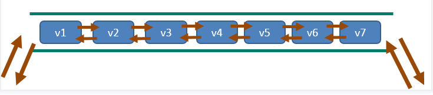
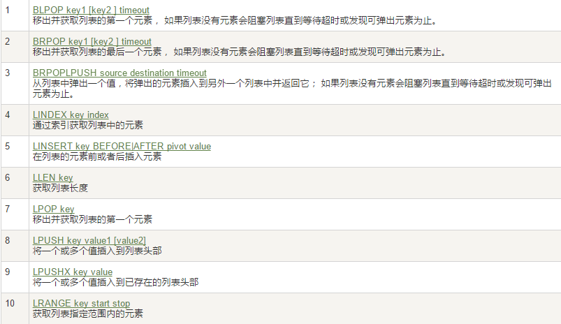
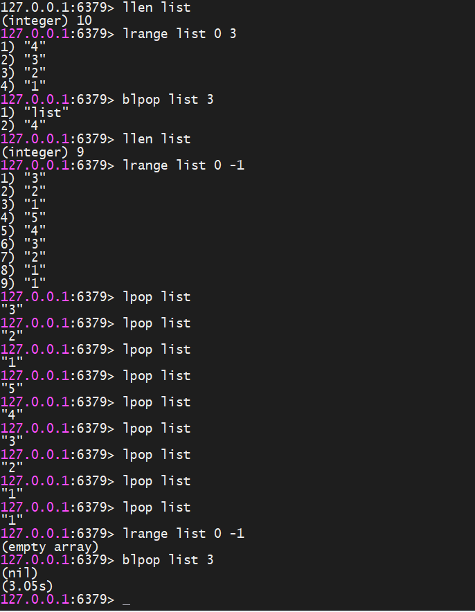
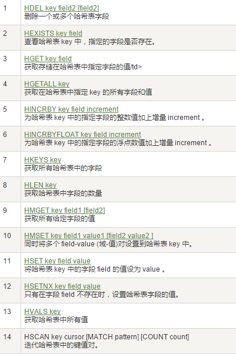
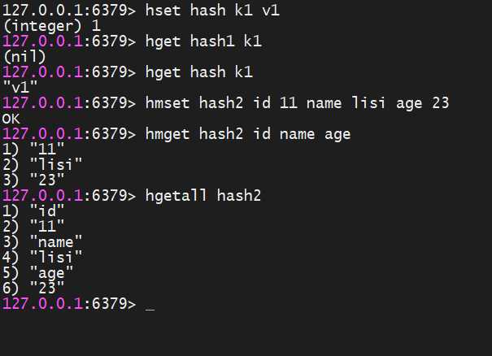
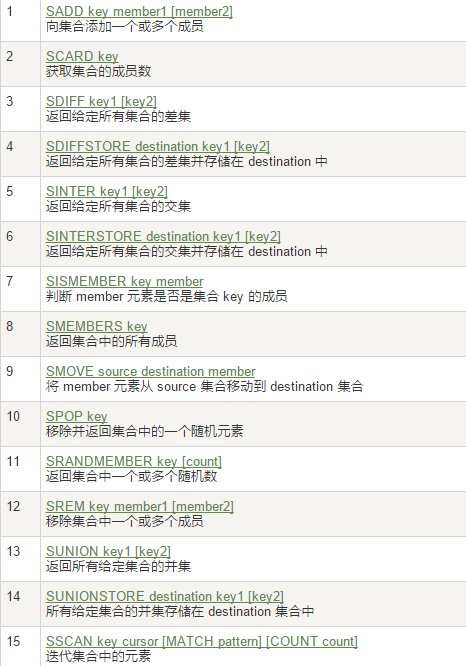
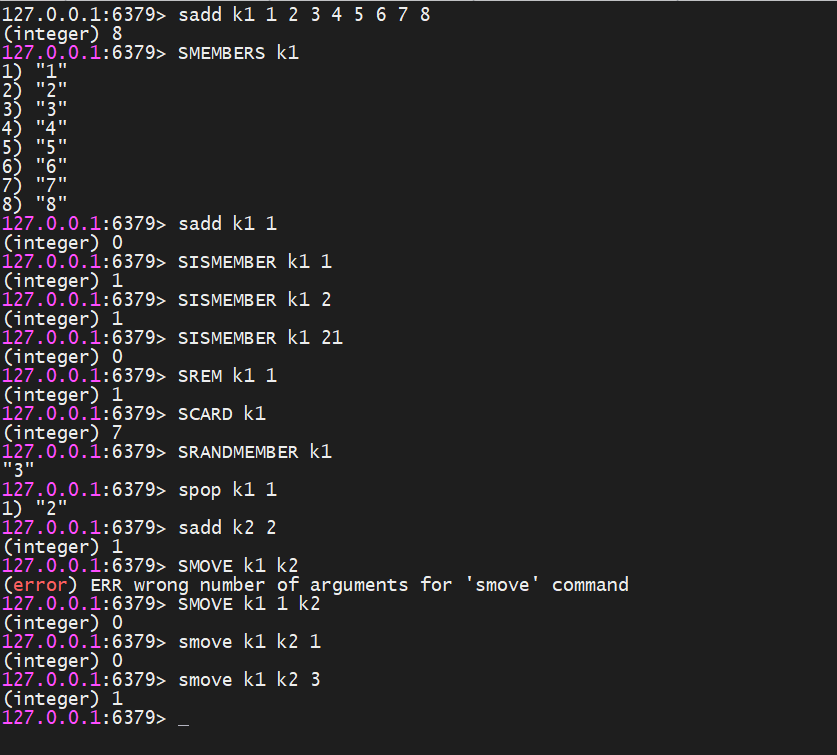
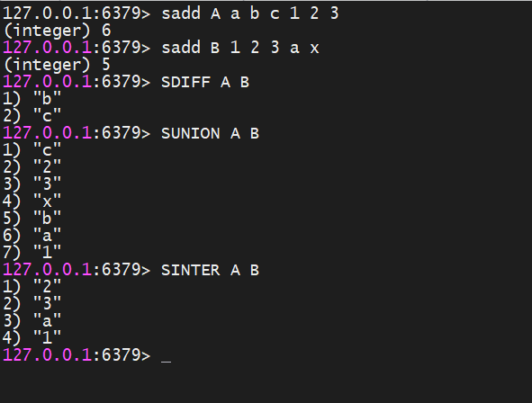
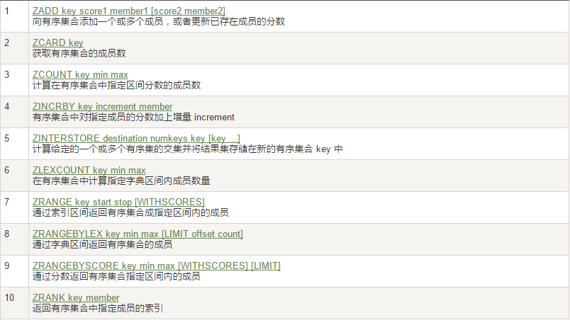
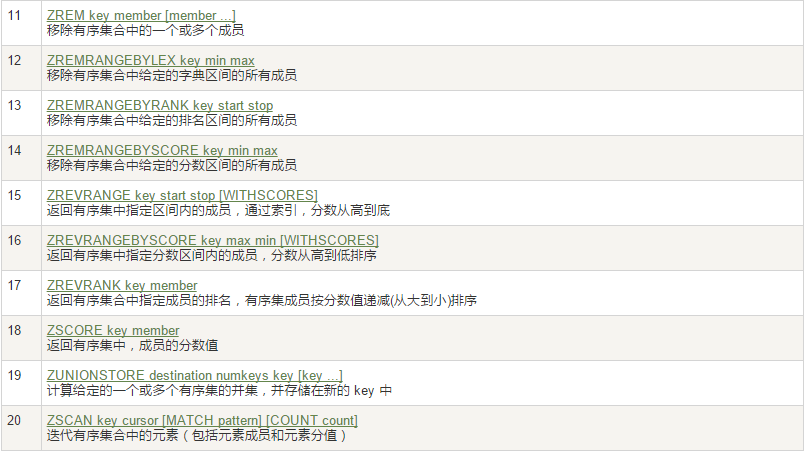

## redis 安装

#### 下载redis

```http
https://redis.io/download/
```

#### 安装redis

```sh
yum -y install make
yum install -y gcc
tar -zxvf redis-stable.tar.gz
cd redis-stable
make
make install
```

`redis` 默认安装路径 是 `/usr/local/bin/`

拷贝`redis.conf` 到 `/myredis` 中

#### redis配置文件初始化

```
redis.conf配置文件，改完后确保生效，记得重启，记得重启
   1 默认daemonize no              改为  daemonize yes
   2 默认protected-mode  yes    改为  protected-mode no
   3 默认bind 127.0.0.1             改为  直接注释掉(默认bind 127.0.0.1只能本机访问)或改成本机IP地址，否则影响远程IP连接
   4 添加redis密码                      改为 requirepass 你自己设置的密码
```

#### 启动redis

```sh
cd /usr/local/bin/
./redis-server  /myredis/redis.conf
```

#### 连接redis

```sh
cd /usr/local/bin/
./redis-cli -a 123456
```

#### 关闭redis

```sh
单实例关闭:
redis-cli -a 123456 shutdown
多实例关闭，指定端口关闭:
redis-cli -p 6379 shutdown
```

#### redis 卸载

```sh
停止redis-server 服务
删除/usr/local/lib目录下与redis相关的文件
```


## redis 数据类型

### redis 常用命令

```sh
del key # 删除 key
dump key # 序列话key，并返回被序列化的值
exists key # 检查key是否存在
expire key seconds # 设置过期时间
expireat  key timestamp # 设置过期时间 ，接受参数是unix时间戳
pexpire key milliseconds # 设置过期时间，毫秒
keys pattern # 查找匹配的key
move key db # 将当前数据库的key 移动到指定的db中
persist key # 移除过期时间
pttl key  # 返回过期时间 ， 毫秒
ttl key # 返回过期时间 ，秒
randomkey # 从当前数据库随机返回一个key
rename key newkey # 修改key名称
renamenx key newkey # 仅当newkey不存在时，修改key名称
type key # 返回key的类型
```

### 案例

```
keys * # 查看当前库所有的key
exists key # 判断某个key是否存在
type key # 查看你的key是什么类型
del key # 删除指定的key数据
unlink key # 非阻塞删除，仅仅将keys从keyspace元数据中删除，真正的删除会在后续异步中操作。
ttl key # 查看还有多少秒过期，-1表示永不过期，-2表示已过期
expire key 秒钟 # 为给定的key设置过期时间
move key dbindex[0-15] # 将当前数据库的 key移动到给定的数据库 db 当中
select dbindex # 切换数据库[0-15]，默认为0
dbsize # 查看当前数据库key的数量
flushdb # 清空当前库
flushall # 通杀全部库
```

### String

```http
https://redis.io/docs/data-types/strings/
```

### List

###### 简单说明

```sh
一个双端链表的结构，容量是2的32次方减1个元素，大概40多亿，主要功能有push/pop等，一般用在栈、队列、消息队列等场景。
left、right都可以插入添加；
如果键不存在，创建新的链表；
如果键已存在，新增内容；
如果值全移除，对应的键也就消失了。
它的底层实际是个双向链表，对两端的操作性能很高，通过索引下标的操作中间的节点性能会较差。
```



###### List 常用命令




```sh
lpush/rpush/lrange
lpop/rpop
lindex，按照索引下标获得元素(从上到下)
llen  获取列表中元素的个数
lrem key 数字N 给定值v1    解释(删除N个值等于v1的元素)
ltrim key 开始index 结束index，截取指定范围的值后再赋值给key #ltrim截取指定索引区间的元素，格式是ltrim list的key 起始索引 结束索引
rpoplpush 源列表 目的列表   # 移除列表的最后一个元素，并将该元素添加到另一个列表并返回
lset key index value  # 
linsert key  before/after 已有值 插入的新值
```



### Hash

###### hash 常用



###### 案例

```sh
hset/hget/hmset/hmget/hgetall/hdel
hlen  获取某个key内的全部数量
hexists key 在key里面的某个值的key
hkeys/hvals 
hincrby/hincrbyfloat
hsetnx 不存在赋值，存在了无效。
```



### Set

###### set 常用



```sh
SADD key member [member ...]   添加元素
SMEMBERS key            遍历集合中的所有元素
SISMEMBER key member   判断元素是否在集合中
SREM key member [member ...]  删除元素
scard，获取集合里面的元素个数   
SRANDMEMBER key [数字]  从集合中随机展现设置的数字个数元素，元素不删除
SPOP key [数字]       从集合中随机弹出一个元素，出一个删一个
smove key1 key2 在key1里已存在的某个值  将key1里已存在的某个值赋给key2
```



###### 集合运算

```sh
A : abc12  B : 123ax
集合的差集运算 A-B :
      属于A但不属于B的元素构成的集合 : SDIFF key [key ...]
集合的并集运算 A ∪ B : 
      属于A或者属于B的元素合并后的集合 : SUNION key [key ...]
集合的交集运算 A∩B  :
      属于A同时也属于B的共同拥有的元素构成的集合 : SINTER key [key ...] 
                                            SINTERCARD numkeys key [key ...] [LIMIT limit]
```



###### 应用场景

**微信抽奖小程序**

| 说明                             | 操作                                                         |
| -------------------------------- | ------------------------------------------------------------ |
| 1 用户ID，立即参与按钮           | sadd key 用户ID                                              |
| 2 显示已经有多少人参与了         | SCARD key                                                    |
| 3 抽奖(从set中任意选取N个中奖人) | SRANDMEMBER key 2       随机抽奖2个人，元素不删除<br/>SPOP  key 3                         随机抽奖3个人，元素会删除 |

**微信朋友圈点赞查看同赞朋友**

| 说明                                     | 操作                                     |
| ---------------------------------------- | ---------------------------------------- |
| 1 新增点赞                               | sadd pub:msgID  点赞用户ID1  点赞用户ID2 |
| 2 取消点赞                               | srem pub:msgID  点赞用户ID               |
| 3 展现所有点赞过的用户                   | SMEMBERS  pub:msgID                      |
| 4 点赞用户数统计，就是常见的点赞红色数字 | scard  pub:msgID                         |
| 5 判断某个朋友是否对楼主点赞过           | SISMEMBER pub:msgID 用户ID               |

**QQ内推可能认识的人**

### ZSet

###### zset常用命令





###### 案例

```sh
ZADD key score member [score]   添加元素
ZRANGE key start stop [WITHSCORES]  按照元素分数从小到大的顺序 返回索引从start到stop之间的所有元素
zrevrange
# 获取指定分数范围的元素 
ZRANGEBYSCORE key min max [WITHSCORES] [LIMIT offset count]
ZSCORE key member  获取元素的分数
ZCARD key   获取集合中元素的数量
zrem key 某score下对应的value值，作用是删除元素
ZINCRBY key increment member 增加某个元素的分数
ZCOUNT key min max  获得指定分数范围内的元素个数
ZMPOP   从键名列表中的第一个非空排序集中弹出一个或多个元素，它们是成员分数对
zrank key values值，作用是获得下标值
zrevrank key values值，作用是逆序获得下标值
```

### GEO

###### 简介

```sh
移动互联网时代LBS应用越来越多，交友软件中附近的小姐姐、外卖软件中附近的美食店铺、高德地图附近的核酸检查点等等，那这种附近各种形形色色的XXX地址位置选择是如何实现的？
 
地球上的地理位置是使用二维的经纬度表示，经度范围 (-180, 180]，纬度范围 (-90, 90]，只要我们确定一个点的经纬度就可以名取得他在地球的位置。
例如滴滴打车，最直观的操作就是实时记录更新各个车的位置，
然后当我们要找车时，在数据库中查找距离我们(坐标x0,y0)附近r公里范围内部的车辆
 
使用如下SQL即可：
select taxi from position where x0-r < x < x0 + r and y0-r < y < y0+r
但是这样会有什么问题呢？
1.查询性能问题，如果并发高，数据量大这种查询是要搞垮数据库的
2.这个查询的是一个矩形访问，而不是以我为中心r公里为半径的圆形访问。
3.精准度的问题，我们知道地球不是平面坐标系，而是一个圆球，这种矩形计算在长距离计算时会有很大误差
```

###### 命令

```sh
GEOADD  多个经度(longitude)、纬度(latitude)、位置名称(member)添加到指定的 key 中
GEOPOS  从键里面返回所有给定位置元素的位置（经度和纬度）
GEODIST 返回两个给定位置之间的距离。
GEORADIUS 以给定的经纬度为中心， 返回与中心的距离不超过给定最大距离的所有位置元素。
GEORADIUSBYMEMBER 跟GEORADIUS类似
GEOHASH返回一个或多个位置元素的 Geohash 表示
```

###### 命令实操

```http
如何获得某个地址的经纬度
http://api.map.baidu.com/lbsapi/getpoint/
```

```sh
中文乱码如何处理:
redis-cli --raw
```


