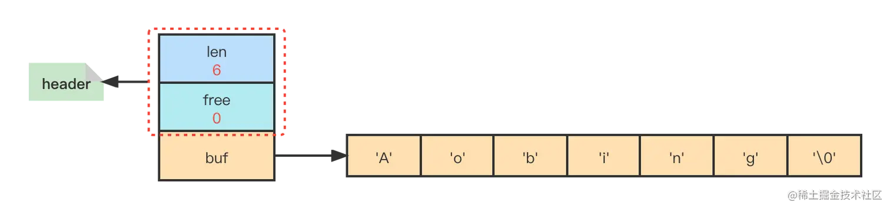
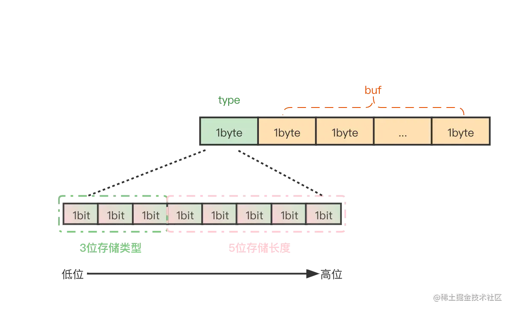
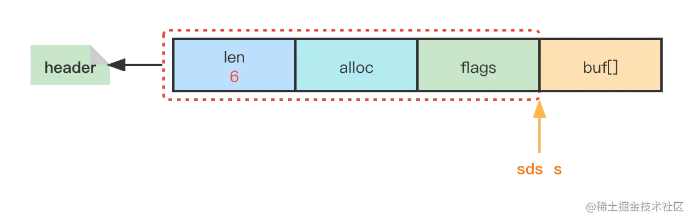
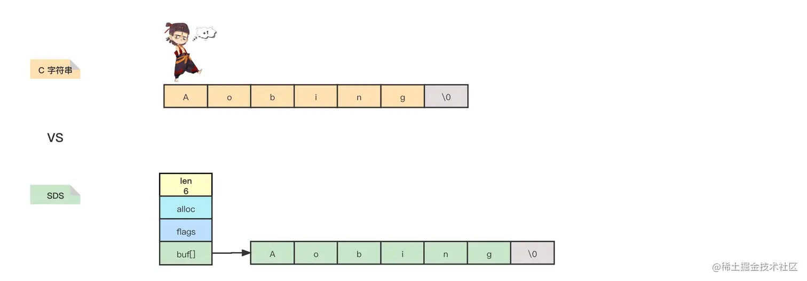
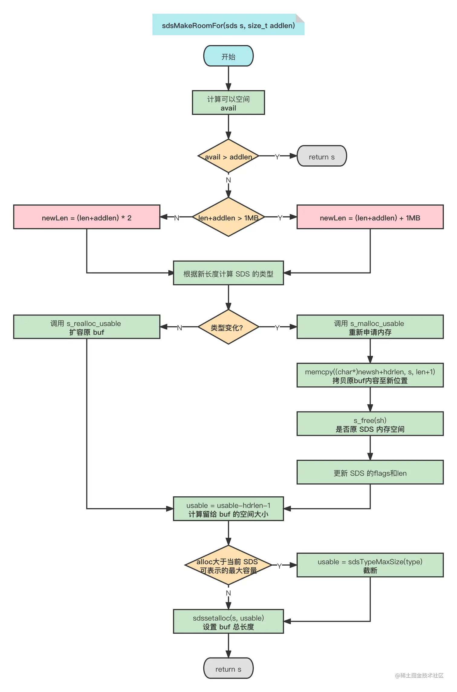
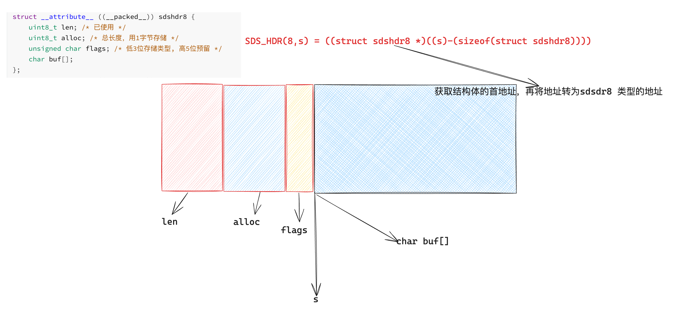

## 声明为紧凑的结构体

```C
struct __attribute__ ((__packed__)) sdshdr16 {
  uint16_t len; /* used */
  uint16_t alloc; /* excluding the header and null terminator */
  unsigned char flags; /* 3 lsb of type, 5 unused bits */
  char buf[];
};
/*
struct __attribute__((__packed__)) 是一种用于C或C++中结构体的特殊属性设置，通常用于告诉编译器不要进行字节对齐或填充。这会导致结构体中的成员按照它们在结构体中的声明顺序来分配内存，而不会在成员之间插入额外的字节，以确保数据的对齐。

在没有 __attribute__((__packed__)) 的情况下，编译器可能会添加填充字节以确保成员按照特定的字节对齐要求排列，这可能会导致结构体占用更多的内存。通过使用 __attribute__((__packed__))，你可以精确地控制结构体的内存布局，但要注意，这可能会降低读取和写入内存的性能，因为访问非对齐内存可能会导致性能损失或错误。这种技术通常用于需要与硬件通信或特定数据格式要求的情况。
*/
```

## sds数据结构

```c
struct sdshdr {
    //记录buf数组中已使用字节的数量
    //等于SDS所保存字符串的长度
    unsigned int len;

    //记录buf数组中未使用字节的数量
    unsigned int free;

    //char数组，用于保存字符串
    char buf[];
};
```



* len 为6，表示这个 SDS 保存了一个长度为5的字符串；
* free 为0，表示这个 SDS 没有剩余空间；
* buf 是个char类型的数组，注意末尾保存了一个空字符'\0';

buf 尾部自动追加一个'\0'字符并不会计算在 `SDS` 的len中，这是为了遵循 C 字符串以空字符串结尾的惯例，使得 SDS 可以直接使用一部分string.h库中的函数，如`strlen`

## 数据结构优化

**不同长度的字符串占用的头部是相同的**，如果某一字符串很短但是头部却占用了更多的空间，这未免太浪费了。所以我们将 SDS 分为三种级别的字符串：

* 短字符串(长度小于32)，len和free的长度用1字节即可；
* 长字符串，用2字节或者4字节；
* 超长字符串，用8字节;

**共有五种类型的SDS（长度小于1字节、1字节、2字节、4字节、8字节)**

## 如何区分五种数据类型

**在 SDS 中新增一个 type 字段来标识类型，但是没必要使用一个 4 字节的int类型去做！可以使用 1 字节的char类型，通过位运算（3位即可标识2^3种类型）来获取类型**

如下所示为短字符串(长度小于32)的优化形式：



低三位存储类型，高5位存储长度，最多能标识的长度为32，所以短字符串的长度必定小于32。

**无需free字段了，32-len即为free**

## redis 如何区分

```c
// 注意：sdshdr5从未被使用，Redis中只是访问flags。
struct __attribute__ ((__packed__)) sdshdr5 {
    unsigned char flags; /* 低3位存储类型, 高5位存储长度 */
    char buf[];
};
struct __attribute__ ((__packed__)) sdshdr8 {
    uint8_t len; /* 已使用 */
    uint8_t alloc; /* 总长度，用1字节存储 */
    unsigned char flags; /* 低3位存储类型, 高5位预留 */
    char buf[];
};
struct __attribute__ ((__packed__)) sdshdr16 {
    uint16_t len; /* 已使用 */
    uint16_t alloc; /* 总长度，用2字节存储 */
    unsigned char flags; /* 低3位存储类型, 高5位预留 */
    char buf[];
};
struct __attribute__ ((__packed__)) sdshdr32 {
    uint32_t len; /* 已使用 */
    uint32_t alloc; /* 总长度，用4字节存储 */
    unsigned char flags; /* 低3位存储类型, 高5位预留 */
    char buf[];
};
struct __attribute__ ((__packed__)) sdshdr64 {
    uint64_t len; /* 已使用 */
    uint64_t alloc; /* 总长度，用8字节存储 */
    unsigned char flags; /* 低3位存储类型, 高5位预留 */
    char buf[];
};

/*Redis 中也声明了5个常量分别表示五种类型的 SDS*/
#define SDS_TYPE_5  0
#define SDS_TYPE_8  1
#define SDS_TYPE_16 2
#define SDS_TYPE_32 3
#define SDS_TYPE_64 4


typedef unsigned char uint8_t;  
typedef unsigned short uint16_t;
typedef unsigned int uint32_t;
typedef unsigned long long uint64_t;
```

## 对齐填充

SDS 的结构体为`struct __attribute__ ((__packed__))`与`struct`有较大的差别，这其实和我们熟知的`对齐填充`有关

1. 结构体变量的首地址是最长成员长度的整数倍；
2. 每个成员相对结构体首地址的偏移量，一定是该成员长度的整数倍；
3. 结构体的总长度是最长成员长度的整数倍；
4. 如果结构体内成员长度大于处理器的位数，那么就以处理器的位数作为对齐单位；

如下结构体:

```c
#include <stdio.h>
typedef struct
{
  char  c1;
  short  s;
  char  c2;
  int    i;
} s;

int main()
{
  s  a;
  printf("c1 -> %d, s -> %d, c2 -> %d, i -> %d\n",
         (unsigned int)(void *)&a.c1 - (unsigned int)(void *)&a,
         (unsigned int)(void *)&a.s - (unsigned int)(void *)&a,
         (unsigned int)(void *)&a.c2 - (unsigned int)(void *)&a,
         (unsigned int)(void *)&a.i - (unsigned int)(void *)&a);
  printf("a = %d\n", sizeof a);
  return 0;
}
// 结果为：c1 -> 0, s -> 2, c2 -> 4, i -> 8

// a = 12
```

## 更改对齐方式

**我们写程序的时候，不需要考虑对齐问题。编译器会替我们选择适合目标平台的对齐策略**

如果我们一定要手动更改对齐方式，一般可以通过下面的方法来改变缺省的对界条件：

* 使用伪指令`#pragma pack(n)`：C编译器将按照n个字节对齐；
* 使用伪指令`#pragma pack()`： 取消自定义字节对齐方式;

另外，还有如下的一种方式(GCC特有语法)：

- `__attribute((aligned (n)))`： 让所作用的结构成员对齐在n字节自然边界上。如果结构体中有成员的长度大于n，则按照最大成员的长度来对齐。
- `__attribute__ ((packed))`： 取消结构在编译过程中的优化对齐，按照实际占用字节数进行对齐。

```c
#include <stdio.h>
typedef struct __attribute__ ((__packed__))
{
  char c1;
  short s;
  char c2;
  int i;
} s;

int main()
{
  s  a;
  printf("c1 -> %d, s -> %d, c2 -> %d, i -> %d\n",
         (unsigned int)(void *)&a.c1 - (unsigned int)(void *)&a,
         (unsigned int)(void *)&a.s - (unsigned int)(void *)&a,
         (unsigned int)(void *)&a.c2 - (unsigned int)(void *)&a,
         (unsigned int)(void *)&a.i - (unsigned int)(void *)&a);
  printf("a = %d\n", sizeof a);
  return 0;
}

// c1 -> 0, s -> 1, c2 -> 3, i -> 4
// a = 8
```

## Redis为什么不对齐



`SDS` 的指针并不是指向 `SDS` 的起始位置（len位置），而是直接指向`buf[]`，使得 `SDS` 可以直接使用 C 语言string.h库中的某些函数，做到了兼容。

如果不进行对齐填充，那么在获取当前 SDS 的类型时则只需要后退一步即可`flagsPointer = ((unsigned char*)s)-1`；

若进行对齐填充，由于 Padding 的存在，我们在不同的系统中不知道退多少才能获得flags，并且我们也不能将 sds 的指针指向flags，这样就无法兼容 C 语言的函数了，也不知道前进多少才能得`buf[]`。

## SDS 优势

1. O(1)时间复杂度获取字符串长度

由于C字符串不记录自身的长度，所以为了获取一个字符串的长度程序必须遍历这个字符串，直至遇到'0'为止，整个操作的时间复杂度为O(N)。而我们使用SDS封装字符串则直接获取len属性值即可，时间复杂度为O(1)。



2. 二进制安全

**什么是二进制安全？**

**通俗地讲，C语言中，用'0'表示字符串的结束，如果字符串本身就有'0'字符，字符串就会被截断，即非二进制安全；若通过某种机制，保证读写字符串时不损害其内容，则是二进制安全。**

C字符串中的字符除了末尾字符为'\0'外其他字符不能为空字符，否则会被认为是字符串结尾(即使实际上不是)。这限制了C字符串只能保存文本数据，而不能保存二进制数据。而SDS使用len属性的值判断字符串是否结束，所以不会受'\0'的影响。

3. 杜绝缓冲区溢出

字符串的拼接操作是使用十分频繁的，在C语言开发中使用`char *strcat(char *dest,const char *src)`方法将`src`字符串中的内容拼接到`dest`字符串的末尾。

由于C字符串不记录自身的长度，所有`strcat`方法已经认为用户在执行此函数时已经为`dest`分配了足够多的内存，足以容纳`src`字符串中的所有内容，而一旦这个条件不成立就会产生缓冲区溢出，会把其他数据覆盖掉。

```c
// strcat 源码
char * __cdecl strcat (char * dst, const char * src)
{
    char * cp = dst;
 
    while( *cp )
        cp++; /* 找到 dst 的结尾 */
 
    while( *cp++ = *src++ ) ; /* 无脑将 src 复制到 dst 中 */
 
    return( dst ); /* 返回 dst */
}    
```

与C字符串不同，SDS 的**自动扩容机制**完全杜绝了发生缓冲区溢出的可能性：**当SDS API需要对SDS进行修改时，API会先检查 SDS 的空间是否满足修改所需的要求，如果不满足，API会自动将SDS的空间扩展至执行修改所需的大小，然后才执行实际的修改操作，所以使用 SDS 既不需要手动修改SDS的空间大小，也不会出现缓冲区溢出问题。**

SDS 的`sds sdscat(sds s, const char *t)`方法在字符串拼接时会进行扩容相关操作。

```C
sds sdscatsds(sds s, const sds t) {
    return sdscatlen(s, t, sdslen(t));
}

/* s: 源字符串
 * t: 待拼接字符串
 * len: 待拼接字符串长度
 */
sds sdscatlen(sds s, const void *t, size_t len) {
    // 获取源字符串长度
    size_t curlen = sdslen(s);
		// SDS 分配空间（自动扩容机制）
    s = sdsMakeRoomFor(s,len);
    if (s == NULL) return NULL;
    // 将目标字符串拷贝至源字符串末尾
    memcpy(s+curlen, t, len);
    // 更新 SDS 长度
    sdssetlen(s, curlen+len);
    // 追加结束符
    s[curlen+len] = '\0';
    return s;
}
```

**自动扩容机制——`sdsMakeRoomFor`方法**

```C
/* s: 源字符串
 * addlen: 新增长度
 */
sds sdsMakeRoomFor(sds s, size_t addlen) {
    void *sh, *newsh;
    // sdsavail: s->alloc - s->len, 获取 SDS 的剩余长度
    size_t avail = sdsavail(s);
    size_t len, newlen, reqlen;
    // 根据 flags 获取 SDS 的类型 oldtype
    char type, oldtype = s[-1] & SDS_TYPE_MASK;
    int hdrlen;
    size_t usable;

    /* Return ASAP if there is enough space left. */
    // 剩余空间大于等于新增空间，无需扩容，直接返回源字符串
    if (avail >= addlen) return s;
    // 获取当前长度
    len = sdslen(s);
    // 
    sh = (char*)s-sdsHdrSize(oldtype);
    // 新长度
    reqlen = newlen = (len+addlen);
    // 断言新长度比原长度长，否则终止执行
    assert(newlen > len);   /* 防止数据溢出 */
    // SDS_MAX_PREALLOC = 1024*1024, 即1MB
    if (newlen < SDS_MAX_PREALLOC)
        // 新增后长度小于 1MB ，则按新长度的两倍扩容
        newlen *= 2;
    else
        // 新增后长度大于 1MB ，则按新长度加上 1MB 扩容
        newlen += SDS_MAX_PREALLOC;
    // 重新计算 SDS 的类型
    type = sdsReqType(newlen);

    /* Don't use type 5: the user is appending to the string and type 5 is
     * not able to remember empty space, so sdsMakeRoomFor() must be called
     * at every appending operation. */
    // 不使用 sdshdr5 
    if (type == SDS_TYPE_5) type = SDS_TYPE_8;
    // 获取新的 header 大小
    hdrlen = sdsHdrSize(type);
    assert(hdrlen + newlen + 1 > reqlen);  /* Catch size_t overflow */
    if (oldtype==type) {
        // 类型没变
        // 调用 s_realloc_usable 重新分配可用内存，返回新 SDS 的头部指针
        // usable 会被设置为当前分配的大小
        newsh = s_realloc_usable(sh, hdrlen+newlen+1, &usable);
        if (newsh == NULL) return NULL; // 分配失败直接返回NULL
        // 获取指向 buf 的指针
        s = (char*)newsh+hdrlen;
    } else {
        // 类型变化导致 header 的大小也变化，需要向前移动字符串，不能使用 realloc
        newsh = s_malloc_usable(hdrlen+newlen+1, &usable);
        if (newsh == NULL) return NULL;
        // 将原字符串copy至新空间中
        memcpy((char*)newsh+hdrlen, s, len+1);
        // 释放原字符串内存
        s_free(sh);
        s = (char*)newsh+hdrlen;
        // 更新 SDS 类型
        s[-1] = type;
        // 设置长度
        sdssetlen(s, len);
    }
    // 获取 buf 总长度(待定)
    usable = usable-hdrlen-1;
    if (usable > sdsTypeMaxSize(type))
        // 若可用空间大于当前类型支持的最大长度则截断
        usable = sdsTypeMaxSize(type);
    // 设置 buf 总长度
    sdssetalloc(s, usable);
    return s;
}
```

## 自动扩容机制总结

**扩容阶段 ： **

* 若 SDS 中剩余空闲空间 avail 大于新增内容的长度 addlen，则无需扩容；
* 若 SDS 中剩余空闲空间 avail 小于或等于新增内容的长度 addlen：
  * 若新增后总长度 len+addlen < 1MB，则按新长度的两倍扩容；
  * 若新增后总长度 len+addlen > 1MB，则按新长度加上 1MB 扩容。

**内存分配阶段 ：**

* 根据扩容后的长度选择对应的 SDS 类型：
  * 若类型不变，则只需通过 `s_realloc_usable`扩大 buf 数组即可；
  * 若类型变化，则需要为整个 SDS 重新分配内存，并将原来的 SDS 内容拷贝至新位置。
* **自动扩容流程图如下所示**



**扩容后的 SDS 不会恰好容纳下新增的字符，而是多分配了一些空间(预分配策略)，这减少了修改字符串时带来的内存重分配次数**


## 内存重分配次数优化

1. **空间预分配策略**

因为 SDS 的空间预分配策略， SDS 字符串在增长过程中不会频繁的进行空间分配。通过这种分配策略，SDS 将连续增长N次字符串所需的内存重分配次数从必定N次降低为最多N次。

2. **惰性空间释放机制**

空间预分配策略用于优化 SDS 增长时频繁进行空间分配，而惰性空间释放机制则用于优化 SDS 字符串缩短时并不立即使用内存重分配来回收缩短后多出来的空间，而仅仅更新 SDS 的len属性，多出来的空间供将来使用。

SDS 中调用`sdstrim`方法来缩短字符串：

```c
/* sdstrim 方法删除字符串首尾中在 cset 中出现过的字符
 * 比如:
 * s = sdsnew("AA...AA.a.aa.aHelloWorld     :::");
 * s = sdstrim(s,"Aa. :");
 * printf("%s\n", s);
 *
 * SDS 变成了 "HelloWorld"
 */
sds sdstrim(sds s, const char *cset) {
    char *start, *end, *sp, *ep;
    size_t len;

    sp = start = s;
    ep = end = s+sdslen(s)-1;
    // strchr()函数用于查找给定字符串中某一个特定字符
    while(sp <= end && strchr(cset, *sp)) sp++;
    while(ep > sp && strchr(cset, *ep)) ep--;
    len = (sp > ep) ? 0 : ((ep-sp)+1);
    if (s != sp) memmove(s, sp, len);
    s[len] = '\0';
    // 仅仅更新了len
    sdssetlen(s,len);
    return s;
}
```

SDS 并没有释放多出来的5字节空间，仅仅将 len 设置成了7，剩余空间为5。如果后续字符串增长时则可以派上用场（可能不需要再分配内存）。

**没真正释放空间，是否会导致内存泄漏**

SDS为我们提供了真正释放SDS未使用空间的方法`sdsRemoveFreeSpace`。

```c
sds sdsRemoveFreeSpace(sds s) {
    void *sh, *newsh;
    // 获取类型
    char type, oldtype = s[-1] & SDS_TYPE_MASK;
    // 获取 header 大小
    int hdrlen, oldhdrlen = sdsHdrSize(oldtype);
    // 获取原字符串长度
    size_t len = sdslen(s);
    // 获取可用长度
    size_t avail = sdsavail(s);
    // 获取指向头部的指针
    sh = (char*)s-oldhdrlen;

    /* Return ASAP if there is no space left. */
    if (avail == 0) return s;

    // 查找适合这个字符串长度的最优 SDS 类型
    type = sdsReqType(len);
    hdrlen = sdsHdrSize(type);

    /* 如果类型相同，或者至少仍然需要一个足够大的类型，我们只需 realloc buf即可；
     * 否则，说明变化很大，则手动重新分配字符串以使用不同的头文件类型。
     */
    if (oldtype==type || type > SDS_TYPE_8) {
        newsh = s_realloc(sh, oldhdrlen+len+1);
        if (newsh == NULL) return NULL;
        s = (char*)newsh+oldhdrlen;
    } else {
        newsh = s_malloc(hdrlen+len+1);
        if (newsh == NULL) return NULL;
        memcpy((char*)newsh+hdrlen, s, len+1);
        // 释放内存
        s_free(sh);
        s = (char*)newsh+hdrlen;
        s[-1] = type;
        sdssetlen(s, len);
    }
    // 重新设置总长度为len
    sdssetalloc(s, len);
    return s;
}
```

## SDS 最长多少

Redis 官方给出了[最大的字符串容量为 512MB](https://link.juejin.cn/?target=https%3A%2F%2Fredis.io%2Ftopics%2Fdata-types)

**在 Reids3.x 版本中`len`是使用int修饰的，这就会导致 buf 最长就是`2147483647`，无形中限制了字符串的最大长度。**

任何细节在源码中都能发现，在`_sdsnewlen`方法创建 SDS 中都会调用`sdsTypeMaxSize`方法获取每种类型所能创建的最大buf长度，不难发现此方法最大的返回值为`2147483647`，即512MB。

```c
static inline size_t sdsTypeMaxSize(char type) {
    if (type == SDS_TYPE_5)
        return (1<<5) - 1;
    if (type == SDS_TYPE_8)
        return (1<<8) - 1;
    if (type == SDS_TYPE_16)
        return (1<<16) - 1;
#if (LONG_MAX == LLONG_MAX)
    if (type == SDS_TYPE_32)
        return (1ll<<32) - 1; // 不管方法啥意思，最大返回2147483647。OVER~
#endif
    return -1; /* this is equivalent to the max SDS_TYPE_64 or SDS_TYPE_32 */
}
```

## SDS的宏定义解释

```c
#define SDS_HDR_VAR(T,s) struct sdshdr##T *sh = (void*)((s)-(sizeof(struct sdshdr##T)))
```

- `#define`: 这是C预处理器指令，用于创建一个宏。
- `SDS_HDR_VAR(T, s)`: 这是宏的名称，它接受两个参数，`T` 和 `s`。
- `struct sdshdr##T *sh`: 这部分定义了一个结构体指针 `sh`，其类型是 `struct sdshdr##T`。`##` 是一个预处理器运算符，用于将 `sdshdr` 和 `T` 连接在一起，形成一个合法的结构体名称。这允许在调用宏时通过 `T` 的值动态地生成结构体类型。
- `(void*)((s)-(sizeof(struct sdshdr##T)))`: 这是对传递给宏的指针 `s` 进行操作的表达式。它执行了以下操作：
  - `sizeof(struct sdshdr##T)`: 计算 `struct sdshdr##T` 的大小，即结构体的字节大小。
  - `(s)-(sizeof(struct sdshdr##T))`: 将指针 `s` 向前移动结构体大小的字节数。这样，`sh` 将指向 `s` 所在内存块的开头，这个内存块被认为包含了 `sdshdr` 结构体的头部。

## 获取sds长度:`sdslen`

```C
static inline size_t sdslen(const sds s) {
    unsigned char flags = s[-1]; 
  // 获取flags的值 如要获取alloc的值unit_8 alloc = (sdshr*)(s - 9)->alloc
    switch(flags&SDS_TYPE_MASK) {
        case SDS_TYPE_5:
            return SDS_TYPE_5_LEN(flags);
        case SDS_TYPE_8:
            return SDS_HDR(8,s)->len;
        case SDS_TYPE_16:
            return SDS_HDR(16,s)->len;
        case SDS_TYPE_32:
            return SDS_HDR(32,s)->len;
        case SDS_TYPE_64:
            return SDS_HDR(64,s)->len;
    }
    return 0;
}
```

**以SDS_TYPE_8为例**



## 获取sds的未使用的空间:`sdsavail`

```C
static inline size_t sdsavail(const sds s) {
    unsigned char flags = s[-1];
    switch(flags&SDS_TYPE_MASK) {
        case SDS_TYPE_5: {
            return 0;
        }
        case SDS_TYPE_8: {
            SDS_HDR_VAR(8,s) 
    /*  struct sdshdr8 *sh = (void*)((s)-(sizeof(struct sdshdr8)));  */
            return sh->alloc - sh->len;
        }
        case SDS_TYPE_16: {
            SDS_HDR_VAR(16,s)
      /*  struct sdshdr16 *sh = (void*)((s)-(sizeof(struct sdshdr16)));  */
            return sh->alloc - sh->len;
        }
        case SDS_TYPE_32: {
            SDS_HDR_VAR(32,s)
      /*  struct sdshdr32 *sh = (void*)((s)-(sizeof(struct sdshdr32)));  */
            return sh->alloc - sh->len;
        }
        case SDS_TYPE_64: {
            SDS_HDR_VAR(64,s)
       /*  struct sdshdr64 *sh = (void*)((s)-(sizeof(struct sdshdr64)));  */
            return sh->alloc - sh->len;
        }
    }
    return 0;
}
```

## 设置长度:`sdssetlen`

```c
static inline void sdssetlen(sds s, size_t newlen) {
    unsigned char flags = s[-1];
    switch(flags&SDS_TYPE_MASK) {
        case SDS_TYPE_5:
            {
                unsigned char *fp = ((unsigned char*)s)-1;
                *fp = SDS_TYPE_5 | (newlen << SDS_TYPE_BITS);
            }
            break;
        case SDS_TYPE_8:
            SDS_HDR(8,s)->len = newlen;
            break;
        case SDS_TYPE_16:
            SDS_HDR(16,s)->len = newlen;
            break;
        case SDS_TYPE_32:
            SDS_HDR(32,s)->len = newlen;
            break;
        case SDS_TYPE_64:
            SDS_HDR(64,s)->len = newlen;
            break;
    }
}
```

## 将长度加inc:`sdsinclen`

```c
static inline void sdsinclen(sds s, size_t inc) {
    unsigned char flags = s[-1];
    switch(flags&SDS_TYPE_MASK) {
        case SDS_TYPE_5:
            {
                unsigned char *fp = ((unsigned char*)s)-1;
                unsigned char newlen = SDS_TYPE_5_LEN(flags)+inc;
                *fp = SDS_TYPE_5 | (newlen << SDS_TYPE_BITS);
            }
            break;
        case SDS_TYPE_8:
            SDS_HDR(8,s)->len += inc;
            break;
        case SDS_TYPE_16:
            SDS_HDR(16,s)->len += inc;
            break;
        case SDS_TYPE_32:
            SDS_HDR(32,s)->len += inc;
            break;
        case SDS_TYPE_64:
            SDS_HDR(64,s)->len += inc;
            break;
    }
}
```

## 获取总长度:`sdsalloc`

```c
/* sdsalloc() = sdsavail() + sdslen() */
static inline size_t sdsalloc(const sds s) {
    unsigned char flags = s[-1];
    switch(flags&SDS_TYPE_MASK) {
        case SDS_TYPE_5:
            return SDS_TYPE_5_LEN(flags);
        case SDS_TYPE_8:
            return SDS_HDR(8,s)->alloc;
        case SDS_TYPE_16:
            return SDS_HDR(16,s)->alloc;
        case SDS_TYPE_32:
            return SDS_HDR(32,s)->alloc;
        case SDS_TYPE_64:
            return SDS_HDR(64,s)->alloc;
    }
    return 0;
}
```

## 设置新的总长度:`sdssetalloc`

```c
static inline void sdssetalloc(sds s, size_t newlen) {
    unsigned char flags = s[-1];
    switch(flags&SDS_TYPE_MASK) {
        case SDS_TYPE_5:
            /* Nothing to do, this type has no total allocation info. */
            break;
        case SDS_TYPE_8:
            SDS_HDR(8,s)->alloc = newlen;
            break;
        case SDS_TYPE_16:
            SDS_HDR(16,s)->alloc = newlen;
            break;
        case SDS_TYPE_32:
            SDS_HDR(32,s)->alloc = newlen;
            break;
        case SDS_TYPE_64:
            SDS_HDR(64,s)->alloc = newlen;
            break;
    }
}
```

## 所有非inline函数

```C
sds sdsnewlen(const void *init, size_t initlen);
sds sdsnew(const char *init);
sds sdsempty(void);
sds sdsdup(const sds s);
void sdsfree(sds s);
sds sdsgrowzero(sds s, size_t len);
sds sdscatlen(sds s, const void *t, size_t len);
sds sdscat(sds s, const char *t);
sds sdscatsds(sds s, const sds t);
sds sdscpylen(sds s, const char *t, size_t len);
sds sdscpy(sds s, const char *t);

sds sdscatvprintf(sds s, const char *fmt, va_list ap);
#ifdef __GNUC__  
sds sdscatprintf(sds s, const char *fmt, ...)
    __attribute__((format(printf, 2, 3)));
#else
sds sdscatprintf(sds s, const char *fmt, ...);
#endif

sds sdscatfmt(sds s, char const *fmt, ...);
sds sdstrim(sds s, const char *cset);
void sdsrange(sds s, ssize_t start, ssize_t end);
void sdsupdatelen(sds s);
void sdsclear(sds s);
int sdscmp(const sds s1, const sds s2);
sds *sdssplitlen(const char *s, ssize_t len, const char *sep, int seplen, int *count);
void sdsfreesplitres(sds *tokens, int count);
void sdstolower(sds s);
void sdstoupper(sds s);
sds sdsfromlonglong(long long value);
sds sdscatrepr(sds s, const char *p, size_t len);
sds *sdssplitargs(const char *line, int *argc);
sds sdsmapchars(sds s, const char *from, const char *to, size_t setlen);
sds sdsjoin(char **argv, int argc, char *sep);
sds sdsjoinsds(sds *argv, int argc, const char *sep, size_t seplen);

/* Low level functions exposed to the user API */
sds sdsMakeRoomFor(sds s, size_t addlen);
void sdsIncrLen(sds s, ssize_t incr);
sds sdsRemoveFreeSpace(sds s);
size_t sdsAllocSize(sds s);
void *sdsAllocPtr(sds s);

/* Export the allocator used by SDS to the program using SDS.
 * Sometimes the program SDS is linked to, may use a different set of
 * allocators, but may want to allocate or free things that SDS will
 * respectively free or allocate. */
void *sds_malloc(size_t size);
void *sds_realloc(void *ptr, size_t size);
void sds_free(void *ptr);
```

```c
#ifdef GNUC  
sds sdscatprintf(sds s, const char *fmt, ...)
   __attribute__((format(printf, 2, 3)));
#else
sds sdscatprintf(sds s, const char *fmt, ...);
#endif 

这段代码是为了声明一个函数 sdscatprintf，该函数接受可变数量的参数，类似于C标准库中的 printf 函数，用于格式化字符串并将其附加到给定的 sds（Simple Dynamic String）缓冲区中。这段代码还包含了条件编译，根据是否是 GCC 编译器，来选择是否使用特定的 GCC 扩展属性。


1.  #ifdef __GNUC__: 这是一个条件编译预处理指令，检查是否正在使用 GCC 编译器。__GNUC__ 是 GCC 编译器预定义的宏。

2.  __attribute__((format(printf, 2, 3))): 这是 GCC 编译器的一种特殊属性声明。在这里，format 属性指定了参数的格式化信息，类似于 printf 函数。具体来说，这告诉编译器，sdscatprintf 函数的第二个参数是格式字符串，而后续的参数（从第三个开始）是用于替换格式字符串中占位符的值。数字 2 和 3 是指明参数的索引范围，从第二个参数到第三个参数。这有助于编译器检查参数的类型是否正确匹配格式字符串的期望。

3.  ...: 这表示函数接受可变数量的参数，就像 printf 一样。

4.  #else: 如果不是使用 GCC 编译器，那么走这个分支。

6.  sds sdscatprintf(sds s, const char *fmt, ...);: 这是函数声明的一部分。在不使用 GCC 编译器的情况下，函数没有 __attribute__((format(printf, 2, 3))) 这个属性声明。

7. #endif: 结束条件编译块。
```

## 获取各种sdshr的大小:sdsHdrSize`

```c
static inline int sdsHdrSize(char type) {
    switch(type&SDS_TYPE_MASK) {
        case SDS_TYPE_5:
            return sizeof(struct sdshdr5);
        case SDS_TYPE_8:
            return sizeof(struct sdshdr8);
        case SDS_TYPE_16:
            return sizeof(struct sdshdr16);
        case SDS_TYPE_32:
            return sizeof(struct sdshdr32);
        case SDS_TYPE_64:
            return sizeof(struct sdshdr64);
    }
    return 0;
}
```

## 根据sds长度获取类型:`sdsReqType`

```C
static inline char sdsReqType(size_t string_size) {
    if (string_size < 1<<5)  // 2*2*2*2 = 16
        return SDS_TYPE_5;
    if (string_size < 1<<8)  
        return SDS_TYPE_8;
    if (string_size < 1<<16)
        return SDS_TYPE_16;
#if (LONG_MAX == LLONG_MAX)
    if (string_size < 1ll<<32)
        return SDS_TYPE_32;
    return SDS_TYPE_64;
#else
    return SDS_TYPE_32;
#endif
}
```


## 新建一个长度为initlen的sds:`sdsnewlen`

```c
void * sh;
  sds s;
  char type = sdsReqType(initlen); /* 通过字符长度获取类型 */
  if (type == SDS_TYPE_5 && initlen == 0) type = SDS_TYPE_8;
  int hdrlen = sdsHdrSize(type);  /* 获取相应类型的字节长度 */
  unsigned  char *fp ; /* flags pointer. */

  sh = s_malloc(hdrlen + initlen + 1);  /* 申请内存  sh 是结构体的地址*/
  if (sh == NULL) return NULL;
  if (init == SDS_NOINIT)
    init = NULL;
  else if (!init)
    memset(sh, 0, hdrlen + initlen + 1); /*初始化内存*/
  /*
  void * memset(void *str, int c, size_t n)
  str -- 指向要填充的内存块。
  c -- 要被设置的值。该值以 int 形式传递，但是函数在填充内存块时是使用该值的无符号字符形式。
  n -- 要被设置为该值的字符数。
  */
  
     s = (char *)sh + hdrlen; 
/*找到 char buf[]的首地址  通过sh + hdrlen 可以找到 buf的地址  sh + len + alloc + flags*/
  fp = ((unsigned char *)s) - 1; /* 找到flags的地址*/
  switch (type) {
    case SDS_TYPE_5: {
      *fp = type | (initlen << SDS_TYPE_BITS);
      break;
    }
    case SDS_TYPE_8: {
      SDS_HDR_VAR(8, s);
      sh ->len = initlen;
      sh->alloc = initlen;
      *fp = type;
      break;
    }
    case SDS_TYPE_16: {
      SDS_HDR_VAR(16,s);
      sh->len = initlen;
      sh->alloc = initlen;
      *fp = type;
      break;
    }
    case SDS_TYPE_32: {
      SDS_HDR_VAR(32,s);
      sh->len = initlen;
      sh->alloc = initlen;
      *fp = type;
      break;
    }
    case SDS_TYPE_64: {
      SDS_HDR_VAR(64,s);
      sh->len = initlen;
      sh->alloc = initlen;
      *fp = type;
      break;
    }
  }
  if (initlen && init)
    memcpy(s, init, initlen);
  s[initlen] = '\0';
  return s;
}
```

## 扩充空间:`sdsMakeRoomFor`

```C
sds sdsMakeRoomFor(sds s, size_t addlen){
  void *sh, *newsh;
  size_t  avail = sdsavail(s);
  size_t  len, newlen, reqlen;

  /*声明type oldtype 并计算出oldtype的值*/
  char type, oldtype = s[-1] & SDS_TYPE_MASK;

  int hdrlen;
  /* 空闲的空间是足够的，直接返回*/
  if (avail >= addlen) return s;

  len = sdslen(s);
  /* 通过oldtype 找到结构体的首地址*/
  sh = (char*)s - sdsHdrSize(oldtype);
  reqlen = newlen = (len + addlen);
  /* 扩充策略 如果newlen 小于SDS_MAX_PREALLOC 直接将newlen 扩充2倍
     否则直接在原有的基础上加上1M的空间*/
  if (newlen < SDS_MAX_PREALLOC)
    newlen *= 2;
  else
    newlen += SDS_MAX_PREALLOC;

  type = sdsReqType(newlen);
  /* Don't use type 5: the user is appending to the string and type 5 is
     * not able to remember empty space, so sdsMakeRoomFor() must be called
     * at every appending operation. */
  if (type == SDS_TYPE_5) type = SDS_TYPE_8;
  hdrlen = sdsHdrSize(type);
  assert(hdrlen + newlen + 1 > reqlen); /* Catch size_t overflow */

  if (oldtype == type){
    /* 如果旧类型等于新类型,那就在原有的空间上追加空间*/
    newsh = s_realloc(sh, hdrlen+newlen + 1);
    if (newlen == NULL) return NULL;
    s = (char *)newsh + hdrlen;
  } else {
    /* Since the header size changes, need to move the string forward,
        * and can't use realloc */
    newsh = s_malloc(hdrlen+newlen+1);
    if (newsh == NULL) return NULL;
    memcpy((char*)newsh+hdrlen, s, len+1);
    s_free(sh);
    s = (char*)newsh+hdrlen;
    s[-1] = type;
    sdssetlen(s, len);
  }
  sdssetalloc(s, newlen);
  return s;
}
```

## 释放空闲空间:`sdsRemoveFreeSpace`

```C
sds sdsRemoveFreeSpace(sds s){
  void *sh , *newsh;
  char type,oldtype = s[-1] & SDS_TYPE_MASK;
  int hdrlen, oldhdrlen = sdsHdrSize(oldtype);
  size_t len = sdslen(s);
  size_t avial = sdsavail(s);
  sh = (char *)s - oldhdrlen; /*找到结构体的地址*/

  if (avial == 0) return s;

  type = sdsReqType(len); /*通过长度获取短类型*/
  hdrlen = sdsHdrSize(type); /* 通过这个类型获取这个短类型的结构体的大小*/

  /* If the type is the same, or at least a large enough type is still
    * required, we just realloc(), letting the allocator to do the copy
    * only if really needed. Otherwise if the change is huge, we manually
    * reallocate the string to use the different header type. */
  if (oldtype==type || type > SDS_TYPE_8) {
    newsh = s_realloc(sh, oldhdrlen+len+1);
    if (newsh == NULL) return NULL;
    s = (char*)newsh+oldhdrlen;
  } else {
    newsh = s_malloc(hdrlen+len+1);
    if (newsh == NULL) return NULL;
    memcpy((char*)newsh+hdrlen, s, len+1);
    s_free(sh);
    s = (char*)newsh+hdrlen;
    s[-1] = type;
    sdssetlen(s, len);
  }
  sdssetalloc(s, len);
  return s;
}
```

## 增加长度:`sdsIncrLen`

```c
void sdsIncrLen(sds s, ssize_t incr) {
  unsigned char flags = s[-1];

  size_t len;
  switch (flags & SDS_TYPE_MASK) {
    case SDS_TYPE_5: {
      unsigned char *fp = ((unsigned char *) s) - 1;
      /* 计算出 SDS 的首地址前一个字节的地址。这个字节用来存储 SDS 类型和长度信息。*/
      unsigned char oldlen = SDS_TYPE_5_LEN(flags);
      /*通过宏 SDS_TYPE_5_LEN 提取出当前 SDS 的长度信息。*/
      assert((incr > 0 && oldlen + incr < 32) || (incr < 0 && oldlen >= (unsigned int) (-incr)));
      /* 这里的 oldlen + incr < 32 表示在 SDS 类型为 SDS_TYPE_5 时，
       * 增加字符串长度 incr 后，新的长度不能超过 32。这是因为 SDS_TYPE_5 类型的字符串长度是用 5 个比特位来表示，
       * 最大值是 31（2^5 - 1），所以不能超过 32*/
      *fp = SDS_TYPE_5 | ((oldlen + incr) << SDS_TYPE_BITS);
      /* 低三位表示类型，高5位表示长度，将表示长度的字节移到合适的位置，然后将表示类型的字节和长度的字节整合到一起*/
      len = oldlen + incr;
      break;
    }
    case SDS_TYPE_8: {
      SDS_HDR_VAR(8, s); // sdshdr8 *sh = (void*)((s)-(sizeof(struct sdshdr8)))
      assert((incr >= 0 && sh->alloc - sh->len >= incr) || (incr < 0 && sh->len >= (unsigned int) (-incr)));
      len = (sh->len += incr);
      break;
    }
    case SDS_TYPE_16: {
      SDS_HDR_VAR(16, s);
      assert((incr >= 0 && sh->alloc - sh->len >= incr) || (incr < 0 && sh->len >= (unsigned int) (-incr)));
      len = (sh->len += incr);
      break;
    }
    case SDS_TYPE_32: {
      SDS_HDR_VAR(32, s);
      assert(
          (incr >= 0 && sh->alloc - sh->len >= (unsigned int) incr) || (incr < 0 && sh->len >= (unsigned int) (-incr)));
      len = (sh->len += incr);
      break;
    }
    case SDS_TYPE_64: {
      SDS_HDR_VAR(64, s);
      assert((incr >= 0 && sh->alloc - sh->len >= (uint64_t) incr) || (incr < 0 && sh->len >= (uint64_t) (-incr)));
      len = (sh->len += incr);
      break;
    }
    default: len = 0; /* Just to avoid compilation warnings. */
  }
  s[len] = '\0';
}
```

## 将指定长度的字符串追加到一个SDS对象末尾

```c
sds sdscatlen(sds s, const void *t, size_t len) {
  size_t curlen = sdslen(s);

  s = sdsMakeRoomFor(s,len); //扩展空间
  if (s == NULL) return NULL;
  memcpy(s+curlen, t, len);  // 将内容追加到sds对象末尾
  sdssetlen(s, curlen+len);  // 更新长度
  s[curlen+len] = '\0';
  return s;
}
```

## 将`long long` 转为字符串

```C
#define SDS_LLSTR_SIZE 21
int sdsll2str(char *s, long long value) {
    char *p, aux;
    unsigned long long v;
    size_t l;

    /* Generate the string representation, this method produces
     * an reversed string. */
    if (value < 0) {
        /* Since v is unsigned, if value==LLONG_MIN then
         * -LLONG_MIN will overflow. */
        if (value != LLONG_MIN) {
            v = -value;
        } else {
            v = ((unsigned long long)LLONG_MAX) + 1;
        }
    } else {
        v = value;
    }

    p = s;
    do {
        *p++ = '0'+(v%10);
        v /= 10;
    } while(v);
    if (value < 0) *p++ = '-';

    /* Compute length and add null term. */
    l = p-s;
    *p = '\0';

    /* Reverse the string. */
    p--;
    while(s < p) {
        aux = *s;
        *s = *p;
        *p = aux;
        s++;
        p--;
    }
    return l;
}

```

## 将无符号的 `long long` 转为字符串

```C
/* Identical sdsll2str(), but for unsigned long long type. */
int sdsull2str(char *s, unsigned long long v) {
    char *p, aux;
    size_t l;

    /* Generate the string representation, this method produces
     * an reversed string. */
    p = s;
    do {
        *p++ = '0'+(v%10);
        v /= 10;
    } while(v);

    /* Compute length and add null term. */
    l = p-s;
    *p = '\0';

    /* Reverse the string. */
    p--;
    while(s < p) {
        aux = *s;
        *s = *p;
        *p = aux;
        s++;
        p--;
    }
    return l;
}

```

## C 语言处理可变参数

```C
#include<stdarg.h>
va_start(ap, fmt) // ：初始化 ap，使其指向参数列表中的第一个可变参数。
va_arg(ap, type)  // ：返回 ap 指向的当前参数，并将 ap 移动到下一个参数的位置。
va_end(ap)        // ：结束对参数的访问。
va_copy(cpy,ap)
/* va_list 类型的参数，用于访问格式化字符串中的可变数量的参数*/
```

## SDS对象格式化处理

```C
sds sdscatvpritf(sds s, const char *fmt, va_list ap){
  va_list cpy;
  char staticbuf[1024], *buf = staticbuf, *t;
  size_t buflen = strlen(fmt) * 2;
  int bufstrlen;
  /* We try to start using a static buffer for speed.
     * If not possible we revert to heap allocation. */
  /*
   * 声明一个静态字符数组 staticbuf，作为初始的字符缓冲区。
   * 然后声明一个字符指针 buf，初始指向 staticbuf。
   * 另外，声明一个字符指针 t，用于存储最终拼接后的 SDS 对象。
   * 这里先用栈区的staticbuf，如果fmt的2倍长度超过这个staticbuf在从堆去分配
   * 这样做如果是小于1024的，直接用栈区的内存，非常快
   * 这是预分配冗余空间的惯用手段，减小对内存的频繁分配
   */
  
  if (buflen > sizeof(staticbuf)){
    buf = s_malloc(buflen);
    if (buf == NULL) return NULL;
  } else {
    buflen = sizeof(staticbuf);
  }
  /* Alloc enough space for buffer and \0 after failing to
     * fit the string in the current buffer size. */
  while(1) {
    va_copy(cpy,ap);
    bufstrlen = vsnprintf(buf, buflen, fmt, cpy);
    va_end(cpy);
    if (bufstrlen < 0) {
      if (buf != staticbuf) s_free(buf);
      return NULL;
    }
    if (((size_t)bufstrlen) >= buflen) {
      if (buf != staticbuf) s_free(buf);
      buflen = ((size_t)bufstrlen) + 1;
      buf = s_malloc(buflen);
      if (buf == NULL) return NULL;
      continue;
    }
    break;
  }

  /* Finally concat the obtained string to the SDS string and return it. */
  t = sdscatlen(s, buf, bufstrlen);
  if (buf != staticbuf) s_free(buf);
    // 这里底层调用的sdscatlen，是安全的
    // 如果一次存完，调用栈内存，操作系统会帮忙回收，但是如果调用了堆内存，则需要手动释放
  return  t;

}
```

```C
/* This function is similar to sdscatprintf, but much faster as it does
 * not rely on sprintf() family functions implemented by the libc that
 * are often very slow. Moreover directly handling the sds string as
 * new data is concatenated provides a performance improvement.
 *
 * However this function only handles an incompatible subset of printf-alike
 * format specifiers:
 *
 * %s - C String
 * %S - SDS string
 * %i - signed int
 * %I - 64 bit signed integer (long long, int64_t)
 * %u - unsigned int
 * %U - 64 bit unsigned integer (unsigned long long, uint64_t)
 * %% - Verbatim "%" character.
 */
sds sdscatfmt(sds s, char const *fmt, ...) {
    size_t initlen = sdslen(s);
    const char *f = fmt;
    long i;
    va_list ap;

    /* To avoid continuous reallocations, let's start with a buffer that
     * can hold at least two times the format string itself. It's not the
     * best heuristic but seems to work in practice. */
    s = sdsMakeRoomFor(s, initlen + strlen(fmt)*2);
    va_start(ap,fmt);
    f = fmt;    /* Next format specifier byte to process. */
    i = initlen; /* Position of the next byte to write to dest str. */
    while(*f) {
        char next, *str;
        size_t l;
        long long num;
        unsigned long long unum;

        /* Make sure there is always space for at least 1 char. */
        if (sdsavail(s)==0) {
            s = sdsMakeRoomFor(s,1);
        }

        switch(*f) {
        case '%':
            next = *(f+1);
            if (next == '\0') break;
            f++;
            switch(next) {
            case 's':
            case 'S':
                str = va_arg(ap,char*);
                l = (next == 's') ? strlen(str) : sdslen(str);
                if (sdsavail(s) < l) {
                    s = sdsMakeRoomFor(s,l);
                }
                memcpy(s+i,str,l);
                sdsinclen(s,l);
                i += l;
                break;
            case 'i':
            case 'I':
                if (next == 'i')
                    num = va_arg(ap,int);
                else
                    num = va_arg(ap,long long);
                {
                    char buf[SDS_LLSTR_SIZE];
                    l = sdsll2str(buf,num);
                    if (sdsavail(s) < l) {
                        s = sdsMakeRoomFor(s,l);
                    }
                    memcpy(s+i,buf,l);
                    sdsinclen(s,l);
                    i += l;
                }
                break;
            case 'u':
            case 'U':
                if (next == 'u')
                    unum = va_arg(ap,unsigned int);
                else
                    unum = va_arg(ap,unsigned long long);
                {
                    char buf[SDS_LLSTR_SIZE];
                    l = sdsull2str(buf,unum);
                    if (sdsavail(s) < l) {
                        s = sdsMakeRoomFor(s,l);
                    }
                    memcpy(s+i,buf,l);
                    sdsinclen(s,l);
                    i += l;
                }
                break;
            default: /* Handle %% and generally %<unknown>. */
                s[i++] = next;
                sdsinclen(s,1);
                break;
            }
            break;
        default:
            s[i++] = *f;
            sdsinclen(s,1);
            break;
        }
        f++;
    }
    va_end(ap);

    /* Add null-term */
    s[i] = '\0';
    return s;
}
```

## 简单printf的实现

```C
#include <stdio.h>
#include <string.h>
#include <stdarg.h>
#define BUF_LEN 256
char *hex_to_str(char *buf, long long int val, int width)
{
  int halfbyte, num;
  long long int tmp_val = 0;
  halfbyte = 2 * width;

  buf[halfbyte] = 0;

  for (int i = 0; i < halfbyte; ++i) {
    tmp_val = (val >> (i * 4));
    tmp_val = tmp_val & 0xf;
    if (tmp_val < 10)
      tmp_val = '0' + tmp_val;
    else
      tmp_val = 'a' + tmp_val;

    num = halfbyte - i;
    buf[num - 1] = tmp_val;

  }
  return buf;
}

void buf_add(char *buf, const char *str, int len)
{
  static int i = 0;
  memcpy((buf + i), str, len);
  i += len;
}


void myputs(char *s)
{
  while(*s != 0){
    putchar(*s++);
  }
}

void wz_print(const char *str, ...)
{
  va_list  va;
  char buf[BUF_LEN] = {0};
  char *addr = NULL;
  char i_str[64] = {0};

  va_start(va, str);

  while(*str != 0){
    if (*str == '%'){
      str++;
      switch (*str) {
        case 's':
          addr = va_arg(va, char *);
          buf_add(buf, addr, strlen(addr));
          str ++;
          break;
        case 'c':
          addr = va_arg(va, char *);
          buf_add(buf, addr, 1);
          str++;
          break;
        case 'x':
          addr = hex_to_str(i_str, va_arg(va, int), sizeof(int));
          buf_add(buf, addr, strlen(addr));
          break;
        default:
          buf_add(buf, str - 1, 1);
          break;
      }
    } else {
      buf_add(buf, str, 1);
      str++;
    }
  }
  va_end(va);
  myputs(buf);
}

int main()
{
  char * hello = "LINUX";
  char * world = "WANGZAI";
  int x = 0x123;
  wz_print("THIS IS %s, HELLO %s, %x\n", hello, world, x);
}
```

## 将SDS对象左右两边指定的字符去除:`sdstrim`

```c
sds sdstrim(sds s, const char  *cset){
  char * end, *sp,*ep;
  /* 开始指针，结束指针*/

  size_t  len;
  sp = s;
  ep = end = s + sdslen(s) - 1; // 计算出最后一个字符的地址

  /* strchr() 
  用于查找字符串中的一个字符，并返回该字符在字符串中第一次出现的位置。
  */
  while(sp <= end && strchr(cset, *sp))sp++;
  while(ep > sp && strchr(cset, *ep))ep--;
  len = (ep - sp) + 1;
  /*
   * void *memmove(void *str1, const void *str2, size_t n) 从 str2 复制 n 个字符到 str1，
   * 但是在重叠内存块这方面，memmove() 是比 memcpy() 更安全的方法。
   * 如果目标区域和源区域有重叠的话，memmove()
   * 能够保证源串在被覆盖之前将重叠区域的字节拷贝到目标区域中，复制后源区域的内容会被更改。
   * 如果目标区域与源区域没有重叠，则和 memcpy() 函数功能相同
   */
  if (s != sp) memmove(s, sp, len);
  s[len] = '\0';
  sdssetlen(s, len);
  return s;
}
```

## 从SDS中截取指定长度的字符串

```C
void sdsrange(sds s, ssize_t start, ssize_t end){
  size_t  newlen, len = sdslen(s);

  if (len == 0) return;
  if (start < 0){
    start = len + start;
    if (start < 0) start = 0;
  }
  if (end < 0){
    end = len + end;
    if (end < 0)end = 0;
  }
  newlen = (start > end) ? 0 : (end - start) + 1;
  if (newlen != 0){
    if (start >= (ssize_t)len){
      newlen = 0;
    } else if (end >= (ssize_t)len){
      end = len - 1;
      newlen = (end - start) + 1;
    }
  }
  if (start && newlen)memmove(s, s +start, newlen);
  s[newlen] = 0;
  sdssetlen(s , newlen);
}
```


