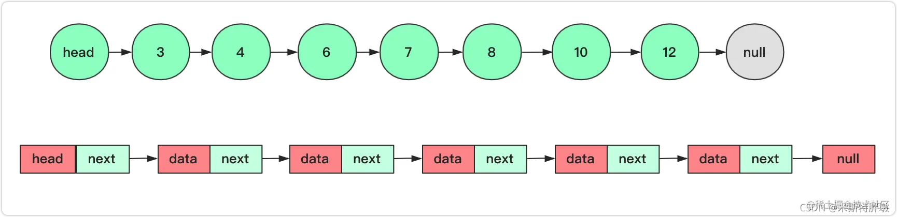
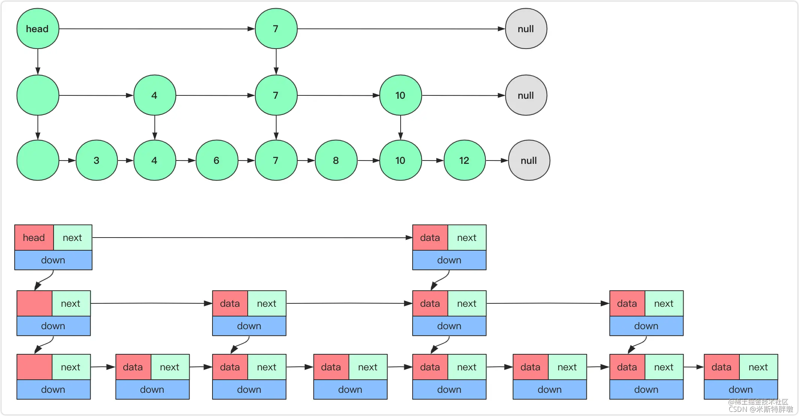

## 跳表图示

跳表（SkipList，全称跳跃表）是用于有序元素序列快速搜索查找的一个数据结构，跳表是一个随机化的数据结构，实质上就是一种可以进行二分查找的有序链表。

跳表在原有的有序链表上增加了多级索引，通过索引来实现快速查找。跳表不仅能提高搜索性能，同时也可以提高插入和删除操作的性能。它在性能上和红黑树、AVL 树不相上下，但是跳表的原理非常简单，实现也比红黑树简单很多。

回顾链表，链表的痛点就是查询很慢很慢！每次查询都是 O(n) 复杂度的操作，下图是一个带头结点的链表（头结点相当于一个固定的入口，不存储有意义的值），每次查找都需要一个个枚举，相当得慢



使用空间换时间，在上面加一层索引，让部分节点在上层能够直接被定位到，这样链表的查询时间就近乎减少一半



这样在查询某个节点时，首先会从上一层快速定位节点所在的一个范围，然后向下查找。在表结构设计上会增加一个向下的索引（指针）用来查找底层节点，平均查找速度为 O(n/2)。但是当节点数量很大的时候，它依旧很慢很慢。

二分查找是每次都能近乎折半的去压缩查找范围，要是有序链表也能这么跳起来那就太完美了。

没错，跳表就能让链表拥有近乎接近二分查找效率的一种数据结构，其原理依然是给上面加若干层索引，优化查找速度。


如上图所示，通过这样的一个数据结构，对有序链表进行查找都能达到近乎二分的性能。在上面维护那么多层的索引，首先在最高级索引上查找最后一个小于当前查找元素的位置，然后再跳到次高级索引继续查找，直到跳到最底层为止，这时候已经十分接近要查找的元素的位置了（如果查找元素存在的话）。由于根据索引可以一次跳过多个元素，所以查找的速度也就变快了。

对于理想的跳表，每向上一层，索引节点数量都是下一层的 1/2。但是这样完美的结构真的存在吗？

大概率是不存在的，因为作为一个链表，少不了增删改查的一些操作。而删除和插入可能会改变整个结构，所以这是理想的结构。至于在插入的时候是否要添加上层索引，是个概率问题（1/2 的概率）。

## 跳跃表链表结构

```C
typedef struct zskiplist {
    // 表头节点和表尾节点
    struct zskiplistNode *header, *tail;

    // 表中节点的数量
    unsigned long length;

    // 表中层数最大的节点的层数
    int level;

} zskiplist;
```

* header：指向跳跃表头节点。头节点时跳跃表的特殊节点，他的level是固定数组元素个数为32个，头节点不存储任何score和obj，level也不计入跳跃表的高度，头节点在初始化时，score值为0，ele值为NULL，32个元素的forward值都指向NULL，span为0
* tail：指向跳跃表尾节点
* length：跳跃表长度，表示第0层除头节点以外的所有节点总数
* level：跳跃表高度，除头节点外，其他节点层数最高的即为跳跃表高度

注意表头节点和其他节点的构造是一样的：表头节点也有后退指针、分值和成员对象，不过表头节点的这些属性都不会被用到

## 跳跃表节点

```C
typedef struct zskiplistNode {
    // 成员对象
    sds ele;
    // 分值
    double score;
    // 后退指针
    struct zskiplistNode *backward;
    // 层
    struct zskiplistLevel {
        // 前进指针
        struct zskiplistNode *forward;
        // 跨度
        unsigned int span;
    } level[];
} zskiplistNode;
```

* score：是一个double类型的浮点数，用户存储有序链表节点的分值，跳跃表中的所有节点都按分值从小到大来排序
* ele: 为节点的成员对象，指向一个字符串对象
* backward：后退指针，用于从从表尾向表头遍历跳跃表访问节点时使用。指向跳跃表当前节点的最底层节点的前一个节点，头节点和第一个节点的backward指向NULL
* 层(level)：为动态柔性数组，数组可以包含多个元素，每个元素都包含一个指向其他节点的指针。每个节点层高不同对应的数组大小也不同，每次创建一个新跳跃表节点的时候，根据幂次定律 (power law，值越大出现的概率越小） 随机生成一个1～32的值，一般来说，层的数量越多，访问其他节点的速度就越快

level数组中的每项元素包含以下两个元素：

* forward：指向本层下一个节点，每个层都有一个指向表尾方向的前进指针 (level[i]->forward属性），用于从表头向表尾方向访问节点，尾节点的forward指向NULL
* span：层的跨度 (level[i]->span属性） 用于记录两个节点之间的距离，即forward指向的节点于本节点之间的元素个数，span值越大，说明跳过的节点个数越多

## 跳跃表随机高度

对于每一个新插入的节点，都需要调用一个随机算法给它分配一个合理的层数。

```C
#define ZSKIPLIST_MAXLEVEL 32 /* Should be enough for 2^32 elements */
#define ZSKIPLIST_P 0.25      /* Skiplist P = 1/4 */
#define	RAND_MAX	0x7fffffff
/* Returns a random level for the new skiplist node we are going to create.
 * 返回一个随机值，用作新跳跃表节点的层数。
 * 返回值介乎 1 和 ZSKIPLIST_MAXLEVEL 之间（包含 ZSKIPLIST_MAXLEVEL），
 * 根据随机算法所使用的幂次定律，越大的值生成的几率越小。
 *
 * T = O(N)
 */
int zslRandomLevel(void) {
    static const int threshold = ZSKIPLIST_P*RAND_MAX;
    int level = 1;
    while (random() < threshold)
        level += 1;
    return (level<ZSKIPLIST_MAXLEVEL) ? level : ZSKIPLIST_MAXLEVEL;
}
```

redis通过zslRandomLevel函数随机生成一个1～32的值，作为新建节点的高度，值越大出现的概率越低，节点高度确定后不会再修改，从上述生成节点高度代码可以看出，level的初始值为1，通过while循环，每次生成一个随机值，取这个值的低16位作为x，当x小于0.25倍的0xFFFF时，level值加1；否则return退出循环，最终返回level和ZSKIPLIST_MAXLEVEL这两者中的最小值。

**Redis 跳跃表默认允许最大的层数是 32**，被源码中 ZSKIPLIST_MAXLEVEL 定义，当 Level[0] 有 264 个元素时，才能达到 32 层，所以定义 32 完全够用了

## 创建跳跃表

1. 创建跳跃表结构体对象zsl;
2. 初始化跳跃表结构体对象的值：level=1，长度=0，tail指针指向NULL;
3. 初始化跳跃表zsl的header头节点，循环初始化头节点ZSKIPLIST_MAXLEVEL的level动态柔性数组zskiplistNode元素。

```C
/* Create a skiplist node with the specified number of levels.
 * The SDS string 'ele' is referenced by the node after the call. */
zskiplistNode *zslCreateNode(int level, double score, sds ele) {
    zskiplistNode *zn =
        zmalloc(sizeof(*zn)+level*sizeof(struct zskiplistLevel)); 
  /* 节点本身的空间 和 层数 * 每层所需空间*/
    zn->score = score;
    zn->ele = ele;
    return zn;
}

/* Create a new skiplist. */
zskiplist *zslCreate(void) {
    int j;
    zskiplist *zsl;

    zsl = zmalloc(sizeof(*zsl));
    zsl->level = 1;
    zsl->length = 0;
    zsl->header = zslCreateNode(ZSKIPLIST_MAXLEVEL,0,NULL);
    for (j = 0; j < ZSKIPLIST_MAXLEVEL; j++) {
        zsl->header->level[j].forward = NULL;
        zsl->header->level[j].span = 0;
    }
    zsl->header->backward = NULL;
    zsl->tail = NULL;
    return zsl;
}
/*
将跳表的头节点初始化为最高层数（ZSKIPLIST_MAXLEVEL）的目的是为了提前分配足够的层级，以便在跳表插入元素时，可以根据元素的分布情况逐层进行插入，而不需要动态地调整层级。

跳表的设计允许元素的层级在插入时动态地增长。初始化头节点时使用最高层数，这样一来，新插入的元素可以选择逐层插入，从而更容易达到理论上跳表的平衡状态。这种方式有助于维护跳表的性能特性，例如查找、插入和删除的时间复杂度。

总结一下，将头节点初始化为最高层数的好处包括：

1. 提前分配足够的层级，以应对后续插入元素时可能的层级增长。
2. 有助于维护跳表的平衡状态，提高查找等操作的效率。
需要注意的是，初始化时将头节点的层级设置为最高层数，并不代表实际使用时每个节点都会使用到所有层级。每个节点的层级是根据一定的概率来确定的，这是跳表插入时的一种随机化策略。
*/
```

## 释放空间

```C
/* Free the specified skiplist node. The referenced SDS string representation
 * of the element is freed too, unless node->ele is set to NULL before calling
 * this function. */
void zslFreeNode(zskiplistNode *node) {
    sdsfree(node->ele); /* 释放sds的空间 */
    zfree(node);     /* 释放节点空间 */
}


/* Free a whole skiplist. */ 
/*释放整个跳表(先释放跳表内部申请的节点空间，再释放跳表本身)*/
void zslFree(zskiplist *zsl) {
    zskiplistNode *node = zsl->header->level[0].forward, *next;
    zfree(zsl->header); /*释放头节点*/
   /*节点不为空*/
    while(node) { 
      /* 通过第一层的指向关系获取下一个节点(因为任何节点都有第一层即level[0])*/
        next = node->level[0].forward;  
        zslFreeNode(node); /*把当前节点释放掉*/
        node = next;  /*将下个节点置成当前节点*/
    }
    zfree(zsl); /*释放跳表本身*/
}
```

