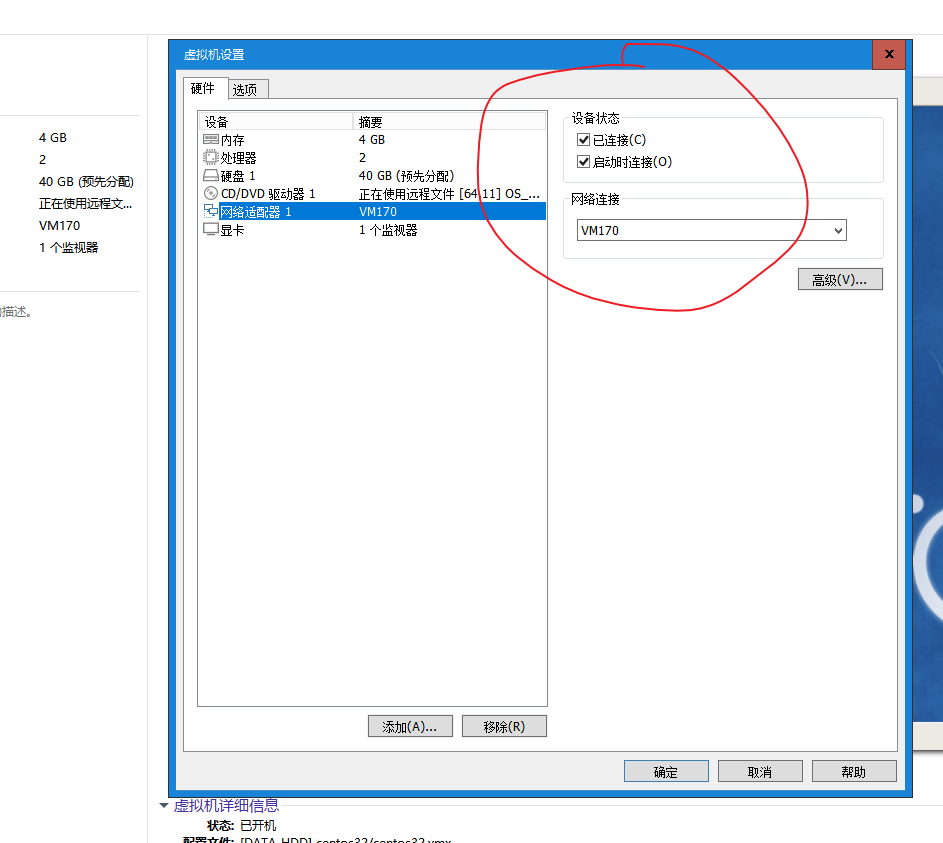

## 当在vSphere Client 创建的虚拟机没有网卡时


## 挂载本地源 centos

```shell
1.mkdir -p /mnt/cdrom     
2.mount /dev/sr0 /mnt/cdrom    #  有时候 sr0  为 cdrom  还可能是别的名字
3.vi /etc/yum.repos.d/CentOS-Base.repo  
[CentOS7]
name=CentOS7
baseurl=file:///mnt/cdrom
gpgcheck=0
enabled=1
4、yum clean all
# 如下要处于已连接状态
```



## 需要安装的软件

```shell
perl expect rdate ntpdate zip unzip rsync nfs-utils psmisc net-tools util-linux fio   # 有的系统叫 nfs-utils 有的系统叫 nfs-common
```

## 编译安装python2.7 并安装pip

```shell
yum install zlib  # 这个安装包在ubuntu上叫 apt install zlib1g
yum install zlib-devel  # 这个安装包在ubuntu上叫  apt install zlib1g-dev
yum install openssl
yum install openssl-devel   # ubuntu这样安装 apt install openssl libssl-dev -y

# 编译python源码
tar -zxvf Python-2.7.18.tgz
cd Python-2.7.18
./configure
make  && make install   # 这步完了之后要查看系统默认python是不是你安装的python版本  如果不是你安装的python版本 就要建立一个软连接 
# ln -s /usr/local/bin/python2 /usr/bin/python


# python 安装完成之后先执行这个命令  看能否正常安装pip
python -m ensurepip --upgrade

 # 解压setuptools-38.4.0.zip
unzip setuptools-38.4.0.zip
python setup.py install
# 解压  pip-9.0.1.tar.gz
python setup.py install

# 然后安装这个命令
pip install pexpect  # 可能会报错  如果报错 运行  pip install pexpect -i http://pypi.douban.com/simple --trusted-host pypi.douban.com

# 如果还报错 那就自行上网查找答案


```

## 开启nfs

```shell
chkconfig nfs on     
chkconfig portmap on  # 不同系统开启方式不同  
```

## 关闭防火墙

```sh
chkconfig iptables off # 不同系统操作方式不同


systemctl stop firewalld.service
```

## vsphere Center 用户名和密码

```s
administrator@vsphere.local  / Info_1234
```

## 设置jdk环境

```sh
vi /etc/profile


#set java environment
JAVA_HOME=/root/jdk1.8.0_221
PATH=$PATH:$JAVA_HOME/bin
CLASSPATH=.:$JAVA_HOME/lib/dt.jar:$JAVA_HOME/lib/tools.jar
export JAVA_HOME CLASSPATH PATH


source /etc/profile 
```


```sh
1、cat filename |grep "关键字" -C 10 -n    上下10行
2、cat filename |grep "关键字" -A10 -n    前10行
3、cat filename |grep "关键字" -B10 -n    后10行


sed -i 's/\r$//' updateNic.sh
```


## centos 设置默认内核

```sh
1、查看当前内核
uname -r   
2、显示已经安装的内核
rpm -qa | grep kernel 
3、grub2存在的内核
grep menuentry /boot/grub2/grub.cfg
4、配置默认内核
grub2-set-default "CentOS Linux (3.10.0-327.el7.x86_64) 7 (Core)"   
5、配置默认内核
grub2-editenv list  
6、reboot

# 查看CentOS的版本 
cat /etc/redhat-release
```

 ## 关于各种xaas的介绍

[IaaS、PaaS、SaaS、FaaS以及XPaaS大全 - 知乎 (zhihu.com)](https://zhuanlan.zhihu.com/p/387930330)

## 查询CentOS的版本

```sh
# 查询内核版本 
uname -r
# 查询系统版本
 cat /etc/redhat-release
```

## ubuntu出现解析脚本出错


```sh
# 进入模板 执行这个命令
ls -l /bin/sh  # 查看ubuntu的脚本解释器
dpkg-reconfigure dash  # 然后选择【否】
```

## ubuntu升级内核

```sh
# 连通外网安装内核
apt-get install linux-image-*****

# 查看系统已有的内核
grep menuentry /boot/grub/grub.cfg
# 打开配置文件
vi /etc/default/grub
GRUB_DEFAULT="Advanced options for Ubuntu>Ubuntu, with Linux 4.4.0-133-generic"   # Ubuntu, with Linux 4.4.0-133-generic这个改为对应的内核

# 更新配置文件
update-grub

# 重启
reboot

# 查看内核
uname -r
```

## ubuntu关闭防火墙

```sh
ufw disable
```

## Selenium 实现滚动事件

```java
  import org.openqa.selenium.interactions.Actions;

    Actions action = new Actions(driver);

    action.sendKeys(Keys.END).perform();//下拉到底部

    action.sendKeys(Keys.HOME).perform();//上拉到顶部

    action.sendKeys(Keys.PAGE_DOWN).perform();//向下滚动

    action.sendKeys(Keys.PAGE_UP).perform();//向上滚动


public void scrollRightScrollingBarOfWindow(int offset) {
		log("scroll the right scroll bar.");
		String js = "document.getElementsByTagName('main')[0].scrollTop="+offset;
		SeleniumUtil.executeJavascript(driver(), js);
	}
```

## Selenium实现文件上传

```java
public static void uploadFileByRobot( String fileName) {
		StringSelection selection = new StringSelection(fileName);
		Clipboard clipboard =Toolkit.getDefaultToolkit().getSystemClipboard();
		clipboard.setContents(selection,null);
		try {
			//新建一个Robot类的对象
			Robot robot = new Robot();
			robot.setAutoDelay(500);
			//按下Ctrl+V
			robot.keyPress(KeyEvent.VK_CONTROL);
			robot.keyPress(KeyEvent.VK_V);
			//释放Ctrl+V
			robot.keyRelease(KeyEvent.VK_CONTROL);
			robot.keyRelease(KeyEvent.VK_V);
			WaitUtil.sleep(2);
			//点击回车
			robot.keyPress(KeyEvent.VK_ENTER);
			robot.keyRelease(KeyEvent.VK_ENTER);
		} catch (AWTException e) {
			e.printStackTrace();logger.log(e);
		}
	}
```

## lsblk命令用来查看block设备的信息

## du -ah --max-depth=1  . 查询当前目录占用多少存储空间


## lsmod——显示已载入系统的模块

## oracle 开启远程访问

```shell
# linux
source /root/.bash_profile && orapwd file=$ORACLE_HOME/dbs/orapworcl force=y password=123456

# windows
D: & cd D:/app/product/orcl/BIN/ &  orapwd file=D:\app\product\orcl\database\pwdORCL.ora password=123456 entries=10  force=y
```

## oracle开启/关闭数据库监听

```shell
su - oracle -c "lsnrctl start"

su - oracle -c "lsnrctl stop"
```

## oracle的常见操作

```sql
# 先要切换用户
# 记得换行  查看归档是否开启
sqlplus /nolog << EOF
conn /as sysdba 
archive log list; 
select current_scn from v$database;
EOF

select dbms_flashback.get_system_change_number current_scn from dual;

# 开启归档
su - oracle <<EON
sqlplus /nolog << EOF
conn /as sysdba 
shutdown immediate;
startup mount;
alter database archivelog;
EOF
EON

# 将数据库变为开启状态
su - oracle <<EON
sqlplus /nolog << EOF
conn /as sysdba 
alter database open;
archive log list; 
EOF
EON

# 查询oracle实例名
sqlplus /nolog << EOF
conn /as sysdba 
show parameter name;
EOF


select name from v$datafile;


# 查询oracle工作目录
su - oracle;echo $ORACLE_HOME


# 创建表
CREATE TABLE student(
  id VARCHAR(14),
  name VARCHAR2(13)
);

drop table student;

# 向Oracle插入100条数据
#!/bin/bash
for ((i=2;i<=100;i++)) do
su - oracle <<EON
sqlplus sys/123456  as sysdba<<EOF 
insert into test6444.student(id,name) values('${i}','zhoushuiping');
commit;
EOF
EON
done


su - oracle <<EON
sqlplus /nolog << EOF
conn /as sysdba 
alter database open resetlogs;
EOF
EON
```

## oracle常见 用户和表空间操作

```sql
select count(*) from user_tables where table_name =upper('student')

insert into student(id,name) values('3','zhoushuiping');

# ORA-01589: must use RESETLOGS or NORESETLOGS option for database open
 alter database open resetlogs; # 没有对数据库关机
 
# 查询名字为TEST6444的用户
select user#,name from user$ where name='TEST6444'
# 删除用户
drop  user 用户名 cascade;

drop tablespace Test6444 including contents and datafiles

drop user TEST6444 cascade

# 查看所有用户：
select * from dba_users;
查看数据库里面所有用户，前提是你是有dba权限的帐号，如sys,system
select * from all_users;
# 查看你能管理的所有用户
select * from user_users;

# 查看用户或角色系统权限(直接赋值给用户或角色的系统权限)：
select * from dba_sys_privs;
select * from user_sys_privs; (查看当前用户所拥有的权限)
# 查看角色(只能查看登陆用户拥有的角色)所包含的权限
select * from role_sys_privs;

# 查看用户对象权限：
select * from dba_roles;
#查看用户或角色所拥有的角色：
select * from dba_role_privs;
select * from user_role_privs;
 
```


## sqlserver 常用操作

```sql
sqlcmd -S . -U sa -P sa -d database -i d:\data.sql

# 参数说明：-S 服务器地址 -U 用户名 -P 密码  -d 数据库名称 -i 脚本文件路径 


::echo off ::
@echo off
SET dbhost=120.203.30.149
SET dbuser=2group
SET dbpasswd=2group
set dbName=hdj_rsxt_1029_ce

echo 开始执行数据库脚本...
for %%i in (all_sql\*.sql) do (
    echo 正在执行 %%i 请稍后...

    sqlcmd -S %dbhost% -U %dbuser% -P %dbpasswd% -d %dbName% -i %%i

)

echo 所有脚本执行完毕。
pause
```

## 给centos根目录扩容

```shell
lsblk  # 查看系统存在的盘
mkfs.xfs -f  /dev/sde #格式化
vgextend centos /dev/sde 

lvextend -L +59.9G /dev/mapper/centos-root /dev/sde
vgdisplay
xfs_growfs /dev/centos/root
df -mh


特别注意的是：
resize2fs命令            针对的是ext2、ext3、ext4文件系统
xfs_growfs命令         针对的是xfs文件系统
```

## git 切换分支不提交

```sh
# 未提交的修改进行暂存，然后再切换到其他分支上
git stash

# 需要注意的是这个命令只会将已提交过的文件（tracked）进行暂存，如果有新增的文件是不会暂存的，可以使用
git stash --include-untracked

# 在其他分支上修改完以后再切回之前的feature分支，把暂存的修改拿出来
git stash pop

# pop会将stash应用到当前分支，并且在堆栈中删除，如果想将stash应用到当前分支并保留
git stash apply

git stash show  # 查看最新的stash和当前的差异
git stash drop {名称} # 最列表中删除某个指定stash
git stash clear # 清除所有stash
git stash branch # 从最新stash创建分支
```

## git查看远程地址

```sh
git remote -v
```

## 在windows上添加权限

```sh
Icacls D:\test3740\* /grant MSSQLSERVER:F
```

## openoular更换软件源

```sh
sed -i "s#http://repo.openeuler.org#https://mirrors.huaweicloud.com/openeuler#g" /etc/yum.repos.d/openEuler.repo
sed -i 's#EPOL/$basearch#EPOL/main/$basearch#g' /etc/yum.repos.d/openEuler.re
```

## ubuntu增加硬盘

```sh
# 查看系统硬盘
ls /dev |grep sd

fdisk sda1
```

## 安装oracle12c

```sh

1.关闭防火墙，禁止防火墙开机自启
# 关闭防火墙
systemctl stop firewalld.service 
# 禁止防火墙开机启动
systemctl disable firewalld.service
# 查看防火墙状态
systemctl status firewalld.service

2.关闭selinux
# 编辑文件
vi /etc/selinux/config
# 修改内容
SELINUX=disabled

3.yum安装必要安装包
# 使用 yum 批量安装依赖包，若执行一遍失败则继续执行第二遍（多次执行不会出现其他问题）
yum -y install binutils compat-libcap1 compat-libstdc++-33 compat-libstdc++-33*i686 compat-libstdc++-33*.devel compat-libstdc++-33 compat-libstdc++-33*.devel gcc gcc-c++ glibc glibc*.i686 glibc-devel glibc-devel*.i686 ksh libaio libaio*.i686 libaio-devel libaio-devel*.devel libgcc libgcc*.i686 libstdc++ libstdc++*.i686 libstdc++-devel libstdc++-devel*.devel libXi libXi*.i686 libXtst libXtst*.i686 make sysstat unixODBC unixODBC*.i686 unixODBC-devel unixODBC-devel*.i686

# 检查是否安装成功（31个安装包）

rpm -q binutils compat-libcap1 compat-libstdc++-33 gcc gcc-c++ glibc glibc-devel ksh libaio libaio-devel libgcc libstdc++ libstdc++-devel libXi libXtst make sysstat unixODBC unixODBC-devel | wc -l


4.创建 swap

https://shanhy.blog.csdn.net/article/details/101616510

5.创建 oracle 分区（可选）
# 查看硬盘及分区信息（启动Disk开头的就是硬盘，Device开头的就是分区）
fdisk -l
# 创建分区（/dev/sdc 是硬盘，是你需要创建分区的硬盘，创建分区后会生成 /dev/sdc1，如果本来有sdc1，则会出现sdc2）
fdisk /dev/sdc
# 格式化新创建的分区
mkfs.xfs /dev/sdc1
# 将分区添加到 /etc/fstab 文件中，使之开机自动挂载（编辑保存 fstab 文件后不会立即生效）
vim /etc/fstab
/dev/sdc1        /u01     xfs      defaults 0 0

6.创建 oracle data 目录（同第5步可选）
# 创建目录
mkdir /u01
# 重新加载文件 /etc/fstab 所有内容。该操作会忽略所有已经完成的操作，所以多次执行，只会有第一次能看到效果。
mount -a

7.设置时区、升级系统、安装桌面环境
# 设置时区
timedatectl set-timezone Asia/Shanghai
# 升级系统
yum clean all && yum update -y
# 安装桌面环境（两个组包必须，不然安装oracle会出现卡死现象）
yum groupinstall "GNOME Desktop" "Server with GUI" -y
# 安装完毕设置开机启动桌面环境
systemctl set-default graphical.target

8.创建oracle用户与用户组
# 创建oinstall和dba组
/usr/sbin/groupadd oinstall
/usr/sbin/groupadd dba
# 创建oracle用户
/usr/sbin/useradd -g oinstall -G dba oracle
# 设置oracle密码
passwd oracle
# 查看创建结果
id oracle


9.参数配置
# 配置内核参数（这些参数根据你机器的配置不同，有些参数需要再次修改，在安装oralce过程中的check那一步，会给出提示，按要求逐个修改对应的推荐值即可）
vim /etc/sysctl.conf
fs.aio-max-nr = 1048576
fs.file-max = 6815744
kernel.shmall = 2097152
kernel.shmmax = 8329226240
kernel.shmmni = 4096
kernel.sem = 250 32000 100 128
net.ipv4.ip_local_port_range = 9000 65500
net.core.rmem_default = 262144
net.core.rmem_max = 4194304
net.core.wmem_default = 262144
net.core.wmem_max = 1048586

# 配置ulimit参数
vim /etc/security/limits.conf
oracle soft nproc 65536
oracle hard nproc 65536
oracle soft nofile 65536
oracle hard nofile 65536
oracle soft stack 65536
oracle hard stack 65536

# 设置上面创建的数据目录权限
chown -R oracle:oinstall /u01
chmod -R 775 /u01
chmod g+s /u01


10.重启服务器
reboot

12.解压并开始安装
su - oracle  
cd /opt/
unzip linuxx64_12201_database.zip
cd database/
./runInstaller


#需要特别强调的是，当出现这个窗口的时候，不要无脑的点击 OK了，请仔细看一下上面的提示，是要求你执行上面那两个命令的，所以把那两行命令在服务上执行一下，执行完毕后再点击OK（新开一个窗口，用 root 用户执行）。
/u01/app/oraInventory/orainstRoot.sh
/u01/app/oracle/product/12.2.0/dbhome_1/root.sh


13.配置环境变量

vim ~/.bash_profile

# 下面环境变量配置内容，注意每一个路径都仔细检查一下不要错了
export EDITOR=vi
export ORACLE_SID=orcl
export ORACLE_BASE=/u01/app/oracle
export ORACLE_HOME=$ORACLE_BASE/product/12.2.0/dbhome_1
export LD_LIBRARY_PATH=$ORACLE_HOME/lib:/usr/lib
export PATH=/u01/app/oracle/product/12.2.0/dbhome_1/bin:/bin:/usr/bin:/usr/sbin:/usr/local/bin:/usr/X11R6/bin
export PATH=$ORACLE_HOME/bin:$PATH

# 执行命令使环境变量生效
source ~/.bash_profile


```

## oracle12c新特性

```plsql
create pluggable database pdb2 admin user pdb2 identified by oracle file_name_convert=('/u01/app/oracle/oradata/orcl/pdbseed','/u01/app/oracle/oradata/orcl/pdb2');

create pluggable database pdb2 admin user pdb2_admin identified by oracle roles=(connect) file_name_convert=('/u01/app/oracle/oradata/LOTTU/pdbseed','/u01/app/oracle/oradata/LOTTU/pdb2');


select con_id,name,open_mode from V$pdbs;


alter pluggable database DB_**  open;

alter pluggable database ORCLPDB open read write;

 alter pluggable database ORCLPDB close;

alter session set container=ORCLPDB;

create table test1 (id VARCHAR(14),
  name VARCHAR2(13);
insert into test1 values (1, "ddd");

alter pluggable database pdb2 open read write;

alter session set container=orclpdb;

conn usr/passwd@orclpdb;
                    
sqlplus sys/123456@orclpdb as sysdba
```

```sh
#/bin/bash
echo "备份tnsnames.ora 数据=========================="
cp  $ORACLE_HOME/network/admin/tnsnames.ora ./tns.txt
cp  $ORACLE_HOME/network/admin/tnsnames.ora ./tns2.txt

cat tns2.txt >> tns.txt

sed -i '16c ORCLPDB' tns.txt
sed -i '21c  (SERVICE_NAME = orclpdb)' tns.txt
rm -r $ORACLE_HOME/network/admin/tnsnames.ora
cp tns.txt  $ORACLE_HOME/network/admin/tnsnames.ora

echo "打开ORCLPDB数据库===================================="
su - oracle -c "sqlplus / as sysdba <<\"EOF\"
alter pluggable database ORCLPDB open read write;
alter session set container=ORCLPDB;
exit;
EOF"
echo "重启监听======================================"
lsnrctl stop
lsnrctl start
echo "登录oracle 改变当前会话为 ORCLPDB 并 新建表========================="
su - oracle -c "sqlplus /nolog <<\"EOF\"
conn / as sysdba
alter session set container=ORCLPDB;
drop table student;
CREATE TABLE student(
  id VARCHAR(14),
  name VARCHAR2(13)
);
exit;
EOF"

```

