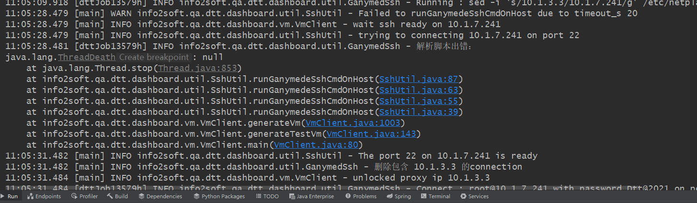

## 当在vSphere Client 创建的虚拟机没有网卡时


## 挂载本地源 centos

```shell
1.mkdir -p /mnt/cdrom     
2.mount /dev/sr0 /mnt/cdrom    #  有时候 sr0  为 cdrom  还可能是别的名字
3.vi /etc/yum.repos.d/CentOS-Base.repo  
[CentOS7]
name=CentOS7
baseurl=file:///mnt/cdrom
gpgcheck=0
enabled=1
4、yum clean all
# 如下要处于已连接状态
```


## 需要安装的软件

```shell
perl expect rdate ntpdate zip unzip rsync nfs-utils psmisc net-tools util-linux fio   # 有的系统叫 nfs-utils 有的系统叫 nfs-common
```

## 编译安装python2.7 并安装pip

```shell
yum install zlib  # 这个安装包在ubuntu上叫 apt install zlib1g
yum install zlib-devel  # 这个安装包在ubuntu上叫  apt install zlib1g-dev
yum install openssl
yum install openssl-devel   # ubuntu这样安装 apt install openssl libssl-dev -y

# 编译python源码
tar -zxvf Python-2.7.18.tgz
cd Python-2.7.18
./configure
make  && make install   # 这步完了之后要查看系统默认python是不是你安装的python版本  如果不是你安装的python版本 就要建立一个软连接 
# ln -s /usr/local/bin/python2 /usr/bin/python


# python 安装完成之后先执行这个命令  看能否正常安装pip
python -m ensurepip --upgrade

 # 解压setuptools-38.4.0.zip
unzip setuptools-38.4.0.zip
python setup.py install
# 解压  pip-9.0.1.tar.gz
python setup.py install

# 然后安装这个命令
pip install pexpect  # 可能会报错  如果报错 运行  pip install pexpect -i http://pypi.douban.com/simple --trusted-host pypi.douban.com

# 如果还报错 那就自行上网查找答案


```

## 开启nfs

```shell
chkconfig nfs on     
chkconfig portmap on  # 不同系统开启方式不同  
```

## 关闭防火墙

```sh
chkconfig iptables off # 不同系统操作方式不同


systemctl stop firewalld.service
```

## vsphere Center 用户名和密码

```sh
administrator@vsphere.local  / Dtt@2021
```

## 设置jdk环境

```sh
vi /etc/profile


#set java environment
JAVA_HOME=/root/jdk1.8.0_221
PATH=$PATH:$JAVA_HOME/bin
CLASSPATH=.:$JAVA_HOME/lib/dt.jar:$JAVA_HOME/lib/tools.jar
export JAVA_HOME CLASSPATH PATH


source /etc/profile 
```

## sed替换空格

```sh
1、cat filename |grep "关键字" -C 10 -n    上下10行
2、cat filename |grep "关键字" -A10 -n    前10行
3、cat filename |grep "关键字" -B10 -n    后10行
grep -n -A 100 "try to valid uivm ui21018114154346/10.1.10.89 for attached job 24467" dttlog/dttDashboardLogger.log

taskkill /f /t /im chrome.exe & taskkill /f /t /im chromedriver.exe

taskkill /f /t /FI 'MEMUSAGE gt 80000' /im java.exe

sed -i 's/\r$//' updateNic.sh
```


## centos 设置默认内核

```sh
1、查看当前内核
uname -r   
2、显示已经安装的内核
rpm -qa | grep kernel 
3、grub2存在的内核
grep menuentry /boot/grub2/grub.cfg
4、配置默认内核
grub2-set-default "CentOS Linux (3.10.0-327.el7.x86_64) 7 (Core)"   
5、配置默认内核
grub2-editenv list  
6、reboot

# 查看CentOS的版本 
cat /etc/redhat-release
```

 ## 关于各种xaas的介绍

[IaaS、PaaS、SaaS、FaaS以及XPaaS大全 - 知乎 (zhihu.com)](https://zhuanlan.zhihu.com/p/387930330)

## 查询CentOS的版本

```sh
# 查询内核版本 
uname -r
# 查询系统版本
 cat /etc/redhat-release
```

## ubuntu出现解析脚本出错



```sh
# 进入模板 执行这个命令
ls -l /bin/sh  # 查看ubuntu的脚本解释器
dpkg-reconfigure dash  # 然后选择【否】
```

## ubuntu升级内核

```sh
(https://blog.csdn.net/bby1987/article/details/104264285)
dpkg -i --force-overwrite  linux-image-***** # 强制安装内核

# 连通外网安装内核
apt-get install linux-image-*****

# 查看系统已有的内核
grep menuentry /boot/grub/grub.cfg
# 打开配置文件
vi /etc/default/grub
GRUB_DEFAULT="Advanced options for Ubuntu>Ubuntu, with Linux 4.4.0-133-generic"   # Ubuntu, with Linux 4.4.0-133-generic这个改为对应的内核

# 更新配置文件
update-grub

# 重启
reboot

# 查看内核
uname -r
```

## ubuntu关闭防火墙

```sh
ufw disable
```

## Selenium 实现滚动事件

```java
  import org.openqa.selenium.interactions.Actions;

    Actions action = new Actions(driver);

    action.sendKeys(Keys.END).perform();//下拉到底部

    action.sendKeys(Keys.HOME).perform();//上拉到顶部

    action.sendKeys(Keys.PAGE_DOWN).perform();//向下滚动

    action.sendKeys(Keys.PAGE_UP).perform();//向上滚动


public void scrollRightScrollingBarOfWindow(int offset) {
		log("scroll the right scroll bar.");
		String js = "document.getElementsByTagName('main')[0].scrollTop="+offset;
		SeleniumUtil.executeJavascript(driver(), js);
	}
```

## Selenium实现文件上传

```java
public static void uploadFileByRobot( String fileName) {
		StringSelection selection = new StringSelection(fileName);
		Clipboard clipboard =Toolkit.getDefaultToolkit().getSystemClipboard();
		clipboard.setContents(selection,null);
		try {
			//新建一个Robot类的对象
			Robot robot = new Robot();
			robot.setAutoDelay(500);
			//按下Ctrl+V
			robot.keyPress(KeyEvent.VK_CONTROL);
			robot.keyPress(KeyEvent.VK_V);
			//释放Ctrl+V
			robot.keyRelease(KeyEvent.VK_CONTROL);
			robot.keyRelease(KeyEvent.VK_V);
			WaitUtil.sleep(2);
			//点击回车
			robot.keyPress(KeyEvent.VK_ENTER);
			robot.keyRelease(KeyEvent.VK_ENTER);
		} catch (AWTException e) {
			e.printStackTrace();logger.log(e);
		}
	}
```

## 查看block设备的信息
```sh
lsblk 
```

## 查询当前目录占用多少存储空间

```sh
du -ah --max-depth=1  .
```
## 显示已载入系统的模块
```sh
lsmod
```

## oracle 开启远程访问

```shell
# linux
source /root/.bash_profile && orapwd file=$ORACLE_HOME/dbs/orapworcl force=y password=123456

# windows
D: & cd D:/app/product/orcl/BIN/ &  orapwd file=D:\app\product\orcl\database\pwdORCL.ora password=123456 entries=10  force=y
```

## oracle开启/关闭数据库监听

```shell
su - oracle -c "lsnrctl start"

su - oracle -c "lsnrctl stop"
```

## oracle的常见操作

```sql
# 先要切换用户
# 记得换行  查看归档是否开启
sqlplus /nolog << EOF
conn /as sysdba 
archive log list; 
select current_scn from v$database;
EOF

select dbms_flashback.get_system_change_number current_scn from dual;

# 开启归档
su - oracle <<EON
sqlplus /nolog << EOF
conn /as sysdba 
shutdown immediate;
startup mount;
alter database archivelog;
EOF
EON

# oracle数据库置为nomount状态
su - oracle <<EON
sqlplus /nolog << EOF
conn /as sysdba 
shutdown immediate;
startup nomount; 
EOF
EON

# 将数据库变为开启状态
su - oracle <<EON
sqlplus /nolog << EOF
conn /as sysdba 
alter database open;
archive log list; 
EOF
EON

# 查询oracle实例名
sqlplus /nolog << EOF
conn /as sysdba 
show parameter name;
EOF


select name from v$datafile;


# 查询oracle工作目录
su - oracle;echo $ORACLE_HOME


# 创建表
CREATE TABLE student(
  id VARCHAR(14),
  name VARCHAR2(13)
);

drop table student;

# 向Oracle插入100条数据
#!/bin/bash
for ((i=2;i<=100;i++)) do
su - oracle <<EON
sqlplus sys/123456  as sysdba<<EOF 
insert into test6444.student(id,name) values('${i}','zhoushuiping');
commit;
EOF
EON
done


su - oracle <<EON
sqlplus /nolog << EOF
conn /as sysdba 
alter database open resetlogs;
EOF
EON
```

## oracle常见的用户和表空间操作

```sql
select count(*) from user_tables where table_name =upper('student')

insert into student(id,name) values('3','zhoushuiping');

# ORA-01589: must use RESETLOGS or NORESETLOGS option for database open
 alter database open resetlogs; # 没有对数据库关机
 
# 查询名字为TEST6444的用户
select user#,name from user$ where name='TEST6444'
# 删除用户
drop  user 用户名 cascade;

drop tablespace Test6444 including contents and datafiles

drop user TEST6444 cascade

# 查看所有用户：
select * from dba_users;
查看数据库里面所有用户，前提是你是有dba权限的帐号，如sys,system
select * from all_users;
# 查看你能管理的所有用户
select * from user_users;

# 查看用户或角色系统权限(直接赋值给用户或角色的系统权限)：
select * from dba_sys_privs;
select * from user_sys_privs; (查看当前用户所拥有的权限)
# 查看角色(只能查看登陆用户拥有的角色)所包含的权限
select * from role_sys_privs;

# 查看用户对象权限：
select * from dba_roles;
#查看用户或角色所拥有的角色：
select * from dba_role_privs;
select * from user_role_privs;
 
```


## sqlserver常用操作

```sql
sqlcmd -S . -U sa -P sa -d database -i d:\data.sql

# 参数说明：-S 服务器地址 -U 用户名 -P 密码  -d 数据库名称 -i 脚本文件路径 


::echo off ::
@echo off
SET dbhost=120.203.30.149
SET dbuser=2group
SET dbpasswd=2group
set dbName=hdj_rsxt_1029_ce

echo 开始执行数据库脚本...
for %%i in (all_sql\*.sql) do (
    echo 正在执行 %%i 请稍后...

    sqlcmd -S %dbhost% -U %dbuser% -P %dbpasswd% -d %dbName% -i %%i

)

echo 所有脚本执行完毕。
pause
```

## 给centos根目录扩容
1. **查看系统存在的未使用的盘**
```shell
[root@vm31021171758798 ~]# lsblk
NAME            MAJ:MIN RM  SIZE RO TYPE MOUNTPOINT
sda               8:0    0   20G  0 disk
├─sda1            8:1    0    1G  0 part /boot
└─sda2            8:2    0   19G  0 part
  ├─centos-root 253:0    0   17G  0 lvm  /
  └─centos-swap 253:1    0    2G  0 lvm  [SWAP]
sdb               8:16   0  100G  0 disk /root
sdc               8:32   0   50G  0 disk
sr0              11:0    1  4.3G  0 rom
[root@vm31021171758798 ~]# fdisk -l
```
2. **新建磁盘信息**
```sh
[root@vm31021171758798 ~]# fdisk /dev/sdc
欢迎使用 fdisk (util-linux 2.23.2)。

更改将停留在内存中，直到您决定将更改写入磁盘。
使用写入命令前请三思。

Device does not contain a recognized partition table
使用磁盘标识符 0x7cdc9dc9 创建新的 DOS 磁盘标签。

m->n->p->回车->回车->w


命令(输入 m 获取帮助)：m
命令操作
   a   toggle a bootable flag
   b   edit bsd disklabel
   c   toggle the dos compatibility flag
   d   delete a partition
   g   create a new empty GPT partition table
   G   create an IRIX (SGI) partition table
   l   list known partition types
   m   print this menu
   n   add a new partition
   o   create a new empty DOS partition table
   p   print the partition table
   q   quit without saving changes
   s   create a new empty Sun disklabel
   t   change a partitions system id
   u   change display/entry units
   v   verify the partition table
   w   write table to disk and exit
   x   extra functionality (experts only)

命令(输入 m 获取帮助)：n
Partition type:
   p   primary (0 primary, 0 extended, 4 free)
   e   extended
Select (default p): p
分区号 (1-4，默认 1)：
起始 扇区 (2048-104857599，默认为 2048)： ->回车
将使用默认值 2048
Last 扇区, +扇区 or +size{K,M,G} (2048-104857599，默认为 104857599)：
将使用默认值 104857599    ->回车
分区 1 已设置为 Linux 类型，大小设为 50 GiB

命令(输入 m 获取帮助)：w
The partition table has been altered!

Calling ioctl() to re-read partition table.
正在同步磁盘。
[root@vm31021171758798 ~]#
```
3. **格式化磁盘分区**
```sh
[root@vm31021171758798 ~]# df -hT
文件系统                    类型      容量  已用  可用 已用% 挂载点
/dev/mapper/centos-root     xfs        17G  3.2G   14G   19% /
devtmpfs                    devtmpfs  1.4G     0  1.4G    0% /dev
tmpfs                       tmpfs     1.4G   64K  1.4G    1% /dev/shm
tmpfs                       tmpfs     1.4G  9.0M  1.4G    1% /run
tmpfs                       tmpfs     1.4G     0  1.4G    0% /sys/fs/cgroup
/dev/sda1                   xfs      1014M  145M  870M   15% /boot
tmpfs                       tmpfs     285M     0  285M    0% /run/user/0
10.1.0.9:/share/autoPackage nfs        24T   19T  5.9T   76% /home/i2auto
/dev/sdb                    xfs       100G  165M  100G    1% /root
10.1.0.9:/share/product     nfs4       24T   19T  5.9T   76% /mnt/share
[root@vm31021171758798 ~]# mkfs.
mkfs.btrfs   mkfs.cramfs  mkfs.ext2    mkfs.ext3    mkfs.ext4    mkfs.minix   mkfs.xfs
[root@vm31021171758798 ~]# mkfs.xfs /dev/sdc
sdc   sdc1
[root@vm31021171758798 ~]# mkfs.xfs /dev/sdc1
meta-data=/dev/sdc1              isize=512    agcount=4, agsize=3276736 blks
         =                       sectsz=512   attr=2, projid32bit=1
         =                       crc=1        finobt=0, sparse=0
data     =                       bsize=4096   blocks=13106944, imaxpct=25
         =                       sunit=0      swidth=0 blks
naming   =version 2              bsize=4096   ascii-ci=0 ftype=1
log      =internal log           bsize=4096   blocks=6399, version=2
         =                       sectsz=512   sunit=0 blks, lazy-count=1
realtime =none                   extsz=4096   blocks=0, rtextents=0
[root@vm31021171758798 ~]#
```
4. **创建物理卷**
```sh
[root@vm31021171758798 ~]# pvcreate /dev/sdc1
WARNING: xfs signature detected on /dev/sdc1 at offset 0. Wipe it? [y/n]: y
  Wiping xfs signature on /dev/sdc1.
  Physical volume "/dev/sdc1" successfully created.
[root@vm31021171758798 ~]#
```
5. **将物理卷加到卷组**
```sh
[root@vm31021171758798 ~]# pvdisplay
  --- Physical volume ---
  PV Name               /dev/sda2
  VG Name               centos
  PV Size               <19.00 GiB / not usable 3.00 MiB
  Allocatable           yes (but full)
  PE Size               4.00 MiB
  Total PE              4863
  Free PE               0
  Allocated PE          4863
  PV UUID               zNLsCB-RYSG-0s3N-LOEf-N60E-I1M0-m9sOBN

  "/dev/sdc1" is a new physical volume of "<50.00 GiB"
  --- NEW Physical volume ---
  PV Name               /dev/sdc1
  VG Name
  PV Size               <50.00 GiB
  Allocatable           NO
  PE Size               0
  Total PE              0
  Free PE               0
  Allocated PE          0
  PV UUID               32Zjtb-wKKi-KY8t-Ybnq-WbVg-zcDN-QKwVq5

[root@vm31021171758798 ~]# vgex
vgexport  vgextend
[root@vm31021171758798 ~]# vgextend centos /dev/sdc1
  Volume group "centos" successfully extended
[root@vm31021171758798 ~]#
```

6. **增加根目录大小**
```sh
lvresize -L +50G /dev/mapper/centos-root
xfs_growfs /dev/mapper/centos-root
```

```shell
lsblk  # 查看系统存在的盘
mkfs.xfs -f  /dev/sde #格式化
vgextend centos /dev/sde 

lvextend -L +59.9G /dev/mapper/centos-root /dev/sde
vgdisplay
xfs_growfs /dev/centos/root
df -mh


特别注意的是：
resize2fs命令            针对的是ext2、ext3、ext4文件系统
xfs_growfs命令         针对的是xfs文件系统
```

## 将`/home` 目录的空间转移到根目录中
1. **查看磁盘使用情况**

```sh
[root@localhost ~]# df -h
文件系统                     容量  已用  可用 已用% 挂载点
devtmpfs                     4.0M     0  4.0M    0% /dev
tmpfs                        841M     0  841M    0% /dev/shm
tmpfs                        337M  9.3M  328M    3% /run
tmpfs                        4.0M     0  4.0M    0% /sys/fs/cgroup
/dev/mapper/openeuler-root    64G  3.2G   57G    6% /
tmpfs                        841M   32K  841M    1% /tmp
/dev/sda2                    974M  126M  781M   14% /boot
/dev/sda1                    599M  6.0M  593M    1% /boot/efi
/dev/mapper/openeuler-home    31G   32K   30G    1% /home
10.1.0.9:/share/autoPackage   24T   19T  6.0T   76% /home/i2auto
```

2. **卸载`/home`目录**

```sh
# umount /home 或者 umount /dev/mapper/vg_rogear-lv_home
[root@localhost ~]# umount /home
umount: /home: target is busy.


[root@localhost ~]# fuser -m /home/
[root@localhost ~]# ps -ef |grep /home/
root       45193   45052  0 10:34 pts/0    00:00:00 grep --color=auto /home/
[root@localhost ~]# ps -ef |grep '/home/'
root       45200   45052  0 10:34 pts/0    00:00:00 grep --color=auto /home/
[root@localhost ~]# umount /home
umount: /home: target is busy.
[root@localhost ~]# lsof | grep /home
[root@localhost ~]# lsof | grep /home
[root@localhost ~]# lsof | grep /home
[root@localhost ~]# umount -f /home
umount: /home: target is busy.
[root@localhost ~]# umount -f /home
umount: /home: target is busy.
[root@localhost ~]# umount -l /home
[root@localhost ~]# mount | grep /home
[root@localhost ~]# dmesg | grep /home
[ 1707.670159] Hook /home return 0
[ 1707.670500] Hook /home/i2auto return 0
[27754.575473] Unhook /home return 0
[27754.575565] Unhook /home/i2auto return 0
[27852.313931] Hook /home return 0
[27852.314238] Hook /home/i2auto return 0
[33905.897932] Unhook /home return 0
[33905.914995] Unhook /home/i2auto return 0
[root@localhost ~]# umount /home/i2auto
umount: /home/i2auto: no mount point specified.
[root@localhost ~]# df -h
Filesystem                  Size  Used Avail Use% Mounted on
devtmpfs                    3.7G     0  3.7G   0% /dev
tmpfs                       3.7G     0  3.7G   0% /dev/shm
tmpfs                       1.5G   18M  1.5G   2% /run
tmpfs                       4.0M     0  4.0M   0% /sys/fs/cgroup
/dev/mapper/openeuler-root   57G  6.6G   47G  13% /
tmpfs                       3.7G  136K  3.7G   1% /tmp
/dev/sda1                   974M  237M  671M  27% /boot
/dev/sdb                    100G  1.5G   99G   2% /root
[root@localhost ~]# unmount -f umount /home/i2auto
-bash: unmount: command not found
[root@localhost ~]#  umount /home/i2auto
umount: /home/i2auto: no mount point specified.
[root@localhost ~]#  umount /home/i2auto
umount: /home/i2auto: no mount point specified.
[root@localhost ~]# mount | grep /home/i2auto
[root@localhost ~]# mount | grep /home/i2code
[root@localhost ~]# mount | grep /home/i2code
[root@localhost ~]# umount /home/
umount: /home/: not mounted.
```

3. **删除/home所在的lv**

```sh
## 列出所有逻辑卷
[root@localhost ~]# lvdisplay
  --- Logical volume ---
  LV Path                /dev/openeuler/swap
  LV Name                swap
  VG Name                openeuler
  LV UUID                zPb7J6-i1AB-GXKu-t4IE-gzuU-MZ0y-VxzkOk
  LV Write Access        read/write
  LV Creation host, time localhost.localdomain, 2022-06-28 17:17:                                                                                   12 +0800
  LV Status              available
  # open                 2
  LV Size                <2.06 GiB
  Current LE             527
  Segments               1
  Allocation             inherit
  Read ahead sectors     auto
  - currently set to     256
  Block device           253:1

  --- Logical volume ---
  LV Path                /dev/openeuler/root
  LV Name                root
  VG Name                openeuler
  LV UUID                fVMcoT-p4ml-35ME-90Qs-nYNm-xobM-li33Dg
  LV Write Access        read/write
  LV Creation host, time localhost.localdomain, 2022-06-28 17:17:                                                                                   12 +0800
  LV Status              available
  # open                 1
  LV Size                <56.94 GiB
  Current LE             14576
  Segments               2
  Allocation             inherit
  Read ahead sectors     auto
  - currently set to     256
  Block device           253:0

  --- Logical volume ---
  LV Path                /dev/openeuler/home
  LV Name                home
  VG Name                openeuler
  LV UUID                Wf3BdL-VnnZ-4z1j-WT1d-SuZO-KcDn-KoUvEF
  LV Write Access        read/write
  LV Creation host, time localhost.localdomain, 2022-09-09 14:31:                                                                                   35 +0800
  LV Status              available
  # open                 0
  LV Size                <15.00 GiB
  Current LE             3839
  Segments               1
  Allocation             inherit
  Read ahead sectors     auto
  - currently set to     256
  Block device           253:2

## 删除逻辑卷
[root@localhost ~]# lvremove /dev/openeuler/home
Do you really want to remove active logical volume openeuler/home? [y/n]: y
  Logical volume "home" successfully removed.
```
4. **扩容`/dev/openeuler/root`** 

```sh
[root@localhost ~]# lvextend -L +10G /dev/openeuler/root
  Size of logical volume openeuler/root changed from <56.94 GiB (14576 extents) to <66.94 GiB (17136 extents).
  Logical volume openeuler/root successfully resized.
```
5. **扩展 `/dev/openeuler/root`**

```sh
[root@localhost ~]# resize2fs /dev/openeuler/root
resize2fs 1.46.4 (18-Aug-2021)
Filesystem at /dev/openeuler/root is mounted on /; on-line resizing required
old_desc_blocks = 8, new_desc_blocks = 9
The filesystem on /dev/openeuler/root is now 17547264 (4k) blocks long.

[root@localhost ~]# df -h
Filesystem                  Size  Used Avail Use% Mounted on
devtmpfs                    3.7G     0  3.7G   0% /dev
tmpfs                       3.7G   12K  3.7G   1% /dev/shm
tmpfs                       1.5G   18M  1.5G   2% /run
tmpfs                       4.0M     0  4.0M   0% /sys/fs/cgroup
/dev/mapper/openeuler-root   66G  6.3G   57G  11% /
tmpfs                       3.7G  136K  3.7G   1% /tmp
/dev/sda1                   974M  237M  671M  27% /boot
/dev/sdb                    100G  1.5G   99G   2% /root

```
6. **重新创建`/home`**

```sh
[root@localhost ~]# lvcreate -L 2G -n home  openeuler
  Logical volume "home" created.
```
7. **创建文件系统**

```sh
[root@localhost ~]# df -hT
Filesystem                 Type      Size  Used Avail Use% Mounted on
devtmpfs                   devtmpfs  3.7G     0  3.7G   0% /dev
tmpfs                      tmpfs     3.7G   12K  3.7G   1% /dev/shm
tmpfs                      tmpfs     1.5G   18M  1.5G   2% /run
tmpfs                      tmpfs     4.0M     0  4.0M   0% /sys/fs/cgroup
/dev/mapper/openeuler-root ext4       66G  6.3G   57G  11% /
tmpfs                      tmpfs     3.7G  136K  3.7G   1% /tmp
/dev/sda1                  ext4      974M  237M  671M  27% /boot
/dev/sdb                   xfs       100G  1.5G   99G   2% /root
[root@localhost ~]# mkfs
mkfs         mkfs.btrfs   mkfs.cramfs  mkfs.ext2    mkfs.ext3    mkfs.ext4    mkfs.fat     mkfs.minix   mkfs.msdos   mkfs.vfat    mkfs.xfs
[root@localhost ~]# mkfs.xfs /dev/openeuler/home
meta-data=/dev/openeuler/home    isize=512    agcount=4, agsize=131072 blks
         =                       sectsz=512   attr=2, projid32bit=1
         =                       crc=1        finobt=1, sparse=1, rmapbt=0
         =                       reflink=1    bigtime=0 inobtcount=0
data     =                       bsize=4096   blocks=524288, imaxpct=25
         =                       sunit=0      swidth=0 blks
naming   =version 2              bsize=4096   ascii-ci=0, ftype=1
log      =internal log           bsize=4096   blocks=2560, version=2
         =                       sectsz=512   sunit=0 blks, lazy-count=1
realtime =none                   extsz=4096   blocks=0, rtextents=0
```

8. **重新挂载`home`**

```sh
[root@localhost ~]# mount /dev/openeuler/home /home/
[root@localhost ~]# df -h
Filesystem                  Size  Used Avail Use% Mounted on
devtmpfs                    3.7G     0  3.7G   0% /dev
tmpfs                       3.7G   12K  3.7G   1% /dev/shm
tmpfs                       1.5G   18M  1.5G   2% /run
tmpfs                       4.0M     0  4.0M   0% /sys/fs/cgroup
/dev/mapper/openeuler-root   66G  6.3G   57G  11% /
tmpfs                       3.7G  136K  3.7G   1% /tmp
/dev/sda1                   974M  237M  671M  27% /boot
/dev/sdb                    100G  1.5G   99G   2% /root
/dev/mapper/openeuler-home  2.0G   47M  2.0G   3% /home
```
## git 切换分支不提交

```sh
# 未提交的修改进行暂存，然后再切换到其他分支上
git stash

# 需要注意的是这个命令只会将已提交过的文件（tracked）进行暂存，如果有新增的文件是不会暂存的，可以使用
git stash --include-untracked

# 在其他分支上修改完以后再切回之前的feature分支，把暂存的修改拿出来
git stash pop

# pop会将stash应用到当前分支，并且在堆栈中删除，如果想将stash应用到当前分支并保留
git stash apply

git stash show  # 查看最新的stash和当前的差异
git stash drop {名称} # 最列表中删除某个指定stash
git stash clear # 清除所有stash
git stash branch # 从最新stash
```

## git查看远程地址

```sh
git remote -v
```

## 在windows上添加权限

```sh
Icacls D:\test3740\* /grant MSSQLSERVER:F
```

## openEuler更换软件源

```sh
sed -i "s#http://repo.openeuler.org#https://mirrors.huaweicloud.com/openeuler#g" /etc/yum.repos.d/openEuler.repo
sed -i 's#EPOL/$basearch#EPOL/main/$basearch#g' /etc/yum.repos.d/openEuler.re
```

## ubuntu增加硬盘

```sh
# 查看系统硬盘
ls /dev |grep sd

fdisk sda1
```

## 安装oracle12c

```sh

1.关闭防火墙，禁止防火墙开机自启
# 关闭防火墙
systemctl stop firewalld.service 
# 禁止防火墙开机启动
systemctl disable firewalld.service
# 查看防火墙状态
systemctl status firewalld.service

2.关闭selinux
# 编辑文件
vi /etc/selinux/config
# 修改内容
SELINUX=disabled

3.yum安装必要安装包
# 使用 yum 批量安装依赖包，若执行一遍失败则继续执行第二遍（多次执行不会出现其他问题）
yum -y install binutils compat-libcap1 compat-libstdc++-33 compat-libstdc++-33*i686 compat-libstdc++-33*.devel compat-libstdc++-33 compat-libstdc++-33*.devel gcc gcc-c++ glibc glibc*.i686 glibc-devel glibc-devel*.i686 ksh libaio libaio*.i686 libaio-devel libaio-devel*.devel libgcc libgcc*.i686 libstdc++ libstdc++*.i686 libstdc++-devel libstdc++-devel*.devel libXi libXi*.i686 libXtst libXtst*.i686 make sysstat unixODBC unixODBC*.i686 unixODBC-devel unixODBC-devel*.i686

# 检查是否安装成功（31个安装包）

rpm -q binutils compat-libcap1 compat-libstdc++-33 gcc gcc-c++ glibc glibc-devel ksh libaio libaio-devel libgcc libstdc++ libstdc++-devel libXi libXtst make sysstat unixODBC unixODBC-devel | wc -l


4.创建 swap

https://shanhy.blog.csdn.net/article/details/101616510

5.创建 oracle 分区（可选）
# 查看硬盘及分区信息（启动Disk开头的就是硬盘，Device开头的就是分区）
fdisk -l
# 创建分区（/dev/sdc 是硬盘，是你需要创建分区的硬盘，创建分区后会生成 /dev/sdc1，如果本来有sdc1，则会出现sdc2）
fdisk /dev/sdc
# 格式化新创建的分区
mkfs.xfs /dev/sdc1
# 将分区添加到 /etc/fstab 文件中，使之开机自动挂载（编辑保存 fstab 文件后不会立即生效）
vim /etc/fstab
/dev/sdc1        /u01     xfs      defaults 0 0

6.创建 oracle data 目录（同第5步可选）
# 创建目录
mkdir /u01
# 重新加载文件 /etc/fstab 所有内容。该操作会忽略所有已经完成的操作，所以多次执行，只会有第一次能看到效果。
mount -a

7.设置时区、升级系统、安装桌面环境
# 设置时区
timedatectl set-timezone Asia/Shanghai
# 升级系统
yum clean all && yum update -y
# 安装桌面环境（两个组包必须，不然安装oracle会出现卡死现象）
yum groupinstall "GNOME Desktop" "Server with GUI" -y
# 安装完毕设置开机启动桌面环境
systemctl set-default graphical.target

8.创建oracle用户与用户组
# 创建oinstall和dba组
/usr/sbin/groupadd oinstall
/usr/sbin/groupadd dba
# 创建oracle用户
/usr/sbin/useradd -g oinstall -G dba oracle
# 设置oracle密码
passwd oracle
# 查看创建结果
id oracle


9.参数配置
# 配置内核参数（这些参数根据你机器的配置不同，有些参数需要再次修改，在安装oralce过程中的check那一步，会给出提示，按要求逐个修改对应的推荐值即可）
vim /etc/sysctl.conf
fs.aio-max-nr = 1048576
fs.file-max = 6815744
kernel.shmall = 2097152
kernel.shmmax = 8329226240
kernel.shmmni = 4096
kernel.sem = 250 32000 100 128
net.ipv4.ip_local_port_range = 9000 65500
net.core.rmem_default = 262144
net.core.rmem_max = 4194304
net.core.wmem_default = 262144
net.core.wmem_max = 1048586

# 配置ulimit参数
vim /etc/security/limits.conf
oracle soft nproc 65536
oracle hard nproc 65536
oracle soft nofile 65536
oracle hard nofile 65536
oracle soft stack 65536
oracle hard stack 65536

# 设置上面创建的数据目录权限
chown -R oracle:oinstall /u01
chmod -R 775 /u01
chmod g+s /u01


10.重启服务器
reboot

12.解压并开始安装
su - oracle  
cd /opt/
unzip linuxx64_12201_database.zip
cd database/
./runInstaller


#需要特别强调的是，当出现这个窗口的时候，不要无脑的点击 OK了，请仔细看一下上面的提示，是要求你执行上面那两个命令的，所以把那两行命令在服务上执行一下，执行完毕后再点击OK（新开一个窗口，用 root 用户执行）。
/u01/app/oraInventory/orainstRoot.sh
/u01/app/oracle/product/12.2.0/dbhome_1/root.sh


13.配置环境变量

vim ~/.bash_profile

# 下面环境变量配置内容，注意每一个路径都仔细检查一下不要错了
export EDITOR=vi
export ORACLE_SID=orcl
export ORACLE_BASE=/u01/app/oracle
export ORACLE_HOME=$ORACLE_BASE/product/12.2.0/dbhome_1
export LD_LIBRARY_PATH=$ORACLE_HOME/lib:/usr/lib
export PATH=/u01/app/oracle/product/12.2.0/dbhome_1/bin:/bin:/usr/bin:/usr/sbin:/usr/local/bin:/usr/X11R6/bin
export PATH=$ORACLE_HOME/bin:$PATH

# 执行命令使环境变量生效
source ~/.bash_profile


```

## oracle12c新特性

```plsql
create pluggable database pdb2 admin user pdb2 identified by oracle file_name_convert=('/u01/app/oracle/oradata/orcl/pdbseed','/u01/app/oracle/oradata/orcl/pdb2');

create pluggable database pdb2 admin user pdb2_admin identified by oracle roles=(connect) file_name_convert=('/u01/app/oracle/oradata/LOTTU/pdbseed','/u01/app/oracle/oradata/LOTTU/pdb2');


select con_id,name,open_mode from V$pdbs;


alter pluggable database DB_**  open;

alter pluggable database ORCLPDB open read write;

alter pluggable database ORCLPDB close;

alter session set container=ORCLPDB;

create table test1 (id VARCHAR(14),
  name VARCHAR2(13);
insert into test1 values (1, "ddd");

alter pluggable database pdb2 open read write;
alter pluggable database pdb2 open

alter session set container=orclpdb;

conn usr/passwd@orclpdb;
                    
sqlplus sys/123456@orclpdb as sysdba
                    
select count(*) from user_tables where table_name =upper('test1')
```

```sh
#/bin/bash
echo "备份tnsnames.ora 数据=========================="
cp  $ORACLE_HOME/network/admin/tnsnames.ora ./tns.txt
cp  $ORACLE_HOME/network/admin/tnsnames.ora ./tns2.txt

cat tns2.txt >> tns.txt

sed -i '16c ORCLPDB' tns.txt
sed -i '21c  (SERVICE_NAME = orclpdb)' tns.txt
rm -r $ORACLE_HOME/network/admin/tnsnames.ora
cp tns.txt  $ORACLE_HOME/network/admin/tnsnames.ora

echo "打开ORCLPDB数据库===================================="
su - oracle -c "sqlplus / as sysdba <<\"EOF\"
alter pluggable database ORCLPDB open read write;
alter session set container=ORCLPDB;
exit;
EOF"
echo "重启监听======================================"
lsnrctl stop
lsnrctl start
echo "登录oracle 改变当前会话为 ORCLPDB 并 新建表========================="
su - oracle -c "sqlplus /nolog <<\"EOF\"
conn / as sysdba
alter session set container=ORCLPDB;
drop table student;
CREATE TABLE student(
  id VARCHAR(14),
  name VARCHAR2(13)
);
exit;
EOF"

```

```sh
#!/usr/bin/expect -f
file=$1
targetIp=$2

spawn scp $file Administrator@$targetIp:/etc/sdata/sbt
set timeout 3
expect "yes/no" {send "yes\n;exp_continue"}  
expect "password" {send "Dtt@2021\r"} 
set timeout 300
send "exit\r"
expect eof 
```

## DM开启归档

```sh
# 开启归档
su - dmdba <<EON
disql /nolog << EOF
    conn  SYSDBA/SYSDBA
    alter DATABASE MOUNT;
    alter database add archivelog 'dest=/root/dmdba/dmdbms/data/dmarchivelog,type=local,file_size=1024,space_limit=4096';
    ALTER DATABASE ARCHIVELOG;
    ALTER DATABASE OPEN;
EOF
EON
```

## rpm安装软件一直等待

```sh
rpm相关所有命令都卡住，无法执行
可能为rpm相关文件损坏，执行下列命令。

rm -f /var/lib/rpm/.rpm.lock
rm -rf /var/lib/rpm/__db.00*
rpm --rebuilddb

如果上述命令无法执行，杀死所有相关进程，在rebuild
1、查看rpm进程，杀死所有进程
ps -ef |grep rpm
或直接杀死
ps -ef |grep rpm |grep -v grep | awk ‘{print $2}’ |xargs kill -9
2、查看rpm相关的文件锁进程
lsof | grep rpm.lock
kill -9 进程号

如果上述还不行，可以考虑从一个正常的操作系统拷贝rpm文件
1、/usr/bin/rpm
2、/usr/share/man/man8/rpm.8.gz
```

## 网络管理命令

```sh
ifdown enp1s0
ifup enp1s0
```

## Debian管理防火墙

```sh
apt-get install ufw
ufw status
ufw enable //开启
ufw disable //关闭
开启指定tcp或者udp端口：
ufw allow 22/tcp
同时开启tcp与udp端口：
ufw allow 445
删除53端口：
ufw delete allow 53
拒绝指定tcp或者udp端口：
allow/deny 20/tcp
allow/deny 20/udp
```

## nmcli 管理网络

```sh
使用nmcli命令来为Wired connection 1更改连接名称
列出您的所有网络连接，以确保Wired connection 1确实存在
nmcli connection show
使用nmcli命令来更改连接名称。假设您想将其更改为"MyWiredConnection"
nmcli connection modify "Wired connection 1" connection.id "MyWiredConnection"
nmcli connection show
```
## KylinV10升级内核
```sh

# 下载内核
wget https://mirrors.aliyun.com/elrepo/kernel/el7/x86_64/RPMS/kernel-lt-5.4.92-1.el7.elrepo.x86_64.rpm

# 安装内核
yum localinstall -y kernel-lt-5.4.92-1.el7.elrepo.x86_64.rpm


# 查找内核
grep ^menuentry /boot/grub2/grub.cfg | cut -d "'" -f2 

# 备份内核文件
cp /etc/grub2.cfg{,.bak-$(date +%F)}

# 设置默认内核
grub2-set-default 5.4.191-1.el7.elrepo.x86_64 
grub2-mkconfig -o /boot/grub2/grub.cfg 
grub2-editenv list
reboot


# 如果前面不行
grep menuentry /boot/grub2/grub.cfg

vi /etc/default/grub

GRUB_TIMEOUT=5
GRUB_DISTRIBUTOR="$(sed 's, release .*$,,g' /etc/system-release)"
GRUB_DEFAULT=1 # 改变的地方
GRUB_DISABLE_SUBMENU=true
GRUB_TERMINAL_OUTPUT="console"
GRUB_CMDLINE_LINUX="crashkernel=auto rd.lvm.lv=klas/root rd.lvm.lv=klas/swap smmu.bypassdev=0x1000:0x17 smmu.bypassdev=0x1000:0x15 crashkernel=1024M,high video=efifb:off video=VGA-1:640x480-32@60me"
GRUB_DISABLE_RECOVERY="true"
grub2-mkconfig -o /boot/grub2/grub.cfg 
reboot


# 有可能是这样改
grep menuentry /boot/grub2/grub.cfg
grub2-set-default 1
grub2-mkconfig -o /boot/grub2/grub.cfg
reboot
```
## 安装mysql8和xtrabackup
```sh
[root@localhost per]# rpm -ivh percona-xtrabackup-80-8.0.26-18.1.el8.x86_64.rpm
警告：percona-xtrabackup-80-8.0.26-18.1.el8.x86_64.rpm: 头V4 RSA/SHA256 Signature, 密钥 ID 8507efa5: NOKEY
错误：依赖检测失败：
        perl(DBD::mysql) 被 percona-xtrabackup-80-8.0.26-18.1.el8.x86_64 需要
        
解决：

 yum -y install perl perl-devel libaio libaio-devel perl-Time-HiRes perl-DBD-MySQL
 yum -y install rsync perl l perl-Digest-MD5

# 安装mysql
rpm -ivh mysql-community-common-8.0.25-1.el7.x86_64.rpm
rpm -ivh mysql-community-client-plugins-8.0.25-1.el7.x86_64.rpm
rpm -ivh mysql-community-libs-8.0.25-1.el7.x86_64.rpm
rpm -ivh mysql-community-client-8.0.25-1.el7.x86_64.rpm
rpm -ivh mysql-community-server-8.0.25-1.el7.x86_64.rpm

# 查看mysql版本
mysql --version 

# 初始化mysql
mysqld --initialize --user=mysql

#  查看初始密码
cat /var/log/mysqld.log

# 初始登录
mysql -hlocalhost -P3306 -uroot -p

# 修改密码
ALTER USER 'root'@'localhost' IDENTIFIED BY '123456';


# 配置远程连接
use mysql;
update user set host = '%' where user ='root';
flush privileges;
ALTER USER 'root'@'%' IDENTIFIED WITH mysql_native_password BY '123456';
flush privileges;

# 修改配置文件
vim  /etc/my.cnf
server_id=101
log-bin=/var/lib/mysql/mysql-bin.log
binlog_format=MIXED
[client]
socket=/var/run/mysqld/mysqld.sock

# 给备份用户赋权限
grant BACKUP_ADMIN on *.* to 'root'@'%';
FLUSH PRIVILEGES;

# 测试xtrabackup是否可行
xtrabackup --user=root --password=123456 --backup --target-dir=/data/backups/
```

## ubuntu16安装mysql5.7 

```sh
curl http://172.20.64.23/source.sh -sS | bash
apt install -f
apt install -y mysql-server
vim /etc/mysql/mysql.conf.d/mysqld.cnf
#
# Instead of skip-networking the default is now to listen only on
# localhost which is more compatible and is not less secure.
#bind-address           = 127.0.0.1
#
# * Fine Tuning

systemctl restart mysql

use mysql;
select Host,User from user;
update user set host = '%' where user ='root';
flush privileges;

# 安装mysql备份工具
tar -zxvf percona-xtrabackup-2.4.26-Linux-x86_64.glibc2.12.tar.gz
ln -s /root/percona-xtrabackup-2.4.26-Linux-x86_64.glibc2.12/bin/innobackupex  /usr/bin/innobackupex
ln -s /root/percona-xtrabackup-2.4.26-Linux-x86_64.glibc2.12/bin/xbstream  /usr/bin/xbstream
ln -s /root/percona-xtrabackup-2.4.26-Linux-x86_64.glibc2.12/bin/xtrabackup  /usr/bin/xtrabackup

# 禁用apparmor
apt-get install apparmor-utils
aa-disable /usr/sbin/mysqld
systemctl  status apparmor.service
systemctl  stop apparmor.service
systemctl  diable apparmor.service
```

## mysql 安装之后设置远程访问

```sh
use mysql;
select Host,User from user;
update user set host = '%' where user ='root';
ALTER USER 'root'@'%' IDENTIFIED WITH mysql_native_password BY '123456';
flush privileges;

root@vm31128190923306:~# ss -tlnp| grep mysql
LISTEN     0      80     127.0.0.1:3306    *:*      users(("mysqld",pid=31934,fd=32))

# 注释配置
vim /etc/mysql/mysql.conf.d/mysqld.cnf
#bind-address           = 127.0.0.1

systemctl restart mysql

root@vm31128190923306:/etc/mysql/mysql.conf.d# ss -tlnp| grep mysql
LISTEN     0      80          :::3306    :::*       users:(("mysqld",pid=32562,fd=29))
```

## oracle安装出现常见错误

1. **oracle11g**
```sh
/root/auto/script/setupOracle11gEnv.sh /mnt/share/software/oracle/Linux 11.2.0.4 false


There was an error trying to initialize the HPI library.
Please check your installation, HotSpot does not work correctly
when installed in the JDK 1.2 Linux Production Release, or
with any JDK 1.1.x release.
Could not create the Java virtual machine.

libaio libaio-devel

yum -y install binutils compat-libcap1 compat-libstdc++-33 gcc gcc-c++ glibc glibc-devel ksh  libgcc libstdc++ libstdc++-devel libXi libXtst make sysstat unixODBC unixODBC-devel

yum install libnsl -y


Trying to run /u01/app/oracle/product/11/db_1/root.sh...............
Check /u01/app/oracle/product/11/db_1/install/root_localhost.localdomain_2023-10-26_14-57-32.log for the output of root script
Trying to netca...............
UnsatisfiedLinkError exception loading native library: njni11
java.lang.UnsatisfiedLinkError: /u01/app/oracle/product/11/db_1/lib/libnjni11.so: libclntsh.so.11.1: cannot open shared object file: No such file or directory
java.lang.UnsatisfiedLinkError: jniGetOracleHome
        at oracle.net.common.NetGetEnv.jniGetOracleHome(Native Method)
        at oracle.net.common.NetGetEnv.getOracleHome(Unknown Source)
        at oracle.net.ca.NetCALogger.getOracleHome(NetCALogger.java:230)
        at oracle.net.ca.NetCALogger.initOracleParameters(NetCALogger.java:215)
        at oracle.net.ca.NetCALogger.initLogger(NetCALogger.java:130)
        at oracle.net.ca.NetCA.main(NetCA.java:427)

Error: jniGetOracleHome
Oracle Net Services 配置失败。退出代码是1
netca with failures


解决
[root@localhost u01]# ls -al /u01/app/oracle/product/11/db_1/lib/libclntsh.so
-rw-r--r-- 1 oracle oinstall 0 10月 26 14:57 /u01/app/oracle/product/11/db_1/lib/libclntsh.so

cd /u01/app/oracle/product/11/db_1/inventory/backup/2023-10-26_02-55-19PM/Scripts/ext/lib

mv  libclntsh.so.11.1  /u01/app/oracle/product/11/db_1/lib/

su - oracle -c "netca /orahome /u01/app/oracle/product/11/db_1 /orahnam orcl /instype typical /inscomp client,oraclenet,javavm,server,ano /insprtcl tcp /cfg local /authadp NO_VALUE /responseFile \$ORACLE_HOME/network/install/netca_typ.rsp /silent"


# 书写一个脚本
dbTopDir=/u01
oracleSid=orcl
oracleBase=/u01/app/oracle
oracleHome=/u01/app/oracle/product/11/db_1
oracleInventory=/u01/app/oraInventory
oracleData=/u01/app/oracle/oradata
ls /u01
if [ $? -eq 0 ]; then
        echo "Trying to dbca..............."
        su - oracle -c "dbca -createDatabase -templateName General_Purpose.dbc -gdbName $oracleSid -sid $oracleSid -sysPassword welcome1 -systemPassword welcome1 -emConfiguration LOCAL -dbsnmpPassword welcome1 -sysmanPassword welcome1 -datafileJarLocation \$ORACLE_HOME/assistants/dbca/templates -storageType FS -datafileDestination $oracleData -responseFile NO_VALUE -characterset AL32UTF8 -totalMemory 1638 -obfuscatedPasswords false -sampleSchema true -oratabLocation ORATAB -recoveryAreaDestination NO_VALUE -silent"
        if [ $? -eq 0 ]; then
            sed -i "s|ORACLE_HOME_LISTNER=.*|ORACLE_HOME_LISTNER=\$ORACLE_HOME|g" $oracleHome/bin/dbstart
            sed -i "s|ORACLE_HOME_LISTNER=.*|ORACLE_HOME_LISTNER=\$ORACLE_HOME|g" $oracleHome/bin/dbshut
            echo "checking to db status..............."
            su - oracle -c "lsnrctl status;ps -ef|grep ora_|grep -v grep;sqlplus / as sysdba <<\"EOF\"
select status from v\$instance;
select * from v\$version;
exit;
EOF"
            exit 0
        else
            echo dbca with failures
            exit 1
        fi
    else
        echo netca with failures
        exit 1
    fi

# 安装完成后出现问题
[oracle@localhost ~]$ source .bash_profile
[oracle@localhost ~]$ sqlplus /nolog

SQL*Plus: Release 11.2.0.4.0 Production on Fri Oct 27 10:08:50 2023

Copyright (c) 1982, 2013, Oracle.  All rights reserved.

SQL> conn / as sysdba
ERROR:
ORA-12547: TNS:lost contact


SQL> exit

[oracle@localhost ~]$ lsnrctl
[oracle@localhost ~]$ lsnrctl

解决：
rpm -qa libaio
**对于oracle11g 的安装， libaio1库版本不能大于0.3.109**  
libaio1.so.1文件不依赖与任何其他库，本质就是一个独立的so文件，我们直接替换即可。  

下载合适的 libaio1.so.1
https://blog.csdn.net/heroicpoem/article/details/112566384
[oracle@s3 admin]$ cd /usr/lib64   ln -sf libaio.so.1.0.1.new libaio.so.1 [oracle@s3 lib64]$ ll libaio* lrwxrwxrwx. 1 root root 19 Jan 12 11:05 libaio.so.1 -> libaio.so.1.0.1.new -rwxr-xr-x. 1 root root 16248 May 11 2019 libaio.so.1.0.0 -rwxr-xr-x. 1 root root 16248 May 11 2019 libaio.so.1.0.1 -rw-r--r--. 1 root root 5256 Jan 12 11:04 libaio.so.1.0.1.new

再重复以上过程
```

```sh
# --- Start writing to the profile ---
# CentOS-Base.repo
[base]
name=CentOS-$releasever - Base
#mirrorlist=http://mirrorlist.centos.org/?release=$releasever&arch=$basearch&repo=os&infra=$infra
baseurl=http://172.20.64.23/centos/7/os/$basearch/
enabled=1
gpgcheck=0
gpgkey=file:///etc/pki/rpm-gpg/RPM-GPG-KEY-CentOS-7

#released updates
[updates]
name=CentOS-$releasever - Updates
#mirrorlist=http://mirrorlist.centos.org/?release=$releasever&arch=$basearch&repo=updates&infra=$infra
baseurl=http://172.20.64.23/centos/7/updates/$basearch/
enabled=1
gpgcheck=0
gpgkey=file:///etc/pki/rpm-gpg/RPM-GPG-KEY-CentOS-7


# --- End writing to the profile ---

前面要是实在安装不好，只能使用终极方法。

找一个能安装成功的系统 将oracle的目录打一个包，移到 /u01 中

```

## 用java连接oracle常见错误
```sh
java.sql.SQLRecoverableException: IO 错误: The Network Adapter could not establish the connection

// 进入到oracle那台主机
lsnrctl start
看是否报错
vim  /u01/app/oracle/product/11/db_1/network/admin/listener.ora

LISTENER =
  (DESCRIPTION_LIST =
    (DESCRIPTION =
      (ADDRESS = (PROTOCOL = IPC)(KEY = EXTPROC1521))
      (ADDRESS = (PROTOCOL = TCP)(HOST = localhost.localdomain )(PORT = 1521))
    )
  )

ADR_BASE_LISTENER = /u01/app/oracle

# 将HOST改为 hostname命令的值

```

## 查看系统已加载的动态库
```sh
ldconfig  -v | grep libnsl
```

## 重启系统挂载的盘符被卸载
```sh
1. 查看文件系统类型
[root@localhost ~]# df -hT
文件系统                    类型      容量  已用  可用 已用% 挂载点
devtmpfs                    devtmpfs  477M     0  477M    0% /dev
tmpfs                       tmpfs     493M     0  493M    0% /dev/shm
tmpfs                       tmpfs     493M   24M  469M    5% /run
tmpfs                       tmpfs     493M     0  493M    0% /sys/fs/cgroup
/dev/mapper/klas-root       xfs        65G  9.0G   56G   14% /
tmpfs                       tmpfs     493M   64K  493M    1% /tmp
/dev/vda2                   xfs      1014M  163M  852M   17% /boot
/dev/vda1                   vfat      599M  6.5M  593M    2% /boot/efi
10.1.0.9:/share/autoPackage nfs4       24T   19T  5.5T   78% /home/i2auto
tmpfs                       tmpfs      99M     0   99M    0% /run/user/993
tmpfs                       tmpfs      99M     0   99M    0% /run/user/0

2. vim  /etc/fstab 
# 增加一行
/dev/mapper/klas-backup /backup   xfs  defaults 0 0

3. systemctl daemon-reload
将上面的命令添加进fstab后，为了避免可能的错误，我们可以使用mount -a 命令来检验编辑的内容是否有错。执行mount -a命令后，用df -h查看会发现磁盘已经挂载成功，说明输入没有错误。下次重启的时候系统就可以自动进行挂载了。
```

## 创建一个有大小限制的目录

用`dd`创建一个空的img镜像，进行格式化的配置，然后将其绑定到指定的文件夹上可以限制该文件夹的一些属性。

```sh
1. 通过dd指令可以分配一个全为0的1G大小的img镜像
[root@localhost ~]# cd /
[root@localhost /]# dd if=/dev/zero of=test.img bs=1G count=1
1+0 records in
1+0 records out
1073741824 bytes (1.1 GB) copied, 3.31314 s, 324 MB/s

注：如果这里使用/dev/urandom的话产生的img镜像则是一个随机的块，可用于模拟一个存储满各种数据资源的磁盘

2. 首先查看可用的循环分区
[root@localhost /]# losetup -f
/dev/loop0

3. 使用该分区来初始化img镜像
[root@localhost /]# losetup /dev/loop0 test.img
[root@localhost /]# df -hT
Filesystem                  Type      Size  Used Avail Use% Mounted on
/dev/mapper/centos-root     xfs        36G  5.3G   31G  15% /
devtmpfs                    devtmpfs  1.4G     0  1.4G   0% /dev
tmpfs                       tmpfs     1.4G     0  1.4G   0% /dev/shm
tmpfs                       tmpfs     1.4G  8.5M  1.4G   1% /run
tmpfs                       tmpfs     1.4G     0  1.4G   0% /sys/fs/cgroup
/dev/sda1                   xfs       497M  108M  390M  22% /boot
10.1.0.9:/share/autoPackage nfs        24T   18T  6.8T  73% /home/i2auto
/dev/sdb                    xfs       100G  942M  100G   1% /root
[root@localhost /]# mkfs.xfs /dev/loop0
meta-data=/dev/loop0             isize=256    agcount=4, agsize=65536 blks
         =                       sectsz=512   attr=2, projid32bit=1
         =                       crc=0
data     =                       bsize=4096   blocks=262144, imaxpct=25
         =                       sunit=0      swidth=0 blks
naming   =version 2              bsize=4096   ascii-ci=0 ftype=0
log      =internal log           bsize=4096   blocks=2560, version=2
         =                       sectsz=512   sunit=0 blks, lazy-count=1
realtime =none                   extsz=4096   blocks=0, rtextents=0

4. 创建一个目录，并绑定已创建的镜像
[root@localhost /]#  mkdir test
[root@localhost /]#  mount -o loop test.img test/
[root@localhost /]# df -h
Filesystem                   Size  Used Avail Use% Mounted on
/dev/mapper/centos-root       36G  4.3G   32G  12% /
devtmpfs                     1.4G     0  1.4G   0% /dev
tmpfs                        1.4G     0  1.4G   0% /dev/shm
tmpfs                        1.4G  8.5M  1.4G   1% /run
tmpfs                        1.4G     0  1.4G   0% /sys/fs/cgroup
/dev/sda1                    497M  108M  390M  22% /boot
10.1.0.9:/share/autoPackage   24T   18T  6.8T  73% /home/i2auto
/dev/sdb                     100G  942M  100G   1% /root
/dev/loop1                  1014M   33M  982M   4% /test

5. 扩容空间
# 创建一个2G大小的空镜像文件2G.img
[root@vm31129130735944 /]# dd if=/dev/zero of=2G.img bs=2G count=1
记录了0+1 的读入
记录了0+1 的写出
2147479552字节(2.1 GB)已复制，4.41702 秒，486 MB/秒
[root@vm31129130735944 /]# cat 2G.img >> test.img
[root@vm31129130735944 /]# xfs_growfs test.img
meta-data=/dev/mapper/centos-root isize=256    agcount=4, agsize=555008 blks
         =                       sectsz=512   attr=2, projid32bit=1
         =                       crc=0        finobt=0
data     =                       bsize=4096   blocks=2220032, imaxpct=25
         =                       sunit=0      swidth=0 blks
naming   =version 2              bsize=4096   ascii-ci=0 ftype=0
log      =internal               bsize=4096   blocks=2560, version=2
         =                       sectsz=512   sunit=0 blks, lazy-count=1
realtime =none                   extsz=4096   blocks=0, rtextents=0
[root@vm31129130735944 /]# umount /test
[root@vm31129130735944 /]# mount -o loop test.img /test
[root@vm31129130735944 /]# df -hT
文件系统                    类型      容量  已用  可用 已用% 挂载点
/dev/mapper/centos-root     xfs       8.5G  7.8G  682M   93% /
devtmpfs                    devtmpfs  1.4G     0  1.4G    0% /dev
tmpfs                       tmpfs     1.4G     0  1.4G    0% /dev/shm
tmpfs                       tmpfs     1.4G  8.6M  1.4G    1% /run
tmpfs                       tmpfs     1.4G     0  1.4G    0% /sys/fs/cgroup
/dev/sda1                   xfs       497M  147M  350M   30% /boot
tmpfs                       tmpfs     285M     0  285M    0% /run/user/0
10.1.0.9:/share/autoPackage nfs        24T   18T  6.6T   73% /home/i2auto
/dev/sdb                    xfs       100G  414M  100G    1% /root
/dev/loop1                  xfs      1014M   33M  982M    4% /test
[root@vm31129130735944 /]# xfs_growfs /dev/loop1
meta-data=/dev/loop1             isize=256    agcount=4, agsize=65536 blks
         =                       sectsz=512   attr=2, projid32bit=1
         =                       crc=0        finobt=0
data     =                       bsize=4096   blocks=262144, imaxpct=25
         =                       sunit=0      swidth=0 blks
naming   =version 2              bsize=4096   ascii-ci=0 ftype=0
log      =internal               bsize=4096   blocks=2560, version=2
         =                       sectsz=512   sunit=0 blks, lazy-count=1
realtime =none                   extsz=4096   blocks=0, rtextents=0
data blocks changed from 262144 to 786431
[root@vm31129130735944 /]# df -hT
文件系统                    类型      容量  已用  可用 已用% 挂载点
/dev/mapper/centos-root     xfs       8.5G  7.8G  682M   93% /
devtmpfs                    devtmpfs  1.4G     0  1.4G    0% /dev
tmpfs                       tmpfs     1.4G     0  1.4G    0% /dev/shm
tmpfs                       tmpfs     1.4G  8.6M  1.4G    1% /run
tmpfs                       tmpfs     1.4G     0  1.4G    0% /sys/fs/cgroup
/dev/sda1                   xfs       497M  147M  350M   30% /boot
tmpfs                       tmpfs     285M     0  285M    0% /run/user/0
10.1.0.9:/share/autoPackage nfs        24T   18T  6.6T   73% /home/i2auto
/dev/sdb                    xfs       100G  414M  100G    1% /root
/dev/loop1                  xfs       3.0G   33M  3.0G    2% /test
```

## 自动登录远程服务器脚本

```sh
#!/usr/bin/expect

set timeout 20
set username "root"
set password "Dtt@2021"
set server "10.1.0.16"

spawn ssh $username@$server
expect "password:"
send "$password\r"
interact


# 脚本书写完成后在用户家目录上的.bash_profile加上
alias uu="expect 脚本名字"
```

## 查看 GLIBC 版本

```sh
[root@localhost ~]# ldd --version
ldd (GNU libc) 2.28
Copyright (C) 2018 自由软件基金会。
这是一个自由软件；请见源代码的授权条款。本软件不含任何没有担保；甚至不保证适销性
或者适合某些特殊目的。
由 Roland McGrath 和 Ulrich Drepper 编写。


[root@localhost ~]# getconf GNU_LIBPTHREAD_VERSION
NPTL 2.28
[root@localhost ~]# getconf GNU_LIBPTHREAD_VERSION
NPTL 2.28
```

## 查找一个可执行文件所用的动态库

```sh
[root@vm31207152736865 ~]# ldd test
        linux-vdso.so.1 =>  (0x00007fff36dcf000)
        libaio.so.1 => /lib64/libaio.so.1 (0x00007fcbe3b2c000)
        libc.so.6 => /lib64/libc.so.6 (0x00007fcbe375e000)
        /lib64/ld-linux-x86-64.so.2 (0x00007fcbe3d2e000)

[root@vm31207152736865 ~]# ldd /usr/bin/ls
        linux-vdso.so.1 =>  (0x00007ffdde3ae000)
        libselinux.so.1 => /lib64/libselinux.so.1 (0x00007fddad289000)
        libcap.so.2 => /lib64/libcap.so.2 (0x00007fddad084000)
        libacl.so.1 => /lib64/libacl.so.1 (0x00007fddace7b000)
        libc.so.6 => /lib64/libc.so.6 (0x00007fddacaad000)
        libpcre.so.1 => /lib64/libpcre.so.1 (0x00007fddac84b000)
        libdl.so.2 => /lib64/libdl.so.2 (0x00007fddac647000)
        /lib64/ld-linux-x86-64.so.2 (0x00007fddad4b0000)
        libattr.so.1 => /lib64/libattr.so.1 (0x00007fddac442000)
        libpthread.so.0 => /lib64/libpthread.so.0 (0x00007fddac226000)
```

## 运行一个程序出现动态库找不到的问题

```sh
[root@localhost ~]# ./io_uring 
./io_uring: error while loading shared libraries: liburing.so.2: cannot open shared object file: No such file or directory

解决方案:
1. 将库路径添加到 LD_LIBRARY_PATH 环境变量中：
export LD_LIBRARY_PATH=/usr/local/lib:$LD_LIBRARY_PATH 
这个命令将会将 /usr/local/lib 目录添加到动态库搜索路径中，这样系统就可以找到 liburing 库了。

2. 将库路径添加到 /etc/ld.so.conf 文件中：
echo "/usr/local/lib" >> /etc/ld.so.conf
ldconfig
这个命令将会将 /usr/local/lib 目录添加到库搜索路径，并且运行 ldconfig 命令更新缓存，使得系统能够找到 liburing 库
```

## 在ARM上运行x86程序

1. 在ARM架构的Ubuntu系统上无法使用ld链接器来生成x86可执行文件，也无法直接运行x86可执行文件。如果你想在ARM架构的Ubuntu系统中模拟运行x86汇编代码，可以考虑使用chroot和QEMU等工具。以下是基本步骤：

```sh
sudo apt update
sudo apt install qemu-user-static debootstrap
```

2. 创建chroot环境：在终端中执行以下命令来创建一个chroot环境：

```sh
sudo debootstrap --arch=i386 xenial /mnt/i386 http://archive.ubuntu.com/ubuntu/

sudo debootstrap 是一个用于在指定目录中创建 Debian 或 Ubuntu 系统的工具。
--arch=i386 指定了要创建的系统的架构为 i386（x86）。
xenial 是指定的 Ubuntu 版本，你可以根据需要更改为其他版本。
/mnt/i386 是指定创建的系统将存储在的目标目录。
http://archive.ubuntu.com/ubuntu/ 是用于下载 Ubuntu 软件包的镜像源地址。
```

3. 进入chroot环境：在终端中执行以下命令来进入chroot环境：

```sh
sudo chroot /mnt/i386 /bin/bash

sudo chroot 是一个命令，它允许你在一个特定的目录中运行命令，并且以该目录作为根目录。
/mnt/i386 是之前创建的 chroot 环境所在的目录。
/bin/bash 是在 chroot 环境中运行的 shell。
```

4. 安装必要的软件：在chroot环境中执行以下命令来安装必要的软件：

```sh
apt update
apt install nasm

# 这步可以能运行不成功 手动下载 编辑
wget https://www.nasm.us/pub/nasm/releasebuilds/2.15.05/nasm-2.15.05.tar.gz
tar -xzvf nasm-2.15.05.tar.gz
cd nasm-2.15.05

./configure
make
sudo make install
```

5. 编写x86汇编代码：在chroot环境中创建一个x86汇编代码文件，比如hello.asm，内容类似于：

```assembly
section .data
    msg db "Hello, World!", 0

section .text
    global _start

_start:
    mov eax, 4       ; syscall: sys_write
    mov ebx, 1       ; file descriptor: STDOUT
    mov ecx, msg     ; message to write
    mov edx, 13      ; message length
    int 0x80         ; call kernel

    mov eax, 1       ; syscall: sys_exit
    xor ebx, ebx     ; exit code 0
    int 0x80         ; call kernel
```

6. 使用汇编器将汇编代码转换成可执行文件：在chroot环境中执行以下命令来使用nasm汇编器将汇编代码转换成可执行文件：

```sh
nasm -f elf -o hello.o hello.asm
ld -m elf_i386 -o hello hello.o
```

7. 运行

```sh
./hello
```

## ARM的ubuntu中跑RISC-V汇编

1. 安装 QEMU：

```sh
sudo apt-get install qemu-system-riscv64
```

2. 安装 RISC-V 交叉编译工具链

```sh
sudo apt-get install gcc-riscv64-linux-gnu binutils-riscv64-linux-gnu
```

3. 编译你的汇编文件并创建可执行文件

```sh
riscv64-linux-gnu-as -o example.o example.s
riscv64-linux-gnu-ld -o example example.o
```

4. 运行模拟器以执行可执行文件：

```sh
qemu-system-riscv64 -nographic -machine virt -bios none -kernel example
```

## grep 命令用法

1. 基本语法

```shell
grep [选项] 模式 [文件...]
```

* 选项: 可以是-i（忽略大小写）、-n（显示行号）、-v（反转匹配）、等等
* 模式: 要搜索的文本模式，可以是简单字符串或正则表达式
* 文件: 要搜索的文件列表

2. 常用选项

- -i, --ignore-case: 忽略大小写。
- -n, --line-number: 显示匹配行的行号。
- -v, --invert-match: 反转匹配，显示不匹配的行。
- -c, --count: 显示匹配行的计数而非具体行。
- -r, --recursive: 递归地搜索目录下的文件。
- -A, --after-context=N: 显示匹配行及其后N行的内容。
- -B, --before-context=N: 显示匹配行及其前N行的内容。
- -C, --context=N: 显示匹配行及其前后各N行的内容。

3. 基本用法

```sh
# 在文件中搜索包含"pattern"的行
grep "pattern" filename

# 忽略大小写搜索
grep -i "pattern" filename

# 显示匹配行的行号
grep -n "pattern" filename
```

4. 正则表达式

```sh
# 使用正则表达式进行搜索
grep "^start" filename

# 显示不以"end"结尾的行
grep "end$" filename
```

5. 反转匹配

```sh
# 显示不包含"exclude"的行
grep -v "exclude" filename
```

6. 统计匹配行数

```shell
# 显示匹配行的总数
grep -c "pattern" filename
```

7. 递归搜索

```sh
grep -r "pattern" directory
```

8. 上下文输出

```sh
# 显示匹配行及其前后各两行的内容
grep -C 2 "pattern" filename
```

9. 利用管道和重定向

```sh
# 从命令输出中筛选匹配行
ps aux | grep "process_name"

# 将匹配行输出到文件
grep "error" logfile.txt > errors.txt

# 将非匹配行输出到文件
grep -v "pattern" data.txt > non_matching_lines.txt
```

10. 使用通配符进行模式匹配

```sh
# 使用通配符进行文件名匹配
grep "pattern" *.txt

# 递归搜索并匹配特定文件类型
grep -r "pattern" --include="*.log" directory
```

11. 利用扩展正则表达式

```sh
# 使用扩展正则表达式进行匹配
grep -E "word1|word2" filename

# 匹配任意数字
grep -E "[0-9]+" data.txt
```

12. 结合find命令进行搜索

```sh
# 使用find和grep联合搜索
find /path/to/search -type f -exec grep -H "pattern" {} \;

# 在find的结果中排除特定目录
find /path/to/search -type f -not -path "/path/to/exclude/*" -exec grep "pattern" {} \;
```

13. 多模式匹配

```sh
# 匹配同时包含"word1"和"word2"的行
grep "word1" filename | grep "word2"

# 使用awk进行复杂匹配
grep "pattern" filename | awk '/word1/ && /word2/'
```

14. 利用grep的上下文选项

```sh
# 显示匹配行及其后两行的内容
grep -A 2 "pattern" filename

# 显示匹配行及其前后两行的内容
grep -C 2 "pattern" filename

# 显示匹配行及其前两行的内容
grep -B 2 "pattern" filename
```

15. 利用环境变量

```sh
# 通过环境变量设置默认选项
export GREP_OPTIONS="--ignore-case --color=auto"
grep "pattern" filename

```

16. 利用grep进行计数和排序

```sh
# 统计匹配行的个数
grep -c "pattern" filename

# 查找最常出现的单词
grep -o -E '\w+' filename | sort | uniq -c | sort -nr
```

17. 从日志中搜索关键字

```sh
grep -i error app.log # -i  表示忽略大小写

# grep 配合tail命令，实时查看日志正在产生的错误
tail -f app.log | grep error

# 如果想忽略某个错误，则可以使用-v来忽略，忽略多个基因多个-e
tail -f app.log | grep --line-buffered -i error | grep -v -e reset

# 对于Java来说，一般异常日志的下面还有异常栈，这可以通过-A 9 来指定输出匹配行后的9行
tail -f app.log | grep -A 9 -i error
-A 9 : 匹配行后
-B 8 : 匹配行前
-C 9 : 匹配前后

# 对于过滤一段时间范围的日志，通过使用正则表达式
grep '2034/01/20 19:1[4-5]' app.log | grep -i error

# 有时需要检查最新的10条错误，这可以通过配合tac实现，其中tac使得日志行倒序输出，其中-m则控制只匹配10条错误日志
tac app.log | grep -m 10 -i error
```

## 观测接口的QPS

```sh
# 若想实时观测接口的QPS，结合tail、timeout、cat、grep即可实现
tail -f app.log | while :;do timeout 1s cat | grep -c '/order/get'; done

1. 通过tail获取新增的日志
2. 然后在while循环中，通过timeout控制cat读取1s的数据后，传送给grep搜索，而grep的-c表示输出匹配的数量
3. 循环下去，就实现了观测/order/get接口的QPS的功能

# 通过添加date与paste命令，可以在输出QPS时，带上时间
tail -f app.log | while :; do date +%T; timeout 1s cat | grep -c 'order/get'; done|paste --

# 查看接口历史的QPS
grep '/order/get' access_log.log | grep -o '20/Jan/2024:15:17:..' |uniq -c
1. grep 抓取日志，再通过 -o 抓取时间 -o只会输出匹配的部分
2. 然后uniq -c 会合并相同的行并进行计数，即QPS
```

## grep搜索非文本文件

```sh
# grep 不止可以搜索日志，如结合unzip、strings命令，可以直接搜索jar中的配置文件
unzip -p ROOT.jar | strings | grep -iw threads|less

1. unzip 命令将jar包解压
2. strings命令提取其中的字符串
3. 然后通过grep搜索threads，即可得到springboot项目配置的最大线程数量，而不用去翻代码
```


## vim的简单配置

```txt
nnoremap <space>b :buffers<cr>:b<space>
nnoremap <space>e :b#<cr>
nnoremap <space>w :w<cr>
nnoremap <space>q :qa<cr>
inoremap jj <esc>
cnoremap jj <c-c>

shift + 5: 括号间跳转
shift + 4 、shift + 6: 有字符的行首 和 行尾跳转
```

## 使用gdb调试coredump文件

1. 设置允许生成`coredump`

```sh
vim /etc/profile
ulimit -c unlimited
source /etc/profile
```

2. 查看是否支持生成`coredump`

```sh
[root@zhoushuiping ~]# ulimit -a|grep core
core file size          (blocks, -c) unlimited
```

2. 设置`coredump`文件路径

```sh
[root@zhoushuiping ~]# vim /etc/sysctl.conf
kernel.core_pattern = /var/core/core_%E.%p.%t.%s

%E：程序文件的完整路径（路径中的/会被!替代）
%p：进程 ID
%t：进程奔溃的时间戳
%s：哪个信号让进程奔溃

[root@zhoushuiping ~]# sysctl -p /etc/sysctl.conf
kernel.core_pattern = /var/core/core_%E.%p.%t.%s
```

3. 创建生成`coredump`的C++文件

```c++
#include <thread>
#include <chrono> 
int main()
{
    std::this_thread::sleep_for(std::chrono::hours(1));  // 休眠一个小时
    return 0;
}
```

```sh
[root@zhoushuiping ~]# vim main.cpp
[root@zhoushuiping ~]# g++ -std=c++11 -g -o main main.cpp
[root@zhoushuiping ~]# ./main &
[1] 1339
[root@zhoushuiping ~]#  kill -s SIGSEGV 1339
```

4. 查看`coredump`文件产生的原因

```sh
[root@zhoushuiping2 ~]# gdb main /var/core/core_\!root\!main.1384.1704206339.11
Core was generated by `./main'.
Program terminated with signal 11, Segmentation fault.
#0  0x00007f32297b39e0 in __nanosleep_nocancel () from /lib64/libc.so.6
Missing separate debuginfos, use: debuginfo-install glibc-2.17-326.el7_9.x86_64 libgcc-4.8.5-44.el7.x86_64 libstdc++-4.8.5-44.el7.x86_64
(gdb) bt
#0  0x00007f32297b39e0 in __nanosleep_nocancel () from /lib64/libc.so.6
#1  0x00007f32297b3894 in sleep () from /lib64/libc.so.6
#2  0x00007f322a089179 in std::this_thread::__sleep_for(std::chrono::duration<long, std::ratio<1l, 1l> >, std::chrono::duration<long, std::ratio<1l, 1000000000l> >) () from /lib64/libstdc++.so.6
#3  0x0000000000400841 in std::this_thread::sleep_for<int, std::ratio<3600l, 1l> > (__rtime=...)
    at /usr/include/c++/4.8.2/thread:281
#4  0x000000000040061b in main () at main.cpp:5
```

## ganymed-ssh2-262.jar库连接ssh失败问题解决

1. 查看是否新版本的`sshd_config` 文件是否有`HostKeyAlgorithms`、`PubkeyAcceptedKeyTypes`、`HostbasedAcceptedKeyTypes`、`MACs`、`KexAlgorithms` 如果没有则添加，有就保持不动

```sh
HostKeyAlgorithms ssh-ed25519,ssh-ed25519-cert-v01@openssh.com,rsa-sha2-256,rsa-sha2-512
PubkeyAcceptedKeyTypes ssh-ed25519,ssh-ed25519-cert-v01@openssh.com,rsa-sha2-256,rsa-sha2-512
HostbasedAcceptedKeyTypes ssh-ed25519,ssh-ed25519-cert-v01@openssh.com,rsa-sha2-256,rsa-sha2-512
MACs hmac-sha2-512,hmac-sha2-512-etm@openssh.com,hmac-sha2-256,hmac-sha2-256-etm@openssh.com
KexAlgorithms curve25519-sha256,curve25519-sha256@libssh.org
```

2. 重启ssh，并用java客户端连接

```sh
root@dtt:/opt# systemctl status sshd
● ssh.service - OpenBSD Secure Shell server
     Loaded: loaded (/lib/systemd/system/ssh.service; enabled; vendor preset: enabled)
     Active: active (running) since Thu 2024-01-11 09:49:39 CST; 22s ago
       Docs: man:sshd(8)
             man:sshd_config(5)
    Process: 8216 ExecStartPre=/usr/sbin/sshd -t (code=exited, status=0/SUCCESS)
   Main PID: 8217 (sshd)
      Tasks: 1 (limit: 4558)
     Memory: 1.7M
        CPU: 106ms
     CGroup: /system.slice/ssh.service
             └─8217 "sshd: /usr/sbin/sshd -D [listener] 0 of 10-100 startups"

Jan 11 09:49:39 dtt systemd[1]: Starting OpenBSD Secure Shell server...
Jan 11 09:49:39 dtt sshd[8217]: Server listening on 0.0.0.0 port 22.
Jan 11 09:49:39 dtt sshd[8217]: Server listening on :: port 22.
Jan 11 09:49:39 dtt systemd[1]: Started OpenBSD Secure Shell server.
Jan 11 09:49:49 dtt sshd[8220]: Unable to negotiate with 172.20.47.80 port 12960: no matching key exchange method found. Their offer: diffie-hellman-group-exchange-sha1,diffie-hellman-group14-sha1,diffie-hel>
Jan 11 09:49:52 dtt sshd[8222]: Unable to negotiate with 172.20.47.80 port 12962: no matching key exchange method found. Their offer: diffie-hellman-group-exchange-sha1,diffie-hellman-group14-sha1,diffie-hel>
Jan 11 09:49:56 dtt sshd[8224]: Unable to negotiate with 172.20.47.80 port 12964: no matching key exchange method found. Their offer: diffie-hellman-group-exchange-sha1,diffie-hellman-group14-sha1,diffie-hel>
Jan 11 09:49:59 dtt sshd[8226]: Unable to negotiate with 172.20.47.80 port 12965: no matching key exchange method found. Their offer: diffie-hellman-group-exchange-sha1,diffie-hellman-group14-sha1,diffie-hel>


当看到   no matching key exchange method  将后面对应的算法名字加到 KexAlgorithms后面
```

2. 再次重新ssh，使用java客户端连接

```sh
root@dtt:/opt# systemctl restart sshd
root@dtt:/opt# systemctl status sshd
● ssh.service - OpenBSD Secure Shell server
     Loaded: loaded (/lib/systemd/system/ssh.service; enabled; vendor preset: enabled)
     Active: active (running) since Thu 2024-01-11 09:50:32 CST; 16s ago
       Docs: man:sshd(8)
             man:sshd_config(5)
    Process: 8260 ExecStartPre=/usr/sbin/sshd -t (code=exited, status=0/SUCCESS)
   Main PID: 8261 (sshd)
      Tasks: 1 (limit: 4558)
     Memory: 1.7M
        CPU: 80ms
     CGroup: /system.slice/ssh.service
             └─8261 "sshd: /usr/sbin/sshd -D [listener] 0 of 10-100 startups"

Jan 11 09:50:32 dtt systemd[1]: Starting OpenBSD Secure Shell server...
Jan 11 09:50:32 dtt sshd[8261]: Server listening on 0.0.0.0 port 22.
Jan 11 09:50:32 dtt sshd[8261]: Server listening on :: port 22.
Jan 11 09:50:32 dtt systemd[1]: Started OpenBSD Secure Shell server.
Jan 11 09:50:42 dtt sshd[8262]: Unable to negotiate with 172.20.47.80 port 12985: no matching host key type found. Their offer: ssh-rsa,ssh-dss [preauth]
Jan 11 09:50:45 dtt sshd[8264]: Unable to negotiate with 172.20.47.80 port 12988: no matching host key type found. Their offer: ssh-rsa,ssh-dss [preauth]
Jan 11 09:50:48 dtt sshd[8266]: Unable to negotiate with 172.20.47.80 port 12989: no matching host key type found. Their offer: ssh-rsa,ssh-dss [preauth]

当看到 no matching host key type found 时 ，将后面的算法名字加入 HostKeyAlgorithms后面
```

3. 再次重新ssh，使用java客户端连接

```sh
root@dtt:/opt# systemctl restart sshd
root@dtt:/opt# systemctl status sshd
● ssh.service - OpenBSD Secure Shell server
     Loaded: loaded (/lib/systemd/system/ssh.service; enabled; vendor preset: enabled)
     Active: active (running) since Thu 2024-01-11 09:53:56 CST; 21s ago
       Docs: man:sshd(8)
             man:sshd_config(5)
    Process: 8326 ExecStartPre=/usr/sbin/sshd -t (code=exited, status=0/SUCCESS)
   Main PID: 8327 (sshd)
      Tasks: 1 (limit: 4558)
     Memory: 1.7M
        CPU: 142ms
     CGroup: /system.slice/ssh.service
             └─8327 "sshd: /usr/sbin/sshd -D [listener] 0 of 10-100 startups"

Jan 11 09:53:56 dtt systemd[1]: Starting OpenBSD Secure Shell server...
Jan 11 09:53:56 dtt sshd[8327]: Server listening on 0.0.0.0 port 22.
Jan 11 09:53:56 dtt sshd[8327]: Server listening on :: port 22.
Jan 11 09:53:56 dtt systemd[1]: Started OpenBSD Secure Shell server.
Jan 11 09:54:04 dtt sshd[8328]: Unable to negotiate with 172.20.47.80 port 13065: no matching MAC found. Their offer: hmac-sha1-96,hmac-sha1,hmac-md5-96,hmac-md5 [preauth]
Jan 11 09:54:07 dtt sshd[8330]: Unable to negotiate with 172.20.47.80 port 13068: no matching MAC found. Their offer: hmac-sha1-96,hmac-sha1,hmac-md5-96,hmac-md5 [preauth]
Jan 11 09:54:10 dtt sshd[8332]: Unable to negotiate with 172.20.47.80 port 13069: no matching MAC found. Their offer: hmac-sha1-96,hmac-sha1,hmac-md5-96,hmac-md5 [preauth]
Jan 11 09:54:13 dtt sshd[8334]: Unable to negotiate with 172.20.47.80 port 13070: no matching MAC found. Their offer: hmac-sha1-96,hmac-sha1,hmac-md5-96,hmac-md5 [preauth]
Jan 11 09:54:16 dtt sshd[8336]: Unable to negotiate with 172.20.47.80 port 13071: no matching MAC found. Their offer: hmac-sha1-96,hmac-sha1,hmac-md5-96,hmac-md5 [preauth]

当看到 no matching MAC found 时 ，将后面的算法名字加入MACs后面

到这一步差不多解决
```

## netstat 命令简单使用

```sh
netstat -ntlp                                  #查看当前所有tcp端口·
netstat -ntulp |grep 80                        #查看所有80端口使用情况·
netstat -an | grep 3306                        #查看所有3306端口使用情况·
netstat -nlp |grep LISTEN                      #查看当前所有监听端口·

1.查找请求数前20个IP（常用于查找攻来源）：
netstat -anlp|grep 80|grep tcp|awk '{print $5}'|awk -F: '{print $1}'|sort|uniq -c|sort -nr|head -n20
```

## 将已安装的rpm包提取到指定目录

```sh
yum install yum-utils
yumdownloader --resolve --destdir=/data tree.x86_64.0.1.6.0-10.el7
```

## 将已安装的deb包提取到指定目录

```sh
sudo apt-get download <软件包名>
mv <软件包名>* /path/to/directory
sudo apt-get install apt-rdepends
apt-rdepends --build-depends --follow=DEPENDS <软件包名> --state-follow=Installed --print | xargs apt-get download
```

## tar 相关操作

```sh
tar -zxvf 文件名  # 解压.tar.gz 
tar -Jxvf 文件名  #  解压.tar.xz
tar -xvf file.tar # 解压 tar包
```


